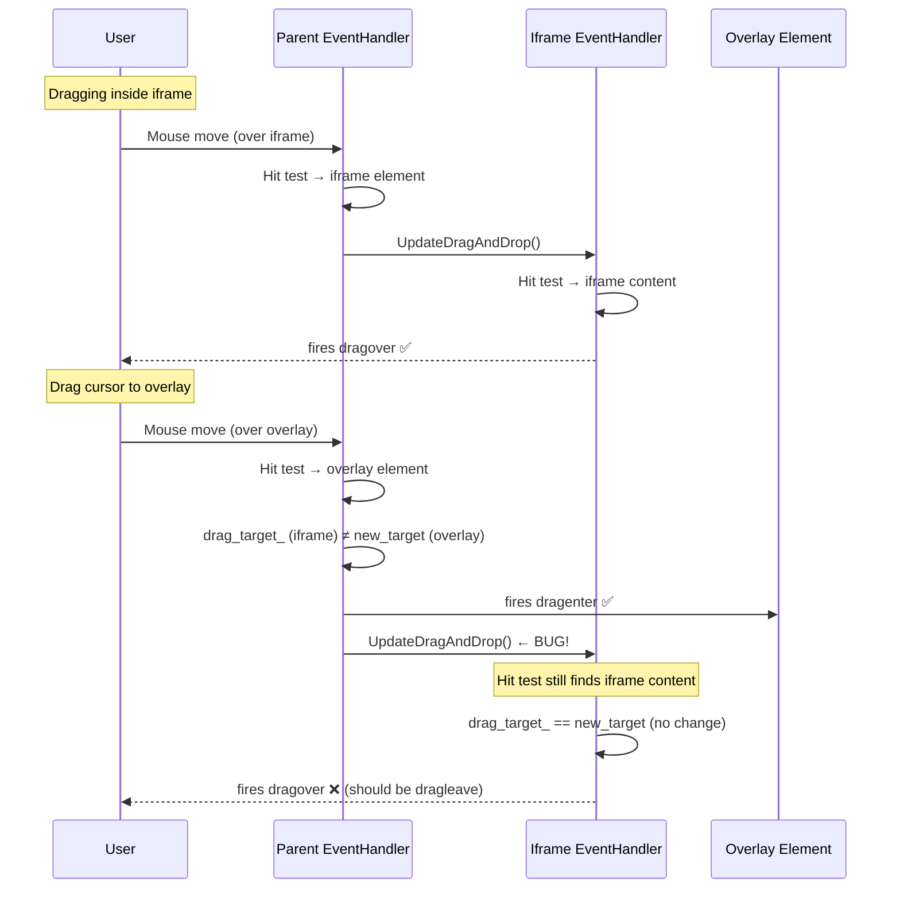
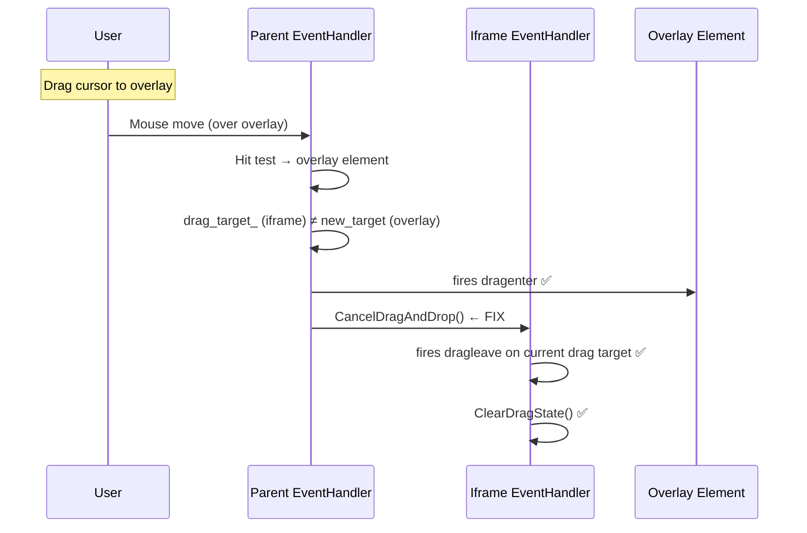

# Fix Assessment: 362302769

## Executive Summary
When dragging from inside an iframe to an element that overlaps the iframe (positioned on top via CSS), no `dragleave` event fires inside the iframe. The root cause is in `EventHandler::UpdateDragAndDrop()`: when the parent frame's drag target changes away from an iframe element, it calls `UpdateDragAndDrop()` on the child frame instead of `CancelDragAndDrop()`, so the child frame never knows the drag has left. The recommended fix is a one-line change to call `CancelDragAndDrop()` on the old child frame when the parent's drag target moves away from it.

## Bug Analysis

### Problem Statement
When a user starts a drag operation inside an iframe and drags the cursor onto a parent-window element that overlaps the iframe (e.g., a `position:absolute` element with higher z-index), no `dragleave` event is dispatched inside the iframe. Elements inside the iframe continue to believe they are being dragged over, leading to incorrect visual feedback and stale drag state.

### Expected Behavior
Per the [HTML drag-and-drop processing model](https://html.spec.whatwg.org/multipage/dnd.html#drag-and-drop-processing-model), when the drag leaves an element (or frame), a `dragleave` event should be fired on the element that was previously the drag target. Firefox 129+ correctly fires `dragleave` in this scenario.

### Actual Behavior
No `dragleave` event is fired inside the iframe when the drag cursor moves from the iframe content to an overlapping parent element. The iframe's drag target remains set to the last element the cursor was over, and `dragover` events continue to be dispatched as if the cursor is still inside the iframe.

### Triggering Conditions
1. A parent document contains an `<iframe>` element
2. A parent-document element overlaps the iframe (e.g., `position:absolute; z-index: 10`)
3. A drag operation begins inside the iframe
4. The user drags the cursor from the iframe area onto the overlapping parent element
5. The parent frame's hit test switches from the iframe to the overlapping element, but the child frame is not notified of the exit

## Root Cause Analysis

### Code Investigation
The drag event dispatch is handled by `EventHandler::UpdateDragAndDrop()` in the main frame. This function:
1. Performs a hit test to find `new_target` — the element currently under the cursor
2. Compares `new_target` with `drag_target_` (the previous target)
3. When targets differ, dispatches `dragenter` on the new target and `dragleave` on the old target
4. For frame elements (iframes), it recursively delegates to the child frame's EventHandler

The bug is in step 4: when `drag_target_` is a frame element and `new_target` is a different element, the code calls `UpdateDragAndDrop()` on the child frame's EventHandler instead of `CancelDragAndDrop()`. Inside the child frame's `UpdateDragAndDrop()`, a hit test is performed at the mouse coordinates — but since the iframe content still physically exists at those coordinates (it's just visually behind the overlapping element), the hit test finds the same element as before. The child frame sees no target change and fires `dragover` instead of `dragleave`.

### Key Files Identified
- [/third_party/blink/renderer/core/input/event_handler.cc#L1383](/third_party/blink/renderer/core/input/event_handler.cc#L1383) — `EventHandler::UpdateDragAndDrop()`, the main drag event dispatch logic
- [/third_party/blink/renderer/core/input/event_handler.cc#L1487](/third_party/blink/renderer/core/input/event_handler.cc#L1487) — `EventHandler::CancelDragAndDrop()`, cancels drag and fires `dragleave`
- [/third_party/blink/renderer/core/input/event_handler.cc#L1519](/third_party/blink/renderer/core/input/event_handler.cc#L1519) — `EventHandler::ClearDragState()`, resets drag state
- [/third_party/blink/renderer/core/input/event_handler.cc#L1362](/third_party/blink/renderer/core/input/event_handler.cc#L1362) — `LocalFrameFromTargetNode()`, extracts child frame from iframe elements
- [/third_party/blink/renderer/core/input/mouse_event_manager.cc#L1056](/third_party/blink/renderer/core/input/mouse_event_manager.cc#L1056) — `MouseEventManager::DispatchDragEvent()`, constructs and dispatches DragEvent
- [/third_party/blink/renderer/core/page/drag_controller.cc#L830](/third_party/blink/renderer/core/page/drag_controller.cc#L830) — `DragController::TryDHTMLDrag()`, entry point calling `UpdateDragAndDrop`

### Root Cause
**Location**: [/third_party/blink/renderer/core/input/event_handler.cc#L1438](/third_party/blink/renderer/core/input/event_handler.cc#L1438)
**Function**: `EventHandler::UpdateDragAndDrop()`
**Issue**: When `drag_target_` (old target) is an iframe element and `new_target` (current target) is a different element, the code at lines 1438-1440 calls `UpdateDragAndDrop()` on the child frame's EventHandler. This tells the child frame to continue processing drag events normally. Since the child frame's hit test still finds content at the mouse coordinates (the iframe content is behind the overlay but still exists), the child frame detects no target change and fires `dragover` instead of `dragleave`. The correct behavior is to call `CancelDragAndDrop()` which explicitly fires `dragleave` on the child frame's current drag target and clears its drag state.

The buggy code (lines 1438-1440):
```cpp
if (auto* target_frame = LocalFrameFromTargetNode(drag_target_.Get())) {
    event_result = target_frame->GetEventHandler().UpdateDragAndDrop(
        event, data_transfer);
}
```

Compare with the non-frame case (lines 1441-1452) which correctly fires `dragleave`:
```cpp
} else if (drag_target_) {
    mouse_event_manager_->DispatchDragEvent(
        event_type_names::kDragleave, drag_target_.Get(), related_target,
        event, data_transfer);
}
```

And `CancelDragAndDrop()` (lines 1487-1500) which does the right thing for frames:
```cpp
void EventHandler::CancelDragAndDrop(const WebMouseEvent& event,
                                     DataTransfer* data_transfer) {
  if (auto* target_frame = LocalFrameFromTargetNode(drag_target_.Get())) {
    target_frame->GetEventHandler().CancelDragAndDrop(event, data_transfer);
  } else if (drag_target_.Get()) {
    mouse_event_manager_->DispatchDragEvent(event_type_names::kDragleave,
                                            drag_target_.Get(), nullptr, event,
                                            data_transfer);
  }
  ClearDragState();
}
```

### Code Flow Diagram


**Fixed flow:**


## Fix Options

### Option 1: Call CancelDragAndDrop on old child frame ⭐ RECOMMENDED
- **Description**: Change line 1438-1440 in `EventHandler::UpdateDragAndDrop()` to call `CancelDragAndDrop()` on the child frame instead of `UpdateDragAndDrop()` when the parent's drag target has changed away from the iframe element.
- **Files to modify**:
  - [/third_party/blink/renderer/core/input/event_handler.cc#L1438](/third_party/blink/renderer/core/input/event_handler.cc#L1438)
- **Complexity**: Low (one-line change)
- **Risk**: Low — `CancelDragAndDrop()` is already used for exactly this purpose in `DragController::DragExited()` when the drag leaves the window entirely. The method recursively fires `dragleave` and clears drag state, which is the correct behavior when the drag has left a frame. The existing `drag-in-frames` web test already expects `dragleave` when leaving a frame.
- **Pros**: Minimal change, uses existing well-tested infrastructure, matches spec behavior, consistent with `DragExited()` behavior
- **Cons**: None significant. `CancelDragAndDrop()` returns `void` instead of `WebInputEventResult`, but the result from the old target's dragleave is not used meaningfully in the current code path.

### Option 2: Fire dragleave explicitly before recursing into child frame
- **Description**: Before calling `UpdateDragAndDrop()` on the child frame, first dispatch a `dragleave` event on the iframe element itself in the parent frame, then proceed with the recursive call.
- **Files to modify**:
  - [/third_party/blink/renderer/core/input/event_handler.cc#L1438](/third_party/blink/renderer/core/input/event_handler.cc#L1438)
- **Complexity**: Medium
- **Risk**: Medium — This would fire `dragleave` on the iframe element in the parent frame but would NOT fire `dragleave` on the content inside the iframe. The inner elements would still have stale drag state. This approach is incomplete.
- **Pros**: Fires dragleave at the iframe element level in the parent
- **Cons**: Doesn't notify elements inside the iframe, doesn't clean up child frame's drag state, incomplete fix

### Option 3: Modify child frame's UpdateDragAndDrop to detect occlusion
- **Description**: Enhance the hit test in `UpdateDragAndDrop()` to detect when the cursor position is occluded by a parent-frame element, and treat this case as the drag having left the frame.
- **Files to modify**:
  - [/third_party/blink/renderer/core/input/event_handler.cc#L1391](/third_party/blink/renderer/core/input/event_handler.cc#L1391)
  - Potentially hit test infrastructure files
- **Complexity**: High
- **Risk**: High — Modifying hit test behavior for drag events could have wide-ranging effects. The occlusion detection would need to consider many edge cases (partial overlap, transparent elements, pointer-events:none, etc.)
- **Pros**: Would handle other potential occlusion scenarios
- **Cons**: Very complex, high risk of regressions, not necessary when the parent frame already has the correct information

### Option 4: Add a "drag exited frame" notification from parent to child
- **Description**: Create a new method `NotifyDragExited()` on EventHandler that the parent frame calls to inform the child frame that the drag has left, keeping `UpdateDragAndDrop` and `CancelDragAndDrop` unchanged.
- **Files to modify**:
  - [/third_party/blink/renderer/core/input/event_handler.h](/third_party/blink/renderer/core/input/event_handler.h)
  - [/third_party/blink/renderer/core/input/event_handler.cc](/third_party/blink/renderer/core/input/event_handler.cc)
- **Complexity**: Medium
- **Risk**: Low — New method with clear semantics
- **Pros**: Clean API, no risk of changing existing CancelDragAndDrop/UpdateDragAndDrop behavior
- **Cons**: Unnecessary API surface when `CancelDragAndDrop()` already does exactly what's needed. Essentially a reimplementation of existing functionality.

## Recommended Approach
**Option 1** is strongly recommended. It is a minimal, surgical fix that leverages existing, well-tested infrastructure. The `CancelDragAndDrop()` method already exists for exactly this purpose — it recursively fires `dragleave` events and clears drag state when a drag operation leaves a frame. It is already used by `DragController::DragExited()` when the drag leaves the browser window entirely. Using it when the drag moves from an iframe to an overlapping parent element is the natural and correct approach.

The change is:
```cpp
// Before (line 1438-1440):
if (auto* target_frame = LocalFrameFromTargetNode(drag_target_.Get())) {
    event_result = target_frame->GetEventHandler().UpdateDragAndDrop(
        event, data_transfer);
}

// After:
if (auto* target_frame = LocalFrameFromTargetNode(drag_target_.Get())) {
    target_frame->GetEventHandler().CancelDragAndDrop(event, data_transfer);
}
```

The existing `drag-in-frames` web test (`third_party/blink/web_tests/fast/events/drag-in-frames.html`) already verifies that `dragleave` fires when dragging out of a frame. The fix should be compatible because in the frameset case (side-by-side frames, not overlapping), the `UpdateDragAndDrop()` path on the old frame already results in `dragleave` (since the mouse is outside the frame's viewport). With `CancelDragAndDrop()`, the same `dragleave` is fired more directly.

## Testing Strategy
- **Web tests needed**: A new web test should be added at `third_party/blink/web_tests/fast/events/drag-from-iframe-to-overlay.html` that:
  1. Creates an iframe with a draggable element
  2. Positions an overlay element on top of the iframe
  3. Simulates a drag from the iframe content to the overlay
  4. Verifies that `dragleave` fires inside the iframe
  5. Verifies that `dragenter` fires on the overlay
- **Existing test validation**: Run `third_party/blink/web_tests/fast/events/drag-in-frames.html` to confirm no regression in cross-frame drag behavior
- **Manual verification**: Open `repro.html`, drag the blue box from the iframe onto the red overlay, and confirm `dragleave` appears in the event log

## Related Code References
- Existing cross-frame drag test: [/third_party/blink/web_tests/fast/events/drag-in-frames.html](/third_party/blink/web_tests/fast/events/drag-in-frames.html)
- Spec reference: [HTML Drag and Drop Processing Model §7.9.4](https://html.spec.whatwg.org/multipage/dnd.html#drag-and-drop-processing-model)
- `DragController::DragExited()` using `CancelDragAndDrop()`: [/third_party/blink/renderer/core/page/drag_controller.cc#L234](/third_party/blink/renderer/core/page/drag_controller.cc#L234)
- Component: Blink>DataTransfer
