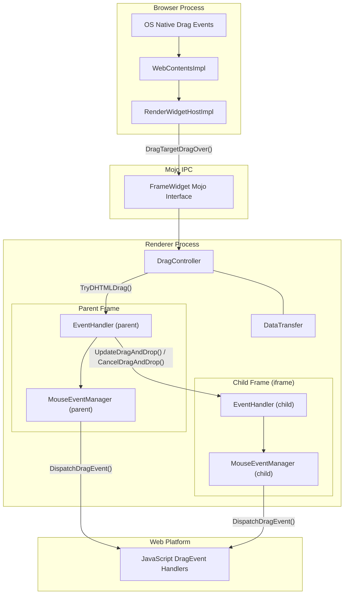
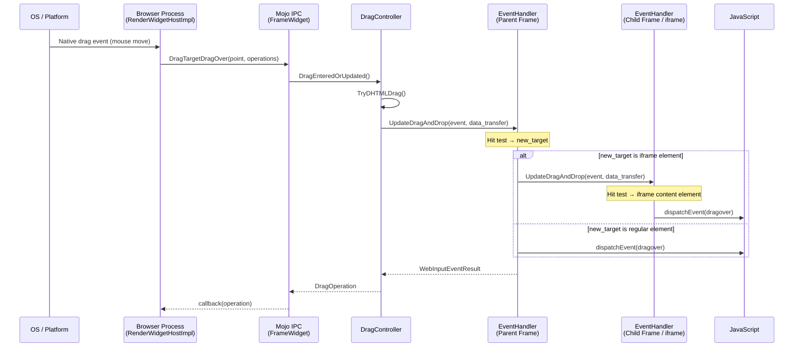
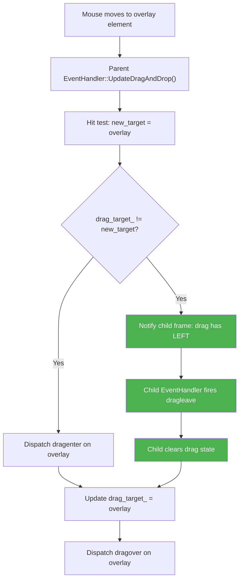
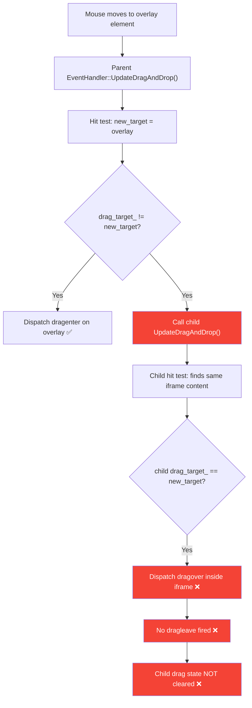
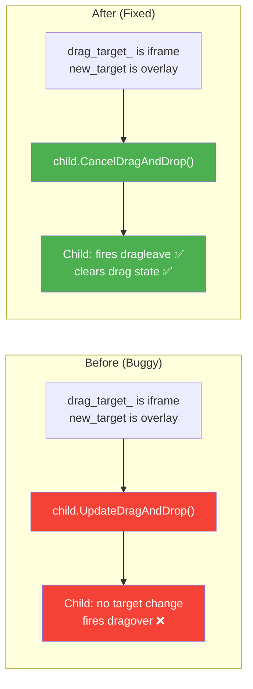

# High-Level Design: 362302769

## 1. Executive Summary

This bug occurs in Blink's drag-and-drop event dispatch subsystem within the Renderer Process. When a user drags from inside an iframe to an overlapping parent-document element, the child frame's `EventHandler` is not properly notified that the drag has exited, resulting in no `dragleave` event being fired inside the iframe. The root cause is in `EventHandler::UpdateDragAndDrop()` which calls `UpdateDragAndDrop()` (continue processing) instead of `CancelDragAndDrop()` (exit processing) on the old child frame when the parent's drag target changes away from it.

## 2. System Context

### 2.1 Overview

Chrome's drag-and-drop implementation spans two major layers:

1. **Browser Process (content/)** — Receives OS-native drag events, converts them to Mojo IPC messages, and routes them to the correct Renderer Process via `RenderWidgetHostImpl`.
2. **Renderer Process (third_party/blink/)** — Receives drag IPC messages via `FrameWidget` Mojo interface, processes them through `DragController` → `EventHandler` → `MouseEventManager`, and dispatches W3C `DragEvent`s to JavaScript.

The bug is entirely within the **Renderer Process** layer, specifically in the recursive cross-frame drag event dispatch logic inside `EventHandler::UpdateDragAndDrop()`. No IPC or Browser Process changes are needed.

### 2.2 Related Specs
- [HTML Drag and Drop Processing Model (§7.9.4)](https://html.spec.whatwg.org/multipage/dnd.html#drag-and-drop-processing-model)
- [W3C Drag Events](https://www.w3.org/TR/html52/editing.html#drag-and-drop)

## 3. Component Architecture

### 3.1 Major Components

| Component | Location | Responsibility |
|-----------|----------|----------------|
| `RenderWidgetHostImpl` | `content/browser/renderer_host/render_widget_host_impl.cc` | Browser-side drag routing via Mojo IPC |
| `FrameWidget` (Mojo) | `third_party/blink/public/mojom/page/widget.mojom` | IPC interface: `DragTargetDragEnter`, `DragTargetDragOver`, `DragTargetDrop` |
| `DragController` | `third_party/blink/renderer/core/page/drag_controller.cc` | Renderer-side entry point; manages drag state, calls `EventHandler` |
| `EventHandler` | `third_party/blink/renderer/core/input/event_handler.cc` | **Core dispatch logic** — hit-tests, determines targets, dispatches enter/leave/over events across frames |
| `MouseEventManager` | `third_party/blink/renderer/core/input/mouse_event_manager.cc` | Constructs and dispatches `DragEvent` DOM events |
| `DataTransfer` | `third_party/blink/renderer/core/clipboard/data_transfer.cc` | Manages drag payload and access policies |
| `LocalFrame` | `third_party/blink/renderer/core/frame/local_frame.cc` | Per-frame context; each iframe has its own `LocalFrame` and `EventHandler` |

### 3.2 Component Diagram

## 4. Process Architecture

### 4.1 Process Boundaries

| Process | Role | Key Classes |
|---------|------|-------------|
| **Browser Process** | Receives OS drag events, enforces security, routes to correct renderer | `RenderWidgetHostImpl`, `WebContentsImpl`, `WebContentsViewDragSecurityInfo` |
| **Renderer Process** | Processes drag events, runs hit tests, dispatches DOM events | `DragController`, `EventHandler`, `MouseEventManager` |

Cross-process communication uses the `FrameWidget` Mojo interface defined in `widget.mojom`. The browser calls methods like `DragTargetDragEnter()`, `DragTargetDragOver()`, and `DragTargetDrop()` on the renderer. The renderer calls `WidgetHost::StartDragging()` to initiate OS-native drag.

**Important**: Cross-**frame** dispatch (parent frame ↔ iframe) happens entirely within a single Renderer Process. Each `LocalFrame` has its own `EventHandler` instance, and `EventHandler::UpdateDragAndDrop()` recursively delegates to child frames.

### 4.2 IPC Flow — Normal Drag-Over Operation

## 5. Data Flow

### 5.1 Normal Flow (Expected) — Drag Leaves Iframe to Overlay

When the drag target changes from an iframe to an overlapping parent element, the expected behavior per the HTML spec is:

### 5.2 Buggy Flow (Current) — Drag Leaves Iframe to Overlay

### 5.3 Fix — Change One Call Site

## 6. Key Interfaces

### 6.1 Public APIs (Web Platform)
- `DragEvent` — DOM event type dispatched to JavaScript: `dragstart`, `drag`, `dragenter`, `dragleave`, `dragover`, `drop`, `dragend`
- `DataTransfer` — JavaScript API for accessing drag payload

### 6.2 Internal Interfaces (Blink C++)

| Method | File | Description |
|--------|------|-------------|
| `EventHandler::UpdateDragAndDrop(event, data_transfer)` | `event_handler.cc:1383` | Main dispatch: hit-tests, compares old/new target, dispatches events, recurses into child frames |
| `EventHandler::CancelDragAndDrop(event, data_transfer)` | `event_handler.cc:1487` | Fires `dragleave` on current drag target, recurses into child frames, calls `ClearDragState()` |
| `EventHandler::PerformDragAndDrop(event, data_transfer)` | `event_handler.cc:1503` | Fires `drop` event, clears state |
| `EventHandler::ClearDragState()` | `event_handler.cc:1519` | Resets `drag_target_`, stops autoscroll |
| `MouseEventManager::DispatchDragEvent(type, target, related, event, dt)` | `mouse_event_manager.cc:1056` | Constructs and dispatches a `DragEvent` to the DOM |
| `MouseEventManager::DispatchDragSrcEvent(type, event)` | `mouse_event_manager.cc` | Dispatches `drag`/`dragend` on the drag source element |
| `DragController::TryDHTMLDrag(event, data)` | `drag_controller.cc:830` | Entry point: creates `DataTransfer`, calls `EventHandler::UpdateDragAndDrop()` on the local root frame |
| `DragController::DragExited(data)` | `drag_controller.cc:234` | Called when drag leaves window: calls `EventHandler::CancelDragAndDrop()` |
| `LocalFrameFromTargetNode(target)` | `event_handler.cc:1362` | Static helper: extracts `LocalFrame*` from iframe/plugin elements |

### 6.3 Mojo IPC Interface (Browser ↔ Renderer)

| Method | Direction | Description |
|--------|-----------|-------------|
| `FrameWidget::DragTargetDragEnter()` | Browser → Renderer | Drag enters widget viewport |
| `FrameWidget::DragTargetDragOver()` | Browser → Renderer | Drag moves within viewport |
| `FrameWidget::DragTargetDrop()` | Browser → Renderer | User releases drag |
| `FrameWidget::DragTargetDragLeave()` | Browser → Renderer | Drag exits viewport |
| `WidgetHost::StartDragging()` | Renderer → Browser | Initiate OS-native drag |

## 7. Threading Model

All drag event processing occurs on the **main thread** of both Browser and Renderer processes:

- **Browser main thread**: Receives OS drag events, routes via `RenderWidgetHostImpl` to Mojo
- **Renderer main thread**: All Blink logic — hit testing, event dispatch, JavaScript event handlers — runs on the main thread
- **No worker threads** are involved in drag-and-drop processing
- **Synchronization**: Mojo async callbacks handle Browser ↔ Renderer synchronization. Within the Renderer, all cross-frame dispatch is synchronous (recursive calls within the same thread)

## 8. External Dependencies

### Other Chrome Components
- **Hit Testing** (`third_party/blink/renderer/core/layout/`) — Used by `UpdateDragAndDrop()` to determine which element is under the cursor
- **Compositing / Paint** — Determines visual stacking order (z-index, `position:absolute`) that causes the overlay to occlude the iframe
- **Frame Tree** (`third_party/blink/renderer/core/frame/`) — `LocalFrame` hierarchy that enables cross-frame dispatch
- **Shadow DOM** (`third_party/blink/renderer/core/dom/shadow_root.h`) — Retargeting logic for drag targets inside shadow trees

### Platform APIs
- OS-native drag-and-drop APIs (platform-specific: Aura/X11/Wayland on Linux, Cocoa on Mac, etc.)

### Third-Party Libraries
- None directly involved in the affected code path

## 9. Impact of Fix

### 9.1 Components Affected

| Component | Change | Risk |
|-----------|--------|------|
| `EventHandler::UpdateDragAndDrop()` | Change `UpdateDragAndDrop()` → `CancelDragAndDrop()` on old child frame (lines 1438-1440) | Low |

Only **one method call** in **one file** is modified. No API changes, no new interfaces, no IPC changes.

### 9.2 Risk Assessment

- **Scope**: Narrow — single call site in `event_handler.cc`
- **Risk Level**: Low
  - `CancelDragAndDrop()` is already used for the same purpose in `DragController::DragExited()` when drag leaves the browser window
  - The method recursively fires `dragleave` and clears state, which is the correct semantic for "drag has left this frame"
  - Existing web test `fast/events/drag-in-frames.html` validates cross-frame drag behavior
- **Testing Coverage**:
  - Existing: `third_party/blink/web_tests/fast/events/drag-in-frames.html` (cross-frame drag)
  - New test needed: `drag-from-iframe-to-overlay.html` to verify `dragleave` fires when dragging to overlapping parent element
  - Manual: Reproduce scenario with iframe + overlay element, confirm `dragleave` fires
