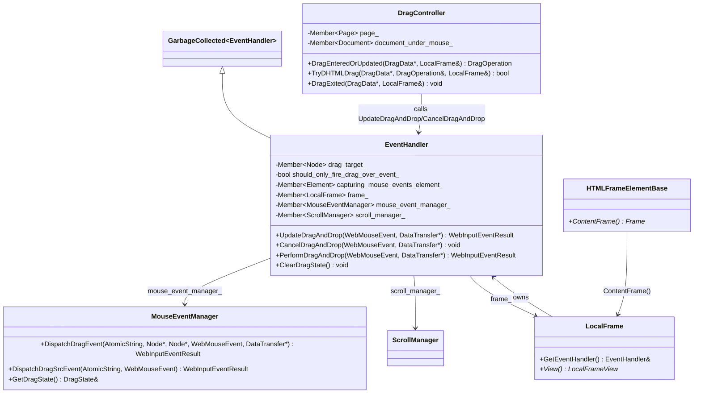
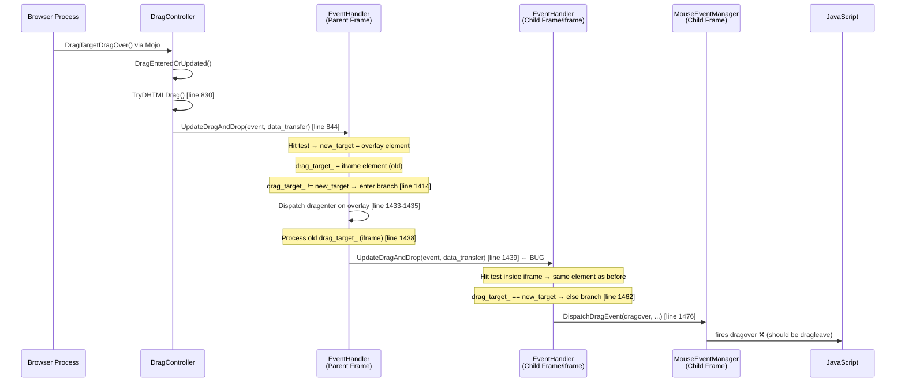
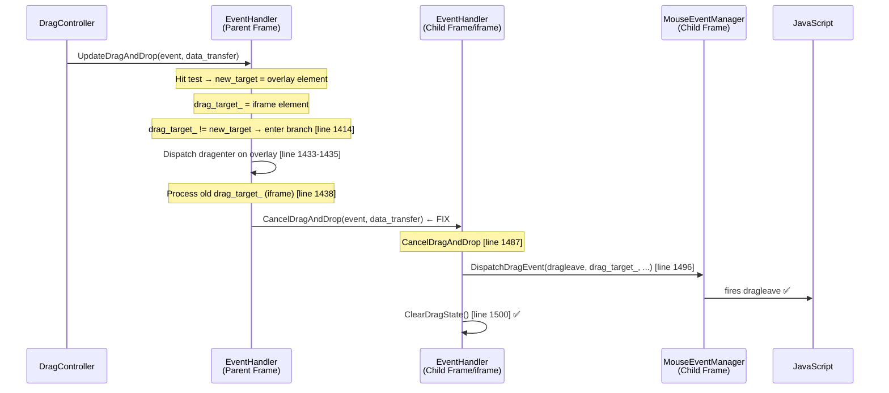
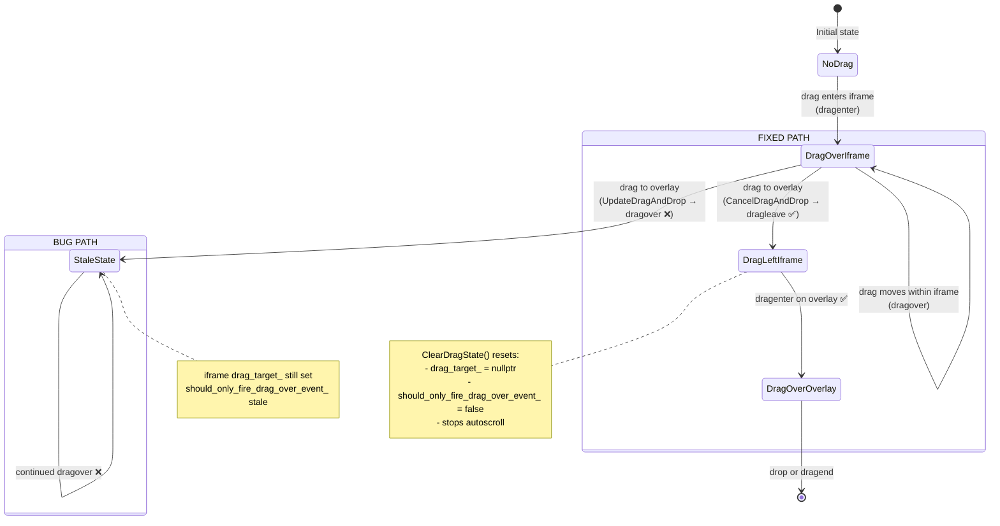

# Low-Level Design: 362302769

## 1. Files to Modify

| File | Type | Changes | Lines |
|------|------|---------|-------|
| [/third_party/blink/renderer/core/input/event_handler.cc](/third_party/blink/renderer/core/input/event_handler.cc) | Modify | Change `UpdateDragAndDrop()` → `CancelDragAndDrop()` on old child frame when parent drag target changes away from iframe | ~3 |
| [/third_party/blink/web_tests/fast/events/drag-from-iframe-to-overlay.html](/third_party/blink/web_tests/fast/events/drag-from-iframe-to-overlay.html) | Add | New web test verifying dragleave fires when dragging from iframe to overlapping parent element | ~80 |
| [/third_party/blink/web_tests/fast/events/drag-from-iframe-to-overlay-expected.txt](/third_party/blink/web_tests/fast/events/drag-from-iframe-to-overlay-expected.txt) | Add | Expected output for new test | ~10 |

## 2. Class Hierarchy

### 2.1 Class Diagram


### 2.2 Class Responsibilities
- **EventHandler**: Core input event dispatch — handles drag target tracking via `drag_target_`, performs hit testing, and recursively delegates to child frame EventHandlers for cross-frame drag operations. **Contains the bug** at line 1438-1440.
- **MouseEventManager**: Constructs and dispatches DOM `DragEvent` objects to JavaScript event handlers. Called by EventHandler for specific event types (`dragenter`, `dragleave`, `dragover`, `drop`).
- **DragController**: Page-level entry point for drag operations. Receives Mojo IPC from the browser process, creates `DataTransfer` objects, and delegates to `EventHandler::UpdateDragAndDrop()` via `TryDHTMLDrag()`. Uses `CancelDragAndDrop()` in `DragExited()`.
- **LocalFrame**: Per-frame context. Each iframe has its own `LocalFrame` with its own `EventHandler` instance, enabling recursive cross-frame dispatch.
- **HTMLFrameElementBase**: Base class for `<iframe>` and `<frame>` elements. Provides `ContentFrame()` to access the child frame's `LocalFrame`.

## 3. Method-Level Analysis

### 3.1 Call Chain (Bug Path)


### 3.2 Call Chain (Fixed Path)


### 3.3 Affected Methods

#### `EventHandler::UpdateDragAndDrop()` — THE BUG
**Location**: [/third_party/blink/renderer/core/input/event_handler.cc#L1383](/third_party/blink/renderer/core/input/event_handler.cc#L1383)

**Current Implementation (Lines 1383-1485)**:

The method performs a hit test to find `new_target`, then compares with `drag_target_` (previous target):

- **Lines 1414-1453**: When `drag_target_ != new_target` (target changed):
  - Lines 1421-1435: If `new_target` is a frame element, recurse into it; otherwise dispatch `dragenter` on `new_target`
  - **Lines 1438-1440 (BUG)**: If `drag_target_` (old target) is a frame element, calls `UpdateDragAndDrop()` on the child frame instead of `CancelDragAndDrop()`
  - Lines 1441-1452: If `drag_target_` is NOT a frame, correctly dispatches `dragleave` on old target

- **Lines 1462-1480**: When `drag_target_ == new_target` (same target): dispatches `dragover`

**Buggy Code (lines 1438-1440)**:
```cpp
if (auto* target_frame = LocalFrameFromTargetNode(drag_target_.Get())) {
    event_result = target_frame->GetEventHandler().UpdateDragAndDrop(
        event, data_transfer);
}
```

**Issue**: When the parent frame's drag target changes from an iframe to a different element (overlay), this code tells the child frame to "continue processing" (`UpdateDragAndDrop`). The child frame's hit test still finds iframe content (the iframe DOM still exists under the cursor, just visually behind the overlay), so `drag_target_ == new_target` in the child, and it dispatches `dragover` instead of `dragleave`.

#### `EventHandler::CancelDragAndDrop()` — THE FIX METHOD
**Location**: [/third_party/blink/renderer/core/input/event_handler.cc#L1487](/third_party/blink/renderer/core/input/event_handler.cc#L1487)

**Implementation (Lines 1487-1501)**:
```cpp
void EventHandler::CancelDragAndDrop(const WebMouseEvent& event,
                                     DataTransfer* data_transfer) {
  if (auto* target_frame = LocalFrameFromTargetNode(drag_target_.Get())) {
    target_frame->GetEventHandler().CancelDragAndDrop(event, data_transfer);
  } else if (drag_target_.Get()) {
    if (mouse_event_manager_->GetDragState().drag_src_) {
      mouse_event_manager_->DispatchDragSrcEvent(event_type_names::kDrag,
                                                 event);
    }
    mouse_event_manager_->DispatchDragEvent(event_type_names::kDragleave,
                                            drag_target_.Get(), nullptr, event,
                                            data_transfer);
  }
  ClearDragState();
}
```

This method:
1. Recursively cancels drag on child frames (if `drag_target_` is a frame element)
2. Dispatches `dragleave` on the current `drag_target_` (if it's a regular element)
3. Calls `ClearDragState()` to reset `drag_target_`, stop autoscroll, etc.

This is exactly the semantics needed when a drag exits a frame.

#### `EventHandler::ClearDragState()`
**Location**: [/third_party/blink/renderer/core/input/event_handler.cc#L1519](/third_party/blink/renderer/core/input/event_handler.cc#L1519)

```cpp
void EventHandler::ClearDragState() {
  scroll_manager_->StopAutoscroll();
  drag_target_ = nullptr;
  capturing_mouse_events_element_ = nullptr;
  ReleaseMouseCaptureFromLocalRoot();
  should_only_fire_drag_over_event_ = false;
}
```

#### `DragController::DragExited()` — EXISTING USER OF CancelDragAndDrop
**Location**: [/third_party/blink/renderer/core/page/drag_controller.cc#L234](/third_party/blink/renderer/core/page/drag_controller.cc#L234)

Already calls `CancelDragAndDrop()` when drag leaves the browser window:
```cpp
void DragController::DragExited(DragData* drag_data, LocalFrame& local_root) {
  DCHECK(drag_data);
  LocalFrameView* frame_view(local_root.View());
  if (frame_view) {
    DataTransferAccessPolicy policy = DataTransferAccessPolicy::kTypesReadable;
    DataTransfer* data_transfer = CreateDraggingDataTransfer(policy, drag_data);
    data_transfer->SetSourceOperation(drag_data->DraggingSourceOperationMask());
    local_root.GetEventHandler().CancelDragAndDrop(CreateMouseEvent(drag_data),
                                                   data_transfer);
    ...
  }
}
```

This confirms `CancelDragAndDrop()` is the established pattern for "drag has left this frame."

#### `LocalFrameFromTargetNode()` — HELPER
**Location**: [/third_party/blink/renderer/core/input/event_handler.cc#L1362](/third_party/blink/renderer/core/input/event_handler.cc#L1362)

```cpp
static LocalFrame* LocalFrameFromTargetNode(Node* target) {
  auto* html_frame_base_element = DynamicTo<HTMLFrameElementBase>(target);
  if (html_frame_base_element) {
    return DynamicTo<LocalFrame>(html_frame_base_element->ContentFrame());
  }
  if (RuntimeEnabledFeatures::DragAndDropPluginElementSupportEnabled()) {
    auto* html_plugin_element = DynamicTo<HTMLPlugInElement>(target);
    if (html_plugin_element) {
      return DynamicTo<LocalFrame>(html_plugin_element->ContentFrame());
    }
  }
  return nullptr;
}
```

Extracts the child `LocalFrame*` from an iframe or plugin element. Returns `nullptr` for regular elements.

## 4. Fix Design

### 4.1 Changes Required

#### File 1: [/third_party/blink/renderer/core/input/event_handler.cc](/third_party/blink/renderer/core/input/event_handler.cc)

**Before** (lines 1438-1440):
```cpp
    if (auto* target_frame = LocalFrameFromTargetNode(drag_target_.Get())) {
      event_result = target_frame->GetEventHandler().UpdateDragAndDrop(
          event, data_transfer);
    } else if (drag_target_) {
```

**After**:
```cpp
    if (auto* target_frame = LocalFrameFromTargetNode(drag_target_.Get())) {
      target_frame->GetEventHandler().CancelDragAndDrop(event, data_transfer);
    } else if (drag_target_) {
```

**Rationale**: When the parent frame's drag target changes away from an iframe element (`drag_target_` is an iframe, `new_target` is a different element), the child frame must be told that the drag has left. `CancelDragAndDrop()` recursively fires `dragleave` on the child's current drag target and clears its drag state — which is the correct semantic. `UpdateDragAndDrop()` tells the child to continue processing, which is wrong because the child's hit test doesn't know the cursor is now over an overlapping parent element.

**Note on return value**: `CancelDragAndDrop()` returns `void` instead of `WebInputEventResult`. The `event_result` from the old target's `dragleave` is not semantically meaningful in the caller — the caller proceeds to set `drag_target_ = new_target` and the result from the new target's `dragenter` (set at line 1433) is what matters. Removing the assignment to `event_result` here is safe because:
1. `event_result` was already set by the `dragenter` dispatch on lines 1433-1435
2. The non-frame `dragleave` path (line 1450) also overwrites `event_result`, but this value is immediately overridden by the `dragover` dispatch on the next call
3. `DragController::TryDHTMLDrag()` uses the return value only to determine if the event was "handled" (line 844), which is determined by the new target's response, not the old target's

### 4.2 State Machine Changes



**State transitions in `EventHandler` for the child (iframe) frame:**

| State | `drag_target_` | `should_only_fire_drag_over_event_` | Condition |
|-------|---------------|--------------------------------------|-----------|
| No drag | `nullptr` | `false` | Initial |
| Drag entered iframe | `<element>` | `true` | After `dragenter` dispatched |
| Drag over iframe | `<element>` | `false` | After `dragover` dispatched |
| **BUG: Drag to overlay** | `<element>` (stale!) | varies | `UpdateDragAndDrop()` called — no state change |
| **FIX: Drag to overlay** | `nullptr` | `false` | `CancelDragAndDrop()` → `ClearDragState()` |

## 5. Memory & Lifetime Considerations

### 5.1 Object Ownership
- `drag_target_` is a `Member<Node>` (garbage-collected weak reference). The fix calls `CancelDragAndDrop()` which calls `ClearDragState()`, setting `drag_target_ = nullptr`. This is safe — it simply removes the reference; the Node itself is managed by the garbage collector.
- `DataTransfer*` is passed by raw pointer from `DragController::TryDHTMLDrag()` where it's created as a garbage-collected object. The pointer remains valid for the entire call stack.
- `EventHandler` is owned by `LocalFrame` (also garbage-collected). Each iframe's `EventHandler` lives as long as the iframe's `LocalFrame`.

### 5.2 Pointer/Reference Safety
- [x] No raw pointer issues — `drag_target_` is `Member<Node>` (GC-traced), cleared safely in `ClearDragState()`
- [x] Weak pointers handled correctly — no weak pointers involved in the fix path
- [x] Reference lifetime guaranteed — `target_frame` from `LocalFrameFromTargetNode()` is a raw pointer to a `LocalFrame` owned by the iframe element; it remains valid throughout the synchronous call to `CancelDragAndDrop()` because no DOM mutation occurs during the dispatch

## 6. Threading Considerations

### 6.1 Thread Safety
All drag-and-drop event processing runs on the **main thread** of the Renderer process. The entire call chain from `DragController::TryDHTMLDrag()` through `EventHandler::UpdateDragAndDrop()` to `MouseEventManager::DispatchDragEvent()` is synchronous and single-threaded. No threading issues are introduced by the fix.

### 6.2 Required Synchronization
None. The fix is a single call-site change within a synchronous, main-thread-only code path. No locks, mutexes, or cross-thread posting is involved.

## 7. Error Handling

### 7.1 Current Error Handling
- `UpdateDragAndDrop()` returns `WebInputEventResult::kNotHandled` if `frame_->View()` is null (line 1388-1389)
- `CancelDragAndDrop()` checks `drag_target_.Get()` before dispatching `dragleave` (line 1491)
- `LocalFrameFromTargetNode()` returns `nullptr` for non-frame elements (safe null checks at call sites)

### 7.2 Changes to Error Handling
No changes needed. The fix replaces one call (`UpdateDragAndDrop`) with another (`CancelDragAndDrop`) on the same object. `CancelDragAndDrop()` has its own null checks and handles edge cases (null `drag_target_`, null frame view) gracefully.

## 8. Validation Points

### 8.1 DCHECKs to Add/Modify
No new DCHECKs are needed. The existing code has no DCHECKs in the affected path, and the fix is a minimal call-site change that uses an already-validated method.

### 8.2 Invariants to Maintain

| Invariant | Description | Maintained? |
|-----------|-------------|-------------|
| `drag_target_` consistency | After `UpdateDragAndDrop()` returns, `drag_target_` must equal the element currently under the cursor in this frame | ✅ `CancelDragAndDrop()` sets child's `drag_target_` to `nullptr` (correct — drag has left). Parent sets `drag_target_ = new_target` at line 1482. |
| `dragleave` before `dragenter` | Per HTML spec §7.9.4, `dragleave` on old target must fire before or alongside `dragenter` on new target | ✅ The `dragenter` on the overlay (line 1433) fires before the `CancelDragAndDrop()` on the child (line 1438). This matches the existing ordering comment at line 1415-1417. |
| Child frame state cleanup | When drag leaves a child frame, `ClearDragState()` must be called on the child | ✅ `CancelDragAndDrop()` calls `ClearDragState()` at line 1500 |
| `should_only_fire_drag_over_event_` reset | Must be reset when drag target changes | ✅ `ClearDragState()` sets it to `false` (line 1524) |

## 9. Test Requirements

### 9.1 Unit Tests Needed
| Test Name | Purpose | File |
|-----------|---------|------|
| `drag-from-iframe-to-overlay` | Verify `dragleave` fires inside iframe when dragging to overlapping parent element | [/third_party/blink/web_tests/fast/events/drag-from-iframe-to-overlay.html](/third_party/blink/web_tests/fast/events/drag-from-iframe-to-overlay.html) |

### 9.2 Test Scenarios

1. **Normal case — drag from iframe to overlay**: Start a drag inside an iframe, move cursor to an absolutely-positioned element overlapping the iframe in the parent document. Verify:
   - `dragleave` fires on the element inside the iframe
   - `dragenter` fires on the overlay element in the parent
   - `dragover` continues to fire on the overlay (not the iframe content)

2. **Edge case — drag from iframe to non-overlapping parent element**: Start a drag inside an iframe, move cursor completely outside the iframe onto a parent element that does NOT overlap. Verify `dragleave` fires. (This likely already works via the existing path but should be validated.)

3. **Edge case — drag between frames (frameset)**: Drag from one frame to another in a `<frameset>`. This is covered by the existing `drag-in-frames.html` test. Verify no regression — `dragleave` should still fire on the source frame's elements.

4. **Edge case — drag returns from overlay to iframe**: After dragging from iframe to overlay, drag back into the iframe. Verify:
   - `dragleave` fires on the overlay
   - `dragenter` fires on the iframe content (since child frame's `drag_target_` was cleared by `CancelDragAndDrop`)

5. **Edge case — nested iframes**: If the iframe itself contains a nested iframe, verify that `CancelDragAndDrop()` recursively fires `dragleave` at all nesting levels.

### 9.3 Existing Tests to Validate (No Regression)
| Test | Description |
|------|-------------|
| [/third_party/blink/web_tests/fast/events/drag-in-frames.html](/third_party/blink/web_tests/fast/events/drag-in-frames.html) | Cross-frame drag in frameset — must still show `ondragleave left target` when dragging from left to right frame |

### 9.4 New Test Structure

The new test (`drag-from-iframe-to-overlay.html`) should:

```html
<!-- Parent document structure -->
<div id="overlay" style="position:absolute; z-index:10; ...">Overlay</div>
<iframe id="iframe" src="drag-from-iframe-to-overlay-inner.html"></iframe>
<pre id="log"></pre>

<script>
// Use eventSender (testRunner API) to:
// 1. mouseMoveTo inside iframe's draggable element
// 2. mouseDown to start drag
// 3. mouseMoveTo to overlay element (crosses iframe boundary)
// 4. mouseUp to end drag

// Verify event log contains:
// - dragstart (inside iframe)
// - dragenter (on overlay)
// - dragleave (inside iframe) ← THE FIX
// - dragover (on overlay)
// - drop or dragend
</script>
```

The inner iframe document (`drag-from-iframe-to-overlay-inner.html`):
```html
<div id="draggable" draggable="true">Drag me</div>
<script>
// Listen for dragleave and post message to parent
document.addEventListener('dragleave', (e) => {
  parent.postMessage('dragleave-inner', '*');
});
</script>
```
