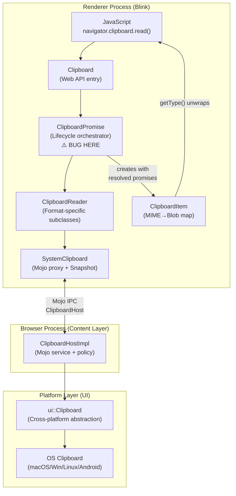
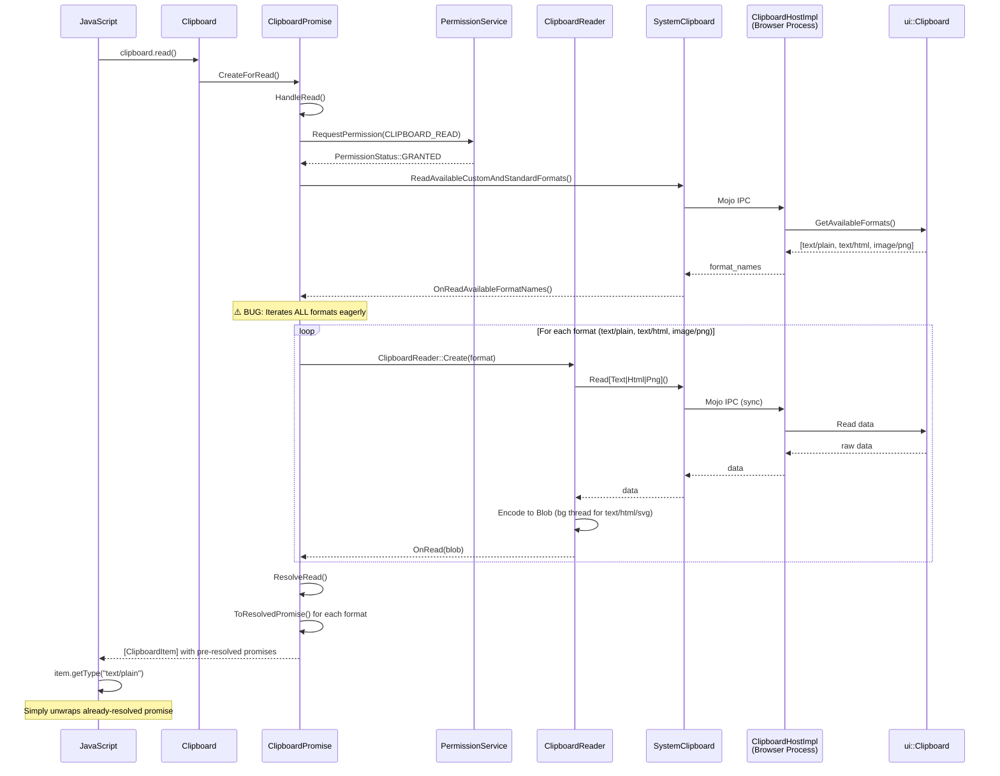
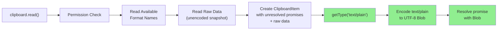
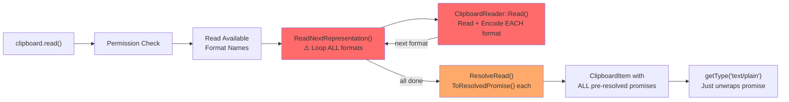
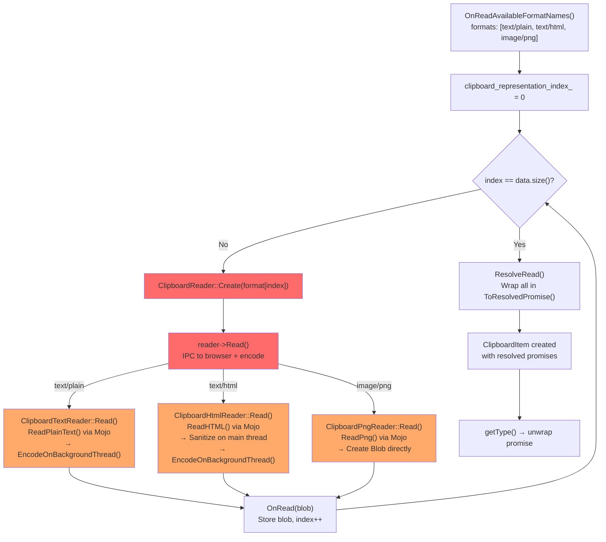

# High-Level Design: 40105911

## 1. Executive Summary

Bug 40105911 reports that `ClipboardItem` prematurely generates (reads and encodes) ALL available clipboard formats when `navigator.clipboard.read()` is called, regardless of whether the web page will actually consume them via `ClipboardItem.getType()`. The issue lies in the Blink clipboard module's read pipeline (`ClipboardPromise`), which eagerly iterates all formats, creates format-specific `ClipboardReader` instances that read from the system clipboard AND encode data into Blobs, then wraps the results as already-resolved promises in the returned `ClipboardItem`. This is a performance optimization request (P3/S4) — the API is functionally correct per the W3C Clipboard API spec.

**Verdict: WON'T FIX** — The issue still exists in the current codebase, but is a low-priority architectural optimization with partial mitigations already in place. See `01-fix-assessment.md` for full rationale.

## 2. System Context

### 2.1 Overview

The Async Clipboard API (`navigator.clipboard`) is a Web Platform API that provides asynchronous, promise-based access to the system clipboard from web pages. In Chromium, this API spans three architectural layers:

1. **Blink (Renderer Process)** — Implements the JavaScript-facing `Clipboard`, `ClipboardItem`, and `ClipboardPromise` classes; handles format encoding/decoding; manages read/write lifecycle.
2. **Content Layer (Browser Process)** — `ClipboardHostImpl` acts as the Mojo service endpoint, enforcing security policies and delegating to the platform clipboard.
3. **UI Layer (Platform Abstraction)** — `ui::Clipboard` provides a cross-platform interface to the OS clipboard (macOS, Windows, Linux/Ozone, Android).

The bug occurs entirely in layer 1 (Blink renderer), specifically in the orchestration logic that reads all formats before constructing the `ClipboardItem`.

### 2.2 Related Specs
- [W3C Clipboard API and Events](https://w3c.github.io/clipboard-apis/)
- [Proposed Similar Format Model Design Doc](https://docs.google.com/document/d/1XOMFG9-7NYyvqE_pv0qz3M626NZHx7P20uuUmDAyt8Q/edit)
- [Original Bug Report (Monorail)](https://crbug.com/chromium/1020703)
- [Issue Tracker](https://issues.chromium.org/issues/40105911)

## 3. Component Architecture

### 3.1 Major Components

| Component | Location | Responsibility |
|-----------|----------|----------------|
| `Clipboard` | `/third_party/blink/renderer/modules/clipboard/clipboard.{h,cc}` | Web API entry point; dispatches `read()`/`write()` to `ClipboardPromise` |
| `ClipboardPromise` | `/third_party/blink/renderer/modules/clipboard/clipboard_promise.{h,cc}` | Orchestrates async read/write lifecycle; manages permissions; owns reader/writer instances; **bug location** |
| `ClipboardReader` | `/third_party/blink/renderer/modules/clipboard/clipboard_reader.{h,cc}` | Abstract base with format-specific subclasses (`ClipboardPngReader`, `ClipboardTextReader`, `ClipboardHtmlReader`, `ClipboardSvgReader`, `ClipboardCustomFormatReader`); reads from system clipboard AND encodes into Blobs |
| `ClipboardItem` | `/third_party/blink/renderer/modules/clipboard/clipboard_item.{h,cc}` | JavaScript-facing object; holds MIME type → Promise\<Blob\> map; `getType()` unwraps pre-resolved promises |
| `SystemClipboard` | `/third_party/blink/renderer/core/clipboard/system_clipboard.{h,cc}` | Renderer-side proxy to browser process; holds `HeapMojoRemote<ClipboardHost>`; provides snapshot caching for atomic reads |
| `ClipboardHostImpl` | `/content/browser/renderer_host/clipboard_host_impl.{h,cc}` | Browser-side Mojo service; implements `blink::mojom::ClipboardHost`; enforces security policies; delegates to `ui::Clipboard` |
| `ui::Clipboard` | `/ui/base/clipboard/clipboard.{h,cc}` | Cross-platform clipboard abstraction; routes to OS-specific implementations |
| `blink::mojom::ClipboardHost` | `/third_party/blink/public/mojom/clipboard/clipboard.mojom` | Mojo IPC interface between renderer and browser for clipboard operations |

### 3.2 Component Diagram

## 4. Process Architecture

### 4.1 Process Boundaries

The clipboard read operation crosses one major process boundary:

- **Renderer Process** — All JavaScript API surface, format encoding/decoding, promise lifecycle management, and the `SystemClipboard` Mojo proxy live here.
- **Browser Process** — `ClipboardHostImpl` receives Mojo calls, applies security policies (permissions, data transfer policies), and delegates to `ui::Clipboard` for platform clipboard access.

The Mojo interface `blink::mojom::ClipboardHost` defines the IPC contract. Key methods used in the read path:
- `ReadAvailableCustomAndStandardFormats()` — Returns list of available format MIME types
- `ReadText()` — Reads plain text (sync Mojo call)
- `ReadHtml()` — Reads HTML with URL context (sync Mojo call)
- `ReadPng()` — Reads image as PNG bytes (sync Mojo call)
- `ReadSvg()` — Reads SVG content (sync Mojo call)
- `ReadUnsanitizedCustomFormat()` — Reads raw custom format (sync Mojo call)
- `GetSequenceNumber()` — Gets clipboard version for change detection

### 4.2 IPC Flow

## 5. Data Flow

### 5.1 Normal Flow (Expected per Bug Report)

The bug author proposed that encoding should be deferred until `getType()` is called:

### 5.2 Buggy Flow (Current Implementation)

All formats are eagerly read and encoded before `ClipboardItem` is even constructed:

### 5.3 Detailed Read Loop (Current)

## 6. Key Interfaces

### 6.1 Public APIs (Web-Facing)

- `navigator.clipboard.read(options?)` → `Promise<ClipboardItem[]>` — Reads all available clipboard formats; `options.types` can filter formats when `SelectiveClipboardFormatRead` feature is enabled
- `ClipboardItem.types` → `FrozenArray<DOMString>` — Lists available MIME types
- `ClipboardItem.getType(type)` → `Promise<Blob>` — Returns Blob for specified type; currently just unwraps pre-resolved promise

### 6.2 Internal Interfaces (Blink)

- `ClipboardPromise::HandleReadWithPermission()` — Entry point after permission granted; initiates format enumeration
- `ClipboardPromise::OnReadAvailableFormatNames(format_names)` — Callback with available formats; builds format list and starts read loop
- `ClipboardPromise::ReadNextRepresentation()` — Core loop; creates `ClipboardReader` for current format, reads and encodes
- `ClipboardPromise::OnRead(Blob*)` — Callback from reader; stores blob, advances to next format
- `ClipboardPromise::ResolveRead()` — Wraps all blobs in `ToResolvedPromise()`, creates `ClipboardItem`
- `ClipboardReader::Create(system_clipboard, mime_type, promise, sanitize_html)` — Factory returning format-specific reader subclass
- `SystemClipboard::ReadPng()` / `ReadPlainText()` / `ReadHTML()` / `ReadSvg()` — Mojo proxy methods to browser process

### 6.3 Mojo Interface

- `blink::mojom::ClipboardHost` — Defined in `/third_party/blink/public/mojom/clipboard/clipboard.mojom`; implemented by `ClipboardHostImpl` in browser process

## 7. Threading Model

- **Main Thread (Renderer)**:
  - All JavaScript API entry (`clipboard.read()`, `getType()`)
  - `ClipboardPromise` lifecycle (permission checks, format enumeration, read loop orchestration)
  - `ClipboardReader::Read()` initiation
  - HTML sanitization (uses Blink's DOM parser, must be on main thread)
  - Mojo IPC calls to browser process (sync calls via `SystemClipboard`)
  - `ClipboardItem` construction and promise resolution

- **Background Threads (Worker Pool)**:
  - `ClipboardTextReader::EncodeOnBackgroundThread()` — UTF-8 encoding of plain text
  - `ClipboardHtmlReader::EncodeOnBackgroundThread()` — UTF-8 encoding of sanitized HTML
  - `ClipboardSvgReader::EncodeOnBackgroundThread()` — UTF-8 encoding of sanitized SVG
  - After encoding, results are posted back to main thread via `PostCrossThreadTask()`

- **Browser UI Thread**:
  - `ClipboardHostImpl` handles all Mojo calls
  - `ui::Clipboard::GetForCurrentThread()` — Thread-checked singleton for platform access

- **Synchronization**: The read loop is sequential (one format at a time), not parallel. Each `ReadNextRepresentation()` call waits for the current reader's `OnRead()` callback before proceeding to the next format.

## 8. External Dependencies

### Other Chrome Components
- **Permissions Service** (`third_party/blink/renderer/modules/permissions/`) — Checks `CLIPBOARD_READ` permission before reading
- **Content Layer** (`content/browser/renderer_host/`) — `ClipboardHostImpl` hosts the Mojo service
- **UI Clipboard** (`ui/base/clipboard/`) — Platform clipboard abstraction

### Platform APIs
- **macOS**: `NSPasteboard` (via `clipboard_mac.mm`)
- **Windows**: Win32 Clipboard API (via `clipboard_win.cc`)
- **Linux/Ozone**: Wayland/X11 clipboard (via `clipboard_ozone.cc`)
- **Android**: `ClipboardManager` JNI bridge (via `clipboard_android.cc`)

### Feature Flags
- `SelectiveClipboardFormatRead` (status: "test") — Allows filtering which types to read via `clipboard.read({types: [...]})`
- `ClipboardItemGetTypeCounter` (status: "stable") — Telemetry tracking time between `read()` and `getType()`

## 9. Impact of Fix

### 9.1 Components Affected

If this bug were to be fixed (which is not recommended), the following components would need modification:

| Component | Change Required |
|-----------|----------------|
| `ClipboardPromise` | Refactor `ReadNextRepresentation()` to read raw data without encoding; store raw data instead of Blobs |
| `ClipboardReader` | Split reading from encoding; create new "raw read" path |
| `ClipboardItem` | Store raw data + unresolved promises; implement lazy encoding in `getType()` |
| `ClipboardItem.h` | Add new member fields for raw clipboard data |
| Web Platform Tests | Add tests verifying lazy encoding behavior |

### 9.2 Risk Assessment

- **Scope**: Wide — touches the core clipboard read pipeline end-to-end
- **Risk Level**: High — security-sensitive area (clipboard access); TOCTOU concerns with deferred encoding; breaks assumption that `getType()` resolves instantly
- **Testing Coverage**: Extensive WPT tests exist for Clipboard API correctness, but no tests specifically verify eager vs. lazy encoding timing. New tests would be needed.

### 9.3 Mitigating Factors (Why WON'T FIX is Appropriate)

1. Not a correctness bug — API behaves correctly per W3C spec
2. P3/S4 priority — lowest practical priority, open 6+ years
3. Text/HTML/SVG encoding already offloaded to background threads
4. `SelectiveClipboardFormatRead` provides opt-in format filtering
5. `ClipboardItemGetTypeCounter` telemetry is actively gathering data on real-world usage patterns
6. Any fix requires significant architectural refactoring with non-trivial risk in a security-sensitive area
