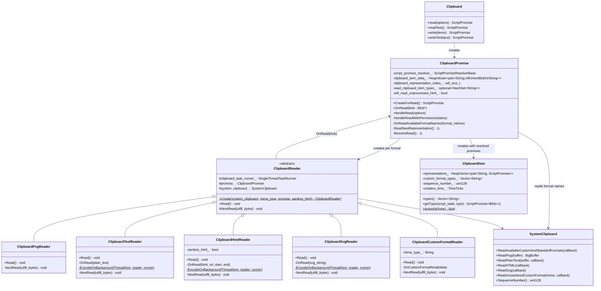
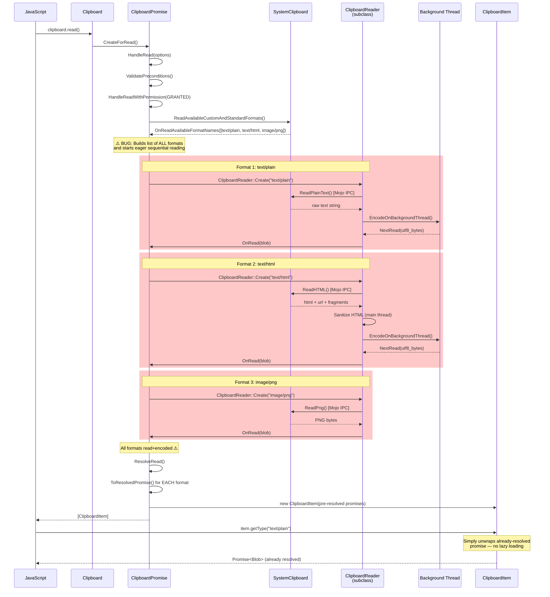
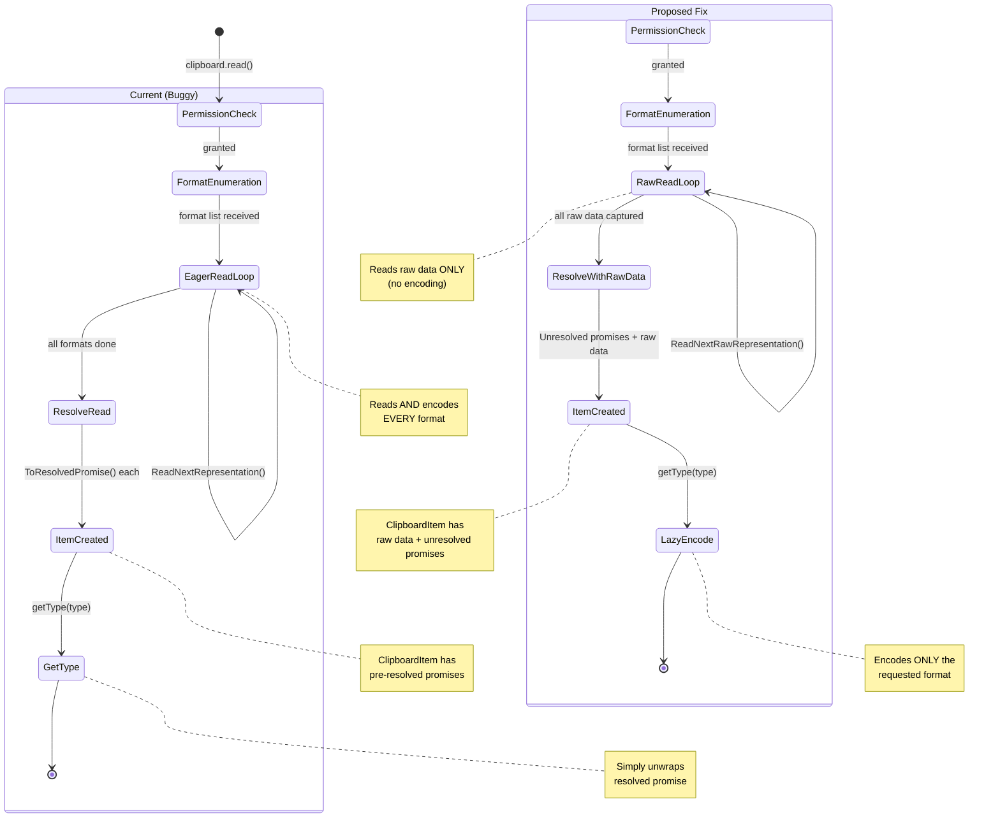

# Low-Level Design: 40105911

## ⚠️ Verdict: WON'T FIX

Both the fix assessment (01-fix-assessment.md) and the high-level design (03-architecture-hld.md) concluded **WON'T FIX**. The issue still exists in the current codebase — `clipboard.read()` eagerly reads and encodes ALL available clipboard formats before resolving — but this is a P3/S4 architectural optimization request from 2019 with partial mitigations already in place. A proper fix would require significant refactoring in a security-sensitive area with non-trivial TOCTOU implications. This LLD documents the detailed analysis for completeness.

---

## 1. Files to Modify (If Fix Were Pursued)

| File | Type | Changes | Lines |
|------|------|---------|-------|
| [/third_party/blink/renderer/modules/clipboard/clipboard_promise.cc](/third_party/blink/renderer/modules/clipboard/clipboard_promise.cc) | Modify | Refactor `ReadNextRepresentation()` to read raw data without encoding; store raw data instead of Blobs; change `ResolveRead()` to create unresolved promises | ~80 |
| [/third_party/blink/renderer/modules/clipboard/clipboard_promise.h](/third_party/blink/renderer/modules/clipboard/clipboard_promise.h) | Modify | Add raw data storage members; new method signatures for raw-read path | ~15 |
| [/third_party/blink/renderer/modules/clipboard/clipboard_item.cc](/third_party/blink/renderer/modules/clipboard/clipboard_item.cc) | Modify | Implement lazy encoding in `getType()`; accept and store raw clipboard data | ~60 |
| [/third_party/blink/renderer/modules/clipboard/clipboard_item.h](/third_party/blink/renderer/modules/clipboard/clipboard_item.h) | Modify | Add raw data storage members; new constructor accepting raw data | ~20 |
| [/third_party/blink/renderer/modules/clipboard/clipboard_reader.cc](/third_party/blink/renderer/modules/clipboard/clipboard_reader.cc) | Modify | Factor out encoding from reading; create "raw read" variants of each reader | ~100 |
| [/third_party/blink/renderer/modules/clipboard/clipboard_reader.h](/third_party/blink/renderer/modules/clipboard/clipboard_reader.h) | Modify | Add raw-read interface; split `Read()` into `ReadRaw()` + `Encode()` | ~15 |
| [/third_party/blink/renderer/modules/clipboard/clipboard_unittest.cc](/third_party/blink/renderer/modules/clipboard/clipboard_unittest.cc) | Add | New tests verifying lazy encoding behavior | ~100 |

## 2. Class Hierarchy

### 2.1 Class Diagram


### 2.2 Class Responsibilities
- **`Clipboard`**: Web API entry point; dispatches `read()`/`write()` to `ClipboardPromise`
- **`ClipboardPromise`**: Orchestrates the entire async read/write lifecycle; manages permissions; owns reader instances; **contains the bug** in `ReadNextRepresentation()` and `ResolveRead()`
- **`ClipboardReader`** (abstract): Base class for format-specific readers that read from the system clipboard AND encode into Blobs
- **`ClipboardPngReader`**: Reads PNG data via Mojo IPC; no encoding needed (data is already PNG)
- **`ClipboardTextReader`**: Reads plain text via Mojo IPC; encodes to UTF-8 on a background thread
- **`ClipboardHtmlReader`**: Reads HTML via Mojo IPC; sanitizes on main thread; encodes to UTF-8 on background thread
- **`ClipboardSvgReader`**: Reads SVG via Mojo IPC; sanitizes on main thread; encodes to UTF-8 on background thread
- **`ClipboardCustomFormatReader`**: Reads custom format data via Mojo IPC; creates Blob directly
- **`ClipboardItem`**: JavaScript-facing object holding MIME → Promise<Blob> map; `getType()` simply unwraps pre-resolved promises — **no lazy loading**
- **`SystemClipboard`**: Renderer-side Mojo proxy to browser process; provides snapshot caching for atomic reads

## 3. Method-Level Analysis

### 3.1 Call Chain (Bug Path)


### 3.2 Affected Methods

#### `ClipboardPromise::ReadNextRepresentation()`
**Location**: [/third_party/blink/renderer/modules/clipboard/clipboard_promise.cc#L432](/third_party/blink/renderer/modules/clipboard/clipboard_promise.cc#L432)

**Current Implementation (Buggy)**:
```cpp
void ClipboardPromise::ReadNextRepresentation() {
  DCHECK_CALLED_ON_VALID_SEQUENCE(sequence_checker_);
  if (!GetExecutionContext())
    return;
  if (clipboard_representation_index_ == clipboard_item_data_.size()) {
    ResolveRead();  // ← All formats done, wrap in resolved promises
    return;
  }

  ClipboardReader* clipboard_reader = ClipboardReader::Create(
      GetLocalFrame()->GetSystemClipboard(),
      clipboard_item_data_[clipboard_representation_index_].first, this,
      /*sanitize_html=*/!will_read_unprocessed_html_);
  if (!clipboard_reader) {
    OnRead(nullptr);
    return;
  }
  clipboard_reader->Read();  // ← Reads AND encodes data eagerly
}
```

**Issues**:
1. Creates a `ClipboardReader` for EVERY format in `clipboard_item_data_`, not just the ones that will be consumed
2. Each reader's `Read()` both reads from the system clipboard AND encodes data (e.g., UTF-8 encoding, HTML sanitization)
3. Sequential iteration means the next format isn't started until the current one finishes encoding
4. All encoding work is done before `ResolveRead()` is called

#### `ClipboardPromise::OnRead()`
**Location**: [/third_party/blink/renderer/modules/clipboard/clipboard_promise.cc#L452](/third_party/blink/renderer/modules/clipboard/clipboard_promise.cc#L452)

**Current Implementation**:
```cpp
void ClipboardPromise::OnRead(Blob* blob) {
  DCHECK_CALLED_ON_VALID_SEQUENCE(sequence_checker_);
  if (blob) {
    clipboard_item_data_[clipboard_representation_index_].second =
        MakeGarbageCollected<V8UnionBlobOrString>(blob);
  }
  ++clipboard_representation_index_;
  ReadNextRepresentation();  // ← Advances to next format immediately
}
```

**Issue**: Stores the fully-encoded Blob and immediately moves to the next format, continuing the eager loop.

#### `ClipboardPromise::ResolveRead()`
**Location**: [/third_party/blink/renderer/modules/clipboard/clipboard_promise.cc#L371](/third_party/blink/renderer/modules/clipboard/clipboard_promise.cc#L371)

**Current Implementation**:
```cpp
void ClipboardPromise::ResolveRead() {
  // ...
  HeapVector<std::pair<String, MemberScriptPromise<V8UnionBlobOrString>>> items;
  items.ReserveInitialCapacity(clipboard_item_data_.size());

  for (const auto& item : clipboard_item_data_) {
    if (!item.second) {
      continue;
    }
    auto promise =
        ToResolvedPromise<V8UnionBlobOrString>(script_state, item.second);
    // ← ⚠️ Creates ALREADY-RESOLVED promises wrapping pre-encoded Blobs
    items.emplace_back(item.first, promise);
  }
  HeapVector<Member<ClipboardItem>> clipboard_items = {
      // ...
      MakeGarbageCollected<ClipboardItem>(items /*, ...*/)};
  script_promise_resolver_->DowncastTo<IDLSequence<ClipboardItem>>()->Resolve(
      clipboard_items);
}
```

**Issue**: Uses `ToResolvedPromise()` at line 390, which wraps already-materialized data. The `ClipboardItem` receives pre-resolved promises, making `getType()` a simple unwrap with zero lazy behavior.

#### `ClipboardItem::getType()`
**Location**: [/third_party/blink/renderer/modules/clipboard/clipboard_item.cc#L118](/third_party/blink/renderer/modules/clipboard/clipboard_item.cc#L118)

**Current Implementation**:
```cpp
ScriptPromise<Blob> ClipboardItem::getType(ScriptState* script_state,
                                           const String& type,
                                           ExceptionState& exception_state) {
  for (const auto& item : representations_) {
    if (type == item.first) {
      if (RuntimeEnabledFeatures::ClipboardItemGetTypeCounterEnabled()) {
        CaptureTelemetry(ExecutionContext::From(script_state), type);
      }
      return item.second.Unwrap().Then(
          script_state,
          MakeGarbageCollected<UnionToBlobResolverFunction>(type));
    }
  }
  exception_state.ThrowDOMException(DOMExceptionCode::kNotFoundError,
                                    "The type was not found");
  return ScriptPromise<Blob>();
}
```

**Issue**: Simply calls `.Unwrap().Then(...)` on the already-resolved promise. No opportunity for lazy encoding since data was already materialized in `ResolveRead()`.

#### `ClipboardPromise::OnReadAvailableFormatNames()`
**Location**: [/third_party/blink/renderer/modules/clipboard/clipboard_promise.cc#L402](/third_party/blink/renderer/modules/clipboard/clipboard_promise.cc#L402)

**Current Implementation**:
```cpp
void ClipboardPromise::OnReadAvailableFormatNames(
    const Vector<String>& format_names) {
  // ...
  const bool check_types_to_read =
      RuntimeEnabledFeatures::SelectiveClipboardFormatReadEnabled() &&
      read_clipboard_item_types_.has_value();
  if (check_types_to_read && read_clipboard_item_types_->empty()) {
    ResolveRead();  // No supported types to read.
    return;
  }

  clipboard_item_data_.ReserveInitialCapacity(/* ... */);
  for (const String& format_name : format_names) {
    if (ClipboardItem::supports(format_name) &&
        (!check_types_to_read ||
         read_clipboard_item_types_->Contains(format_name))) {
      clipboard_item_data_.emplace_back(format_name,
                                        /* Placeholder value. */ nullptr);
    }
  }
  ReadNextRepresentation();  // ← Starts the eager loop over ALL formats
}
```

**Note**: The `SelectiveClipboardFormatRead` feature flag (status: "test", not shipped to stable) provides a partial mitigation by allowing callers to filter which types to read. However, even when enabled, the requested types are still eagerly read and encoded.

## 4. Fix Design (Hypothetical — WON'T FIX)

### 4.1 Recommended Option (If Fix Were Pursued)

**Option 4 (Hybrid)** from the fix assessment: Read raw data from the system clipboard during `read()` to snapshot atomically, but defer encoding until `getType()` is called.

### 4.2 Changes Required

#### File 1: [/third_party/blink/renderer/modules/clipboard/clipboard_reader.h](/third_party/blink/renderer/modules/clipboard/clipboard_reader.h)

**Before** (lines 42-62):
```cpp
class ClipboardReader : public GarbageCollected<ClipboardReader> {
 public:
  static ClipboardReader* Create(SystemClipboard* system_clipboard,
                                 const String& mime_type,
                                 ClipboardPromise* promise,
                                 bool sanitize_html);
  virtual ~ClipboardReader();

  // Reads from the system clipboard and encodes on a background thread.
  virtual void Read() = 0;

  void Trace(Visitor* visitor) const;

 protected:
  const scoped_refptr<base::SingleThreadTaskRunner> clipboard_task_runner_;
  ClipboardReader(SystemClipboard* system_clipboard, ClipboardPromise* promise);
  virtual void NextRead(Vector<uint8_t> utf8_bytes) = 0;

  SystemClipboard* system_clipboard() { return system_clipboard_.Get(); }
  Member<ClipboardPromise> promise_;
  SEQUENCE_CHECKER(sequence_checker_);
```

**After** (hypothetical):
```cpp
class ClipboardReader : public GarbageCollected<ClipboardReader> {
 public:
  static ClipboardReader* Create(SystemClipboard* system_clipboard,
                                 const String& mime_type,
                                 ClipboardPromise* promise,
                                 bool sanitize_html);
  virtual ~ClipboardReader();

  // Reads from the system clipboard and encodes on a background thread.
  virtual void Read() = 0;

  // Reads raw data from the system clipboard without encoding.
  // Returns raw data that can be encoded later via Encode().
  virtual void ReadRaw() = 0;

  // Encodes previously-read raw data into a Blob.
  // Called lazily from ClipboardItem::getType().
  virtual void Encode() = 0;

  void Trace(Visitor* visitor) const;

 protected:
  const scoped_refptr<base::SingleThreadTaskRunner> clipboard_task_runner_;
  ClipboardReader(SystemClipboard* system_clipboard, ClipboardPromise* promise);
  virtual void NextRead(Vector<uint8_t> utf8_bytes) = 0;

  SystemClipboard* system_clipboard() { return system_clipboard_.Get(); }
  Member<ClipboardPromise> promise_;
  SEQUENCE_CHECKER(sequence_checker_);
```

**Rationale**: Split the `Read()` operation into `ReadRaw()` (reads from system clipboard, stores raw data) and `Encode()` (converts raw data to Blob). This separation enables lazy encoding.

#### File 2: [/third_party/blink/renderer/modules/clipboard/clipboard_reader.cc](/third_party/blink/renderer/modules/clipboard/clipboard_reader.cc)

For each reader subclass (ClipboardTextReader, ClipboardHtmlReader, ClipboardSvgReader, ClipboardPngReader, ClipboardCustomFormatReader), the `Read()` method would be split:

**Example — ClipboardTextReader (lines 62-122)**

**Before**:
```cpp
class ClipboardTextReader final : public ClipboardReader {
 public:
  // ...
  void Read() override {
    DCHECK_CALLED_ON_VALID_SEQUENCE(sequence_checker_);
    system_clipboard()->ReadPlainText(
        mojom::blink::ClipboardBuffer::kStandard,
        BindOnce(&ClipboardTextReader::OnRead, WrapPersistent(this)));
  }

 private:
  void OnRead(const String& plain_text) {
    if (plain_text.empty()) {
      NextRead(Vector<uint8_t>());
      return;
    }
    worker_pool::PostTask(
        FROM_HERE,
        CrossThreadBindOnce(&ClipboardTextReader::EncodeOnBackgroundThread,
                            std::move(plain_text), MakeCrossThreadHandle(this),
                            std::move(clipboard_task_runner_)));
  }
  // ... EncodeOnBackgroundThread, NextRead ...
};
```

**After** (hypothetical):
```cpp
class ClipboardTextReader final : public ClipboardReader {
 public:
  // ...
  void Read() override { /* unchanged — full read+encode path */ }

  void ReadRaw() override {
    DCHECK_CALLED_ON_VALID_SEQUENCE(sequence_checker_);
    system_clipboard()->ReadPlainText(
        mojom::blink::ClipboardBuffer::kStandard,
        BindOnce(&ClipboardTextReader::OnRawRead, WrapPersistent(this)));
  }

  void Encode() override {
    DCHECK(!raw_text_.empty());
    worker_pool::PostTask(
        FROM_HERE,
        CrossThreadBindOnce(&ClipboardTextReader::EncodeOnBackgroundThread,
                            std::move(raw_text_), MakeCrossThreadHandle(this),
                            std::move(clipboard_task_runner_)));
  }

 private:
  void OnRawRead(const String& plain_text) {
    raw_text_ = plain_text;
    promise_->OnRawRead(raw_text_.empty() ? nullptr : this);
  }

  String raw_text_;
  // ... rest unchanged ...
};
```

**Rationale**: `ReadRaw()` snapshots the text but doesn't encode. `Encode()` is called later when `getType("text/plain")` is invoked.

#### File 3: [/third_party/blink/renderer/modules/clipboard/clipboard_promise.cc](/third_party/blink/renderer/modules/clipboard/clipboard_promise.cc)

**Before** — `ReadNextRepresentation()` (lines 432-450):
```cpp
void ClipboardPromise::ReadNextRepresentation() {
  DCHECK_CALLED_ON_VALID_SEQUENCE(sequence_checker_);
  if (!GetExecutionContext())
    return;
  if (clipboard_representation_index_ == clipboard_item_data_.size()) {
    ResolveRead();
    return;
  }

  ClipboardReader* clipboard_reader = ClipboardReader::Create(
      GetLocalFrame()->GetSystemClipboard(),
      clipboard_item_data_[clipboard_representation_index_].first, this,
      /*sanitize_html=*/!will_read_unprocessed_html_);
  if (!clipboard_reader) {
    OnRead(nullptr);
    return;
  }
  clipboard_reader->Read();
}
```

**After** (hypothetical):
```cpp
void ClipboardPromise::ReadNextRawRepresentation() {
  DCHECK_CALLED_ON_VALID_SEQUENCE(sequence_checker_);
  if (!GetExecutionContext())
    return;
  if (clipboard_representation_index_ == clipboard_raw_data_.size()) {
    ResolveReadWithRawData();
    return;
  }

  ClipboardReader* clipboard_reader = ClipboardReader::Create(
      GetLocalFrame()->GetSystemClipboard(),
      clipboard_raw_data_[clipboard_representation_index_].first, this,
      /*sanitize_html=*/!will_read_unprocessed_html_);
  if (!clipboard_reader) {
    OnRawRead(nullptr);
    return;
  }
  clipboard_reader->ReadRaw();  // Read without encoding
}
```

**Before** — `ResolveRead()` (lines 371-400):
```cpp
void ClipboardPromise::ResolveRead() {
  // ...
  for (const auto& item : clipboard_item_data_) {
    if (!item.second) continue;
    auto promise =
        ToResolvedPromise<V8UnionBlobOrString>(script_state, item.second);
    items.emplace_back(item.first, promise);
  }
  // Creates ClipboardItem with pre-resolved promises
}
```

**After** (hypothetical):
```cpp
void ClipboardPromise::ResolveReadWithRawData() {
  // ...
  // Create ClipboardItem with UNRESOLVED promises and raw reader references
  // The ClipboardItem will trigger encoding when getType() is called
  HeapVector<std::pair<String, Member<ClipboardReader>>> raw_items;
  for (const auto& item : clipboard_raw_data_) {
    if (!item.second) continue;
    raw_items.emplace_back(item.first, item.second);
  }
  auto* clipboard_item = MakeGarbageCollected<ClipboardItem>(
      script_state, raw_items, sequence_number);
  // ...
}
```

**Rationale**: Instead of creating resolved promises, pass raw reader references to `ClipboardItem` so it can trigger encoding lazily.

#### File 4: [/third_party/blink/renderer/modules/clipboard/clipboard_item.cc](/third_party/blink/renderer/modules/clipboard/clipboard_item.cc)

**Before** — `getType()` (lines 118-136):
```cpp
ScriptPromise<Blob> ClipboardItem::getType(ScriptState* script_state,
                                           const String& type,
                                           ExceptionState& exception_state) {
  for (const auto& item : representations_) {
    if (type == item.first) {
      // ...telemetry...
      return item.second.Unwrap().Then(
          script_state,
          MakeGarbageCollected<UnionToBlobResolverFunction>(type));
    }
  }
  // ...error...
}
```

**After** (hypothetical):
```cpp
ScriptPromise<Blob> ClipboardItem::getType(ScriptState* script_state,
                                           const String& type,
                                           ExceptionState& exception_state) {
  for (auto& item : raw_representations_) {
    if (type == item.first) {
      // ...telemetry...
      if (!item.encoded_promise) {
        // Lazy encoding: trigger encoding now
        item.reader->Encode();
        // item.encoded_promise will be resolved via callback
      }
      return item.encoded_promise;
    }
  }
  // ...error...
}
```

**Rationale**: On first `getType()` call for a format, trigger encoding of the raw data. Subsequent calls return the same (now-resolved) promise.

#### File 5: [/third_party/blink/renderer/modules/clipboard/clipboard_item.h](/third_party/blink/renderer/modules/clipboard/clipboard_item.h)

**Before** (lines 83-92):
```cpp
 private:
  void CaptureTelemetry(ExecutionContext* context, const String& type);
  HeapVector<std::pair<String, MemberScriptPromise<V8UnionBlobOrString>>>
      representations_;
  Vector<String> custom_format_types_;
  absl::uint128 sequence_number_;
  HashMap<String, base::TimeTicks> last_get_type_calls_;
  base::TimeTicks creation_time_;
```

**After** (hypothetical):
```cpp
 private:
  void CaptureTelemetry(ExecutionContext* context, const String& type);

  // For eager path (existing behavior):
  HeapVector<std::pair<String, MemberScriptPromise<V8UnionBlobOrString>>>
      representations_;

  // For lazy path (new behavior):
  struct RawRepresentation {
    String mime_type;
    Member<ClipboardReader> reader;  // holds raw data
    MemberScriptPromise<V8UnionBlobOrString> encoded_promise;  // resolved on getType()
  };
  HeapVector<RawRepresentation> raw_representations_;

  Vector<String> custom_format_types_;
  absl::uint128 sequence_number_;
  HashMap<String, base::TimeTicks> last_get_type_calls_;
  base::TimeTicks creation_time_;
```

**Rationale**: Store raw data + unresolved promises so encoding can be deferred to `getType()`.

### 4.3 State Machine Changes



## 5. Memory & Lifetime Considerations

### 5.1 Object Ownership (Current)
- `ClipboardPromise` owns the `clipboard_item_data_` vector (MIME → Blob pairs) during the read lifecycle
- `ClipboardReader` instances are created per-format and garbage collected after `OnRead()` returns
- `ClipboardItem` is constructed with resolved promises and handed to JavaScript; its lifetime is managed by V8 GC
- `SystemClipboard` is owned by the `LocalFrame` and outlives all clipboard operations

### 5.2 Object Ownership (With Fix)
- `ClipboardReader` instances would need to outlive the `ClipboardPromise` lifecycle, as they hold raw data until `getType()` triggers encoding
- `ClipboardItem` would need to hold references to `ClipboardReader` instances, extending their lifetime
- Risk: If `ClipboardItem` is GC'd before `getType()` is called, the raw data is lost (benign — same as not calling `getType()` today)
- Risk: Raw data held in `ClipboardReader` increases memory usage for the duration between `read()` and `getType()` (or GC)

### 5.3 Pointer/Reference Safety
- [x] No raw pointer issues — all references use `Member<>` (GC-traced pointers)
- [x] Weak pointers handled correctly — `WrapPersistent()` used for cross-thread/async callbacks
- [ ] Reference lifetime guaranteed — **NEW CONCERN**: `ClipboardReader` lifetime must be extended if raw data is stored; requires tracing from `ClipboardItem`

## 6. Threading Considerations

### 6.1 Thread Safety (Current)
- **Main thread**: All `ClipboardPromise` methods, `ClipboardReader::Read()` initiation, HTML/SVG sanitization, Mojo IPC calls, `ClipboardItem` construction
- **Background threads** (worker pool): UTF-8 encoding in `ClipboardTextReader::EncodeOnBackgroundThread()`, `ClipboardHtmlReader::EncodeOnBackgroundThread()`, `ClipboardSvgReader::EncodeOnBackgroundThread()`
- **Synchronization**: Sequential read loop — one format at a time; background encoding posts result back to main thread via `PostCrossThreadTask()`

### 6.2 Threading Impact of Fix
- **ReadRaw()**: All raw reads happen on the main thread (same Mojo IPC pattern), sequential — no threading change
- **Encode()**: Would be called from `getType()` on the main thread, then post to background thread for encoding — same pattern as today but triggered lazily
- **New concern**: If `getType()` is called from multiple JavaScript microtask queues for different types simultaneously, encoding requests could overlap. However, since each reader handles one type, there's no shared mutable state between readers.

### 6.3 Required Synchronization
- No additional locks needed — the existing `SEQUENCE_CHECKER` pattern enforces main-thread access
- Background thread encoding already uses `CrossThreadHandle` + `PostCrossThreadTask` for safe cross-thread communication

## 7. Error Handling

### 7.1 Current Error Handling
- `OnRead(nullptr)` is called when a reader fails to read/encode, storing `nullptr` in `clipboard_item_data_`
- `ResolveRead()` skips `nullptr` entries (line 386-388: `if (!item.second) { continue; }`)
- `getType()` throws `NotFoundError` DOMException if the type isn't in `representations_`
- `ReadNextRepresentation()` silently skips to next format on `nullptr` reader

### 7.2 Changes to Error Handling (If Fix Were Pursued)
- `ReadRaw()` failures would call `OnRawRead(nullptr)` — same skip pattern
- `Encode()` failures need a new path: reject the unresolved promise created in `ResolveReadWithRawData()`
- Edge case: If `getType()` is called after the execution context is destroyed (tab closed), encoding must fail gracefully by rejecting the promise

## 8. Validation Points

### 8.1 DCHECKs to Add/Modify (If Fix Were Pursued)
```cpp
// In ClipboardReader::ReadRaw()
DCHECK(!has_raw_data_) << "ReadRaw() called twice";

// In ClipboardReader::Encode()
DCHECK(has_raw_data_) << "Encode() called before ReadRaw()";

// In ClipboardItem::getType() lazy path
DCHECK(raw_representations_[i].reader) << "Reader already released";
```

### 8.2 Invariants to Maintain
1. System clipboard data must be read atomically during `clipboard.read()` — all formats must be snapshotted from the same clipboard sequence to avoid TOCTOU issues
2. HTML sanitization must occur on the main thread (DOM parser requirement)
3. `getType()` must always return a Promise — even if encoding is deferred, the Promise must be created synchronously
4. Clipboard sequence number must be captured during `read()`, not during `getType()`
5. `supports()` check must remain during format enumeration, not deferred

## 9. Test Requirements

### 9.1 Unit Tests Needed (If Fix Were Pursued)

| Test Name | Purpose | File |
|-----------|---------|------|
| `ClipboardPromiseTest.LazyEncodingNotTriggeredOnRead` | Verify encoding doesn't happen during `clipboard.read()` | [/third_party/blink/renderer/modules/clipboard/clipboard_unittest.cc](/third_party/blink/renderer/modules/clipboard/clipboard_unittest.cc) |
| `ClipboardPromiseTest.EncodingTriggeredOnGetType` | Verify encoding happens when `getType()` is called | [/third_party/blink/renderer/modules/clipboard/clipboard_unittest.cc](/third_party/blink/renderer/modules/clipboard/clipboard_unittest.cc) |
| `ClipboardPromiseTest.OnlyRequestedFormatEncoded` | Verify only the format passed to `getType()` is encoded | [/third_party/blink/renderer/modules/clipboard/clipboard_unittest.cc](/third_party/blink/renderer/modules/clipboard/clipboard_unittest.cc) |
| `ClipboardPromiseTest.RawDataSnapshotAtomicity` | Verify all raw data is from same clipboard sequence | [/third_party/blink/renderer/modules/clipboard/clipboard_unittest.cc](/third_party/blink/renderer/modules/clipboard/clipboard_unittest.cc) |
| `ClipboardItemTest.GetTypeLazyEncodeText` | Verify lazy text encoding in ClipboardItem | [/third_party/blink/renderer/modules/clipboard/clipboard_unittest.cc](/third_party/blink/renderer/modules/clipboard/clipboard_unittest.cc) |
| `ClipboardItemTest.GetTypeLazyEncodeHtml` | Verify lazy HTML sanitization+encoding | [/third_party/blink/renderer/modules/clipboard/clipboard_unittest.cc](/third_party/blink/renderer/modules/clipboard/clipboard_unittest.cc) |
| `ClipboardItemTest.GetTypeAfterContextDestroyed` | Verify graceful failure when context is gone | [/third_party/blink/renderer/modules/clipboard/clipboard_unittest.cc](/third_party/blink/renderer/modules/clipboard/clipboard_unittest.cc) |
| `ClipboardItemTest.MultipleGetTypeCalls` | Verify repeated getType() returns same Blob | [/third_party/blink/renderer/modules/clipboard/clipboard_unittest.cc](/third_party/blink/renderer/modules/clipboard/clipboard_unittest.cc) |

### 9.2 Test Scenarios
1. **Normal case**: `clipboard.read()` returns ClipboardItem; only `getType("text/plain")` is called; verify HTML and PNG were NOT encoded
2. **All formats consumed**: `clipboard.read()` then `getType()` for every available type; verify all are correctly encoded (functional equivalence with current behavior)
3. **No getType called**: `clipboard.read()` completes; no `getType()` called; verify no encoding CPU was spent
4. **Context destroyed**: `clipboard.read()` completes; tab is closed; `getType()` called from stale reference; verify promise rejection, no crash
5. **SelectiveClipboardFormatRead interaction**: `clipboard.read({types: ['text/plain']})` with lazy encoding; verify only text/plain is even raw-read
6. **Clipboard content changes**: `clipboard.read()` snapshots raw data; clipboard changes; `getType()` called; verify returned data is from original snapshot (TOCTOU safety)

### 9.3 Web Platform Tests
Existing WPT tests in `external/wpt/clipboard-apis/` would serve as regression tests to verify functional equivalence. No new WPTs needed since lazy vs. eager encoding is an implementation detail not observable via the API.

## 10. Existing Mitigations

### 10.1 `SelectiveClipboardFormatRead` Feature Flag
**Location**: [/third_party/blink/renderer/platform/runtime_enabled_features.json5#L4860](/third_party/blink/renderer/platform/runtime_enabled_features.json5#L4860)
**Status**: `"test"` (not shipped to stable)
**Effect**: Allows `clipboard.read({types: ['text/plain']})` to filter which formats are read. This doesn't defer encoding but reduces the number of formats read.

### 10.2 Background Thread Encoding
Text, HTML, and SVG encoding already run on background threads via `worker_pool::PostTask()`, mitigating main-thread jank. Only PNG reads (which don't need encoding) and HTML sanitization (which requires the DOM parser) run on the main thread.

### 10.3 `ClipboardItemGetTypeCounter` Telemetry
**Status**: `"stable"` (shipped)
**Effect**: Tracks time between `read()` and `getType()` calls, allowing the Chromium team to gather data on real-world usage patterns. The `CaptureTelemetry()` call in `getType()` (line 124) records this.

## 11. Summary

| Aspect | Current State | With Fix |
|--------|--------------|----------|
| **Format reading** | All formats read eagerly via Mojo IPC | All formats still read eagerly (TOCTOU safety) |
| **Format encoding** | All formats encoded eagerly (bg threads) | Encoding deferred to `getType()` |
| **Promise state** | Pre-resolved via `ToResolvedPromise()` | Unresolved; resolved on `getType()` |
| **Memory** | All Blobs in memory after `read()` | Raw data in memory; Blobs created on demand |
| **CPU savings** | None — all encoding upfront | Encoding only for consumed formats |
| **Complexity** | Current architecture | ~290 lines changed across 7 files |
| **Risk** | N/A | High — security-sensitive area, TOCTOU, lifecycle |
| **Recommendation** | **WON'T FIX** | P3/S4, 6+ years open, partial mitigations exist |
