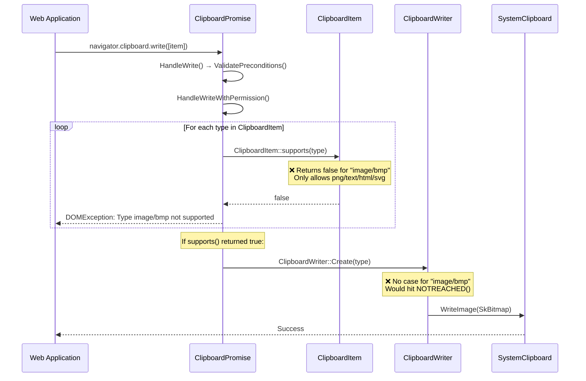

# Fix Assessment: 40656585

## Executive Summary
The Clipboard API in Chromium does not support `image/bmp` as a MIME type, despite BMP being a simple, uncompressed image format that is natively stored on many platform clipboards. The fix requires adding `image/bmp` to the supported types list in `ClipboardItem::supports()`, creating a `ClipboardBmpReader` and `ClipboardBmpWriter`, adding a `kMimeTypeBmp` constant, and wiring the format through the reader/writer factory methods. The existing `ImageDecoder` already handles BMP decoding, so the write path largely reuses `ClipboardImageWriter` logic.

## Bug Analysis

### Problem Statement
The Clipboard API (`navigator.clipboard.write()` / `navigator.clipboard.read()`) does not accept `image/bmp` as a valid MIME type. Attempting to write a `ClipboardItem` with `image/bmp` type throws a `DOMException` (NotAllowedError) because `image/bmp` is not in the allowlist of supported clipboard types.

### Expected Behavior
The Clipboard API should accept `image/bmp` as a valid MIME type for `ClipboardItem`, allowing web applications to write and read BMP image data via `navigator.clipboard.write()` and `navigator.clipboard.read()`. BMP is simpler than PNG and avoids expensive encode/decode sanitization overhead, making clipboard operations faster for large images.

### Actual Behavior
Writing `image/bmp` via `navigator.clipboard.write()` throws a `DOMException: Type image/bmp not supported on write.` The `ClipboardItem.supports('image/bmp')` static method returns `false`. Only `image/png`, `text/plain`, `text/html`, and `image/svg+xml` are currently supported as standard clipboard MIME types.

### Triggering Conditions
Any attempt to use `image/bmp` with the async Clipboard API:
```javascript
const item = new ClipboardItem({ 'image/bmp': bmpBlob });
await navigator.clipboard.write([item]); // throws DOMException
ClipboardItem.supports('image/bmp'); // returns false
```

## Root Cause Analysis

### Code Investigation
The investigation traced the flow from `navigator.clipboard.write()` through the Blink Clipboard module:

1. **`ClipboardPromise::HandleWriteWithPermission()`** iterates over clipboard item types and calls `ClipboardItem::supports()` to validate each type.
2. **`ClipboardItem::supports()`** contains a hardcoded allowlist of supported MIME types.
3. **`ClipboardWriter::Create()`** and **`ClipboardReader::Create()`** factory methods dispatch to type-specific reader/writer classes based on MIME type, with no BMP case.

The system clipboard layer already handles bitmap data natively (via `SystemClipboard::WriteImage(const SkBitmap&)` and `SystemClipboard::ReadPng()`), and the `ImageDecoder` already supports BMP format. The missing piece is the Clipboard API layer in Blink's modules that gates which MIME types are allowed.

### Key Files Identified
- [/third_party/blink/renderer/modules/clipboard/clipboard_item.cc#L139-L151](/third_party/blink/renderer/modules/clipboard/clipboard_item.cc#L139-L151) - `ClipboardItem::supports()` - the allowlist gating function
- [/third_party/blink/renderer/modules/clipboard/clipboard_writer.cc#L241-L273](/third_party/blink/renderer/modules/clipboard/clipboard_writer.cc#L241-L273) - `ClipboardWriter::Create()` factory - dispatches to type-specific writers
- [/third_party/blink/renderer/modules/clipboard/clipboard_reader.cc#L322-L355](/third_party/blink/renderer/modules/clipboard/clipboard_reader.cc#L322-L355) - `ClipboardReader::Create()` factory - dispatches to type-specific readers
- [/third_party/blink/renderer/modules/clipboard/clipboard_writer.cc#L59-L123](/third_party/blink/renderer/modules/clipboard/clipboard_writer.cc#L59-L123) - `ClipboardImageWriter` - existing PNG image writer (reusable for BMP)
- [/third_party/blink/renderer/modules/clipboard/clipboard_reader.cc#L35-L59](/third_party/blink/renderer/modules/clipboard/clipboard_reader.cc#L35-L59) - `ClipboardPngReader` - existing PNG image reader (pattern for BMP)
- [/ui/base/clipboard/clipboard_constants.h#L38-L39](/ui/base/clipboard/clipboard_constants.h#L38-L39) - MIME type constants (missing `kMimeTypeBmp`)
- [/third_party/blink/renderer/core/clipboard/system_clipboard.h#L91-L97](/third_party/blink/renderer/core/clipboard/system_clipboard.h#L91-L97) - `SystemClipboard` image read/write methods
- [/third_party/blink/renderer/platform/image-decoders/image_decoder.cc#L330-L333](/third_party/blink/renderer/platform/image-decoders/image_decoder.cc#L330-L333) - `ImageDecoder` already supports BMP decoding
- [/ui/base/clipboard/clipboard_non_backed.cc#L587-L612](/ui/base/clipboard/clipboard_non_backed.cc#L587-L612) - `GetStandardFormats()` reports available clipboard formats (maps BitmapType → image/png currently)
- [/content/browser/renderer_host/clipboard_host_impl.cc#L893-L914](/content/browser/renderer_host/clipboard_host_impl.cc#L893-L914) - `OnReadAvailableTypesForUpdate()` filters standard MIME types for clipboard change events

### Root Cause
**Location**: [/third_party/blink/renderer/modules/clipboard/clipboard_item.cc#L149-L150](/third_party/blink/renderer/modules/clipboard/clipboard_item.cc#L149-L150)
**Function**: `ClipboardItem::supports()`
**Issue**: The `supports()` method only allows `image/png`, `text/plain`, `text/html`, and `image/svg+xml`. There is no `image/bmp` entry. The TODO on line 148 (`// TODO(https://crbug.com/1029857): Add support for other types.`) explicitly acknowledges that more types need to be added. Additionally, the `ClipboardWriter::Create()` and `ClipboardReader::Create()` factory methods have no case for `image/bmp`, and no `kMimeTypeBmp` constant exists in `clipboard_constants.h`.

### Code Flow Diagram


## Fix Options

### Option 1: Reuse ClipboardImageWriter for BMP (Write as Bitmap) ⭐ RECOMMENDED
- **Description**: Add `image/bmp` to the supported types allowlist and reuse the existing `ClipboardImageWriter` for the write path (since `ImageDecoder::Create` already auto-detects BMP from data signature and decodes it to SkBitmap). For the read path, create a new `ClipboardBmpReader` that reads PNG data from the system clipboard and converts it to BMP format before returning it as a Blob, OR reads the native bitmap and encodes to BMP. Add `kMimeTypeBmp` constant to `clipboard_constants.h`.
- **Files to modify**:
  - [/ui/base/clipboard/clipboard_constants.h#L38-L39](/ui/base/clipboard/clipboard_constants.h#L38-L39) - Add `kMimeTypeBmp` / `kMimeTypeBmp16` constants
  - [/third_party/blink/renderer/modules/clipboard/clipboard_item.cc#L149-L150](/third_party/blink/renderer/modules/clipboard/clipboard_item.cc#L149-L150) - Add `ui::kMimeTypeBmp` to `supports()`
  - [/third_party/blink/renderer/modules/clipboard/clipboard_writer.cc#L254-L257](/third_party/blink/renderer/modules/clipboard/clipboard_writer.cc#L254-L257) - Add `kMimeTypeBmp` case in `Create()`, reuse `ClipboardImageWriter`
  - [/third_party/blink/renderer/modules/clipboard/clipboard_reader.cc#L336-L338](/third_party/blink/renderer/modules/clipboard/clipboard_reader.cc#L336-L338) - Add `kMimeTypeBmp` case in `Create()` with new `ClipboardBmpReader`
  - [/third_party/blink/renderer/modules/clipboard/clipboard_reader.cc](/third_party/blink/renderer/modules/clipboard/clipboard_reader.cc) - Add `ClipboardBmpReader` class (reads system bitmap, encodes to BMP blob)
  - [/ui/base/clipboard/clipboard_non_backed.cc#L604-L606](/ui/base/clipboard/clipboard_non_backed.cc#L604-L606) - Optionally add `kMimeTypeBmp16` for BitmapType availability
  - [/content/browser/renderer_host/clipboard_host_impl.cc#L904-L909](/content/browser/renderer_host/clipboard_host_impl.cc#L904-L909) - Add `kMimeTypeBmp16` to filtered standard types
- **Complexity**: Medium
- **Risk**: Low - The write path reuses proven `ImageDecoder` + `ClipboardImageWriter` logic. The decoder already handles BMP signatures. The read path needs a new BMP encoder, which adds some complexity.
- **Pros**: Minimal new code for write path; leverages existing infrastructure; follows established patterns (SVG/PNG support)
- **Cons**: Read path requires BMP encoding from SkBitmap; BMP has no Skia encoder, so a simple BMP encoder must be implemented or the raw bitmap data extracted with BMP headers prepended

### Option 2: Store BMP as Raw Bitmap Data (No Re-encoding)
- **Description**: For writing, decode BMP to SkBitmap and write to system clipboard via `WriteImage()` (same as Option 1). For reading, read the raw platform bitmap data directly and wrap it with BMP file headers to create a valid BMP blob. This avoids needing a full BMP encoder.
- **Files to modify**: Same as Option 1, but `ClipboardBmpReader` constructs BMP file/info headers from the raw SkBitmap pixel data.
- **Complexity**: Medium
- **Risk**: Low - BMP format headers are well-defined and simple (14-byte file header + 40-byte BITMAPINFOHEADER). The raw pixel data from SkBitmap can be directly used.
- **Pros**: No dependency on external BMP encoder; BMP format is trivially constructible from raw pixel data; very fast (no compression)
- **Cons**: Must correctly handle BMP header construction (row padding, pixel format conversion); BMP files can be large since there's no compression

### Option 3: Use Web Custom Format Mechanism for BMP
- **Description**: Instead of adding native BMP support, route `image/bmp` through the existing web custom format (`"web image/bmp"`) mechanism, storing raw BMP data unsanitized.
- **Files to modify**:
  - [/third_party/blink/renderer/modules/clipboard/clipboard_item.cc](/third_party/blink/renderer/modules/clipboard/clipboard_item.cc) - Modify `supports()` to accept `image/bmp` via custom format path
- **Complexity**: Low
- **Risk**: Medium - Custom formats bypass sanitization, which is a security concern for BMP (though BMP is simpler than PNG). Does not follow the spec intent of adding BMP as a standard format. Would not interoperate with native applications that read BMP from clipboard.
- **Pros**: Very little code change; no encoder needed
- **Cons**: No sanitization (security concern); no native interop; not spec-compliant; BMP data passes through unsanitized

### Option 4: Full BMP Pipeline with Validation
- **Description**: Implement full BMP support with a dedicated validation/sanitization step. On write, validate BMP headers, decode to SkBitmap (sanitization), then write to system clipboard. On read, read system clipboard bitmap, encode to BMP with validated headers. Add a BMP file validator that checks header fields, dimensions, and data length.
- **Files to modify**: All files from Option 1, plus:
  - New BMP validation utility file
  - New BMP encoder utility
- **Complexity**: High
- **Risk**: Low - Most thorough approach with explicit validation
- **Pros**: Maximum security (validates BMP structure); clean separation of concerns; explicit sanitization
- **Cons**: Significantly more code; over-engineered for BMP's simple format; slower development

### Option 5: Feature-Flagged BMP Support
- **Description**: Same as Option 1 or 2, but behind a runtime feature flag (`RuntimeEnabledFeatures::ClipboardBmpSupportEnabled()`). This allows gradual rollout and easy rollback.
- **Files to modify**: All files from Option 1/2, plus:
  - [/third_party/blink/renderer/platform/runtime_enabled_features.json5](/third_party/blink/renderer/platform/runtime_enabled_features.json5) - Add `ClipboardBmpSupport` feature flag
  - Modify `ClipboardItem::supports()` to gate on feature flag
- **Complexity**: Medium
- **Risk**: Very Low - Feature flag provides safety net
- **Pros**: Safe rollout; easy to disable if issues arise; follows Chromium's standard feature launch process
- **Cons**: Extra flag management; slightly more complex code paths

## Recommended Approach
**Option 1 (Reuse ClipboardImageWriter for BMP)** combined with elements of **Option 5 (Feature Flag)** is recommended.

**Rationale:**
1. **Write path is nearly free**: The existing `ClipboardImageWriter::DecodeOnBackgroundThread` uses `ImageDecoder::Create()` which already auto-detects and decodes BMP data from the byte signature. The decoded SkBitmap is written to the system clipboard via `WriteImage()`. No new write logic is needed — just routing `image/bmp` to the existing `ClipboardImageWriter`.

2. **Read path requires BMP encoding**: The system clipboard stores bitmaps natively. When reading, `SystemClipboard::ReadPng()` returns PNG-encoded data. For `image/bmp` reads, we need a `ClipboardBmpReader` that reads the native bitmap and constructs a BMP blob. Since BMP is an uncompressed format, this is straightforward: prepend a 14-byte BITMAPFILEHEADER + 40-byte BITMAPINFOHEADER to the raw pixel data from the SkBitmap.

3. **Minimal changes**: Only 4-6 files need modification, following the exact same pattern used for SVG support.

4. **Feature flag for safety**: Adding a `ClipboardBmpSupport` feature flag (default enabled) provides a rollback mechanism.

## Testing Strategy
- **Unit tests needed**: Add test cases in `/third_party/blink/renderer/modules/clipboard/clipboard_unittest.cc` to verify:
  - `ClipboardItem::supports('image/bmp')` returns `true`
  - Writing `image/bmp` blob succeeds (no DOMException)
  - Reading `image/bmp` returns a valid BMP blob
  - Round-trip write/read preserves image data
- **Web tests needed**: Add test in `/third_party/blink/web_tests/clipboard/async-clipboard/` to verify:
  - `ClipboardItem.supports('image/bmp')` returns `true`
  - Write and read of `image/bmp` via async Clipboard API succeeds
  - MIME type `image/bmp` appears in `ClipboardItem.types` after read
- **Manual verification**:
  1. Open repro.html in Chromium
  2. Click "Draw Test Image"
  3. Click "Write image/bmp to Clipboard"
  4. Verify no error is thrown
  5. Click "Read Clipboard"
  6. Verify `image/bmp` appears in the types list

## Related Code References
- Similar fix: SVG clipboard support was added following the same pattern — `ClipboardSvgReader`, `ClipboardSvgWriter`, `kMimeTypeSvg` constant, and `supports()` allowlist update
- Spec reference: [W3C Clipboard API](https://w3c.github.io/clipboard-apis/#mandatory-data-types-x) — mandatory data types section
- Bug reference: [crbug.com/1029857](https://crbug.com/1029857) — "Add support for other types" (referenced in TODO comment in `clipboard_item.cc`)
- Bug reference: [crbug.com/1004867](https://crbug.com/1004867) — Performance issues with image/png encoding/decoding on clipboard
- Test examples: [/third_party/blink/web_tests/clipboard/async-clipboard/async-clipboard-read-mime-types.tentative.html](/third_party/blink/web_tests/clipboard/async-clipboard/async-clipboard-read-mime-types.tentative.html) — existing MIME type test
- BMP decoder: [/third_party/blink/renderer/platform/image-decoders/bmp/bmp_image_decoder.cc](/third_party/blink/renderer/platform/image-decoders/bmp/bmp_image_decoder.cc) — existing BMP decoder in Blink
