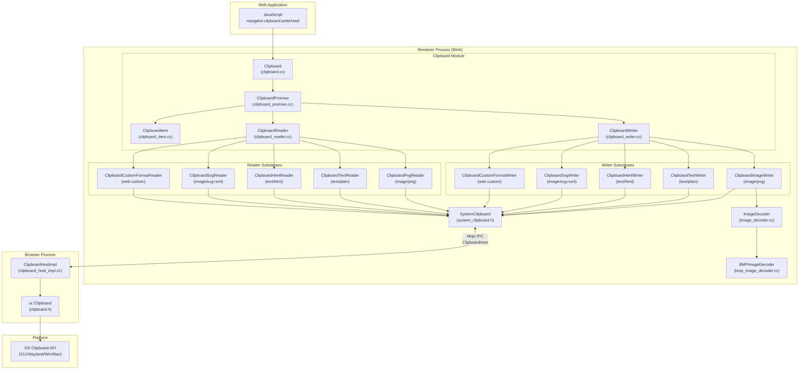
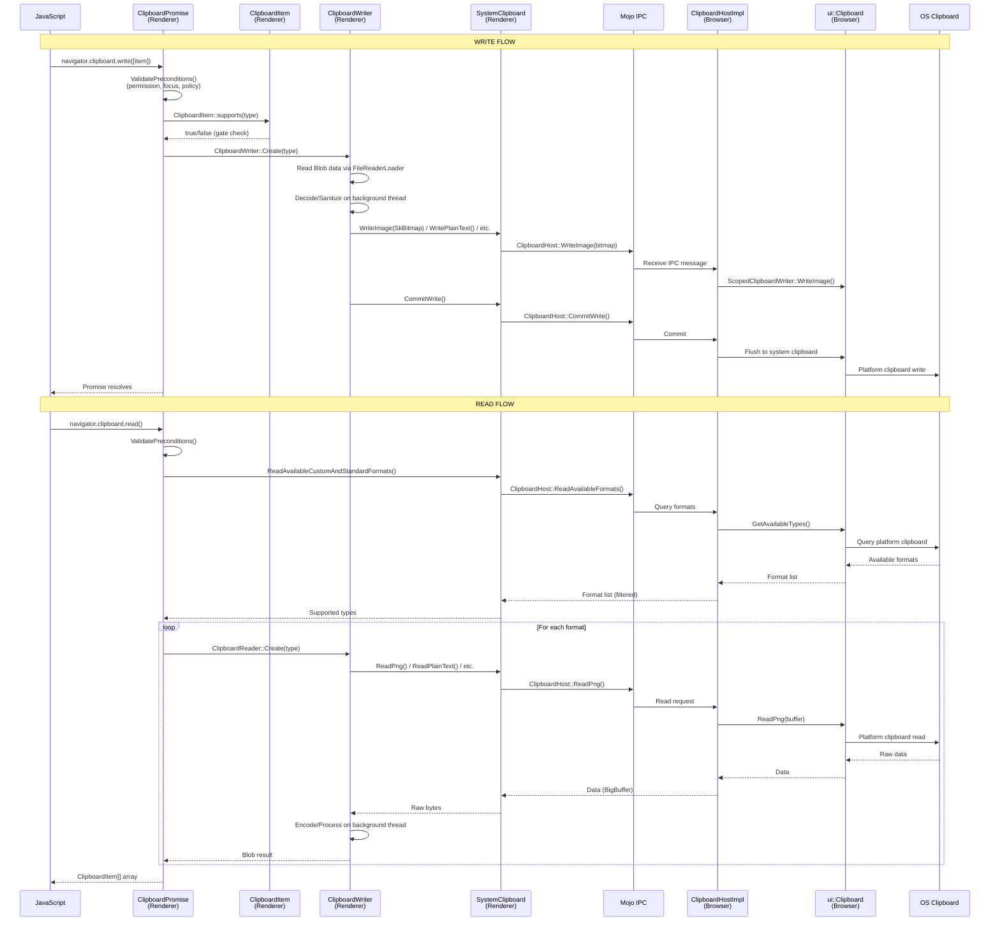
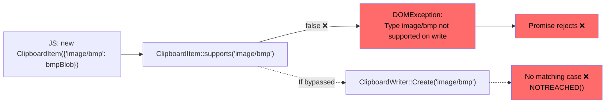

# High-Level Design: 40656585

## 1. Executive Summary

The Chromium Async Clipboard API (`navigator.clipboard.read()`/`.write()`) provides sandboxed, permission-controlled access to the system clipboard with format-specific sanitization. Bug 40656585 reports that `image/bmp` is not in the allowlist of supported MIME types, causing `ClipboardItem.supports('image/bmp')` to return `false` and writes of BMP blobs to throw `DOMException`. The fix involves adding `image/bmp` to the type-support gate in Blink's Clipboard module and wiring new reader/writer classes, reusing the existing `ImageDecoder` (which already handles BMP) and `SystemClipboard::WriteImage()` infrastructure.

## 2. System Context

### 2.1 Overview

The Clipboard API lives in the **Blink renderer process** under `third_party/blink/renderer/modules/clipboard/`. It is part of the **Web Platform APIs** exposed to JavaScript and communicates with the **browser process** via Mojo IPC to perform actual platform clipboard operations. The browser-side implementation (`ClipboardHostImpl`) delegates to the `ui::Clipboard` abstraction layer, which maps to OS-native clipboard APIs.

The bug occurs in the **Blink Clipboard module** type-gating layer — specifically `ClipboardItem::supports()`, `ClipboardWriter::Create()`, and `ClipboardReader::Create()` — which only allow `image/png`, `text/plain`, `text/html`, and `image/svg+xml`.

### 2.2 Related Specs

- [W3C Clipboard API and Events](https://w3c.github.io/clipboard-apis/) — Mandatory data types specification
- [W3C Clipboard API — Mandatory Data Types](https://w3c.github.io/clipboard-apis/#mandatory-data-types-x) — Defines which types implementations should support
- [Chromium Clipboard Design Doc (multiple image formats)](https://docs.google.com/document/d/1XOMFG9-7NYyvqE_pv0qz3M626NZHx7P20uuUmDAyt8Q/edit) — Proposed model for multi-format image clipboard support
- [crbug.com/1029857](https://crbug.com/1029857) — "Add support for other types" (referenced in TODO in `clipboard_item.cc`)
- [crbug.com/1004867](https://crbug.com/1004867) — Performance issues with image/png encoding/decoding on clipboard

## 3. Component Architecture

### 3.1 Major Components

| Component | Location | Responsibility |
|-----------|----------|----------------|
| **Clipboard** | `/third_party/blink/renderer/modules/clipboard/clipboard.cc` | Top-level JS API object (`navigator.clipboard`); creates ClipboardPromise instances |
| **ClipboardPromise** | `/third_party/blink/renderer/modules/clipboard/clipboard_promise.cc` | Main entry point — handles permission checks, orchestrates multi-format read/write loops |
| **ClipboardItem** | `/third_party/blink/renderer/modules/clipboard/clipboard_item.cc` | Represents a single clipboard item; validates supported MIME types via `supports()` |
| **ClipboardWriter** | `/third_party/blink/renderer/modules/clipboard/clipboard_writer.cc` | Base class + factory; dispatches to format-specific writers (Image, Text, HTML, SVG, CustomFormat) |
| **ClipboardReader** | `/third_party/blink/renderer/modules/clipboard/clipboard_reader.cc` | Base class + factory; dispatches to format-specific readers (Png, Text, HTML, SVG, CustomFormat) |
| **SystemClipboard** | `/third_party/blink/renderer/core/clipboard/system_clipboard.h` | Mojo wrapper; translates Blink calls to `ClipboardHost` IPC messages |
| **ClipboardHost (Mojo)** | `/third_party/blink/public/mojom/clipboard/clipboard.mojom` | Mojo interface definition for renderer→browser clipboard IPC |
| **ClipboardHostImpl** | `/content/browser/renderer_host/clipboard_host_impl.cc` | Browser-side Mojo host; enforces data transfer policy, delegates to `ui::Clipboard` |
| **ui::Clipboard** | `/ui/base/clipboard/clipboard.h` | Platform abstraction; base class with platform-specific backends (X11, Wayland, Win, Mac, Android) |
| **ClipboardNonBacked** | `/ui/base/clipboard/clipboard_non_backed.cc` | In-memory clipboard implementation (used on some Linux/ChromeOS); maps format types |
| **ImageDecoder** | `/third_party/blink/renderer/platform/image-decoders/image_decoder.cc` | Auto-detects image format from byte signature, decodes to SkImage/SkBitmap |
| **BMPImageDecoder** | `/third_party/blink/renderer/platform/image-decoders/bmp/bmp_image_decoder.cc` | BMP-specific decoder — already functional, auto-detected by `ImageDecoder::Create()` |
| **clipboard_constants** | `/ui/base/clipboard/clipboard_constants.h` | Defines MIME type string constants (`kMimeTypePng`, `kMimeTypePlainText`, etc.) |

### 3.2 Component Diagram



## 4. Process Architecture

### 4.1 Process Boundaries

The Clipboard API spans two processes with a strict security boundary:

1. **Renderer Process** — Runs Blink; handles JavaScript API calls, format validation, data encoding/decoding, and sanitization. The renderer is sandboxed and cannot access the system clipboard directly.
2. **Browser Process** — Runs `ClipboardHostImpl`; enforces permissions, data transfer policies, and delegates to the platform clipboard via `ui::Clipboard`.

IPC crosses the process boundary via **Mojo** using the `blink::mojom::ClipboardHost` interface. The renderer calls `SystemClipboard` methods, which proxy to the browser's `ClipboardHostImpl` over Mojo.

### 4.2 IPC Flow



## 5. Data Flow

### 5.1 Normal Flow — Write `image/png` (Currently Working)

```mermaid
flowchart LR
    A["JS: new ClipboardItem(#123;'image/png': pngBlob#125;)"] --> B["ClipboardItem::supports('image/png')"]
    B -->|"true"| C["ClipboardWriter::Create('image/png')"]
    C --> D["ClipboardImageWriter"]
    D --> E["FileReaderLoader reads Blob bytes"]
    E --> F["ImageDecoder::Create() on background thread<br/>Detects PNG signature, decodes to SkImage"]
    F --> G["Convert SkImage → SkBitmap"]
    G --> H["SystemClipboard::WriteImage(SkBitmap)"]
    H --> I["Mojo IPC → ClipboardHostImpl"]
    I --> J["ui::Clipboard::WriteImage()"]
    J --> K["OS Clipboard: Bitmap stored"]
    K --> L["CommitWrite() → Promise resolves ✅"]
```



### 5.2 Buggy Flow — Write `image/bmp` (Current — Fails)



### 5.3 Fixed Flow — Write `image/bmp` (After Fix)

```mermaid
flowchart LR
    A["JS: new ClipboardItem(#123;'image/bmp': bmpBlob#125;)"] --> B["ClipboardItem::supports('image/bmp')"]
    B -->|"true ✅"| C["ClipboardWriter::Create('image/bmp')"]
    C --> D["ClipboardImageWriter<br/>(reused from image/png path)"]
    D --> E["FileReaderLoader reads BMP Blob bytes"]
    E --> F["ImageDecoder::Create() on background thread<br/>Auto-detects BMP signature 0x424D,<br/>BMPImageDecoder decodes to SkImage"]
    F --> G["Convert SkImage → SkBitmap"]
    G --> H["SystemClipboard::WriteImage(SkBitmap)"]
    H --> I["Mojo IPC → ClipboardHostImpl"]
    I --> J["ui::Clipboard::WriteImage()"]
    J --> K["OS Clipboard: Bitmap stored"]
    K --> L["CommitWrite() → Promise resolves ✅"]

    style B fill:#51cf66,color:#000
    style L fill:#51cf66,color:#000
```



### 5.4 Fixed Flow — Read `image/bmp` (After Fix)

```mermaid
flowchart LR
    A["JS: navigator.clipboard.read()"] --> B["Query available formats"]
    B --> C["'image/bmp' in available types"]
    C --> D["ClipboardReader::Create('image/bmp')"]
    D --> E["ClipboardBmpReader (new)"]
    E --> F["SystemClipboard::ReadPng()<br/>Returns PNG-encoded bitmap data"]
    F --> G["Decode PNG to SkBitmap<br/>on background thread"]
    G --> H["Encode SkBitmap → BMP format<br/>(prepend BITMAPFILEHEADER +<br/>BITMAPINFOHEADER to pixel data)"]
    H --> I["Create Blob with type 'image/bmp'"]
    I --> J["ClipboardItem with 'image/bmp' type ✅"]

    style E fill:#51cf66,color:#000
    style J fill:#51cf66,color:#000
```



## 6. Key Interfaces

### 6.1 Public APIs (Web-facing)

- **`navigator.clipboard.write(items)`** — Writes `ClipboardItem[]` to clipboard; entry point via `ClipboardPromise::CreateForWrite()`
- **`navigator.clipboard.read()`** — Reads clipboard as `ClipboardItem[]`; entry point via `ClipboardPromise::CreateForRead()`
- **`ClipboardItem.supports(type)`** — Static method; returns `true` if MIME type is supported *(bug gate — needs `image/bmp` added)*
- **`new ClipboardItem({type: blob})`** — Constructor for clipboard items with MIME-typed blobs

### 6.2 Internal Interfaces

- **`ClipboardWriter::Create(const String& mime_type, ClipboardPromise& promise)`** — Factory dispatching to type-specific writer subclasses; needs `kMimeTypeBmp` case
- **`ClipboardReader::Create(ExecutionContext& context, const String& mime_type, ClipboardPromise& promise, bool sanitize_html)`** — Factory dispatching to type-specific reader subclasses; needs `kMimeTypeBmp` case
- **`ClipboardImageWriter::DecodeOnBackgroundThread(DOMArrayBuffer* raw_data)`** — Background-thread image decode using `ImageDecoder`; already handles BMP via auto-detection
- **`SystemClipboard::WriteImage(const SkBitmap&)`** — Sends decoded bitmap to browser process via Mojo
- **`SystemClipboard::ReadPng(mojom::blink::ClipboardBuffer)`** — Reads PNG-encoded image from system clipboard via Mojo
- **`ClipboardHostImpl::ReadPng(buffer, callback)`** — Browser-side handler; reads from `ui::Clipboard::ReadPng()`
- **`ClipboardHostImpl::WriteImage(const SkBitmap&)`** — Browser-side handler; writes bitmap via `ScopedClipboardWriter`
- **`ui::Clipboard::ReadPng(ClipboardBuffer, DataTransferEndpoint*, callback)`** — Platform abstraction for reading clipboard image as PNG
- **`ui::Clipboard::WriteImage(const SkBitmap&)`** — Platform abstraction for writing bitmap to clipboard

### 6.3 Mojo Interface (`ClipboardHost`)

```
// From clipboard.mojom
interface ClipboardHost {
    // Sync reads
    [Sync] ReadPng(ClipboardBuffer buffer) => (mojo_base.mojom.BigBuffer png);
    
    // Async writes
    WriteImage(skia.mojom.BitmapN32 image);
    CommitWrite();
    
    // Format queries
    [Sync] ReadAvailableTypes(ClipboardBuffer buffer) => (array<mojo_base.mojom.BigString16> types);
    ReadAvailableCustomAndStandardFormats() => (array<mojo_base.mojom.String16> types);
}
```

## 7. Threading Model

The Clipboard API uses a multi-threaded model with strict thread affinity:

| Thread | Responsibilities | Synchronization |
|--------|-----------------|-----------------|
| **Main Thread (Blink)** | JS API calls, ClipboardPromise orchestration, permission checks, DOM parsing/sanitization (HTML/SVG), SystemClipboard Mojo calls, FileReaderLoader blob reading | `SEQUENCE_CHECKER` enforces main-thread-only for ClipboardPromise, ClipboardWriter, ClipboardReader |
| **Background Worker Pool** | Image decoding (`ImageDecoder::Create()`), UTF-8 text encoding, Bloom filter operations for custom formats | Posted via `worker_pool::PostTask()`; results returned via `PostCrossThreadTask()` to main thread |
| **Browser IO Thread** | Mojo message dispatch for `ClipboardHostImpl` | Mojo binding ensures single-threaded access |
| **Browser UI Thread** | `ui::Clipboard` platform operations, data transfer policy enforcement | `ScopedClipboardWriter` ensures atomic write batching |

**Key Threading Patterns:**
- Image decode (PNG, BMP) happens on a **background thread** to avoid blocking the renderer main thread
- `PostCrossThreadTask()` is used to marshal decoded results back to the main thread
- `SystemClipboard` Mojo calls may be **synchronous** (e.g., `ReadPng`) or **asynchronous** (e.g., `ReadSvg`), depending on the method
- `CommitWrite()` ensures all format writes are **atomically committed** to the platform clipboard

## 8. External Dependencies

### Chrome Components
- **Skia** (`skia::mojom::BitmapN32`) — Image representation (SkBitmap, SkImage) and PNG encoding/decoding
- **Blink Platform Image Decoders** (`ImageDecoder`, `BMPImageDecoder`) — Format-specific image decoding; BMP decoder already exists and is auto-detected
- **Mojo IPC** — Cross-process communication between renderer and browser
- **Permissions Service** — `PermissionService::RequestPermission()` for clipboard-read/clipboard-write
- **Feature Policy / Permissions Policy** — `clipboard-read` and `clipboard-write` directives
- **DOMParser** — Used for HTML/SVG sanitization via `CreateStrictlyProcessedMarkupWithContext()`

### Platform APIs
- **Linux**: X11 `XGetSelection` / Wayland `wl_data_device` — platform clipboard access
- **macOS**: `NSPasteboard` — pasteboard API
- **Windows**: `OleGetClipboard` / `OpenClipboard` — Win32 clipboard API
- **Android**: `ClipboardManager` — Android clipboard service

### MIME Type Constants
- Defined in `/ui/base/clipboard/clipboard_constants.h`
- Currently missing: `kMimeTypeBmp` (needs to be added)

## 9. Impact of Fix

### 9.1 Components Affected

| Component | Change | Risk |
|-----------|--------|------|
| `clipboard_constants.h` | Add `kMimeTypeBmp` constant | None — additive only |
| `clipboard_item.cc` | Add `kMimeTypeBmp` to `supports()` allowlist | Low — single condition added |
| `clipboard_writer.cc` | Add `kMimeTypeBmp` case in `Create()` factory, routing to existing `ClipboardImageWriter` | Low — reuses existing writer; `ImageDecoder` already handles BMP |
| `clipboard_reader.cc` | Add `ClipboardBmpReader` class + `kMimeTypeBmp` case in `Create()` factory | Medium — new class, but follows exact pattern of `ClipboardPngReader` |
| `clipboard_non_backed.cc` | Optionally map `BitmapType` to include `image/bmp` in format availability | Low — additive mapping |
| `clipboard_host_impl.cc` | Add `kMimeTypeBmp` to standard type filter in `OnReadAvailableTypesForUpdate()` | Low — allowlist addition |

### 9.2 Risk Assessment

- **Scope**: Narrow — changes confined to clipboard type-gating and a new reader class; no IPC changes, no Mojo interface changes, no platform-layer changes
- **Risk Level**: Low — Write path fully reuses existing `ClipboardImageWriter` + `ImageDecoder` (BMP already auto-detected). Read path follows established `ClipboardPngReader` pattern. No changes to browser-side logic required beyond format allowlisting.
- **Testing Coverage**: 
  - Unit tests in `clipboard_unittest.cc` for `supports()`, write, and read round-trips
  - Web platform tests in `clipboard/async-clipboard/` for JS API behavior
  - Existing `BMPImageDecoder` tests validate BMP decode correctness
  - Feature flag (`ClipboardBmpSupport`) provides rollback safety
- **Backwards Compatibility**: Fully backwards-compatible — `image/bmp` support is purely additive; no existing behavior is changed
- **Security**: BMP data is sanitized through the same decode→re-encode pipeline as PNG (decode via `ImageDecoder` → write as SkBitmap → stored as platform bitmap). This prevents malicious BMP payloads from passing through unsanitized.
