# Low-Level Design: 40656585

## 1. Files to Modify

| File | Type | Changes | Lines |
|------|------|---------|-------|
| [/ui/base/clipboard/clipboard_constants.h](/ui/base/clipboard/clipboard_constants.h) | Modify | Add `kMimeTypeBmp` and `kMimeTypeBmp16` constants | ~2 |
| [/third_party/blink/renderer/modules/clipboard/clipboard_item.cc](/third_party/blink/renderer/modules/clipboard/clipboard_item.cc) | Modify | Add `ui::kMimeTypeBmp` to `supports()` allowlist | ~1 |
| [/third_party/blink/renderer/modules/clipboard/clipboard_writer.cc](/third_party/blink/renderer/modules/clipboard/clipboard_writer.cc) | Modify | Add `kMimeTypeBmp` case in `Create()` factory routing to `ClipboardImageWriter` | ~4 |
| [/third_party/blink/renderer/modules/clipboard/clipboard_reader.cc](/third_party/blink/renderer/modules/clipboard/clipboard_reader.cc) | Modify | Add `ClipboardBmpReader` class and `kMimeTypeBmp` case in `Create()` factory | ~60 |
| [/ui/base/clipboard/clipboard_non_backed.cc](/ui/base/clipboard/clipboard_non_backed.cc) | Modify | Add `kMimeTypeBmp16` to `GetStandardFormats()` for BitmapType availability | ~3 |
| [/content/browser/renderer_host/clipboard_host_impl.cc](/content/browser/renderer_host/clipboard_host_impl.cc) | Modify | Add `kMimeTypeBmp16` to allowed standard MIME types filter | ~1 |

## 2. Class Hierarchy

### 2.1 Class Diagram

```mermaid
classDiagram
    class ClipboardWriter {
        <<abstract>>
        +Create(SystemClipboard*, String, ClipboardPromise*) ClipboardWriter*
        +WriteToSystem(V8UnionBlobOrString*)
        +WriteString(String)
        +DidFinishLoading(FileReaderData)
        +DidFail(FileErrorCode)
        #system_clipboard() SystemClipboard*
        #clipboard_task_runner() TaskRunner
        #promise_ : ClipboardPromise*
    }

    class ClipboardStringWriter {
        <<abstract>>
        #DidFinishLoading(FileReaderData)
        #WriteString(String)*
    }

    class ClipboardImageWriter {
        +DidFinishLoading(FileReaderData)
        -StartBinaryWrite(ArrayBufferContents)
        -DecodeOnBackgroundThread(ArrayBufferContents, ...)$
        -Write(sk_sp~SkImage~)
    }

    class ClipboardTextWriter {
        -WriteString(String)
    }

    class ClipboardHtmlWriter {
        -WriteString(String)
    }

    class ClipboardSvgWriter {
        -WriteString(String)
    }

    class ClipboardCustomFormatWriter {
        +DidFinishLoading(FileReaderData)
        -WriteString(String)
        -Write(span~uint8_t~)
        -mime_type_ : String
    }

    ClipboardWriter <|-- ClipboardStringWriter
    ClipboardWriter <|-- ClipboardImageWriter
    ClipboardWriter <|-- ClipboardCustomFormatWriter
    ClipboardStringWriter <|-- ClipboardTextWriter
    ClipboardStringWriter <|-- ClipboardHtmlWriter
    ClipboardStringWriter <|-- ClipboardSvgWriter

    class ClipboardReader {
        <<abstract>>
        +Create(SystemClipboard*, String, ClipboardPromise*, bool) ClipboardReader*
        +Read()*
        #NextRead(Vector~uint8_t~)*
        #clipboard_task_runner_ : TaskRunner
        #promise_ : ClipboardPromise*
        #system_clipboard() SystemClipboard*
    }

    class ClipboardPngReader {
        +Read()
        -NextRead(Vector~uint8_t~)
    }

    class ClipboardBmpReader {
        +Read()
        -EncodeOnBackgroundThread(mojo_base::BigBuffer, ...)$
        -NextRead(Vector~uint8_t~)
    }

    class ClipboardTextReader {
        +Read()
        -OnRead(String)
        -EncodeOnBackgroundThread(String, ...)$
        -NextRead(Vector~uint8_t~)
    }

    class ClipboardHtmlReader {
        +Read()
        -OnRead(String, KURL, unsigned, unsigned)
        -EncodeOnBackgroundThread(String, ...)$
        -NextRead(Vector~uint8_t~)
    }

    class ClipboardSvgReader {
        +Read()
        -OnRead(String)
        -EncodeOnBackgroundThread(String, ...)$
        -NextRead(Vector~uint8_t~)
    }

    class ClipboardCustomFormatReader {
        +Read()
        +OnCustomFormatRead(BigBuffer)
        -NextRead(Vector~uint8_t~)
        -mime_type_ : String
    }

    ClipboardReader <|-- ClipboardPngReader
    ClipboardReader <|-- ClipboardBmpReader
    ClipboardReader <|-- ClipboardTextReader
    ClipboardReader <|-- ClipboardHtmlReader
    ClipboardReader <|-- ClipboardSvgReader
    ClipboardReader <|-- ClipboardCustomFormatReader

    class ClipboardItem {
        +supports(String type)$ bool
        +types() Vector~String~
        +getType(ScriptState*, String) ScriptPromise~Blob~
    }

    class SystemClipboard {
        +ReadPng(ClipboardBuffer) BigBuffer
        +WriteImage(SkBitmap)
        +WritePlainText(String)
        +WriteHTML(String, KURL)
        +WriteSvg(String)
        +CommitWrite()
    }

    class ImageDecoder {
        +Create(SegmentReader, ...) unique_ptr~ImageDecoder~
    }

    class BMPImageDecoder {
    }

    ImageDecoder <|-- BMPImageDecoder

    ClipboardImageWriter --> ImageDecoder : decodes BMP/PNG data
    ClipboardImageWriter --> SystemClipboard : WriteImage()
    ClipboardBmpReader --> SystemClipboard : ReadPng()
    ClipboardPngReader --> SystemClipboard : ReadPng()
    ClipboardItem --> ClipboardWriter : factory validates via supports()
    ClipboardItem --> ClipboardReader : factory validates via supports()

    note for ClipboardBmpReader "NEW CLASS: Reads system clipboard PNG,\ndecodes to SkBitmap on background thread,\nencodes raw pixel data as BMP with\nBITMAPFILEHEADER + BITMAPINFOHEADER"

    note for ClipboardImageWriter "REUSED for image/bmp write:\nImageDecoder auto-detects BMP\nfrom 0x424D byte signature"
```


### 2.2 Class Responsibilities
- **ClipboardWriter**: Abstract base class for writing clipboard data; provides `Create()` factory dispatching to format-specific subclasses
- **ClipboardImageWriter**: Handles writing binary image data (PNG/BMP) — reads blob, decodes on background thread via `ImageDecoder`, writes decoded `SkBitmap` to system clipboard. **Reused for `image/bmp` writes** since `ImageDecoder` auto-detects BMP format.
- **ClipboardReader**: Abstract base class for reading clipboard data; provides `Create()` factory dispatching to format-specific subclasses
- **ClipboardPngReader**: Reads PNG from system clipboard directly (no encoding needed since `ReadPng()` returns PNG bytes)
- **ClipboardBmpReader** *(new)*: Reads PNG from system clipboard via `ReadPng()`, decodes to SkBitmap on background thread, then constructs BMP-formatted bytes (BITMAPFILEHEADER + BITMAPINFOHEADER + raw pixel rows) and creates a Blob with `image/bmp` type
- **ClipboardItem**: Validates supported MIME types via `supports()` — needs `image/bmp` added to the allowlist
- **SystemClipboard**: Mojo IPC wrapper for clipboard read/write operations
- **ImageDecoder / BMPImageDecoder**: Existing image decoder infrastructure — `ImageDecoder::Create()` auto-detects BMP from the `0x42 0x4D` ("BM") byte signature and creates a `BMPImageDecoder`

## 3. Method-Level Analysis

### 3.1 Call Chain (Write Path — Bug Fix)


### 3.2 Call Chain (Read Path — New BMP Reader)


### 3.3 Affected Methods

#### `ClipboardItem::supports()`
**Location**: [/third_party/blink/renderer/modules/clipboard/clipboard_item.cc#L139-L151](/third_party/blink/renderer/modules/clipboard/clipboard_item.cc#L139-L151)

**Current Implementation (Buggy)**:
```cpp
// static
bool ClipboardItem::supports(const String& type) {
  if (type.length() >= mojom::blink::ClipboardHost::kMaxFormatSize) {
    return false;
  }

  if (!Clipboard::ParseWebCustomFormat(type).empty()) {
    return true;
  }

  // TODO(https://crbug.com/1029857): Add support for other types.
  return type == ui::kMimeTypePng || type == ui::kMimeTypePlainText ||
         type == ui::kMimeTypeHtml || type == ui::kMimeTypeSvg;
}
```

**Issues**:
1. The allowlist on line 149-150 does not include `image/bmp`
2. The TODO on line 148 explicitly acknowledges more types need to be added

#### `ClipboardWriter::Create()`
**Location**: [/third_party/blink/renderer/modules/clipboard/clipboard_writer.cc#L241-L273](/third_party/blink/renderer/modules/clipboard/clipboard_writer.cc#L241-L273)

**Current Implementation**:
```cpp
// static
ClipboardWriter* ClipboardWriter::Create(SystemClipboard* system_clipboard,
                                         const String& mime_type,
                                         ClipboardPromise* promise) {
  CHECK(ClipboardItem::supports(mime_type));
  String web_custom_format = Clipboard::ParseWebCustomFormat(mime_type);
  if (!web_custom_format.empty()) {
    return MakeGarbageCollected<ClipboardCustomFormatWriter>(
        system_clipboard, promise, web_custom_format);
  }

  if (mime_type == ui::kMimeTypePng) {
    return MakeGarbageCollected<ClipboardImageWriter>(system_clipboard,
                                                      promise);
  }
  // ... text, html, svg cases ...
  NOTREACHED()
      << "IsValidType() and Create() have inconsistent implementations.";
}
```

**Issues**:
1. No case for `ui::kMimeTypeBmp` — would hit `NOTREACHED()` if `supports()` was bypassed

#### `ClipboardReader::Create()`
**Location**: [/third_party/blink/renderer/modules/clipboard/clipboard_reader.cc#L322-L355](/third_party/blink/renderer/modules/clipboard/clipboard_reader.cc#L322-L355)

**Current Implementation**:
```cpp
ClipboardReader* ClipboardReader::Create(SystemClipboard* system_clipboard,
                                         const String& mime_type,
                                         ClipboardPromise* promise,
                                         bool sanitize_html) {
  CHECK(ClipboardItem::supports(mime_type));
  if (!Clipboard::ParseWebCustomFormat(mime_type).empty()) {
    return MakeGarbageCollected<ClipboardCustomFormatReader>(
        system_clipboard, promise, mime_type);
  }

  if (mime_type == ui::kMimeTypePng) {
    return MakeGarbageCollected<ClipboardPngReader>(system_clipboard, promise);
  }
  // ... text, html, svg cases ...
  NOTREACHED()
      << "IsValidType() and Create() have inconsistent implementations.";
}
```

**Issues**:
1. No case for `ui::kMimeTypeBmp` — would hit `NOTREACHED()`
2. Need a new `ClipboardBmpReader` class to handle BMP read

#### `ClipboardNonBacked::GetStandardFormats()`
**Location**: [/ui/base/clipboard/clipboard_non_backed.cc#L587-L612](/ui/base/clipboard/clipboard_non_backed.cc#L587-L612)

**Current Implementation**:
```cpp
std::vector<std::u16string> ClipboardNonBacked::GetStandardFormats(
    ClipboardBuffer buffer,
    const DataTransferEndpoint* data_dst) const {
  // ...
  if (IsFormatAvailable(ClipboardFormatType::BitmapType(), buffer, data_dst)) {
    types.push_back(kMimeTypePng16);
  }
  // ...
}
```

**Issues**:
1. When a bitmap is available on the clipboard, only `image/png` is reported — `image/bmp` should also be reported so that `OnReadAvailableFormatNames` includes it in the format list

#### `ClipboardHostImpl::OnReadAvailableTypesForUpdate()`
**Location**: [/content/browser/renderer_host/clipboard_host_impl.cc#L893-L914](/content/browser/renderer_host/clipboard_host_impl.cc#L893-L914)

**Current Implementation**:
```cpp
auto filtered_types = base::STLSetIntersection<std::vector<std::u16string>>(
    base::flat_set<std::u16string>{
        ui::kMimeTypePng16,
        ui::kMimeTypeHtml16,
        ui::kMimeTypePlainText16,
    },
    base::MakeFlatSet<std::u16string>(std::move(types)));
```

**Issues**:
1. Filter allowlist does not include `kMimeTypeBmp16` — clipboard change events will not report `image/bmp` availability

## 4. Fix Design

### 4.1 Changes Required

#### File 1: [/ui/base/clipboard/clipboard_constants.h#L38-L39](/ui/base/clipboard/clipboard_constants.h#L38-L39)

**Before** (lines 38-39):
```cpp
inline constexpr char kMimeTypePng[] = "image/png";
inline constexpr char16_t kMimeTypePng16[] = u"image/png";
```

**After**:
```cpp
inline constexpr char kMimeTypePng[] = "image/png";
inline constexpr char16_t kMimeTypePng16[] = u"image/png";
inline constexpr char kMimeTypeBmp[] = "image/bmp";
inline constexpr char16_t kMimeTypeBmp16[] = u"image/bmp";
```

**Rationale**: All MIME type constants used in the clipboard system are defined in this header. Adding `kMimeTypeBmp` and `kMimeTypeBmp16` follows the established pattern for `kMimeTypePng`, `kMimeTypeSvg`, etc. The `char16_t` variant is needed for platform-level format reporting in `GetStandardFormats()` and `OnReadAvailableTypesForUpdate()`.

---

#### File 2: [/third_party/blink/renderer/modules/clipboard/clipboard_item.cc#L148-L150](/third_party/blink/renderer/modules/clipboard/clipboard_item.cc#L148-L150)

**Before** (lines 148-150):
```cpp
  // TODO(https://crbug.com/1029857): Add support for other types.
  return type == ui::kMimeTypePng || type == ui::kMimeTypePlainText ||
         type == ui::kMimeTypeHtml || type == ui::kMimeTypeSvg;
```

**After**:
```cpp
  // TODO(https://crbug.com/1029857): Add support for other types.
  return type == ui::kMimeTypePng || type == ui::kMimeTypeBmp ||
         type == ui::kMimeTypePlainText || type == ui::kMimeTypeHtml ||
         type == ui::kMimeTypeSvg;
```

**Rationale**: This is the primary gate that prevents `image/bmp` from being used. Adding `ui::kMimeTypeBmp` to the condition allows the Clipboard API to accept BMP MIME type for both read and write operations. Placed after PNG since both are image types.

---

#### File 3: [/third_party/blink/renderer/modules/clipboard/clipboard_writer.cc#L254-L258](/third_party/blink/renderer/modules/clipboard/clipboard_writer.cc#L254-L258)

**Before** (lines 254-258):
```cpp
  if (mime_type == ui::kMimeTypePng) {
    return MakeGarbageCollected<ClipboardImageWriter>(system_clipboard,
                                                      promise);
  }

  if (mime_type == ui::kMimeTypePlainText) {
```

**After**:
```cpp
  if (mime_type == ui::kMimeTypePng || mime_type == ui::kMimeTypeBmp) {
    return MakeGarbageCollected<ClipboardImageWriter>(system_clipboard,
                                                      promise);
  }

  if (mime_type == ui::kMimeTypePlainText) {
```

**Rationale**: `ClipboardImageWriter` uses `ImageDecoder::Create()` which auto-detects image format from byte signatures. The `BMPImageDecoder` is already registered and detects BMP data from the `0x42 0x4D` ("BM") signature at offset 0. The decoded result is an `SkBitmap` that is written to the system clipboard via `SystemClipboard::WriteImage()`. No new writer class is needed — the existing `ClipboardImageWriter` handles BMP transparently.

---

#### File 4: [/third_party/blink/renderer/modules/clipboard/clipboard_reader.cc](/third_party/blink/renderer/modules/clipboard/clipboard_reader.cc) — New `ClipboardBmpReader` class

**Add after `ClipboardPngReader` class (after line 59), new class**:

```cpp
// Reads an image from the System Clipboard as a Blob with image/bmp content.
// Reads PNG data from the system clipboard, decodes it to SkBitmap, then
// encodes the pixel data as a BMP file (BITMAPFILEHEADER + BITMAPINFOHEADER
// + raw pixel rows).
class ClipboardBmpReader final : public ClipboardReader {
 public:
  explicit ClipboardBmpReader(SystemClipboard* system_clipboard,
                              ClipboardPromise* promise)
      : ClipboardReader(system_clipboard, promise) {}
  ~ClipboardBmpReader() override = default;

  ClipboardBmpReader(const ClipboardBmpReader&) = delete;
  ClipboardBmpReader& operator=(const ClipboardBmpReader&) = delete;

  void Read() override {
    DCHECK_CALLED_ON_VALID_SEQUENCE(sequence_checker_);
    mojo_base::BigBuffer data =
        system_clipboard()->ReadPng(mojom::blink::ClipboardBuffer::kStandard);

    if (!data.size()) {
      promise_->OnRead(nullptr);
      return;
    }

    worker_pool::PostTask(
        FROM_HERE,
        CrossThreadBindOnce(&ClipboardBmpReader::EncodeOnBackgroundThread,
                            std::move(data), MakeCrossThreadHandle(this),
                            clipboard_task_runner_));
  }

 private:
  static void EncodeOnBackgroundThread(
      mojo_base::BigBuffer png_data,
      CrossThreadHandle<ClipboardBmpReader> reader,
      scoped_refptr<base::SingleThreadTaskRunner> clipboard_task_runner) {
    DCHECK(!IsMainThread());

    // Decode the PNG data to SkBitmap.
    std::unique_ptr<ImageDecoder> decoder = ImageDecoder::Create(
        SegmentReader::CreateFromSkData(
            SkData::MakeWithoutCopy(png_data.data(), png_data.size())),
        /*data_complete=*/true, ImageDecoder::kAlphaPremultiplied,
        ImageDecoder::kDefaultBitDepth, ColorBehavior::kTag,
        cc::AuxImage::kDefault, Platform::GetMaxDecodedImageBytes());

    Vector<uint8_t> bmp_bytes;
    if (decoder) {
      sk_sp<SkImage> image =
          ImageBitmap::GetSkImageFromDecoder(std::move(decoder));
      if (image) {
        SkBitmap bitmap;
        if (image->asLegacyBitmap(&bitmap)) {
          bmp_bytes = EncodeBmp(bitmap);
        }
      }
    }

    PostCrossThreadTask(
        *clipboard_task_runner, FROM_HERE,
        CrossThreadBindOnce(
            &ClipboardBmpReader::NextRead,
            MakeUnwrappingCrossThreadHandle(std::move(reader)),
            std::move(bmp_bytes)));
  }

  // Encodes an SkBitmap as a BMP file (uncompressed, 32-bit BGRA).
  static Vector<uint8_t> EncodeBmp(const SkBitmap& bitmap) {
    const int width = bitmap.width();
    const int height = bitmap.height();
    // BMP rows must be aligned to 4 bytes. For 32bpp, row size is always
    // 4-byte aligned (width * 4).
    const uint32_t row_bytes = static_cast<uint32_t>(width) * 4;
    const uint32_t pixel_data_size = row_bytes * static_cast<uint32_t>(height);
    const uint32_t file_header_size = 14;
    const uint32_t info_header_size = 40;
    const uint32_t header_size = file_header_size + info_header_size;
    const uint32_t file_size = header_size + pixel_data_size;

    Vector<uint8_t> bmp_data;
    bmp_data.resize(file_size);
    auto* data = bmp_data.data();

    // BITMAPFILEHEADER (14 bytes)
    data[0] = 'B';
    data[1] = 'M';
    data[2] = static_cast<uint8_t>(file_size);
    data[3] = static_cast<uint8_t>(file_size >> 8);
    data[4] = static_cast<uint8_t>(file_size >> 16);
    data[5] = static_cast<uint8_t>(file_size >> 24);
    data[6] = 0;   // reserved
    data[7] = 0;   // reserved
    data[8] = 0;   // reserved
    data[9] = 0;   // reserved
    data[10] = static_cast<uint8_t>(header_size);
    data[11] = static_cast<uint8_t>(header_size >> 8);
    data[12] = static_cast<uint8_t>(header_size >> 16);
    data[13] = static_cast<uint8_t>(header_size >> 24);

    // BITMAPINFOHEADER (40 bytes)
    auto WriteLE32 = [](uint8_t* p, uint32_t v) {
      p[0] = static_cast<uint8_t>(v);
      p[1] = static_cast<uint8_t>(v >> 8);
      p[2] = static_cast<uint8_t>(v >> 16);
      p[3] = static_cast<uint8_t>(v >> 24);
    };
    auto WriteLE16 = [](uint8_t* p, uint16_t v) {
      p[0] = static_cast<uint8_t>(v);
      p[1] = static_cast<uint8_t>(v >> 8);
    };

    WriteLE32(data + 14, info_header_size);       // biSize
    WriteLE32(data + 18, static_cast<uint32_t>(width));   // biWidth
    // Negative height = top-down DIB (no need to flip rows)
    int32_t neg_height = -height;
    WriteLE32(data + 22, static_cast<uint32_t>(neg_height)); // biHeight
    WriteLE16(data + 26, 1);                      // biPlanes
    WriteLE16(data + 28, 32);                     // biBitCount (32bpp BGRA)
    WriteLE32(data + 30, 0);                      // biCompression (BI_RGB)
    WriteLE32(data + 34, pixel_data_size);        // biSizeImage
    WriteLE32(data + 38, 2835);                   // biXPelsPerMeter (~72 DPI)
    WriteLE32(data + 42, 2835);                   // biYPelsPerMeter (~72 DPI)
    WriteLE32(data + 46, 0);                      // biClrUsed
    WriteLE32(data + 50, 0);                      // biClrImportant

    // Pixel data: convert from SkBitmap (RGBA or BGRA) to BMP BGRA format
    SkPixmap pixmap;
    if (!bitmap.peekPixels(&pixmap)) {
      return Vector<uint8_t>();
    }

    uint8_t* dst = data + header_size;
    for (int y = 0; y < height; ++y) {
      const uint8_t* src_row =
          static_cast<const uint8_t*>(pixmap.addr(0, y));
      for (int x = 0; x < width; ++x) {
        // SkBitmap with kN32 color type is BGRA on little-endian (all
        // supported platforms) and RGBA on big-endian. BMP expects BGRA.
        uint8_t b, g, r, a;
        if (kN32_SkColorType == kBGRA_8888_SkColorType) {
          b = src_row[x * 4 + 0];
          g = src_row[x * 4 + 1];
          r = src_row[x * 4 + 2];
          a = src_row[x * 4 + 3];
        } else {
          // RGBA → BGRA
          r = src_row[x * 4 + 0];
          g = src_row[x * 4 + 1];
          b = src_row[x * 4 + 2];
          a = src_row[x * 4 + 3];
        }
        dst[y * row_bytes + x * 4 + 0] = b;
        dst[y * row_bytes + x * 4 + 1] = g;
        dst[y * row_bytes + x * 4 + 2] = r;
        dst[y * row_bytes + x * 4 + 3] = a;
      }
    }

    return bmp_data;
  }

  void NextRead(Vector<uint8_t> bmp_bytes) override {
    DCHECK_CALLED_ON_VALID_SEQUENCE(sequence_checker_);
    Blob* blob = nullptr;
    if (bmp_bytes.size()) {
      blob = Blob::Create(bmp_bytes, ui::kMimeTypeBmp);
    }
    promise_->OnRead(blob);
  }
};
```

**Additional includes needed at the top of `clipboard_reader.cc`**:
```cpp
#include "third_party/blink/public/platform/platform.h"
#include "third_party/blink/renderer/platform/image-decoders/image_decoder.h"
```

**Add `kMimeTypeBmp` case in `Create()` factory (after the PNG case, line 338)**:

**Before** (lines 336-341):
```cpp
  if (mime_type == ui::kMimeTypePng) {
    return MakeGarbageCollected<ClipboardPngReader>(system_clipboard, promise);
  }

  if (mime_type == ui::kMimeTypePlainText) {
    return MakeGarbageCollected<ClipboardTextReader>(system_clipboard, promise);
```

**After**:
```cpp
  if (mime_type == ui::kMimeTypePng) {
    return MakeGarbageCollected<ClipboardPngReader>(system_clipboard, promise);
  }

  if (mime_type == ui::kMimeTypeBmp) {
    return MakeGarbageCollected<ClipboardBmpReader>(system_clipboard, promise);
  }

  if (mime_type == ui::kMimeTypePlainText) {
    return MakeGarbageCollected<ClipboardTextReader>(system_clipboard, promise);
```

**Rationale**: The read path requires a new `ClipboardBmpReader` because the system clipboard returns PNG-encoded data via `ReadPng()`, but the web application expects `image/bmp` data. `ClipboardBmpReader` follows the established pattern: read system clipboard data → decode/encode on background thread → create Blob on main thread. The BMP encoding is straightforward: the uncompressed 32-bit BGRA format consists of two small fixed-size headers plus raw pixel data from the decoded SkBitmap.

---

#### File 5: [/ui/base/clipboard/clipboard_non_backed.cc#L604-L606](/ui/base/clipboard/clipboard_non_backed.cc#L604-L606)

**Before** (lines 604-606):
```cpp
  if (IsFormatAvailable(ClipboardFormatType::BitmapType(), buffer, data_dst)) {
    types.push_back(kMimeTypePng16);
  }
```

**After**:
```cpp
  if (IsFormatAvailable(ClipboardFormatType::BitmapType(), buffer, data_dst)) {
    types.push_back(kMimeTypePng16);
    types.push_back(kMimeTypeBmp16);
  }
```

**Rationale**: When a bitmap is available on the system clipboard, both `image/png` and `image/bmp` should be reported as available standard formats. This allows the read flow's `OnReadAvailableFormatNames()` to see `image/bmp` in the format list and create a `ClipboardBmpReader` for it. The bitmap data is the same underlying data — the reader handles format conversion.

---

#### File 6: [/content/browser/renderer_host/clipboard_host_impl.cc#L904-L909](/content/browser/renderer_host/clipboard_host_impl.cc#L904-L909)

**Before** (lines 904-909):
```cpp
  auto filtered_types = base::STLSetIntersection<std::vector<std::u16string>>(
      base::flat_set<std::u16string>{
          ui::kMimeTypePng16,
          ui::kMimeTypeHtml16,
          ui::kMimeTypePlainText16,
      },
      base::MakeFlatSet<std::u16string>(std::move(types)));
```

**After**:
```cpp
  auto filtered_types = base::STLSetIntersection<std::vector<std::u16string>>(
      base::flat_set<std::u16string>{
          ui::kMimeTypePng16,
          ui::kMimeTypeBmp16,
          ui::kMimeTypeHtml16,
          ui::kMimeTypePlainText16,
      },
      base::MakeFlatSet<std::u16string>(std::move(types)));
```

**Rationale**: The `OnReadAvailableTypesForUpdate()` method filters clipboard types for clipboard change events dispatched to web pages. Without adding `kMimeTypeBmp16` to this filter, clipboard change events would never report `image/bmp` as an available type, even when the underlying system clipboard contains bitmap data and `GetStandardFormats()` reports it.

## 5. Memory & Lifetime Considerations

### 5.1 Object Ownership
- **ClipboardBmpReader**: Owned by garbage collection (`GarbageCollected<ClipboardReader>`). The reader is created by `ClipboardReader::Create()` and its reference is held by the `ClipboardPromise` during the read operation.
- **mojo_base::BigBuffer (PNG data)**: Passed by value to the background thread. The buffer owns its memory; once the background thread finishes, the buffer is destroyed.
- **Vector<uint8_t> (BMP data)**: Created on the background thread and moved via `CrossThreadBindOnce` to the main thread. Ownership transfers cleanly.
- **SkBitmap / SkImage**: Created on the background thread during BMP encoding. Destroyed on the background thread after encoding completes. No cross-thread reference hazard.
- **CrossThreadHandle<ClipboardBmpReader>**: Safe weak handle for cross-thread reference to the reader. `MakeUnwrappingCrossThreadHandle` ensures proper garbage collection integration.

### 5.2 Pointer/Reference Safety
- [x] No raw pointer issues — all objects use Oilpan GC or RAII ownership
- [x] Weak pointers handled correctly — `CrossThreadHandle` provides safe weak references
- [x] Reference lifetime guaranteed — `ClipboardPromise` keeps the reader alive during async operations

## 6. Threading Considerations

### 6.1 Thread Safety
- **Main Thread**: `ClipboardBmpReader::Read()` reads from system clipboard (synchronous Mojo call); `NextRead()` creates the Blob and resolves the promise. Both are guarded by `DCHECK_CALLED_ON_VALID_SEQUENCE(sequence_checker_)`.
- **Background Thread**: `EncodeOnBackgroundThread()` is a static method that receives all data by value/move. No shared mutable state. The PNG-to-BMP conversion is CPU-bound and benefits from off-main-thread execution.
- **Cross-Thread Communication**: Uses `PostCrossThreadTask()` with `CrossThreadBindOnce()` to marshal the BMP-encoded result back to the main thread. This follows the exact same pattern as `ClipboardTextReader`, `ClipboardHtmlReader`, and `ClipboardSvgReader`.

### 6.2 Required Synchronization
No additional synchronization is required. The existing patterns (`worker_pool::PostTask` + `PostCrossThreadTask`) provide correct sequencing:
1. Main thread → background thread: `worker_pool::PostTask` with data passed by value/move
2. Background thread → main thread: `PostCrossThreadTask` with `CrossThreadHandle` unwrapping

## 7. Error Handling

### 7.1 Current Error Handling
- `ClipboardPngReader::Read()`: If `ReadPng()` returns empty data, passes `nullptr` blob to `promise_->OnRead()`, which skips the format
- `ClipboardImageWriter::Write()`: If `ImageDecoder` fails (returns null image), calls `promise_->RejectFromReadOrDecodeFailure()`
- `ClipboardPromise::OnRead()`: Handles null blobs gracefully — increments index and reads next format

### 7.2 Changes to Error Handling
- **ClipboardBmpReader::Read()**: If `ReadPng()` returns empty data, calls `promise_->OnRead(nullptr)` immediately (no background thread needed). Same pattern as `ClipboardPngReader`.
- **ClipboardBmpReader::EncodeOnBackgroundThread()**: If PNG decode fails (null decoder or null image), or if `asLegacyBitmap()` fails, or if `peekPixels()` fails, returns empty `Vector<uint8_t>`. `NextRead()` then passes `nullptr` blob to `promise_->OnRead()`.
- No new exception types or error codes are introduced.

## 8. Validation Points

### 8.1 DCHECKs to Add/Modify
The new `ClipboardBmpReader` uses existing DCHECK patterns:
```cpp
DCHECK_CALLED_ON_VALID_SEQUENCE(sequence_checker_);  // in Read(), NextRead()
DCHECK(!IsMainThread());  // in EncodeOnBackgroundThread()
```

No additional DCHECKs are needed. The `CHECK(ClipboardItem::supports(mime_type))` in `ClipboardReader::Create()` and `ClipboardWriter::Create()` already validates that only supported types reach the factory.

### 8.2 Invariants to Maintain
1. **`supports()` ↔ `Create()` consistency**: Every MIME type accepted by `ClipboardItem::supports()` must have a corresponding case in both `ClipboardWriter::Create()` and `ClipboardReader::Create()`. The `NOTREACHED()` at the end of each factory enforces this.
2. **BMP format validity**: The `EncodeBmp()` static method must produce a valid BMP file. Key invariants:
   - File signature is `0x42 0x4D` ("BM")
   - `bfOffBits` (offset to pixel data) equals `file_header_size + info_header_size` = 54
   - `biSize` = 40 (BITMAPINFOHEADER size)
   - `biBitCount` = 32 (32-bit BGRA)
   - `biCompression` = 0 (BI_RGB, uncompressed)
   - Row stride is `width * 4` (always 4-byte aligned for 32bpp)
   - Negative `biHeight` indicates top-down row order
3. **Thread affinity**: System clipboard reads happen on main thread only; encoding happens on background thread only.

## 9. Test Requirements

### 9.1 Unit Tests Needed
| Test Name | Purpose | File |
|-----------|---------|------|
| `ClipboardItem.SupportsBmp` | Verify `ClipboardItem::supports("image/bmp")` returns `true` | [/third_party/blink/renderer/modules/clipboard/clipboard_unittest.cc](/third_party/blink/renderer/modules/clipboard/clipboard_unittest.cc) |
| `ClipboardWriter.CreateBmpWriter` | Verify `ClipboardWriter::Create()` returns `ClipboardImageWriter` for `image/bmp` | [/third_party/blink/renderer/modules/clipboard/clipboard_unittest.cc](/third_party/blink/renderer/modules/clipboard/clipboard_unittest.cc) |
| `ClipboardReader.CreateBmpReader` | Verify `ClipboardReader::Create()` returns `ClipboardBmpReader` for `image/bmp` | [/third_party/blink/renderer/modules/clipboard/clipboard_unittest.cc](/third_party/blink/renderer/modules/clipboard/clipboard_unittest.cc) |

### 9.2 Web Platform Tests Needed
| Test Name | Purpose | File |
|-----------|---------|------|
| `async-clipboard-bmp-supports.html` | Verify `ClipboardItem.supports("image/bmp")` returns `true` from JS | [/third_party/blink/web_tests/clipboard/async-clipboard/](/third_party/blink/web_tests/clipboard/async-clipboard/) |
| `async-clipboard-bmp-write-read.html` | Verify BMP write/read round-trip via async Clipboard API | [/third_party/blink/web_tests/clipboard/async-clipboard/](/third_party/blink/web_tests/clipboard/async-clipboard/) |

### 9.3 Test Scenarios
1. **`ClipboardItem.supports("image/bmp")` returns `true`**: Call the static method and verify it returns `true` for `"image/bmp"`.
2. **Write `image/bmp` blob succeeds**: Create a `ClipboardItem` with an `image/bmp` blob containing valid BMP data, write it via `navigator.clipboard.write()`, and verify the promise resolves without error.
3. **Read after BMP write returns valid BMP**: After writing a BMP blob, call `navigator.clipboard.read()`, verify the returned `ClipboardItem` has `"image/bmp"` in its `types()`, and verify the blob data starts with "BM" signature.
4. **Invalid BMP data write**: Write a blob with `image/bmp` type but invalid data (e.g., random bytes). Verify the promise rejects with a decode failure (since `ImageDecoder` will fail to decode).
5. **Empty clipboard read**: When no bitmap is on the clipboard, verify `image/bmp` does not appear in the read types.
6. **Large BMP write/read**: Write a large BMP (e.g., 4096×4096) and verify the round-trip succeeds without timeout or memory issues.
