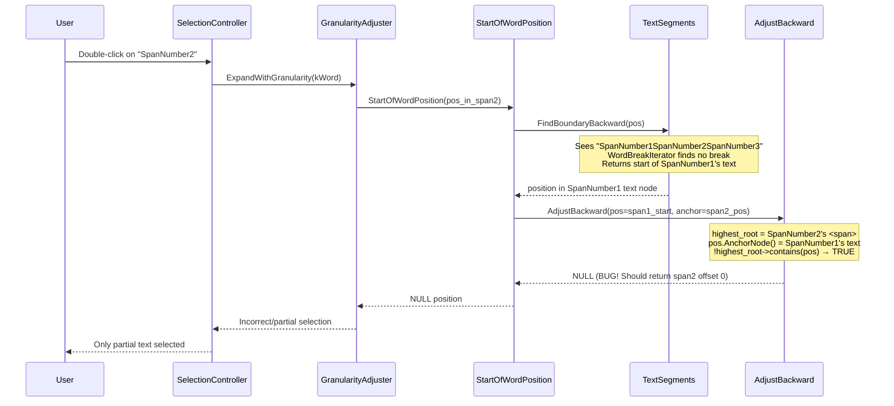

# Fix Assessment: 40848794

## Executive Summary
Double-clicking text in adjacent contenteditable `<span>` elements (with no whitespace between closing/opening tags) fails to select the full word because `AdjustBackwardPositionToAvoidCrossingEditingBoundariesTemplate()` returns a null position when the computed word-start falls in a sibling contenteditable span. The recommended fix is to clamp the backward-adjusted position to the first position in the anchor's text node, symmetric with how the forward adjustment already handles this case.

## Bug Analysis

### Problem Statement
When contenteditable `<span>` elements are placed adjacent to each other without whitespace between the closing and opening tags, double-clicking on text in the 2nd or 3rd span does not select the entire word. Only a partial selection is made, or the selection fails entirely.

### Expected Behavior
Double-clicking on any word in a contenteditable span should select the entire word within that span, regardless of whether adjacent spans are separated by whitespace.

### Actual Behavior
Double-clicking "SpanNumber2" or "SpanNumber3" in adjacent spans selects only a partial range (e.g., `SpanN^umber2|` instead of `^SpanNumber2|`). The first span ("SpanNumber1") works correctly. Firefox handles this correctly.

### Triggering Conditions
1. Multiple `<span contenteditable="true">` elements are adjacent siblings with **no whitespace** between closing/opening tags
2. User double-clicks on text in the 2nd or 3rd span
3. The word break iterator sees the concatenated text across spans as a single word
4. The backward boundary adjustment returns null instead of clamping to the editing boundary

## Root Cause Analysis

### Code Investigation

The double-click word selection flows through:
1. `SelectionController::HandleDoubleClick()` → `SelectClosestWordFromHitTestResult()`
2. → `ExpandWithGranularity(selection, TextGranularity::kWord)`
3. → `SelectionAdjuster::AdjustSelectionRespectingGranularity()` → `GranularityAdjuster::ComputeStartRespectingGranularityAlgorithm()`
4. → `StartOfWordPosition(position, side)` in [/third_party/blink/renderer/core/editing/visible_units_word.cc#L358](/third_party/blink/renderer/core/editing/visible_units_word.cc#L358)
5. → `StartOfWordPositionInternal()` → `TextSegments::FindBoundaryBackward()` → uses `TextOffsetMapping` which concatenates text across element boundaries

The `TextOffsetMapping` creates a mapping for the entire `LayoutBlockFlow` (the parent `<div>`), so the text seen by the word break iterator is `"SpanNumber1SpanNumber2SpanNumber3"` — one continuous string with no word breaks between spans. The `WordBreakIterator::preceding()` call finds no break between "1" and "S", so the word start is computed to be at the beginning of "SpanNumber1" text node.

After `StartOfWordPositionInternal()` finds the word start in SpanNumber1's text node, `StartOfWordPosition()` calls `AdjustBackwardPositionToAvoidCrossingEditingBoundaries()` which should clamp the position to the current editing boundary — but instead returns null.

### Key Files Identified
- [/third_party/blink/renderer/core/editing/visible_units.cc#L234](/third_party/blink/renderer/core/editing/visible_units.cc#L234) - `AdjustBackwardPositionToAvoidCrossingEditingBoundariesTemplate()` — **contains the bug**
- [/third_party/blink/renderer/core/editing/visible_units.cc#L284](/third_party/blink/renderer/core/editing/visible_units.cc#L284) - `AdjustForwardPositionToAvoidCrossingEditingBoundariesTemplate()` — has the correct pattern (clamps to last position)
- [/third_party/blink/renderer/core/editing/visible_units_word.cc#L358](/third_party/blink/renderer/core/editing/visible_units_word.cc#L358) - `StartOfWordPosition()` — calls the buggy function
- [/third_party/blink/renderer/core/editing/visible_units_word.cc#L262](/third_party/blink/renderer/core/editing/visible_units_word.cc#L262) - `StartOfWordPositionInternal()` — finds word boundary across editing contexts
- [/third_party/blink/renderer/core/editing/text_segments.cc#L61](/third_party/blink/renderer/core/editing/text_segments.cc#L61) - `FindBoundaryBackward()` — iterates through inline contents
- [/third_party/blink/renderer/core/editing/text_offset_mapping.cc#L154](/third_party/blink/renderer/core/editing/text_offset_mapping.cc#L154) - `ComputeInlineContentsAsBlockFlow()` — determines inline content scope
- [/third_party/blink/renderer/core/editing/selection_adjuster.cc#L129](/third_party/blink/renderer/core/editing/selection_adjuster.cc#L129) - `ComputeStartRespectingGranularityAlgorithm()` — calls `StartOfWordPosition()`
- [/third_party/blink/renderer/core/editing/selection_controller.cc#L734](/third_party/blink/renderer/core/editing/selection_controller.cc#L734) - `SelectClosestWordFromHitTestResult()` — entry point for double-click word selection

### Root Cause
**Location**: [/third_party/blink/renderer/core/editing/visible_units.cc#L244](/third_party/blink/renderer/core/editing/visible_units.cc#L244)
**Function**: `AdjustBackwardPositionToAvoidCrossingEditingBoundariesTemplate()`
**Issue**: When the computed word-start position (`pos`) is inside a different contenteditable element from the anchor position, the function returns a null/empty position instead of clamping to the first position within the anchor's editing context. This is an asymmetry with `AdjustForwardPositionToAvoidCrossingEditingBoundariesTemplate()` (line 294-306) which correctly clamps to the last position in the anchor's text node.

The buggy code at line 244:
```cpp
if (highest_root && !highest_root->contains(pos.AnchorNode())) {
    return PositionWithAffinityTemplate<Strategy>();  // BUG: returns null
}
```

The forward function (line 294-306) handles the symmetric case correctly:
```cpp
if (highest_root && !pos.AnchorNode()->IsDescendantOf(highest_root)) {
    const Node* last_editable = anchor.ComputeContainerNode();
    if (last_editable->IsTextNode()) {
        PositionTemplate<Strategy> last_position =
            PositionTemplate<Strategy>::LastPositionInNode(*last_editable);
        if (anchor != last_position) {
            return PositionWithAffinityTemplate<Strategy>(last_position);
        }
    }
    return PositionWithAffinityTemplate<Strategy>();
}
```

The backward function should symmetrically return `FirstPositionInNode()`.

### Code Flow Diagram


## Fix Options

### Option 1: Fix AdjustBackwardPositionToAvoidCrossingEditingBoundaries ⭐ RECOMMENDED
- **Description**: Add clamping logic to return `FirstPositionInNode()` of the anchor's text node when the found position is outside the editing root, symmetric with the forward adjustment function.
- **Files to modify**: 
  - [/third_party/blink/renderer/core/editing/visible_units.cc#L244](/third_party/blink/renderer/core/editing/visible_units.cc#L244)
- **Change**:
```cpp
// Before (buggy):
if (highest_root && !highest_root->contains(pos.AnchorNode())) {
    return PositionWithAffinityTemplate<Strategy>();
}

// After (fixed):
if (highest_root && !highest_root->contains(pos.AnchorNode())) {
    const Node* first_editable = anchor.ComputeContainerNode();
    if (first_editable->IsTextNode()) {
      PositionTemplate<Strategy> first_position =
          PositionTemplate<Strategy>::FirstPositionInNode(*first_editable);
      if (anchor != first_position) {
        return PositionWithAffinityTemplate<Strategy>(first_position);
      }
    }
    return PositionWithAffinityTemplate<Strategy>();
}
```
- **Complexity**: Low
- **Risk**: Low — mirrors existing pattern from the forward adjustment. The change is narrow and only affects the case where backward word boundary crosses editing boundaries.
- **Pros**: 
  - Minimal code change (5 lines added)
  - Symmetric with existing forward adjustment logic
  - Only triggers when position crosses editing boundary
  - Fixes all three scenarios (SpanNumber1/2/3)
- **Cons**: 
  - Falls through to returning null if anchor is already at position 0 of text (edge case where this is likely correct anyway since it implies the word starts there)

### Option 2: Treat element boundaries as word breaks in TextSegments
- **Description**: Modify `TextSegments::FindBoundaryBackward()` or the `TextOffsetMapping` to recognize contenteditable element boundaries as word breaks, so the word break iterator never returns a position across an editing boundary.
- **Files to modify**: 
  - [/third_party/blink/renderer/core/editing/text_segments.cc](/third_party/blink/renderer/core/editing/text_segments.cc)
  - [/third_party/blink/renderer/core/editing/text_offset_mapping.cc](/third_party/blink/renderer/core/editing/text_offset_mapping.cc)
- **Complexity**: High
- **Risk**: High — `TextOffsetMapping` and `TextSegments` are used by many text processing functions (sentence, line, paragraph boundaries). Changes could have wide-ranging side effects.
- **Pros**: 
  - Fixes the root cause at a deeper level
  - Would prevent similar issues with sentence/paragraph boundaries
- **Cons**: 
  - High risk of breaking other text boundary operations
  - Complex implementation requiring changes to inline content computation
  - Harder to test all affected code paths

### Option 3: Fix at the SelectionAdjuster/GranularityAdjuster level
- **Description**: In `GranularityAdjuster::ComputeStartRespectingGranularityAlgorithm()`, detect when `StartOfWordPosition()` returns null and fall back to the first position in the anchor's contenteditable element.
- **Files to modify**: 
  - [/third_party/blink/renderer/core/editing/selection_adjuster.cc#L129](/third_party/blink/renderer/core/editing/selection_adjuster.cc#L129)
- **Complexity**: Medium
- **Risk**: Medium — adds workaround logic at a higher level rather than fixing the underlying issue.
- **Pros**: 
  - Doesn't modify the low-level boundary adjustment functions
  - Only affects word-granularity selection
- **Cons**: 
  - Doesn't fix the underlying issue in `AdjustBackward...`
  - Other callers of `StartOfWordPosition` would still get null
  - Workaround rather than proper fix

### Option 4: Fix in StartOfWordPosition to handle null return
- **Description**: In `StartOfWordPosition()` (visible_units_word.cc:358-364), if `AdjustBackward...` returns null, fall back to the first position in the anchor's editing root.
- **Files to modify**:
  - [/third_party/blink/renderer/core/editing/visible_units_word.cc#L358](/third_party/blink/renderer/core/editing/visible_units_word.cc#L358)
- **Complexity**: Low
- **Risk**: Low-Medium — only affects word position calculation, but is a workaround rather than fixing the adjustment function itself.
- **Pros**: 
  - Low complexity
  - Targeted to word boundaries only
- **Cons**: 
  - Doesn't fix the underlying asymmetry in `AdjustBackward...`
  - Similar patterns in `PreviousWordPosition` might also need fixing
  - Workaround rather than root cause fix

### Option 5: Adjust TextOffsetMapping to scope inline contents per editing region
- **Description**: Make `ComputeInlineContentsAsBlockFlow` or `CreateInlineContentsFromBlockFlow` split inline contents at editing boundaries, so each contenteditable span gets its own `InlineContents` scope.
- **Files to modify**:
  - [/third_party/blink/renderer/core/editing/text_offset_mapping.cc](/third_party/blink/renderer/core/editing/text_offset_mapping.cc)
- **Complexity**: Very High
- **Risk**: Very High — fundamentally changes how inline contents are computed, affecting all text boundary operations across the entire editing system.
- **Pros**: 
  - Most comprehensive fix
  - Would prevent all classes of cross-editing-boundary issues
- **Cons**: 
  - Extremely high risk of regression
  - Very complex implementation
  - Would require extensive testing across all text operations

## Recommended Approach
**Option 1** is recommended because it:
1. Makes the minimal code change needed (5 lines)
2. Follows an existing proven pattern from the forward adjustment function
3. Has the lowest risk of regression since it only changes behavior when a backward boundary adjustment crosses editing boundaries
4. Is symmetric with the forward case, making the code more consistent

The forward adjustment function (`AdjustForwardPositionToAvoidCrossingEditingBoundariesTemplate`, line 294-306) already correctly handles the case where `EndOfWordPosition` crosses editing boundaries by clamping to the last position in the anchor's text node. The backward function simply needs the mirror logic.

## Testing Strategy
- **Unit tests needed**: Add a test to `visible_units_word_test.cc` that verifies `StartOfWordPosition` returns the correct position for text inside the 2nd adjacent contenteditable span (without whitespace between tags). Verify it doesn't return null.
- **Web tests needed**: Create a blink web test (e.g., `editing/selection/double-click-adjacent-contenteditable-spans.html`) that sets up Scenario 2 from the bug report (adjacent contenteditable spans with no whitespace), simulates a double-click on SpanNumber2, and asserts the full word is selected.
- **Manual verification**: 
  1. Open the reproduction HTML file
  2. Double-click on "SpanNumber2" in Scenario 2 (adjacent spans)
  3. Verify the entire word "SpanNumber2" is selected
  4. Repeat for "SpanNumber3"
  5. Verify Scenario 1 (whitespace-separated spans) still works

## Related Code References
- Similar pattern: The forward adjustment in the same file ([/third_party/blink/renderer/core/editing/visible_units.cc#L294](/third_party/blink/renderer/core/editing/visible_units.cc#L294)) provides the template for the fix
- Bug comment #3 from sn...@microsoft.com correctly identified the issue as "VisiblePosition word movement logic" where "the position between SpanNumber1 and SpanNumber2 is not editable" and "the algorithm doesn't recognize that position as a word break"
- Test examples: [/third_party/blink/renderer/core/editing/visible_units_word_test.cc](/third_party/blink/renderer/core/editing/visible_units_word_test.cc) contains existing word boundary tests
- Related web tests: `third_party/blink/web_tests/editing/selection/` directory contains selection-related web tests
