# High-Level Design: 40848794

## 1. Executive Summary

Double-clicking text in adjacent contenteditable `` elements (with no whitespace between closing/opening tags) fails to select the full word. The bug resides in Blink's editing subsystem, specifically in the backward editing-boundary adjustment function (`AdjustBackwardPositionToAvoidCrossingEditingBoundariesTemplate`) within `visible_units.cc`. This function returns a null position instead of clamping to the first position in the anchor's text node when the computed word-start falls in a sibling contenteditable span.

## 2. System Context

### 2.1 Overview

This bug is in the **Blink Editing** subsystem of the Chromium renderer process. When a user double-clicks on text, the browser's input event pipeline dispatches a mouse double-click event to the renderer. The renderer's `SelectionController` handles this by computing word boundaries around the click point and creating a selection range. The word boundary computation relies on ICU's `WordBreakIterator` via `TextSegments` and `TextOffsetMapping`, and the resulting positions are adjusted by `visible_units.cc` to avoid crossing contenteditable boundaries.

The entire flow occurs within the **renderer process** on the **main thread**. No IPC is involved for the core word-selection logic — the browser process delivers the input event, and the renderer process handles selection entirely within Blink.

### 2.2 Related Specs

- [W3C Selection API](https://www.w3.org/TR/selection-api/) — Defines programmatic selection interfaces
- [HTML Living Standard — contenteditable](https://html.spec.whatwg.org/multipage/interaction.html#contenteditable) — Defines editing host behavior
- [Unicode UAX #29 — Text Segmentation](https://unicode.org/reports/tr29/) — Word boundary rules used by ICU `WordBreakIterator`
- [Chromium Editing Design: visible_units](https://chromium.googlesource.com/chromium/src/+/HEAD/third_party/blink/renderer/core/editing/README.md) — Blink editing module documentation

## 3. Component Architecture

### 3.1 Major Components

| Component | Location | Responsibility |
|-----------|----------|----------------|
| SelectionController | `/third_party/blink/renderer/core/editing/selection_controller.cc` | Handles mouse events (single/double/triple click) and initiates word selection |
| SelectionAdjuster / GranularityAdjuster | `/third_party/blink/renderer/core/editing/selection_adjuster.cc` | Expands a collapsed selection to word/sentence/line granularity |
| VisibleUnitsWord | `/third_party/blink/renderer/core/editing/visible_units_word.cc` | Computes word start/end positions using ICU word break iterator |
| VisibleUnits (boundary adjustment) | `/third_party/blink/renderer/core/editing/visible_units.cc` | Adjusts positions to avoid crossing contenteditable boundaries — **contains the bug** |
| TextSegments | `/third_party/blink/renderer/core/editing/text_segments.cc` | Iterates through text using `TextOffsetMapping` and delegates to `Finder` callbacks to locate boundaries |
| TextOffsetMapping | `/third_party/blink/renderer/core/editing/text_offset_mapping.cc` | Maps between DOM positions and flat text offsets across inline layout objects within a `LayoutBlockFlow` |
| FrameSelection | `/third_party/blink/renderer/core/editing/frame_selection.cc` | Manages the document's active selection state |
| EventHandler | `/third_party/blink/renderer/core/input/event_handler.cc` | Routes input events to appropriate handlers |

### 3.2 Component Diagram

## 4. Process Architecture

### 4.1 Process Boundaries

The bug is entirely within the **renderer process**. The browser process is involved only in delivering the raw mouse event via IPC. Once the renderer receives the mouse event, all word-selection logic executes synchronously on the renderer's main thread within Blink.

| Process | Role |
|---------|------|
| Browser Process | Receives OS mouse event, dispatches to renderer via IPC (`WidgetInputHandler`) |
| Renderer Process (Main Thread) | Handles input event, performs hit testing, computes word boundaries, updates selection |

### 4.2 IPC Flow

## 5. Data Flow

### 5.1 Normal Flow (Expected — spans separated by whitespace)

When contenteditable spans are separated by whitespace (e.g., ` `), the `TextOffsetMapping` produces text like `"SpanNumber1 SpanNumber2 SpanNumber3"`. The ICU `WordBreakIterator` finds a word break at the space character, so `StartOfWordPositionInternal` returns a position within the same span. `AdjustBackwardPositionToAvoidCrossingEditingBoundaries` finds the position is within the same editing root and returns it unchanged.

### 5.2 Buggy Flow (Current — adjacent spans, no whitespace)

```mermaid
flowchart TD
    A["User double-clicks on<br/>'SpanNumber2' in Span 2"] --> B["EventHandler dispatches<br/>to SelectionController"]
    B --> C["SelectClosestWordFromHitTestResult()<br/>computes click position"]
    C --> D["GranularityAdjuster::<br/>ComputeStartRespectingGranularity<br/>calls StartOfWordPosition()"]
    D --> E["StartOfWordPositionInternal()<br/>calls TextSegments::FindBoundaryBackward()"]
    E --> F["TextOffsetMapping maps inline contents<br/>Text: 'SpanNumber1SpanNumber2SpanNumber3'<br/>(NO word breaks!)"]
    F --> G["ICU WordBreakIterator::preceding()<br/>finds NO break — returns offset 0"]
    G --> H["Returns position at start<br/>of 'SpanNumber1' text node<br/>(WRONG editing context!)"]
    H --> I["AdjustBackward...<br/>highest_root = Span2's span element<br/>pos.AnchorNode() = Span1's text node<br/>!highest_root->contains(pos) → TRUE"]
    I --> X["🐛 BUG: Returns NULL<br/>instead of clamping to<br/>first position in Span2"]
    X --> K["Selection: partial or broken<br/>❌ Incorrect"]

    style X fill:#FF6B6B
    style K fill:#FF6B6B
```

When contenteditable spans are adjacent without whitespace (e.g., ``), the `TextOffsetMapping` produces `"SpanNumber1SpanNumber2SpanNumber3"` as a continuous string. The ICU `WordBreakIterator` finds no word break within this string, so `StartOfWordPositionInternal` returns a position in **SpanNumber1's text node**. `AdjustBackwardPositionToAvoidCrossingEditingBoundaries` detects that this position is outside the anchor's editing root (SpanNumber2's ``) and returns **null** instead of clamping to the first position in the anchor's text node.

### 5.3 Fixed Flow (After patch)

```mermaid
flowchart TD
    A["User double-clicks on<br/>'SpanNumber2' in Span 2"] --> B["Same flow as buggy..."]
    B --> H["Returns position at start<br/>of 'SpanNumber1' text node<br/>(different editing context)"]
    H --> I["AdjustBackward...<br/>highest_root = Span2's span element<br/>pos outside editing root"]
    I --> FIX["✅ FIX: Clamp to<br/>FirstPositionInNode(Span2's text node)<br/>= offset 0 in 'SpanNumber2'"]
    FIX --> K["Selection: '^SpanNumber2|'<br/>✅ Correct"]

    style FIX fill:#90EE90
    style K fill:#90EE90
```

## 6. Key Interfaces

### 6.1 Public APIs

- `SelectionController::SelectClosestWordFromHitTestResult()` — Entry point for double-click word selection; performs hit testing and expands selection to word granularity
- `StartOfWordPosition(position, side)` — Returns the DOM position at the start of the word containing `position`; calls internal word finder then adjusts for editing boundaries
- `EndOfWordPosition(position, side)` — Returns the DOM position at the end of the word containing `position`
- `ExpandWithGranularity(selection, granularity)` — Expands a collapsed selection to the specified granularity (word, sentence, line, etc.)

### 6.2 Internal Interfaces

- `AdjustBackwardPositionToAvoidCrossingEditingBoundariesTemplate(pos, anchor)` — **Buggy function.** Adjusts a backward-found position to stay within the same editing root as the anchor. Returns null when it should clamp.
- `AdjustForwardPositionToAvoidCrossingEditingBoundariesTemplate(pos, anchor)` — Forward counterpart. Correctly clamps to `LastPositionInNode()` when position crosses boundaries.
- `StartOfWordPositionInternal(position, side)` — Finds word start using ICU `WordBreakIterator` via `TextSegments::FindBoundaryBackward()`; does NOT adjust for editing boundaries.
- `TextSegments::FindBoundaryBackward(position, finder)` — Iterates backward through `TextOffsetMapping::BackwardRangeOf()` and invokes `Finder::Find()` callback with flat text + offset.
- `TextOffsetMapping::ComputeInlineContentsAsBlockFlow(layout_object)` — Determines the `LayoutBlockFlow` that contains the inline contents for text mapping. Returns the parent `
`'s block flow, which spans all three `` elements.
- `HighestEditableRoot(position)` — Returns the highest ancestor that is a contenteditable editing host for the given position.

## 7. Threading Model

All components involved in this bug operate on the **renderer process main thread**:

- **Main Thread**: Input event handling, hit testing, DOM traversal, layout queries, selection computation, and selection state updates all run synchronously on the main thread.
- **No worker threads**: Word boundary computation is synchronous and does not involve any off-main-thread processing.
- **No synchronization points**: Since everything is single-threaded within the renderer's main thread, there are no locks, mutexes, or cross-thread communication involved.
- **Layout dependency**: `TextOffsetMapping` queries `LayoutBlockFlow` and `LayoutObject` data, which requires layout to be up-to-date. This is ensured by the input event handling flow, which triggers layout updates before selection processing.

## 8. External Dependencies

### Other Chrome Components
- **Input Event Pipeline**: Browser process dispatches `WebMouseEvent` via `WidgetInputHandler` IPC
- **Layout Engine**: `LayoutBlockFlow`, `LayoutObject` — provides the layout tree that `TextOffsetMapping` traverses
- **DOM**: `Node`, `ContainerNode`, `Text` — DOM tree nodes used for position computation

### Platform APIs
- **ICU (International Components for Unicode)**: `WordBreakIterator` — provides word segmentation based on Unicode UAX #29 rules

### Third-party Libraries
- None directly involved beyond ICU

## 9. Impact of Fix

### 9.1 Components Affected

| Component | File | Change |
|-----------|------|--------|
| VisibleUnits (backward boundary adjustment) | `visible_units.cc` | Add clamping logic to `AdjustBackwardPositionToAvoidCrossingEditingBoundariesTemplate()` to return `FirstPositionInNode()` when position crosses editing boundary (symmetric with forward adjustment) |

Only **one function in one file** needs to be modified. The fix adds ~5 lines mirroring the existing pattern in the forward adjustment function.

### 9.2 Risk Assessment

- **Scope**: Narrow — only changes behavior when a backward word-boundary position falls outside the anchor's editing root
- **Risk Level**: Low — mirrors the proven pattern from `AdjustForwardPositionToAvoidCrossingEditingBoundariesTemplate()` (lines 294-306 of the same file)
- **Testing Coverage**:
  - **Unit test**: Add test to `visible_units_word_test.cc` verifying `StartOfWordPosition()` returns the correct clamped position for text in adjacent contenteditable spans
  - **Web test**: Add blink web test with adjacent contenteditable spans (no whitespace), simulating double-click and asserting full word selection
  - **Existing tests**: Existing `visible_units_word_test.cc` tests ensure no regression in normal word boundary behavior
  - **Manual verification**: Double-click on SpanNumber2/SpanNumber3 in the reproduction HTML should select the full word; SpanNumber1 and whitespace-separated spans should continue working
