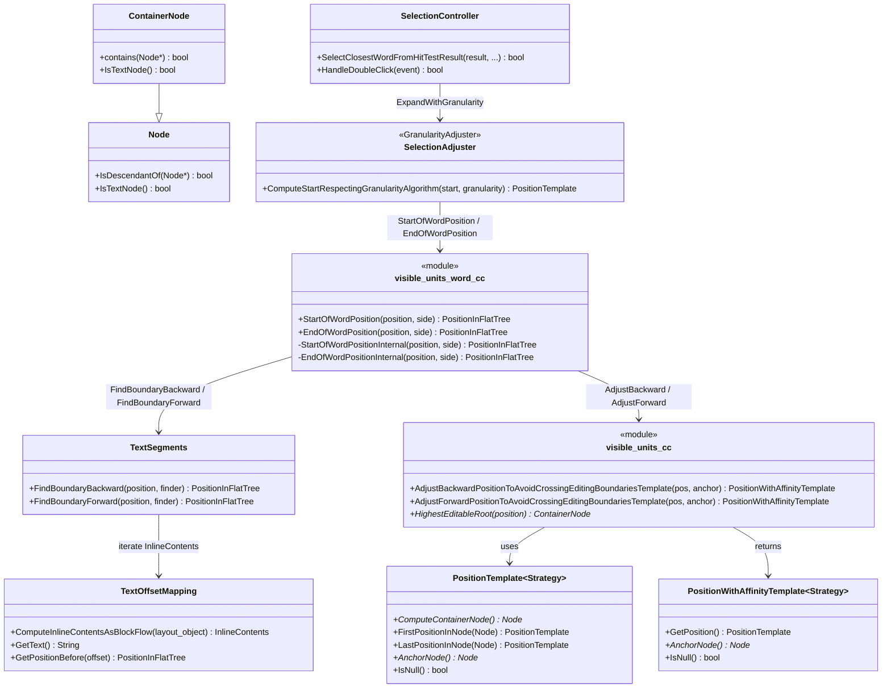
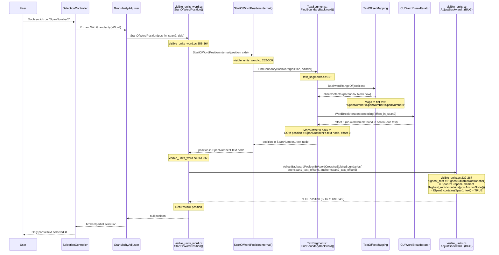
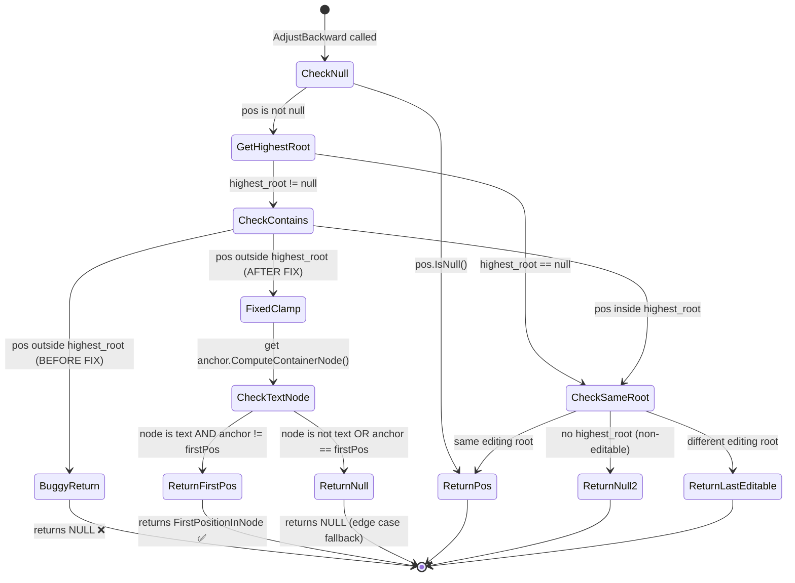

# Low-Level Design: 40848794

## 1. Files to Modify

| File | Type | Changes | Lines |
|------|------|---------|-------|
| [/third_party/blink/renderer/core/editing/visible_units.cc](/third_party/blink/renderer/core/editing/visible_units.cc) | Modify | Add clamping logic to `AdjustBackwardPositionToAvoidCrossingEditingBoundariesTemplate()` to return `FirstPositionInNode()` when backward position crosses editing boundary | ~8 |
| [/third_party/blink/renderer/core/editing/visible_units_word_test.cc](/third_party/blink/renderer/core/editing/visible_units_word_test.cc) | Existing | Unit tests `StartOfWordAdjacentContentEditableSpans` and `EndOfWordAdjacentContentEditableSpans` already added (lines 147-194) | 0 (already present) |
| [/third_party/blink/web_tests/editing/selection/mouse/doubleclick-adjacent-contenteditable-spans.html](/third_party/blink/web_tests/editing/selection/mouse/doubleclick-adjacent-contenteditable-spans.html) | Existing | Web test for double-click on adjacent contenteditable spans already added | 0 (already present) |

## 2. Class Hierarchy

### 2.1 Class Diagram


### 2.2 Class Responsibilities
- **SelectionController**: Handles mouse events (single/double/triple click) and initiates word selection via `SelectClosestWordFromHitTestResult()`
- **SelectionAdjuster / GranularityAdjuster**: Expands a collapsed selection to word granularity by calling `StartOfWordPosition()` and `EndOfWordPosition()`
- **visible_units_word.cc**: Computes word start/end positions using ICU `WordBreakIterator` via `TextSegments`, then calls boundary adjustment functions
- **visible_units.cc** — **contains the bug**: Provides `AdjustBackwardPositionToAvoidCrossingEditingBoundariesTemplate()` and `AdjustForwardPositionToAvoidCrossingEditingBoundariesTemplate()` to clamp positions to editing boundaries
- **TextSegments**: Iterates through inline text content using `TextOffsetMapping` and delegates to `Finder` callbacks
- **TextOffsetMapping**: Maps between DOM positions and flat text offsets across inline layout objects within a `LayoutBlockFlow`

## 3. Method-Level Analysis

### 3.1 Call Chain (Bug Path)


### 3.2 Affected Methods

#### `AdjustBackwardPositionToAvoidCrossingEditingBoundariesTemplate()` — THE BUG
**Location**: [/third_party/blink/renderer/core/editing/visible_units.cc#L232-L267](/third_party/blink/renderer/core/editing/visible_units.cc#L232)

**Current Implementation (Buggy)**:
```cpp
template <typename Strategy>
static PositionWithAffinityTemplate<Strategy>
AdjustBackwardPositionToAvoidCrossingEditingBoundariesTemplate(
    const PositionWithAffinityTemplate<Strategy>& pos,
    const PositionTemplate<Strategy>& anchor) {
  if (pos.IsNull())
    return pos;

  ContainerNode* highest_root = HighestEditableRoot(anchor);

  // Return empty position if |pos| is not somewhere inside the editable
  // region containing this position
  if (highest_root && !highest_root->contains(pos.AnchorNode())) {
    return PositionWithAffinityTemplate<Strategy>();  // <-- BUG: returns null
  }

  // ... rest of function
}
```

**Issues**:
1. When `pos` (the computed word start) is in a different contenteditable span than `anchor` (the click position), the function returns a null position instead of clamping to the first position in the anchor's text node.
2. This is asymmetric with `AdjustForwardPositionToAvoidCrossingEditingBoundariesTemplate()` (lines 294-306) which correctly clamps to `LastPositionInNode()` in the analogous case.

#### `AdjustForwardPositionToAvoidCrossingEditingBoundariesTemplate()` — CORRECT PATTERN
**Location**: [/third_party/blink/renderer/core/editing/visible_units.cc#L284-L334](/third_party/blink/renderer/core/editing/visible_units.cc#L284)

**Correct Implementation (Reference)**:
```cpp
template <typename Strategy>
static PositionWithAffinityTemplate<Strategy>
AdjustForwardPositionToAvoidCrossingEditingBoundariesTemplate(
    const PositionWithAffinityTemplate<Strategy>& pos,
    const PositionTemplate<Strategy>& anchor) {
  if (pos.IsNull())
    return pos;

  ContainerNode* highest_root = HighestEditableRoot(anchor);

  if (highest_root && !pos.AnchorNode()->IsDescendantOf(highest_root)) {
    // Return last position in node if |pos| is not somewhere inside the
    // editable region containing this position
    const Node* last_editable = anchor.ComputeContainerNode();
    if (last_editable->IsTextNode()) {
      PositionTemplate<Strategy> last_position =
          PositionTemplate<Strategy>::LastPositionInNode(*last_editable);
      if (anchor != last_position) {
        return PositionWithAffinityTemplate<Strategy>(last_position);
      }
    }
    return PositionWithAffinityTemplate<Strategy>();
  }
  // ... rest of function
}
```

#### `StartOfWordPosition()` — CALLER
**Location**: [/third_party/blink/renderer/core/editing/visible_units_word.cc#L358-L364](/third_party/blink/renderer/core/editing/visible_units_word.cc#L358)

```cpp
PositionInFlatTree StartOfWordPosition(const PositionInFlatTree& position,
                                       WordSide side) {
  const PositionInFlatTree start = StartOfWordPositionInternal(position, side);
  return AdjustBackwardPositionToAvoidCrossingEditingBoundaries(
             PositionInFlatTreeWithAffinity(start), position)
      .GetPosition();
}
```

This function calls `StartOfWordPositionInternal()` to find the word boundary using ICU, then calls `AdjustBackwardPositionToAvoidCrossingEditingBoundaries()` to clamp the result. When the buggy adjustment returns null, `.GetPosition()` returns a null position, leading to broken word selection.

#### `ComputeStartRespectingGranularityAlgorithm()` — HIGHER-LEVEL CALLER
**Location**: [/third_party/blink/renderer/core/editing/selection_adjuster.cc#L107-L141](/third_party/blink/renderer/core/editing/selection_adjuster.cc#L107)

```cpp
case TextGranularity::kWord: {
    const VisiblePositionTemplate<Strategy> visible_start =
        CreateVisiblePosition(passed_start);
    const PositionTemplate<Strategy> word_start = StartOfWordPosition(
        passed_start.GetPosition(), ChooseWordSide(visible_start));
    // ...
    return CreateVisiblePosition(word_start).DeepEquivalent();
}
```

When `StartOfWordPosition()` returns null (due to the bug), `CreateVisiblePosition(null)` produces an invalid visible position, leading to partial or failed selection.

## 4. Fix Design

### 4.1 Changes Required

#### File 1: [/third_party/blink/renderer/core/editing/visible_units.cc](/third_party/blink/renderer/core/editing/visible_units.cc)

**Before** (lines 242-246):
```cpp
  // Return empty position if |pos| is not somewhere inside the editable
  // region containing this position
  if (highest_root && !highest_root->contains(pos.AnchorNode())) {
    return PositionWithAffinityTemplate<Strategy>();
  }
```

**After**:
```cpp
  // Return first position in the anchor's text node if |pos| is not somewhere
  // inside the editable region containing this position
  if (highest_root && !highest_root->contains(pos.AnchorNode())) {
    const Node* first_editable = anchor.ComputeContainerNode();
    if (first_editable->IsTextNode()) {
      PositionTemplate<Strategy> first_position =
          PositionTemplate<Strategy>::FirstPositionInNode(*first_editable);
      if (anchor != first_position) {
        return PositionWithAffinityTemplate<Strategy>(first_position);
      }
    }
    return PositionWithAffinityTemplate<Strategy>();
  }
```

**Rationale**: This mirrors the exact pattern used by `AdjustForwardPositionToAvoidCrossingEditingBoundariesTemplate()` at lines 294-306, but symmetrically uses `FirstPositionInNode()` instead of `LastPositionInNode()`. When the backward word boundary crosses into a different contenteditable span, we clamp to the first position in the anchor's text node (i.e., the beginning of the current span's text), which is the correct word start within the editing boundary. The fallback to returning null when the anchor is already at the first position preserves the existing behavior for edge cases.

### 4.2 State Machine Changes



## 5. Memory & Lifetime Considerations

### 5.1 Object Ownership
- `pos` and `anchor` are passed by const reference — no ownership transfer
- `highest_root` is a raw pointer obtained from `HighestEditableRoot()` — points to a DOM node managed by the Document's node tree; valid for the duration of the synchronous call
- `first_editable` is obtained from `anchor.ComputeContainerNode()` — also a DOM node owned by the Document
- `first_position` is a stack-allocated `PositionTemplate<Strategy>` value — no heap allocation
- The returned `PositionWithAffinityTemplate<Strategy>` is a value type (stack-allocated)

### 5.2 Pointer/Reference Safety
- [x] No raw pointer issues — all raw pointers point to DOM nodes that are alive during the synchronous execution
- [x] No weak pointer usage in this function
- [x] Reference lifetime guaranteed — `pos` and `anchor` are const references to caller-owned objects
- [x] `first_editable` is guaranteed non-null because `anchor` is a valid connected position (precondition from `StartOfWordPosition()`)

## 6. Threading Considerations

### 6.1 Thread Safety
All code in this call chain executes synchronously on the renderer process main thread. The entire selection computation from `EventHandler::HandleMousePressEvent()` through `AdjustBackwardPositionToAvoidCrossingEditingBoundariesTemplate()` is single-threaded. No data races are possible.

### 6.2 Required Synchronization
None. No locks, mutexes, or cross-thread communication are involved. Layout is guaranteed to be up-to-date before input event handling begins.

## 7. Error Handling

### 7.1 Current Error Handling
- If `pos` is null, the function returns `pos` (null) immediately (line 237-238)
- If `highest_root` is null (non-editable content), the function returns null (line 259-260)
- The caller (`StartOfWordPosition()`) calls `.GetPosition()` on the returned `PositionWithAffinity`, which returns a null `Position` if the adjustment returned null
- `GranularityAdjuster::ComputeStartRespectingGranularityAlgorithm()` passes the null position to `CreateVisiblePosition()`, which produces an invalid/null visible position

### 7.2 Changes to Error Handling
- The fix reduces the cases where a null position is returned. Instead of returning null when `pos` is outside the editing root, it now attempts to clamp to the first position in the anchor's text node.
- The null fallback is preserved for the edge case where the anchor is already at the first position or is not a text node (lines that fall through to the `return PositionWithAffinityTemplate<Strategy>();`)
- No new error handling paths are introduced.

## 8. Validation Points

### 8.1 DCHECKs to Add/Modify
No new DCHECKs are needed. The existing preconditions are sufficient:
- `pos.IsNull()` check at line 237 ensures `pos` is valid before we use it
- `highest_root` null check at line 244 ensures we only execute the new logic when there is an editing root
- `first_editable->IsTextNode()` check ensures we only compute `FirstPositionInNode` for text nodes (mirroring the forward function's check)

### 8.2 Invariants to Maintain
1. **Symmetric with forward adjustment**: The backward function must handle the "position outside editing root" case symmetrically with the forward function — clamping to the boundary of the anchor's editing context rather than returning null.
2. **Non-null return for valid anchor**: When the anchor is inside a contenteditable span and the backward word boundary crosses into a sibling span, the function must return a valid position within the anchor's editing context.
3. **Null fallback for edge cases**: If the anchor is already at the first position in its text node, or the container is not a text node, the function should still return null (unchanged behavior).
4. **No effect on same-editing-root case**: When `pos` and `anchor` are in the same editing root, the function must still return `pos` unchanged (line 253-254 is not affected).

## 9. Test Requirements

### 9.1 Tests Present

| Test Name | Purpose | File | Status |
|-----------|---------|------|--------|
| `VisibleUnitsWordTest.StartOfWordAdjacentContentEditableSpans` | Verify `StartOfWordPosition()` returns position at beginning of second span, not null, when adjacent contenteditable spans have no whitespace | [/third_party/blink/renderer/core/editing/visible_units_word_test.cc#L150](/third_party/blink/renderer/core/editing/visible_units_word_test.cc#L150) | Already added |
| `VisibleUnitsWordTest.EndOfWordAdjacentContentEditableSpans` | Verify `EndOfWordPosition()` returns position at end of second span (forward adjustment is already correct, serves as regression test) | [/third_party/blink/renderer/core/editing/visible_units_word_test.cc#L173](/third_party/blink/renderer/core/editing/visible_units_word_test.cc#L173) | Already added |
| Web test: `doubleclick-adjacent-contenteditable-spans.html` | End-to-end test: double-click on adjacent contenteditable spans selects the entire word in each span | [/third_party/blink/web_tests/editing/selection/mouse/doubleclick-adjacent-contenteditable-spans.html](/third_party/blink/web_tests/editing/selection/mouse/doubleclick-adjacent-contenteditable-spans.html) | Already added |

### 9.2 Test Scenarios

1. **Normal case — second span**: Double-click on "SpanNumber2" in `<span contenteditable>SpanNumber1</span><span contenteditable>SpanNumber2</span><span contenteditable>SpanNumber3</span>` selects the entire "SpanNumber2". Validates the primary bug fix.

2. **First span (regression)**: Double-click on "SpanNumber1" in adjacent spans should still select the entire word. The first span doesn't trigger the bug (word start is within its own text node), so this is a regression check.

3. **Third span**: Double-click on "SpanNumber3" selects the entire word. This triggers the same code path as the second span (backward word boundary crosses into SpanNumber2 or SpanNumber1).

4. **Without spellcheck attribute**: Same as case 1 but without `spellcheck="false"` on the spans. Validates the fix isn't dependent on the spellcheck attribute.

5. **Whitespace-separated spans (regression)**: Spans separated by whitespace (`</span> <span>`) should continue to work correctly. The ICU word break iterator finds breaks at whitespace, so `AdjustBackward` is not reached with a position outside the editing root.

6. **EndOfWord verification**: `EndOfWordPosition()` for text in the second span should return the end of that span's text. This verifies the forward adjustment (which is already correct) remains working.

### 9.3 Test Execution

**Unit test**:
```bash
autoninja -C out/release_x64 blink_unittests
out/release_x64/blink_unittests --gtest_filter="VisibleUnitsWordTest.StartOfWordAdjacentContentEditableSpans:VisibleUnitsWordTest.EndOfWordAdjacentContentEditableSpans"
```

**Web test**:
```bash
autoninja -C out/release_x64 blink_tests
third_party/blink/tools/run_web_tests.py -t release_x64 editing/selection/mouse/doubleclick-adjacent-contenteditable-spans.html
```

## 10. Detailed Code Diff

```diff
--- a/third_party/blink/renderer/core/editing/visible_units.cc
+++ b/third_party/blink/renderer/core/editing/visible_units.cc
@@ -239,9 +239,17 @@ AdjustBackwardPositionToAvoidCrossingEditingBoundariesTemplate(
 
   ContainerNode* highest_root = HighestEditableRoot(anchor);
 
-  // Return empty position if |pos| is not somewhere inside the editable
-  // region containing this position
+  // Return first position in the anchor's text node if |pos| is not somewhere
+  // inside the editable region containing this position
   if (highest_root && !highest_root->contains(pos.AnchorNode())) {
-    return PositionWithAffinityTemplate<Strategy>();
+    const Node* first_editable = anchor.ComputeContainerNode();
+    if (first_editable->IsTextNode()) {
+      PositionTemplate<Strategy> first_position =
+          PositionTemplate<Strategy>::FirstPositionInNode(*first_editable);
+      if (anchor != first_position) {
+        return PositionWithAffinityTemplate<Strategy>(first_position);
+      }
+    }
+    return PositionWithAffinityTemplate<Strategy>();
   }
```

This is the only production code change. The unit test and web test are already in place and will validate the fix.
