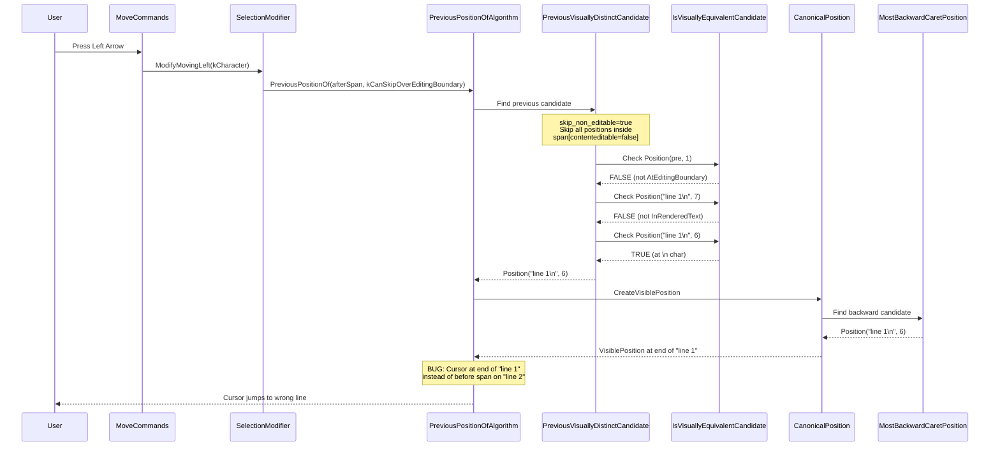

# Fix Assessment: 409942757

## Executive Summary
When pressing Left Arrow at the end of a `contenteditable="false"` inline element within a `<pre contenteditable="plaintext-only">`, the cursor incorrectly jumps to the end of the previous visual line instead of positioning before the non-editable element on the same line. The root cause is that there is no valid caret candidate position between a newline character in a preceding text node and a non-editable inline element, causing the canonical position to resolve to the wrong visual line. The recommended fix is to modify `AtEditingBoundary()` in `IsVisuallyEquivalentCandidateAlgorithm` to recognize positions adjacent to non-editable content as valid editing boundaries.

## Bug Analysis

### Problem Statement
Cursor navigation with arrow keys around `contenteditable="false"` inline elements within editable `<pre>` content skips valid caret positions. Pressing Left from after a non-editable span jumps to the end of the previous line (past a `\n` break), and pressing Right from the end of the previous line jumps to the end of the non-editable span instead of its beginning. There is no way to place the cursor immediately before or after the non-editable element on its visual line.

### Expected Behavior
- **Left Arrow** from after `line 2`: Cursor moves to immediately **before** the span, on the same visual line as "line 2".
- **Right Arrow** from end of "line 1": Cursor moves to immediately **before** the span, at the start of "line 2"'s visual line.
- Firefox 137+ correctly implements both behaviors.

### Actual Behavior
- **Left Arrow** from after the span: Cursor jumps to the **end of "line 1"** — a different visual line.
- **Right Arrow** from end of "line 1": Cursor jumps to the **end of "line 2"** (after the span) — skipping the "before span" position entirely.

### Triggering Conditions
1. A `<pre>` (or similar block) element with `contenteditable="plaintext-only"` or `contenteditable="true"`.
2. A `` (non-editable inline element **with text content**) inside the editable block.
3. The non-editable span is separated from preceding text by a newline character (`\n`) within a text node, creating a visual line break in `<pre>` formatting.
4. User navigates with Left/Right arrow keys across the boundary of the non-editable element.

The bug does NOT occur for:
- Empty non-editable spans (handled by `EditingIgnoresContent`)
- Non-editable `` elements (handled by `CanContainRangeEndPoint()` returning false)
- Non-editable elements separated by `
` or ` ` block boundaries (separate block elements provide valid boundary positions)

## Root Cause Analysis

### Code Investigation
The investigation traced the full Left Arrow keypress code path:

1. **`MoveCommands::ExecuteMoveLeft()`** → calls `SelectionModifier::Modify()` with `kLeft` direction, `kCharacter` granularity.
2. **`SelectionModifier::ModifyMovingLeft()`** → delegates to `ModifyMovingBackward(kCharacter)` for LTR text.
3. **`ModifyMovingBackward(kCharacter)`** → calls `PreviousPositionOf(focus, kCanSkipOverEditingBoundary)`.
4. **`PreviousPositionOfAlgorithm()`** → calls `PreviousVisuallyDistinctCandidate()` then `SkipToStartOfEditingBoundary()`.
5. **`PreviousVisuallyDistinctCandidateAlgorithm()`** → with `SkipNonEditableInAtomicMove` enabled (status: `stable`), skips all positions inside the non-editable span and finds the first valid editable candidate backward.

### Key Files Identified
- [/third_party/blink/renderer/core/editing/editing_utilities.cc#L516](/third_party/blink/renderer/core/editing/editing_utilities.cc#L516) - `PreviousVisuallyDistinctCandidateAlgorithm()`: Iterates backward skipping non-editable positions
- [/third_party/blink/renderer/core/editing/editing_utilities.cc#L420](/third_party/blink/renderer/core/editing/editing_utilities.cc#L420) - `NextVisuallyDistinctCandidateAlgorithm()`: Same issue in forward direction
- [/third_party/blink/renderer/core/editing/visible_units.cc#L1087](/third_party/blink/renderer/core/editing/visible_units.cc#L1087) - `AtEditingBoundary()`: Determines if a block-level position is at an editing boundary (key to fix)
- [/third_party/blink/renderer/core/editing/visible_units.cc#L1106](/third_party/blink/renderer/core/editing/visible_units.cc#L1106) - `IsVisuallyEquivalentCandidateAlgorithm()`: Validates whether a position can host a caret
- [/third_party/blink/renderer/core/editing/visible_units.cc#L1334](/third_party/blink/renderer/core/editing/visible_units.cc#L1334) - `PreviousPositionOfAlgorithm()`: Orchestrates backward position computation
- [/third_party/blink/renderer/core/editing/visible_units.cc#L1305](/third_party/blink/renderer/core/editing/visible_units.cc#L1305) - `SkipToStartOfEditingBoundary()`: Adjusts position after boundary crossing
- [/third_party/blink/renderer/core/editing/visible_units.cc#L728](/third_party/blink/renderer/core/editing/visible_units.cc#L728) - `MostBackwardCaretPosition()`: Finds the most backward equivalent caret position
- [/third_party/blink/renderer/core/editing/visible_units.cc#L137](/third_party/blink/renderer/core/editing/visible_units.cc#L137) - `CanonicalPosition()`: Canonicalizes positions (prefers backward candidate)
- [/third_party/blink/renderer/core/editing/editing_utilities.cc#L662](/third_party/blink/renderer/core/editing/editing_utilities.cc#L662) - `LastEditablePositionBeforePositionInRootAlgorithm()`: Finds last editable position before non-editable content
- [/third_party/blink/renderer/core/editing/selection_modifier.cc#L672](/third_party/blink/renderer/core/editing/selection_modifier.cc#L672) - `ModifyMovingBackward()`: Entry point for backward character movement
- [/third_party/blink/renderer/platform/runtime_enabled_features.json5#L5110](/third_party/blink/renderer/platform/runtime_enabled_features.json5#L5110) - `SkipNonEditableInAtomicMove` feature flag (status: `stable`)
- [/third_party/blink/renderer/core/layout/layout_text_test.cc#L374](/third_party/blink/renderer/core/layout/layout_text_test.cc#L374) - `ContainsCaretOffsetInPre` test: confirms offset after trailing `\n` in `<pre>` is not a valid caret offset

### Root Cause
**Location**: [/third_party/blink/renderer/core/editing/visible_units.cc#L1087](/third_party/blink/renderer/core/editing/visible_units.cc#L1087)
**Function**: `AtEditingBoundary()`
**Issue**: The position `Position(<pre>, 1)` — between the text node `"line 1\n"` and `` — is not recognized as a valid caret candidate. This is the **only** DOM position that visually represents "before the span on its visual line", but it fails the `IsVisuallyEquivalentCandidateAlgorithm` check because:

1. **`Position("line 1\n", 7)`** (at end of text node, after `\n`): `ContainsCaretOffset(7)` returns **false** for trailing newlines in `<pre>` mode (confirmed by `LayoutTextTest.ContainsCaretOffsetInPre` — test shows `"--A"` for `"abc\n|"`, meaning not a valid caret offset).

2. **`Position(<pre>, 1)`** (between text node 0 and span element 1): Is a block-level position. `IsVisuallyEquivalentCandidateAlgorithm` at line 1163-1172 requires `IsEditable(*anchor_node) && AtEditingBoundary(position)`. While `<pre>` IS editable, `AtEditingBoundary(Position(<pre>, 1))` returns **false** because:
   - It's NOT at the first editing position for `<pre>` (offset 0)
   - It's NOT at the last editing position for `<pre>`
   - The third check (`next AND prev are both non-editable`) fails because `MostBackwardCaretPosition` returns an editable position in `"line 1\n"`

3. **`Position("line 1\n", 6)`** (at the `\n` character): This IS a valid candidate, but it is visually at the **end of "line 1"**, not the start of "line 2". `MostBackwardCaretPosition(Position(<pre>, 1))` returns `Position("line 1\n", 6)` because `CaretMaxOffset()` for `"line 1\n"` is 6 in `<pre>` mode.

Since positions #1 and #2 are rejected as candidates, the `PreviousVisuallyDistinctCandidateAlgorithm` continues backward and returns position #3 (`Position("line 1\n", 6)`). Furthermore, `CanonicalPosition` for `Position(<pre>, 1)` calls `MostBackwardCaretPosition` which returns `Position("line 1\n", 6)` — a valid candidate — so canonicalization also maps to the end of "line 1".

**The same issue applies in the forward direction** (Right arrow): `NextVisuallyDistinctCandidateAlgorithm` skips non-editable content and finds `Position("\nline 3", 0)` as the first candidate after the span, which is visually at the end of "line 2" (after the span), skipping the "before span" position.

**Note**: This bug exists both **with and without** the `SkipNonEditableInAtomicMove` feature:
- **With the feature** (current default, `status: stable`): `PreviousVisuallyDistinctCandidateAlgorithm` skips non-editable positions → ends at `Position("line 1\n", 6)`
- **Without the feature**: `PreviousVisuallyDistinctCandidateAlgorithm` finds a position inside the span → `SkipToStartOfEditingBoundary` calls `LastEditablePositionBeforePositionInRoot` → walks backward through the span → ends at `Position("line 1\n", 6)`

### Code Flow Diagram

## Fix Options

### Option 1: Modify `AtEditingBoundary()` to recognize editable↔non-editable transitions ⭐ RECOMMENDED
- **Description**: Expand `AtEditingBoundary()` in [/third_party/blink/renderer/core/editing/visible_units.cc#L1087](/third_party/blink/renderer/core/editing/visible_units.cc#L1087) to return `true` when the position is between editable and non-editable content (one direction is editable, the other is non-editable), not only when both directions are non-editable. This makes `Position(<pre>, 1)` a valid `IsVisuallyEquivalentCandidate`, allowing the caret to be placed between the text node and the non-editable span.
- **Files to modify**: 
  - [/third_party/blink/renderer/core/editing/visible_units.cc#L1087](/third_party/blink/renderer/core/editing/visible_units.cc#L1087) - `AtEditingBoundary()`
- **Complexity**: Low
- **Risk**: Medium — `AtEditingBoundary` is used only in `IsVisuallyEquivalentCandidateAlgorithm` for block/inline elements. Expanding the boundary check could make additional positions valid candidates in other scenarios, potentially affecting cursor placement near non-editable elements in non-`<pre>` contexts. Requires careful testing of existing editing web tests.
- **Pros**: Small, localized change. Directly addresses the missing candidate position. Works for both forward and backward navigation. Fixes the bug regardless of `SkipNonEditableInAtomicMove` feature state.
- **Cons**: Could affect cursor behavior at other editable/non-editable boundaries in block elements. Needs thorough regression testing. The newly valid candidate position `Position(<pre>, 1)` will be canonicalized by `CanonicalPosition` — need to verify it resolves to the correct visual position (may also need `CanonicalPosition` adjustment).

### Option 2: Modify `PreviousVisuallyDistinctCandidateAlgorithm` and `NextVisuallyDistinctCandidateAlgorithm` to return boundary positions after skipping non-editable content
- **Description**: When `skip_non_editable` is `true` and the algorithm has finished skipping non-editable positions, detect the transition from non-editable back to editable. Instead of continuing with normal candidate search, return `Position::BeforeNode(non_editable_element)` (for backward) or `Position::AfterNode(non_editable_element)` (for forward) directly, bypassing the `IsVisuallyEquivalentCandidate` check.
- **Files to modify**: 
  - [/third_party/blink/renderer/core/editing/editing_utilities.cc#L516](/third_party/blink/renderer/core/editing/editing_utilities.cc#L516) - `PreviousVisuallyDistinctCandidateAlgorithm()`
  - [/third_party/blink/renderer/core/editing/editing_utilities.cc#L420](/third_party/blink/renderer/core/editing/editing_utilities.cc#L420) - `NextVisuallyDistinctCandidateAlgorithm()`
  - Potentially [/third_party/blink/renderer/core/editing/visible_units.cc#L137](/third_party/blink/renderer/core/editing/visible_units.cc#L137) - `CanonicalPosition()` to prevent incorrect canonicalization
- **Complexity**: Medium
- **Risk**: Medium — Returns a non-standard candidate position. The caller (`PreviousPositionOfAlgorithm`) passes it to `CreateVisiblePosition` which canonicalizes via `CanonicalPosition`. `MostBackwardCaretPosition` for `Position::BeforeNode(span)` returns `Position("line 1\n", 6)` (end of line 1), so canonicalization would STILL produce the wrong result unless `CanonicalPosition` is also modified.
- **Pros**: Targeted change only in the skip-non-editable code path. Does not affect normal (non-skip) cursor movement.
- **Cons**: Requires coordinated changes in both the candidate algorithm AND canonicalization. More moving parts than Option 1. Only fixes the case when `SkipNonEditableInAtomicMove` is enabled.

### Option 3: Treat non-editable inline elements with content as atomic via `EditingIgnoresContent()`
- **Description**: Modify `EditingIgnoresContent()` in [/third_party/blink/renderer/core/editing/editing_utilities.cc#L1843](/third_party/blink/renderer/core/editing/editing_utilities.cc#L1843) to also return `true` for non-editable elements (with `contenteditable="false"`) that have children, when they are inside an editable context. This makes the element treated like an `` or table — positions before/after it become valid caret candidates.
- **Files to modify**: 
  - [/third_party/blink/renderer/core/editing/editing_utilities.cc#L1843](/third_party/blink/renderer/core/editing/editing_utilities.cc#L1843) - `EditingIgnoresContent()`
- **Complexity**: Low
- **Risk**: High — `EditingIgnoresContent` is used in many places: `MostForwardCaretPosition`, `MostBackwardCaretPosition`, `IsVisuallyEquivalentCandidate`, `IsAtomicNode`, and various editing commands (delete, insert, selection). Treating non-editable spans as atomic would prevent selection from spanning into them, could affect copy/paste behavior, and could break text drag-and-drop operations. This is a very broad change.
- **Pros**: Comprehensive fix — handles all cursor movement scenarios atomically. Conceptually correct (non-editable content should be atomic for editing).
- **Cons**: Very broad impact. Could break selection, deletion, and other editing operations around non-editable inline elements. Requires extensive regression testing across all editing web tests.

### Option 4: Modify `CanonicalPosition()` to prefer forward candidate when backward crosses a line break near non-editable content
- **Description**: In `CanonicalPosition()` at [/third_party/blink/renderer/core/editing/visible_units.cc#L137](/third_party/blink/renderer/core/editing/visible_units.cc#L137), when the backward candidate is at a newline character in `<pre>` mode, check if the original position is adjacent to a non-editable element. If so, prefer the forward candidate (which would be inside/after the non-editable element) or return the original position with appropriate affinity to place the caret at the start of the non-editable element's visual line.
- **Files to modify**: 
  - [/third_party/blink/renderer/core/editing/visible_units.cc#L137](/third_party/blink/renderer/core/editing/visible_units.cc#L137) - `CanonicalPosition()`
- **Complexity**: Medium
- **Risk**: Medium — `CanonicalPosition` is called very frequently and is the backbone of `CreateVisiblePosition`. Adding conditional logic could affect performance and introduce subtle bugs in position canonicalization. Hard to scope the condition narrowly enough to avoid side effects.
- **Pros**: Fixes canonicalization at the source, benefiting all code paths that canonicalize positions near non-editable boundaries.
- **Cons**: Complex to implement the condition correctly. Performance-sensitive code path. May need to handle both `<pre>` and non-`<pre>` cases differently.

### Option 5: Modify `MostBackwardCaretPosition()` to stop at non-editable element boundaries
- **Description**: In `MostBackwardCaretPosition()` at [/third_party/blink/renderer/core/editing/visible_units.cc#L728](/third_party/blink/renderer/core/editing/visible_units.cc#L728), when traversing backward from a position that is before a non-editable element, treat the non-editable element as a visual boundary and do not traverse past it into the preceding text node. This would make `MostBackwardCaretPosition(Position(<pre>, 1))` return `Position(<pre>, 1)` instead of `Position("line 1\n", 6)`.
- **Files to modify**: 
  - [/third_party/blink/renderer/core/editing/visible_units.cc#L728](/third_party/blink/renderer/core/editing/visible_units.cc#L728) - `MostBackwardCaretPosition()`
  - [/third_party/blink/renderer/core/editing/visible_units.cc#L915](/third_party/blink/renderer/core/editing/visible_units.cc#L915) - `MostForwardCaretPosition()` (symmetric fix for forward direction)
- **Complexity**: High
- **Risk**: High — These functions are foundational to position canonicalization and are called extensively throughout the editing module. Changing their traversal behavior near non-editable elements could affect selection rendering, caret painting, editing commands, and many other features. Very difficult to scope correctly.
- **Pros**: Would fix canonicalization at the deepest level, making all higher-level functions automatically work correctly.
- **Cons**: Very high regression risk. Extremely difficult to test all edge cases. These functions are called thousands of times during editing operations.

## Recommended Approach
**Option 1 (Modify `AtEditingBoundary()`)** is recommended because it is the most targeted fix with the smallest blast radius. The change is localized to a single function that is only used in `IsVisuallyEquivalentCandidateAlgorithm` for block/inline elements. By recognizing positions where one side is editable and the other is non-editable as valid editing boundaries, `Position(<pre>, 1)` becomes a valid caret candidate.

However, Option 1 alone may not be sufficient because `CanonicalPosition` would still canonicalize `Position(<pre>, 1)` to `Position("line 1\n", 6)` via `MostBackwardCaretPosition`. A **combined approach** is likely needed:

1. **Primary**: Modify `AtEditingBoundary()` to recognize editable↔non-editable transitions (Option 1)
2. **Secondary**: Modify `PreviousVisuallyDistinctCandidateAlgorithm` and `NextVisuallyDistinctCandidateAlgorithm` (Option 2 partial) so that when returning a boundary position after skipping non-editable content, the position is returned **directly without going through normal CanonicalPosition**, using the position `Position::BeforeNode(non_editable_element)` with appropriate affinity.

Alternative combined approach: modify `AtEditingBoundary()` (Option 1) AND modify `CanonicalPosition` to not prefer the backward candidate when it would cross a visual line boundary near non-editable content (partial Option 4).

## Testing Strategy
- **Unit tests needed**: Add tests to `editing_utilities_test.cc` and `visible_units_test.cc` for:
  - `PreviousVisuallyDistinctCandidate` with non-editable spans preceded by `\n` in `<pre>`
  - `NextVisuallyDistinctCandidate` with non-editable spans followed by `\n` in `<pre>`
  - `IsVisuallyEquivalentCandidate` for `Position(<pre>, N)` adjacent to non-editable elements
  - `AtEditingBoundary` for positions at editable↔non-editable transitions
- **Web tests needed**: Add web tests in `editing/selection/modify_move/`:
  - `move_over_non_editable_elements_pre.html` — test cursor movement in `<pre>` with `contenteditable="false"` spans separated by newlines
  - Test both Left and Right arrow keys
  - Test with `contenteditable="plaintext-only"` and `contenteditable="true"`
  - Test with both `` and `<button contenteditable="false">`
- **Manual verification**:
  1. Open the reproduction page with `<pre contenteditable="plaintext-only">line 1\nline 2\nline 3</pre>`
  2. Click at the end of "line 2" span, press Left Arrow → cursor should be before the span on the same visual line
  3. Click at the end of "line 1", press Right Arrow → cursor should be before the span at the start of "line 2"'s visual line
  4. Verify existing editing web tests pass (especially `editing/selection/modify_move/` and `external/wpt/selection/caret/`)

## Related Code References
- WPT test: [/third_party/blink/web_tests/external/wpt/selection/caret/move-around-contenteditable-false.html](/third_party/blink/web_tests/external/wpt/selection/caret/move-around-contenteditable-false.html) — Tests cursor movement around `contenteditable=false` with `
` blocks (passes because `
` provides valid block boundaries)
- Existing test: [/third_party/blink/web_tests/editing/selection/modify_move/move_over_non_editable_elements.html](/third_party/blink/web_tests/editing/selection/modify_move/move_over_non_editable_elements.html) — Tests atomic/empty non-editable elements (works because `EditingIgnoresContent` handles empty spans and `` elements)
- Feature flag: `SkipNonEditableInAtomicMove` ([runtime_enabled_features.json5#L5110](/third_party/blink/renderer/platform/runtime_enabled_features.json5#L5110)) — Controls non-editable content skipping; status `stable`
- `ContainsCaretOffsetInPre` test: [/third_party/blink/renderer/core/layout/layout_text_test.cc#L374](/third_party/blink/renderer/core/layout/layout_text_test.cc#L374) — Confirms trailing `\n` in `<pre>` does not have a valid caret offset at end-of-text-node
- Related bug: [crbug.com/409950416](https://issues.chromium.org/issues/409950416) — Related cursor movement issue mentioned in the bug report
- Spec reference: [Selection API](https://w3c.github.io/selection-api/) and [contenteditable spec](https://html.spec.whatwg.org/multipage/interaction.html#contenteditable)
