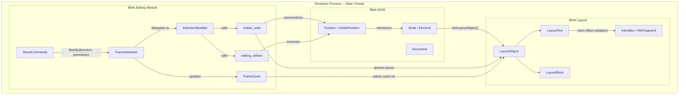
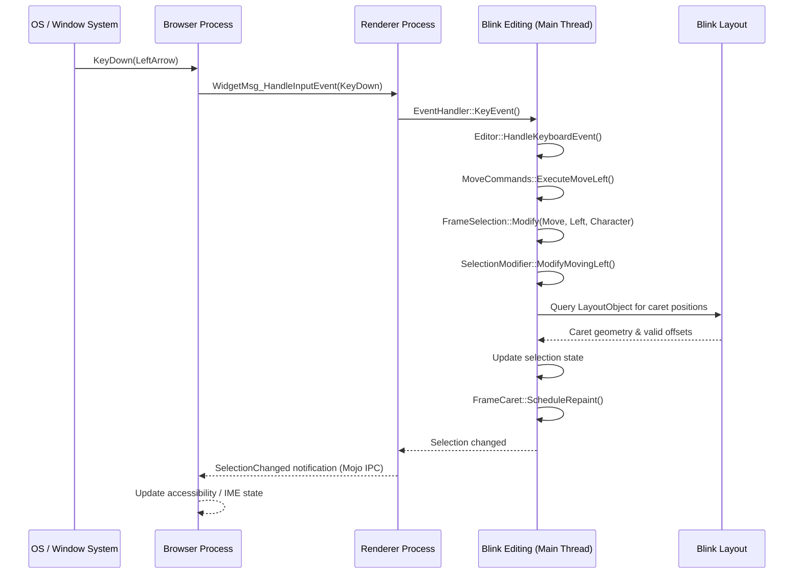
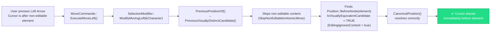
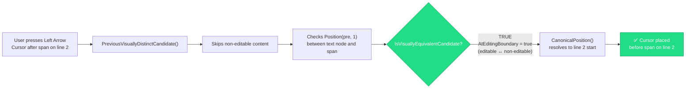

# High-Level Design: 409942757

## 1. Executive Summary

Bug 409942757 is a cursor navigation defect in Blink's editing subsystem. When a user presses Left Arrow at the end of a `contenteditable="false"` inline element inside a `<pre contenteditable="plaintext-only">` block, the caret incorrectly jumps to the end of the **previous visual line** instead of positioning immediately before the non-editable element on the **same** visual line. The root cause is that the caret-candidate validation logic (`IsVisuallyEquivalentCandidateAlgorithm`) does not recognize the DOM position between a newline-terminated text node and a non-editable inline element as a valid caret position, causing the algorithm to skip over it and land on the wrong line.

## 2. System Context

### 2.1 Overview

Cursor movement (arrow keys) in editable content is handled entirely within the **Renderer Process** by Blink's editing module. The feature sits at the intersection of three subsystems:

1. **Editing** — command dispatch, selection modification, and position canonicalization.
2. **DOM** — node tree structure, position representation, and contenteditable state.
3. **Layout** — visual line computation, caret geometry, and inline formatting.

No browser-process IPC is involved in the actual cursor position computation. The browser process is only notified *after* the selection changes (for accessibility, IME, and UI updates).

### 2.2 Related Specs

- [HTML Living Standard — contenteditable](https://html.spec.whatwg.org/multipage/interaction.html#contenteditable) — defines editability semantics
- [Selection API (W3C)](https://w3c.github.io/selection-api/) — defines the Selection/Range model
- [CSS Writing Modes Level 4](https://www.w3.org/TR/css-writing-modes-4/) — directionality affecting Left/Right mapping
- No Chromium design doc exists specifically for cursor movement around non-editable inline elements

## 3. Component Architecture

### 3.1 Major Components

| Component | Location | Responsibility |
|-----------|----------|----------------|
| **MoveCommands** | `third_party/blink/renderer/core/editing/commands/move_commands.cc` | Entry point for keyboard-driven cursor movement commands (ExecuteMoveLeft, ExecuteMoveRight, etc.) |
| **SelectionModifier** | `third_party/blink/renderer/core/editing/selection_modifier.cc` | Core algorithm engine that computes new cursor positions based on direction/granularity |
| **FrameSelection** | `third_party/blink/renderer/core/editing/frame_selection.cc` | Per-frame selection state manager; holds current selection and delegates movement to SelectionModifier |
| **visible_units** | `third_party/blink/renderer/core/editing/visible_units.cc` | Navigation helpers: position canonicalization, line/word boundaries, caret position equivalence |
| **editing_utilities** | `third_party/blink/renderer/core/editing/editing_utilities.cc` | Utility functions: editability checks, visually distinct candidate search, editing boundary detection |
| **Position / VisiblePosition** | `third_party/blink/renderer/core/editing/position.h`, `visible_position.h` | DOM position abstraction with optional TextAffinity for visual disambiguation |
| **FrameCaret** | `third_party/blink/renderer/core/editing/frame_caret.cc` | Visual caret rendering and blinking |
| **LayoutText / LayoutBlock** | `third_party/blink/renderer/core/layout/` | Layout tree objects providing visual geometry, line boxes, and caret offset validation |
| **Node / Element** | `third_party/blink/renderer/core/dom/` | DOM tree nodes with contenteditable attribute state |

### 3.2 Component Diagram

## 4. Process Architecture

### 4.1 Process Boundaries

Cursor movement is **entirely within the Renderer Process**. No IPC is needed to compute the new caret position. The Browser Process is involved only in:

1. **Input routing** — dispatching the keyboard event from the OS to the correct renderer via `content::RenderWidgetHostImpl`.
2. **Post-move notification** — the renderer notifies the browser of selection changes for accessibility, IME composition, and toolbar state updates (e.g., bold/italic button state).

| Process | Role in Cursor Movement |
|---------|------------------------|
| **Browser Process** | Routes keyboard input event to renderer; receives selection change notification afterward |
| **Renderer Process** | Handles the entire cursor movement computation: command dispatch → position calculation → selection update → caret repaint |

### 4.2 IPC Flow

## 5. Data Flow

### 5.1 Normal Flow (Expected — e.g., Left Arrow from after an ``)

In the normal case, non-editable atomic elements (images, empty spans) are handled by `EditingIgnoresContent()`, which makes positions before/after them valid caret candidates.

### 5.2 Buggy Flow (Current — Left Arrow from after `text` preceded by `\n`)

When the non-editable element has text content and is preceded by a newline in a `<pre>` block, `EditingIgnoresContent()` returns false, and the position between the text node and the span fails the `IsVisuallyEquivalentCandidate` check.

```mermaid
flowchart LR
    A["User presses Left Arrow<br/>Cursor after span on line 2"] --> B["MoveCommands::<br/>ExecuteMoveLeft()"]
    B --> C["SelectionModifier::<br/>ModifyMovingLeft(kCharacter)"]
    C --> D["PreviousPositionOf()<br/>→ PreviousVisuallyDistinctCandidate()"]
    D --> E["Skips non-editable content<br/>(SkipNonEditableInAtomicMove)"]
    E --> F["Checks Position(pre, 1)<br/>between text node and span"]
    F --> G{"IsVisuallyEquivalentCandidate?"}
    G -->|"FALSE<br/>AtEditingBoundary = false"| H["Continues backward...<br/>Checks Position('line 1\\n', 7)"]
    H --> I{"ContainsCaretOffset(7)?"}
    I -->|"FALSE<br/>(trailing \\n in pre)"| J["Continues to<br/>Position('line 1\\n', 6)"]
    J --> K{"IsVisuallyEquivalentCandidate?"}
    K -->|"TRUE<br/>(at \\n character)"| L["CanonicalPosition()<br/>→ Position at end of 'line 1'"]
    L --> M["❌ Cursor jumps to<br/>end of previous line"]

    style M fill:#d32,stroke:#a11,color:#fff
    style G fill:#fa0,stroke:#c80,color:#000
```

### 5.3 Expected Fixed Flow

After the fix, `AtEditingBoundary()` recognizes the editable↔non-editable transition, making `Position(pre, 1)` a valid caret candidate.

## 6. Key Interfaces

### 6.1 Public APIs

- **`MoveCommands::ExecuteMoveLeft(LocalFrame&, Event*, EditorCommandSource, const String&)`** — Entry point for Left Arrow key handling; dispatches to `FrameSelection::Modify()`.
- **`FrameSelection::Modify(SelectionModifyAlteration, SelectionModifyDirection, TextGranularity)`** — Main selection modification API; delegates to `SelectionModifier`.
- **`SelectionModifier::Modify(SelectionModifyAlteration, SelectionModifyDirection, TextGranularity)`** — Computes new selection based on direction and granularity.
- **`Position CanonicalPositionOf(const Position&)`** — Public wrapper to normalize a DOM position to its canonical (visual) form.
- **`Position MostBackwardCaretPosition(const Position&, EditingBoundaryCrossingRule)`** — Finds the leftmost visually equivalent caret position.
- **`Position MostForwardCaretPosition(const Position&, EditingBoundaryCrossingRule)`** — Finds the rightmost visually equivalent caret position.

### 6.2 Internal Interfaces (Bug-Relevant)

- **`AtEditingBoundary(const PositionTemplate<Strategy>&)`** — ⚠️ **BUG LOCATION** — Returns true if a block-level position is at an editing boundary. Currently does not recognize editable↔non-editable transitions.
- **`IsVisuallyEquivalentCandidateAlgorithm(const PositionTemplate<Strategy>&)`** — Validates whether a position can host a caret. Uses `AtEditingBoundary()` for block-level positions in editable nodes.
- **`PreviousVisuallyDistinctCandidateAlgorithm(const PositionTemplate<Strategy>&)`** — Iterates backward through DOM positions to find the previous valid caret candidate, skipping non-editable content when `SkipNonEditableInAtomicMove` is enabled.
- **`NextVisuallyDistinctCandidateAlgorithm(const PositionTemplate<Strategy>&)`** — Same as above but in forward direction.
- **`CanonicalPosition(const PositionType&)`** — Internal canonicalization that prefers backward candidates; may incorrectly collapse the boundary position into the previous line's position.
- **`EditingIgnoresContent(const Node&)`** — Returns true for nodes whose content is atomic for editing (images, empty spans, form controls). Does NOT return true for non-editable spans with text content (this is why the bug occurs).

## 7. Threading Model

All cursor movement and selection operations execute on the **Renderer Main Thread** (also called the Blink Main Thread).

- **Main thread responsibilities**: DOM traversal, layout queries, position canonicalization, selection state updates, caret painting.
- **Worker thread usage**: None. The editing subsystem does not use background threads.
- **Synchronization points**: `SelectionModifier` calls `UpdateAllLifecyclePhasesExceptPaint()` to ensure layout is up-to-date before querying caret positions. This is a synchronous operation on the main thread.
- **Layout dependency**: Cursor movement queries `LayoutObject::ContainsCaretOffset()` and inline fragment geometry, requiring a clean layout tree. Layout must be current before position computation begins.

## 8. External Dependencies

### Other Chrome Components
| Dependency | Usage |
|-----------|-------|
| **content::RenderWidgetHost** | Routes keyboard input events from browser to renderer |
| **Accessibility (AXTree)** | Notified of selection changes for screen readers |
| **IME (InputMethodController)** | Coordinates with selection for composition state |

### Blink Internal Dependencies
| Module | Usage |
|--------|-------|
| **DOM (`core/dom/`)** | Node tree, contenteditable attribute, `NodeTraversal`, `FlatTreeTraversal` |
| **Layout (`core/layout/`)** | `LayoutText::ContainsCaretOffset()`, inline box geometry, line breaking |
| **CSS (`core/css/`)** | `white-space: pre` behavior affects newline handling and caret offsets |
| **Frame (`core/frame/`)** | `LocalFrame` provides editing context and lifecycle management |

### Platform APIs
- None directly. Cursor movement is fully implemented in Blink without platform-specific code.

### Third-Party Libraries
- None. The editing subsystem is entirely Chromium/Blink code.

## 9. Impact of Fix

### 9.1 Components Affected

| File | Function | Change |
|------|----------|--------|
| `visible_units.cc` | `AtEditingBoundary()` | Expand to recognize editable↔non-editable transitions as valid editing boundaries |
| Possibly `visible_units.cc` | `CanonicalPosition()` | May need adjustment to avoid collapsing boundary positions across visual lines |
| Possibly `editing_utilities.cc` | `PreviousVisuallyDistinctCandidateAlgorithm()` / `NextVisuallyDistinctCandidateAlgorithm()` | May need to return boundary positions directly when skipping non-editable content |

### 9.2 Risk Assessment

- **Scope**: Narrow — the fix targets `AtEditingBoundary()` which is only called from `IsVisuallyEquivalentCandidateAlgorithm()` for block/inline element positions in editable nodes.
- **Risk Level**: Medium — while the change is localized, `IsVisuallyEquivalentCandidateAlgorithm` is used by all cursor movement, selection, and position canonicalization code paths. Making new positions valid candidates could affect caret placement in other editable/non-editable boundary scenarios.
- **Testing Coverage**:
  - **Existing**: `editing/selection/modify_move/` web tests cover cursor movement; `external/wpt/selection/caret/move-around-contenteditable-false.html` covers non-editable elements in block contexts (not `<pre>` + newline).
  - **New tests needed**: Web tests for cursor movement in `<pre>` with `contenteditable="false"` inline elements separated by newline characters, covering both Left and Right arrow keys.
  - **Regression strategy**: Run full `editing/` and `external/wpt/selection/` web test suites to detect unintended side effects.
