# Low-Level Design: 409942757

## 1. Files to Modify

| File | Type | Changes | Lines |
|------|------|---------|-------|
| [/third_party/blink/renderer/core/editing/visible_units.cc](/third_party/blink/renderer/core/editing/visible_units.cc) | Modify | Expand `AtEditingBoundary()` to recognize editable↔non-editable transitions; fix `MostBackwardCaretPosition()` to not cross preserved newlines when entering a new text node | ~15 |
| [/third_party/blink/web_tests/editing/selection/modify_move/move_over_non_editable_in_pre.html](/third_party/blink/web_tests/editing/selection/modify_move/move_over_non_editable_in_pre.html) | Add | New web test for cursor movement around non-editable elements in `<pre>` | ~80 |

## 2. Class Hierarchy

### 2.1 Class Diagram


### 2.2 Class Responsibilities

- **MoveCommands**: Entry point for keyboard-driven cursor movement commands. Dispatches Left/Right arrow to `FrameSelection::Modify()`.
- **SelectionModifier**: Core algorithm engine computing new cursor positions. Maps Left→Backward, Right→Forward for LTR text.
- **visible_units (functions)**: Navigation helpers including position canonicalization, caret position equivalence, and line/word boundaries. **Contains the bug** in `AtEditingBoundary()` and `MostBackwardCaretPosition()`.
- **editing_utilities (functions)**: Utility functions for editability checks and visually distinct candidate search. `PreviousVisuallyDistinctCandidateAlgorithm` uses `IsVisuallyEquivalentCandidate` (from visible_units) to validate candidates.
- **Position**: DOM position abstraction (anchor node + offset). Used throughout editing to represent caret locations.
- **VisiblePosition**: Position with TextAffinity for visual disambiguation at line wraps.
- **LayoutText**: Layout tree representation of text nodes. Provides caret offset validation for `<pre>` formatting.
- **ComputedStyle**: CSS computed values. `ShouldPreserveBreaks()` determines if `\n` creates visual line breaks.

## 3. Method-Level Analysis

### 3.1 Call Chain (Bug Path — Left Arrow)


### 3.2 Call Chain (Bug Path — Right Arrow from end of "line 1")


### 3.3 Affected Methods

#### `AtEditingBoundary()` — BUG LOCATION #1

**Location**: [/third_party/blink/renderer/core/editing/visible_units.cc#L1087](/third_party/blink/renderer/core/editing/visible_units.cc#L1087)

**Current Implementation (Buggy)**:
```cpp
template <typename Strategy>
static bool AtEditingBoundary(const PositionTemplate<Strategy> positions) {
  PositionTemplate<Strategy> next_position =
      MostForwardCaretPosition(positions, kCanCrossEditingBoundary);
  if (positions.AtFirstEditingPositionForNode() && next_position.IsNotNull() &&
      !IsEditable(*next_position.AnchorNode()))
    return true;

  PositionTemplate<Strategy> prev_position =
      MostBackwardCaretPosition(positions, kCanCrossEditingBoundary);
  if (positions.AtLastEditingPositionForNode() && prev_position.IsNotNull() &&
      !IsEditable(*prev_position.AnchorNode()))
    return true;

  return next_position.IsNotNull() &&
         !IsEditable(*next_position.AnchorNode()) &&
         prev_position.IsNotNull() && !IsEditable(*prev_position.AnchorNode());
}
```

**Issues**:
1. The third condition (line 1100-1102) requires BOTH `next_position` AND `prev_position` to be non-editable. For `Position(<pre>, 1)` between editable text and a non-editable span, `prev_position` is editable (in text node `"line 1\n"`) and `next_position` is non-editable (in span). Since prev is editable, the condition fails.
2. The first condition (line 1090-1092) requires `AtFirstEditingPositionForNode()`, which is false for offset 1.
3. The second condition (line 1096-1098) requires `AtLastEditingPositionForNode()`, which is false for offset 1.
4. Result: `AtEditingBoundary(Position(<pre>, 1))` incorrectly returns `false`, causing `IsVisuallyEquivalentCandidateAlgorithm` to reject this valid caret position.

#### `MostBackwardCaretPosition()` — BUG LOCATION #2

**Location**: [/third_party/blink/renderer/core/editing/visible_units.cc#L860](/third_party/blink/renderer/core/editing/visible_units.cc#L860)

**Current Implementation (Buggy)**:
```cpp
if (current_node != start_node) {
  // This assertion fires in web tests in the case-transform.html test
  // because of a mix-up between offsets in the text in the DOM tree with
  // text in the layout tree which can have a different length due to case
  // transformation.
  // Until we resolve that, disable this so we can run the web tests!
  // DCHECK_GE(currentOffset, layoutObject->caretMaxOffset());
  return PositionTemplate<Strategy>(
      current_node,
      text_layout_object->CaretMaxOffset() + text_start_offset);
}
```

**Issues**:
1. When `MostBackwardCaretPosition(Position(<pre>, 1))` iterates backward from the parent position into the child text node `"line 1\n"`, it immediately returns `Position("line 1\n", 6)` (`CaretMaxOffset = 6`, before the `\n`).
2. This position is at the end of "line 1" (before the `\n` line break), but the starting position `Position(<pre>, 1)` is visually on "line 2" (after the `\n`). They are on **different visual lines** and are NOT visually equivalent.
3. The function does not check whether a preserved newline (`\n` in `<pre>` mode) exists between the `CaretMaxOffset` position and the end of the text node. The `\n` creates a visual line boundary that should prevent backward traversal.
4. This causes `CanonicalPosition(Position(<pre>, 1))` to incorrectly canonicalize to `Position("line 1\n", 6)` — the wrong visual line.

## 4. Fix Design

### 4.1 Changes Required

Both fixes work together:
- **Fix 1** makes `Position(<pre>, 1)` a valid caret candidate by recognizing editable↔non-editable transitions in `AtEditingBoundary()`.
- **Fix 2** ensures `CanonicalPosition()` does not map `Position(<pre>, 1)` to `Position("line 1\n", 6)` by preventing `MostBackwardCaretPosition()` from crossing preserved newline boundaries when entering a text node from a parent position.

Without Fix 2, even though Fix 1 makes `Position(<pre>, 1)` a valid candidate returned by `PreviousVisuallyDistinctCandidateAlgorithm`, `CanonicalPosition` would still map it to `Position("line 1\n", 6)` via `MostBackwardCaretPosition`, placing the caret on the wrong line.

Without Fix 1, `PreviousVisuallyDistinctCandidateAlgorithm` would skip `Position(<pre>, 1)` entirely and return `Position("line 1\n", 6)` directly, so Fix 2 would never be reached.

#### File 1: [/third_party/blink/renderer/core/editing/visible_units.cc](/third_party/blink/renderer/core/editing/visible_units.cc)

##### Change 1: `AtEditingBoundary()` (lines 1100-1102)

**Before**:
```cpp
  return next_position.IsNotNull() &&
         !IsEditable(*next_position.AnchorNode()) &&
         prev_position.IsNotNull() && !IsEditable(*prev_position.AnchorNode());
```

**After**:
```cpp
  return (next_position.IsNotNull() &&
          !IsEditable(*next_position.AnchorNode())) ||
         (prev_position.IsNotNull() &&
          !IsEditable(*prev_position.AnchorNode()));
```

**Rationale**: A position is at an editing boundary if **either** adjacent visually equivalent position is non-editable, not only when **both** are. This correctly identifies `Position(<pre>, 1)` — between editable text and a non-editable span — as a valid editing boundary. The position before a non-editable element and the position after a non-editable element are both editing boundaries where a caret should be placeable.

The existing conditions 1 and 2 (lines 1090-1098) already handle edge cases where the position is at the first or last editing position of a node. The third condition is the general case, and changing it from `&&` to `||` makes it correctly recognize all editable↔non-editable transitions as boundaries.

**Impact analysis**: `AtEditingBoundary()` is only called from `IsVisuallyEquivalentCandidateAlgorithm()` (lines 1169 and 1172), which validates caret candidate positions. Making additional positions valid candidates means the caret can now be placed at editable↔non-editable boundaries in block and inline elements. This is the correct behavior — users should be able to place the cursor adjacent to non-editable elements.

##### Change 2: `MostBackwardCaretPosition()` (lines 860-869)

**Before**:
```cpp
    if (current_node != start_node) {
      // This assertion fires in web tests in the case-transform.html test
      // because of a mix-up between offsets in the text in the DOM tree with
      // text in the layout tree which can have a different length due to case
      // transformation.
      // Until we resolve that, disable this so we can run the web tests!
      // DCHECK_GE(currentOffset, layoutObject->caretMaxOffset());
      return PositionTemplate<Strategy>(
          current_node,
          text_layout_object->CaretMaxOffset() + text_start_offset);
    }
```

**After**:
```cpp
    if (current_node != start_node) {
      // This assertion fires in web tests in the case-transform.html test
      // because of a mix-up between offsets in the text in the DOM tree with
      // text in the layout tree which can have a different length due to case
      // transformation.
      // Until we resolve that, disable this so we can run the web tests!
      // DCHECK_GE(currentOffset, layoutObject->caretMaxOffset());
      const unsigned caret_max_offset =
          text_layout_object->CaretMaxOffset() + text_start_offset;
      // When entering a text node from a parent/sibling position, check if
      // the CaretMaxOffset is before a preserved newline. If so, the caret
      // position at CaretMaxOffset is on a different visual line from the
      // starting position (which is after the text node, hence after the
      // newline). Don't cross this visual line boundary.
      if (auto* text_node = DynamicTo<Text>(current_node)) {
        if (caret_max_offset < text_node->length() &&
            text_node->data()[caret_max_offset] == '\n' &&
            layout_object->Style()->ShouldPreserveBreaks()) {
          return last_visible.DeprecatedComputePosition();
        }
      }
      return PositionTemplate<Strategy>(current_node, caret_max_offset);
    }
```

**Rationale**: When `MostBackwardCaretPosition` iterates backward from a parent-level position (e.g., `Position(<pre>, 1)`) into a child text node (e.g., `"line 1\n"`), it currently returns the `CaretMaxOffset` position unconditionally. For text nodes ending with a preserved `\n` in `<pre>` mode, `CaretMaxOffset` points to the position before the `\n` (offset 6 for `"line 1\n"`), which is on the **previous** visual line. The starting position is after the text node (and its `\n`), which is on the **next** visual line.

The fix checks:
1. `caret_max_offset < text_node->length()` — there are characters after `CaretMaxOffset` (specifically, the trailing `\n`).
2. `text_node->data()[caret_max_offset] == '\n'` — the character at `CaretMaxOffset` is a newline.
3. `layout_object->Style()->ShouldPreserveBreaks()` — the newline creates a visual line break (pre-formatted whitespace mode).

When all conditions are true, the function returns `last_visible` (the last recorded "streamer" position before entering the text node), which is the starting parent-level position. This prevents crossing the visual line boundary.

**Why `last_visible` is correct**: At this point in execution, `last_visible` still holds the initial position `Position(<pre>, 1)` because:
- `last_visible` is initialized to the adjusted starting position.
- `IsStreamer()` returns `true` only at start-of-node or for atomic nodes. `Position(<pre>, 1)` is at offset 1 (not start), so `IsStreamer` returns false, and `last_visible` is not updated to a different position.
- No other position between the start and the text node entry satisfies `IsStreamer`.
- Thus `last_visible.DeprecatedComputePosition()` returns `Position(<pre>, 1)`.

**Impact analysis**: This change only affects `MostBackwardCaretPosition` when entering a NEW text node (`current_node != start_node`) that ends with a preserved `\n`. This is a narrow condition:
- Only text nodes with trailing `\n` are affected.
- Only `<pre>`-formatted text (or `white-space: pre/pre-line/pre-wrap/break-spaces`) is affected.
- Only parent-to-child transitions (entering a text node from a position in its parent) are affected.
- The fix is correct for all such cases: the `CaretMaxOffset` before a trailing preserved `\n` IS on a different visual line from a parent position after the text node.

### 4.2 Fixed Flow (Left Arrow)


### 4.3 Fixed Flow (Right Arrow)


### 4.4 State Machine Changes

```mermaid
stateDiagram-v2
    [*] --> AtEndOfSpan : Initial cursor position

    state "Left Arrow (CURRENT - BUGGY)" as BuggyLeft {
        AtEndOfSpan --> SkipSpanContent : PreviousVisuallyDistinctCandidate
        SkipSpanContent --> RejectPreOffset1 : Position(pre, 1) not candidate
        RejectPreOffset1 --> RejectTrailingNl : Position(text, 7) not valid
        RejectTrailingNl --> AcceptBeforeNl : Position(text, 6) valid
        AcceptBeforeNl --> WrongLine : ❌ End of line 1
    }

    state "Left Arrow (FIXED)" as FixedLeft {
        AtEndOfSpan --> SkipSpanContent2 : PreviousVisuallyDistinctCandidate
        SkipSpanContent2 --> AcceptPreOffset1 : Position(pre, 1) IS candidate (Fix 1)
        AcceptPreOffset1 --> CorrectCanon : CanonicalPosition keeps it (Fix 2)
        CorrectCanon --> CorrectLine : ✅ Before span on line 2
    }
```



## 5. Memory & Lifetime Considerations

### 5.1 Object Ownership
- All positions (`Position`, `VisiblePosition`) are stack-allocated value types. No heap allocation changes needed.
- The `Text*` pointer obtained via `DynamicTo<Text>(current_node)` is a raw pointer to a DOM node that is guaranteed to be alive during the `MostBackwardCaretPosition` call (the function operates within a single layout lifecycle phase).
- `last_visible` is a `PositionIteratorAlgorithm` value stored on the stack. Its `DeprecatedComputePosition()` returns a new `Position` value — no ownership issues.

### 5.2 Pointer/Reference Safety
- [x] No raw pointer issues — `DynamicTo<Text>` result is used immediately and not stored.
- [x] Weak pointers handled correctly — no weak pointers involved.
- [x] Reference lifetime guaranteed — all referenced DOM nodes are alive during editing operations (document lifecycle constraint).

## 6. Threading Considerations

### 6.1 Thread Safety
All cursor movement and selection operations execute on the **Renderer Main Thread** exclusively. No threading concerns:
- `MostBackwardCaretPosition()` is synchronous, main-thread only.
- `AtEditingBoundary()` is synchronous, main-thread only.
- Both functions access DOM nodes and layout objects, which are main-thread only.
- No cross-thread data access or synchronization needed.

### 6.2 Required Synchronization
None. The editing subsystem does not use background threads for cursor movement computation.

## 7. Error Handling

### 7.1 Current Error Handling
- `MostBackwardCaretPosition()` returns an empty position (`PositionTemplate<Strategy>()`) when `start_node` is null.
- `AtEditingBoundary()` handles null positions from `MostForwardCaretPosition` and `MostBackwardCaretPosition` via `.IsNotNull()` checks before accessing `.AnchorNode()`.
- `IsVisuallyEquivalentCandidateAlgorithm()` returns false when anchor node is null, layout object is null, or visibility is hidden.

### 7.2 Changes to Error Handling
- **Fix 1** (`AtEditingBoundary`): The `||` change preserves existing null checks. `next_position.IsNotNull()` is still checked before `!IsEditable(...)`, and `prev_position.IsNotNull()` is still checked before `!IsEditable(...)`. No new null dereference risk.
- **Fix 2** (`MostBackwardCaretPosition`): `DynamicTo<Text>` returns `nullptr` for non-Text nodes, and the null check prevents access. `text_node->length()` and `text_node->data()` are safe — `length()` returns 0 for empty text, and the `caret_max_offset < text_node->length()` guard prevents out-of-bounds access.

## 8. Validation Points

### 8.1 DCHECKs to Add/Modify
No new DCHECKs needed. The existing `DCHECK` on the commented-out assertion (line 866) remains unchanged. The fix adds a conditional check, not an assertion.

### 8.2 Invariants to Maintain
1. **`MostBackwardCaretPosition` must return a position on the same visual line as the input position.** Currently violated when entering a text node with trailing `\n` in `<pre>`. Fix 2 restores this invariant.
2. **`AtEditingBoundary` must return true for positions at editable↔non-editable transitions.** Currently violated for mixed-editability boundaries. Fix 1 restores this invariant.
3. **`CanonicalPosition` must return a position that is visually equivalent to the input.** Currently violated because `MostBackwardCaretPosition` returns a position on a different visual line. Fix 2 resolves this by preventing the line-crossing in `MostBackwardCaretPosition`.
4. **`PreviousVisuallyDistinctCandidateAlgorithm` must not skip valid caret positions.** Currently violated because `Position(<pre>, 1)` is not recognized as a candidate. Fix 1 resolves this.

## 9. Test Requirements

### 9.1 Unit Tests Needed

No new C++ unit tests in `visible_units_test.cc` are strictly required — the web test below covers the end-to-end behavior. However, the following could be added if deeper unit testing is desired:

| Test Name | Purpose | File |
|-----------|---------|------|
| `VisibleUnitsTest.MostBackwardCaretPositionPreservedNewline` | Verify `MostBackwardCaretPosition` stops at preserved `\n` | [/third_party/blink/renderer/core/editing/visible_units_test.cc](/third_party/blink/renderer/core/editing/visible_units_test.cc) |

### 9.2 Web Tests Needed

| Test Name | Purpose | File |
|-----------|---------|------|
| `move_over_non_editable_in_pre` | Verify cursor movement around `contenteditable=false` in `<pre>` | [/third_party/blink/web_tests/editing/selection/modify_move/move_over_non_editable_in_pre.html](/third_party/blink/web_tests/editing/selection/modify_move/move_over_non_editable_in_pre.html) |

### 9.3 Test Scenarios

1. **Left Arrow from after non-editable span in `<pre contenteditable="plaintext-only">`**: Cursor should move to immediately before the span on the same visual line. Starting position: after `<span contenteditable="false">line 2</span>`. Expected: caret before the span on line 2.

2. **Right Arrow from end of text before non-editable span in `<pre contenteditable="plaintext-only">`**: Cursor should move to immediately before the span on the next visual line. Starting position: end of "line 1" (at `\n`). Expected: caret before the span on line 2.

3. **Left Arrow from after non-editable span in `<pre contenteditable="true">`**: Same behavior as scenario 1 but with `contenteditable="true"` instead of `"plaintext-only"`.

4. **Right Arrow from end of text before non-editable span in `<pre contenteditable="true">`**: Same behavior as scenario 2 with `contenteditable="true"`.

5. **Left Arrow from after non-editable button in `<pre>`**: Same behavior with `<button contenteditable="false">` instead of `<span>`. Verifies fix works for different element types.

6. **Edge case: Multiple `\n` before non-editable span**: Text node `"line 1\n\n"` followed by span. Left arrow from after span should place cursor between the two newlines (or before the span, depending on exact position).

7. **Edge case: Non-editable span NOT preceded by `\n`**: Text node `"line 1"` (no newline) followed by non-editable span on the same visual line. Left arrow should still work correctly (existing behavior should not regress).

8. **Regression: Non-editable `` elements**: Existing behavior for `` should not change (handled by `EditingIgnoresContent`, not affected by this fix).

### 9.4 Existing Test Suites to Run for Regression
- `editing/selection/modify_move/` — all cursor movement tests
- `external/wpt/selection/caret/` — WPT caret movement tests
- `editing/selection/` — general selection tests
- `editing/execCommand/` — editing command tests (uses cursor positioning internally)
