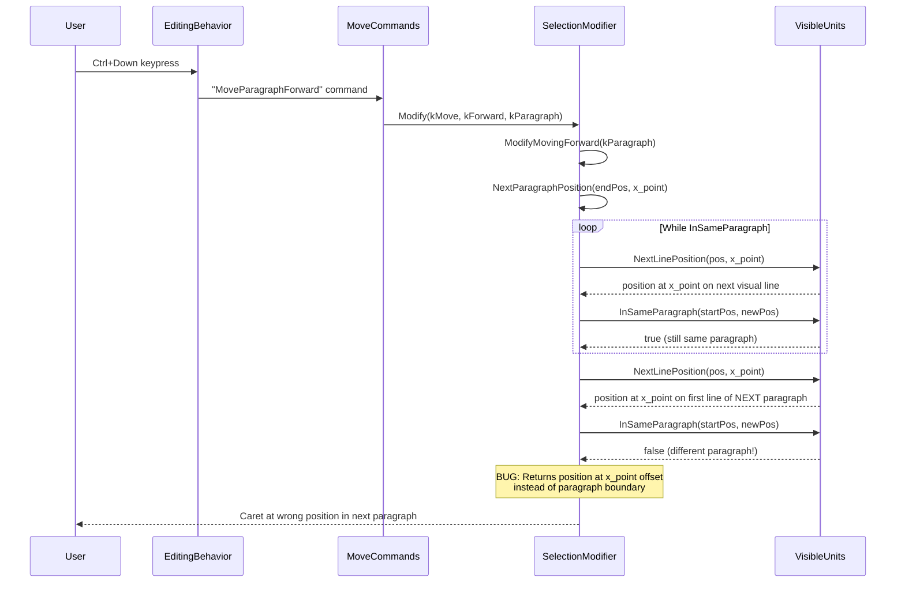

# Fix Assessment: 41194596

## Executive Summary
Ctrl+Up/Down paragraph navigation in textareas lands at incorrect positions because `PreviousParagraphPosition()` and `NextParagraphPosition()` in `selection_modifier.cc` preserve the horizontal x-offset when crossing paragraph boundaries, causing the caret to land at arbitrary mid-paragraph positions instead of paragraph boundaries. The recommended fix is to snap the result of these functions to `StartOfParagraph()` in `ModifyMovingForward()` and `ModifyMovingBackward()` when the caret has crossed into a different paragraph.

## Bug Analysis

### Problem Statement
When using Ctrl+Up/Down to navigate by paragraph in a `<textarea>` with wrapping text (paragraphs spanning multiple visual lines), the caret moves to seemingly random positions within paragraphs instead of landing at paragraph boundaries (start of paragraph on Windows).

### Expected Behavior
- **Windows**: `Ctrl+Up` moves the caret to the **beginning of the current paragraph** (if not already there), then to the beginning of each previous paragraph. `Ctrl+Down` moves the caret to the **beginning of the next paragraph**.
- **Mac**: `Option+Up` moves to the **start** of the current paragraph, then to the start of previous paragraphs. `Option+Down` moves to the **end** of the current paragraph, then end of subsequent paragraphs.
- This matches behavior in native apps (WordPad on Windows, TextEdit on Mac).

### Actual Behavior
The caret moves to positions determined by the original horizontal x-coordinate of the caret, landing at whatever character is closest to that x-offset on the first/last visual line of the target paragraph. For wrapping paragraphs, this results in the caret appearing at seemingly random positions within the paragraph text.

### Triggering Conditions
1. A `<textarea>` (or contenteditable) containing paragraphs separated by newlines.
2. The paragraphs must **wrap** (span more than one visual line in the textarea).
3. User presses `Ctrl+Up` or `Ctrl+Down` (or programmatically calls `Selection.modify('move', 'forward'/'backward', 'paragraph')`).
4. The bug is most noticeable when paragraphs wrap across multiple lines because the x-offset preservation causes the caret to land mid-text on the target paragraph's first/last visual line.

## Root Cause Analysis

### Code Investigation
The code path for Ctrl+Up/Down paragraph navigation follows:

1. **Key binding** → `editing_behavior.cc` maps `Ctrl+Up`/`Ctrl+Down` to `MoveParagraphBackward`/`MoveParagraphForward` commands.
2. **Command execution** → `move_commands.cc` calls `MoveSelection()` with `TextGranularity::kParagraph`.
3. **Selection modification** → `SelectionModifier::Modify()` dispatches to `ModifyMovingForward()` or `ModifyMovingBackward()`.
4. **Position calculation** → These call `NextParagraphPosition()` or `PreviousParagraphPosition()`, which iterate line-by-line using `NextLinePosition()`/`PreviousLinePosition()` while preserving the horizontal x-coordinate.
5. **Bug manifests** → The result is a position in the target paragraph at whatever x-offset the line navigation gives, NOT at a paragraph boundary.

### Key Files Identified
- [/third_party/blink/renderer/core/editing/selection_modifier.cc#L86](/third_party/blink/renderer/core/editing/selection_modifier.cc#L86) - `PreviousParagraphPosition()` - iterates up line-by-line preserving x-offset
- [/third_party/blink/renderer/core/editing/selection_modifier.cc#L107](/third_party/blink/renderer/core/editing/selection_modifier.cc#L107) - `NextParagraphPosition()` - iterates down line-by-line preserving x-offset
- [/third_party/blink/renderer/core/editing/selection_modifier.cc#L507](/third_party/blink/renderer/core/editing/selection_modifier.cc#L507) - `ModifyMovingForward()` kParagraph case - calls NextParagraphPosition
- [/third_party/blink/renderer/core/editing/selection_modifier.cc#L700](/third_party/blink/renderer/core/editing/selection_modifier.cc#L700) - `ModifyMovingBackward()` kParagraph case - calls PreviousParagraphPosition
- [/third_party/blink/renderer/core/editing/selection_modifier.cc#L74](/third_party/blink/renderer/core/editing/selection_modifier.cc#L74) - `InSameParagraph()` - checks if two positions share the same paragraph
- [/third_party/blink/renderer/core/editing/visible_units_paragraph.cc#L49](/third_party/blink/renderer/core/editing/visible_units_paragraph.cc#L49) - `StartOfParagraphAlgorithm()` - finds the start position of a paragraph
- [/third_party/blink/renderer/core/editing/visible_units_paragraph.cc#L175](/third_party/blink/renderer/core/editing/visible_units_paragraph.cc#L175) - `EndOfParagraphAlgorithm()` - finds the end position of a paragraph
- [/third_party/blink/renderer/core/editing/commands/move_commands.cc#L311](/third_party/blink/renderer/core/editing/commands/move_commands.cc#L311) - `ExecuteMoveParagraphBackward()` - Ctrl+Up entry point
- [/third_party/blink/renderer/core/editing/commands/move_commands.cc#L331](/third_party/blink/renderer/core/editing/commands/move_commands.cc#L331) - `ExecuteMoveParagraphForward()` - Ctrl+Down entry point
- [/third_party/blink/renderer/core/editing/editing_behavior.cc#L111](/third_party/blink/renderer/core/editing/editing_behavior.cc#L111) - Key binding: `VKEY_UP + OPTION_OR_CTRL_KEY → "MoveParagraphBackward"`
- [/third_party/blink/renderer/core/editing/editing_behavior.h#L37](/third_party/blink/renderer/core/editing/editing_behavior.h#L37) - `EditingBehavior` class with platform-specific behavior methods

### Root Cause
**Location**: [/third_party/blink/renderer/core/editing/selection_modifier.cc#L86-L125](/third_party/blink/renderer/core/editing/selection_modifier.cc#L86-L125)
**Functions**: `SelectionModifier::PreviousParagraphPosition()` and `SelectionModifier::NextParagraphPosition()`
**Issue**: Both functions iterate line-by-line using `PreviousLinePosition()`/`NextLinePosition()` with an `x_point` parameter that preserves the horizontal caret position. When the iteration crosses a paragraph boundary (detected by `InSameParagraph()` returning false), the loop exits and returns the position on the target paragraph's visual line at whatever x-offset was being tracked. This position is typically in the middle of the paragraph text, not at a paragraph boundary. The functions were designed to find *a position in another paragraph*, but callers (move commands) need *the boundary position of another paragraph*.

The `x_point` comes from `LineDirectionPointForBlockDirectionNavigation()`, which tracks the x-coordinate for vertical arrow key navigation. This makes sense for line-by-line movement (regular Up/Down arrows) but is incorrect for paragraph movement where the caret should snap to paragraph boundaries.

Additionally, at line 873-875, the `Modify()` method preserves this x-position for subsequent paragraph moves:
```cpp
if (granularity == TextGranularity::kLine ||
    granularity == TextGranularity::kParagraph)
  x_pos_for_vertical_arrow_navigation_ = x;
```
This means repeated Ctrl+Up/Down will keep using the same x-offset, consistently landing at wrong positions.

### Code Flow Diagram


## Fix Options

### Option 1: Snap to StartOfParagraph in ModifyMovingForward/Backward ⭐ RECOMMENDED
- **Description**: In `ModifyMovingForward()` and `ModifyMovingBackward()` for `kParagraph` granularity, after calling `NextParagraphPosition()`/`PreviousParagraphPosition()`, check if the result is in a different paragraph from the start position. If so, snap to `StartOfParagraph()` of the result. For backward movement, also handle the case where the caret is not yet at the start of the current paragraph (should go to start of current paragraph first, matching Windows behavior).
- **Files to modify**: 
  - [/third_party/blink/renderer/core/editing/selection_modifier.cc#L507-L510](/third_party/blink/renderer/core/editing/selection_modifier.cc#L507-L510) - `ModifyMovingForward()` kParagraph case
  - [/third_party/blink/renderer/core/editing/selection_modifier.cc#L700-L704](/third_party/blink/renderer/core/editing/selection_modifier.cc#L700-L704) - `ModifyMovingBackward()` kParagraph case
  - [/third_party/blink/web_tests/editing/selection/modify_move/move-by-paragraph.html](/third_party/blink/web_tests/editing/selection/modify_move/move-by-paragraph.html) - Update test expectations
- **Complexity**: Low
- **Risk**: Low-Medium - Only affects the Move operation, not Extend (selection). May change behavior in non-wrapping cases where existing tests expect the current (incorrect) behavior. Test expectations may need updating.
- **Pros**: Targeted fix; only modifies the move callers, not the helper functions; preserves current behavior for selection extension (Shift+Ctrl+Up/Down)
- **Cons**: Does not fix selection extension behavior (if also broken); needs InSameParagraph check to avoid changing behavior when no paragraph was crossed

### Option 2: Snap to StartOfParagraph inside PreviousParagraphPosition/NextParagraphPosition
- **Description**: Modify the helper functions themselves (`PreviousParagraphPosition` and `NextParagraphPosition`) to snap to `StartOfParagraph()` when the position crosses a paragraph boundary, i.e., add `if (!InSameParagraph(passed_position, position)) return StartOfParagraph(position);` before the return statement.
- **Files to modify**: 
  - [/third_party/blink/renderer/core/editing/selection_modifier.cc#L86-L125](/third_party/blink/renderer/core/editing/selection_modifier.cc#L86-L125) - Both helper functions
  - [/third_party/blink/web_tests/editing/selection/modify_move/move-by-paragraph.html](/third_party/blink/web_tests/editing/selection/modify_move/move-by-paragraph.html) - Update test expectations
- **Complexity**: Low
- **Risk**: Medium - Affects ALL callers of these functions, including selection extension (Shift+Ctrl+Up/Down). This could be desirable (selection extension should also snap to boundaries) but increases the scope of the change.
- **Pros**: Simpler code change; fixes the bug for all callers including selection extension; single point of change
- **Cons**: Broader impact; may have unintended consequences for selection extension behavior; harder to do platform-specific behavior (Mac vs Windows)

### Option 3: Replace with direct StartOfParagraph/EndOfParagraph calculations
- **Description**: Instead of using `NextParagraphPosition()`/`PreviousParagraphPosition()` (which do line-by-line iteration), replace the kParagraph case in `ModifyMovingForward()` with `StartOfNextParagraph()` (or `StartOfParagraph(EndOfParagraph(pos) + 1)`), and `ModifyMovingBackward()` with direct `StartOfParagraph()` logic. This bypasses the broken line-by-line approach entirely.
- **Files to modify**: 
  - [/third_party/blink/renderer/core/editing/selection_modifier.cc#L507-L510](/third_party/blink/renderer/core/editing/selection_modifier.cc#L507-L510) - Forward movement
  - [/third_party/blink/renderer/core/editing/selection_modifier.cc#L700-L704](/third_party/blink/renderer/core/editing/selection_modifier.cc#L700-L704) - Backward movement
  - [/third_party/blink/renderer/core/editing/visible_units_paragraph.cc](/third_party/blink/renderer/core/editing/visible_units_paragraph.cc) - May need FlatTree version of `StartOfNextParagraph`
  - [/third_party/blink/web_tests/editing/selection/modify_move/move-by-paragraph.html](/third_party/blink/web_tests/editing/selection/modify_move/move-by-paragraph.html) - Update test expectations
- **Complexity**: Medium
- **Risk**: Medium - Completely replaces the navigation approach; `StartOfNextParagraph` currently only exists for `VisiblePosition`, not `VisiblePositionInFlatTree`, so a new overload would be needed.
- **Pros**: Cleanest conceptual approach; directly computes paragraph boundaries without the flawed line-iteration approach; no x-offset baggage
- **Cons**: More code changes; needs new FlatTree variant of `StartOfNextParagraph`; may behave differently at edge cases (tables, editing boundaries) that the line-iteration approach currently handles

### Option 4: Platform-specific fix with EditingBehavior method
- **Description**: Add a new method to `EditingBehavior` (e.g., `ShouldSnapToParagraphStartOnParagraphMove()`) and use it in `ModifyMovingForward()`/`ModifyMovingBackward()` to conditionally snap to paragraph boundaries. On Windows/Linux/Android/ChromeOS: snap to `StartOfParagraph()`. On Mac: snap to `StartOfParagraph()` for backward, `EndOfParagraph()` for forward (matching TextEdit behavior).
- **Files to modify**: 
  - [/third_party/blink/renderer/core/editing/editing_behavior.h](/third_party/blink/renderer/core/editing/editing_behavior.h) - New platform method
  - [/third_party/blink/renderer/core/editing/selection_modifier.cc#L507-L510](/third_party/blink/renderer/core/editing/selection_modifier.cc#L507-L510) - Forward
  - [/third_party/blink/renderer/core/editing/selection_modifier.cc#L700-L704](/third_party/blink/renderer/core/editing/selection_modifier.cc#L700-L704) - Backward
  - [/third_party/blink/web_tests/editing/selection/modify_move/move-by-paragraph.html](/third_party/blink/web_tests/editing/selection/modify_move/move-by-paragraph.html) - Test expectations
- **Complexity**: Medium
- **Risk**: Low - Most careful approach with explicit platform handling; matches the existing pattern in `EditingBehavior` for platform differences
- **Pros**: Correctly handles Mac vs Windows differences; follows established patterns; safest for cross-platform behavior
- **Cons**: More files to modify; more complex; may be over-engineering if Mac behavior is addressed separately

## Recommended Approach

**Option 1** is recommended for its simplicity and targeted scope. The core change is:

**In `ModifyMovingForward()` (line 507-510)**:
```cpp
case TextGranularity::kParagraph: {
    const VisiblePositionInFlatTree& current = EndForPlatform();
    VisiblePositionInFlatTree pos = NextParagraphPosition(
        current,
        LineDirectionPointForBlockDirectionNavigation(selection_.Focus()));
    if (pos.IsNotNull() && !InSameParagraph(current, pos))
      pos = StartOfParagraph(pos);
    return pos;
}
```

**In `ModifyMovingBackward()` (line 700-704)**:
```cpp
case TextGranularity::kParagraph: {
    const VisiblePositionInFlatTree& current = StartForPlatform();
    if (!IsStartOfParagraph(current)) {
      pos = StartOfParagraph(current);
    } else {
      pos = PreviousParagraphPosition(
          current,
          LineDirectionPointForBlockDirectionNavigation(selection_.Focus()));
      if (pos.IsNotNull() && !InSameParagraph(current, pos))
        pos = StartOfParagraph(pos);
    }
    break;
}
```

This approach:
1. Fixes the x-offset preservation bug by snapping to `StartOfParagraph()`
2. Implements correct Windows Ctrl+Up behavior (first to start of current paragraph, then previous)
3. Only affects caret movement, not selection extension
4. Uses `InSameParagraph()` check to avoid changing behavior when the caret couldn't move to a new paragraph (edge cases)
5. The static `InSameParagraph()` function at line 74 is already available and suitable

Note: The `InSameParagraph()` function used at line 74-83 is file-local (static). It is available for use within `selection_modifier.cc` but uses `VisiblePositionInFlatTree` which is what `ModifyMovingForward/Backward` already work with.

## Testing Strategy

### Unit tests needed
- Add tests to `selection_modifier_test.cc` for paragraph movement in textareas with wrapping text:
  - Forward paragraph movement should land at start of next paragraph
  - Backward paragraph movement from mid-paragraph should go to start of current paragraph
  - Backward paragraph movement from start of paragraph should go to start of previous paragraph
  - Edge case: single-line paragraph (no wrapping) should still work
  - Edge case: caret at end of document, forward paragraph should not move

### Web tests needed
- Update existing test: [/third_party/blink/web_tests/editing/selection/modify_move/move-by-paragraph.html](/third_party/blink/web_tests/editing/selection/modify_move/move-by-paragraph.html) - some expectations may need updating
- New test for textarea with wrapping paragraphs verifying Ctrl+Up/Down lands at paragraph boundaries
- New test verifying `Selection.modify('move', 'forward', 'paragraph')` in textarea with wrapping text

### Manual verification
1. Open the reproduction HTML (textarea with wrapping paragraphs)
2. Click in the middle of the second wrapping paragraph
3. Press Ctrl+Down → caret should jump to the beginning of the third paragraph
4. Press Ctrl+Up → caret should jump to the beginning of the second paragraph
5. Press Ctrl+Up again → caret should jump to the beginning of the first paragraph
6. Verify with paragraphs of different lengths to ensure no x-offset artifacts

## Related Code References
- Bug tracker: https://issues.chromium.org/issues/41194596
- `Selection.modify()` spec: https://developer.mozilla.org/en-US/docs/Web/API/Selection/modify
- Existing paragraph web tests: [/third_party/blink/web_tests/editing/selection/modify_move/move-by-paragraph.html](/third_party/blink/web_tests/editing/selection/modify_move/move-by-paragraph.html)
- Cross-editing boundary tests: [/third_party/blink/web_tests/external/wpt/selection/move-paragraph-cross-editing-boundary.tentative.html](/third_party/blink/web_tests/external/wpt/selection/move-paragraph-cross-editing-boundary.tentative.html)
- Related paragraph boundary movement: [/third_party/blink/web_tests/editing/selection/move-by-paragraphboundary.html](/third_party/blink/web_tests/editing/selection/move-by-paragraphboundary.html)
