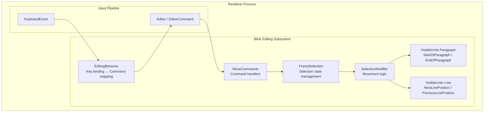
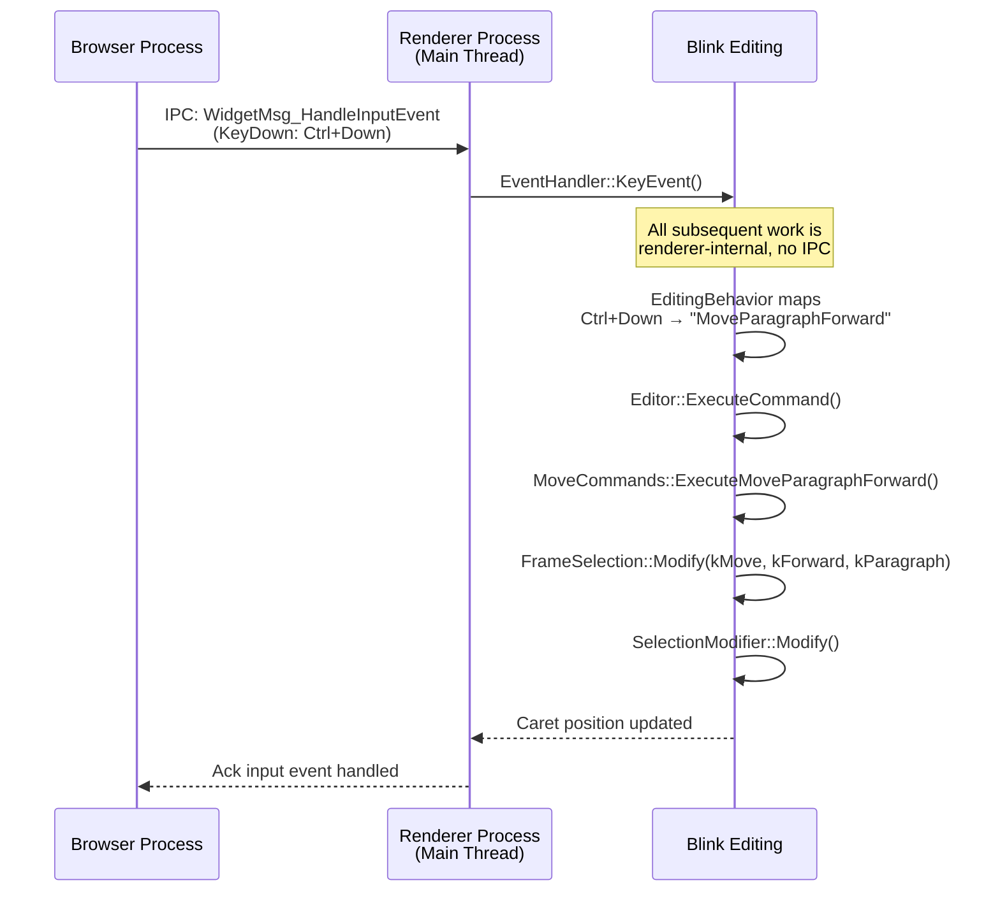
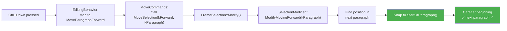
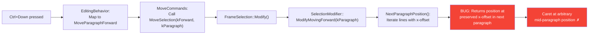
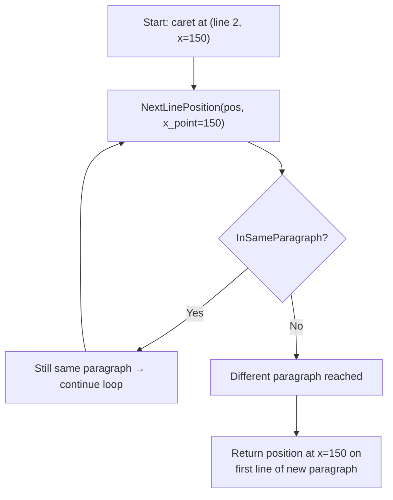

# High-Level Design: 41194596

## 1. Executive Summary

Bug 41194596 affects Ctrl+Up/Down paragraph navigation in `<textarea>` elements on Windows. The caret lands at incorrect mid-paragraph positions instead of paragraph boundaries because the paragraph movement functions (`PreviousParagraphPosition` / `NextParagraphPosition`) in Blink's editing subsystem preserve the horizontal x-offset when crossing paragraph boundaries. The fix is localized to `selection_modifier.cc` in the Blink renderer's editing module, requiring a snap to `StartOfParagraph()` after the line-by-line iteration crosses a paragraph boundary.

## 2. System Context

### 2.1 Overview

This feature is part of Blink's **editing/selection** subsystem, which handles caret movement, text selection, and keyboard-driven navigation within editable content (`<textarea>`, `contenteditable`). The subsystem lives entirely within the **Renderer Process** — no IPC to the Browser Process is required for caret movement. The input event pipeline delivers the keystroke from the Browser Process, but all paragraph-boundary logic executes in Blink's editing layer.

The affected code path: keyboard event → command dispatch → `SelectionModifier::Modify()` → paragraph position calculation → caret placement.

### 2.2 Related Specs
- [Selection.modify() - MDN](https://developer.mozilla.org/en-US/docs/Web/API/Selection/modify) — The JS API that exposes paragraph granularity movement
- [WHATWG HTML Living Standard - textarea](https://html.spec.whatwg.org/multipage/form-elements.html#the-textarea-element) — Textarea element spec
- No formal W3C spec exists for `Ctrl+Up/Down` paragraph navigation semantics; behavior is platform-defined (Windows vs Mac conventions)

## 3. Component Architecture

### 3.1 Major Components

| Component | Location | Responsibility |
|-----------|----------|----------------|
| `EditingBehavior` | `/third_party/blink/renderer/core/editing/editing_behavior.cc` | Maps key bindings to editor commands; provides platform-specific behavior flags |
| `MoveCommands` | `/third_party/blink/renderer/core/editing/commands/move_commands.cc` | Implements `ExecuteMoveParagraphForward/Backward` command handlers |
| `FrameSelection` | `/third_party/blink/renderer/core/editing/frame_selection.cc` | Per-frame selection state; delegates to `SelectionModifier::Modify()` |
| `SelectionModifier` | `/third_party/blink/renderer/core/editing/selection_modifier.cc` | Core movement logic: `ModifyMovingForward()`, `ModifyMovingBackward()`, `NextParagraphPosition()`, `PreviousParagraphPosition()` |
| `VisibleUnits (Paragraph)` | `/third_party/blink/renderer/core/editing/visible_units_paragraph.cc` | Paragraph boundary calculation: `StartOfParagraph()`, `EndOfParagraph()`, `IsStartOfParagraph()` |
| `VisibleUnits (Line)` | `/third_party/blink/renderer/core/editing/visible_units_line.cc` | Line-level position calculation: `NextLinePosition()`, `PreviousLinePosition()` |

### 3.2 Component Diagram

## 4. Process Architecture

### 4.1 Process Boundaries

This bug is entirely within the **Renderer Process**. The only IPC involved is the initial keyboard event delivery from the Browser Process to the Renderer Process via the input pipeline. Once the key event reaches Blink's event handling, all paragraph navigation logic executes synchronously on the renderer main thread.

| Process | Role |
|---------|------|
| Browser Process | Delivers raw keyboard input events to the renderer via IPC |
| Renderer Process | Handles key event dispatch, command resolution, selection modification, and layout queries — all on the main thread |

### 4.2 IPC Flow

## 5. Data Flow

### 5.1 Normal Flow (Expected — Windows Behavior)

### 5.2 Buggy Flow (Current)

### 5.3 Detailed Buggy Iteration (NextParagraphPosition)

## 6. Key Interfaces

### 6.1 Public APIs
- `FrameSelection::Modify(SelectionModifyAlteration, SelectionModifyDirection, TextGranularity, SetSelectionBy)` — Entry point for programmatic and keyboard-driven selection modification
- `Selection.modify('move', 'forward'|'backward', 'paragraph')` — JavaScript API that triggers the same code path

### 6.2 Internal Interfaces
- `SelectionModifier::Modify(SelectionModifyAlteration, SelectionModifyDirection, TextGranularity)` — Core dispatch; calls `ModifyMovingForward()` or `ModifyMovingBackward()` based on direction
- `SelectionModifier::ModifyMovingForward(TextGranularity)` — Handles forward movement by granularity; the `kParagraph` case calls `NextParagraphPosition()`
- `SelectionModifier::ModifyMovingBackward(TextGranularity)` — Handles backward movement; the `kParagraph` case calls `PreviousParagraphPosition()`
- `SelectionModifier::NextParagraphPosition(VisiblePositionInFlatTree, LayoutUnit)` — Iterates lines forward using `NextLinePosition()` with x-offset until a different paragraph is reached **(buggy: preserves x-offset)**
- `SelectionModifier::PreviousParagraphPosition(VisiblePositionInFlatTree, LayoutUnit)` — Same as above but iterates backward **(buggy: preserves x-offset)**
- `StartOfParagraph(VisiblePositionInFlatTree, EditingBoundaryCrossingRule)` — Returns the start position of the paragraph containing the given position
- `EndOfParagraph(VisiblePositionInFlatTree, EditingBoundaryCrossingRule)` — Returns the end position of the paragraph
- `IsStartOfParagraph(VisiblePositionInFlatTree)` — Tests if a position is at the start of its paragraph
- `InSameParagraph(VisiblePositionInFlatTree, VisiblePositionInFlatTree)` — File-local helper in `selection_modifier.cc`; checks if two positions share the same paragraph start

## 7. Threading Model

All editing operations run on the **Renderer Main Thread**:

- **Main Thread**: Keyboard event handling, command dispatch, `SelectionModifier::Modify()`, layout queries (`NextLinePosition` needs layout info), caret painting invalidation
- **No worker threads** involved in this code path
- **No synchronization** needed — all calls are synchronous on the main thread
- **Layout dependency**: `NextLinePosition()` and `PreviousLinePosition()` query layout tree state (visual line positions). The document must have an up-to-date layout before these calls. `FrameSelection::Modify()` ensures layout is clean before entering `SelectionModifier`.

## 8. External Dependencies

| Dependency | Type | Role |
|------------|------|------|
| Layout Engine (LayoutNG) | Internal Blink | `NextLinePosition` / `PreviousLinePosition` query the layout tree to determine visual line boundaries |
| `RuntimeEnabledFeatures` | Internal Blink | Feature flag `ModifyParagraphCrossEditingBoundaryEnabled` controls whether paragraph movement can cross editing boundaries |
| Platform input pipeline | Browser Process → Renderer | Delivers keyboard events; no modification needed |
| `EditingBehavior` | Internal Blink | Provides platform-specific keyboard mapping and behavior flags |

No third-party libraries are involved. The fix is entirely within Blink's editing module.

## 9. Impact of Fix

### 9.1 Components Affected

| Component | Change Type |
|-----------|-------------|
| `SelectionModifier::ModifyMovingForward()` in `selection_modifier.cc` | Add `StartOfParagraph()` snap after `NextParagraphPosition()` |
| `SelectionModifier::ModifyMovingBackward()` in `selection_modifier.cc` | Add `StartOfParagraph()` snap after `PreviousParagraphPosition()`, with "first to current paragraph start" logic |
| Web test expectations (`move-by-paragraph.html`) | Update expected caret positions to reflect corrected paragraph boundary snapping |

### 9.2 Risk Assessment
- **Scope**: Narrow — only the `kParagraph` cases in two methods within one file
- **Risk Level**: Low — the fix adds post-processing (snap to boundary) without modifying the existing helper functions; `InSameParagraph()` guard prevents changes when no paragraph boundary was crossed
- **Testing Coverage**: Existing web tests in `editing/selection/modify_move/move-by-paragraph.html` cover paragraph movement; some expectations will need updating. New tests should cover wrapping paragraphs in textareas specifically. Unit tests in `selection_modifier_test.cc` can validate edge cases (single-line paragraphs, document boundaries, editing boundaries).
