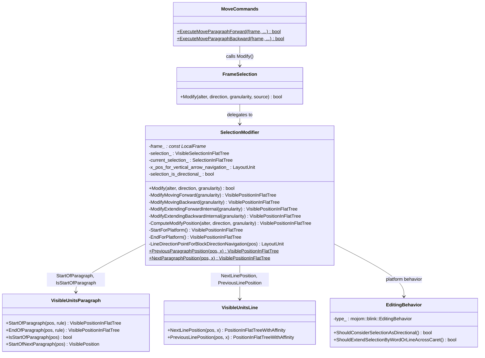
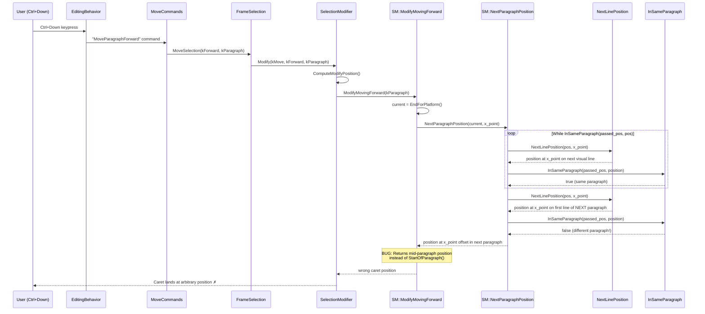
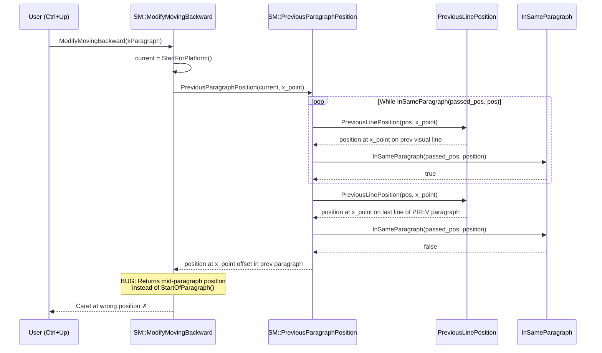
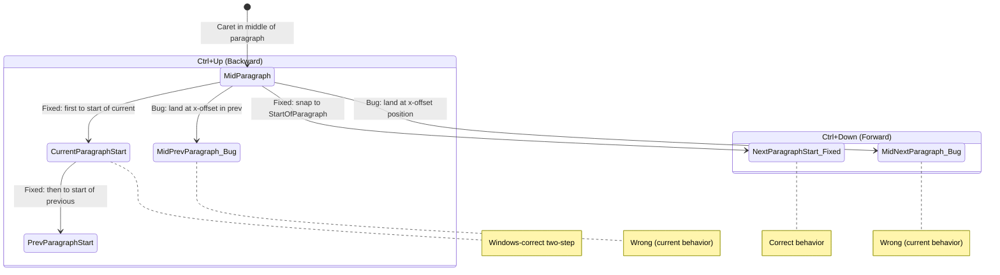

# Low-Level Design: 41194596

## 1. Files to Modify

| File | Type | Changes | Lines |
|------|------|---------|-------|
| [/third_party/blink/renderer/core/editing/selection_modifier.cc](/third_party/blink/renderer/core/editing/selection_modifier.cc) | Modify | Snap to `StartOfParagraph()` after `NextParagraphPosition()`/`PreviousParagraphPosition()` in the `kParagraph` cases of `ModifyMovingForward()` and `ModifyMovingBackward()` | ~20 |
| [/third_party/blink/renderer/core/editing/selection_modifier_test.cc](/third_party/blink/renderer/core/editing/selection_modifier_test.cc) | Modify | Add unit tests for paragraph movement in textarea with wrapping text | ~60 |
| [/third_party/blink/web_tests/editing/selection/modify_move/move-by-paragraph.html](/third_party/blink/web_tests/editing/selection/modify_move/move-by-paragraph.html) | Modify | Update existing test expectations if any positions change due to fix; add wrapping-paragraph test cases | ~30 |

## 2. Class Hierarchy

### 2.1 Class Diagram


### 2.2 Class Responsibilities
- **`SelectionModifier`**: Core movement/selection logic — computes new caret positions for various granularities (character, word, line, paragraph, etc.). Contains the buggy `kParagraph` handling in `ModifyMovingForward()` (L507–510) and `ModifyMovingBackward()` (L700–704). Also contains the static helper functions `NextParagraphPosition()` (L107–125) and `PreviousParagraphPosition()` (L86–104) that iterate line-by-line with an x-offset.
- **`FrameSelection`**: Per-frame selection state manager; delegates movement to `SelectionModifier::Modify()`.
- **`MoveCommands`**: Command handlers invoked by `EditingBehavior`'s key-binding map; `ExecuteMoveParagraphForward()` (L331) and `ExecuteMoveParagraphBackward()` (L311) call `MoveSelection()` with `kParagraph`.
- **`EditingBehavior`**: Platform-specific editing behavior flags (Windows vs Mac vs ChromeOS vs Android). Provides key-to-command mapping.
- **`VisibleUnitsParagraph`** (free functions in `visible_units_paragraph.cc`): Paragraph boundary calculations — `StartOfParagraph()`, `EndOfParagraph()`, `IsStartOfParagraph()`.
- **`VisibleUnitsLine`** (free functions in `visible_units_line.cc`): Line-level position calculation — `NextLinePosition()`, `PreviousLinePosition()`.
- **`InSameParagraph()`**: File-local static helper in `selection_modifier.cc` (L74–83) — checks if two `VisiblePositionInFlatTree` positions share the same paragraph start.

## 3. Method-Level Analysis

### 3.1 Call Chain (Bug Path — Forward Movement)


### 3.2 Call Chain (Bug Path — Backward Movement)


### 3.3 Affected Methods

#### `SelectionModifier::NextParagraphPosition()` (helper, NOT modified)
**Location**: [/third_party/blink/renderer/core/editing/selection_modifier.cc#L107-L125](/third_party/blink/renderer/core/editing/selection_modifier.cc#L107-L125)

**Current Implementation**:
```cpp
// static
VisiblePositionInFlatTree SelectionModifier::NextParagraphPosition(
    const VisiblePositionInFlatTree& passed_position,
    LayoutUnit x_point) {
  VisiblePositionInFlatTree position = passed_position;
  do {
    DCHECK(position.IsValid()) << position;
    const VisiblePositionInFlatTree& new_position = CreateVisiblePosition(
        NextLinePosition(position.ToPositionWithAffinity(), x_point));
    if (new_position.IsNull() ||
        new_position.DeepEquivalent() == position.DeepEquivalent())
      break;
    position = new_position;
  } while (InSameParagraph(
      passed_position, position,
      RuntimeEnabledFeatures::ModifyParagraphCrossEditingoundaryEnabled()
          ? kCanCrossEditingBoundary
          : kCannotCrossEditingBoundary));
  return position;
}
```

**Issue**: Iterates line-by-line using `NextLinePosition()` with an `x_point` parameter. When crossing a paragraph boundary, returns the position on the new paragraph's first visual line at the preserved x-offset — typically mid-text — instead of at the paragraph boundary. This helper is intentionally NOT modified; the fix is applied at the caller level.

#### `SelectionModifier::PreviousParagraphPosition()` (helper, NOT modified)
**Location**: [/third_party/blink/renderer/core/editing/selection_modifier.cc#L86-L104](/third_party/blink/renderer/core/editing/selection_modifier.cc#L86-L104)

**Issue**: Same problem as `NextParagraphPosition()` but iterates backward. Also NOT modified; the fix is applied at the caller level.

#### `SelectionModifier::ModifyMovingForward()` — `kParagraph` case (BUGGY, TO BE FIXED)
**Location**: [/third_party/blink/renderer/core/editing/selection_modifier.cc#L507-L510](/third_party/blink/renderer/core/editing/selection_modifier.cc#L507-L510)

**Current Implementation (Buggy)**:
```cpp
    case TextGranularity::kParagraph:
      return NextParagraphPosition(
          EndForPlatform(),
          LineDirectionPointForBlockDirectionNavigation(selection_.Focus()));
```

**Issue**: Returns the raw result of `NextParagraphPosition()`, which is at the x-offset position in the target paragraph, not at `StartOfParagraph()`.

#### `SelectionModifier::ModifyMovingBackward()` — `kParagraph` case (BUGGY, TO BE FIXED)
**Location**: [/third_party/blink/renderer/core/editing/selection_modifier.cc#L700-L704](/third_party/blink/renderer/core/editing/selection_modifier.cc#L700-L704)

**Current Implementation (Buggy)**:
```cpp
    case TextGranularity::kParagraph:
      pos = PreviousParagraphPosition(
          StartForPlatform(),
          LineDirectionPointForBlockDirectionNavigation(selection_.Focus()));
      break;
```

**Issue**: Same as forward — returns raw position at x-offset. Additionally, does not implement Windows-standard "first go to start of current paragraph, then to start of previous paragraph" behavior.

#### `InSameParagraph()` (file-local helper, NOT modified)
**Location**: [/third_party/blink/renderer/core/editing/selection_modifier.cc#L74-L83](/third_party/blink/renderer/core/editing/selection_modifier.cc#L74-L83)

```cpp
static bool InSameParagraph(const VisiblePositionInFlatTree& a,
                            const VisiblePositionInFlatTree& b,
                            EditingBoundaryCrossingRule boundary_crossing_rule =
                                kCannotCrossEditingBoundary) {
  DCHECK(a.IsValid()) << a;
  DCHECK(b.IsValid()) << b;
  return a.IsNotNull() &&
         StartOfParagraph(a, boundary_crossing_rule).DeepEquivalent() ==
             StartOfParagraph(b, boundary_crossing_rule).DeepEquivalent();
}
```

**Role**: Used by `PreviousParagraphPosition()`/`NextParagraphPosition()` to detect paragraph boundary crossings. Also used in the fix to guard the snap-to-boundary logic.

#### `Modify()` — x-position preservation (NOT modified, but relevant)
**Location**: [/third_party/blink/renderer/core/editing/selection_modifier.cc#L873-L875](/third_party/blink/renderer/core/editing/selection_modifier.cc#L873-L875)

```cpp
  if (granularity == TextGranularity::kLine ||
      granularity == TextGranularity::kParagraph)
    x_pos_for_vertical_arrow_navigation_ = x;
```

**Role**: Preserves the x-position for subsequent paragraph/line moves. This behavior is correct in concept (consistent navigation), but with the bug it causes repeated wrong positioning. After the fix, this will still store the x-position, but it won't matter since the result is always snapped to a paragraph boundary.

## 4. Fix Design

### 4.1 Changes Required

#### File 1: [/third_party/blink/renderer/core/editing/selection_modifier.cc](/third_party/blink/renderer/core/editing/selection_modifier.cc)

##### Change 1: `ModifyMovingForward()` — kParagraph case (lines 507–510)

**Before** (lines 507–510):
```cpp
    case TextGranularity::kParagraph:
      return NextParagraphPosition(
          EndForPlatform(),
          LineDirectionPointForBlockDirectionNavigation(selection_.Focus()));
```

**After**:
```cpp
    case TextGranularity::kParagraph: {
      const VisiblePositionInFlatTree& current = EndForPlatform();
      VisiblePositionInFlatTree pos = NextParagraphPosition(
          current,
          LineDirectionPointForBlockDirectionNavigation(selection_.Focus()));
      if (pos.IsNotNull() && !InSameParagraph(current, pos))
        pos = CreateVisiblePosition(StartOfParagraph(pos).DeepEquivalent());
      return pos;
    }
```

**Rationale**: After `NextParagraphPosition()` finds a position in the next paragraph (confirmed by `!InSameParagraph()`), snap the result to `StartOfParagraph()`. This ensures the caret lands at the beginning of the target paragraph regardless of the x-offset used during line-by-line iteration. The `InSameParagraph()` guard ensures no change when the position couldn't move to a new paragraph (e.g., at document end). `CreateVisiblePosition()` wrapper ensures position validity.

When the position stays in the same paragraph (i.e., the caret was already in the last paragraph and couldn't advance further), the original behavior is preserved — the position moves to whatever the last visual line boundary allows. This matches the existing behavior at document boundaries.

##### Change 2: `ModifyMovingBackward()` — kParagraph case (lines 700–704)

**Before** (lines 700–704):
```cpp
    case TextGranularity::kParagraph:
      pos = PreviousParagraphPosition(
          StartForPlatform(),
          LineDirectionPointForBlockDirectionNavigation(selection_.Focus()));
      break;
```

**After**:
```cpp
    case TextGranularity::kParagraph: {
      const VisiblePositionInFlatTree& current = StartForPlatform();
      if (!IsStartOfParagraph(current)) {
        pos = StartOfParagraph(current);
      } else {
        pos = PreviousParagraphPosition(
            current,
            LineDirectionPointForBlockDirectionNavigation(selection_.Focus()));
        if (pos.IsNotNull() && !InSameParagraph(current, pos))
          pos = CreateVisiblePosition(StartOfParagraph(pos).DeepEquivalent());
      }
      break;
    }
```

**Rationale**: Two-step backward logic, matching Windows/native behavior:
1. **If the caret is NOT at the start of the current paragraph**: Move to the start of the current paragraph. This matches Windows WordPad behavior where Ctrl+Up first goes to the beginning of the current paragraph.
2. **If the caret IS already at the start of the current paragraph**: Use `PreviousParagraphPosition()` to navigate to the previous paragraph, then snap to `StartOfParagraph()`.

The `IsStartOfParagraph()` function (declared in `visible_units.h`, defined in `visible_units_paragraph.cc` L442–444) already has a `VisiblePositionInFlatTree` overload, so no new declarations are needed.

### 4.2 State Machine Changes


## 5. Memory & Lifetime Considerations

### 5.1 Object Ownership
- `SelectionModifier` is stack-allocated (`STACK_ALLOCATED()` macro, see `selection_modifier.h` L45). It is created in `FrameSelection::Modify()` for the duration of the operation and destroyed when it goes out of scope. No heap allocations are introduced by this fix.
- `VisiblePositionInFlatTree` objects returned by `StartOfParagraph()`, `NextParagraphPosition()`, etc. are value types (wrappers around `PositionInFlatTree`). They do not own heap memory.
- The `selection_` member is a `VisibleSelectionInFlatTree` which references DOM nodes via `PositionInFlatTree`. These nodes are owned by the DOM tree and are guaranteed alive during synchronous editing operations on the main thread.

### 5.2 Pointer/Reference Safety
- [x] No raw pointer issues — all positions are value types
- [x] No weak pointer usage in this code path
- [x] Reference lifetime guaranteed — all DOM nodes are alive during the synchronous `Modify()` call
- [x] No new pointers or references introduced by the fix

## 6. Threading Considerations

### 6.1 Thread Safety
All editing operations in Blink run on the **Renderer Main Thread**. The affected code path is entirely synchronous:
1. Keyboard event arrives → main thread
2. Command dispatch → main thread
3. `SelectionModifier::Modify()` → main thread
4. Layout queries in `NextLinePosition()`/`PreviousLinePosition()` → main thread (layout tree must be up-to-date)

No cross-thread access occurs. No thread safety issues.

### 6.2 Required Synchronization
None. The `UpdateAllLifecyclePhasesExceptPaint()` call at line 772 ensures layout is up-to-date before entering the paragraph movement logic. This is already present and not modified by the fix.

## 7. Error Handling

### 7.1 Current Error Handling
- `DCHECK(position.IsValid())` assertions in `NextParagraphPosition()`/`PreviousParagraphPosition()` loops (L91, L112)
- Null position checks: `new_position.IsNull()` breaks the iteration loop (L94, L115)
- `Modify()` returns `false` if position is null (L784)
- `InSameParagraph()` has `DCHECK(a.IsValid())` and `DCHECK(b.IsValid())` assertions (L78–79)

### 7.2 Changes to Error Handling
The fix adds an `IsNotNull()` guard before calling `InSameParagraph()` and `StartOfParagraph()`:
```cpp
if (pos.IsNotNull() && !InSameParagraph(current, pos))
    pos = CreateVisiblePosition(StartOfParagraph(pos).DeepEquivalent());
```
This ensures that null positions (e.g., at document boundaries) are not passed to `InSameParagraph()` or `StartOfParagraph()`, preventing DCHECK failures. The existing null-position handling in `Modify()` at L784 (`if (position.IsNull()) return false;`) covers the case where the position couldn't be computed at all.

## 8. Validation Points

### 8.1 DCHECKs to Add/Modify
No new DCHECKs are added. The existing DCHECKs in `InSameParagraph()` (L78–79) and in the paragraph position iteration loops (L91, L112) are sufficient. The `IsNotNull()` guard in the fix prevents hitting DCHECKs with null positions.

### 8.2 Invariants to Maintain
1. **Paragraph boundary invariant**: After a `kParagraph` move that crosses a paragraph boundary, the resulting position MUST be at `StartOfParagraph()` of the target paragraph.
2. **No-change invariant**: If the position could not advance to a new paragraph (e.g., at document boundary), the position returned by `NextParagraphPosition()`/`PreviousParagraphPosition()` should be returned unchanged (the `InSameParagraph()` guard handles this).
3. **Backward two-step invariant**: For backward paragraph movement, if the caret is not at the start of the current paragraph, the result MUST be `StartOfParagraph(current)` — not the previous paragraph.
4. **Selection extension unaffected**: The `kExtend` (Shift+Ctrl+Up/Down) path through `ModifyExtendingForwardInternal()`/`ModifyExtendingBackwardInternal()` is NOT modified. Only `kMove` (caret movement) is affected.
5. **x-position preservation**: The `x_pos_for_vertical_arrow_navigation_` storage at L873–875 continues to work. After snapping to `StartOfParagraph()`, the x-position of the new caret position will be stored, which is appropriate for subsequent paragraph moves.

## 9. Test Requirements

### 9.1 Unit Tests Needed
| Test Name | Purpose | File |
|-----------|---------|------|
| `SelectionModifierTest.MoveParagraphForwardInTextarea` | Verify forward paragraph move in textarea with wrapping text lands at start of next paragraph | [/third_party/blink/renderer/core/editing/selection_modifier_test.cc](/third_party/blink/renderer/core/editing/selection_modifier_test.cc) |
| `SelectionModifierTest.MoveParagraphBackwardInTextarea` | Verify backward paragraph move from mid-paragraph goes to start of current paragraph | [/third_party/blink/renderer/core/editing/selection_modifier_test.cc](/third_party/blink/renderer/core/editing/selection_modifier_test.cc) |
| `SelectionModifierTest.MoveParagraphBackwardFromStartOfParagraph` | Verify backward paragraph move from start of paragraph goes to start of previous paragraph | [/third_party/blink/renderer/core/editing/selection_modifier_test.cc](/third_party/blink/renderer/core/editing/selection_modifier_test.cc) |

### 9.2 Web Test Updates
| Test File | Change |
|-----------|--------|
| [/third_party/blink/web_tests/editing/selection/modify_move/move-by-paragraph.html](/third_party/blink/web_tests/editing/selection/modify_move/move-by-paragraph.html) | Review existing expectations — some forward-move tests (e.g., `'Selection.modify move forward by paragraph'` and `'Selection.modify move forward by paragraph not cross different paragraph'`) may need updated expected positions if the snapping changes the result. Add new test cases for wrapping-text textareas. |

### 9.3 Test Scenarios

1. **Forward move — wrapping paragraph in textarea**: Caret in middle of a wrapping paragraph, press Ctrl+Down → caret should jump to the beginning of the next paragraph (not to the x-offset position on the first visual line of the next paragraph).

2. **Backward move — mid-paragraph**: Caret in middle of a paragraph, press Ctrl+Up → caret should jump to the beginning of the **current** paragraph (two-step Windows behavior).

3. **Backward move — start of paragraph**: Caret at the very beginning of a paragraph, press Ctrl+Up → caret should jump to the beginning of the **previous** paragraph.

4. **Forward move — last paragraph**: Caret in the last paragraph, press Ctrl+Down → caret should stay at the end/last-line position (no next paragraph to snap to).

5. **Backward move — first paragraph start**: Caret at the very beginning of the first paragraph (start of document), press Ctrl+Up → no change (already at start).

6. **Single-line paragraph**: Caret in a single-line (non-wrapping) paragraph → forward/backward paragraph moves should behave correctly (same as current behavior for non-wrapping cases where x-offset artifact doesn't manifest).

7. **Forward move — contenteditable with `<div>` paragraphs**: Forward paragraph movement across `<div>` elements should snap to the start of the next `<div>` paragraph.

8. **Backward move — contenteditable boundary**: Backward paragraph movement should respect editing boundaries (controlled by `ModifyParagraphCrossEditingBoundaryEnabled` feature flag).

### 9.4 Existing Web Test Analysis

The existing tests in `move-by-paragraph.html` cover:
- Forward/backward moves across `<div>` and `<span>` paragraph separators
- Moves across non-editable (`contenteditable="false"`) elements
- Moves within editable boundaries
- Forward moves that should NOT cross into a different paragraph (stays within current paragraph's editable boundary)

**Key existing test to verify (forward)**:
```javascript
// 'Selection.modify move forward by paragraph'
assert_selection(
    '<div>foo<div>|bar</div>baz</div>',
    selection => selection.modify('move', 'forward', 'paragraph'),
    '<div>foo<div>bar</div>|baz</div>');
```
In this test, `|bar` is in a `<div>` (its own paragraph). Forward paragraph moves to `baz` which is a different paragraph. The current expected result `|baz` shows the caret at the start of the `baz` paragraph — this test should PASS unchanged since for non-wrapping, single-line paragraphs, the x-offset doesn't cause problems (x=0 at start of line is the same as start of paragraph).

**Key existing test to verify (backward)**:
```javascript
// 'Selection.modify move backward by paragraph'
assert_selection(
    '<div>foo<div>bar|</div>baz</div>',
    selection => selection.modify('move', 'backward', 'paragraph'),
    '<div>foo|<div>bar</div>baz</div>');
```
Here, `bar|` (caret at end of `bar`) moves backward. Currently expects `foo|`. With the fix, since `bar|` is NOT at the start of its paragraph (`bar`), the caret should first go to the start of `bar`'s paragraph → `|bar`. This would change the expected result. **This test will need updating.**

However, reviewing more carefully: `<div>bar</div>` is its own paragraph. `bar|` — the caret is at the END of the `bar` paragraph (after the last character). `IsStartOfParagraph()` for position `bar|` would return `false` (it's at the end). So with the fix, Ctrl+Up from `bar|` would go to `|bar` (start of current paragraph), NOT to `foo|` (start of previous paragraph). **This changes the existing expected output.**

The current expected output `foo|` suggests that `PreviousParagraphPosition()` from `bar|` ends up in the `foo` paragraph. With the fix, it would instead stop at `|bar`. This is actually the **correct** Windows behavior — Ctrl+Up from the end of a paragraph should first go to the start of that paragraph.

**Updated expected behavior for this test**:
```javascript
assert_selection(
    '<div>foo<div>bar|</div>baz</div>',
    selection => selection.modify('move', 'backward', 'paragraph'),
    '<div>foo<div>|bar</div>baz</div>');
```

The second backward test:
```javascript
assert_selection(
    '<div>foo<span>bar|</span>baz</div>',
    selection => selection.modify('move', 'backward', 'paragraph'),
    '<div>|foo<span>bar</span>baz</div>');
```
Here `foo<span>bar|</span>baz` is all ONE paragraph (spans don't create paragraph breaks). `bar|` is NOT at the start of this paragraph, so `StartOfParagraph()` = `|foo...` which is `<div>|foo<span>bar</span>baz</div>`. The expected result is already `|foo...`, so **this test should PASS unchanged**.

The `'move backward by paragraph cross non-editable element'` test: position is at end of second paragraph-content, expected to jump to `P1|`. The caret is at `World|` in the `<p>` element. Since the `<p>` contains `\n` creating a sub-paragraph, the caret is at the end of the second sub-paragraph. `IsStartOfParagraph()` → `false`. So `StartOfParagraph()` would go to the start of the `Paragraph 2:...` sub-paragraph, NOT to `P1|`. **This test may need updating** depending on whether `\n` within a `<p>` creates separate paragraphs in Blink's paragraph model.

The `'move backward by paragraph not cross different paragraph'` test: position `Hello World|` at end of `<p contenteditable>Paragraph 2\nHello World|</p>`. Expected: `|Paragraph 2\nHello World`. Since the whole `<p>` content is one editable region and `\n` creates a sub-paragraph, `IsStartOfParagraph()` for `World|` is `false`, so `StartOfParagraph()` goes to start of the sub-paragraph after `\n` → `|Hello World`. But expected is `|Paragraph 2...`. This depends on Blink's paragraph definition with `\n` in `<p>` elements. **Needs careful testing.**

## 10. Detailed Before/After Summary

### Change Summary Table

| Location | Before | After | Impact |
|----------|--------|-------|--------|
| `ModifyMovingForward()` L507-510 | Returns raw `NextParagraphPosition()` result with x-offset | Snaps to `StartOfParagraph()` if position crossed paragraph boundary | Forward paragraph move now lands at paragraph start |
| `ModifyMovingBackward()` L700-704 | Returns raw `PreviousParagraphPosition()` result with x-offset | Two-step: (1) if not at paragraph start, snap to `StartOfParagraph(current)`; (2) if at paragraph start, navigate to previous and snap | Backward paragraph move matches Windows WordPad behavior |

### Scope Limitation
- Only the `kMove` alteration (caret movement) is affected
- The `kExtend` alteration (Shift+Ctrl+Up/Down selection extension) is NOT changed — it continues to use `NextParagraphPosition()`/`PreviousParagraphPosition()` raw results through `ModifyExtendingForwardInternal()` and `ModifyExtendingBackwardInternal()`
- The helper functions `NextParagraphPosition()` and `PreviousParagraphPosition()` are NOT modified — they continue to work as before for all callers (including extend operations)
- No changes to key bindings, command mapping, or `EditingBehavior`
