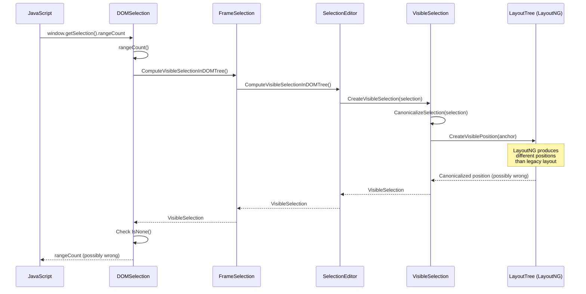

# Fix Assessment: 41311101

## Executive Summary
`DOMSelection` (the JavaScript Selection API implementation) internally uses `VisibleSelection` for canonicalization in multiple methods, but `VisibleSelection` relies on layout tree information that doesn't work correctly with LayoutNG. The recommended fix is to remove all `ComputeVisibleSelectionInDOMTree()` calls from `DOMSelection`, gated behind the existing `RemoveVisibleSelectionInDOMSelection` runtime feature flag, and instead canonicalize selection at the source (editing commands, `element.focus()`, etc.).

## Bug Analysis

### Problem Statement
`DOMSelection` (Blink's implementation of the W3C Selection API exposed to JavaScript) calls `ComputeVisibleSelectionInDOMTree()` in 7 locations to canonicalize selection positions. This canonicalization depends on layout tree traversal which doesn't work correctly with LayoutNG, producing inconsistent or incorrect selection positions in certain DOM structures (e.g., across inline element boundaries, shadow DOM, contenteditable regions).

### Expected Behavior
`DOMSelection` should return selection positions directly from the `SelectionEditor` (the source of truth for the DOM selection state) without going through `VisibleSelection` canonicalization. Canonicalization should instead be performed at the point where selection is set — editing commands (`execCommand`), `element.focus()`, `selectAll`, etc. — so that by the time `DOMSelection` reads the selection, positions are already canonical.

### Actual Behavior
`DOMSelection` methods (`direction()`, `rangeCount()`, `deleteFromDocument()`, `containsNode()`, `toString()`, and `CreateRangeFromSelectionEditor()`) call `ComputeVisibleSelectionInDOMTree()` which:
1. Forces a style/layout update
2. Creates a `VisibleSelection` which calls `CanonicalizeSelection()` → `CreateVisiblePosition()` → layout tree traversal
3. Under LayoutNG, this layout tree traversal can produce incorrect positions, especially at inline element boundaries

### Triggering Conditions
- Any use of the JavaScript Selection API (`window.getSelection()`) in pages with LayoutNG rendering
- Most visible when selection spans inline element boundaries (bold, italic, links, spans)
- Particularly affects `selection.rangeCount`, `selection.toString()`, `selection.containsNode()`, `selection.getRangeAt()`, and `selection.direction`

## Root Cause Analysis

### Code Investigation
The investigation traced the code path from JavaScript's `window.getSelection()` through `DOMSelection` to `FrameSelection::ComputeVisibleSelectionInDOMTree()` and ultimately to `CanonicalizeSelection()` in `visible_selection.cc`. The canonicalization calls `CreateVisiblePosition()` which depends on the layout tree, creating a coupling between the DOM selection API and the layout engine that is fundamentally incompatible with LayoutNG.

Partial fixes have already been landed:
1. **CL 5387033**: Canonicalize selection in `createLink` command after execution
2. **CL 5393240**: Canonicalize selection in `element.focus()` (behind feature flag)
3. **CL 5399116**: Canonicalize selection after editing commands execution
4. **CL 5455404**: Canonicalize selection after `selectAll` command (behind feature flag)

The remaining work is to remove the `ComputeVisibleSelectionInDOMTree()` calls from `DOMSelection` itself, which is pending CL 7546713.

### Key Files Identified
- [/third_party/blink/renderer/core/editing/dom_selection.cc#L97](/third_party/blink/renderer/core/editing/dom_selection.cc#L97) - `GetVisibleSelection()` helper that wraps `ComputeVisibleSelectionInDOMTree()`
- [/third_party/blink/renderer/core/editing/dom_selection.cc#L214](/third_party/blink/renderer/core/editing/dom_selection.cc#L214) - `direction()` uses `ComputeVisibleSelectionInDOMTree().IsNone()`
- [/third_party/blink/renderer/core/editing/dom_selection.cc#L234](/third_party/blink/renderer/core/editing/dom_selection.cc#L234) - `rangeCount()` uses `ComputeVisibleSelectionInDOMTree().IsNone()`
- [/third_party/blink/renderer/core/editing/dom_selection.cc#L684](/third_party/blink/renderer/core/editing/dom_selection.cc#L684) - `CreateRangeFromSelectionEditor()` uses `GetVisibleSelection()`
- [/third_party/blink/renderer/core/editing/dom_selection.cc#L791](/third_party/blink/renderer/core/editing/dom_selection.cc#L791) - `deleteFromDocument()` uses `ComputeVisibleSelectionInDOMTree()`
- [/third_party/blink/renderer/core/editing/dom_selection.cc#L821](/third_party/blink/renderer/core/editing/dom_selection.cc#L821) - `containsNode()` uses `ComputeVisibleSelectionInDOMTree()`
- [/third_party/blink/renderer/core/editing/dom_selection.cc#L884](/third_party/blink/renderer/core/editing/dom_selection.cc#L884) - `toString()` uses `ComputeVisibleSelectionInDOMTree()`
- [/third_party/blink/renderer/core/editing/dom_selection.h#L137](/third_party/blink/renderer/core/editing/dom_selection.h#L137) - `GetVisibleSelection()` private method declaration
- [/third_party/blink/renderer/core/editing/visible_selection.cc#L240](/third_party/blink/renderer/core/editing/visible_selection.cc#L240) - `CanonicalizeSelection()` — the problematic canonicalization that depends on layout tree
- [/third_party/blink/renderer/core/editing/frame_selection.cc#L135](/third_party/blink/renderer/core/editing/frame_selection.cc#L135) - `ComputeVisibleSelectionInDOMTree()` implementation
- [/third_party/blink/renderer/platform/runtime_enabled_features.json5#L4447](/third_party/blink/renderer/platform/runtime_enabled_features.json5#L4447) - `RemoveVisibleSelectionInDOMSelection` feature flag (status: "test")
- [/third_party/blink/renderer/core/editing/commands/editing_commands_utilities.cc#L658](/third_party/blink/renderer/core/editing/commands/editing_commands_utilities.cc#L658) - `CorrectedSelectionAfterCommand()` — already canonicalizes at source when flag is enabled

### Root Cause
**Location**: [/third_party/blink/renderer/core/editing/dom_selection.cc#L97](/third_party/blink/renderer/core/editing/dom_selection.cc#L97) (and 6 other call sites)
**Function**: `DOMSelection::GetVisibleSelection()` and direct `ComputeVisibleSelectionInDOMTree()` calls
**Issue**: `DOMSelection` performs selection canonicalization at read time by calling `ComputeVisibleSelectionInDOMTree()`, which creates a `VisibleSelection` that calls `CanonicalizeSelection()` (visible_selection.cc#L240). This canonicalization uses `CreateVisiblePosition()` which traverses the layout tree. Under LayoutNG, this layout tree traversal produces different (often incorrect) results compared to the legacy layout engine, leading to wrong selection anchor/focus positions, incorrect `rangeCount`, and incorrect `toString()` output. The architectural fix is to move canonicalization to the write side (editing commands, focus, etc.) and have `DOMSelection` read directly from the `SelectionEditor` without going through `VisibleSelection`.

### Code Flow Diagram

## Fix Options

### Option 1: Remove VisibleSelection from DOMSelection behind feature flag ⭐ RECOMMENDED
- **Description**: Replace all 7 `ComputeVisibleSelectionInDOMTree()` calls in `DOMSelection` with direct reads from `SelectionEditor` (via `Selection().GetSelectionInDOMTree()`), gated behind the existing `RemoveVisibleSelectionInDOMSelection` feature flag. For methods like `direction()` and `rangeCount()` that check `.IsNone()`, replace with `GetSelectionInDOMTree().IsNone()`. For `CreateRangeFromSelectionEditor()`, use `GetSelectionInDOMTree()` directly. For `toString()`, `deleteFromDocument()`, and `containsNode()`, use `NormalizeRange()` from the selection instead of `ToNormalizedEphemeralRange()` on a `VisibleSelection`.
- **Files to modify**: 
  - [/third_party/blink/renderer/core/editing/dom_selection.cc](/third_party/blink/renderer/core/editing/dom_selection.cc) — all 7 call sites
  - [/third_party/blink/renderer/core/editing/dom_selection.h](/third_party/blink/renderer/core/editing/dom_selection.h) — potentially remove `GetVisibleSelection()` declaration (or keep for fallback)
- **Complexity**: Medium
- **Risk**: Medium — requires ensuring all editing commands and focus paths correctly canonicalize before this code runs. The prerequisite CLs (5387033, 5393240, 5399116, 5455404) have already landed for major paths.
- **Pros**: Aligns with the stated architectural goal; already partially implemented; feature-flagged for safe rollout; eliminates the layout-tree dependency from the read path
- **Cons**: Some edge cases in editing commands may still not canonicalize correctly, causing test failures; needs thorough testing

### Option 2: Fix CanonicalizeSelection for LayoutNG
- **Description**: Modify `CanonicalizeSelection()` in `visible_selection.cc` to produce correct results under LayoutNG, keeping the existing `DOMSelection` → `VisibleSelection` architecture.
- **Files to modify**: 
  - [/third_party/blink/renderer/core/editing/visible_selection.cc#L240](/third_party/blink/renderer/core/editing/visible_selection.cc#L240)
  - [/third_party/blink/renderer/core/editing/visible_units.cc](/third_party/blink/renderer/core/editing/visible_units.cc) — `CreateVisiblePosition` implementation
- **Complexity**: High
- **Risk**: High — `CreateVisiblePosition` and `CanonicalizeSelection` are used throughout the editing codebase; changes could have far-reaching effects
- **Pros**: Doesn't require changing the `DOMSelection` architecture; fixes the problem at the source
- **Cons**: Doesn't address the fundamental architectural issue of reading layout info from DOM API; high risk of regressions in other editing functionality; goes against the direction established by existing CLs

### Option 3: Promote feature flag to stable
- **Description**: The prerequisite work is largely done. Simply promote the `RemoveVisibleSelectionInDOMSelection` feature flag from `"test"` to `"stable"` in `runtime_enabled_features.json5`, enabling the already-landed canonicalization-at-source code paths for all users.
- **Files to modify**: 
  - [/third_party/blink/renderer/platform/runtime_enabled_features.json5#L4448](/third_party/blink/renderer/platform/runtime_enabled_features.json5#L4448) — change `status: "test"` to `status: "stable"`
- **Complexity**: Low (one-line change)
- **Risk**: High — the feature flag only gates the source-side canonicalization (editing commands, focus, selectAll); the `DOMSelection` code itself hasn't been updated to skip `VisibleSelection` when the flag is enabled. Promoting the flag alone doesn't remove the `VisibleSelection` calls from `DOMSelection`.
- **Pros**: Enables the already-landed prerequisite work; trivial change
- **Cons**: Doesn't actually remove `VisibleSelection` from `DOMSelection`; only makes the write-side canonicalize, while the read-side still goes through `VisibleSelection` — result is redundant canonicalization, not elimination of it

### Option 4: Incremental removal with per-method feature checks
- **Description**: Add `RuntimeEnabledFeatures::RemoveVisibleSelectionInDOMSelectionEnabled()` checks to each of the 7 call sites in `DOMSelection`, providing both the old `ComputeVisibleSelectionInDOMTree()` path and a new direct `GetSelectionInDOMTree()` path. This allows per-method testing and gradual rollout.
- **Files to modify**: 
  - [/third_party/blink/renderer/core/editing/dom_selection.cc](/third_party/blink/renderer/core/editing/dom_selection.cc) — all 7 call sites
- **Complexity**: Medium
- **Risk**: Low — each change is independently testable and the fallback path is always available
- **Pros**: Lowest risk rollout; can be enabled method by method; easy to revert individual changes
- **Cons**: More code complexity with branching; flag-guarded code needs cleanup later

### Option 5: Replace VisibleSelection with SelectionEditor range computation
- **Description**: Create a new helper method in `DOMSelection` that computes ranges directly from `SelectionEditor`'s DOM tree positions without going through `VisibleSelection` at all, and use it in all 7 call sites unconditionally (no feature flag).
- **Files to modify**: 
  - [/third_party/blink/renderer/core/editing/dom_selection.cc](/third_party/blink/renderer/core/editing/dom_selection.cc)
  - [/third_party/blink/renderer/core/editing/dom_selection.h](/third_party/blink/renderer/core/editing/dom_selection.h)
- **Complexity**: Medium
- **Risk**: High — no feature flag means no fallback; all changes go live at once
- **Pros**: Clean architecture; no feature flag overhead; simplest final state
- **Cons**: No safety net; higher risk of regressions; doesn't align with the established incremental approach

## Recommended Approach
**Option 1** is recommended because it directly addresses the bug's stated goal, aligns with the architectural direction established by the prerequisite CLs (which canonicalize at the source), and uses the existing `RemoveVisibleSelectionInDOMSelection` feature flag for safe, controlled rollout. The key insight from the bug discussion is that selection canonicalization should happen when selection is *set* (editing commands, focus), not when it's *read* (DOMSelection API). The prerequisite CLs have already moved canonicalization to the major write paths; this change completes the picture by removing the redundant canonicalization from the read path.

Practically, this involves modifying each of the 7 call sites in `dom_selection.cc` to check `RuntimeEnabledFeatures::RemoveVisibleSelectionInDOMSelectionEnabled()` and, when enabled, use `Selection().GetSelectionInDOMTree()` directly instead of `ComputeVisibleSelectionInDOMTree()`. For methods that need `IsNone()`, this is straightforward. For methods that need a normalized range (like `toString()`, `containsNode()`, `deleteFromDocument()`), `NormalizeRange(GetSelectionInDOMTree())` can replace `ComputeVisibleSelectionInDOMTree().ToNormalizedEphemeralRange()`.

This approach is also consistent with the pending CL 7546713 noted in the bug tracker.

## Testing Strategy
- **Unit tests needed**: Add tests in `dom_selection_test.cc` that enable `RemoveVisibleSelectionInDOMSelection` via `ScopedRemoveVisibleSelectionInDOMSelectionForTest` and verify:
  - `rangeCount()` returns correct values for selections in contenteditable, shadow DOM, and across inline boundaries
  - `direction()` returns correct values
  - `toString()` produces correct text output
  - `containsNode()` returns correct results
  - `deleteFromDocument()` correctly deletes selected content
  - `getRangeAt(0)` returns correct range endpoints (anchor/focus)
- **Web tests needed**: Add web platform tests exercising the Selection API with the `RemoveVisibleSelectionInDOMSelection` feature enabled, focusing on:
  - Selections across inline element boundaries (`<b>`, `<i>`, ``)
  - Selections in contenteditable regions
  - `execCommand('selectAll')` followed by Selection API queries
  - `element.focus()` followed by Selection API queries
- **Manual verification**: 
  1. Launch Chrome with `--enable-blink-features=RemoveVisibleSelectionInDOMSelection`
  2. Open a page with contenteditable regions containing inline elements
  3. Make selections across element boundaries
  4. Verify `window.getSelection()` properties match expected values
  5. Run `document.execCommand('selectAll')` and verify selection state
  6. Test `selection.containsNode()` with various node types

## Related Code References
- Pending CL: [CL 7546713](https://chromium-review.googlesource.com/c/chromium/src/+/7546713) — the main CL to remove VisibleSelection from DOMSelection
- Prerequisite CL: [CL 5387033](https://chromium-review.googlesource.com/5387033) — createLink command canonicalization
- Prerequisite CL: [CL 5393240](https://chromium-review.googlesource.com/5393240) — element.focus() canonicalization
- Prerequisite CL: [CL 5399116](https://chromium-review.googlesource.com/5399116) — editing commands canonicalization
- Prerequisite CL: [CL 5455404](https://chromium-review.googlesource.com/5455404) — selectAll canonicalization
- Spec reference: [W3C Selection API](https://www.w3.org/TR/selection-api/)
- Bug tracker: [crbug.com/41311101](https://issues.chromium.org/issues/41311101)
- Test examples: [/third_party/blink/renderer/core/editing/dom_selection_test.cc](/third_party/blink/renderer/core/editing/dom_selection_test.cc)
