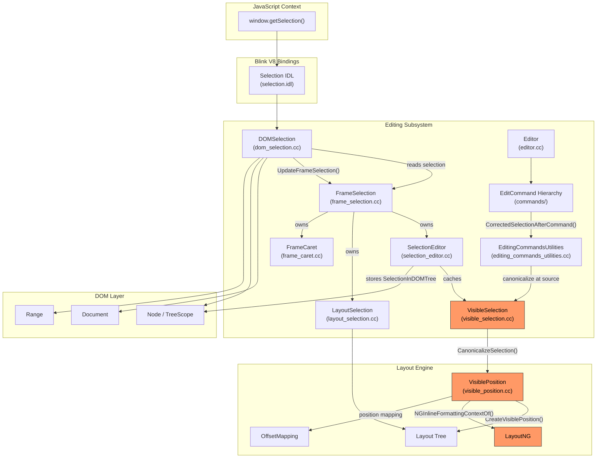
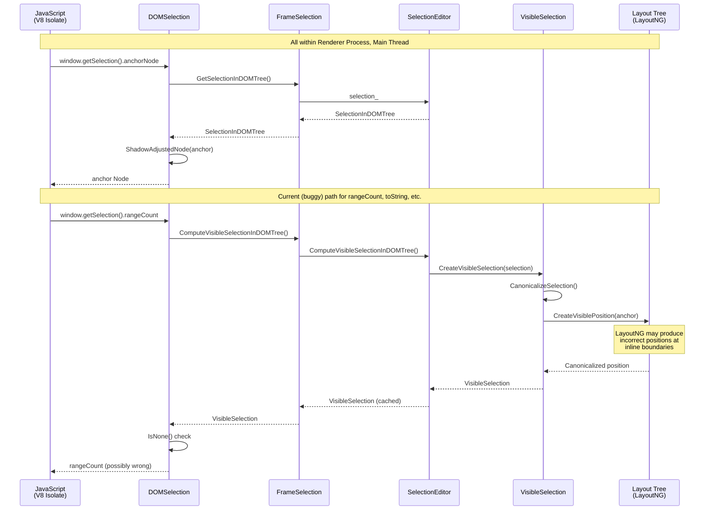
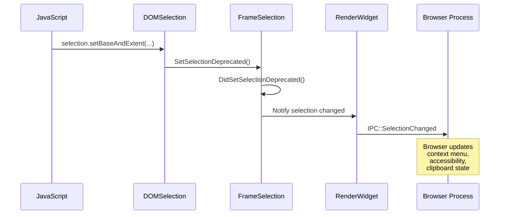
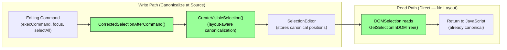
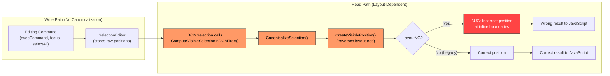
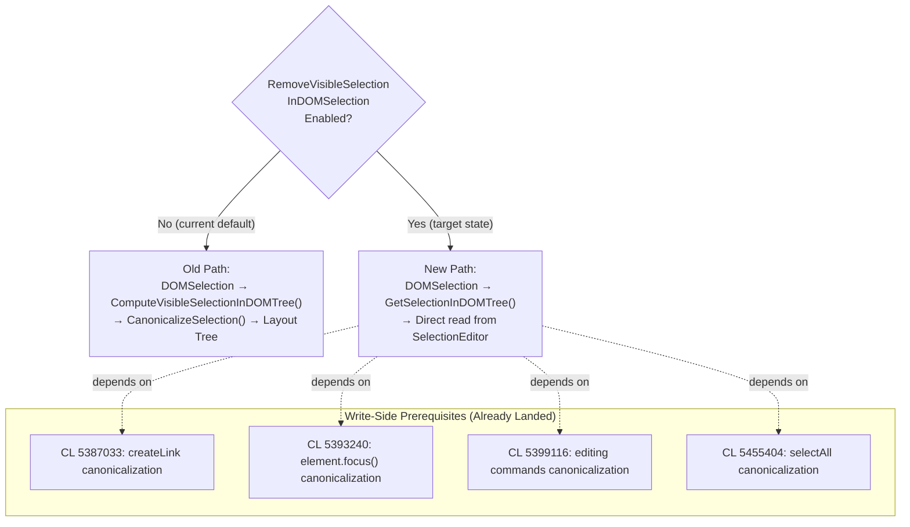

# High-Level Design: 41311101

## 1. Executive Summary

Bug 41311101 concerns Blink's `DOMSelection` class — the C++ implementation backing the JavaScript `window.getSelection()` API. `DOMSelection` currently calls `ComputeVisibleSelectionInDOMTree()` in 7 locations to canonicalize selection positions before returning them to JavaScript. This canonicalization traverses the layout tree via `CreateVisiblePosition()`, which produces incorrect results under LayoutNG at certain inline element boundaries. The fix removes this layout-dependent canonicalization from the read path (`DOMSelection`) and moves it to the write path (editing commands, `element.focus()`, `selectAll`), gated behind the `RemoveVisibleSelectionInDOMSelection` runtime feature flag.

## 2. System Context

### 2.1 Overview

The Selection API is part of Blink's **Editing** subsystem within the **Renderer Process**. It sits at the intersection of three major concerns:

1. **Web Platform API** — Exposing `window.getSelection()` to JavaScript per the W3C Selection API specification
2. **DOM state management** — Tracking which DOM nodes/offsets the user has selected
3. **Layout integration** — Rendering the visual selection highlight and computing "visible" positions that account for CSS, line breaks, and formatting context

The bug occurs because concern (3) — layout integration — is invoked on the read path of concern (1), creating a coupling between the DOM-level Selection API and the layout engine. Under LayoutNG, this coupling produces incorrect positions.

### 2.2 Related Specs
- [W3C Selection API Specification](https://www.w3.org/TR/selection-api/)
- [WHATWG DOM Range Specification](https://dom.spec.whatwg.org/#ranges)
- [Chromium Editing README](https://chromium.googlesource.com/chromium/src/+/HEAD/third_party/blink/renderer/core/editing/README.md)

## 3. Component Architecture

### 3.1 Major Components

| Component | Location | Responsibility |
|-----------|----------|----------------|
| **DOMSelection** | `/third_party/blink/renderer/core/editing/dom_selection.cc` | JavaScript Selection API facade (ScriptWrappable); translates web API calls to internal selection state |
| **FrameSelection** | `/third_party/blink/renderer/core/editing/frame_selection.cc` | Frame-level selection coordinator; owns SelectionEditor, LayoutSelection, FrameCaret |
| **SelectionEditor** | `/third_party/blink/renderer/core/editing/selection_editor.cc` | Source of truth for DOM selection state; holds `SelectionInDOMTree`; caches `VisibleSelection` |
| **VisibleSelection** | `/third_party/blink/renderer/core/editing/visible_selection.cc` | Layout-aware selection abstraction; calls `CanonicalizeSelection()` → `CreateVisiblePosition()` |
| **LayoutSelection** | `/third_party/blink/renderer/core/editing/layout_selection.cc` | Painting integration; computes layout objects to highlight for the selection |
| **FrameCaret** | `/third_party/blink/renderer/core/editing/frame_caret.cc` | Caret blinking and rendering |
| **Editor** | `/third_party/blink/renderer/core/editing/editor.cc` | Central editing coordinator; manages edit commands, undo/redo |
| **EditCommand hierarchy** | `/third_party/blink/renderer/core/editing/commands/` | Concrete editing operations (delete, insert, format, etc.) |
| **EditingCommandsUtilities** | `/third_party/blink/renderer/core/editing/commands/editing_commands_utilities.cc` | Shared utilities including `CorrectedSelectionAfterCommand()` |
| **Selection IDL binding** | `/third_party/blink/renderer/core/editing/selection.idl` | Web IDL interface definition; `[ImplementedAs=DOMSelection]` |
| **RuntimeEnabledFeatures** | `/third_party/blink/renderer/platform/runtime_enabled_features.json5` | Feature flag `RemoveVisibleSelectionInDOMSelection` (status: "test") |

### 3.2 Component Diagram

**Legend**: Orange-highlighted components indicate the layout-dependent path that causes the bug.

## 4. Process Architecture

### 4.1 Process Boundaries

The Selection API operates entirely within the **Renderer Process**. No IPC to the Browser Process is required for selection queries (`anchorNode`, `focusNode`, `rangeCount`, `toString`, etc.). The Browser Process is only involved for:
- Clipboard operations (`copy`, `cut`, `paste`) that use selection content
- Accessibility notifications when selection changes
- Context menu interactions based on selection

All selection logic runs on the **main thread** of the Renderer Process. There is no worker thread involvement. Blink's single-threaded execution model for DOM operations means no synchronization primitives are needed within the selection subsystem.

### 4.2 IPC Flow (Selection Query — No IPC)

### 4.3 IPC Flow (Selection Change — Outbound Notifications)

## 5. Data Flow

### 5.1 Normal Flow (Expected — After Fix)

### 5.2 Buggy Flow (Current — Before Fix)

### 5.3 Feature Flag Transition

## 6. Key Interfaces

### 6.1 Public APIs (JavaScript-Facing)

- `DOMSelection::anchorNode()` / `focusNode()` — Returns the anchor/focus node of the selection (Mozilla API)
- `DOMSelection::baseNode()` / `extentNode()` — Returns base/extent node (Safari API)
- `DOMSelection::rangeCount()` — Returns number of ranges (0 or 1); **uses VisibleSelection (buggy)**
- `DOMSelection::getRangeAt(index)` — Returns a Range object for the selection
- `DOMSelection::toString()` — Returns selected text; **uses VisibleSelection (buggy)**
- `DOMSelection::containsNode(node, allowPartial)` — Tests if node is in selection; **uses VisibleSelection (buggy)**
- `DOMSelection::deleteFromDocument()` — Deletes selected content; **uses VisibleSelection (buggy)**
- `DOMSelection::direction()` — Returns selection direction; **uses VisibleSelection (buggy)**
- `DOMSelection::setBaseAndExtent(anchorNode, anchorOffset, focusNode, focusOffset)` — Sets selection
- `DOMSelection::collapse(node, offset)` — Collapses selection to a point
- `DOMSelection::extend(node, offset)` — Extends selection to a point

### 6.2 Internal Interfaces

- `FrameSelection::ComputeVisibleSelectionInDOMTree()` — Computes layout-aware VisibleSelection (to be removed from read path)
- `FrameSelection::GetSelectionInDOMTree()` — Returns raw SelectionInDOMTree from SelectionEditor (replacement for above)
- `SelectionEditor::ComputeVisibleSelectionInDOMTree()` — Cached computation of VisibleSelection with layout validation
- `SelectionEditor::MarkCacheDirty()` — Invalidates cached VisibleSelection on DOM/style changes
- `VisibleSelection::CanonicalizeSelection()` — Adjusts anchor/focus using `CreateVisiblePosition()` (layout-dependent)
- `CreateVisiblePosition(Position)` — Converts DOM position to layout-aware position using LayoutNG/legacy layout tree
- `CorrectedSelectionAfterCommand()` — Write-side canonicalization; calls `CreateVisibleSelection()` when feature flag is enabled
- `DOMSelection::UpdateFrameSelection()` — Delegates write operations to `FrameSelection::SetSelectionDeprecated()`
- `DOMSelection::GetVisibleSelection()` — Private helper wrapping `ComputeVisibleSelectionInDOMTree()` (to be removed)

## 7. Threading Model

All selection operations execute on the **Renderer main thread**. There is no multi-threaded access to selection state.

- **Main thread responsibilities**:
  - All `DOMSelection` API calls (invoked from JavaScript via V8)
  - `SelectionEditor` state mutations and cache management
  - `VisibleSelection` computation including layout tree traversal
  - `LayoutSelection` painting integration
  - Editing command execution and undo/redo
  - DOM mutation observation and cache invalidation (`NodeWillBeRemoved`, `DidChangeChildren`)

- **Compositor thread** (read-only interaction):
  - Reads painted selection highlight layers for compositing
  - No direct interaction with `DOMSelection` or `SelectionEditor`

- **Synchronization points**:
  - `Document::UpdateStyleAndLayout()` is called before layout-dependent operations (e.g., `ComputeVisibleSelectionInDOMTree()` requires document to be in `AfterPerformLayout` state)
  - `SelectionEditor` uses a dirty-flag pattern (`MarkCacheDirty()` / `UpdateCachedVisibleSelectionIfNeeded()`) for lazy cache invalidation — no locks needed since all access is single-threaded

## 8. External Dependencies

### Other Chrome Components
- **V8 JavaScript engine** — Invokes `DOMSelection` methods via IDL-generated bindings
- **DOM subsystem** (`Document`, `Node`, `Range`, `TreeScope`) — Provides the tree structure that selection positions reference
- **Layout engine** (`LayoutObject`, `LayoutNG`, `OffsetMapping`, `NGInlineFormattingContext`) — Provides visible position computation; **this is the problematic dependency**
- **Accessibility** (`AXObjectCache`) — Notified of selection changes for screen readers
- **Clipboard** (`ClipboardCommands`) — Uses selection content for copy/cut operations
- **Input events** (`EventHandler`, `SelectionController`) — Handles mouse/touch/keyboard selection gestures

### Platform APIs
- **Text rendering** (HarfBuzz, Skia) — Used indirectly for caret/selection rectangle computation
- **IME (Input Method Editor)** — Interacts with selection for composition state

### Third-Party Libraries
- None directly; selection logic is self-contained within Blink

## 9. Impact of Fix

### 9.1 Components Affected

| Component | Change Type | Description |
|-----------|-------------|-------------|
| `dom_selection.cc` | **Modified** | Replace 7 `ComputeVisibleSelectionInDOMTree()` calls with direct `GetSelectionInDOMTree()` reads, gated behind feature flag |
| `dom_selection.h` | **Modified** | Potentially remove `GetVisibleSelection()` private method (or keep for fallback path) |
| `editing_commands_utilities.cc` | **Already modified** | `CorrectedSelectionAfterCommand()` already canonicalizes at source when flag is enabled |
| `runtime_enabled_features.json5` | **Future change** | Flag promotion from `"test"` to `"stable"` after validation |

### 9.2 Risk Assessment

- **Scope**: Narrow — Changes are confined to `DOMSelection`'s 7 read-path call sites, all behind a feature flag
- **Risk Level**: Medium — The fix depends on all write-side canonicalization paths being complete. If any editing command or focus path fails to canonicalize before `DOMSelection` reads, the selection may have un-canonicalized positions. The 4 prerequisite CLs cover major paths, but edge cases may remain.
- **Testing Coverage**: 
  - Existing `dom_selection_test.cc` unit tests validate basic Selection API behavior
  - Web Platform Tests (`editing/selection/`) cover cross-browser Selection API conformance
  - Feature flag allows A/B testing: enable via `--enable-blink-features=RemoveVisibleSelectionInDOMSelection`
  - The `ScopedRemoveVisibleSelectionInDOMSelectionForTest` test helper enables per-test flag control
  - Risk is mitigated by incremental rollout: flag starts as `"test"`, promoted to `"stable"` only after validation
