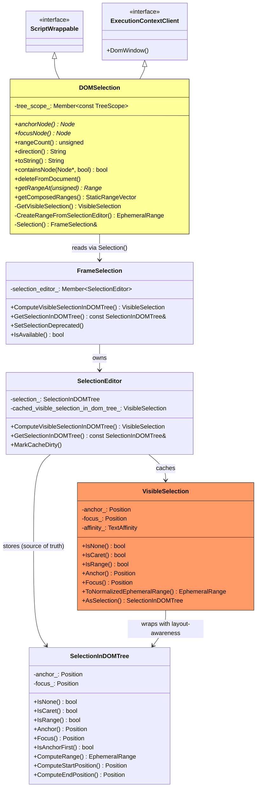
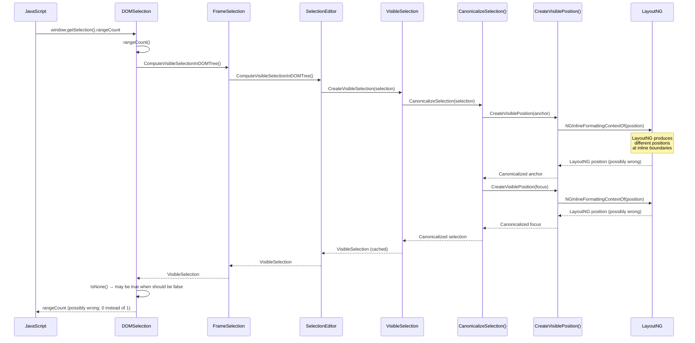
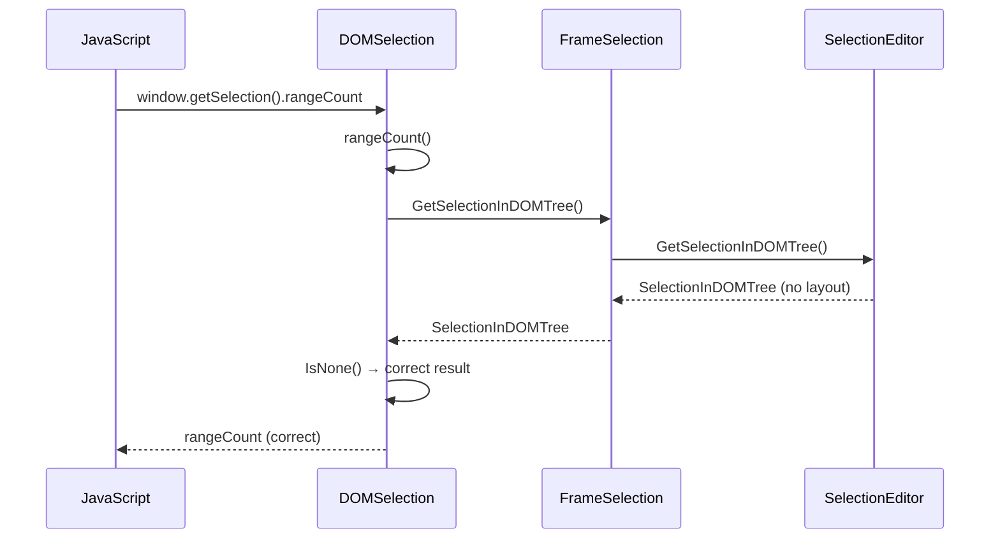

# Low-Level Design: 41311101

## 1. Files to Modify

| File | Type | Changes | Lines |
|------|------|---------|-------|
| [/third_party/blink/renderer/core/editing/dom_selection.cc](/third_party/blink/renderer/core/editing/dom_selection.cc) | Modify | Gate 7 `ComputeVisibleSelectionInDOMTree()` call sites behind `RemoveVisibleSelectionInDOMSelection` feature flag; use direct `GetSelectionInDOMTree()` reads when enabled | ~60 |
| [/third_party/blink/renderer/core/editing/dom_selection.h](/third_party/blink/renderer/core/editing/dom_selection.h) | Modify | Keep `GetVisibleSelection()` for fallback path (used when flag is disabled) | ~0 |
| [/third_party/blink/renderer/core/editing/dom_selection_test.cc](/third_party/blink/renderer/core/editing/dom_selection_test.cc) | Modify | Add tests exercising Selection API methods with `RemoveVisibleSelectionInDOMSelection` enabled | ~80 |

## 2. Class Hierarchy

### 2.1 Class Diagram


### 2.2 Class Responsibilities
- **DOMSelection**: JavaScript Selection API facade (`ScriptWrappable`); translates web API calls (`anchorNode`, `rangeCount`, `toString`, etc.) to internal selection state. **Contains the bug**: 7 methods call `ComputeVisibleSelectionInDOMTree()` unnecessarily.
- **FrameSelection**: Frame-level selection coordinator; owns `SelectionEditor`, `LayoutSelection`, `FrameCaret`. Provides both `ComputeVisibleSelectionInDOMTree()` (layout-dependent) and `GetSelectionInDOMTree()` (layout-independent).
- **SelectionEditor**: Source of truth for DOM selection state; holds `SelectionInDOMTree`; caches `VisibleSelection` with dirty-flag invalidation.
- **VisibleSelection**: Layout-aware selection abstraction; constructor calls `CanonicalizeSelection()` → `CreateVisiblePosition()` → layout tree traversal. **This is the problematic dependency** that produces incorrect results under LayoutNG.
- **SelectionInDOMTree** (`SelectionTemplate<EditingStrategy>`): Pure DOM selection state — anchor, focus positions and affinity. No layout dependency. **This is the replacement data source** for `DOMSelection`.

## 3. Method-Level Analysis

### 3.1 Call Chain (Bug Path)


### 3.2 Call Chain (Fixed Path)


### 3.3 Affected Methods

There are 7 call sites in `dom_selection.cc` that use `ComputeVisibleSelectionInDOMTree()` (directly or via the `GetVisibleSelection()` helper). Each must be replaced with a direct `GetSelectionInDOMTree()` read when the feature flag is enabled.

#### 3.3.1 `DOMSelection::GetVisibleSelection()`
**Location**: [/third_party/blink/renderer/core/editing/dom_selection.cc#L97](/third_party/blink/renderer/core/editing/dom_selection.cc#L97)

**Current Implementation**:
```cpp
VisibleSelection DOMSelection::GetVisibleSelection() const {
  // TODO(editing-dev): The use of UpdateStyleAndLayout
  // needs to be audited.  See http://crbug.com/590369 for more details.
  DomWindow()->document()->UpdateStyleAndLayout(
      DocumentUpdateReason::kSelection);

  return Selection().ComputeVisibleSelectionInDOMTree();
}
```

**Issues**:
1. Forces `UpdateStyleAndLayout()` even when layout info is not needed
2. Calls `ComputeVisibleSelectionInDOMTree()` which triggers `CanonicalizeSelection()` → `CreateVisiblePosition()` → layout tree traversal
3. Under LayoutNG, `CreateVisiblePosition()` can return incorrect positions at inline boundaries

**Role**: This is a private helper used by `CreateRangeFromSelectionEditor()` (line 684). Other call sites call `ComputeVisibleSelectionInDOMTree()` directly.

---

#### 3.3.2 `DOMSelection::direction()`
**Location**: [/third_party/blink/renderer/core/editing/dom_selection.cc#L200](/third_party/blink/renderer/core/editing/dom_selection.cc#L200)

**Current Implementation (lines 200–221)**:
```cpp
String DOMSelection::direction() const {
  if (!IsAvailable()) {
    return "none";
  }
  DomWindow()->document()->UpdateStyleAndLayout(
      DocumentUpdateReason::kSelection);

  if (!Selection().IsDirectional() ||
      (RuntimeEnabledFeatures::SelectionCollapsedDirectionNoneEnabled() &&
       Selection().GetSelectionInDOMTree().IsCaret()) ||
      Selection().ComputeVisibleSelectionInDOMTree().IsNone()) {
    return "none";
  }
  if (IsAnchorFirstInSelection()) {
    return "forward";
  }
  return "backward";
}
```

**Issue**: Line 214 calls `ComputeVisibleSelectionInDOMTree().IsNone()` to check if the canonicalized selection is empty. Under LayoutNG, canonicalization may incorrectly produce `IsNone() == true` when the selection is actually valid.

---

#### 3.3.3 `DOMSelection::rangeCount()`
**Location**: [/third_party/blink/renderer/core/editing/dom_selection.cc#L223](/third_party/blink/renderer/core/editing/dom_selection.cc#L223)

**Current Implementation (lines 223–244)**:
```cpp
unsigned DOMSelection::rangeCount() const {
  if (!IsAvailable())
    return 0;
  if (DocumentCachedRange())
    return 1;

  DomWindow()->document()->UpdateStyleAndLayout(
      DocumentUpdateReason::kSelection);

  if (Selection().ComputeVisibleSelectionInDOMTree().IsNone()) {
    return 0;
  }
  if (IsSelectionOfDocument())
    return 1;
  if (CreateRangeFromSelectionEditor().IsNotNull())
    return 1;
  return 0;
}
```

**Issue**: Line 234 calls `ComputeVisibleSelectionInDOMTree().IsNone()`. Same LayoutNG canonicalization problem as `direction()`.

---

#### 3.3.4 `DOMSelection::CreateRangeFromSelectionEditor()`
**Location**: [/third_party/blink/renderer/core/editing/dom_selection.cc#L683](/third_party/blink/renderer/core/editing/dom_selection.cc#L683)

**Current Implementation (lines 683–702)**:
```cpp
EphemeralRange DOMSelection::CreateRangeFromSelectionEditor() const {
  const VisibleSelection& selection = GetVisibleSelection();
  const Position& anchor = selection.Anchor().ParentAnchoredEquivalent();
  if (IsSelectionOfDocument() && !anchor.AnchorNode()->IsInShadowTree())
    return FirstEphemeralRangeOf(selection);

  Node* const anchor_node = ShadowAdjustedNode(anchor);
  if (!anchor_node)  // crbug.com/595100
    return EphemeralRange();

  const Position& focus = selection.Focus().ParentAnchoredEquivalent();
  const Position shadow_adjusted_focus =
      Position(ShadowAdjustedNode(focus), ShadowAdjustedOffset(focus));
  const Position shadow_adjusted_anchor =
      Position(anchor_node, ShadowAdjustedOffset(anchor));
  if (selection.IsAnchorFirst()) {
    return EphemeralRange(shadow_adjusted_anchor, shadow_adjusted_focus);
  }
  return EphemeralRange(shadow_adjusted_focus, shadow_adjusted_anchor);
}
```

**Issue**: Line 684 calls `GetVisibleSelection()` which goes through the full `ComputeVisibleSelectionInDOMTree()` → `CanonicalizeSelection()` path. This method is used by `getRangeAt()` (line 605) to construct the `Range` object returned to JavaScript.

---

#### 3.3.5 `DOMSelection::deleteFromDocument()`
**Location**: [/third_party/blink/renderer/core/editing/dom_selection.cc#L772](/third_party/blink/renderer/core/editing/dom_selection.cc#L772)

**Current Implementation (lines 772–801)**:
```cpp
void DOMSelection::deleteFromDocument() {
  if (!IsAvailable())
    return;

  if (Range* range = DocumentCachedRange()) {
    range->deleteContents(ASSERT_NO_EXCEPTION);
    return;
  }

  DomWindow()->document()->UpdateStyleAndLayout(
      DocumentUpdateReason::kSelection);

  Range* selected_range = CreateRange(Selection()
                                          .ComputeVisibleSelectionInDOMTree()
                                          .ToNormalizedEphemeralRange());
  if (!selected_range)
    return;
  if (selected_range->startContainer()->IsInUserAgentShadowRoot()) {
    return;
  }

  selected_range->deleteContents(ASSERT_NO_EXCEPTION);
}
```

**Issue**: Lines 790–792 call `ComputeVisibleSelectionInDOMTree().ToNormalizedEphemeralRange()` to get the range to delete. The `ToNormalizedEphemeralRange()` method internally calls `NormalizeRange(AsSelection())` on the canonicalized `VisibleSelection`, meaning canonicalization has already been applied.

---

#### 3.3.6 `DOMSelection::containsNode()`
**Location**: [/third_party/blink/renderer/core/editing/dom_selection.cc#L803](/third_party/blink/renderer/core/editing/dom_selection.cc#L803)

**Current Implementation (lines 803–862)**:
```cpp
bool DOMSelection::containsNode(const Node* n, bool allow_partial) const {
  // ...
  DomWindow()->document()->UpdateStyleAndLayout(
      DocumentUpdateReason::kSelection);

  const EphemeralRange selected_range = Selection()
                                            .ComputeVisibleSelectionInDOMTree()
                                            .ToNormalizedEphemeralRange();
  if (selected_range.IsNull())
    return false;
  // ... boundary comparisons ...
}
```

**Issue**: Lines 820–822 call `ComputeVisibleSelectionInDOMTree().ToNormalizedEphemeralRange()`. Same canonicalization problem.

---

#### 3.3.7 `DOMSelection::toString()`
**Location**: [/third_party/blink/renderer/core/editing/dom_selection.cc#L871](/third_party/blink/renderer/core/editing/dom_selection.cc#L871)

**Current Implementation (lines 871–895)**:
```cpp
String DOMSelection::toString() {
  if (!IsAvailable())
    return String();

  DomWindow()->document()->UpdateStyleAndLayout(
      DocumentUpdateReason::kSelection);

  DocumentLifecycle::DisallowTransitionScope disallow_transition(
      DomWindow()->document()->Lifecycle());

  const EphemeralRange range = Selection()
                                   .ComputeVisibleSelectionInDOMTree()
                                   .ToNormalizedEphemeralRange();
  // ...
  return PlainText(range, behavior_builder.Build());
}
```

**Issue**: Lines 883–885 call `ComputeVisibleSelectionInDOMTree().ToNormalizedEphemeralRange()`. Same canonicalization problem.

## 4. Fix Design

### 4.1 Design Principle

The fix follows the **canonicalize-at-source** principle: selection positions are canonicalized (adjusted using layout-tree information) when they are *set* (editing commands, `element.focus()`, `selectAll`), not when they are *read* (`DOMSelection` API).

The prerequisite CLs have already moved canonicalization to the write side:
- **CL 5387033**: `createLink` command canonicalization
- **CL 5393240**: `element.focus()` canonicalization (behind flag)
- **CL 5399116**: `CorrectedSelectionAfterCommand()` in editing commands (behind flag)
- **CL 5455404**: `selectAll` canonicalization (behind flag)

With the write side covered, `DOMSelection` can safely read directly from `SelectionEditor` via `GetSelectionInDOMTree()` without going through `VisibleSelection`.

### 4.2 Replacement Strategy

For each call site, the replacement depends on what the code does with the `VisibleSelection`:

| Usage Pattern | Current | Replacement |
|--------------|---------|-------------|
| `.IsNone()` check | `ComputeVisibleSelectionInDOMTree().IsNone()` | `Selection().GetSelectionInDOMTree().IsNone()` |
| `.ToNormalizedEphemeralRange()` | `ComputeVisibleSelectionInDOMTree().ToNormalizedEphemeralRange()` | `NormalizeRange(Selection().GetSelectionInDOMTree())` |
| `GetVisibleSelection()` for anchor/focus | `GetVisibleSelection().Anchor()` / `.Focus()` | `Selection().GetSelectionInDOMTree().Anchor()` / `.Focus()` |
| `FirstEphemeralRangeOf(selection)` | On a `VisibleSelection` | On the `SelectionInDOMTree` computed range |

**Key insight**: `VisibleSelection::ToNormalizedEphemeralRange()` internally calls `NormalizeRange(AsSelection())` where `AsSelection()` returns the canonicalized `SelectionInDOMTree`. The free function `NormalizeRange(const SelectionInDOMTree&)` (declared in `visible_selection.h` at line 140) performs the same normalization but on whatever `SelectionInDOMTree` is passed. When the flag is enabled, the write side has already canonicalized the selection, so `NormalizeRange(GetSelectionInDOMTree())` produces the same result without re-canonicalization.

### 4.3 Changes Required

All changes are gated behind `RuntimeEnabledFeatures::RemoveVisibleSelectionInDOMSelectionEnabled()`.

#### File 1: [/third_party/blink/renderer/core/editing/dom_selection.cc](/third_party/blink/renderer/core/editing/dom_selection.cc)

##### Change 1: `direction()` — lines 209–214

**Before**:
```cpp
  if (!Selection().IsDirectional() ||
      (RuntimeEnabledFeatures::SelectionCollapsedDirectionNoneEnabled() &&
       // Use IsCaret() instead of isCollapsed() so that directionality is still
       // reported for selections that cross shadow boundaries.
       Selection().GetSelectionInDOMTree().IsCaret()) ||
      Selection().ComputeVisibleSelectionInDOMTree().IsNone()) {
```

**After**:
```cpp
  if (!Selection().IsDirectional() ||
      (RuntimeEnabledFeatures::SelectionCollapsedDirectionNoneEnabled() &&
       // Use IsCaret() instead of isCollapsed() so that directionality is still
       // reported for selections that cross shadow boundaries.
       Selection().GetSelectionInDOMTree().IsCaret()) ||
      (RuntimeEnabledFeatures::RemoveVisibleSelectionInDOMSelectionEnabled()
           ? Selection().GetSelectionInDOMTree().IsNone()
           : Selection().ComputeVisibleSelectionInDOMTree().IsNone())) {
```

**Rationale**: When the flag is enabled, the `IsNone()` check reads directly from `SelectionInDOMTree` without layout-tree canonicalization. The `UpdateStyleAndLayout()` call at lines 206–207 can remain for now (it's needed by the disabled-flag path and is harmless when enabled). When the flag is disabled, behavior is unchanged.

##### Change 2: `rangeCount()` — lines 231–236

**Before**:
```cpp
  DomWindow()->document()->UpdateStyleAndLayout(
      DocumentUpdateReason::kSelection);

  if (Selection().ComputeVisibleSelectionInDOMTree().IsNone()) {
    return 0;
  }
```

**After**:
```cpp
  if (RuntimeEnabledFeatures::RemoveVisibleSelectionInDOMSelectionEnabled()) {
    if (Selection().GetSelectionInDOMTree().IsNone()) {
      return 0;
    }
  } else {
    DomWindow()->document()->UpdateStyleAndLayout(
        DocumentUpdateReason::kSelection);

    if (Selection().ComputeVisibleSelectionInDOMTree().IsNone()) {
      return 0;
    }
  }
```

**Rationale**: When the flag is enabled, no `UpdateStyleAndLayout()` is needed because `GetSelectionInDOMTree()` doesn't depend on layout. The `IsNone()` check reads directly from the DOM selection state.

##### Change 3: `CreateRangeFromSelectionEditor()` — lines 683–702

**Before**:
```cpp
EphemeralRange DOMSelection::CreateRangeFromSelectionEditor() const {
  const VisibleSelection& selection = GetVisibleSelection();
  const Position& anchor = selection.Anchor().ParentAnchoredEquivalent();
  if (IsSelectionOfDocument() && !anchor.AnchorNode()->IsInShadowTree())
    return FirstEphemeralRangeOf(selection);

  Node* const anchor_node = ShadowAdjustedNode(anchor);
  if (!anchor_node)  // crbug.com/595100
    return EphemeralRange();

  const Position& focus = selection.Focus().ParentAnchoredEquivalent();
  const Position shadow_adjusted_focus =
      Position(ShadowAdjustedNode(focus), ShadowAdjustedOffset(focus));
  const Position shadow_adjusted_anchor =
      Position(anchor_node, ShadowAdjustedOffset(anchor));
  if (selection.IsAnchorFirst()) {
    return EphemeralRange(shadow_adjusted_anchor, shadow_adjusted_focus);
  }
  return EphemeralRange(shadow_adjusted_focus, shadow_adjusted_anchor);
}
```

**After**:
```cpp
EphemeralRange DOMSelection::CreateRangeFromSelectionEditor() const {
  if (RuntimeEnabledFeatures::RemoveVisibleSelectionInDOMSelectionEnabled()) {
    const SelectionInDOMTree& selection = Selection().GetSelectionInDOMTree();
    if (selection.IsNone())
      return EphemeralRange();
    const Position& anchor = selection.Anchor().ParentAnchoredEquivalent();
    if (IsSelectionOfDocument() && !anchor.AnchorNode()->IsInShadowTree())
      return NormalizeRange(selection);

    Node* const anchor_node = ShadowAdjustedNode(anchor);
    if (!anchor_node)
      return EphemeralRange();

    const Position& focus = selection.Focus().ParentAnchoredEquivalent();
    const Position shadow_adjusted_focus =
        Position(ShadowAdjustedNode(focus), ShadowAdjustedOffset(focus));
    const Position shadow_adjusted_anchor =
        Position(anchor_node, ShadowAdjustedOffset(anchor));
    if (selection.IsAnchorFirst()) {
      return EphemeralRange(shadow_adjusted_anchor, shadow_adjusted_focus);
    }
    return EphemeralRange(shadow_adjusted_focus, shadow_adjusted_anchor);
  }

  const VisibleSelection& selection = GetVisibleSelection();
  const Position& anchor = selection.Anchor().ParentAnchoredEquivalent();
  if (IsSelectionOfDocument() && !anchor.AnchorNode()->IsInShadowTree())
    return FirstEphemeralRangeOf(selection);

  Node* const anchor_node = ShadowAdjustedNode(anchor);
  if (!anchor_node)  // crbug.com/595100
    return EphemeralRange();

  const Position& focus = selection.Focus().ParentAnchoredEquivalent();
  const Position shadow_adjusted_focus =
      Position(ShadowAdjustedNode(focus), ShadowAdjustedOffset(focus));
  const Position shadow_adjusted_anchor =
      Position(anchor_node, ShadowAdjustedOffset(anchor));
  if (selection.IsAnchorFirst()) {
    return EphemeralRange(shadow_adjusted_anchor, shadow_adjusted_focus);
  }
  return EphemeralRange(shadow_adjusted_focus, shadow_adjusted_anchor);
}
```

**Rationale**: When the flag is enabled, the method reads `SelectionInDOMTree` directly. `FirstEphemeralRangeOf(VisibleSelection)` is replaced with `NormalizeRange(SelectionInDOMTree)` since both produce a normalized ephemeral range — the former from the canonicalized selection, the latter from the raw (already-canonicalized-at-source) selection. Shadow adjustment logic is preserved identically since it only depends on anchor/focus positions.

##### Change 4: `deleteFromDocument()` — lines 787–792

**Before**:
```cpp
  DomWindow()->document()->UpdateStyleAndLayout(
      DocumentUpdateReason::kSelection);

  Range* selected_range = CreateRange(Selection()
                                          .ComputeVisibleSelectionInDOMTree()
                                          .ToNormalizedEphemeralRange());
```

**After**:
```cpp
  DomWindow()->document()->UpdateStyleAndLayout(
      DocumentUpdateReason::kSelection);

  Range* selected_range = CreateRange(
      RuntimeEnabledFeatures::RemoveVisibleSelectionInDOMSelectionEnabled()
          ? NormalizeRange(Selection().GetSelectionInDOMTree())
          : Selection()
                .ComputeVisibleSelectionInDOMTree()
                .ToNormalizedEphemeralRange());
```

**Rationale**: `VisibleSelection::ToNormalizedEphemeralRange()` internally calls `NormalizeRange(AsSelection())`. The replacement `NormalizeRange(GetSelectionInDOMTree())` does the same normalization on the already-canonicalized-at-source selection. `UpdateStyleAndLayout()` is retained because `NormalizeRange` itself needs a clean layout (it calls `MostBackwardCaretPosition()` which accesses layout).

##### Change 5: `containsNode()` — lines 820–822

**Before**:
```cpp
  const EphemeralRange selected_range = Selection()
                                            .ComputeVisibleSelectionInDOMTree()
                                            .ToNormalizedEphemeralRange();
```

**After**:
```cpp
  const EphemeralRange selected_range =
      RuntimeEnabledFeatures::RemoveVisibleSelectionInDOMSelectionEnabled()
          ? NormalizeRange(Selection().GetSelectionInDOMTree())
          : Selection()
                .ComputeVisibleSelectionInDOMTree()
                .ToNormalizedEphemeralRange();
```

**Rationale**: Same pattern as `deleteFromDocument()`. `UpdateStyleAndLayout()` is retained (line 817–818).

##### Change 6: `toString()` — lines 883–885

**Before**:
```cpp
  const EphemeralRange range = Selection()
                                   .ComputeVisibleSelectionInDOMTree()
                                   .ToNormalizedEphemeralRange();
```

**After**:
```cpp
  const EphemeralRange range =
      RuntimeEnabledFeatures::RemoveVisibleSelectionInDOMSelectionEnabled()
          ? NormalizeRange(Selection().GetSelectionInDOMTree())
          : Selection()
                .ComputeVisibleSelectionInDOMTree()
                .ToNormalizedEphemeralRange();
```

**Rationale**: Same pattern as `deleteFromDocument()` and `containsNode()`. `UpdateStyleAndLayout()` is retained (line 877–878).

### 4.4 State Machine Changes

```mermaid
stateDiagram-v2
    [*] --> SelectionSet: Editing command / focus / selectAll
    
    state "Write Path" as WP {
        SelectionSet --> CanonicalizationCheck: Selection modified
        CanonicalizationCheck --> CanonicalizeAtSource: Flag enabled
        CanonicalizationCheck --> StoreRaw: Flag disabled
        CanonicalizeAtSource --> StoreCanonical: CorrectedSelectionAfterCommand()
        StoreRaw --> SelectionEditor: Raw positions
        StoreCanonical --> SelectionEditor: Canonical positions
    }

    state "Read Path (DOMSelection)" as RP {
        SelectionEditor --> FlagCheck: JS reads selection
        FlagCheck --> DirectRead: Flag enabled
        FlagCheck --> VisibleSelectionPath: Flag disabled
        DirectRead --> ReturnToJS: GetSelectionInDOMTree()
        VisibleSelectionPath --> LayoutTraversal: ComputeVisibleSelectionInDOMTree()
        LayoutTraversal --> CanonicalizeAgain: CanonicalizeSelection()
        CanonicalizeAgain --> ReturnToJS: May produce wrong result under LayoutNG
    }

    ReturnToJS --> [*]

    note right of DirectRead : NEW: No layout dependency
    note right of CanonicalizeAgain : OLD: Layout-dependent, buggy under LayoutNG
```

## 5. Memory & Lifetime Considerations

### 5.1 Object Ownership
- `DOMSelection` is garbage-collected (`ScriptWrappable`); owned by the `TreeScope` (usually `Document`)
- `FrameSelection` is owned by `LocalFrame`
- `SelectionEditor` is owned by `FrameSelection`
- `SelectionInDOMTree` is a stack-allocated value type (returned by const reference from `SelectionEditor`)
- `VisibleSelection` is a stack-allocated value type (returned by value from `ComputeVisibleSelectionInDOMTree()`)
- `EphemeralRange` is stack-allocated; must not outlive DOM mutations

### 5.2 Pointer/Reference Safety
- [x] No raw pointer issues — `SelectionInDOMTree` is returned by const reference from `SelectionEditor`, which is owned by `FrameSelection`. The `FrameSelection` is guaranteed alive while `DOMSelection` methods execute (checked by `IsAvailable()`)
- [x] Weak pointers handled correctly — `DOMSelection::tree_scope_` uses `Member<>` (garbage-collected trace reference)
- [x] Reference lifetime guaranteed — `GetSelectionInDOMTree()` returns a const reference to `SelectionEditor::selection_`, which lives as long as the `FrameSelection`; all usage is within a single synchronous call frame

### 5.3 Specific Concern: `EphemeralRange` from `NormalizeRange()`
`NormalizeRange(SelectionInDOMTree)` returns an `EphemeralRange` that references DOM nodes. It must be used before any DOM mutation occurs. In all 3 call sites (`deleteFromDocument`, `containsNode`, `toString`):
- `deleteFromDocument`: The `EphemeralRange` is immediately converted to a `Range` via `CreateRange()` (which copies the positions), so it's safe
- `containsNode`: The `EphemeralRange` is used for boundary comparisons only, no DOM mutation before use
- `toString`: The `EphemeralRange` is passed to `PlainText()` which only reads, no DOM mutation

## 6. Threading Considerations

### 6.1 Thread Safety
All selection operations execute on the **Renderer main thread**. There is no multi-threaded access to any of the affected objects (`DOMSelection`, `FrameSelection`, `SelectionEditor`, `VisibleSelection`, `SelectionInDOMTree`).

The fix does not introduce any new threading concerns:
- `RuntimeEnabledFeatures::RemoveVisibleSelectionInDOMSelectionEnabled()` is a thread-safe read of a static feature flag
- `GetSelectionInDOMTree()` returns a const reference to main-thread-only state
- `NormalizeRange()` is a pure computation that reads DOM tree positions (main-thread-only)

### 6.2 Required Synchronization
None. All access is single-threaded (main thread). No locks, atomics, or thread-safe containers are needed.

## 7. Error Handling

### 7.1 Current Error Handling
- `DOMSelection` methods check `IsAvailable()` (window/frame still alive) before proceeding
- `rangeCount()` checks `DocumentCachedRange()` as a fast path
- `containsNode()` checks document identity and parent node existence
- `CreateRangeFromSelectionEditor()` checks for null `ShadowAdjustedNode()` (crbug.com/595100)
- `deleteFromDocument()` checks for user-agent shadow root containment
- Exception handling uses `ASSERT_NO_EXCEPTION` for internal DOM operations

### 7.2 Changes to Error Handling
No changes to error handling are needed. The fix replaces the data source (from `VisibleSelection` to `SelectionInDOMTree`) but all existing null checks and guards remain applicable:
- `SelectionInDOMTree::IsNone()` returns `true` when anchor is null, equivalent to `VisibleSelection::IsNone()`
- `NormalizeRange()` returns an empty `EphemeralRange` when the selection is `IsNone()`, equivalent to `VisibleSelection::ToNormalizedEphemeralRange()` behavior
- Shadow adjustment in `CreateRangeFromSelectionEditor()` continues to check for null nodes

## 8. Validation Points

### 8.1 DCHECKs to Add/Modify

No new DCHECKs are required. Existing DCHECKs remain valid:
- `NormalizeRange()` internally has `DCHECK(!NeedsLayoutTreeUpdate(selection.Anchor()))` (visible_selection.cc line 205), which validates that `UpdateStyleAndLayout()` was called. This DCHECK fires in both old and new paths since we retain the `UpdateStyleAndLayout()` calls.
- `getRangeAt()` has `DCHECK_EQ(rangeCount(), 1u)` (line 600), which validates range count consistency.

### 8.2 Invariants to Maintain

1. **Selection positions are always valid DOM positions**: `SelectionInDOMTree` positions must reference nodes that are still in the document. This is guaranteed by `SelectionEditor`'s DOM mutation observers (`NodeWillBeRemoved`, `DidChangeChildren`) that clear or adjust the selection on DOM changes.

2. **`NormalizeRange()` requires clean layout**: `NormalizeRange()` calls `MostBackwardCaretPosition()` which accesses layout info. All call sites must call `UpdateStyleAndLayout()` before `NormalizeRange()`. This is preserved in the fix.

3. **`rangeCount()` returns 0 or 1**: The Selection API currently supports at most one range. The fix preserves this invariant — when the flag is enabled, `rangeCount()` returns 0 (if `IsNone()`) or 1 (if not none and range is constructable).

4. **Feature flag gating**: All changes are gated behind `RuntimeEnabledFeatures::RemoveVisibleSelectionInDOMSelectionEnabled()`. When the flag is disabled, behavior is exactly as before.

5. **Write-side canonicalization prerequisite**: The fix assumes that selection is canonicalized at the write side (editing commands, focus, selectAll) when the flag is enabled. This is ensured by:
   - `CorrectedSelectionAfterCommand()` in `editing_commands_utilities.cc` (line 665) — canonicalizes after editing commands when flag is enabled
   - `ExecuteSelectAll()` in `editor_command.cc` (line 887) — passes `canonicalize_selection=true` to `SelectAll()` when flag is enabled
   - `element.focus()` canonicalization (CL 5393240)

## 9. Test Requirements

### 9.1 Unit Tests Needed

| Test Name | Purpose | File |
|-----------|---------|------|
| `DOMSelectionTest.DirectionWithFlag` | Verify `direction()` returns correct value with flag enabled | [/third_party/blink/renderer/core/editing/dom_selection_test.cc](/third_party/blink/renderer/core/editing/dom_selection_test.cc) |
| `DOMSelectionTest.RangeCountWithFlag` | Verify `rangeCount()` returns correct count with flag enabled | [/third_party/blink/renderer/core/editing/dom_selection_test.cc](/third_party/blink/renderer/core/editing/dom_selection_test.cc) |
| `DOMSelectionTest.ToStringWithFlag` | Verify `toString()` returns correct text with flag enabled | [/third_party/blink/renderer/core/editing/dom_selection_test.cc](/third_party/blink/renderer/core/editing/dom_selection_test.cc) |
| `DOMSelectionTest.ContainsNodeWithFlag` | Verify `containsNode()` returns correct result with flag enabled | [/third_party/blink/renderer/core/editing/dom_selection_test.cc](/third_party/blink/renderer/core/editing/dom_selection_test.cc) |
| `DOMSelectionTest.DeleteFromDocumentWithFlag` | Verify `deleteFromDocument()` correctly deletes with flag enabled | [/third_party/blink/renderer/core/editing/dom_selection_test.cc](/third_party/blink/renderer/core/editing/dom_selection_test.cc) |
| `DOMSelectionTest.GetRangeAtWithFlag` | Verify `getRangeAt(0)` returns correct range with flag enabled | [/third_party/blink/renderer/core/editing/dom_selection_test.cc](/third_party/blink/renderer/core/editing/dom_selection_test.cc) |
| `DOMSelectionTest.RangeCountInShadowDOMWithFlag` | Verify `rangeCount()` with selection in shadow DOM | [/third_party/blink/renderer/core/editing/dom_selection_test.cc](/third_party/blink/renderer/core/editing/dom_selection_test.cc) |

### 9.2 Test Scenarios

Tests should use `ScopedRemoveVisibleSelectionInDOMSelectionForTest` to enable the feature flag per-test.

1. **Normal case — range selection in simple DOM**:
   - Set up `<div contenteditable>Hello world</div>`
   - Select "Hello"
   - Verify `rangeCount() == 1`, `toString() == "Hello"`, `direction() == "forward"`

2. **Edge case — selection across inline element boundaries**:
   - Set up `<div contenteditable>Hello <b>bold</b> world</div>`
   - Select from "llo " through "bol"
   - Verify `toString()` returns correct text spanning inline boundary
   - This is the primary case where LayoutNG canonicalization fails

3. **Edge case — selection in shadow DOM**:
   - Set up element with shadow DOM containing text
   - Select across shadow boundary
   - Verify `rangeCount()` and `containsNode()` return correct values

4. **Edge case — empty selection**:
   - No selection set
   - Verify `rangeCount() == 0`, `direction() == "none"`, `toString() == ""`

5. **Edge case — collapsed selection (caret)**:
   - Collapse selection to a point
   - Verify `rangeCount() == 1`, `direction() == "none"` (when `SelectionCollapsedDirectionNone` enabled)

6. **Edge case — `deleteFromDocument()` with range**:
   - Select "world" in `<div contenteditable>Hello world</div>`
   - Call `deleteFromDocument()`
   - Verify resulting DOM is `<div contenteditable>Hello </div>`

7. **Edge case — `containsNode()` partial containment**:
   - Select across `<b>bold</b>`
   - Test `containsNode(boldElement, true)` (partial) and `containsNode(boldElement, false)` (full)
   - Verify correct boolean results

### 9.3 Web Platform Tests

Existing web platform tests in `third_party/blink/web_tests/editing/selection/` should pass with the flag enabled. Key test directories:
- `third_party/blink/web_tests/editing/selection/`
- `third_party/blink/web_tests/external/wpt/selection/`

Run with `--enable-blink-features=RemoveVisibleSelectionInDOMSelection` to validate.
