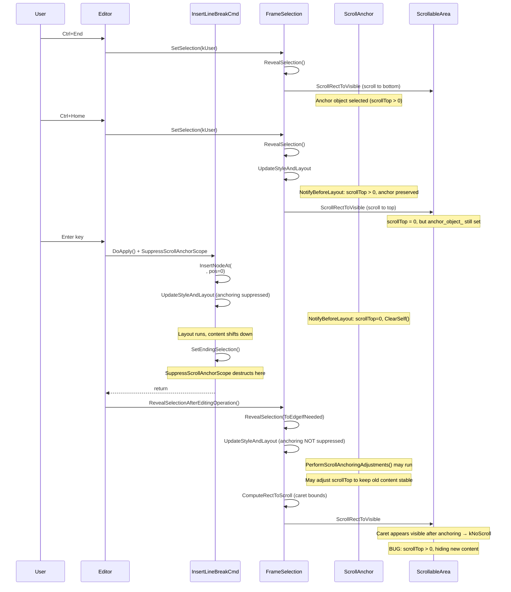

# Fix Assessment: 41397311

## Executive Summary
When pressing Enter at the top of a textarea after navigating via Ctrl+End then Ctrl+Home, newly inserted lines are hidden because the scroll position is incorrectly adjusted to preserve the view of old content rather than showing the new content. The root cause is in the scroll anchoring / reveal-selection interaction during line break insertion at the top of a scrolled-and-returned-to-top textarea. The recommended fix is to reset vertical scroll to 0 when inserting content at the very beginning of a text control, either in `InsertLineBreakCommand` and `ReplaceSelectionCommand` (as attempted in WIP CL 7226483), or more robustly in `RevealSelectionAfterEditingOperation`.

## Bug Analysis

### Problem Statement
When a textarea has enough content to require scrolling, navigating to the bottom (Ctrl+End) and back to the top (Ctrl+Home), then pressing Enter to add new lines causes the newly inserted lines to be hidden above the visible area. The vertical scroll position is adjusted to conceal the added line, making it appear as if nothing happened despite content being added.

### Expected Behavior
When pressing Enter at the top line of a textarea, a new blank line should appear at the top of the textarea and be visible on screen. The cursor and newly inserted content should remain visible, with scrollTop staying at or near 0.

### Actual Behavior
A new line is added at the top of the text, but the scroll position is updated to hide the new line above the visible area. The text appears not to move, and the only visual indication that lines were added is the scrollbar thumb position changing. This also happens when pasting content with newlines at the top.

### Triggering Conditions
1. A `<textarea>` element with enough text to require vertical scrolling
2. Press Ctrl+End to scroll to the bottom (this sets up scroll anchoring state)
3. Press Ctrl+Home to return to the top (scrollTop becomes 0, but scroll anchor state may persist)
4. Press Enter or paste text with newlines (content is inserted at position 0)
5. The scroll position adjusts incorrectly, hiding the newly inserted content

## Root Cause Analysis

### Code Investigation
The investigation traced the code path from key press → editing command → scroll reveal:

1. **Key handling** → `Editor::InsertLineBreak()` or `Editor::InsertParagraphSeparator()`
2. **DOM modification** → `InsertLineBreakCommand::DoApply()` inserts a `<br>` element at the cursor position
3. **Layout** → `Document::UpdateStyleAndLayout()` triggers layout, scroll anchoring adjustments
4. **Selection update** → `TypingCommand::TypingAddedToOpenCommand()` → `AppliedEditing()` → `ChangeSelectionAfterCommand()`
5. **Scroll reveal** → `Editor::RevealSelectionAfterEditingOperation(ToEdgeIfNeeded())` → `FrameSelection::RevealSelection()` → `ScrollRectToVisible()`

Comment #6 on the bug (from yo...@chromium.org) identifies the key code path:
> Scroll to reveal selection is implemented in `FrameSelection::RevealSelection()`, actual scroll is done by `LayoutObject::ScrollRectToVisible()` with passing `FrameSelection::ComputeRectToScroll()`.

The textarea element has `overflow: auto` (set by `StyleAdjuster` at [/third_party/blink/renderer/core/css/resolver/style_adjuster.cc#L598](/third_party/blink/renderer/core/css/resolver/style_adjuster.cc#L598)), making it a scroll container with a `PaintLayerScrollableArea`.

### Key Files Identified
- [/third_party/blink/renderer/core/editing/commands/insert_line_break_command.cc#L78](/third_party/blink/renderer/core/editing/commands/insert_line_break_command.cc#L78) - `InsertLineBreakCommand::DoApply()` - inserts the BR element and triggers layout
- [/third_party/blink/renderer/core/editing/editor.cc#L572](/third_party/blink/renderer/core/editing/editor.cc#L572) - `Editor::InsertLineBreak()` - calls `RevealSelectionAfterEditingOperation`
- [/third_party/blink/renderer/core/editing/editor.cc#L731](/third_party/blink/renderer/core/editing/editor.cc#L731) - `Editor::RevealSelectionAfterEditingOperation()` - triggers scroll reveal
- [/third_party/blink/renderer/core/editing/frame_selection.cc#L1246](/third_party/blink/renderer/core/editing/frame_selection.cc#L1246) - `FrameSelection::RevealSelection()` - computes caret rect and scrolls
- [/third_party/blink/renderer/core/editing/frame_selection.cc#L1231](/third_party/blink/renderer/core/editing/frame_selection.cc#L1231) - `FrameSelection::ComputeRectToScroll()` - computes the rectangle to reveal
- [/third_party/blink/renderer/core/scroll/scroll_into_view_util.cc#L635](/third_party/blink/renderer/core/scroll/scroll_into_view_util.cc#L635) - `GetScrollOffsetToExpose()` - computes target scroll offset
- [/third_party/blink/renderer/core/paint/paint_layer_scrollable_area.cc#L2547](/third_party/blink/renderer/core/paint/paint_layer_scrollable_area.cc#L2547) - `PaintLayerScrollableArea::ScrollIntoView()` - performs the actual scroll
- [/third_party/blink/renderer/core/layout/scroll_anchor.cc#L614](/third_party/blink/renderer/core/layout/scroll_anchor.cc#L614) - `ScrollAnchor::NotifyBeforeLayout()` - scroll anchoring before layout
- [/third_party/blink/renderer/core/layout/scroll_anchor.cc#L712](/third_party/blink/renderer/core/layout/scroll_anchor.cc#L712) - `ScrollAnchor::Adjust()` - scroll anchoring adjustment after layout
- [/third_party/blink/renderer/core/dom/document.cc#L3098](/third_party/blink/renderer/core/dom/document.cc#L3098) - `PerformScrollAnchoringAdjustments()` called after layout in `UpdateStyleAndLayout`
- [/third_party/blink/renderer/core/css/resolver/style_adjuster.cc#L598](/third_party/blink/renderer/core/css/resolver/style_adjuster.cc#L598) - Textarea `overflow: visible → auto` adjustment
- [/third_party/blink/renderer/core/editing/commands/composite_edit_command.cc#L2158](/third_party/blink/renderer/core/editing/commands/composite_edit_command.cc#L2158) - `AppliedEditing()` - dispatches events and updates selection
- [/third_party/blink/renderer/core/editing/commands/replace_selection_command.cc](/third_party/blink/renderer/core/editing/commands/replace_selection_command.cc) - Handles paste operations (also affected)
- [/third_party/blink/renderer/core/editing/commands/typing_command.cc#L574](/third_party/blink/renderer/core/editing/commands/typing_command.cc#L574) - `TypingCommand::DoApply()` - creates `SuppressScrollAnchorScope` at line 592
- [/third_party/blink/renderer/core/editing/commands/typing_command.cc#L500](/third_party/blink/renderer/core/editing/commands/typing_command.cc#L500) - `TypingCommand::InsertLineBreak(Document&)` - static entry point; for open commands, calls `InsertLineBreak()` directly (NO `SuppressScrollAnchorScope`)
- [/third_party/blink/renderer/core/editing/commands/typing_command.cc#L653](/third_party/blink/renderer/core/editing/commands/typing_command.cc#L653) - `TypingAddedToOpenCommand()` - calls `AppliedEditing()` which sets selection with `kSystem`
- [/third_party/blink/renderer/core/editing/commands/editing_commands_utilities.cc#L673](/third_party/blink/renderer/core/editing/commands/editing_commands_utilities.cc#L673) - `ChangeSelectionAfterCommand()` - sets selection with default `SetSelectionBy::kSystem`, does NOT trigger RevealSelection
- [/third_party/blink/renderer/core/editing/commands/move_commands.cc#L113](/third_party/blink/renderer/core/editing/commands/move_commands.cc#L113) - `MoveCommands::MoveSelection()` - handles Ctrl+Home/End, uses `SetSelectionBy::kUser` and `CursorAlignOnScroll::kAlways`
- [/third_party/blink/renderer/core/editing/set_selection_options.h#L15](/third_party/blink/renderer/core/editing/set_selection_options.h#L15) - `SetSelectionBy::kSystem` (default) vs `kUser` - only `kUser` triggers RevealSelection in `DidSetSelectionDeprecated`
- [/third_party/blink/renderer/core/editing/frame_selection.cc#L345](/third_party/blink/renderer/core/editing/frame_selection.cc#L345) - `DidSetSelectionDeprecated` - only calls `RevealSelection` when `set_selection_by == kUser`
- [/third_party/blink/renderer/core/scroll/scroll_alignment.cc#L61](/third_party/blink/renderer/core/scroll/scroll_alignment.cc#L61) - `ToEdgeIfNeeded()` = `(kNoScroll, kClosestEdge, kClosestEdge)` used for post-edit reveal
- [/third_party/blink/renderer/core/scroll/scroll_alignment.cc#L81](/third_party/blink/renderer/core/scroll/scroll_alignment.cc#L81) - `TopAlways()` = `(kTop, kTop, kTop)` used by Ctrl+Home via MoveSelection with `kAlways`
- [/third_party/blink/renderer/core/input/event_handler.cc#L2493](/third_party/blink/renderer/core/input/event_handler.cc#L2493) - `HandleTextInputEvent()` - dispatches TextEvent for Enter key
- [/third_party/blink/renderer/core/html/forms/text_control_element.cc#L859](/third_party/blink/renderer/core/html/forms/text_control_element.cc#L859) - `TextControlElement::SelectionChanged()` - textarea selection change notification
- [/third_party/blink/renderer/core/layout/scroll_anchor.h#L211](/third_party/blink/renderer/core/layout/scroll_anchor.h#L211) - `SuppressScrollAnchorScope` class definition

### Root Cause
**Location**: The interaction between scroll anchoring ([/third_party/blink/renderer/core/layout/scroll_anchor.cc](/third_party/blink/renderer/core/layout/scroll_anchor.cc)) and reveal-selection ([/third_party/blink/renderer/core/editing/frame_selection.cc#L1246](/third_party/blink/renderer/core/editing/frame_selection.cc#L1246)) during content insertion at the top of a textarea.

**Function**: The interplay between `ScrollAnchor::Adjust()`, `RevealSelectionAfterEditingOperation()`, and `InsertLineBreakCommand::DoApply()`.

**Issue**: The detailed code path when Enter is pressed in a textarea is:

1. **Enter keypress** → `EventHandler::HandleTextInputEvent("\n", event, kTextEventInputLineBreak)` → `Editor::HandleTextEvent()` at [/third_party/blink/renderer/core/editing/editor.cc#L169](/third_party/blink/renderer/core/editing/editor.cc#L169) → `Editor::InsertLineBreak()` at line 203 (since `event->IsLineBreak()` is true for textarea).

2. **`Editor::InsertLineBreak()`** at [/third_party/blink/renderer/core/editing/editor.cc#L572](/third_party/blink/renderer/core/editing/editor.cc#L572):
   - Calls `TypingCommand::InsertLineBreak(doc)` at line 579
   - Then calls `RevealSelectionAfterEditingOperation(ScrollAlignment::ToEdgeIfNeeded())` at line 581

3. **`TypingCommand::InsertLineBreak(doc)`** at [/third_party/blink/renderer/core/editing/commands/typing_command.cc#L500](/third_party/blink/renderer/core/editing/commands/typing_command.cc#L500): If no open typing command exists (Ctrl+Home closes it), creates a new TypingCommand and calls `Apply()` → `DoApply()`.

4. **`TypingCommand::DoApply()`** at [/third_party/blink/renderer/core/editing/commands/typing_command.cc#L574](/third_party/blink/renderer/core/editing/commands/typing_command.cc#L574):
   - Creates `SuppressScrollAnchorScope` at line 592 (suppresses scroll anchoring for the textarea's scrollable area)
   - Calls `InsertLineBreak(editing_state)` at line 605 → `InsertLineBreakCommand::DoApply()` which inserts `<br>` and calls `UpdateStyleAndLayout` multiple times (lines 82, 112, 151)
   - Calls `TypingAddedToOpenCommand(kInsertLineBreak)` → `AppliedEditing()` → `ChangeSelectionAfterCommand()` which sets selection with `SetSelectionBy::kSystem` (default, NOT `kUser`)
   - Since `kSystem`, `DidSetSelectionDeprecated()` at [/third_party/blink/renderer/core/editing/frame_selection.cc#L345](/third_party/blink/renderer/core/editing/frame_selection.cc#L345) does NOT call `RevealSelection`
   - **`SuppressScrollAnchorScope` destructs here** — scroll anchoring is re-enabled

5. **Back in `Editor::InsertLineBreak()`**: Calls `RevealSelectionAfterEditingOperation(ToEdgeIfNeeded())` → `RevealSelection(ToEdgeIfNeeded(), kDoNotRevealExtent)` at [/third_party/blink/renderer/core/editing/frame_selection.cc#L1246](/third_party/blink/renderer/core/editing/frame_selection.cc#L1246):
   - Calls `GetDocument().UpdateStyleAndLayout(kSelection)` at line 1254
   - **This `UpdateStyleAndLayout` call triggers `PerformScrollAnchoringAdjustments()`** at [/third_party/blink/renderer/core/dom/document.cc#L3098](/third_party/blink/renderer/core/dom/document.cc#L3098), which is OUTSIDE the `SuppressScrollAnchorScope`
   - Scroll anchoring may adjust the textarea's scroll position to keep previously-visible content stable
   - Then `ComputeRectToScroll(kDoNotRevealExtent)` → `AbsoluteCaretBounds()` returns the caret's absolute position
   - `ScrollRectToVisible()` checks if the caret is visible after anchoring adjustment and finds it IS visible → `kNoScroll`
   - Result: The scroll position has been adjusted by anchoring but not corrected by RevealSelection

The **critical timing gap** is between step 4 (`SuppressScrollAnchorScope` destructs) and step 5 (`UpdateStyleAndLayout` with scroll anchoring enabled). During this gap, the scroll anchoring mechanism is free to adjust the scroll position. While `ScrollAnchor::NotifyBeforeLayout` at [/third_party/blink/renderer/core/layout/scroll_anchor.cc#L626](/third_party/blink/renderer/core/layout/scroll_anchor.cc#L626) should clear the anchor when `scrollTop == 0`, the multiple layout passes during the insertion process may create intermediate states where the scroll position is non-zero, allowing anchor objects to be established.

Additionally, note that for **subsequent Enter presses** (when the typing command is still open), the flow at [/third_party/blink/renderer/core/editing/commands/typing_command.cc#L501](/third_party/blink/renderer/core/editing/commands/typing_command.cc#L501) calls `InsertLineBreak()` directly on the open command — this path does **not** go through `DoApply()` and therefore does **not** create a `SuppressScrollAnchorScope` at all, making the problem worse for consecutive Enter presses.

The WIP CL 7226483 confirms that after the insertion, the textarea's `scrollOffset.y()` is > 0 when it should be 0, definitively proving that something in the insertion/layout/scroll-reveal pipeline incorrectly adjusts the scroll position.

#### Key Scroll Alignment Details
- `ScrollAlignment::ToEdgeIfNeeded()` = `(kNoScroll, kClosestEdge, kClosestEdge)` where `rect_visible=kNoScroll` — if the caret is already visible in the scrollport, NO scroll adjustment happens
- `ScrollAlignment::TopAlways()` = `(kTop, kTop, kTop)` — always scrolls caret to the top, used by Ctrl+Home via `MoveSelection` with `CursorAlignOnScroll::kAlways`
- After scroll anchoring adjusts the position, the caret may appear "visible" within the adjusted viewport, so `ToEdgeIfNeeded` returns `kNoScroll`, leaving the incorrect scroll position in place

### Code Flow Diagram


## Fix Options

### Option 1: Reset scroll position in InsertLineBreakCommand (WIP CL approach) ⭐ RECOMMENDED
- **Description**: After inserting a line break at the beginning of a text control, explicitly reset the vertical scroll offset to 0. Also apply the same fix in `ReplaceSelectionCommand` for paste operations. This is the approach taken in WIP CL 7226483.
- **Files to modify**: 
  - [/third_party/blink/renderer/core/editing/commands/insert_line_break_command.cc#L147](/third_party/blink/renderer/core/editing/commands/insert_line_break_command.cc#L147)
  - [/third_party/blink/renderer/core/editing/commands/replace_selection_command.cc](/third_party/blink/renderer/core/editing/commands/replace_selection_command.cc)
- **Complexity**: Low
- **Risk**: Low - Only affects the specific case of inserting at the beginning of a text control while scrolled. The check `if (current_offset.y() > 0)` prevents unnecessary scrolling. However, the WIP CL has some issues: (1) it gets the scrollable area from the textarea element's LayoutBox, but the actual scroll container may be different; (2) it uses `ScrollType::kProgrammatic` with `ScrollSourceType::kNone` which might not trigger proper scroll event dispatching; (3) it only handles the exact offset 0 case, not insertion near the top.
- **Pros**: Simple, targeted fix; directly addresses the symptom; covers both Enter and paste operations
- **Cons**: Treats the symptom rather than the root cause; uses hardcoded scroll-to-0 logic; may need adjustment for the correct scrollable area (inner editor vs textarea); doesn't handle InsertParagraphSeparator path separately

### Option 2: Fix scroll anchoring to clear state when scroll position changes programmatically
- **Description**: Modify `ScrollAnchor` to clear its anchor object when `RevealSelection` programmatically scrolls to a new position (especially to scrollTop = 0). This would prevent stale anchor state from affecting subsequent layout passes.
- **Files to modify**: 
  - [/third_party/blink/renderer/core/layout/scroll_anchor.cc](/third_party/blink/renderer/core/layout/scroll_anchor.cc)
  - [/third_party/blink/renderer/core/paint/paint_layer_scrollable_area.cc](/third_party/blink/renderer/core/paint/paint_layer_scrollable_area.cc)
- **Complexity**: Medium
- **Risk**: Medium - Scroll anchoring is a complex mechanism that affects many web pages. Changes to its state management could have unintended side effects on scroll behavior across the web.
- **Pros**: Addresses a potential root cause; prevents the stale anchor state from affecting any subsequent operation
- **Cons**: Higher risk of regression; scroll anchoring is used broadly; may be difficult to test all edge cases

### Option 3: Fix RevealSelectionAfterEditingOperation to account for content insertion above caret
- **Description**: Modify `RevealSelectionAfterEditingOperation` or `RevealSelection` to detect when content was inserted above the caret position in a text control and adjust the scroll behavior accordingly. Instead of scrolling to reveal the caret using `ToEdgeIfNeeded`, force scroll to show the insertion point at the top when inserting at the beginning.
- **Files to modify**: 
  - [/third_party/blink/renderer/core/editing/editor.cc#L731](/third_party/blink/renderer/core/editing/editor.cc#L731) - `RevealSelectionAfterEditingOperation`
  - [/third_party/blink/renderer/core/editing/frame_selection.cc#L1246](/third_party/blink/renderer/core/editing/frame_selection.cc#L1246) - `RevealSelection`
- **Complexity**: Medium
- **Risk**: Medium - Changing reveal-selection behavior could affect scroll behavior for all editing operations
- **Pros**: More general fix that addresses the core interaction between editing and scrolling
- **Cons**: More complex; risk of affecting other editing scenarios; harder to test

### Option 4: Suppress scroll anchoring during editing commands (extend SuppressScrollAnchorScope)
- **Description**: Extend the `SuppressScrollAnchorScope` from `TypingCommand::DoApply()` to cover the entire editing operation in `Editor::InsertLineBreak()`, `Editor::InsertParagraphSeparator()`, and `Editor::InsertText()`. This ensures scroll anchoring cannot interfere with the post-edit `RevealSelectionAfterEditingOperation` call. Currently, `SuppressScrollAnchorScope` ends when `DoApply()` returns, but `RevealSelectionAfterEditingOperation` is called afterward in `Editor::InsertLineBreak()`, creating a timing gap. The fix would be to create `SuppressScrollAnchorScope` in these `Editor::*` methods, encompassing both the typing command and the reveal call. This also addresses the case of **subsequent Enter presses** where the typing command is still open and `DoApply()` is not called (so no `SuppressScrollAnchorScope` is created at all, as shown at [/third_party/blink/renderer/core/editing/commands/typing_command.cc#L501](/third_party/blink/renderer/core/editing/commands/typing_command.cc#L501)).
- **Files to modify**: 
  - [/third_party/blink/renderer/core/editing/editor.cc#L572](/third_party/blink/renderer/core/editing/editor.cc#L572) - `Editor::InsertLineBreak()`
  - [/third_party/blink/renderer/core/editing/editor.cc#L586](/third_party/blink/renderer/core/editing/editor.cc#L586) - `Editor::InsertParagraphSeparator()`
  - [/third_party/blink/renderer/core/editing/editor.cc#L535](/third_party/blink/renderer/core/editing/editor.cc#L535) - `Editor::InsertText()` (for paste)
  - [/third_party/blink/renderer/core/editing/editor.cc](/third_party/blink/renderer/core/editing/editor.cc) - Add `#include "third_party/blink/renderer/core/layout/scroll_anchor.h"`
- **Complexity**: Low-Medium
- **Risk**: Low - The `suppress_adjustment_count_` mechanism already exists and is designed for exactly this kind of use case. The change follows the existing pattern in `TypingCommand::DoApply()` and simply extends the scope lifetime.
- **Pros**: Clean separation between editing scroll behavior and scroll anchoring; uses existing mechanism; covers all editing operations including the "open command" case; no special-case logic needed
- **Cons**: May be slightly too broad if it suppresses anchoring for all editing commands, not just top-of-textarea inserts; however, the scope only applies to the specific scrollable area containing the editing anchor

## Recommended Approach
**Option 1** (Reset scroll position in InsertLineBreakCommand) is recommended as the most pragmatic immediate approach, with improvements over the WIP CL 7226483:

1. The WIP CL approach is essentially correct but needs refinement:
   - Ensure the correct scrollable area is used (the textarea's own PaintLayerScrollableArea, which IS the scroll container since `overflow: auto` is set on the textarea via StyleAdjuster)
   - Use proper scroll type/source for event dispatching
   - Consider adding the same fix in `InsertParagraphSeparatorCommand` for consistency

2. This is the lowest-risk option because it only adds behavior in the specific case that triggers the bug (inserting at position 0 of a text control) and doesn't modify any core scrolling or anchoring infrastructure.

3. If Option 1 proves insufficient or too narrow, **Option 4 (extending `SuppressScrollAnchorScope` to cover the full editing operation including `RevealSelectionAfterEditingOperation`)** would be the preferred comprehensive approach. This addresses the root cause (the timing gap between `SuppressScrollAnchorScope` ending in `DoApply()` and `UpdateStyleAndLayout` being called in `RevealSelection`) and also handles the case of consecutive Enter presses where `DoApply()` is not called at all. The implementation would look like:

```cpp
bool Editor::InsertLineBreak() {
  if (!CanEdit())
    return false;

  // Suppress scroll anchoring for the entire editing operation including
  // the subsequent RevealSelection call, to prevent scroll anchoring from
  // adjusting the scroll position and hiding newly inserted content.
  ScrollableArea* scrollable_area = nullptr;
  if (const auto& selection = GetFrameSelection().GetSelectionInDOMTree();
      !selection.IsNone()) {
    Node* anchor_node = selection.Anchor().ComputeContainerNode();
    if (anchor_node && anchor_node->GetLayoutObject()) {
      if (const LayoutBox* scroll_container =
              anchor_node->GetLayoutObject()->ContainingScrollContainer()) {
        scrollable_area = scroll_container->GetScrollableArea();
      }
    }
  }
  SuppressScrollAnchorScope suppress_scope(scrollable_area);

  VisiblePosition caret = ...;
  if (!TypingCommand::InsertLineBreak(*GetFrame().GetDocument()))
    return false;
  RevealSelectionAfterEditingOperation(ScrollAlignment::ToEdgeIfNeeded());
  return true;
}
```

## Testing Strategy
- **Unit tests needed**: Add a web test that creates a textarea with scrollable content, executes Ctrl+End, Ctrl+Home, then programmatically types Enter, and verifies that scrollTop remains 0 and the new line is visible
- **Web tests needed**: 
  - `editing/input/textarea-insert-at-top-after-scroll.html` - Tests Enter key at the top of a scrolled-and-returned textarea
  - `editing/input/textarea-paste-at-top-after-scroll.html` - Tests pasting at the top of a scrolled-and-returned textarea
  - Verify existing `editing/selection/` tests pass (especially any scroll-related selection tests)
- **Manual verification**: 
  1. Open a textarea with enough text to scroll
  2. Press Ctrl+End to scroll to bottom
  3. Press Ctrl+Home to return to top
  4. Press Enter multiple times → verify new blank lines appear at the top and are visible
  5. Select some text, copy, then Ctrl+End, Ctrl+Home, Ctrl+V → verify pasted text is visible
  6. Test in Gmail compose window (as mentioned in the original bug report)

## Related Code References
- WIP CL: [CL 7226483](https://chromium-review.googlesource.com/c/chromium/src/+/7226483) - Tanu Jain's work-in-progress fix
- Bug report comment #6 identifies `FrameSelection::RevealSelection()` and `ScrollRectToVisible()` as key functions
- Scroll anchoring spec: [CSS Scroll Anchoring Module Level 1](https://www.w3.org/TR/css-scroll-anchoring-1/)
- Related bugs: [crbug.com/40692387](https://issues.chromium.org/issues/40692387) (page scrolls up when selecting content within textarea)
- Test examples: `third_party/blink/web_tests/editing/input/reveal-caret-of-transformed-multiline-input.html`
