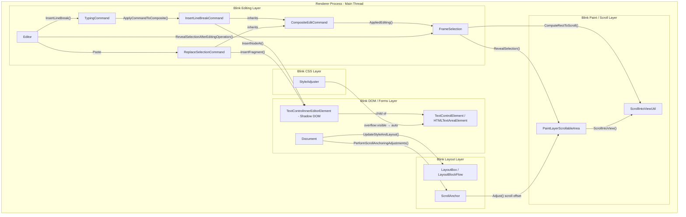
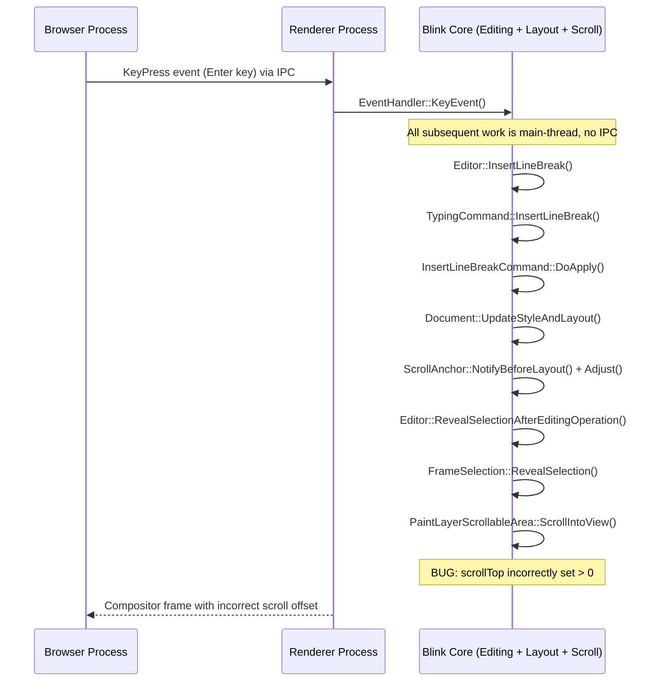
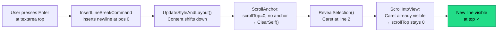
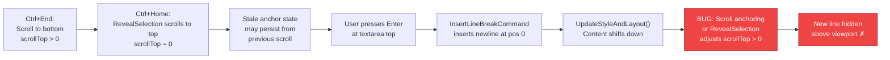
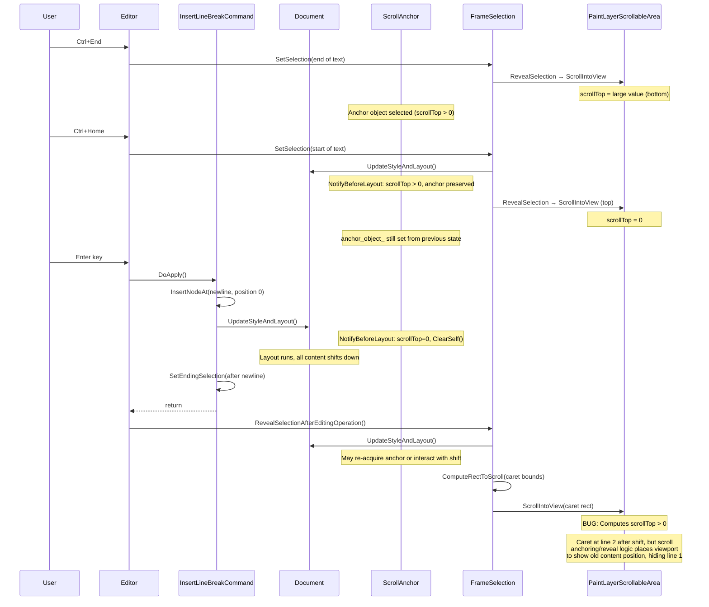

# High-Level Design: 41397311

## 1. Executive Summary

This bug occurs in the **Blink Editing/Selection** subsystem of the Chromium renderer process. When a user inserts new lines (Enter key or paste) at the top of a `<textarea>` that has been scrolled to the bottom and back to the top, the newly inserted content is hidden above the visible area. The root cause lies in the interaction between three subsystems: the **editing command pipeline** (InsertLineBreakCommand), the **scroll anchoring mechanism** (ScrollAnchor), and the **reveal-selection logic** (FrameSelection::RevealSelection). After content insertion shifts all text downward, the scroll position is incorrectly adjusted to maintain the old viewport position rather than showing the newly inserted content at the top.

## 2. System Context

### 2.1 Overview

The textarea editing feature sits entirely within the **Blink Renderer** inside the Chromium Renderer Process. No Browser Process involvement is needed for this specific flow—key input, DOM editing, layout, and scrolling all happen within a single renderer process on the main thread. The textarea element uses a shadow DOM (`TextControlInnerEditorElement`) as its inner editor, and the `StyleAdjuster` forces `overflow: auto` on the textarea, making it a scrollable area managed by `PaintLayerScrollableArea`.

The relevant subsystems are:
- **Blink Editing** (`third_party/blink/renderer/core/editing/`) — Handles editing commands (insert line break, replace selection), selection management, and reveal-selection scrolling.
- **Blink Layout** (`third_party/blink/renderer/core/layout/`) — Performs layout calculations and manages scroll anchoring.
- **Blink Scroll** (`third_party/blink/renderer/core/scroll/`) — Contains scroll-into-view utilities.
- **Blink Paint** (`third_party/blink/renderer/core/paint/`) — `PaintLayerScrollableArea` owns the scroll anchor and performs actual scrolling.

### 2.2 Related Specs
- [HTML Living Standard — The textarea element](https://html.spec.whatwg.org/multipage/form-elements.html#the-textarea-element)
- [CSS Scroll Anchoring Module Level 1](https://www.w3.org/TR/css-scroll-anchoring-1/)
- [CSS Overflow Module Level 3](https://www.w3.org/TR/css-overflow-3/)
- WIP CL: [CL 7226483](https://chromium-review.googlesource.com/c/chromium/src/+/7226483) — Work-in-progress fix by Tanu Jain

## 3. Component Architecture

### 3.1 Major Components

| Component | Location | Responsibility |
|-----------|----------|----------------|
| `Editor` | `/third_party/blink/renderer/core/editing/editor.cc` | Orchestrates high-level editing operations (InsertLineBreak, InsertParagraphSeparator); triggers RevealSelectionAfterEditingOperation after edits |
| `TypingCommand` | `/third_party/blink/renderer/core/editing/commands/typing_command.cc` | Groups keystrokes into composite commands; delegates to InsertLineBreakCommand |
| `InsertLineBreakCommand` | `/third_party/blink/renderer/core/editing/commands/insert_line_break_command.cc` | Inserts `\n` text node (textarea) or ` ` element (rich text) into the DOM; calls UpdateStyleAndLayout multiple times |
| `ReplaceSelectionCommand` | `/third_party/blink/renderer/core/editing/commands/replace_selection_command.cc` | Handles paste operations; inserts clipboard fragment into DOM |
| `CompositeEditCommand` | `/third_party/blink/renderer/core/editing/commands/composite_edit_command.cc` | Base class for edit commands; `AppliedEditing()` dispatches events and updates selection |
| `FrameSelection` | `/third_party/blink/renderer/core/editing/frame_selection.cc` | Manages document selection; `RevealSelection()` scrolls to make the selection visible; `ComputeRectToScroll()` computes the caret/selection rectangle |
| `ScrollAnchor` | `/third_party/blink/renderer/core/layout/scroll_anchor.cc` | Implements CSS Scroll Anchoring; `NotifyBeforeLayout()` records anchor state; `Adjust()` adjusts scroll position after layout to prevent content shifts |
| `PaintLayerScrollableArea` | `/third_party/blink/renderer/core/paint/paint_layer_scrollable_area.cc` | Owns the scroll anchor for each scrollable area; `ScrollIntoView()` performs the actual scroll; computes scroll offsets via `GetScrollOffsetToExpose()` |
| `ScrollIntoViewUtil` | `/third_party/blink/renderer/core/scroll/scroll_into_view_util.cc` | Utility functions for computing the scroll offset needed to expose a given rectangle |
| `StyleAdjuster` | `/third_party/blink/renderer/core/css/resolver/style_adjuster.cc` | Forces `overflow: visible → auto` on textarea elements, making them scrollable areas |
| `Document` | `/third_party/blink/renderer/core/dom/document.cc` | `UpdateStyleAndLayout()` triggers style recalculation, layout, and `PerformScrollAnchoringAdjustments()` |
| `TextControlElement` | `/third_party/blink/renderer/core/html/forms/text_control_element.h` | Base class for textarea/input; owns the inner editor shadow DOM element; provides selection and value APIs |

### 3.2 Component Diagram

## 4. Process Architecture

### 4.1 Process Boundaries

This bug is entirely contained within the **Renderer Process**. No IPC to the Browser Process is involved in the critical path.

| Process | Role | Involvement |
|---------|------|-------------|
| **Browser Process** | Dispatches input events to renderer | Forwards key events (Enter, Ctrl+Home, Ctrl+End) via IPC; not involved in the bug |
| **Renderer Process** | Executes all editing, layout, scroll logic | All buggy behavior occurs here on the main thread |

The textarea's editing, layout, scroll anchoring, and scroll adjustment all run synchronously on the renderer's main thread within a single call stack triggered by the keypress event.

### 4.2 IPC Flow

## 5. Data Flow

### 5.1 Normal Flow (Expected)

When inserting a line break at the top of a textarea that has **not** been previously scrolled via Ctrl+End, the scroll position stays at 0 and new content is visible.

### 5.2 Buggy Flow (Current)

When inserting a line break at the top after Ctrl+End → Ctrl+Home, stale scroll anchor state causes the scroll position to be adjusted incorrectly.

### 5.3 Detailed Buggy Sequence

## 6. Key Interfaces

### 6.1 Public APIs

- `Editor::InsertLineBreak()` — Entry point for Enter key in editable content; returns `bool` indicating success.
- `Editor::RevealSelectionAfterEditingOperation(const mojom::blink::ScrollAlignment&)` — Scrolls to make the post-edit selection visible; called after every editing operation.
- `FrameSelection::RevealSelection(const mojom::blink::ScrollAlignment&, RevealExtentOption)` — Computes caret/selection rect and scrolls the appropriate scrollable area to make it visible.
- `TextControlElement::SetValue(const String&, TextFieldEventBehavior, TextControlSetValueSelection)` — Sets the textarea's text value programmatically.

### 6.2 Internal Interfaces

- `InsertLineBreakCommand::DoApply(EditingState*)` — Inserts a `\n` text node (textarea) or ` ` (rich text) into the DOM; triggers multiple `UpdateStyleAndLayout()` calls.
- `CompositeEditCommand::AppliedEditing()` — Post-edit hook that dispatches `input` events and calls `ChangeSelectionAfterCommand()`.
- `FrameSelection::ComputeRectToScroll(RevealExtentOption)` — Returns the `PhysicalRect` of the caret or selection for scrolling purposes.
- `ScrollAnchor::NotifyBeforeLayout()` — Called before layout; selects or clears the anchor object based on current scroll position.
- `ScrollAnchor::Adjust()` — Called after layout; computes scroll adjustment to counteract content shifts relative to the anchor object.
- `PaintLayerScrollableArea::ScrollIntoView(const PhysicalRect&, const ScrollMargin&, const mojom::blink::ScrollIntoViewParams&)` — Performs the actual scroll by computing the target offset via `GetScrollOffsetToExpose()` and applying it.
- `Document::UpdateStyleAndLayout(DocumentUpdateReason)` — Triggers style recalc, layout, and post-layout operations including `PerformScrollAnchoringAdjustments()`.
- `scroll_into_view_util::GetScrollOffsetToExpose(...)` — Core utility that computes the new scroll offset required to expose a given rectangle within a scrollable area.

## 7. Threading Model

All operations in this bug's code path execute on the **renderer main thread**. There is no worker thread or cross-thread synchronization involved.

- **Main thread responsibilities**:
  - Key event handling (`EventHandler::KeyEvent`)
  - Editing command execution (`InsertLineBreakCommand::DoApply`)
  - DOM mutation (inserting text nodes / ` ` elements)
  - Style recalculation and layout (`Document::UpdateStyleAndLayout`)
  - Scroll anchoring (`ScrollAnchor::NotifyBeforeLayout`, `ScrollAnchor::Adjust`)
  - Reveal-selection scrolling (`FrameSelection::RevealSelection`, `PaintLayerScrollableArea::ScrollIntoView`)
  - Compositor frame preparation

- **Compositor thread**: Receives the final scroll offset and renders the frame, but is not involved in the scroll offset computation that causes the bug.

- **Synchronization**: The entire keypress → edit → layout → scroll pipeline runs synchronously in a single main-thread call stack. `UpdateStyleAndLayout()` is called multiple times during a single editing operation (once during `DoApply()` for DOM correctness, and again during `RevealSelection()` to ensure layout is up-to-date for scroll computation). Each call to `UpdateStyleAndLayout()` triggers `PerformScrollAnchoringAdjustments()`.

## 8. External Dependencies

### Other Chrome Components
- **Input handling** (`content/renderer/input/`): Routes key events from the browser process to Blink's `EventHandler`.
- **Compositor** (`cc/`): Receives scroll offsets from Blink and renders the final frame; not involved in the bug's root cause.
- **Platform clipboard** (`third_party/blink/renderer/core/clipboard/`): Provides paste content for `ReplaceSelectionCommand`; indirectly triggers the same bug path when pasting at the top.

### Platform APIs
- None directly involved. The bug is entirely within Blink's internal editing/layout/scroll subsystem.

### Third-party Libraries
- None directly involved.

### Web Platform Specs
- **CSS Scroll Anchoring** ([Level 1](https://www.w3.org/TR/css-scroll-anchoring-1/)): Defines the scroll anchoring behavior that `ScrollAnchor` implements. The spec is designed to prevent content from shifting unexpectedly during DOM mutations, but in this case it prevents the user from seeing newly inserted content.
- **HTML Editing** ([Editing APIs](https://html.spec.whatwg.org/multipage/interaction.html#editing)): Defines the contenteditable and input event model used by textarea's inner editor.

## 9. Impact of Fix

### 9.1 Components Affected

Based on the recommended fix approach (Option 1 from fix-assessment: reset scroll position in editing commands):

| Component | Change Type |
|-----------|-------------|
| `InsertLineBreakCommand` (`insert_line_break_command.cc`) | Add scroll reset logic after inserting at position 0 of a text control |
| `ReplaceSelectionCommand` (`replace_selection_command.cc`) | Add scroll reset logic after pasting at position 0 of a text control |

Alternative approaches (if Option 1 proves insufficient) would affect:
| Component | Change Type |
|-----------|-------------|
| `ScrollAnchor` (`scroll_anchor.cc`) | Clear stale anchor state when scroll is programmatically reset |
| `CompositeEditCommand` (`composite_edit_command.cc`) or `TypingCommand` (`typing_command.cc`) | Suppress scroll anchoring during editing command execution |

### 9.2 Risk Assessment
- **Scope**: Narrow — the fix targets only the specific case of inserting content at the beginning (position 0) of a scrollable text control. No changes to general scroll anchoring, layout, or editing infrastructure.
- **Risk Level**: Low — the fix adds a post-insertion scroll correction rather than modifying any existing scroll or layout logic. The condition (`inserting at position 0 of a text control` + `scrollTop > 0 after insertion`) is highly specific.
- **Testing Coverage**:
  - New web tests should cover: Enter at top after Ctrl+End→Ctrl+Home; paste at top after Ctrl+End→Ctrl+Home; multiple Enter presses; Enter at top without prior scrolling (regression check).
  - Existing `editing/selection/` and `editing/input/` web tests serve as regression guards for general editing/scroll behavior.
  - Manual testing: Reproduce the original bug steps (Ctrl+End, Ctrl+Home, Enter×4); verify in Gmail compose; verify paste with newlines at top.
