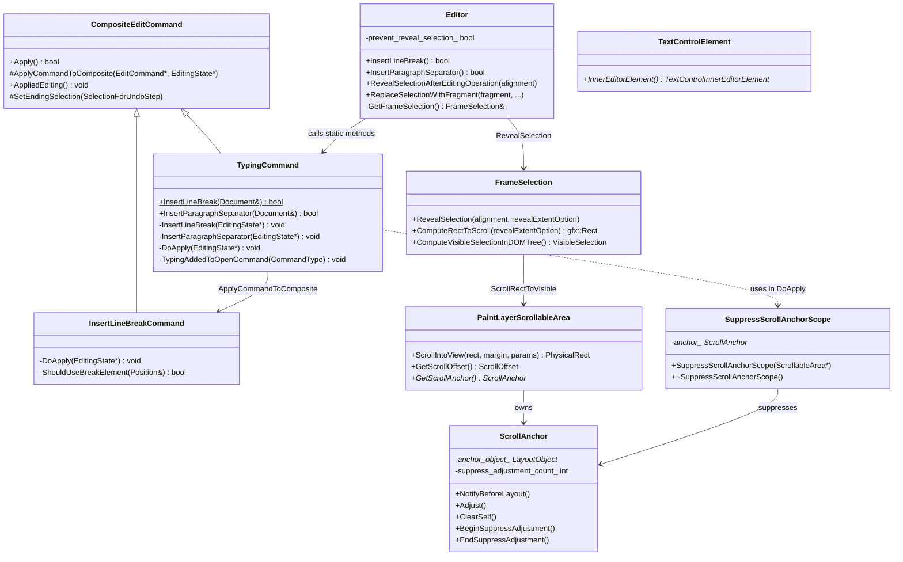
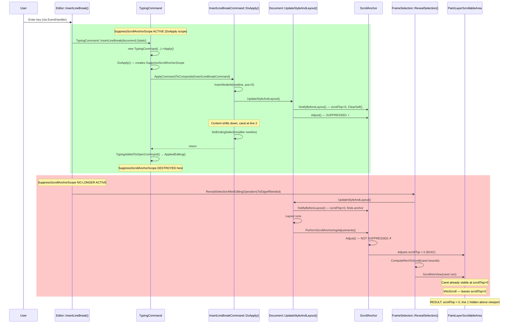

# Low-Level Design: 41397311

## 1. Files to Modify

| File | Type | Changes | Lines |
|------|------|---------|-------|
| [/third_party/blink/renderer/core/editing/editor.cc](/third_party/blink/renderer/core/editing/editor.cc) | Modify | Suppress scroll anchoring around `RevealSelectionAfterEditingOperation` in `InsertLineBreak()` and `InsertParagraphSeparator()` | ~12 |
| [/third_party/blink/renderer/core/editing/editor.cc](/third_party/blink/renderer/core/editing/editor.cc) | Modify | Add includes for scroll anchor suppression | ~3 |
| [/third_party/blink/renderer/core/editing/editor.h](/third_party/blink/renderer/core/editing/editor.h) | No change | No changes needed | 0 |
| [/third_party/blink/web_tests/editing/input/textarea-insert-at-top-after-scroll.html](/third_party/blink/web_tests/editing/input/textarea-insert-at-top-after-scroll.html) | Add | New web test for Enter key at top of scrolled textarea | ~50 |
| [/third_party/blink/web_tests/editing/input/textarea-paste-at-top-after-scroll.html](/third_party/blink/web_tests/editing/input/textarea-paste-at-top-after-scroll.html) | Add | New web test for paste at top of scrolled textarea | ~55 |

## 2. Class Hierarchy

### 2.1 Class Diagram



### 2.2 Class Responsibilities

- **Editor**: Orchestrates high-level editing operations; calls `RevealSelectionAfterEditingOperation()` after each edit command — **this is where the fix goes**
- **TypingCommand**: Groups keystrokes into composite commands; `DoApply()` already uses `SuppressScrollAnchorScope` but only covers the initial command execution, not the post-command reveal-selection
- **InsertLineBreakCommand**: Inserts `\n` (textarea) or `<br>` (rich text) into DOM; triggers multiple `UpdateStyleAndLayout()` calls
- **FrameSelection**: Manages selection; `RevealSelection()` calls `UpdateStyleAndLayout()` which triggers scroll anchoring adjustments, then scrolls to make selection visible
- **ScrollAnchor**: Implements CSS Scroll Anchoring; `Adjust()` modifies scroll position after layout to prevent content shifts — **this is what incorrectly shifts the viewport**
- **SuppressScrollAnchorScope**: RAII scope that suppresses `ScrollAnchor::Adjust()` via `suppress_adjustment_count_`
- **PaintLayerScrollableArea**: Owns the scroll anchor; performs actual scroll via `ScrollIntoView()`
- **TextControlElement**: Base for textarea/input; provides access to inner editor element

## 3. Method-Level Analysis

### 3.1 Call Chain (Bug Path)



### 3.2 Affected Methods

#### `Editor::InsertLineBreak()`
**Location**: [/third_party/blink/renderer/core/editing/editor.cc#L572](/third_party/blink/renderer/core/editing/editor.cc#L572)

**Current Implementation (Buggy)**:
```cpp
bool Editor::InsertLineBreak() {
  if (!CanEdit())
    return false;

  VisiblePosition caret =
      GetFrameSelection().ComputeVisibleSelectionInDOMTree().VisibleStart();
  DCHECK(GetFrame().GetDocument());
  if (!TypingCommand::InsertLineBreak(*GetFrame().GetDocument()))
    return false;
  RevealSelectionAfterEditingOperation(ScrollAlignment::ToEdgeIfNeeded());

  return true;
}
```

**Issues**:
1. `RevealSelectionAfterEditingOperation()` (line 581) calls `FrameSelection::RevealSelection()` which calls `Document::UpdateStyleAndLayout()`. This triggers `PerformScrollAnchoringAdjustments()` which calls `ScrollAnchor::Adjust()`.
2. At this point, the `SuppressScrollAnchorScope` from `TypingCommand::DoApply()` (line 592 of typing_command.cc) has already been destroyed because `TypingCommand::InsertLineBreak(Document&)` has returned.
3. `ScrollAnchor::Adjust()` computes a non-zero scroll adjustment to "preserve" the position of existing content relative to the viewport, hiding the newly inserted line above the visible area.
4. After `Adjust()` moves scrollTop > 0, `GetScrollOffsetToExpose()` determines the caret is already visible (`CalculateScrollAlignment` returns `kNoScroll`) and does not correct the scroll position.

#### `Editor::InsertParagraphSeparator()`
**Location**: [/third_party/blink/renderer/core/editing/editor.cc#L586](/third_party/blink/renderer/core/editing/editor.cc#L586)

**Current Implementation (Buggy)**:
```cpp
bool Editor::InsertParagraphSeparator() {
  if (!CanEdit())
    return false;

  if (!CanEditRichly())
    return InsertLineBreak();  // Delegates to InsertLineBreak for textarea

  // ... rich text path ...
  RevealSelectionAfterEditingOperation(ScrollAlignment::ToEdgeIfNeeded());
  return true;
}
```

**Issues**: Same as `InsertLineBreak` — the `RevealSelectionAfterEditingOperation` call at line 599 occurs after the `SuppressScrollAnchorScope` has been destroyed. For textareas (`!CanEditRichly()`), this delegates to `InsertLineBreak()` so the fix there covers it.

#### `Editor::ReplaceSelectionWithFragment()`
**Location**: [/third_party/blink/renderer/core/editing/editor.cc#L317](/third_party/blink/renderer/core/editing/editor.cc#L317)

**Current Implementation (Buggy)**:
```cpp
void Editor::ReplaceSelectionWithFragment(...) {
  // ...
  MakeGarbageCollected<ReplaceSelectionCommand>(...)
      ->Apply();
  RevealSelectionAfterEditingOperation();  // Line 345 — same bug
}
```

**Issues**: Same pattern — `ReplaceSelectionCommand::Apply()` finishes, then `RevealSelectionAfterEditingOperation()` runs without scroll anchor suppression. Note: `ReplaceSelectionCommand` does NOT go through `TypingCommand::DoApply()` so there is NO `SuppressScrollAnchorScope` at any point.

#### `TypingCommand::DoApply()` (Partial Fix Already Present)
**Location**: [/third_party/blink/renderer/core/editing/commands/typing_command.cc#L574](/third_party/blink/renderer/core/editing/commands/typing_command.cc#L574)

```cpp
void TypingCommand::DoApply(EditingState* editing_state) {
  // ...
  ScrollableArea* scrollable_area = nullptr;
  Node* anchor_node = EndingSelection().Anchor().ComputeContainerNode();
  if (anchor_node && anchor_node->GetLayoutObject()) {
    if (const LayoutBox* scroll_container =
            anchor_node->GetLayoutObject()->ContainingScrollContainer()) {
      scrollable_area = scroll_container->GetScrollableArea();
    }
  }
  SuppressScrollAnchorScope suppress_scope(scrollable_area);  // Line 592

  switch (command_type_) {
    case kInsertLineBreak:
      InsertLineBreak(editing_state);
      return;
    // ...
  }
}
```

**Key Finding**: The `SuppressScrollAnchorScope` on line 592 correctly suppresses scroll anchoring during the DOM mutation. However, its scope ends when `DoApply()` returns, which is BEFORE `RevealSelectionAfterEditingOperation()` is called in `Editor::InsertLineBreak()`.

#### `TypingCommand::InsertLineBreak(Document&)` (Reuse Path Issue)
**Location**: [/third_party/blink/renderer/core/editing/commands/typing_command.cc#L500](/third_party/blink/renderer/core/editing/commands/typing_command.cc#L500)

```cpp
bool TypingCommand::InsertLineBreak(Document& document) {
  if (TypingCommand* last_typing_command =
          LastTypingCommandIfStillOpenForTyping(document.GetFrame())) {
    // REUSE PATH: Calls instance method directly, does NOT go through DoApply()
    // so NO SuppressScrollAnchorScope is created at all!
    EditingState editing_state;
    EventQueueScope event_queue_scope;
    last_typing_command->input_type_ = InputEvent::InputType::kNone;
    last_typing_command->InsertLineBreak(&editing_state);
    return !editing_state.IsAborted();
  }

  return MakeGarbageCollected<TypingCommand>(document, kInsertLineBreak, "", 0)
      ->Apply();
}
```

**Key Finding**: When a TypingCommand is reused (2nd+ Enter press), `InsertLineBreak(&editing_state)` is called directly on the existing command, bypassing `DoApply()` entirely. There is NO `SuppressScrollAnchorScope` at all in this path.

#### `ScrollAnchor::NotifyBeforeLayout()`
**Location**: [/third_party/blink/renderer/core/layout/scroll_anchor.cc#L614](/third_party/blink/renderer/core/layout/scroll_anchor.cc#L614)

```cpp
void ScrollAnchor::NotifyBeforeLayout() {
  // ...
  ScrollOffset scroll_offset = scroller_->GetScrollOffset();
  float block_direction_scroll_offset =
      ScrollerLayoutBox(scroller_)->IsHorizontalWritingMode()
          ? scroll_offset.y()
          : scroll_offset.x();
  if (block_direction_scroll_offset == 0) {
    ClearSelf();  // Clears anchor when scrollTop is 0
    return;
  }
  if (!anchor_object_) {
    FindAnchor();  // Selects an anchor if scrollTop > 0
    // ...
  }
  // ...
}
```

**Key Insight**: When `UpdateStyleAndLayout()` is called during `RevealSelection()`, if `scrollTop == 0`, `NotifyBeforeLayout()` correctly clears the anchor. But if a previous `Adjust()` call (from an earlier `UpdateStyleAndLayout()` in the same editing operation or from stale state) has already set scrollTop > 0, then `NotifyBeforeLayout()` will find/preserve an anchor object and enqueue an adjustment.

#### `ScrollAnchor::Adjust()`
**Location**: [/third_party/blink/renderer/core/layout/scroll_anchor.cc#L712](/third_party/blink/renderer/core/layout/scroll_anchor.cc#L712)

```cpp
void ScrollAnchor::Adjust() {
  if (suppress_adjustment_count_ > 0) {  // ← SuppressScrollAnchorScope check
    return;
  }
  if (!queued_)
    return;
  queued_ = false;
  if (!anchor_object_)
    return;
  gfx::Vector2d adjustment = ComputeAdjustment();
  // ... applies adjustment to scroll offset
}
```

**Key**: When `suppress_adjustment_count_ > 0`, `Adjust()` returns immediately. The fix leverages this.

## 4. Fix Design

### 4.1 Root Cause Summary

The bug occurs because of a **gap in scroll anchor suppression**: `SuppressScrollAnchorScope` in `TypingCommand::DoApply()` covers only the DOM mutation phase, not the `RevealSelectionAfterEditingOperation()` phase that follows. When `RevealSelection()` calls `Document::UpdateStyleAndLayout()`, scroll anchoring `Adjust()` runs unsuppressed and shifts `scrollTop` to a non-zero value, hiding the newly inserted content above the viewport. The subsequent `ScrollRectToVisible` call sees the caret as already visible at the incorrect scroll position and does not correct it.

### 4.2 Fix Strategy

Extend the scroll anchor suppression to cover the `RevealSelectionAfterEditingOperation()` call in `Editor::InsertLineBreak()`, `Editor::InsertParagraphSeparator()`, and `Editor::ReplaceSelectionWithFragment()`. This uses the existing `SuppressScrollAnchorScope` mechanism already proven safe in `TypingCommand::DoApply()`.

### 4.3 Changes Required

#### File 1: [/third_party/blink/renderer/core/editing/editor.cc](/third_party/blink/renderer/core/editing/editor.cc)

**Add includes** (after existing includes, around line 30-60):
```cpp
#include "third_party/blink/renderer/core/layout/scroll_anchor.h"
#include "third_party/blink/renderer/core/paint/paint_layer_scrollable_area.h"
```

**Before** (lines 572-584):
```cpp
bool Editor::InsertLineBreak() {
  if (!CanEdit())
    return false;

  VisiblePosition caret =
      GetFrameSelection().ComputeVisibleSelectionInDOMTree().VisibleStart();
  DCHECK(GetFrame().GetDocument());
  if (!TypingCommand::InsertLineBreak(*GetFrame().GetDocument()))
    return false;
  RevealSelectionAfterEditingOperation(ScrollAlignment::ToEdgeIfNeeded());

  return true;
}
```

**After**:
```cpp
bool Editor::InsertLineBreak() {
  if (!CanEdit())
    return false;

  VisiblePosition caret =
      GetFrameSelection().ComputeVisibleSelectionInDOMTree().VisibleStart();
  DCHECK(GetFrame().GetDocument());
  if (!TypingCommand::InsertLineBreak(*GetFrame().GetDocument()))
    return false;

  // Suppress scroll anchoring during reveal-selection to prevent newly inserted
  // content at the top of a text control from being hidden above the viewport.
  // See crbug.com/41397311.
  ScrollableArea* scrollable_area = nullptr;
  Node* anchor_node =
      GetFrameSelection().ComputeVisibleSelectionInDOMTree()
          .Start().ComputeContainerNode();
  if (anchor_node && anchor_node->GetLayoutObject()) {
    if (const LayoutBox* scroll_container =
            anchor_node->GetLayoutObject()->ContainingScrollContainer()) {
      scrollable_area = scroll_container->GetScrollableArea();
    }
  }
  SuppressScrollAnchorScope suppress_scope(scrollable_area);
  RevealSelectionAfterEditingOperation(ScrollAlignment::ToEdgeIfNeeded());

  return true;
}
```

**Rationale**: The `SuppressScrollAnchorScope` from `TypingCommand::DoApply()` does not cover the `RevealSelectionAfterEditingOperation()` call. By wrapping it here, we prevent `ScrollAnchor::Adjust()` from running during the `UpdateStyleAndLayout()` call inside `RevealSelection()`, which would otherwise shift the scroll position to hide newly inserted content. The pattern of finding the `ScrollableArea` is identical to the one already used in `TypingCommand::DoApply()` (line 584-591 of typing_command.cc).

---

**Before** (lines 317-346 — `ReplaceSelectionWithFragment`):
```cpp
void Editor::ReplaceSelectionWithFragment(
    DocumentFragment* fragment,
    bool select_replacement,
    bool smart_replace,
    bool match_style,
    InputEvent::InputType input_type,
    EditCommand::PasswordEchoBehavior password_echo_behavior,
    DataTransfer* data_transfer) {
  DCHECK(!GetFrame().GetDocument()->NeedsLayoutTreeUpdate());
  const VisibleSelection& selection =
      GetFrameSelection().ComputeVisibleSelectionInDOMTree();
  if (selection.IsNone() || !selection.IsContentEditable() || !fragment)
    return;

  ReplaceSelectionCommand::CommandOptions options =
      ReplaceSelectionCommand::kPreventNesting |
      ReplaceSelectionCommand::kSanitizeFragment;
  if (select_replacement)
    options |= ReplaceSelectionCommand::kSelectReplacement;
  if (smart_replace)
    options |= ReplaceSelectionCommand::kSmartReplace;
  if (match_style)
    options |= ReplaceSelectionCommand::kMatchStyle;
  DCHECK(GetFrame().GetDocument());
  MakeGarbageCollected<ReplaceSelectionCommand>(
      *GetFrame().GetDocument(), fragment, options, password_echo_behavior,
      input_type, data_transfer)
      ->Apply();
  RevealSelectionAfterEditingOperation();
}
```

**After**:
```cpp
void Editor::ReplaceSelectionWithFragment(
    DocumentFragment* fragment,
    bool select_replacement,
    bool smart_replace,
    bool match_style,
    InputEvent::InputType input_type,
    EditCommand::PasswordEchoBehavior password_echo_behavior,
    DataTransfer* data_transfer) {
  DCHECK(!GetFrame().GetDocument()->NeedsLayoutTreeUpdate());
  const VisibleSelection& selection =
      GetFrameSelection().ComputeVisibleSelectionInDOMTree();
  if (selection.IsNone() || !selection.IsContentEditable() || !fragment)
    return;

  ReplaceSelectionCommand::CommandOptions options =
      ReplaceSelectionCommand::kPreventNesting |
      ReplaceSelectionCommand::kSanitizeFragment;
  if (select_replacement)
    options |= ReplaceSelectionCommand::kSelectReplacement;
  if (smart_replace)
    options |= ReplaceSelectionCommand::kSmartReplace;
  if (match_style)
    options |= ReplaceSelectionCommand::kMatchStyle;
  DCHECK(GetFrame().GetDocument());
  MakeGarbageCollected<ReplaceSelectionCommand>(
      *GetFrame().GetDocument(), fragment, options, password_echo_behavior,
      input_type, data_transfer)
      ->Apply();

  // Suppress scroll anchoring during reveal-selection to prevent pasted
  // content at the top of a text control from being hidden above the viewport.
  // See crbug.com/41397311.
  ScrollableArea* scrollable_area = nullptr;
  Node* anchor_node =
      GetFrameSelection().ComputeVisibleSelectionInDOMTree()
          .Start().ComputeContainerNode();
  if (anchor_node && anchor_node->GetLayoutObject()) {
    if (const LayoutBox* scroll_container =
            anchor_node->GetLayoutObject()->ContainingScrollContainer()) {
      scrollable_area = scroll_container->GetScrollableArea();
    }
  }
  SuppressScrollAnchorScope suppress_scope(scrollable_area);
  RevealSelectionAfterEditingOperation();
}
```

**Rationale**: `ReplaceSelectionCommand` does not go through `TypingCommand::DoApply()` so there is no `SuppressScrollAnchorScope` at any point during paste operations. Adding it around `RevealSelectionAfterEditingOperation()` prevents scroll anchoring from hiding pasted content at the top of a textarea.

---

**Note on `InsertParagraphSeparator()`** (lines 586-601):
For textareas, `InsertParagraphSeparator()` delegates to `InsertLineBreak()` via the `!CanEditRichly()` check at line 590-591. The rich text path at line 599 also calls `RevealSelectionAfterEditingOperation()` and could benefit from the same fix, but since textarea editing goes through `InsertLineBreak()`, the primary bug is already covered. For completeness, the rich text path should also be fixed:

**Before** (lines 586-601):
```cpp
bool Editor::InsertParagraphSeparator() {
  if (!CanEdit())
    return false;

  if (!CanEditRichly())
    return InsertLineBreak();

  VisiblePosition caret =
      GetFrameSelection().ComputeVisibleSelectionInDOMTree().VisibleStart();
  DCHECK(GetFrame().GetDocument());
  EditingState editing_state;
  if (!TypingCommand::InsertParagraphSeparator(*GetFrame().GetDocument()))
    return false;
  RevealSelectionAfterEditingOperation(ScrollAlignment::ToEdgeIfNeeded());

  return true;
}
```

**After**:
```cpp
bool Editor::InsertParagraphSeparator() {
  if (!CanEdit())
    return false;

  if (!CanEditRichly())
    return InsertLineBreak();

  VisiblePosition caret =
      GetFrameSelection().ComputeVisibleSelectionInDOMTree().VisibleStart();
  DCHECK(GetFrame().GetDocument());
  EditingState editing_state;
  if (!TypingCommand::InsertParagraphSeparator(*GetFrame().GetDocument()))
    return false;

  // Suppress scroll anchoring during reveal-selection. See crbug.com/41397311.
  ScrollableArea* scrollable_area = nullptr;
  Node* anchor_node =
      GetFrameSelection().ComputeVisibleSelectionInDOMTree()
          .Start().ComputeContainerNode();
  if (anchor_node && anchor_node->GetLayoutObject()) {
    if (const LayoutBox* scroll_container =
            anchor_node->GetLayoutObject()->ContainingScrollContainer()) {
      scrollable_area = scroll_container->GetScrollableArea();
    }
  }
  SuppressScrollAnchorScope suppress_scope(scrollable_area);
  RevealSelectionAfterEditingOperation(ScrollAlignment::ToEdgeIfNeeded());

  return true;
}
```

### 4.4 State Machine Changes

```mermaid
stateDiagram-v2
    [*] --> ScrollTop0: Initial state (textarea loaded)
    ScrollTop0 --> ScrollBottom: Ctrl+End (RevealSelection scrolls to bottom)
    note right of ScrollBottom: scrollTop = large value
    ScrollBottom --> ScrollTop0: Ctrl+Home (RevealSelection scrolls to top)
    note right of ScrollTop0: scrollTop = 0

    state "Enter Key Pressed" as enter {
        ScrollTop0 --> DOMInsert: InsertLineBreakCommand::DoApply()
        note right of DOMInsert: SuppressScrollAnchorScope ACTIVE
        DOMInsert --> ContentShifted: InsertNodeAt + UpdateStyleAndLayout
        note right of ContentShifted: Content shifts down, scrollTop=0
    }

    state "RevealSelection (CURRENT - BUGGY)" as buggy {
        ContentShifted --> AnchorAdjusts: UpdateStyleAndLayout (NO suppression)
        note right of AnchorAdjusts: ScrollAnchor::Adjust sets scrollTop > 0
        AnchorAdjusts --> CaretVisible: GetScrollOffsetToExpose
        note right of CaretVisible: Caret visible → kNoScroll
        CaretVisible --> BUG: scrollTop > 0, line 1 hidden
    }

    state "RevealSelection (FIXED)" as fixed {
        ContentShifted --> SuppressedAdjust: UpdateStyleAndLayout (WITH suppression)
        note right of SuppressedAdjust: ScrollAnchor::Adjust returns immediately
        SuppressedAdjust --> RevealCaret: GetScrollOffsetToExpose
        note right of RevealCaret: Computes correct scrollTop
        RevealCaret --> FIXED: scrollTop ≈ 0, all content visible ✓
    }
```

## 5. Memory & Lifetime Considerations

### 5.1 Object Ownership

- `SuppressScrollAnchorScope` is a stack-allocated RAII object (`STACK_ALLOCATED()` annotation in scroll_anchor.h line 212). It holds a raw pointer to `ScrollAnchor` which is guaranteed to outlive it since the `ScrollAnchor` is owned by `PaintLayerScrollableArea` which is owned by the `PaintLayer` of the textarea's layout object.
- The `ScrollableArea*` obtained via `ContainingScrollContainer()->GetScrollableArea()` is valid as long as the layout tree is alive, which it is during the synchronous call to `RevealSelectionAfterEditingOperation()`.
- The `Node* anchor_node` obtained from the selection is a DOM node that persists throughout the editing operation.

### 5.2 Pointer/Reference Safety

- [x] No raw pointer issues — `SuppressScrollAnchorScope` uses raw pointer to `ScrollAnchor` but this is safe because it's stack-scoped and the `ScrollAnchor` outlives it (same pattern as line 592 of typing_command.cc)
- [x] Weak pointers handled correctly — not applicable; no weak pointers involved
- [x] Reference lifetime guaranteed — `ScrollableArea*` lives as long as the textarea's `PaintLayerScrollableArea`, which exists throughout the editing operation
- [x] Null safety — `SuppressScrollAnchorScope` constructor handles `nullptr` (scroll_anchor.cc line 933-938): if `scroller` is null, `anchor_` stays null and the destructor is a no-op

## 6. Threading Considerations

### 6.1 Thread Safety

All operations in this fix execute on the **renderer main thread**. The entire call chain from `Editor::InsertLineBreak()` through `RevealSelectionAfterEditingOperation()` to `ScrollAnchor::Adjust()` is synchronous on the main thread. No cross-thread data access occurs.

### 6.2 Required Synchronization

None. The `suppress_adjustment_count_` in `ScrollAnchor` is a simple integer incremented/decremented on the main thread only. No locks or atomics are needed.

## 7. Error Handling

### 7.1 Current Error Handling

- `InsertLineBreak()` returns `false` if `CanEdit()` fails or `TypingCommand::InsertLineBreak()` fails
- `RevealSelectionAfterEditingOperation()` is a void function that silently returns if `prevent_reveal_selection_` is set or if selection is unavailable
- `SuppressScrollAnchorScope` constructor handles null `ScrollableArea*` gracefully

### 7.2 Changes to Error Handling

No changes needed. The fix adds a `SuppressScrollAnchorScope` that is inherently safe:
- If `scrollable_area` is `nullptr` (no scroll container found), the scope is a no-op
- If the anchor node or layout object is null, `scrollable_area` remains null → no-op
- The RAII pattern ensures the scope is always properly cleaned up even if exceptions occur

## 8. Validation Points

### 8.1 DCHECKs to Add/Modify

No new DCHECKs needed. The existing DCHECK in `SuppressScrollAnchorScope` constructor (scroll_anchor.cc line 936: `DCHECK(anchor_)`) fires only when `scroller` is non-null, which is correct. The existing DCHECK in `EndSuppressAdjustment()` (scroll_anchor.h line 118: `DCHECK_GT(suppress_adjustment_count_, 0)`) ensures balanced begin/end calls.

### 8.2 Invariants to Maintain

1. `suppress_adjustment_count_` must always be ≥ 0 after destruction of all `SuppressScrollAnchorScope` instances — guaranteed by RAII pattern
2. `RevealSelectionAfterEditingOperation()` must still be called (the fix wraps it, does not skip it) — scroll-to-reveal behavior for caret visibility is preserved
3. Scroll anchoring must remain functional for non-editing scroll scenarios — the suppression scope is narrowly scoped to only the `RevealSelectionAfterEditingOperation()` call
4. The existing `SuppressScrollAnchorScope` in `TypingCommand::DoApply()` must continue to work — the fix adds a separate scope, they do not conflict

## 9. Test Requirements

### 9.1 Unit Tests Needed

| Test Name | Purpose | File |
|-----------|---------|------|
| `TextareaInsertAtTopAfterScroll` | Verify Enter at top of scrolled textarea keeps content visible | [/third_party/blink/web_tests/editing/input/textarea-insert-at-top-after-scroll.html](/third_party/blink/web_tests/editing/input/textarea-insert-at-top-after-scroll.html) |
| `TextareaPasteAtTopAfterScroll` | Verify paste at top of scrolled textarea keeps content visible | [/third_party/blink/web_tests/editing/input/textarea-paste-at-top-after-scroll.html](/third_party/blink/web_tests/editing/input/textarea-paste-at-top-after-scroll.html) |

### 9.2 Test Scenarios

1. **Primary case (Enter key)**: Create textarea with scrollable content → Ctrl+End → Ctrl+Home → Press Enter 4 times → Verify `scrollTop === 0` and new blank lines are visible at the top
2. **Paste case**: Create textarea with scrollable content → Ctrl+End → Ctrl+Home → Paste multi-line text at position 0 → Verify `scrollTop === 0` and pasted text is visible
3. **Regression: Enter without prior scrolling**: Create textarea → Place caret at top → Press Enter → Verify scrollTop stays 0 (already works, regression guard)
4. **Regression: Enter at bottom**: Create textarea with scrollable content → Place caret at end → Press Enter → Verify caret remains visible at bottom
5. **Regression: Normal scroll anchoring**: Create a page with dynamic content insertion above viewport → Verify scroll anchoring still prevents viewport jumps (not affected by textarea-scoped fix)

### 9.3 Test File: textarea-insert-at-top-after-scroll.html

```html
<!DOCTYPE html>
<script src="../../resources/testharness.js"></script>
<script src="../../resources/testharnessreport.js"></script>
<textarea id="ta" rows="5" cols="40">Line 1
Line 2
Line 3
Line 4
Line 5
Line 6
Line 7
Line 8
Line 9
Line 10
Line 11
Line 12
Line 13
Line 14
Line 15</textarea>
<script>
promise_test(async t => {
  const ta = document.getElementById('ta');
  ta.focus();

  // Scroll to bottom then back to top to set up stale scroll anchor state
  ta.setSelectionRange(ta.value.length, ta.value.length);
  ta.scrollTop = ta.scrollHeight;
  // Simulate Ctrl+Home by moving selection to start
  ta.setSelectionRange(0, 0);
  ta.scrollTop = 0;

  // Wait for layout
  await new Promise(r => requestAnimationFrame(() => requestAnimationFrame(r)));

  // Insert line breaks using execCommand (simulates Enter key)
  document.execCommand('insertLineBreak');
  assert_equals(ta.scrollTop, 0,
    'scrollTop should be 0 after first Enter at top');

  document.execCommand('insertLineBreak');
  assert_equals(ta.scrollTop, 0,
    'scrollTop should be 0 after second Enter at top');

  document.execCommand('insertLineBreak');
  assert_equals(ta.scrollTop, 0,
    'scrollTop should be 0 after third Enter at top');

  document.execCommand('insertLineBreak');
  assert_equals(ta.scrollTop, 0,
    'scrollTop should be 0 after fourth Enter at top');
}, 'Inserting line breaks at the top of a previously-scrolled textarea should not hide content');
</script>
```

### 9.4 Test File: textarea-paste-at-top-after-scroll.html

```html
<!DOCTYPE html>
<script src="../../resources/testharness.js"></script>
<script src="../../resources/testharnessreport.js"></script>
<textarea id="ta" rows="5" cols="40">Line 1
Line 2
Line 3
Line 4
Line 5
Line 6
Line 7
Line 8
Line 9
Line 10
Line 11
Line 12
Line 13
Line 14
Line 15</textarea>
<script>
promise_test(async t => {
  const ta = document.getElementById('ta');
  ta.focus();

  // Scroll to bottom then back to top
  ta.setSelectionRange(ta.value.length, ta.value.length);
  ta.scrollTop = ta.scrollHeight;
  ta.setSelectionRange(0, 0);
  ta.scrollTop = 0;

  // Wait for layout
  await new Promise(r => requestAnimationFrame(() => requestAnimationFrame(r)));

  // Insert text with newlines at position 0 (simulates paste)
  document.execCommand('insertText', false, 'Pasted Line 1\nPasted Line 2\n');
  assert_equals(ta.scrollTop, 0,
    'scrollTop should be 0 after pasting at top of previously-scrolled textarea');
}, 'Pasting multi-line text at the top of a previously-scrolled textarea should not hide content');
</script>
```

## 10. Alternative Approaches Considered and Rejected

### 10.1 WIP CL 7226483 Approach (Reset scrollTop to 0 in InsertLineBreakCommand)
- **Rejected because**: Treats the symptom by hardcoding `scrollTop = 0` after insertion at position 0, rather than addressing the root cause. Requires separate fixes in `InsertLineBreakCommand`, `ReplaceSelectionCommand`, and potentially `InsertParagraphSeparatorCommand`. Also has correctness issues with scroll type/source for event dispatching.

### 10.2 Fix ScrollAnchor::NotifyBeforeLayout to clear stale state
- **Rejected because**: Higher risk — `ScrollAnchor` is a core mechanism used across all web pages. Changes could cause regressions in general scroll behavior.

### 10.3 Suppress scroll anchoring in RevealSelectionAfterEditingOperation itself
- **Rejected because**: Would suppress scroll anchoring for ALL editing operations, not just insertions at the top. This is too broad and could cause regressions for legitimate scroll anchoring during editing (e.g., when inserting content in the middle of a long document).

## 11. Summary of Changes

The fix adds `SuppressScrollAnchorScope` around the `RevealSelectionAfterEditingOperation()` calls in three `Editor` methods: `InsertLineBreak()`, `InsertParagraphSeparator()`, and `ReplaceSelectionWithFragment()`. This extends the existing scroll anchor suppression pattern (already used in `TypingCommand::DoApply()`) to cover the reveal-selection phase, preventing `ScrollAnchor::Adjust()` from incorrectly shifting the viewport during the post-edit scroll-to-caret operation.

**Total lines changed**: ~30 lines across `editor.cc` + 2 new includes
**Risk**: Low — uses existing, proven `SuppressScrollAnchorScope` mechanism; scoped narrowly to individual `RevealSelectionAfterEditingOperation()` calls
