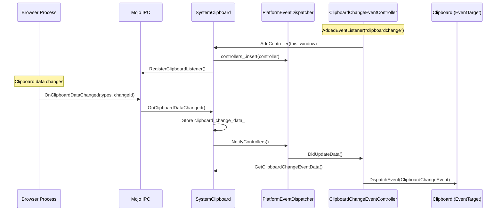

# Fix Assessment: 457463706

## Executive Summary
This is an internal cleanup/architecture design bug questioning whether `PlatformEventDispatcher` is the appropriate abstraction for dispatching `clipboardchange` events from `SystemClipboard::OnClipboardDataChanged`. After analysis, `PlatformEventDispatcher` is **not ideal** for this use case because it couples `SystemClipboard` (a per-frame core infrastructure class) with clipboard event dispatching (a module-level feature), and introduces unnecessary complexity. The recommended approach is to introduce a direct observer interface or use a Mojo-based callback mechanism.

## Bug Analysis

### Problem Statement
The current implementation uses `PlatformEventDispatcher`/`PlatformEventController` pattern for the `clipboardchange` event, where `SystemClipboard` inherits from `PlatformEventDispatcher` and `ClipboardChangeEventController` inherits from `PlatformEventController`. This pattern was designed for platform hardware events (battery, gamepad) but may not be the ideal abstraction for clipboard change notifications.

### Expected Behavior
The architecture should:
1. Maintain separation of concerns between core clipboard infrastructure and event dispatching
2. Minimize coupling between `core/clipboard` and `modules/clipboard`
3. Support efficient notification of clipboard changes to interested listeners
4. Follow established Blink patterns for similar use cases

### Actual Behavior
Current implementation:
1. `SystemClipboard` (in `core/clipboard`) inherits from `PlatformEventDispatcher`
2. This creates a tight coupling between core infrastructure and the event dispatch mechanism
3. `SystemClipboard` stores `clipboard_change_data_` with a TODO referencing this bug
4. The `NotifyControllers()` call in `OnClipboardDataChanged()` has a TODO questioning the abstraction

### Triggering Conditions
This is a design issue, not a runtime bug. The code works correctly but the architecture choice is being questioned.

## Root Cause Analysis

### Code Investigation
The investigation revealed that `PlatformEventDispatcher` was originally designed for platform hardware events like battery status and gamepad, where:
- A singleton dispatcher polls or receives events from platform services
- Multiple controllers (often associated with different frames/windows) subscribe to the dispatcher
- The dispatcher manages starting/stopping platform listeners based on subscriber count

For `clipboardchange`:
- `SystemClipboard` is already per-frame (not a singleton)
- It receives clipboard change notifications via Mojo (`ClipboardListener::OnClipboardDataChanged`)
- Each `SystemClipboard` typically has at most one `ClipboardChangeEventController`
- The pattern of "start/stop listening" maps to "register/unregister with Mojo"

### Key Files Identified
- [/workspace/cr4/src/third_party/blink/renderer/core/clipboard/system_clipboard.h#L37-L60](/workspace/cr4/src/third_party/blink/renderer/core/clipboard/system_clipboard.h#L37-L60) - SystemClipboard inherits PlatformEventDispatcher
- [/workspace/cr4/src/third_party/blink/renderer/core/clipboard/system_clipboard.cc#L638-L665](/workspace/cr4/src/third_party/blink/renderer/core/clipboard/system_clipboard.cc#L638-L665) - OnClipboardDataChanged and StartListening implementations with TODOs
- [/workspace/cr4/src/third_party/blink/renderer/modules/clipboard/clipboard_change_event_controller.h#L20-L62](/workspace/cr4/src/third_party/blink/renderer/modules/clipboard/clipboard_change_event_controller.h#L20-L62) - ClipboardChangeEventController definition
- [/workspace/cr4/src/third_party/blink/renderer/modules/clipboard/clipboard_change_event_controller.cc#L48-L66](/workspace/cr4/src/third_party/blink/renderer/modules/clipboard/clipboard_change_event_controller.cc#L48-L66) - RegisterWithDispatcher/UnregisterWithDispatcher implementations
- [/workspace/cr4/src/third_party/blink/renderer/core/frame/platform_event_dispatcher.h#L17-L54](/workspace/cr4/src/third_party/blink/renderer/core/frame/platform_event_dispatcher.h#L17-L54) - PlatformEventDispatcher base class
- [/workspace/cr4/src/third_party/blink/renderer/core/frame/platform_event_controller.h#L23-L56](/workspace/cr4/src/third_party/blink/renderer/core/frame/platform_event_controller.h#L23-L56) - PlatformEventController base class

### Root Cause
**Location**: [/workspace/cr4/src/third_party/blink/renderer/core/clipboard/system_clipboard.h#L39](/workspace/cr4/src/third_party/blink/renderer/core/clipboard/system_clipboard.h#L39)
**Function**: `class SystemClipboard : public PlatformEventDispatcher`
**Issue**: `SystemClipboard` inheriting from `PlatformEventDispatcher` creates architectural concerns:

1. **Mismatched patterns**: `PlatformEventDispatcher` is designed for singleton dispatchers with multiple frame-based controllers, but `SystemClipboard` is already per-frame
2. **Unnecessary indirection**: The controller registers with `SystemClipboard` which then manages Mojo registration, adding a layer of abstraction that doesn't provide clear benefit
3. **Data storage concern**: `clipboard_change_data_` is stored in `SystemClipboard` but is only used by `ClipboardChangeEventController`, mixing concerns
4. **Module/core coupling**: The inheritance forces `core/clipboard` to depend on the dispatcher pattern even though the actual event handling is in `modules/clipboard`

### Code Flow Diagram


## Fix Options

### Option 1: Introduce a Direct Observer Interface ⭐ RECOMMENDED
- **Description**: Create a `ClipboardChangeObserver` interface that `ClipboardChangeEventController` implements directly. `SystemClipboard` holds a weak reference to the observer and calls it directly on clipboard change. Remove inheritance from `PlatformEventDispatcher`.
- **Files to modify**: 
  - [/workspace/cr4/src/third_party/blink/renderer/core/clipboard/system_clipboard.h](/workspace/cr4/src/third_party/blink/renderer/core/clipboard/system_clipboard.h) - Remove PlatformEventDispatcher, add ClipboardChangeObserver member
  - [/workspace/cr4/src/third_party/blink/renderer/core/clipboard/system_clipboard.cc](/workspace/cr4/src/third_party/blink/renderer/core/clipboard/system_clipboard.cc) - Update OnClipboardDataChanged to call observer directly
  - [/workspace/cr4/src/third_party/blink/renderer/modules/clipboard/clipboard_change_event_controller.h](/workspace/cr4/src/third_party/blink/renderer/modules/clipboard/clipboard_change_event_controller.h) - Implement ClipboardChangeObserver, remove PlatformEventController
  - [/workspace/cr4/src/third_party/blink/renderer/modules/clipboard/clipboard_change_event_controller.cc](/workspace/cr4/src/third_party/blink/renderer/modules/clipboard/clipboard_change_event_controller.cc) - Update registration and callback methods
- **Complexity**: Medium
- **Risk**: Low
- **Pros**: 
  - Cleaner separation of concerns
  - Removes unnecessary abstraction layers
  - Data (`clipboard_change_data_`) can be passed directly to observer
  - Simpler code flow
  - Follows established observer patterns in Blink
- **Cons**: 
  - Requires creating a new interface
  - Loses some built-in page visibility handling from PlatformEventController (but this is handled separately via FocusChangedObserver anyway)

### Option 2: Move Clipboard Event Logic to a Dedicated Dispatcher Class
- **Description**: Create `ClipboardEventDispatcher` that inherits `PlatformEventDispatcher` and lives in `modules/clipboard`. `SystemClipboard` notifies this dispatcher which then notifies controllers. Similar to how `BatteryDispatcher` is separate from `BatteryManager`.
- **Files to modify**: 
  - New file: [/workspace/cr4/src/third_party/blink/renderer/modules/clipboard/clipboard_event_dispatcher.h](/workspace/cr4/src/third_party/blink/renderer/modules/clipboard/clipboard_event_dispatcher.h)
  - New file: [/workspace/cr4/src/third_party/blink/renderer/modules/clipboard/clipboard_event_dispatcher.cc](/workspace/cr4/src/third_party/blink/renderer/modules/clipboard/clipboard_event_dispatcher.cc)
  - [/workspace/cr4/src/third_party/blink/renderer/core/clipboard/system_clipboard.h](/workspace/cr4/src/third_party/blink/renderer/core/clipboard/system_clipboard.h)
  - [/workspace/cr4/src/third_party/blink/renderer/core/clipboard/system_clipboard.cc](/workspace/cr4/src/third_party/blink/renderer/core/clipboard/system_clipboard.cc)
  - [/workspace/cr4/src/third_party/blink/renderer/modules/clipboard/clipboard_change_event_controller.cc](/workspace/cr4/src/third_party/blink/renderer/modules/clipboard/clipboard_change_event_controller.cc)
- **Complexity**: Medium
- **Risk**: Low
- **Pros**: 
  - Follows existing pattern (BatteryDispatcher/BatteryManager)
  - Maintains dispatcher/controller separation
  - Removes PlatformEventDispatcher from SystemClipboard
- **Cons**: 
  - Adds more classes/files
  - The BatteryDispatcher pattern exists because battery data is shared across frames; clipboard is already per-frame
  - Still requires some coupling mechanism between SystemClipboard and the new dispatcher

### Option 3: Use Mojo Callback Directly
- **Description**: Instead of inheriting PlatformEventDispatcher, have `ClipboardChangeEventController` register directly with the Mojo `ClipboardHost` service. The controller would implement `ClipboardListener` interface itself.
- **Files to modify**: 
  - [/workspace/cr4/src/third_party/blink/renderer/core/clipboard/system_clipboard.h](/workspace/cr4/src/third_party/blink/renderer/core/clipboard/system_clipboard.h) - Remove PlatformEventDispatcher, keep only raw clipboard operations
  - [/workspace/cr4/src/third_party/blink/renderer/core/clipboard/system_clipboard.cc](/workspace/cr4/src/third_party/blink/renderer/core/clipboard/system_clipboard.cc) - Remove event dispatching code
  - [/workspace/cr4/src/third_party/blink/renderer/modules/clipboard/clipboard_change_event_controller.h](/workspace/cr4/src/third_party/blink/renderer/modules/clipboard/clipboard_change_event_controller.h) - Implement ClipboardListener, add Mojo receiver
  - [/workspace/cr4/src/third_party/blink/renderer/modules/clipboard/clipboard_change_event_controller.cc](/workspace/cr4/src/third_party/blink/renderer/modules/clipboard/clipboard_change_event_controller.cc) - Handle Mojo binding directly
- **Complexity**: High
- **Risk**: Medium
- **Pros**: 
  - Cleanest separation - core/clipboard has no knowledge of event dispatching
  - Module fully owns its functionality
- **Cons**: 
  - May require changes to ClipboardHost Mojo interface (to support multiple listeners per frame)
  - Currently, clipboard listener registration is tied to SystemClipboard's Mojo connection
  - Duplicates some Mojo binding logic

### Option 4: Keep Current Architecture (No Change)
- **Description**: Accept the current design. Add comments explaining the architectural decision and update the TODOs to close the bug without code changes.
- **Files to modify**: 
  - [/workspace/cr4/src/third_party/blink/renderer/core/clipboard/system_clipboard.cc#L642-L644](/workspace/cr4/src/third_party/blink/renderer/core/clipboard/system_clipboard.cc#L642-L644) - Update TODO comment
  - [/workspace/cr4/src/third_party/blink/renderer/core/clipboard/system_clipboard.h#L248-L250](/workspace/cr4/src/third_party/blink/renderer/core/clipboard/system_clipboard.h#L248-L250) - Update TODO comment
- **Complexity**: Low
- **Risk**: Low
- **Pros**: 
  - No risk of regressions
  - The current implementation works correctly
  - PlatformEventController provides useful page visibility handling
- **Cons**: 
  - Doesn't address the architectural concerns
  - Keeps coupling between core/clipboard and the event dispatch pattern
  - `clipboard_change_data_` remains awkwardly placed in SystemClipboard

## Recommended Approach

**Option 1 (Direct Observer Interface)** is recommended because:

1. **Appropriate abstraction level**: The one-to-one relationship between `SystemClipboard` and clipboard event handling doesn't need the many-to-one pattern of `PlatformEventDispatcher`

2. **Clean data flow**: Clipboard change data can be passed directly to the observer callback, eliminating the awkward storage in `SystemClipboard`

3. **Better separation of concerns**: 
   - `SystemClipboard` remains focused on clipboard read/write operations
   - Event dispatch logic stays entirely in `modules/clipboard`

4. **Minimal disruption**: The implementation is straightforward and doesn't require Mojo interface changes

5. **Existing precedent**: Similar observer patterns exist throughout Blink (e.g., `FocusChangedObserver` which `ClipboardChangeEventController` already uses)

### Proposed Interface:
```cpp
// In core/clipboard/clipboard_change_observer.h (new file)
class ClipboardChangeObserver : public GarbageCollectedMixin {
 public:
  virtual void OnClipboardDataChanged(const Vector<String>& types,
                                      const BigInt& change_id) = 0;
};

// SystemClipboard changes:
// - Remove PlatformEventDispatcher inheritance
// - Add: void SetClipboardChangeObserver(ClipboardChangeObserver*);
// - Remove: clipboard_change_data_ member

// ClipboardChangeEventController changes:
// - Remove PlatformEventController inheritance  
// - Add ClipboardChangeObserver implementation
// - Manage own page visibility via FocusChangedObserver (already present)
```

## Testing Strategy
- **Unit tests needed**: Update `ClipboardChangeEventControllerUnittest` to work with new observer interface
- **Web tests needed**: Existing clipboard change event web tests should continue to pass unchanged
- **Manual verification**: 
  1. Open a test page with clipboardchange listener
  2. Copy text externally
  3. Verify event fires when page has focus and permission/activation
  4. Verify event is deferred when page lacks focus

## Related Code References
- Similar observer pattern: [/workspace/cr4/src/third_party/blink/renderer/core/page/focus_changed_observer.h](/workspace/cr4/src/third_party/blink/renderer/core/page/focus_changed_observer.h)
- BatteryDispatcher pattern (for comparison): [/workspace/cr4/src/third_party/blink/renderer/modules/battery/battery_dispatcher.h](/workspace/cr4/src/third_party/blink/renderer/modules/battery/battery_dispatcher.h)
- Clipboard API spec: https://www.w3.org/TR/clipboard-apis/
- Existing tests: [/workspace/cr4/src/third_party/blink/renderer/modules/clipboard/clipboard_change_event_controller_unittest.cc](/workspace/cr4/src/third_party/blink/renderer/modules/clipboard/clipboard_change_event_controller_unittest.cc)
