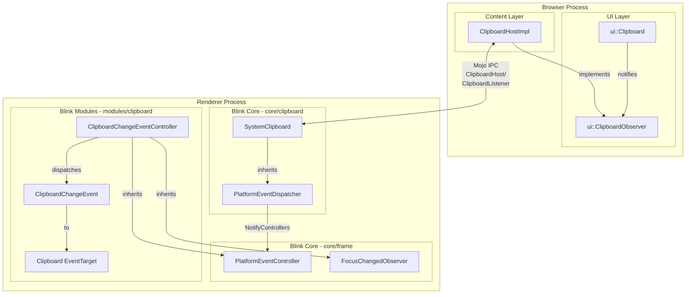
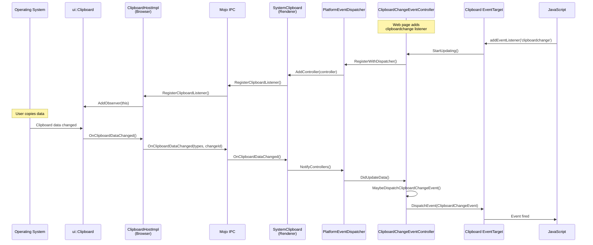
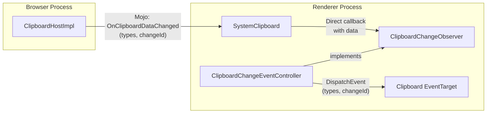
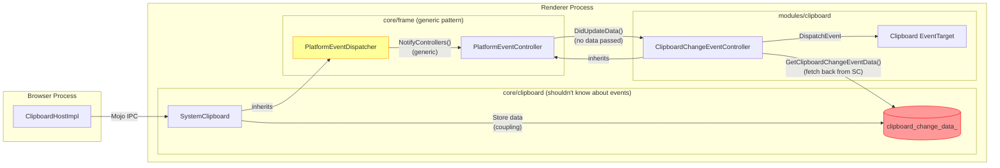
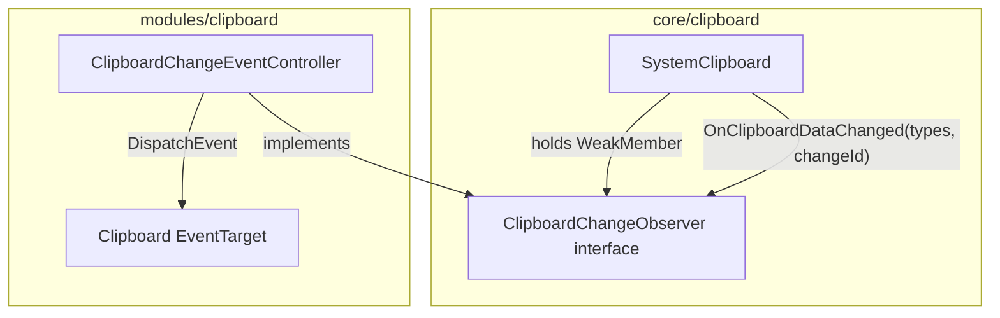

# High-Level Design: 457463706

## 1. Executive Summary

This bug concerns the architecture of the `clipboardchange` event dispatch mechanism in Chromium's Blink renderer. Currently, `SystemClipboard` (a core clipboard infrastructure class in `core/clipboard`) inherits from `PlatformEventDispatcher` to dispatch clipboard change events to `ClipboardChangeEventController` (in `modules/clipboard`). The issue is that `PlatformEventDispatcher` was designed for platform hardware events with singleton dispatchers and multiple frame-based controllers (like battery status), whereas `SystemClipboard` is already per-frame and typically has at most one controller. This architectural mismatch creates unnecessary coupling between core infrastructure and module-level features.

## 2. System Context

### 2.1 Overview

The `clipboardchange` event is part of the Async Clipboard API, which allows web pages to be notified when the system clipboard contents change. This feature fits into Chrome's architecture as follows:

- **Browser Process**: Monitors OS-level clipboard changes via `ui::ClipboardObserver`
- **Renderer Process**: Receives notifications via Mojo IPC and dispatches DOM events
- **Web Platform**: Exposes `clipboardchange` events to JavaScript on the `navigator.clipboard` object

The implementation spans three Chromium layers:
1. **Content Layer** (`content/browser/renderer_host`): `ClipboardHostImpl` handles browser-side clipboard operations
2. **Blink Core** (`third_party/blink/renderer/core/clipboard`): `SystemClipboard` provides clipboard access to renderer
3. **Blink Modules** (`third_party/blink/renderer/modules/clipboard`): `ClipboardChangeEventController` handles event dispatch

### 2.2 Related Specs
- [W3C Async Clipboard API](https://www.w3.org/TR/clipboard-apis/)
- [WHATWG Clipboard Events](https://html.spec.whatwg.org/multipage/interaction.html#clipboard)
- Chromium Design: Internal cleanup - no public design doc

## 3. Component Architecture

### 3.1 Major Components

| Component | Location | Responsibility |
|-----------|----------|----------------|
| `ClipboardHostImpl` | `/content/browser/renderer_host/clipboard_host_impl.h` | Browser-side clipboard host, implements Mojo interface, observes OS clipboard |
| `ui::Clipboard` | `/ui/base/clipboard/clipboard.h` | Platform abstraction for OS clipboard access |
| `ui::ClipboardObserver` | `/ui/base/clipboard/clipboard_observer.h` | Interface for clipboard change notifications |
| `SystemClipboard` | `/third_party/blink/renderer/core/clipboard/system_clipboard.h` | Renderer-side clipboard access, bridges to browser via Mojo |
| `PlatformEventDispatcher` | `/third_party/blink/renderer/core/frame/platform_event_dispatcher.h` | Base class for dispatching platform events to controllers |
| `PlatformEventController` | `/third_party/blink/renderer/core/frame/platform_event_controller.h` | Base class for controllers that receive platform events |
| `ClipboardChangeEventController` | `/third_party/blink/renderer/modules/clipboard/clipboard_change_event_controller.h` | Handles clipboardchange event dispatch to web page |
| `Clipboard` (JS API) | `/third_party/blink/renderer/modules/clipboard/clipboard.h` | JavaScript Clipboard interface (EventTarget) |
| `ClipboardChangeEvent` | `/third_party/blink/renderer/modules/clipboard/clipboard_change_event.h` | DOM event for clipboard changes |

### 3.2 Component Diagram



## 4. Process Architecture

### 4.1 Process Boundaries

The clipboard change feature crosses the browser-renderer process boundary:

| Process | Role | Key Classes |
|---------|------|-------------|
| **Browser Process** | Owns OS clipboard access, monitors for changes | `ClipboardHostImpl`, `ui::Clipboard` |
| **Renderer Process** | Receives change notifications, dispatches DOM events | `SystemClipboard`, `ClipboardChangeEventController` |

**IPC Mechanism**: Mojo interfaces defined in `clipboard.mojom`:
- `ClipboardHost`: Browser-side interface for clipboard operations
- `ClipboardListener`: Renderer-side callback interface for change notifications

### 4.2 IPC Flow



## 5. Data Flow

### 5.1 Normal Flow (Expected Design)

The ideal design would have a simpler, more direct data flow:



### 5.2 Buggy Flow (Current Architecture)

The current design introduces unnecessary indirection through `PlatformEventDispatcher`:



**Issues in Current Flow:**
1. **Unnecessary inheritance**: `SystemClipboard` inherits from `PlatformEventDispatcher` 
2. **Data storage coupling**: `clipboard_change_data_` stored in `SystemClipboard` but only used by `ClipboardChangeEventController`
3. **Double fetch**: Controller calls back to `SystemClipboard` to get data that was just delivered
4. **Pattern mismatch**: `PlatformEventDispatcher` designed for singleton→many pattern, but clipboard is per-frame→one

## 6. Key Interfaces

### 6.1 Public APIs

- **`navigator.clipboard`** - JavaScript API
  - `addEventListener('clipboardchange', handler)` - Register for clipboard change events
  
- **`ClipboardChangeEvent`** - DOM Event interface
  - `event.types` - Array of MIME types available on clipboard
  - `event.changeId` - Unique identifier for this clipboard state

### 6.2 Internal Interfaces

**Mojo Interfaces** (`clipboard.mojom`):

```
// Browser-side interface
interface ClipboardHost {
    RegisterClipboardListener(pending_remote<ClipboardListener> listener);
    // ... read/write operations
}

// Renderer-side callback
interface ClipboardListener {
    OnClipboardDataChanged(array<string16> types, uint128 change_id);
}
```

**Current Blink Interfaces**:

| Interface | Location | Purpose |
|-----------|----------|---------|
| `PlatformEventDispatcher::StartListening(LocalDOMWindow*)` | `platform_event_dispatcher.h` | Start receiving platform events |
| `PlatformEventDispatcher::StopListening()` | `platform_event_dispatcher.h` | Stop receiving platform events |
| `PlatformEventDispatcher::NotifyControllers()` | `platform_event_dispatcher.h` | Notify all registered controllers |
| `PlatformEventController::DidUpdateData()` | `platform_event_controller.h` | Callback when new data available |
| `SystemClipboard::OnClipboardDataChanged()` | `system_clipboard.h` | Mojo callback for clipboard changes |
| `SystemClipboard::GetClipboardChangeEventData()` | `system_clipboard.h` | Retrieve stored clipboard change data |

## 7. Threading Model

All clipboard operations occur on the **main thread** in both processes:

### Browser Process
- `ClipboardHostImpl` runs on the UI thread
- `ui::Clipboard` operations are synchronous on UI thread
- Clipboard change notifications delivered on UI thread

### Renderer Process  
- `SystemClipboard` operations on main frame thread
- `ClipboardChangeEventController` event dispatch on main thread
- All DOM event dispatch is synchronous on main thread

**Synchronization Points**:
- Mojo IPC provides cross-process message delivery
- No explicit locking required (single-threaded access)
- `HeapMojoReceiver`/`HeapMojoRemote` handle Mojo binding lifecycle

## 8. External Dependencies

### Chrome Components
| Component | Dependency Type | Purpose |
|-----------|-----------------|---------|
| `ui/base/clipboard` | Platform abstraction | OS clipboard access |
| `content/browser` | IPC host | Clipboard Mojo host |
| `mojo/public` | IPC | Process communication |
| `third_party/blink/public/mojom` | Interface definition | Mojo interface specs |

### Platform APIs
| Platform | API | Usage |
|----------|-----|-------|
| Windows | Win32 Clipboard API | Clipboard monitoring |
| macOS | NSPasteboard | Clipboard access & monitoring |
| Linux/X11 | X11 Selection | Clipboard selection buffer |
| Linux/Wayland | wl_data_device | Clipboard access |

### Third-party Libraries
- None directly for clipboard functionality

## 9. Impact of Fix

### 9.1 Components Affected

The recommended fix (Option 1: Direct Observer Interface) will modify:

| Component | Change |
|-----------|--------|
| `system_clipboard.h` | Remove `PlatformEventDispatcher` inheritance, add `ClipboardChangeObserver` member |
| `system_clipboard.cc` | Update `OnClipboardDataChanged()` to call observer directly |
| `clipboard_change_event_controller.h` | Implement `ClipboardChangeObserver`, remove `PlatformEventController` inheritance |
| `clipboard_change_event_controller.cc` | Update registration and callback methods |
| New: `clipboard_change_observer.h` | Define new observer interface |

### 9.2 Risk Assessment

- **Scope**: **Narrow** - Changes limited to clipboard event dispatch mechanism
- **Risk Level**: **Low** 
  - No Mojo interface changes required
  - No browser-side changes needed
  - Existing web-facing behavior unchanged
- **Testing Coverage**: 
  - Unit tests: `clipboard_change_event_controller_unittest.cc` needs updates
  - Web platform tests: Existing clipboardchange tests should pass unchanged
  - Manual testing: Focus/permission gating behavior verification

### 9.3 Architecture Improvements

After the fix, the architecture will be cleaner:



**Benefits**:
1. `SystemClipboard` no longer knows about event dispatch patterns
2. Data passed directly to observer (no intermediate storage)
3. Simpler dependency graph (no `PlatformEventDispatcher` dependency)
4. Follows existing observer patterns in Blink (`FocusChangedObserver`)
