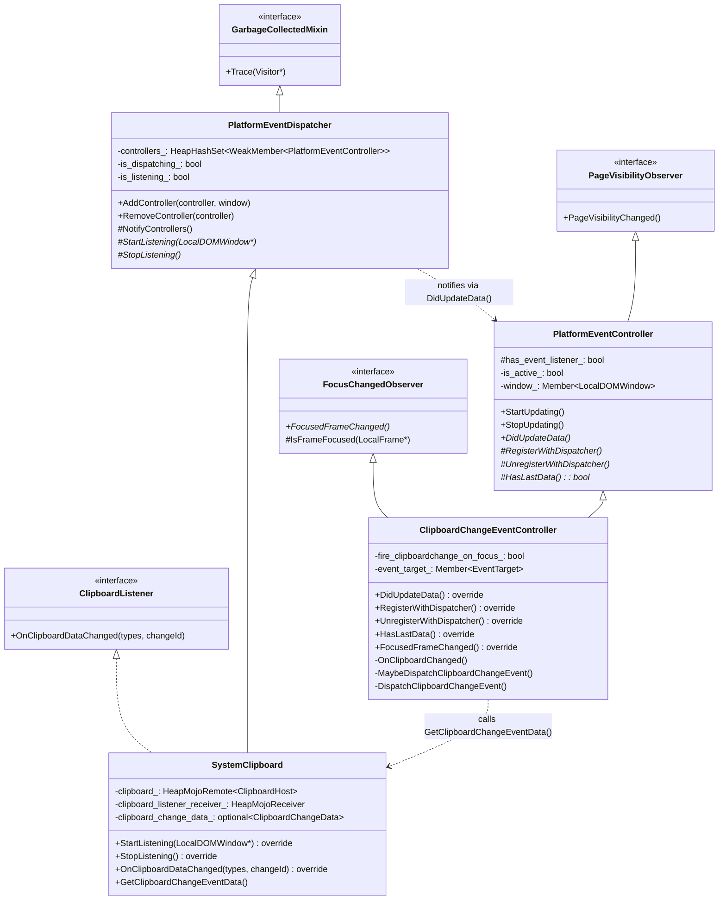
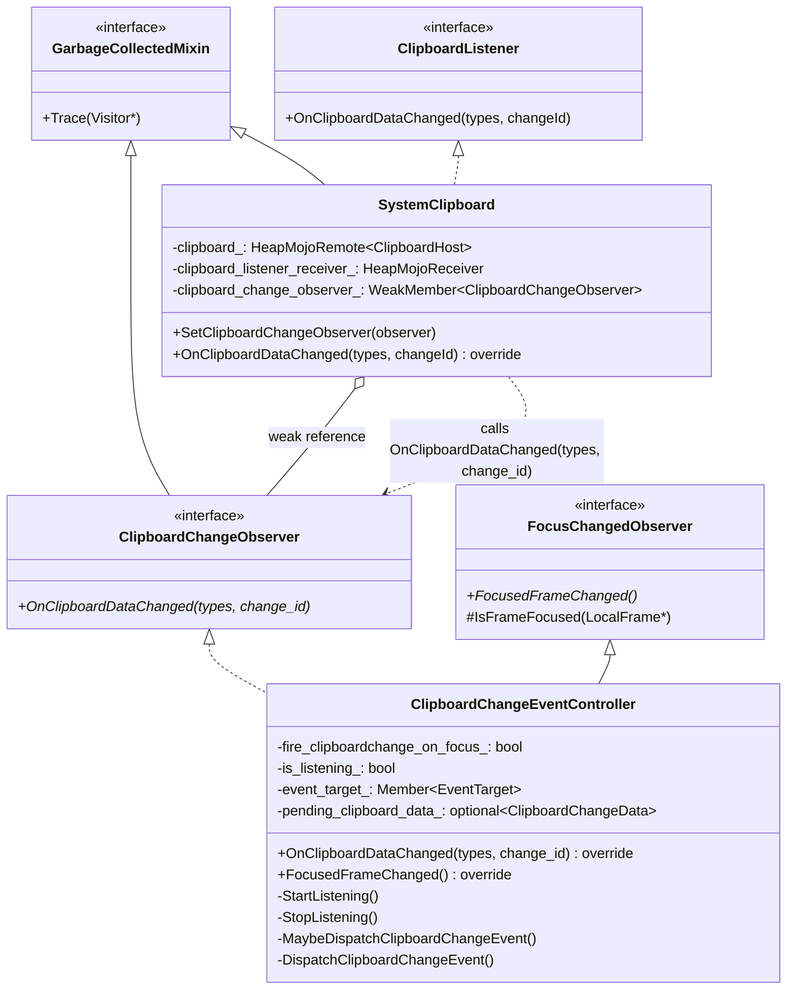
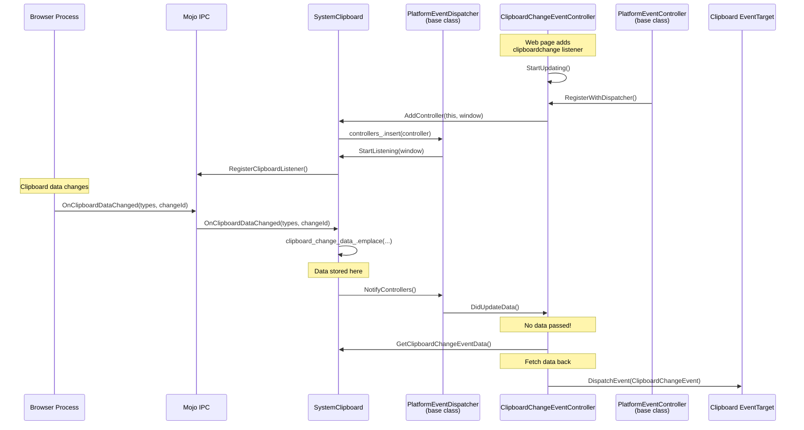
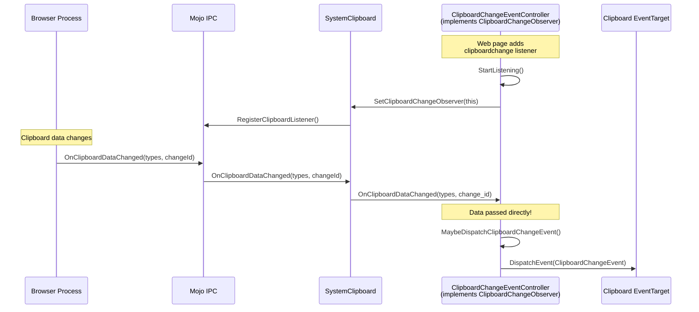

# Low-Level Design: 457463706

## 1. Files to Modify

| File | Type | Changes | Lines |
|------|------|---------|-------|
| [/workspace/cr4/src/third_party/blink/renderer/core/clipboard/clipboard_change_observer.h](/workspace/cr4/src/third_party/blink/renderer/core/clipboard/clipboard_change_observer.h) | New | New observer interface | ~25 |
| [/workspace/cr4/src/third_party/blink/renderer/core/clipboard/system_clipboard.h](/workspace/cr4/src/third_party/blink/renderer/core/clipboard/system_clipboard.h) | Modify | Remove PlatformEventDispatcher, add observer | ~15 |
| [/workspace/cr4/src/third_party/blink/renderer/core/clipboard/system_clipboard.cc](/workspace/cr4/src/third_party/blink/renderer/core/clipboard/system_clipboard.cc) | Modify | Update OnClipboardDataChanged, Trace | ~15 |
| [/workspace/cr4/src/third_party/blink/renderer/core/clipboard/build.gni](/workspace/cr4/src/third_party/blink/renderer/core/clipboard/build.gni) | Modify | Add new header file | ~1 |
| [/workspace/cr4/src/third_party/blink/renderer/modules/clipboard/clipboard_change_event_controller.h](/workspace/cr4/src/third_party/blink/renderer/modules/clipboard/clipboard_change_event_controller.h) | Modify | Remove PlatformEventController, add ClipboardChangeObserver | ~10 |
| [/workspace/cr4/src/third_party/blink/renderer/modules/clipboard/clipboard_change_event_controller.cc](/workspace/cr4/src/third_party/blink/renderer/modules/clipboard/clipboard_change_event_controller.cc) | Modify | Update registration, remove PlatformEventController methods | ~40 |
| [/workspace/cr4/src/third_party/blink/renderer/modules/clipboard/clipboard_change_event_controller_unittest.cc](/workspace/cr4/src/third_party/blink/renderer/modules/clipboard/clipboard_change_event_controller_unittest.cc) | Modify | Update test to use new observer pattern | ~10 |

## 2. Class Hierarchy

### 2.1 Current Class Diagram (Problematic)


### 2.2 Proposed Class Diagram (After Fix)


### 2.3 Class Responsibilities
- **PlatformEventDispatcher** (removed from SystemClipboard): Generic dispatcher for platform hardware events (battery, gamepad) - no longer used for clipboard
- **PlatformEventController** (removed from ClipboardChangeEventController): Generic controller for platform events - no longer used for clipboard
- **ClipboardChangeObserver** (new): Simple observer interface for clipboard change notifications, with data passed directly
- **SystemClipboard**: Provides clipboard read/write operations, notifies observer on clipboard changes
- **ClipboardChangeEventController**: Handles clipboard change event dispatch to web pages, manages page visibility and permission gating

## 3. Method-Level Analysis

### 3.1 Current Call Chain (Bug Path)


**Issues in Current Flow:**
1. `SystemClipboard` inherits `PlatformEventDispatcher` (line 39 of system_clipboard.h)
2. `clipboard_change_data_` stored in `SystemClipboard` (line 250) but only consumed by `ClipboardChangeEventController`
3. `DidUpdateData()` callback passes no data - controller must fetch it back from `SystemClipboard`
4. Double indirection through base classes adds complexity

### 3.2 Proposed Call Chain (After Fix)


### 3.3 Affected Methods

#### `SystemClipboard::OnClipboardDataChanged()`
**Location**: [/workspace/cr4/src/third_party/blink/renderer/core/clipboard/system_clipboard.cc#L638-L645](/workspace/cr4/src/third_party/blink/renderer/core/clipboard/system_clipboard.cc#L638-L645)

**Current Implementation (Buggy)**:
```cpp
void SystemClipboard::OnClipboardDataChanged(const Vector<String>& types,
                                             const absl::uint128& change_id) {
  clipboard_change_data_.emplace(types, BigInt(change_id));

  // TODO(crbug.com/457463706): Reevaluate whether this is the right
  // abstraction, possibly use a clipboard-specific interface here.
  NotifyControllers();
}
```

**Issues**:
1. Stores data in `clipboard_change_data_` for later retrieval
2. Uses `NotifyControllers()` from `PlatformEventDispatcher` base class
3. Controller must call `GetClipboardChangeEventData()` to retrieve data

#### `ClipboardChangeEventController::RegisterWithDispatcher()`
**Location**: [/workspace/cr4/src/third_party/blink/renderer/modules/clipboard/clipboard_change_event_controller.cc#L48-L53](/workspace/cr4/src/third_party/blink/renderer/modules/clipboard/clipboard_change_event_controller.cc#L48-L53)

**Current Implementation**:
```cpp
void ClipboardChangeEventController::RegisterWithDispatcher() {
  SystemClipboard* clipboard = GetSystemClipboard();
  if (clipboard) {
    clipboard->AddController(this, GetSupplementable()->DomWindow());
  }
}
```

**Issues**:
1. Uses `PlatformEventDispatcher::AddController()` which manages a set of controllers
2. `SystemClipboard` typically has only one controller, making the set unnecessary

## 4. Fix Design

### 4.1 Changes Required

#### File 1: New file [/workspace/cr4/src/third_party/blink/renderer/core/clipboard/clipboard_change_observer.h](/workspace/cr4/src/third_party/blink/renderer/core/clipboard/clipboard_change_observer.h)

**New Content**:
```cpp
// Copyright 2025 The Chromium Authors
// Use of this source code is governed by a BSD-style license that can be
// found in the LICENSE file.

#ifndef THIRD_PARTY_BLINK_RENDERER_CORE_CLIPBOARD_CLIPBOARD_CHANGE_OBSERVER_H_
#define THIRD_PARTY_BLINK_RENDERER_CORE_CLIPBOARD_CLIPBOARD_CHANGE_OBSERVER_H_

#include "third_party/blink/renderer/core/core_export.h"
#include "third_party/blink/renderer/platform/bindings/bigint.h"
#include "third_party/blink/renderer/platform/heap/garbage_collected.h"
#include "third_party/blink/renderer/platform/wtf/vector.h"
#include "third_party/blink/renderer/platform/wtf/text/wtf_string.h"

namespace blink {

// Observer interface for clipboard change notifications.
// Observers receive direct callbacks with clipboard change data.
class CORE_EXPORT ClipboardChangeObserver : public GarbageCollectedMixin {
 public:
  // Called when the system clipboard data has changed.
  // |types| contains the MIME types available on the clipboard.
  // |change_id| is a unique identifier for this clipboard state.
  virtual void OnClipboardDataChanged(const Vector<String>& types,
                                      const BigInt& change_id) = 0;

 protected:
  virtual ~ClipboardChangeObserver() = default;
};

}  // namespace blink

#endif  // THIRD_PARTY_BLINK_RENDERER_CORE_CLIPBOARD_CLIPBOARD_CHANGE_OBSERVER_H_
```

**Rationale**: This new interface follows the established observer pattern in Blink (similar to `FocusChangedObserver`), passing data directly to the observer rather than requiring a fetch-back pattern.

---

#### File 2: [/workspace/cr4/src/third_party/blink/renderer/core/clipboard/system_clipboard.h](/workspace/cr4/src/third_party/blink/renderer/core/clipboard/system_clipboard.h)

**Before** (lines 37-60):
```cpp
class CORE_EXPORT SystemClipboard final
    : public GarbageCollected<SystemClipboard>,
      public PlatformEventDispatcher,
      public mojom::blink::ClipboardListener {
 public:
  enum SmartReplaceOption { kCanSmartReplace, kCannotSmartReplace };

  explicit SystemClipboard(LocalFrame* frame);
  SystemClipboard(const SystemClipboard&) = delete;
  SystemClipboard& operator=(const SystemClipboard&) = delete;

  // Inherited from PlatformEventDispatcher.
  void StartListening(LocalDOMWindow*) override;
  void StopListening() override;

  // Inherited from ClipboardListener.
  void OnClipboardDataChanged(const Vector<String>& types,
                              const absl::uint128& changeId) override;

  struct ClipboardChangeData {
    const Vector<String> types;
    const BigInt change_id;
  };
  const ClipboardChangeData& GetClipboardChangeEventData();
```

**After**:
```cpp
class ClipboardChangeObserver;

class CORE_EXPORT SystemClipboard final
    : public GarbageCollected<SystemClipboard>,
      public mojom::blink::ClipboardListener {
 public:
  enum SmartReplaceOption { kCanSmartReplace, kCannotSmartReplace };

  explicit SystemClipboard(LocalFrame* frame);
  SystemClipboard(const SystemClipboard&) = delete;
  SystemClipboard& operator=(const SystemClipboard&) = delete;

  // Sets the observer to receive clipboard change notifications.
  // Only one observer is supported. Pass nullptr to clear the observer.
  // The observer is held weakly and must outlive clipboard change events.
  void SetClipboardChangeObserver(ClipboardChangeObserver* observer);

  // Inherited from ClipboardListener.
  void OnClipboardDataChanged(const Vector<String>& types,
                              const absl::uint128& changeId) override;
```

**Additional changes in same file**:

**Before** (line 14, includes):
```cpp
#include "third_party/blink/renderer/core/frame/platform_event_dispatcher.h"
```

**After**:
```cpp
#include "third_party/blink/renderer/core/clipboard/clipboard_change_observer.h"
```

**Before** (lines 246-256, private members):
```cpp
  // A data from the most recent clipboard change notification.
  // TODO(crbug.com/457463706): Possibly move this data somewhere within
  // `ClipboardChangeEventController` or similar place.
  std::optional<ClipboardChangeData> clipboard_change_data_;

  // Declared SystemClipboardTest class as friend to access the private members
  // of this class as we need to use clipboard_ and buffer_ for unbound remote
  // tests.
  friend class SystemClipboardTest;
};
```

**After**:
```cpp
  // Observer for clipboard change notifications.
  WeakMember<ClipboardChangeObserver> clipboard_change_observer_;

  // Declared SystemClipboardTest class as friend to access the private members
  // of this class as we need to use clipboard_ and buffer_ for unbound remote
  // tests.
  friend class SystemClipboardTest;
};
```

**Rationale**: 
1. Remove `PlatformEventDispatcher` inheritance to decouple from generic event pattern
2. Remove `clipboard_change_data_` storage - data now passed directly to observer
3. Remove `GetClipboardChangeEventData()` method - no longer needed
4. Add `SetClipboardChangeObserver()` for direct observer registration
5. Use `WeakMember` for observer to avoid preventing garbage collection

---

#### File 3: [/workspace/cr4/src/third_party/blink/renderer/core/clipboard/system_clipboard.cc](/workspace/cr4/src/third_party/blink/renderer/core/clipboard/system_clipboard.cc)

**Before** (lines 459-463, Trace):
```cpp
void SystemClipboard::Trace(Visitor* visitor) const {
  PlatformEventDispatcher::Trace(visitor);
  visitor->Trace(clipboard_);
  visitor->Trace(clipboard_listener_receiver_);
}
```

**After**:
```cpp
void SystemClipboard::Trace(Visitor* visitor) const {
  visitor->Trace(clipboard_);
  visitor->Trace(clipboard_listener_receiver_);
  visitor->Trace(clipboard_change_observer_);
}
```

**Before** (lines 638-651):
```cpp
void SystemClipboard::OnClipboardDataChanged(const Vector<String>& types,
                                             const absl::uint128& change_id) {
  clipboard_change_data_.emplace(types, BigInt(change_id));

  // TODO(crbug.com/457463706): Reevaluate whether this is the right
  // abstraction, possibly use a clipboard-specific interface here.
  NotifyControllers();
}

const SystemClipboard::ClipboardChangeData&
SystemClipboard::GetClipboardChangeEventData() {
  CHECK(!!clipboard_change_data_);
  return clipboard_change_data_.value();
}
```

**After**:
```cpp
void SystemClipboard::SetClipboardChangeObserver(
    ClipboardChangeObserver* observer) {
  clipboard_change_observer_ = observer;
  if (observer) {
    // Start listening if we have an observer and not already listening
    if (!clipboard_listener_receiver_.is_bound() && clipboard_.is_bound()) {
      clipboard_->RegisterClipboardListener(
          clipboard_listener_receiver_.BindNewPipeAndPassRemote(
              clipboard_.GetAssociatedTask().GetTaskRunner()));
    }
  } else {
    // Stop listening if observer is cleared
    clipboard_listener_receiver_.reset();
  }
}

void SystemClipboard::OnClipboardDataChanged(const Vector<String>& types,
                                             const absl::uint128& change_id) {
  if (clipboard_change_observer_) {
    clipboard_change_observer_->OnClipboardDataChanged(types, BigInt(change_id));
  }
}
```

**Remove** (lines 653-664):
```cpp
void SystemClipboard::StartListening(LocalDOMWindow* window) {
  // If we're already listening (receiver is bound), no need to register again
  if (!clipboard_listener_receiver_.is_bound() && clipboard_.is_bound()) {
    clipboard_->RegisterClipboardListener(
        clipboard_listener_receiver_.BindNewPipeAndPassRemote(
            window->GetTaskRunner(TaskType::kUserInteraction)));
  }
}

void SystemClipboard::StopListening() {
  clipboard_listener_receiver_.reset();
}
```

**Rationale**:
1. Replace `StartListening()`/`StopListening()` with `SetClipboardChangeObserver()` 
2. Remove `NotifyControllers()` call - directly call observer's method instead
3. Remove `clipboard_change_data_` storage - pass data directly to observer
4. Use `WeakMember` so observer can be garbage collected if needed

---

#### File 4: [/workspace/cr4/src/third_party/blink/renderer/core/clipboard/build.gni](/workspace/cr4/src/third_party/blink/renderer/core/clipboard/build.gni)

**Before** (lines 5-24):
```gni
blink_core_sources_clipboard = [
  "clipboard_utilities.cc",
  "clipboard_utilities.h",
  "data_object.cc",
  "data_object.h",
  ...
  "system_clipboard.cc",
  "system_clipboard.h",
]
```

**After**:
```gni
blink_core_sources_clipboard = [
  "clipboard_change_observer.h",
  "clipboard_utilities.cc",
  "clipboard_utilities.h",
  "data_object.cc",
  "data_object.h",
  ...
  "system_clipboard.cc",
  "system_clipboard.h",
]
```

**Rationale**: Add the new header file to the build.

---

#### File 5: [/workspace/cr4/src/third_party/blink/renderer/modules/clipboard/clipboard_change_event_controller.h](/workspace/cr4/src/third_party/blink/renderer/modules/clipboard/clipboard_change_event_controller.h)

**Before** (lines 20-46):
```cpp
class MODULES_EXPORT ClipboardChangeEventController final
    : public GarbageCollected<ClipboardChangeEventController>,
      public Supplement<Navigator>,
      public PlatformEventController,
      public FocusChangedObserver {
 public:
  static const char kSupplementName[];
  explicit ClipboardChangeEventController(Navigator& navigator,
                                          EventTarget* eventTarget);

  // FocusChangedObserver overrides.
  void FocusedFrameChanged() override;

  ClipboardChangeEventController(const ClipboardChangeEventController&) =
      delete;
  ClipboardChangeEventController& operator=(
      const ClipboardChangeEventController&) = delete;

  ExecutionContext* GetExecutionContext() const;

  // PlatformEventController overrides.
  void DidUpdateData() override;
  void RegisterWithDispatcher() override;
  void UnregisterWithDispatcher() override;
  bool HasLastData() override;

  void Trace(Visitor*) const override;
```

**After**:
```cpp
class MODULES_EXPORT ClipboardChangeEventController final
    : public GarbageCollected<ClipboardChangeEventController>,
      public Supplement<Navigator>,
      public ClipboardChangeObserver,
      public FocusChangedObserver {
 public:
  static const char kSupplementName[];
  explicit ClipboardChangeEventController(Navigator& navigator,
                                          EventTarget* eventTarget);
  ~ClipboardChangeEventController() override;

  // FocusChangedObserver overrides.
  void FocusedFrameChanged() override;

  ClipboardChangeEventController(const ClipboardChangeEventController&) =
      delete;
  ClipboardChangeEventController& operator=(
      const ClipboardChangeEventController&) = delete;

  ExecutionContext* GetExecutionContext() const;

  // ClipboardChangeObserver overrides.
  void OnClipboardDataChanged(const Vector<String>& types,
                              const BigInt& change_id) override;

  // Start/stop listening for clipboard changes.
  void StartListening();
  void StopListening();

  void Trace(Visitor*) const override;
```

**Additional changes** (includes, line 12):

**Before**:
```cpp
#include "third_party/blink/renderer/core/frame/platform_event_controller.h"
```

**After**:
```cpp
#include "third_party/blink/renderer/core/clipboard/clipboard_change_observer.h"
```

**Additional changes** (private section, lines 48-62):

**Before**:
```cpp
 private:
  // Fires the clipboardchange event after page focus check.
  void OnClipboardChanged();
  void MaybeDispatchClipboardChangeEvent();
  void DispatchClipboardChangeEvent();

  // Callback for permission check result
  void OnPermissionResult(mojom::blink::PermissionStatus status);

  // Gets the SystemClipboard from the execution context.
  SystemClipboard* GetSystemClipboard() const;

  bool fire_clipboardchange_on_focus_ = false;
  Member<EventTarget> event_target_;
};
```

**After**:
```cpp
 private:
  void MaybeDispatchClipboardChangeEvent();
  void DispatchClipboardChangeEvent();

  // Callback for permission check result
  void OnPermissionResult(mojom::blink::PermissionStatus status);

  // Gets the SystemClipboard from the execution context.
  SystemClipboard* GetSystemClipboard() const;

  // Data from the most recent clipboard change notification.
  struct ClipboardChangeData {
    Vector<String> types;
    BigInt change_id;
  };
  std::optional<ClipboardChangeData> pending_clipboard_data_;

  bool fire_clipboardchange_on_focus_ = false;
  bool is_listening_ = false;
  Member<EventTarget> event_target_;
};
```

**Rationale**: 
1. Replace `PlatformEventController` inheritance with `ClipboardChangeObserver`
2. Add explicit `StartListening()`/`StopListening()` methods
3. Store `pending_clipboard_data_` locally (was in `SystemClipboard`)
4. Add destructor to handle cleanup

---

#### File 6: [/workspace/cr4/src/third_party/blink/renderer/modules/clipboard/clipboard_change_event_controller.cc](/workspace/cr4/src/third_party/blink/renderer/modules/clipboard/clipboard_change_event_controller.cc)

**Before** (lines 19-25, constructor):
```cpp
ClipboardChangeEventController::ClipboardChangeEventController(
    Navigator& navigator,
    EventTarget* event_target)
    : Supplement<Navigator>(navigator),
      PlatformEventController(*navigator.DomWindow()),
      FocusChangedObserver(navigator.DomWindow()->GetFrame()->GetPage()),
      event_target_(event_target) {}
```

**After**:
```cpp
ClipboardChangeEventController::ClipboardChangeEventController(
    Navigator& navigator,
    EventTarget* event_target)
    : Supplement<Navigator>(navigator),
      FocusChangedObserver(navigator.DomWindow()->GetFrame()->GetPage()),
      event_target_(event_target) {}

ClipboardChangeEventController::~ClipboardChangeEventController() {
  StopListening();
}
```

**Before** (lines 40-66, PlatformEventController methods):
```cpp
void ClipboardChangeEventController::DidUpdateData() {
  OnClipboardChanged();
}

bool ClipboardChangeEventController::HasLastData() {
  return true;
}

void ClipboardChangeEventController::RegisterWithDispatcher() {
  SystemClipboard* clipboard = GetSystemClipboard();
  if (clipboard) {
    clipboard->AddController(this, GetSupplementable()->DomWindow());
  }
}

void ClipboardChangeEventController::UnregisterWithDispatcher() {
  SystemClipboard* clipboard = GetSystemClipboard();
  if (clipboard) {
    clipboard->RemoveController(this);
  }
}

SystemClipboard* ClipboardChangeEventController::GetSystemClipboard() const {
  ExecutionContext* context = GetExecutionContext();
  LocalFrame* local_frame = To<LocalDOMWindow>(context)->GetFrame();
  return local_frame->GetSystemClipboard();
}
```

**After**:
```cpp
void ClipboardChangeEventController::OnClipboardDataChanged(
    const Vector<String>& types,
    const BigInt& change_id) {
  pending_clipboard_data_.emplace(ClipboardChangeData{types, change_id});

  ExecutionContext* context = GetExecutionContext();
  if (!context) {
    return;
  }
  LocalDOMWindow& window = *To<LocalDOMWindow>(context);
  CHECK(window.IsSecureContext());  // [SecureContext] in IDL

  MaybeDispatchClipboardChangeEvent();
}

void ClipboardChangeEventController::StartListening() {
  if (is_listening_) {
    return;
  }
  SystemClipboard* clipboard = GetSystemClipboard();
  if (clipboard) {
    clipboard->SetClipboardChangeObserver(this);
    is_listening_ = true;
  }
}

void ClipboardChangeEventController::StopListening() {
  if (!is_listening_) {
    return;
  }
  SystemClipboard* clipboard = GetSystemClipboard();
  if (clipboard) {
    clipboard->SetClipboardChangeObserver(nullptr);
  }
  is_listening_ = false;
}

SystemClipboard* ClipboardChangeEventController::GetSystemClipboard() const {
  ExecutionContext* context = GetExecutionContext();
  if (!context) {
    return nullptr;
  }
  LocalFrame* local_frame = To<LocalDOMWindow>(context)->GetFrame();
  if (!local_frame) {
    return nullptr;
  }
  return local_frame->GetSystemClipboard();
}
```

**Before** (lines 68-73, Trace):
```cpp
void ClipboardChangeEventController::Trace(Visitor* visitor) const {
  Supplement<Navigator>::Trace(visitor);
  PlatformEventController::Trace(visitor);
  FocusChangedObserver::Trace(visitor);
  visitor->Trace(event_target_);
}
```

**After**:
```cpp
void ClipboardChangeEventController::Trace(Visitor* visitor) const {
  Supplement<Navigator>::Trace(visitor);
  FocusChangedObserver::Trace(visitor);
  visitor->Trace(event_target_);
}
```

**Remove** (lines 75-85):
```cpp
void ClipboardChangeEventController::OnClipboardChanged() {
  ExecutionContext* context = GetExecutionContext();
  // TODO(roraja): revisit if this null check is really required
  if (!context) {
    return;
  }
  LocalDOMWindow& window = *To<LocalDOMWindow>(context);
  CHECK(window.IsSecureContext());  // [SecureContext] in IDL

  MaybeDispatchClipboardChangeEvent();
}
```

**Before** (lines 137-150, DispatchClipboardChangeEvent):
```cpp
void ClipboardChangeEventController::DispatchClipboardChangeEvent() {
  SystemClipboard* clipboard = GetSystemClipboard();
  // TODO(roraja): revisit if this null check
  if (!clipboard) {
    return;
  }
  const auto& clipboardchange_data = clipboard->GetClipboardChangeEventData();
  // This notification should never be received if the data is not
  // available.
  event_target_->DispatchEvent(*ClipboardChangeEvent::Create(
      clipboardchange_data.types, clipboardchange_data.change_id));
  UseCounter::Count(GetExecutionContext(),
                    WebFeature::kClipboardChangeEventFired);
}
```

**After**:
```cpp
void ClipboardChangeEventController::DispatchClipboardChangeEvent() {
  if (!pending_clipboard_data_) {
    return;
  }
  event_target_->DispatchEvent(*ClipboardChangeEvent::Create(
      pending_clipboard_data_->types, pending_clipboard_data_->change_id));
  UseCounter::Count(GetExecutionContext(),
                    WebFeature::kClipboardChangeEventFired);
}
```

**Rationale**:
1. Remove `PlatformEventController` base class methods
2. Implement `ClipboardChangeObserver::OnClipboardDataChanged()` to receive data directly
3. Store clipboard data locally in `pending_clipboard_data_`
4. Add destructor to unregister observer
5. Simplify `DispatchClipboardChangeEvent()` to use local data

---

#### File 7: [/workspace/cr4/src/third_party/blink/renderer/modules/clipboard/clipboard_change_event_controller_unittest.cc](/workspace/cr4/src/third_party/blink/renderer/modules/clipboard/clipboard_change_event_controller_unittest.cc)

**Before** (lines 31-64, first test):
```cpp
TEST_F(ClipboardChangeEventTest, ClipboardChangeEventFiresWhenFocused) {
  ExecutionContext* execution_context = GetFrame().DomWindow();
  // Set the yet-unset optional in SystemClipboard as we will be triggering
  // events artificially.
  GetFrame().GetSystemClipboard()->OnClipboardDataChanged({"text/plain"}, 1);

  // Clipboardchange event requires a secure origin and page in focus to work.
  SetSecureOrigin(execution_context);
  SetPageFocus(true);

  auto* clipboard_change_event_handler =
      MakeGarbageCollected<EventCountingListener>();
  GetDocument().addEventListener(event_type_names::kClipboardchange,
                                 clipboard_change_event_handler, false);
  auto* clipboard_change_event_controller =
      MakeGarbageCollected<ClipboardChangeEventController>(
          *GetFrame().DomWindow()->navigator(), &GetDocument());

  EXPECT_EQ(clipboard_change_event_handler->Count(), 0);

  // Set sticky user activation to ensure the event fires immediately
  // Use the same frame context that the controller will use
  LocalDOMWindow* local_dom_window = To<LocalDOMWindow>(execution_context);
  LocalFrame* test_frame = local_dom_window->GetFrame();
  test_frame->SetStickyUserActivationState();

  // Simulate a clipboard change event from the system clipboard.
  clipboard_change_event_controller->DidUpdateData();
  ...
```

**After**:
```cpp
TEST_F(ClipboardChangeEventTest, ClipboardChangeEventFiresWhenFocused) {
  ExecutionContext* execution_context = GetFrame().DomWindow();

  // Clipboardchange event requires a secure origin and page in focus to work.
  SetSecureOrigin(execution_context);
  SetPageFocus(true);

  auto* clipboard_change_event_handler =
      MakeGarbageCollected<EventCountingListener>();
  GetDocument().addEventListener(event_type_names::kClipboardchange,
                                 clipboard_change_event_handler, false);
  auto* clipboard_change_event_controller =
      MakeGarbageCollected<ClipboardChangeEventController>(
          *GetFrame().DomWindow()->navigator(), &GetDocument());

  EXPECT_EQ(clipboard_change_event_handler->Count(), 0);

  // Set sticky user activation to ensure the event fires immediately
  // Use the same frame context that the controller will use
  LocalDOMWindow* local_dom_window = To<LocalDOMWindow>(execution_context);
  LocalFrame* test_frame = local_dom_window->GetFrame();
  test_frame->SetStickyUserActivationState();

  // Simulate a clipboard change event by calling observer method directly.
  clipboard_change_event_controller->OnClipboardDataChanged(
      {"text/plain"}, BigInt(1));
  ...
```

**Rationale**: Tests should call the observer method directly instead of `DidUpdateData()`.

## 5. Memory & Lifetime Considerations

### 5.1 Object Ownership
- **SystemClipboard**: Owned by `LocalFrame` via Supplement pattern
- **ClipboardChangeEventController**: Owned by `Navigator` via Supplement pattern, garbage collected
- **ClipboardChangeObserver**: Held by `SystemClipboard` as `WeakMember`, does not prevent GC

### 5.2 Pointer/Reference Safety
- [x] No raw pointer issues - using `WeakMember` for observer reference
- [x] Weak pointers handled correctly - observer can be collected if no other references exist
- [x] Reference lifetime guaranteed - `SystemClipboard` outlives most usages since it's frame-bound

### 5.3 Observer Cleanup
The controller must call `SetClipboardChangeObserver(nullptr)` in its destructor to ensure `SystemClipboard` doesn't hold a dangling reference. The `WeakMember` provides additional safety, but explicit cleanup is preferred.

## 6. Threading Considerations

### 6.1 Thread Safety
All clipboard operations occur on the **main thread**:
- `SystemClipboard` operations: main frame thread
- `ClipboardChangeEventController` callbacks: main thread
- Observer notification: main thread (same as Mojo callback)

No changes to threading model. Single-threaded access means no synchronization needed.

### 6.2 Required Synchronization
None - all operations are main thread only.

## 7. Error Handling

### 7.1 Current Error Handling
- `GetSystemClipboard()` can return nullptr if context is detached
- `GetClipboardChangeEventData()` has `CHECK(!!clipboard_change_data_)` 

### 7.2 Changes to Error Handling
- Remove `CHECK` for data availability - data is now passed directly to observer
- Add null checks in `OnClipboardDataChanged()` for execution context
- `SetClipboardChangeObserver(nullptr)` gracefully handles stopping

## 8. Validation Points

### 8.1 DCHECKs to Add/Modify
```cpp
// In SystemClipboard::SetClipboardChangeObserver:
// No DCHECK needed - setting to nullptr is valid to clear observer

// In ClipboardChangeEventController::OnClipboardDataChanged:
// Implicit CHECK via To<LocalDOMWindow>(context) if context is wrong type
```

### 8.2 Invariants to Maintain
1. At most one `ClipboardChangeObserver` per `SystemClipboard` (enforced by API)
2. Observer must be cleared before it's destroyed (destructor handles this)
3. Mojo listener registration state matches observer presence

## 9. Test Requirements

### 9.1 Unit Tests Needed
| Test Name | Purpose | File |
|-----------|---------|------|
| `ClipboardChangeEventTest.ClipboardChangeEventFiresWhenFocused` | Verify event fires with focus + activation | [/workspace/cr4/src/third_party/blink/renderer/modules/clipboard/clipboard_change_event_controller_unittest.cc](/workspace/cr4/src/third_party/blink/renderer/modules/clipboard/clipboard_change_event_controller_unittest.cc) |
| `ClipboardChangeEventTest.ClipboardChangeEventNotFiredWhenNotFocused` | Verify deferred event on focus loss | Same file |
| `ClipboardChangeEventTest.ClipboardChangeEventFiresWithStickyActivation` | Verify sticky activation path | Same file |
| `ClipboardChangeEventTest.ClipboardChangeEventNotFiredWithoutStickyActivationOrPermission` | Verify permission gating | Same file |

### 9.2 Test Scenarios
1. **Normal case**: Page focused + sticky activation → event fires immediately
2. **Deferred case**: Page not focused → event deferred until focus regained
3. **Permission case**: No activation but has permission → event fires
4. **Denied case**: No activation and permission denied → event not fired
5. **Cleanup case**: Controller destroyed → observer properly unregistered

### 9.3 Existing Tests to Update
All existing tests in `clipboard_change_event_controller_unittest.cc` need minor updates:
- Replace `DidUpdateData()` calls with `OnClipboardDataChanged(types, change_id)`
- Remove setup calls to `SystemClipboard::OnClipboardDataChanged()` for pre-populating data

## 10. Summary of Changes

| Change Type | Count | Description |
|-------------|-------|-------------|
| New files | 1 | `clipboard_change_observer.h` |
| Modified files | 6 | `.h` and `.cc` files for SystemClipboard and ClipboardChangeEventController |
| Lines added | ~60 | New interface, observer methods |
| Lines removed | ~50 | PlatformEventDispatcher/Controller methods |
| Net change | ~10 lines | Simpler overall architecture |

The fix provides:
1. **Cleaner separation**: `SystemClipboard` no longer knows about event dispatch patterns
2. **Direct data flow**: Data passed to observer, eliminating fetch-back pattern  
3. **Simpler inheritance**: Removed unnecessary base class dependencies
4. **Same behavior**: All existing functionality preserved with cleaner implementation
