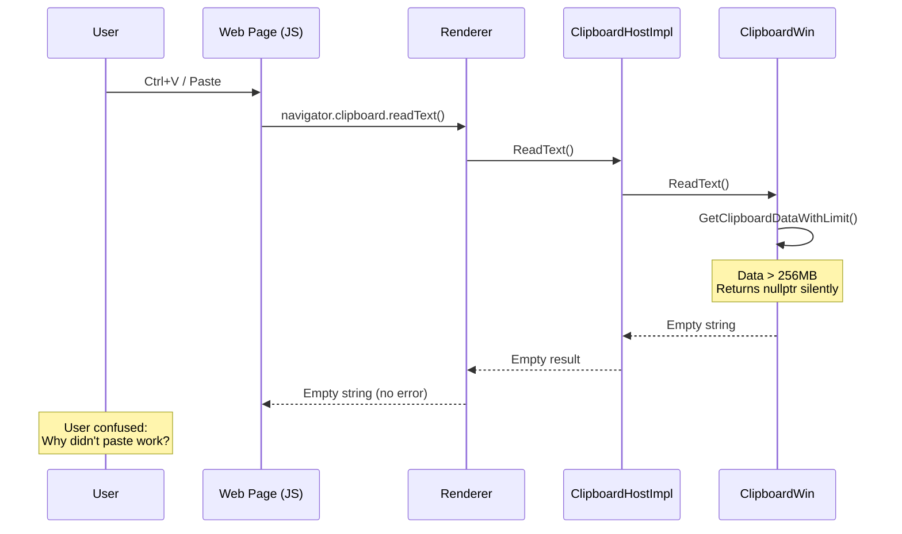

# Fix Assessment: 470685260

## Executive Summary
When clipboard data exceeds 256MB, Chrome silently fails paste operations without informing the user. The fix should add a toast notification or console message to inform users that paste was blocked due to the size limit, consistent with how other clipboard-related features provide feedback.

## Bug Analysis

### Problem Statement
Chrome has a 256MB safety limit on clipboard data reads to prevent memory-related crashes. When this limit is exceeded, `GetClipboardDataWithLimit()` in `clipboard_win.cc` returns `nullptr` and the paste operation silently fails with no user feedback.

### Expected Behavior
When a paste operation fails due to the 256MB safety limit, the browser should display a non-intrusive notification informing the user: "Paste failed: The content is too large to process (limit 256MB)."

### Actual Behavior
The paste operation fails silently. Users receive no feedback about why the paste didn't work, leaving them confused about the unresponsive paste command.

### Triggering Conditions
1. User copies data larger than 256MB to the system clipboard (from another application or Chrome)
2. User attempts to paste (Ctrl+V / Cmd+V) in a web page or other Chrome context
3. `GetClipboardDataWithLimit()` checks the size and returns `nullptr`
4. Paste silently returns empty data

## Root Cause Analysis

### Code Investigation
The 256MB clipboard read limit was introduced in commit `600a5b3e8662b` ([CL 7230896](https://chromium-review.googlesource.com/c/chromium/src/+/7230896)) to prevent memory allocation failures and crashes when processing abnormally large clipboard content.

The limit is enforced in `GetClipboardDataWithLimit()` which is called by various Read* functions (`ReadText`, `ReadAsciiText`, `ReadHTML`, `ReadPng`, etc.).

### Key Files Identified
- [/workspace/cr4/src/ui/base/clipboard/clipboard_win.cc#L230-L245](/workspace/cr4/src/ui/base/clipboard/clipboard_win.cc#L230-L245) - Where the 256MB limit is defined and enforced
- [/workspace/cr4/src/content/browser/renderer_host/clipboard_host_impl.cc](/workspace/cr4/src/content/browser/renderer_host/clipboard_host_impl.cc) - Browser-side clipboard host handling read requests
- [/workspace/cr4/src/chrome/browser/ui/toasts/toast_service.cc](/workspace/cr4/src/chrome/browser/ui/toasts/toast_service.cc) - Toast service registration for desktop notifications
- [/workspace/cr4/src/chrome/browser/chromeos/policy/dlp/dlp_clipboard_notifier.cc](/workspace/cr4/src/chrome/browser/chromeos/policy/dlp/dlp_clipboard_notifier.cc) - Example of clipboard notification pattern (ChromeOS)
- [/workspace/cr4/src/chrome/browser/ui/browser_commands.cc#L2502-L2514](/workspace/cr4/src/chrome/browser/ui/browser_commands.cc#L2502-L2514) - Example of copy URL toast notification

### Root Cause
**Location**: [/workspace/cr4/src/ui/base/clipboard/clipboard_win.cc#L234-L245](/workspace/cr4/src/ui/base/clipboard/clipboard_win.cc#L234-L245)
**Function**: `GetClipboardDataWithLimit()`
**Issue**: The function returns `nullptr` when data exceeds 256MB without any mechanism to propagate the failure reason to higher layers for user notification.

```cpp
HANDLE GetClipboardDataWithLimit(UINT format) {
  HANDLE data = ::GetClipboardData(format);
  if (!data) {
    return nullptr;
  }

  if (::GlobalSize(data) > kMaxClipboardSize.InBytes()) {
    return nullptr;  // Silent failure - no notification mechanism
  }

  return data;
}
```

### Code Flow Diagram


## Fix Options

### Option 1: Add Toast Notification in Desktop Chrome ⭐ RECOMMENDED
- **Description**: Add a new toast type `ToastId::kPasteFailed` that displays "Paste failed: The content is too large to process (limit 256MB)" when the clipboard read fails due to size limit. This follows the existing pattern used for `kLinkCopied`, `kImageCopied`, etc.
- **Files to modify**: 
  - [/workspace/cr4/src/chrome/browser/ui/toasts/api/toast_id.h](/workspace/cr4/src/chrome/browser/ui/toasts/api/toast_id.h) - Add `kPasteFailed` enum
  - [/workspace/cr4/src/chrome/browser/ui/toasts/toast_service.cc](/workspace/cr4/src/chrome/browser/ui/toasts/toast_service.cc) - Register toast specification
  - [/workspace/cr4/src/ui/base/clipboard/clipboard_win.cc](/workspace/cr4/src/ui/base/clipboard/clipboard_win.cc) - Add mechanism to signal size limit exceeded
  - [/workspace/cr4/src/content/browser/renderer_host/clipboard_host_impl.cc](/workspace/cr4/src/content/browser/renderer_host/clipboard_host_impl.cc) - Trigger toast on size limit failure
  - `chrome/app/generated_resources.grd` - Add localized string
- **Complexity**: Medium
- **Risk**: Low - Uses existing toast infrastructure
- **Pros**: 
  - Consistent with existing toast notifications (link copied, image copied, etc.)
  - Non-intrusive user feedback
  - Uses existing, well-tested toast infrastructure
- **Cons**: 
  - Requires changes across multiple layers (clipboard → browser process)
  - Windows-specific initially (though pattern can be extended)

### Option 2: Add Console Warning Message
- **Description**: Log a console warning message when paste fails due to size limit: `[Warning] Paste operation blocked: Clipboard content (X MB) exceeds the 256MB limit.`
- **Files to modify**: 
  - [/workspace/cr4/src/content/browser/renderer_host/clipboard_host_impl.cc](/workspace/cr4/src/content/browser/renderer_host/clipboard_host_impl.cc) - Add console message
  - [/workspace/cr4/src/ui/base/clipboard/clipboard_win.cc](/workspace/cr4/src/ui/base/clipboard/clipboard_win.cc) - Return size info
- **Complexity**: Low
- **Risk**: Low
- **Pros**: 
  - Simple implementation
  - Helps developers debug issues
  - Cross-platform consistent
- **Cons**: 
  - Not visible to regular users (only in DevTools)
  - Less user-friendly than toast

### Option 3: Return Error via Clipboard API
- **Description**: Modify the Clipboard API to return an error or rejection when paste fails due to size limit, allowing web pages to handle the error.
- **Files to modify**: 
  - [/workspace/cr4/src/third_party/blink/public/mojom/clipboard/clipboard.mojom](/workspace/cr4/src/third_party/blink/public/mojom/clipboard/clipboard.mojom) - Add error return
  - [/workspace/cr4/src/content/browser/renderer_host/clipboard_host_impl.cc](/workspace/cr4/src/content/browser/renderer_host/clipboard_host_impl.cc) - Return error status
  - Blink clipboard API implementation
- **Complexity**: High
- **Risk**: Medium - Could break existing web applications
- **Pros**: 
  - Web pages can provide custom error handling
  - Programmatic access to failure reason
- **Cons**: 
  - Potential breaking change
  - More complex implementation
  - Web pages still need to implement handling

### Option 4: Extend DLP-Style Notification Pattern (ChromeOS)
- **Description**: Use the same notification pattern as DLP clipboard notifier on ChromeOS, extending it for all platforms.
- **Files to modify**: 
  - Create new notifier class similar to `dlp_clipboard_notifier.cc`
  - Integrate with platform-specific notification systems
- **Complexity**: High
- **Risk**: Medium
- **Pros**: 
  - Consistent with existing ChromeOS pattern
  - Full notification with potential action buttons
- **Cons**: 
  - DLP notifier is ChromeOS-specific
  - Would need significant cross-platform adaptation

### Option 5: Combine Toast and Console Message
- **Description**: Implement both Option 1 (Toast) for user visibility and Option 2 (Console) for developer debugging.
- **Files to modify**: 
  - All files from Option 1 and Option 2
- **Complexity**: Medium
- **Risk**: Low
- **Pros**: 
  - Best of both worlds: user notification and developer debugging
  - Comprehensive feedback mechanism
- **Cons**: 
  - More code to maintain

## Recommended Approach
**Option 1 (Toast Notification)** is recommended because:

1. **Consistency**: The toast system is already used for clipboard-related feedback in Chrome (kLinkCopied, kImageCopied, kVideoFrameCopied). Adding a paste failure toast follows this established pattern.

2. **User-Facing**: The bug report specifically requests user notification. Toasts are visible to all users, not just developers with DevTools open.

3. **Non-Intrusive**: Per the bug report's request, toasts are less intrusive than modal popups while still providing clear feedback.

4. **Existing Infrastructure**: The `ToastController` and `ToastService` infrastructure is mature and well-tested, reducing implementation risk.

5. **Cross-Platform Potential**: While the 256MB limit is currently Windows-specific, the toast infrastructure works on all desktop platforms, making future extension straightforward.

## Testing Strategy
- **Unit tests needed**: 
  - Test that toast is shown when clipboard read returns empty due to size limit
  - Test toast content (correct message, correct ID)
  - Mock clipboard to simulate size limit scenario
  
- **Web tests needed**: 
  - Verify Clipboard API behavior when size limit exceeded
  - Ensure toast doesn't interfere with page functionality
  
- **Manual verification**: 
  1. Copy >256MB of data to clipboard (e.g., large text file via another app)
  2. Open Chrome and navigate to a page
  3. Try to paste (Ctrl+V) in an editable field
  4. Verify toast appears with appropriate message
  5. Verify paste operation gracefully handles the limit (no crash)

## Related Code References
- Original size limit CL: [https://chromium-review.googlesource.com/c/chromium/src/+/7230896](https://chromium-review.googlesource.com/c/chromium/src/+/7230896)
- Related bug for memory issue: [crbug.com/466231446](https://crbug.com/466231446), [crbug.com/1164680](https://crbug.com/1164680)
- DLP clipboard notification pattern: `/chrome/browser/chromeos/policy/dlp/dlp_clipboard_notifier.cc`
- Toast system README: `/chrome/browser/ui/toasts/README.md`
- Existing toast examples: `CopyURL()` in `/chrome/browser/ui/browser_commands.cc`
