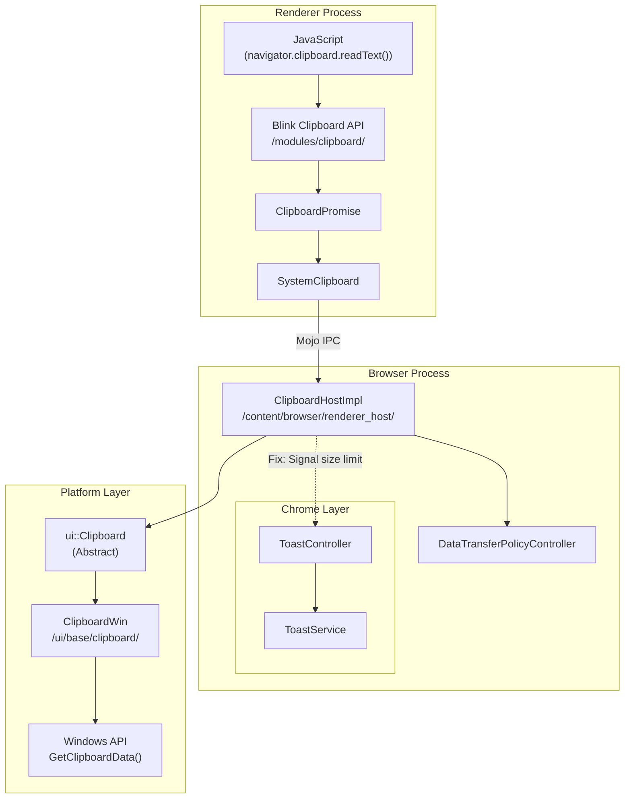
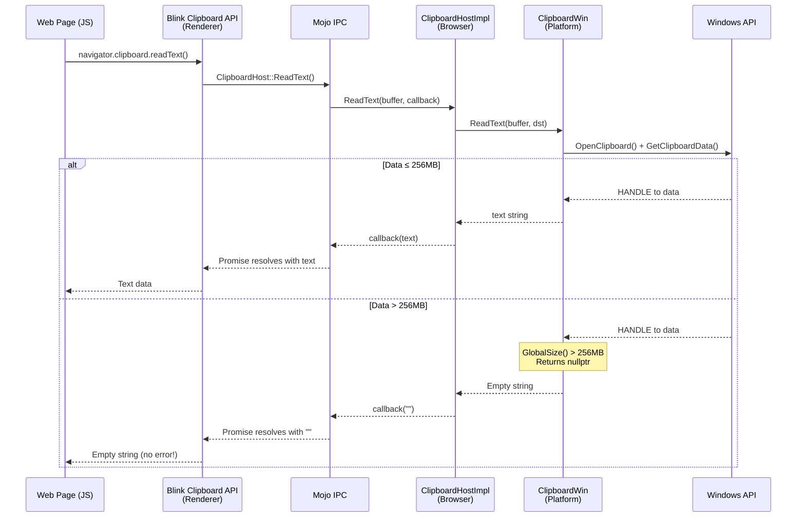
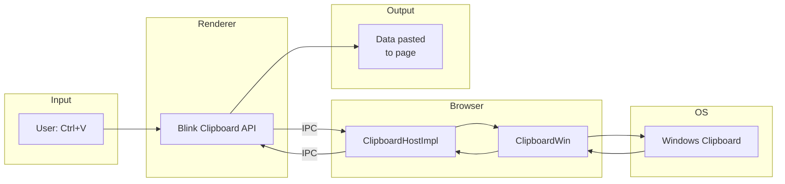
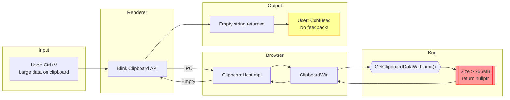
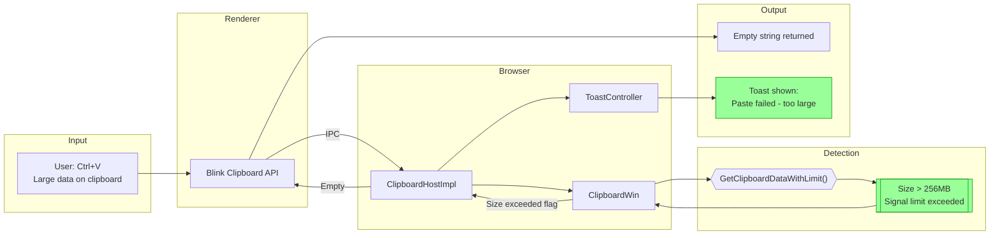

# High-Level Design: 470685260

## 1. Executive Summary
This document describes the architecture of Chrome's clipboard subsystem, specifically focusing on the flow from web page paste operations through to platform clipboard access. The bug occurs in the `GetClipboardDataWithLimit()` function in `clipboard_win.cc`, which silently returns `nullptr` when clipboard data exceeds 256MB, providing no feedback mechanism to inform users why paste failed.

## 2. System Context

### 2.1 Overview
Chrome's clipboard functionality spans multiple processes and layers:
- **Web Platform Layer** (Blink/Renderer): Provides the `navigator.clipboard` API and handles paste events
- **Content Layer** (Browser Process): `ClipboardHostImpl` acts as the IPC bridge between renderer and platform clipboard
- **UI Layer** (Platform): Platform-specific clipboard implementations (`ClipboardWin`, `ClipboardMac`, etc.)
- **Chrome UI Layer**: Toast notification system for user feedback

The 256MB limit is a Windows-specific safety measure introduced to prevent memory allocation failures when processing abnormally large clipboard content.

### 2.2 Related Specs
- [W3C Clipboard API Spec](https://w3c.github.io/clipboard-apis/)
- [Chromium Clipboard Design](https://chromium.googlesource.com/chromium/src/+/HEAD/ui/base/clipboard/README.md)
- [CL 7230896 - 256MB limit introduction](https://chromium-review.googlesource.com/c/chromium/src/+/7230896)
- [Chrome Toast UI README](/workspace/cr4/src/chrome/browser/ui/toasts/README.md)

## 3. Component Architecture

### 3.1 Major Components

| Component | Location | Responsibility |
|-----------|----------|----------------|
| Clipboard (Blink) | `/third_party/blink/renderer/modules/clipboard/` | Web API implementation for `navigator.clipboard` |
| ClipboardPromise | `/third_party/blink/renderer/modules/clipboard/clipboard_promise.cc` | Handles async clipboard operations |
| SystemClipboard | `/third_party/blink/renderer/core/clipboard/system_clipboard.h` | Renderer-side clipboard access |
| ClipboardHostImpl | `/content/browser/renderer_host/clipboard_host_impl.cc` | Browser-side IPC handler for clipboard |
| Clipboard (ui::) | `/ui/base/clipboard/clipboard.h` | Abstract clipboard interface |
| ClipboardWin | `/ui/base/clipboard/clipboard_win.cc` | Windows platform clipboard implementation |
| ToastController | `/chrome/browser/ui/toasts/toast_controller.h` | Manages toast notification display |
| ToastService | `/chrome/browser/ui/toasts/toast_service.cc` | Registers and configures toast types |

### 3.2 Component Diagram


## 4. Process Architecture

### 4.1 Process Boundaries
The clipboard subsystem operates across two main Chrome processes:

1. **Renderer Process** (sandboxed)
   - Runs JavaScript and Blink code
   - Cannot directly access system clipboard
   - Communicates via Mojo IPC

2. **Browser Process** (privileged)
   - Handles actual clipboard access
   - Applies security policies (DLP, permissions)
   - Has access to Chrome UI (toasts)

### 4.2 IPC Flow


## 5. Data Flow

### 5.1 Normal Flow (Expected - Data ≤ 256MB)


### 5.2 Buggy Flow (Current - Data > 256MB)


### 5.3 Proposed Fixed Flow


## 6. Key Interfaces

### 6.1 Public APIs (Web Platform)
- `navigator.clipboard.read()` - Reads clipboard items (async)
- `navigator.clipboard.readText()` - Reads plain text (async)
- `paste` event - Fired when user initiates paste

### 6.2 Internal Interfaces

**Mojo IPC (clipboard.mojom)**
```cpp
interface ClipboardHost {
  [Sync] ReadText(ClipboardBuffer buffer) => (BigString16 result);
  [Sync] ReadHtml(ClipboardBuffer buffer) => (...);
  [Sync] ReadPng(ClipboardBuffer buffer) => (BigBuffer png);
  // ... other read methods
}
```

**Browser-side (ClipboardHostImpl)**
```cpp
void ReadText(ui::ClipboardBuffer clipboard_buffer,
              ReadTextCallback callback);
void OnReadText(ui::ClipboardBuffer clipboard_buffer,
                ReadTextCallback callback,
                std::u16string text);
```

**Platform-side (ClipboardWin)**
```cpp
// Current - no size limit signaling
HANDLE GetClipboardDataWithLimit(UINT format);  // Returns nullptr on limit

// Proposed - could return status
void ReadText(ClipboardBuffer buffer,
              const DataTransferEndpoint* data_dst,
              std::u16string* result) const;
```

**Toast System**
```cpp
class ToastController {
  bool MaybeShowToast(ToastParams params);
};

struct ToastParams {
  ToastId toast_id;
  // ... optional overrides
};
```

## 7. Threading Model

- **Main Browser Thread (UI Thread)**
  - Handles clipboard operations in browser process
  - Toast display and management
  - Most `ClipboardHostImpl` operations

- **Renderer Main Thread**
  - JavaScript execution
  - Clipboard API calls
  - Mojo IPC dispatch

- **Clipboard Async Operations**
  - Some clipboard reads (e.g., `ReadPng`) use callbacks
  - Policy checks may be async

**Synchronization Points:**
- Mojo IPC calls are synchronous for most clipboard reads (`[Sync]` in mojom)
- Toast display is non-blocking (fire-and-forget)

## 8. External Dependencies

### 8.1 Other Chrome Components
- **Content Layer**: Document service, render frame host
- **Mojo**: IPC between processes
- **Toast UI System**: `chrome/browser/ui/toasts/`
- **Data Transfer Policy**: DLP checks for enterprise
- **Permissions**: Clipboard permission checks

### 8.2 Platform APIs
- **Windows**: `OpenClipboard()`, `GetClipboardData()`, `GlobalSize()`, `GlobalLock()`
- **macOS**: `NSPasteboard`
- **Linux/Ozone**: Various backend-specific APIs

### 8.3 Third-party Libraries
- **Skia**: Image processing for bitmap clipboard data
- **ICU**: Text encoding conversions

## 9. Impact of Fix

### 9.1 Components Affected

| Component | Change Type | Description |
|-----------|-------------|-------------|
| `toast_id.h` | Add enum | New `kPasteFailed` toast ID |
| `toast_service.cc` | Registration | Register paste failed toast spec |
| `generated_resources.grd` | String | Add localized message |
| `clipboard_win.cc` | Signal | Return size-exceeded status |
| `clipboard_host_impl.cc` | Trigger | Show toast on size limit |

### 9.2 Risk Assessment
- **Scope**: Narrow - Only affects paste operations >256MB on Windows
- **Risk Level**: Low
  - Uses existing, well-tested toast infrastructure
  - No behavioral change for normal operations
  - Graceful fallback if toast fails
- **Testing Coverage**:
  - Unit tests for toast triggering logic
  - Manual verification with large clipboard data
  - No regression risk for existing clipboard tests

### 9.3 Layering Considerations
The fix bridges two layers:
1. **ui/base/clipboard** (platform layer) - Must signal size limit exceeded
2. **chrome/browser/ui/toasts** (chrome layer) - Must display notification

Options for signaling:
- Return value/out parameter in clipboard methods
- Callback with error status
- Observer/listener pattern

The recommended approach (Option 1 from fix assessment) uses the existing toast infrastructure which is already integrated with the browser window features, minimizing cross-layer coupling.
