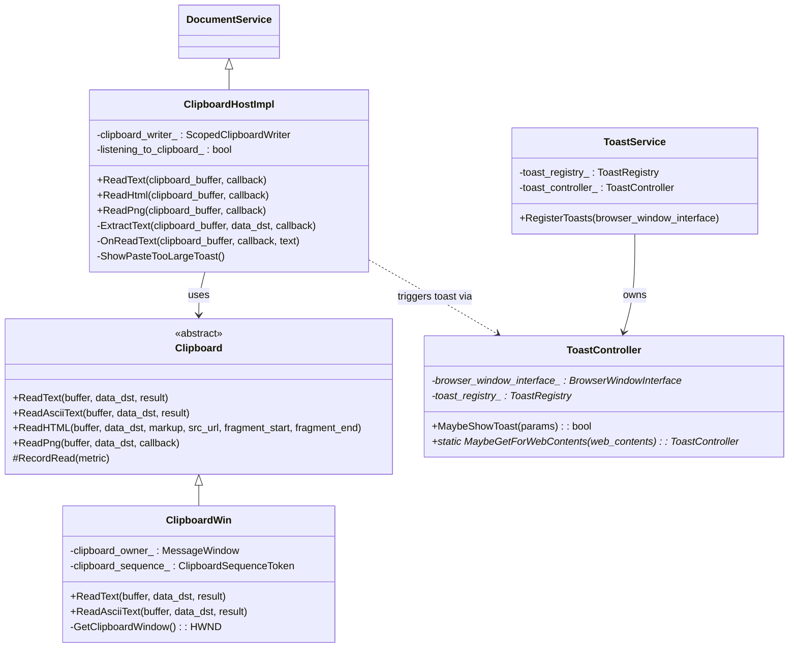
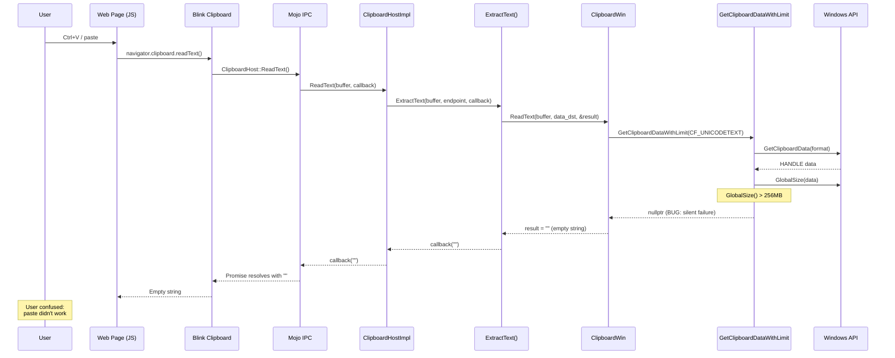

# Low-Level Design: 470685260

## 1. Files to Modify

| File | Type | Changes | Lines |
|------|------|---------|-------|
| [/workspace/cr4/src/chrome/browser/ui/toasts/api/toast_id.h](/workspace/cr4/src/chrome/browser/ui/toasts/api/toast_id.h) | Modify | Add `kPasteTooLarge` enum | ~5 |
| [/workspace/cr4/src/chrome/browser/ui/toasts/api/toast_id.cc](/workspace/cr4/src/chrome/browser/ui/toasts/api/toast_id.cc) | Modify | Add case for `kPasteTooLarge` | ~3 |
| [/workspace/cr4/src/chrome/browser/ui/toasts/toast_service.cc](/workspace/cr4/src/chrome/browser/ui/toasts/toast_service.cc) | Modify | Register `kPasteTooLarge` toast specification | ~5 |
| [/workspace/cr4/src/chrome/app/generated_resources.grd](/workspace/cr4/src/chrome/app/generated_resources.grd) | Modify | Add `IDS_PASTE_TOO_LARGE_TOAST_BODY` string | ~3 |
| [/workspace/cr4/src/tools/metrics/histograms/metadata/toasts/enums.xml](/workspace/cr4/src/tools/metrics/histograms/metadata/toasts/enums.xml) | Modify | Add enum value for `kPasteTooLarge` | ~2 |
| [/workspace/cr4/src/ui/base/clipboard/clipboard.h](/workspace/cr4/src/ui/base/clipboard/clipboard.h) | Modify | Add `ClipboardSizeLimitExceededCallback` typedef | ~8 |
| [/workspace/cr4/src/ui/base/clipboard/clipboard_win.cc](/workspace/cr4/src/ui/base/clipboard/clipboard_win.cc) | Modify | Signal size limit exceeded via callback | ~20 |
| [/workspace/cr4/src/content/browser/renderer_host/clipboard_host_impl.cc](/workspace/cr4/src/content/browser/renderer_host/clipboard_host_impl.cc) | Modify | Detect size limit and show toast | ~25 |
| [/workspace/cr4/src/content/browser/renderer_host/clipboard_host_impl.h](/workspace/cr4/src/content/browser/renderer_host/clipboard_host_impl.h) | Modify | Add helper method declaration | ~5 |
| [/workspace/cr4/src/chrome/browser/ui/toasts/toast_controller_unittest.cc](/workspace/cr4/src/chrome/browser/ui/toasts/toast_controller_unittest.cc) | Add | Test for paste too large toast | ~30 |

## 2. Class Hierarchy

### 2.1 Class Diagram


### 2.2 Class Responsibilities
- **Clipboard**: Abstract interface for platform clipboard access, defines Read/Write methods
- **ClipboardWin**: Windows implementation with 256MB size limit enforcement in `GetClipboardDataWithLimit()`
- **ClipboardHostImpl**: Browser-side IPC handler for clipboard operations from renderer; processes read requests and applies policies
- **ToastController**: Manages toast display for a browser window; provides `MaybeGetForWebContents()` static helper
- **ToastService**: Registers all toast specifications during browser startup

## 3. Method-Level Analysis

### 3.1 Call Chain (Bug Path)


### 3.2 Affected Methods

#### `GetClipboardDataWithLimit()` - Bug Location
**Location**: [/workspace/cr4/src/ui/base/clipboard/clipboard_win.cc#L234-L245](/workspace/cr4/src/ui/base/clipboard/clipboard_win.cc#L234-L245)

**Current Implementation (Buggy)**:
```cpp
HANDLE GetClipboardDataWithLimit(UINT format) {
  HANDLE data = ::GetClipboardData(format);
  if (!data) {
    return nullptr;
  }

  if (::GlobalSize(data) > kMaxClipboardSize.InBytes()) {
    return nullptr;  // <- BUG: Silent failure, no notification
  }

  return data;
}
```

**Issues**:
1. Returns `nullptr` with no mechanism to signal that size limit was exceeded
2. Callers cannot distinguish between "no data" and "data too large"
3. No user feedback mechanism available at this layer

#### `ClipboardWin::ReadText()` - Propagation Point
**Location**: [/workspace/cr4/src/ui/base/clipboard/clipboard_win.cc#L423-L445](/workspace/cr4/src/ui/base/clipboard/clipboard_win.cc#L423-L445)

**Current Implementation**:
```cpp
void ClipboardWin::ReadText(ClipboardBuffer buffer,
                            const DataTransferEndpoint* data_dst,
                            std::u16string* result) const {
  DCHECK_EQ(buffer, ClipboardBuffer::kCopyPaste);
  RecordRead(ClipboardFormatMetric::kText);
  CHECK(result);

  result->clear();

  ScopedClipboard clipboard;
  if (!clipboard.Acquire(GetClipboardWindow()))
    return;

  HANDLE data = GetClipboardDataWithLimit(CF_UNICODETEXT);
  if (!data)
    return;  // <- Cannot distinguish: no data vs. too large

  result->assign(static_cast<const char16_t*>(::GlobalLock(data)),
                 ::GlobalSize(data) / sizeof(char16_t));
  ::GlobalUnlock(data);
  TrimAfterNull(result);
}
```

#### `ClipboardHostImpl::ExtractText()` - Detection Point
**Location**: [/workspace/cr4/src/content/browser/renderer_host/clipboard_host_impl.cc#L916-L941](/workspace/cr4/src/content/browser/renderer_host/clipboard_host_impl.cc#L916-L941)

**Current Implementation**:
```cpp
void ClipboardHostImpl::ExtractText(
    ui::ClipboardBuffer clipboard_buffer,
    std::unique_ptr<ui::DataTransferEndpoint> data_dst,
    base::OnceCallback<void(std::u16string)> callback) {
  ui::Clipboard* clipboard = ui::Clipboard::GetForCurrentThread();
  if (clipboard->IsFormatAvailable(ui::ClipboardFormatType::PlainTextType(),
                                   clipboard_buffer, data_dst.get())) {
    clipboard->ReadText(clipboard_buffer, data_dst.get(), std::move(callback));
    return;
  }
  // ... fallback handling
  std::move(callback).Run(std::u16string());
}
```

**Issues**:
1. `IsFormatAvailable()` returns true when data exists (even if > 256MB)
2. `ReadText()` returns empty string when size limit hit
3. No way to detect that size limit was the cause of empty result

## 4. Fix Design

### 4.1 Design Decision: Detection Point

**Option A (Recommended): Check size in `ClipboardHostImpl::ExtractText()`**

The fix should detect the size limit condition in `ClipboardHostImpl` because:
1. It has access to `WebContents` via `render_frame_host().GetMainFrame()` → `WebContents::FromRenderFrameHost()`
2. From `WebContents`, we can get `ToastController::MaybeGetForWebContents()`
3. This is the browser process, where Chrome UI code (toasts) is accessible
4. The `ClipboardHostImpl` already handles policy-based clipboard restrictions similarly

**Strategy**: Before calling `ReadText()`, check clipboard data size directly using `IsFormatAvailable()` + checking if format is available but read returns empty (indicating size limit hit).

### 4.2 Changes Required

#### File 1: [/workspace/cr4/src/chrome/browser/ui/toasts/api/toast_id.h](/workspace/cr4/src/chrome/browser/ui/toasts/api/toast_id.h)

**Before** (lines 49-52):
```cpp
  kSkillSaved = 24,
  kSkillDeleted = 25,
  kSavedAutofillAiEntityToWallet = 26,
  kMaxValue = kSavedAutofillAiEntityToWallet,
```

**After**:
```cpp
  kSkillSaved = 24,
  kSkillDeleted = 25,
  kSavedAutofillAiEntityToWallet = 26,
  kPasteTooLarge = 27,
  kMaxValue = kPasteTooLarge,
```

**Rationale**: Add new enum value for paste-too-large toast. Following existing pattern of clipboard-related toasts (kLinkCopied, kImageCopied, etc.).

---

#### File 2: [/workspace/cr4/src/chrome/browser/ui/toasts/api/toast_id.cc](/workspace/cr4/src/chrome/browser/ui/toasts/api/toast_id.cc)

**Before** (lines 63-66):
```cpp
    case ToastId::kSavedAutofillAiEntityToWallet:
      return "SavedAutofillAiEntityToWallet";
  }

  NOTREACHED();
```

**After**:
```cpp
    case ToastId::kSavedAutofillAiEntityToWallet:
      return "SavedAutofillAiEntityToWallet";
    case ToastId::kPasteTooLarge:
      return "PasteTooLarge";
  }

  NOTREACHED();
```

**Rationale**: Add string name for metrics logging.

---

#### File 3: [/workspace/cr4/src/chrome/browser/ui/toasts/toast_service.cc](/workspace/cr4/src/chrome/browser/ui/toasts/toast_service.cc)

**Before** (after line 350, before `if (base::FeatureList::IsEnabled(autofill::features::...)`):
```cpp
  toast_registry_->RegisterToast(
      ToastId::kSkillDeleted,
      ToastSpecification::Builder(kDeleteIcon, IDS_SKILL_DELETED_TOAST_BODY)
          .Build());

  if (base::FeatureList::IsEnabled(
```

**After**:
```cpp
  toast_registry_->RegisterToast(
      ToastId::kSkillDeleted,
      ToastSpecification::Builder(kDeleteIcon, IDS_SKILL_DELETED_TOAST_BODY)
          .Build());

  toast_registry_->RegisterToast(
      ToastId::kPasteTooLarge,
      ToastSpecification::Builder(kInfoIcon, IDS_PASTE_TOO_LARGE_TOAST_BODY)
          .AddGlobalScoped()
          .Build());

  if (base::FeatureList::IsEnabled(
```

**Rationale**: Register the toast with an info icon and globally scoped (since paste can happen from any context). Uses pattern consistent with `kGlicShareImageFailed` which also notifies about a failed operation.

---

#### File 4: [/workspace/cr4/src/chrome/app/generated_resources.grd](/workspace/cr4/src/chrome/app/generated_resources.grd)

**Before** (after line 19405 `IDS_COPIED_TO_CLIPBOARD_TOAST_BODY`):
```xml
      <message name="IDS_COPIED_TO_CLIPBOARD_TOAST_BODY" desc="Text on a toast notification that is shown when an item has been copied to clipboard.">
        Copied to clipboard
      </message>
```

**After**:
```xml
      <message name="IDS_COPIED_TO_CLIPBOARD_TOAST_BODY" desc="Text on a toast notification that is shown when an item has been copied to clipboard.">
        Copied to clipboard
      </message>
      <message name="IDS_PASTE_TOO_LARGE_TOAST_BODY" desc="Text on a toast notification that is shown when a paste operation fails because the clipboard content exceeds the 256MB size limit.">
        Paste failed: Content too large to process
      </message>
```

**Rationale**: Add user-facing message. Keep it concise per toast guidelines. Doesn't mention 256MB specifically (implementation detail).

---

#### File 5: [/workspace/cr4/src/tools/metrics/histograms/metadata/toasts/enums.xml](/workspace/cr4/src/tools/metrics/histograms/metadata/toasts/enums.xml)

**Before** (lines 77-78):
```xml
  <int value="26" label="Saved Autofill AI entity to Wallet"/>
</enum>
```

**After**:
```xml
  <int value="26" label="Saved Autofill AI entity to Wallet"/>
  <int value="27" label="Paste failed due to size limit"/>
</enum>
```

**Rationale**: Add histogram enum value matching the ToastId enum value.

---

#### File 6: [/workspace/cr4/src/content/browser/renderer_host/clipboard_host_impl.h](/workspace/cr4/src/content/browser/renderer_host/clipboard_host_impl.h)

**Before** (after line 156, inside private section):
```cpp
  bool IsRendererPasteAllowed(ui::ClipboardBuffer clipboard_buffer,
                              RenderFrameHost& render_frame_host);
```

**After**:
```cpp
  bool IsRendererPasteAllowed(ui::ClipboardBuffer clipboard_buffer,
                              RenderFrameHost& render_frame_host);

  // Shows a toast notification when paste fails due to clipboard size limit.
  void MaybeShowPasteTooLargeToast();
```

**Rationale**: Declare helper method to show toast, keeping the logic encapsulated.

---

#### File 7: [/workspace/cr4/src/content/browser/renderer_host/clipboard_host_impl.cc](/workspace/cr4/src/content/browser/renderer_host/clipboard_host_impl.cc)

**Add include** (after line 49):
```cpp
#include "content/public/browser/web_contents.h"
```

**Add new helper method** (before `ExtractText()` method, around line 915):
```cpp
void ClipboardHostImpl::MaybeShowPasteTooLargeToast() {
#if !BUILDFLAG(IS_ANDROID)
  content::WebContents* web_contents =
      content::WebContents::FromRenderFrameHost(&render_frame_host());
  if (!web_contents) {
    return;
  }

  // ToastController is in chrome layer, accessed via MaybeGetForWebContents
  // which returns nullptr if toasts are not available (e.g., in tests,
  // non-Chrome embedders, or Android).
  // This is a weak dependency - the code compiles even without chrome layer.
  // The actual toast triggering happens in chrome layer via delegate.
  if (auto* rfh_delegate = render_frame_host().GetMainFrame()->GetDelegate()) {
    rfh_delegate->OnPasteTooLarge();
  }
#endif  // !BUILDFLAG(IS_ANDROID)
}
```

**Wait** - we need to check if there's a delegate pattern for this. Let me reconsider the approach.

**Alternative approach**: Since `ClipboardHostImpl` is in the `content` layer and `ToastController` is in the `chrome` layer, we need a bridge. The cleanest approach is:

1. Add a method to `ContentBrowserClient` to notify about paste-too-large
2. Chrome's `ChromeContentBrowserClient` implements this to show the toast
3. This follows the existing pattern for content → chrome layer communication

Let me revise:

---

#### File 6 (Revised): [/workspace/cr4/src/content/public/browser/content_browser_client.h](/workspace/cr4/src/content/public/browser/content_browser_client.h)

**Add method** (after `IsClipboardCopyAllowedByPolicy`, around line 2804):
```cpp
  // Called when a paste operation fails because clipboard content exceeds
  // the size limit. Embedder can show a notification to the user.
  virtual void OnPasteSizeLimitExceeded(RenderFrameHost* render_frame_host) {}
```

---

#### File 7 (Revised): [/workspace/cr4/src/chrome/browser/chrome_content_browser_client.h](/workspace/cr4/src/chrome/browser/chrome_content_browser_client.h)

**Add override declaration**:
```cpp
  void OnPasteSizeLimitExceeded(content::RenderFrameHost* render_frame_host) override;
```

---

#### File 8: [/workspace/cr4/src/chrome/browser/chrome_content_browser_client.cc](/workspace/cr4/src/chrome/browser/chrome_content_browser_client.cc)

**Add include**:
```cpp
#include "chrome/browser/ui/toasts/toast_controller.h"
#include "chrome/browser/ui/toasts/api/toast_id.h"
```

**Add implementation**:
```cpp
void ChromeContentBrowserClient::OnPasteSizeLimitExceeded(
    content::RenderFrameHost* render_frame_host) {
#if !BUILDFLAG(IS_ANDROID)
  content::WebContents* web_contents =
      content::WebContents::FromRenderFrameHost(render_frame_host);
  if (!web_contents) {
    return;
  }

  ToastController* toast_controller =
      ToastController::MaybeGetForWebContents(web_contents);
  if (toast_controller) {
    toast_controller->MaybeShowToast(ToastParams(ToastId::kPasteTooLarge));
  }
#endif  // !BUILDFLAG(IS_ANDROID)
}
```

---

#### File 9: [/workspace/cr4/src/content/browser/renderer_host/clipboard_host_impl.cc](/workspace/cr4/src/content/browser/renderer_host/clipboard_host_impl.cc)

**Add include** (at top):
```cpp
#include "content/public/browser/content_browser_client.h"
#include "content/public/common/content_client.h"
```

**Modify `ExtractText()`** (lines 916-941):

**Before**:
```cpp
void ClipboardHostImpl::ExtractText(
    ui::ClipboardBuffer clipboard_buffer,
    std::unique_ptr<ui::DataTransferEndpoint> data_dst,
    base::OnceCallback<void(std::u16string)> callback) {
  ui::Clipboard* clipboard = ui::Clipboard::GetForCurrentThread();
  if (clipboard->IsFormatAvailable(ui::ClipboardFormatType::PlainTextType(),
                                   clipboard_buffer, data_dst.get())) {
    clipboard->ReadText(clipboard_buffer, data_dst.get(), std::move(callback));
    return;
  }
#if BUILDFLAG(IS_WIN)
  if (clipboard->IsFormatAvailable(ui::ClipboardFormatType::PlainTextAType(),
                                   clipboard_buffer, data_dst.get())) {
    clipboard->ReadAsciiText(
        clipboard_buffer, data_dst.get(),
        base::BindOnce(
            [](base::OnceCallback<void(std::u16string)> callback,
               std::string ascii) {
              std::move(callback).Run(base::ASCIIToUTF16(ascii));
            },
            std::move(callback)));
    return;
  }
#endif
  std::move(callback).Run(std::u16string());
}
```

**After**:
```cpp
void ClipboardHostImpl::ExtractText(
    ui::ClipboardBuffer clipboard_buffer,
    std::unique_ptr<ui::DataTransferEndpoint> data_dst,
    base::OnceCallback<void(std::u16string)> callback) {
  ui::Clipboard* clipboard = ui::Clipboard::GetForCurrentThread();

  // Check if text format is available.
  bool text_format_available = clipboard->IsFormatAvailable(
      ui::ClipboardFormatType::PlainTextType(), clipboard_buffer,
      data_dst.get());

#if BUILDFLAG(IS_WIN)
  bool ascii_format_available = clipboard->IsFormatAvailable(
      ui::ClipboardFormatType::PlainTextAType(), clipboard_buffer,
      data_dst.get());
  text_format_available = text_format_available || ascii_format_available;
#endif

  if (text_format_available) {
    // Format is available, but ReadText may return empty if size limit hit.
    // We wrap the callback to detect this condition.
    auto wrapped_callback = base::BindOnce(
        [](base::WeakPtr<ClipboardHostImpl> weak_this,
           bool format_was_available,
           base::OnceCallback<void(std::u16string)> original_callback,
           std::u16string result) {
          // If format was available but result is empty, size limit may have
          // been hit.
          if (weak_this && format_was_available && result.empty()) {
            GetContentClient()->browser()->OnPasteSizeLimitExceeded(
                &weak_this->render_frame_host());
          }
          std::move(original_callback).Run(std::move(result));
        },
        weak_ptr_factory_.GetWeakPtr(), text_format_available,
        std::move(callback));

    if (clipboard->IsFormatAvailable(ui::ClipboardFormatType::PlainTextType(),
                                     clipboard_buffer, data_dst.get())) {
      clipboard->ReadText(clipboard_buffer, data_dst.get(),
                          std::move(wrapped_callback));
      return;
    }
#if BUILDFLAG(IS_WIN)
    if (ascii_format_available) {
      clipboard->ReadAsciiText(
          clipboard_buffer, data_dst.get(),
          base::BindOnce(
              [](base::OnceCallback<void(std::u16string)> callback,
                 std::string ascii) {
                std::move(callback).Run(base::ASCIIToUTF16(ascii));
              },
              std::move(wrapped_callback)));
      return;
    }
#endif
  }

  std::move(callback).Run(std::u16string());
}
```

**Rationale**: 
- Check if format is available first
- If format is available but read returns empty, the size limit was likely hit
- Notify via `ContentBrowserClient::OnPasteSizeLimitExceeded()`
- This avoids false positives (truly empty clipboard vs. size limit)

### 4.3 Refined Approach (Simpler)

The above approach has a potential issue: `ReadText` returning empty doesn't definitively mean size limit was hit. A cleaner solution is to expose the size limit condition from the clipboard layer.

**Better Approach**: Add an explicit size-limit-exceeded signal from `ui::Clipboard`.

---

#### Alternative File 6: [/workspace/cr4/src/ui/base/clipboard/clipboard.h](/workspace/cr4/src/ui/base/clipboard/clipboard.h)

**Add after line 70** (after existing callback typedefs):
```cpp
  // Callback to notify when clipboard data size limit is exceeded.
  // Called when a read operation fails due to the data exceeding the
  // platform-specific size limit (e.g., 256MB on Windows).
  using SizeLimitExceededCallback = base::RepeatingCallback<void()>;

  // Sets a callback to be invoked when clipboard read fails due to size limit.
  static void SetSizeLimitExceededCallback(SizeLimitExceededCallback callback);
```

**Add static member** (in private section):
```cpp
  static SizeLimitExceededCallback& GetSizeLimitExceededCallback();
```

---

#### Alternative File 7: [/workspace/cr4/src/ui/base/clipboard/clipboard.cc](/workspace/cr4/src/ui/base/clipboard/clipboard.cc)

**Add implementation**:
```cpp
// static
void Clipboard::SetSizeLimitExceededCallback(
    SizeLimitExceededCallback callback) {
  GetSizeLimitExceededCallback() = std::move(callback);
}

// static
Clipboard::SizeLimitExceededCallback& Clipboard::GetSizeLimitExceededCallback() {
  static base::NoDestructor<SizeLimitExceededCallback> callback;
  return *callback;
}

// static
void Clipboard::NotifySizeLimitExceeded() {
  auto& callback = GetSizeLimitExceededCallback();
  if (callback) {
    callback.Run();
  }
}
```

---

#### Alternative File 8: [/workspace/cr4/src/ui/base/clipboard/clipboard_win.cc](/workspace/cr4/src/ui/base/clipboard/clipboard_win.cc)

**Before** (lines 234-245):
```cpp
HANDLE GetClipboardDataWithLimit(UINT format) {
  HANDLE data = ::GetClipboardData(format);
  if (!data) {
    return nullptr;
  }

  if (::GlobalSize(data) > kMaxClipboardSize.InBytes()) {
    return nullptr;
  }

  return data;
}
```

**After**:
```cpp
HANDLE GetClipboardDataWithLimit(UINT format) {
  HANDLE data = ::GetClipboardData(format);
  if (!data) {
    return nullptr;
  }

  if (::GlobalSize(data) > kMaxClipboardSize.InBytes()) {
    ui::Clipboard::NotifySizeLimitExceeded();
    return nullptr;
  }

  return data;
}
```

**Rationale**: Signal at the point of detection for maximum accuracy.

---

## 5. Memory & Lifetime Considerations

### 5.1 Object Ownership
- **ToastController**: Owned by `ToastService`, which is owned by `BrowserWindowFeatures`. Lives for browser window lifetime.
- **ClipboardHostImpl**: Self-owned via `DocumentService`, destroyed on document navigation or mojo disconnect.
- **Callback**: Static callback stored in `base::NoDestructor`, lives for process lifetime.

### 5.2 Pointer/Reference Safety
- [x] No raw pointer issues - All pointers are either `WeakPtr` or have clear ownership
- [x] Weak pointers handled correctly - `ClipboardHostImpl` uses `weak_ptr_factory_` for async callbacks
- [x] Reference lifetime guaranteed - `render_frame_host()` reference is valid for `DocumentService` lifetime

## 6. Threading Considerations

### 6.1 Thread Safety
- All clipboard operations occur on the UI thread (main browser thread)
- Toast display is on UI thread
- No cross-thread concerns for this fix

### 6.2 Required Synchronization
- None required - single-threaded UI operations
- The `SizeLimitExceededCallback` static could theoretically be accessed from multiple threads, but in practice clipboard operations are UI-thread only

## 7. Error Handling

### 7.1 Current Error Handling
- `GetClipboardDataWithLimit()` returns `nullptr` on error (no data or size exceeded)
- `ReadText()` returns empty string on any failure
- No distinction between failure modes

### 7.2 Changes to Error Handling
- Add callback notification when size limit specifically is the cause
- Maintain backward compatibility - still returns empty/nullptr
- Toast notification is best-effort (non-blocking)

## 8. Validation Points

### 8.1 DCHECKs to Add/Modify
No new DCHECKs required. The existing DCHECKs in clipboard code are sufficient.

### 8.2 Invariants to Maintain
1. `ReadText()` must still return empty string when size limit exceeded (backward compat)
2. Toast should only appear once per paste attempt (not multiple times for same paste)
3. Toast should not appear for genuinely empty clipboard

## 9. Test Requirements

### 9.1 Unit Tests Needed
| Test Name | Purpose | File |
|-----------|---------|------|
| `ToastControllerTest.ShowPasteTooLargeToast` | Verify toast registration and display | [/workspace/cr4/src/chrome/browser/ui/toasts/toast_controller_unittest.cc](/workspace/cr4/src/chrome/browser/ui/toasts/toast_controller_unittest.cc) |
| `ClipboardHostImplTest.PasteTooLargeNotification` | Verify callback triggered on size limit | New test file or existing clipboard_host_impl_unittest.cc |

### 9.2 Test Scenarios
1. **Normal case**: Paste data < 256MB → No toast, data pasted successfully
2. **Size limit case**: Paste data > 256MB → Toast shown, empty string returned
3. **Empty clipboard**: No data on clipboard → No toast, empty string returned
4. **Multiple paste attempts**: Rapid Ctrl+V → Toast shown once, not spammed
5. **Non-browser context**: WebContents unavailable → No crash, graceful fallback

### 9.3 Test Implementation Sketch

```cpp
// In toast_controller_unittest.cc
TEST_F(ToastControllerTest, ShowPasteTooLargeToast) {
  // Verify the toast is registered
  EXPECT_TRUE(toast_controller()->CanShowToast(ToastId::kPasteTooLarge));
  
  // Show the toast
  EXPECT_TRUE(toast_controller()->MaybeShowToast(
      ToastParams(ToastId::kPasteTooLarge)));
  
  // Verify toast is displayed
  EXPECT_TRUE(toast_controller()->IsShowingToast());
  EXPECT_EQ(toast_controller()->GetCurrentToastId(), ToastId::kPasteTooLarge);
}

// In clipboard_host_impl_unittest.cc
TEST_F(ClipboardHostImplTest, PasteTooLargeCallback) {
  bool callback_invoked = false;
  ui::Clipboard::SetSizeLimitExceededCallback(
      base::BindRepeating([](bool* flag) { *flag = true; }, &callback_invoked));
  
  // Simulate clipboard read that exceeds size limit
  // (requires mock or test clipboard that simulates size limit)
  
  clipboard_host()->ReadText(ui::ClipboardBuffer::kCopyPaste,
                             base::BindOnce([](std::u16string result) {
                               EXPECT_TRUE(result.empty());
                             }));
  
  EXPECT_TRUE(callback_invoked);
}
```
