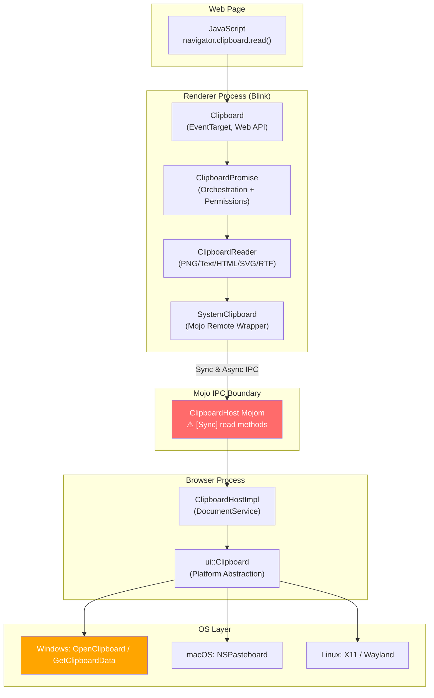
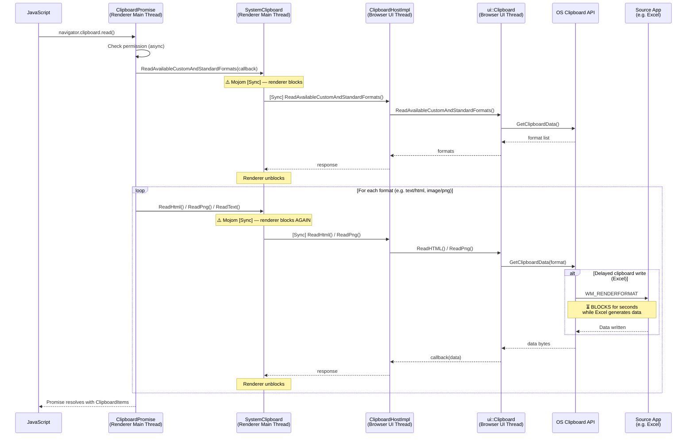
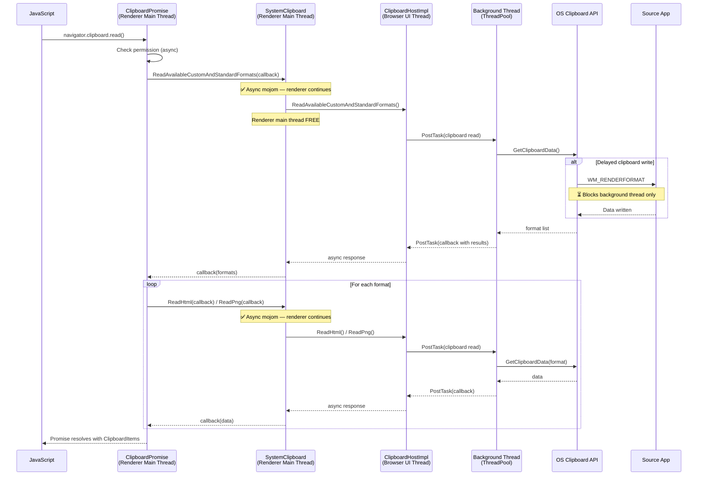
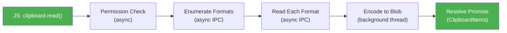
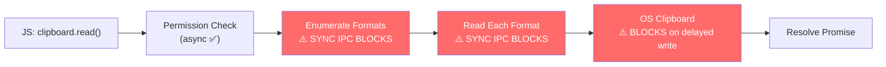
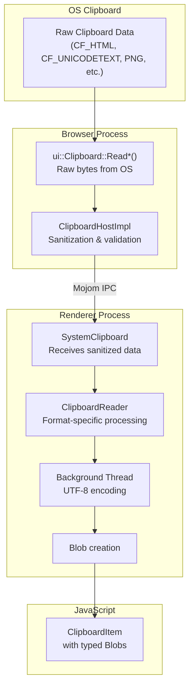

# High-Level Design: 474131935

## 1. Executive Summary

The Async Clipboard API (`navigator.clipboard.read()` / `readText()`) in Chromium blocks the renderer main thread because the underlying mojom IPC calls between the renderer and browser processes are marked `[Sync]`. On the browser side, the `ui::Clipboard` read operations perform blocking OS clipboard calls on the UI thread. When a source application (e.g., Microsoft Excel) uses delayed clipboard writes, the OS call blocks until the source app finishes generating data, freezing the entire browser. The fix involves converting the synchronous mojom read methods to asynchronous ones for the Async Clipboard API code path, while preserving synchronous variants for legacy callers (DataTransfer/paste events).

## 2. System Context

### 2.1 Overview

The Clipboard subsystem in Chromium spans four architectural layers:

1. **Web Platform Layer** – The `Clipboard` interface exposed to JavaScript via `navigator.clipboard`, returning Promises.
2. **Blink Renderer Layer** – `ClipboardPromise` orchestrates permission checks and data reads; `ClipboardReader` subclasses convert clipboard data to Blobs; `SystemClipboard` wraps the mojom IPC remote to the browser.
3. **Browser Process Layer** – `ClipboardHostImpl` implements the `ClipboardHost` mojom interface, bridging renderer requests to the platform clipboard.
4. **Platform Abstraction Layer** – `ui::Clipboard` provides OS-agnostic clipboard access, with platform-specific implementations (e.g., `ClipboardWin`, `ClipboardMac`, `ClipboardOzone`).

The bug occurs at the boundary between layers 2 and 3: the mojom IPC interface uses `[Sync]` calls for most read methods, blocking the renderer. On the browser side (layer 3→4), `ui::Clipboard` read methods wrap synchronous OS calls, blocking the UI thread.

### 2.2 Related Specs
- [W3C Clipboard API and events](https://w3c.github.io/clipboard-apis/) – `read()` and `readText()` return Promises, expected to be non-blocking
- [crbug.com/443355](https://crbug.com/443355) – "Synchronous clipboard reads are deprecated" – confirms the long-term direction of removing `[Sync]`
- [crbug.com/474131935](https://issues.chromium.org/issues/474131935) – This bug report
- [crbug.com/815425](https://crbug.com/815425) – Related: clipboard lock contention with rdpclip.exe

## 3. Component Architecture

### 3.1 Major Components

| Component | Location | Responsibility |
|-----------|----------|----------------|
| `Clipboard` (Web API) | `/third_party/blink/renderer/modules/clipboard/clipboard.{h,cc}` | Exposes `navigator.clipboard.read()`/`readText()`/`write()`/`writeText()` to JavaScript; returns ScriptPromise |
| `ClipboardPromise` | `/third_party/blink/renderer/modules/clipboard/clipboard_promise.{h,cc}` | Orchestrates permission checks, coordinates format enumeration and per-format reads, resolves/rejects the JS Promise |
| `ClipboardReader` | `/third_party/blink/renderer/modules/clipboard/clipboard_reader.{h,cc}` | Base class + per-format subclasses (PNG, Text, HTML, SVG, RTF, Custom) that read clipboard data and encode it into Blobs |
| `SystemClipboard` | `/third_party/blink/renderer/core/clipboard/system_clipboard.{h,cc}` | Renderer-side wrapper around `mojom::blink::ClipboardHost` mojo remote; provides both sync and async read/write methods |
| `ClipboardHost` (mojom) | `/third_party/blink/public/mojom/clipboard/clipboard.mojom` | Mojo interface definition for renderer↔browser IPC; most read methods marked `[Sync]` |
| `ClipboardHostImpl` | `/content/browser/renderer_host/clipboard_host_impl.{h,cc}` | Browser-side implementation of `ClipboardHost` mojom; runs on the UI thread; delegates to `ui::Clipboard` |
| `ui::Clipboard` | `/ui/base/clipboard/clipboard.{h,cc}` | Platform-agnostic clipboard abstraction; async callback methods wrap synchronous platform calls |
| `ClipboardWin` | `/ui/base/clipboard/clipboard_win.cc` | Windows implementation; calls `::OpenClipboard()`, `::GetClipboardData()`, handles `WM_RENDERFORMAT` |
| `ClipboardMac` | `/ui/base/clipboard/clipboard_mac.mm` | macOS implementation via NSPasteboard |
| `ClipboardOzone` | `/ui/base/clipboard/clipboard_ozone.cc` | Linux/ChromeOS implementation via Ozone (X11/Wayland) |

### 3.2 Component Diagram

## 4. Process Architecture

### 4.1 Process Boundaries

Two Chrome processes are involved:

| Process | Thread | Components | Role |
|---------|--------|------------|------|
| **Renderer** | Main thread | Clipboard, ClipboardPromise, ClipboardReader, SystemClipboard | Handles JS API, permission checks, data format conversion |
| **Renderer** | Worker pool | ClipboardReader (encoding) | UTF-8 encoding for text/html/svg (off main thread) |
| **Browser** | UI thread | ClipboardHostImpl, ui::Clipboard | Receives mojom IPC, performs OS clipboard access |

**The problem**: Both the renderer main thread and browser UI thread block during a synchronous clipboard read. The renderer blocks on `[Sync]` mojom IPC, and the browser blocks on OS clipboard APIs (especially `::GetClipboardData()` on Windows when delayed writes are involved).

### 4.2 IPC Flow – Current (Buggy)

### 4.3 IPC Flow – Fixed (Async)

## 5. Data Flow

### 5.1 Normal Flow (Expected — Async, Non-Blocking)

### 5.2 Buggy Flow (Current — Sync, Blocking)

### 5.3 Data Transformation Pipeline

## 6. Key Interfaces

### 6.1 Public APIs (Web Platform)

- `navigator.clipboard.read(options?)` → `Promise<ClipboardItem[]>` — Reads all available formats as ClipboardItems
- `navigator.clipboard.readText()` → `Promise<string>` — Reads plain text from clipboard
- `navigator.clipboard.write(items)` → `Promise<void>` — Writes ClipboardItems to clipboard
- `navigator.clipboard.writeText(text)` → `Promise<void>` — Writes plain text to clipboard

### 6.2 Mojom Interface (IPC Boundary)

**`ClipboardHost` (clipboard.mojom)** — The critical interface where the bug manifests:

| Method | Sync? | Used by Async API? | Issue |
|--------|-------|--------------------|-------|
| `ReadAvailableTypes()` | `[Sync]` | Yes (format enumeration) | Blocks renderer |
| `ReadAvailableCustomAndStandardFormats()` | `[Sync]` | Yes (format enumeration) | Blocks renderer |
| `ReadText()` | `[Sync]` | Yes (readText path) | Blocks renderer |
| `ReadHtml()` | `[Sync]` | Yes (read path) | Blocks renderer |
| `ReadPng()` | `[Sync]` | Yes (read path) | Blocks renderer |
| `ReadRtf()` | `[Sync]` | Yes (read path) | Blocks renderer |
| `ReadFiles()` | `[Sync]` | Yes (read path) | Blocks renderer |
| `ReadDataTransferCustomData()` | `[Sync]` | Yes (read path) | Blocks renderer |
| `ReadSvg()` | **Async** | Yes | ✅ Already non-blocking |
| `ReadUnsanitizedCustomFormat()` | **Async** | Yes | ✅ Already non-blocking |

### 6.3 Internal Interfaces

- `SystemClipboard::ReadPlainText(buffer)` → `String` — Sync read (calls `[Sync]` mojom)
- `SystemClipboard::ReadPlainText(buffer, callback)` → `void` — Async read (still calls `[Sync]` mojom under the hood)
- `SystemClipboard::ReadHTML(callback)` → `void` — Async read
- `SystemClipboard::ReadPng(buffer)` → `mojo_base::BigBuffer` — Sync read only (no async overload)
- `ClipboardHostImpl::ReadText(buffer, callback)` — Browser-side handler
- `ui::Clipboard::ReadText(buffer, endpoint, callback)` — Platform abstraction; wraps sync call, NOT truly async

## 7. Threading Model

### 7.1 Thread Responsibilities

| Thread | Process | Responsibilities |
|--------|---------|-----------------|
| **Renderer Main Thread** | Renderer | Runs all JS, Blink DOM, ClipboardPromise orchestration, SystemClipboard mojo calls |
| **Renderer Worker Pool** | Renderer | ClipboardReader encoding (UTF-8 for text/html/svg) via `worker_pool::PostTask()` |
| **Browser UI Thread** | Browser | Runs ClipboardHostImpl, receives mojom IPC, calls ui::Clipboard |
| **Browser IO Thread** | Browser | Mojo IPC message routing |

### 7.2 Current Blocking Points

1. **Renderer Main Thread** blocks on `[Sync]` mojom IPC to browser (entire thread suspended until response)
2. **Browser UI Thread** blocks on `ui::Clipboard::ReadText()` → OS clipboard API (e.g., `::GetClipboardData()` on Windows)
3. On Windows, `::GetClipboardData()` sends `WM_RENDERFORMAT` to source app and blocks until response

### 7.3 Fixed Threading Model

After the fix:
1. **Renderer Main Thread** — makes async mojom call, continues processing events
2. **Browser UI Thread** — receives async mojom request, posts clipboard read to **ThreadPool**
3. **Browser ThreadPool** — performs blocking OS clipboard read
4. Result flows back: ThreadPool → UI thread → mojom response → Renderer callback

### 7.4 Synchronization & Locking

- `ui::Clipboard` uses `GetForCurrentThread()` — thread-local singleton, not shared across threads
- Windows: `::OpenClipboard()` has thread affinity; must be called from the thread that created the clipboard window
- The fix must create a dedicated clipboard-reading thread or handle thread affinity correctly on Windows
- `ScopedClipboard::Acquire()` on Windows retries `::OpenClipboard()` up to 5 times with 5ms sleep between retries

## 8. External Dependencies

### 8.1 Other Chrome Components
- **PermissionService** (`blink::mojom::PermissionService`) — Checks `clipboard-read` permission before reads
- **DocumentService** — `ClipboardHostImpl` lifetime is tied to `RenderFrameHost`
- **BrowserInterfaceBroker** — Registers `ClipboardHost` mojom binding via `browser_interface_binders.cc`
- **worker_pool** — Used by `ClipboardReader` for background encoding tasks

### 8.2 Platform APIs
- **Windows**: `::OpenClipboard()`, `::GetClipboardData()`, `::CloseClipboard()`, `WM_RENDERFORMAT`/`WM_RENDERALLFORMATS`
- **macOS**: `NSPasteboard` general pasteboard
- **Linux**: X11 selections / Wayland data offers via Ozone

### 8.3 Web Standards
- [W3C Clipboard API and events](https://w3c.github.io/clipboard-apis/) — Defines the Promise-based async API contract

## 9. Top 5 Fix Approaches

### Approach 1: Convert Mojom Read Methods to Async ⭐ RECOMMENDED (Implemented)

**Description**: Remove `[Sync]` annotation from clipboard read methods in `clipboard.mojom` for the Async Clipboard API path. Add new `[Sync]` variants (e.g., `SyncReadText`) for legacy callers (DataTransfer paste events, `document.execCommand('paste')`). Update `SystemClipboard` to use async mojom calls with callbacks. On the browser side, move `ui::Clipboard` reads to a background thread.

**Rationale**: Directly addresses the root cause. The codebase already has async patterns — `ReadSvg()` and `ReadUnsanitizedCustomFormat()` are already non-`[Sync]` in mojom, and `ClipboardTextReader`/`ClipboardHtmlReader`/`ClipboardSvgReader` already use callback-based reads. This approach extends the existing pattern to all read methods.

**Complexity**: Medium-High | **Risk**: Medium

**Pros**: Fixes root cause; non-breaking for legacy callers; follows existing patterns in codebase.
**Cons**: Significant number of files; must maintain both sync and async code paths.

### Approach 2: Move OS Clipboard Access to Background Thread (Browser-Side Only)

**Description**: Keep `[Sync]` mojom annotations but move actual `ui::Clipboard` reads in `ClipboardHostImpl` to a `base::ThreadPool` background thread. The sync mojom IPC still blocks the renderer, but total blocking time is reduced to IPC overhead.

**Complexity**: Medium | **Risk**: High

**Pros**: Fewer files changed; doesn't change IPC contract.
**Cons**: **Still blocks renderer main thread** on sync IPC. `ui::Clipboard` is thread-local (`GetForCurrentThread()`). Windows `::OpenClipboard()` has thread affinity. Architecturally incompatible.

### Approach 3: Add Timeout to Sync Mojom IPC Calls

**Description**: Add a timeout to sync mojom calls so the renderer unblocks after N seconds and the Promise rejects with a timeout error.

**Complexity**: Low | **Risk**: Medium

**Pros**: Simple change; prevents indefinite freezes.
**Cons**: Doesn't fix root cause. Users still experience freezes up to timeout. Data loss if timeout is too short. Poor UX.

### Approach 4: Introduce a Separate `AsyncClipboardHost` Mojom Interface

**Description**: Create a new mojom interface (`AsyncClipboardHost`) with purely async read methods. The Async Clipboard API uses this new interface; the existing `ClipboardHost` continues serving legacy callers.

**Complexity**: High | **Risk**: Low

**Pros**: Clean separation; zero risk to existing sync callers; designed async from the start.
**Cons**: Significant code duplication; higher maintenance burden; over-engineered for this problem.

### Approach 5: Use Mojo Async Methods with `base::RunLoop` Sync Wrappers for Legacy Callers

**Description**: Remove `[Sync]` from all read methods. For legacy synchronous callers, use `base::RunLoop` on the renderer side to simulate synchronous behavior.

**Complexity**: High | **Risk**: High

**Pros**: Single mojom interface; clean async path.
**Cons**: Nested `base::RunLoop` in the renderer causes reentrancy issues. Chromium coding guidelines explicitly prohibit this pattern. Can cause deadlocks.

### Recommended Approach: **Approach 1 — Convert Mojom Read Methods to Async**

This approach is recommended because:
1. It directly addresses the root cause at the correct architectural layer
2. It follows existing patterns already in the codebase (`ReadSvg`, `ReadUnsanitizedCustomFormat`)
3. It can be implemented incrementally without breaking legacy sync callers
4. The renderer-side async infrastructure (callback overloads in `SystemClipboard`, background encoding in `ClipboardReader`) largely already exists
5. It aligns with the long-term direction (crbug.com/443355: "Synchronous clipboard reads are deprecated")

## 10. Impact of Fix

### 10.1 Components Affected

| Component | Change Type | Description |
|-----------|------------|-------------|
| `clipboard.mojom` | **Modify** | Add async variants of read methods (or remove `[Sync]` and add `[Sync]` legacy variants) |
| `SystemClipboard` | **Modify** | Route Async Clipboard API through async mojom calls |
| `ClipboardPromise` | **Modify** | Use async `ReadPlainText(callback)` in `HandleReadTextWithPermission()` |
| `ClipboardReader` | **Modify** | Convert `ClipboardPngReader::Read()` to use async `ReadPng(callback)` |
| `ClipboardHostImpl` | **Modify** | Post clipboard reads to background thread for async methods |
| `ui::Clipboard` | **Modify** | Make callback-based read methods truly async (post to background thread instead of wrapping sync) |

### 10.2 Risk Assessment

- **Scope**: Medium — Changes span mojom, renderer, and browser layers, but follow established patterns
- **Risk Level**: Medium — Two calling patterns (sync for paste events, async for Async API) must coexist. Clipboard locking semantics must be preserved. Platform thread affinity (Windows `::OpenClipboard()`) requires careful handling.
- **Testing Coverage**: Existing web platform tests for `navigator.clipboard.read()`/`readText()` cover functional correctness. New tests needed for: async behavior verification (renderer stays responsive), delayed clipboard write scenarios, and thread-safety of background clipboard reads.
- **Backward Compatibility**: Legacy synchronous callers (`DataTransfer`, `document.execCommand('paste')`) continue using `[Sync]` mojom methods — no breaking changes for them.
