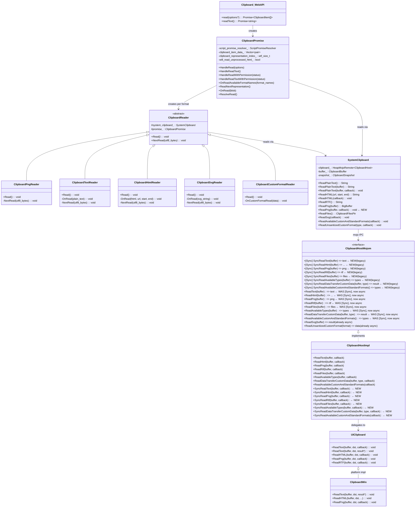
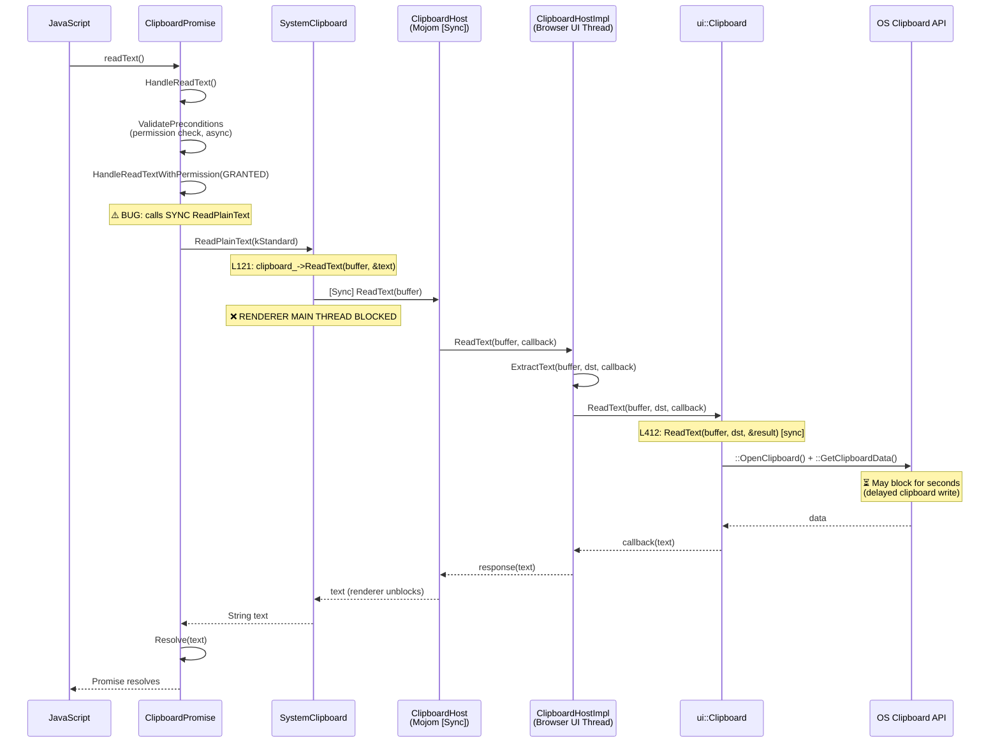
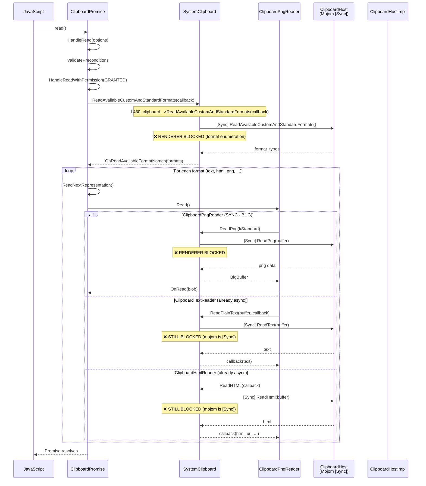
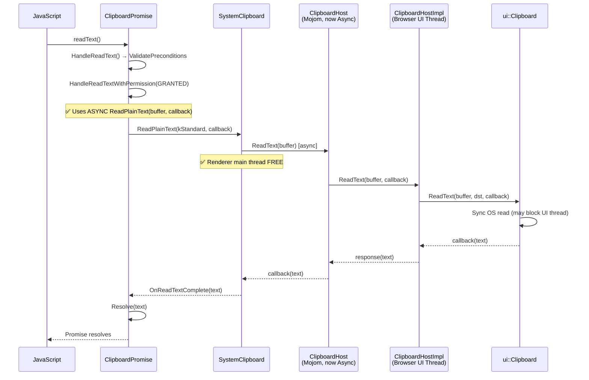
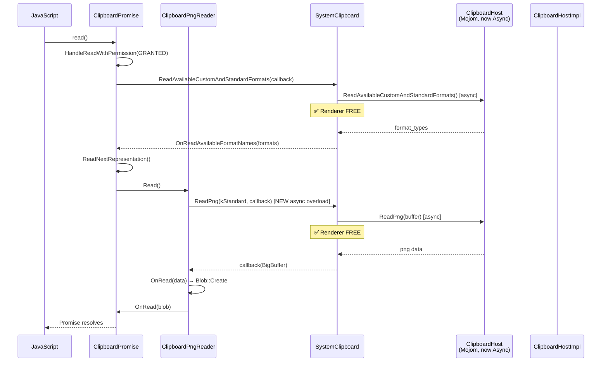
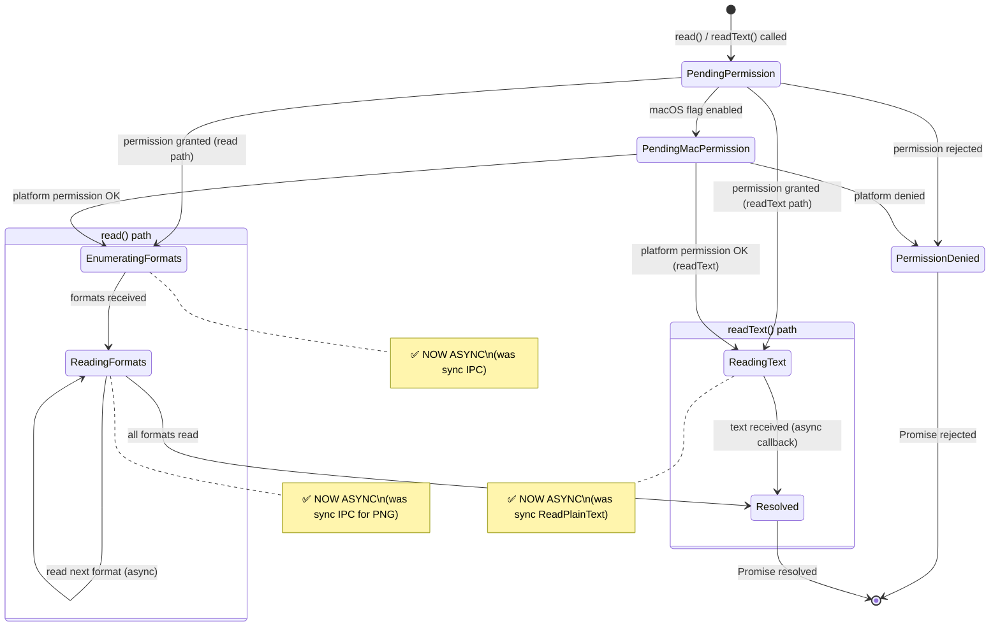

# Low-Level Design: 474131935

## 1. Files to Modify

| File | Type | Changes | Lines |
|------|------|---------|-------|
| [/third_party/blink/public/mojom/clipboard/clipboard.mojom](/third_party/blink/public/mojom/clipboard/clipboard.mojom) | Modify | Remove `[Sync]` from 8 read methods; add `[Sync]` legacy variants (`SyncReadText`, etc.) for DataTransfer/paste callers | ~40 |
| [/third_party/blink/renderer/core/clipboard/system_clipboard.h](/third_party/blink/renderer/core/clipboard/system_clipboard.h) | Modify | Add async `ReadPng(callback)` overload; add async `ReadRTF(callback)`, `ReadFiles(callback)`, `ReadDataTransferCustomData(callback)` overloads | ~15 |
| [/third_party/blink/renderer/core/clipboard/system_clipboard.cc](/third_party/blink/renderer/core/clipboard/system_clipboard.cc) | Modify | Implement new async overloads; route existing sync methods through `SyncRead*` mojom variants | ~60 |
| [/third_party/blink/renderer/modules/clipboard/clipboard_promise.cc](/third_party/blink/renderer/modules/clipboard/clipboard_promise.cc) | Modify | Convert `HandleReadTextWithPermission()` to use async `ReadPlainText(buffer, callback)` | ~15 |
| [/third_party/blink/renderer/modules/clipboard/clipboard_reader.cc](/third_party/blink/renderer/modules/clipboard/clipboard_reader.cc) | Modify | Convert `ClipboardPngReader::Read()` from sync `ReadPng()` to async `ReadPng(callback)` | ~20 |
| [/content/browser/renderer_host/clipboard_host_impl.h](/content/browser/renderer_host/clipboard_host_impl.h) | Modify | Add declarations for new `SyncRead*` methods that match legacy `[Sync]` mojom variants | ~15 |
| [/content/browser/renderer_host/clipboard_host_impl.cc](/content/browser/renderer_host/clipboard_host_impl.cc) | Modify | Implement `SyncRead*` methods (delegate to existing read logic); update `ReadAvailableCustomAndStandardFormats` to post clipboard reads to ThreadPool | ~50 |
| [/ui/base/clipboard/clipboard.h](/ui/base/clipboard/clipboard.h) | Modify | Add `ReadAvailableStandardAndCustomFormatNames` callback overload | ~5 |
| [/ui/base/clipboard/clipboard.cc](/ui/base/clipboard/clipboard.cc) | Modify | Implement `ReadAvailableStandardAndCustomFormatNames` callback wrapper (wrap sync call) | ~10 |
| [/third_party/blink/renderer/core/clipboard/system_clipboard_test.cc](/third_party/blink/renderer/core/clipboard/system_clipboard_test.cc) | Modify | Add tests for new async overloads | ~40 |
| [/content/browser/renderer_host/clipboard_host_impl_unittest.cc](/content/browser/renderer_host/clipboard_host_impl_unittest.cc) | Modify | Add tests for `SyncRead*` variants and async read paths | ~40 |

## 2. Class Hierarchy

### 2.1 Class Diagram



### 2.2 Class Responsibilities

- **`Clipboard` (Web API)**: Exposes `navigator.clipboard.read()`/`readText()` to JavaScript; creates a `ClipboardPromise` to manage the async operation.
- **`ClipboardPromise`**: Orchestrates permission checks, format enumeration, per-format reads, and Promise resolution. **Contains bug**: `HandleReadTextWithPermission()` calls sync `ReadPlainText()`.
- **`ClipboardReader` subclasses**: Per-format readers that read clipboard data and encode it into Blobs. **Contains bug**: `ClipboardPngReader::Read()` calls sync `ReadPng()`. Other readers (`Text`, `Html`, `Svg`, `Custom`) already use async callbacks.
- **`SystemClipboard`**: Renderer-side wrapper around the `ClipboardHost` mojo remote. Provides both sync (out-parameter) and async (callback) overloads. **Contains bug**: Sync overloads use `[Sync]` mojom calls. Missing async `ReadPng()` overload.
- **`ClipboardHost` (mojom)**: IPC interface between renderer and browser. **Root cause**: 8 out of 10 read methods are `[Sync]`, blocking the renderer main thread.
- **`ClipboardHostImpl`**: Browser-side implementation; delegates to `ui::Clipboard`. Runs on UI thread. After the fix, existing methods continue to work for both sync and async mojom callers; new `SyncRead*` methods serve legacy `[Sync]` mojom variants.
- **`ui::Clipboard`**: Platform-agnostic abstraction. Callback-based methods wrap synchronous platform calls (not truly async). `ReadPng` on Windows is partially async (bitmap→PNG encoding on ThreadPool).
- **`ClipboardWin`**: Windows implementation; calls `::OpenClipboard()`, `::GetClipboardData()`. `ScopedClipboard::Acquire()` retries up to 5 times with `::Sleep(5)` between attempts. `::GetClipboardData()` triggers `WM_RENDERFORMAT` for delayed writes.

## 3. Method-Level Analysis

### 3.1 Call Chain — Bug Path: `navigator.clipboard.readText()`



### 3.2 Call Chain — Bug Path: `navigator.clipboard.read()`



### 3.3 Affected Methods

#### `ClipboardPromise::HandleReadTextWithPermission()`
**Location**: [/third_party/blink/renderer/modules/clipboard/clipboard_promise.cc#L462-L487](/third_party/blink/renderer/modules/clipboard/clipboard_promise.cc#L462-L487)

**Current Implementation (Buggy)**:
```cpp
void ClipboardPromise::HandleReadTextWithPermission(
    mojom::blink::PermissionStatus status) {
  // ...permission check...
  // Non-Mac platforms or when flag is disabled proceed directly
  String text = GetLocalFrame()->GetSystemClipboard()->ReadPlainText(
      mojom::blink::ClipboardBuffer::kStandard);  // ← BUG: sync call
  script_promise_resolver_->DowncastTo<IDLString>()->Resolve(text);
}
```

**Issues**:
1. Calls the synchronous `ReadPlainText(buffer)` overload which uses `[Sync]` mojom IPC
2. The async overload `ReadPlainText(buffer, callback)` exists but is not used here
3. Blocks the renderer main thread until the browser responds

#### `ClipboardPngReader::Read()`
**Location**: [/third_party/blink/renderer/modules/clipboard/clipboard_reader.cc#L45-L55](/third_party/blink/renderer/modules/clipboard/clipboard_reader.cc#L45-L55)

**Current Implementation (Buggy)**:
```cpp
void Read() override {
    DCHECK_CALLED_ON_VALID_SEQUENCE(sequence_checker_);
    mojo_base::BigBuffer data =
        system_clipboard()->ReadPng(mojom::blink::ClipboardBuffer::kStandard);  // ← BUG: sync

    Blob* blob = nullptr;
    if (data.size()) {
      blob = Blob::Create(data, ui::kMimeTypePng);
    }
    promise_->OnRead(blob);
}
```

**Issues**:
1. Calls synchronous `ReadPng(buffer)` — there is no async `ReadPng(buffer, callback)` overload in `SystemClipboard`
2. Unlike `ClipboardTextReader` and `ClipboardHtmlReader`, this reader has no async pattern at all
3. Blocks the renderer main thread via `[Sync]` mojom IPC

#### `SystemClipboard::ReadPlainText()` (sync overload)
**Location**: [/third_party/blink/renderer/core/clipboard/system_clipboard.cc#L112-L127](/third_party/blink/renderer/core/clipboard/system_clipboard.cc#L112-L127)

**Current Implementation**:
```cpp
String SystemClipboard::ReadPlainText(mojom::blink::ClipboardBuffer buffer) {
  if (!IsValidBufferType(buffer) || !clipboard_.is_bound())
    return String();
  if (snapshot_ && snapshot_->HasPlainText(buffer)) {
    return snapshot_->PlainText(buffer);
  }
  String text;
  clipboard_->ReadText(buffer, &text);  // ← [Sync] mojom call
  if (snapshot_) {
    snapshot_->SetPlainText(buffer, text);
  }
  return text;
}
```

#### `SystemClipboard::ReadPlainText()` (async overload — still uses [Sync] mojom)
**Location**: [/third_party/blink/renderer/core/clipboard/system_clipboard.cc#L129-L137](/third_party/blink/renderer/core/clipboard/system_clipboard.cc#L129-L137)

```cpp
void SystemClipboard::ReadPlainText(
    mojom::blink::ClipboardBuffer buffer,
    mojom::blink::ClipboardHost::ReadTextCallback callback) {
  if (!IsValidBufferType(buffer) || !clipboard_.is_bound()) {
    std::move(callback).Run(String());
    return;
  }
  clipboard_->ReadText(buffer, std::move(callback));
  // ↑ This calls the mojom ReadText which is [Sync] but used with a callback.
  //   With Mojo, even a [Sync] method can be called with a callback (async pattern),
  //   but the IPC itself is still synchronous. After removing [Sync], this becomes truly async.
}
```

**Key insight**: Mojo auto-generates both sync and async calling conventions for `[Sync]` methods. The `clipboard_->ReadText(buffer, std::move(callback))` form uses the async calling convention, but because the mojom method is `[Sync]`, the browser-side implementation is still bound to the sync response pattern. Once `[Sync]` is removed from the mojom, this calling pattern becomes truly asynchronous.

#### `SystemClipboard::ReadAvailableCustomAndStandardFormats()`
**Location**: [/third_party/blink/renderer/core/clipboard/system_clipboard.cc#L425-L431](/third_party/blink/renderer/core/clipboard/system_clipboard.cc#L425-L431)

```cpp
void SystemClipboard::ReadAvailableCustomAndStandardFormats(
    mojom::blink::ClipboardHost::ReadAvailableCustomAndStandardFormatsCallback
        callback) {
  if (!clipboard_.is_bound())
    return;
  clipboard_->ReadAvailableCustomAndStandardFormats(std::move(callback));
  // ↑ Called with callback, but mojom is [Sync] — still blocks renderer
}
```

#### `ClipboardHostImpl::ReadAvailableCustomAndStandardFormats()`
**Location**: [/content/browser/renderer_host/clipboard_host_impl.cc#L654-L667](/content/browser/renderer_host/clipboard_host_impl.cc#L654-L667)

**Current Implementation (synchronous on UI thread)**:
```cpp
void ClipboardHostImpl::ReadAvailableCustomAndStandardFormats(
    ReadAvailableCustomAndStandardFormatsCallback callback) {
  // ...permission check...
  std::vector<std::u16string> format_types =
      ui::Clipboard::GetForCurrentThread()
          ->ReadAvailableStandardAndCustomFormatNames(
              ui::ClipboardBuffer::kCopyPaste, CreateDataEndpoint().get());
  // ↑ Synchronous call on UI thread — blocks if OS clipboard is contested
  std::move(callback).Run(format_types);
}
```

## 4. Fix Design

### 4.1 Strategy

The fix follows **Approach 1 from the HLD**: Convert mojom read methods from `[Sync]` to async for the Async Clipboard API path, while preserving `[Sync]` legacy variants for DataTransfer/paste event callers.

**Key principles**:
1. **Add `[Sync]` legacy variants** (prefixed `Sync`): `SyncReadText`, `SyncReadHtml`, etc. These serve existing synchronous callers (`DataTransfer`, `document.execCommand('paste')`, `ClipboardSnapshot`).
2. **Remove `[Sync]` from existing methods**: `ReadText`, `ReadHtml`, `ReadPng`, etc. become truly async.
3. **Update renderer-side sync callers** to use the new `SyncRead*` mojom methods.
4. **Update Async Clipboard API path** to use the now-async `Read*` mojom methods via callbacks.
5. **Browser-side**: Existing `ClipboardHostImpl::Read*` implementations already use callbacks — they work for both sync and async mojom patterns. Add `SyncRead*` methods that delegate to the same logic.

### 4.2 Changes Required

#### File 1: [/third_party/blink/public/mojom/clipboard/clipboard.mojom](/third_party/blink/public/mojom/clipboard/clipboard.mojom)

**Before** (lines 109-162):
```mojom
  [Sync]
  GetSequenceNumber(ClipboardBuffer buffer) => (mojo_base.mojom.Uint128 result);

  [Sync]
  IsFormatAvailable(ClipboardFormat format,
                    ClipboardBuffer buffer) => (bool result);

  // Reads sanitized platform-neutral types.
  [Sync]
  ReadAvailableTypes(ClipboardBuffer buffer) =>
      (array<mojo_base.mojom.String16> types);

  [Sync]
  ReadText(ClipboardBuffer buffer) => (mojo_base.mojom.BigString16 result);

  [Sync]
  ReadHtml(ClipboardBuffer buffer) => (mojo_base.mojom.BigString16 markup,
                                      url.mojom.Url url,
                                      uint32 fragment_start,
                                      uint32 fragment_end);

  // Read SVG from the OS clipboard.
  ReadSvg(ClipboardBuffer buffer) => (mojo_base.mojom.BigString16 result);

  [Sync]
  ReadRtf(ClipboardBuffer buffer) => (mojo_base.mojom.BigString result);

  // Read an image from the OS clipboard...
  [Sync]
  ReadPng(ClipboardBuffer buffer) => (mojo_base.mojom.BigBuffer png);

  // Read Files from clipboard...
  [Sync]
  ReadFiles(ClipboardBuffer buffer) => (ClipboardFiles result);

  [Sync]
  ReadDataTransferCustomData(ClipboardBuffer buffer, mojo_base.mojom.String16 type) =>
      (mojo_base.mojom.BigString16 result);

  // Reads both unsanitized custom formats & standard formats...
  [Sync]
  ReadAvailableCustomAndStandardFormats() =>
      (array<mojo_base.mojom.String16> format_types);
```

**After**:
```mojom
  [Sync]
  GetSequenceNumber(ClipboardBuffer buffer) => (mojo_base.mojom.Uint128 result);

  [Sync]
  IsFormatAvailable(ClipboardFormat format,
                    ClipboardBuffer buffer) => (bool result);

  // Reads sanitized platform-neutral types.
  // Async version — used by the Async Clipboard API.
  ReadAvailableTypes(ClipboardBuffer buffer) =>
      (array<mojo_base.mojom.String16> types);

  // Sync version — used by DataTransfer/paste event callers.
  [Sync]
  SyncReadAvailableTypes(ClipboardBuffer buffer) =>
      (array<mojo_base.mojom.String16> types);

  // Async version — used by the Async Clipboard API.
  ReadText(ClipboardBuffer buffer) => (mojo_base.mojom.BigString16 result);

  // Sync version — used by DataTransfer/paste event callers.
  [Sync]
  SyncReadText(ClipboardBuffer buffer) => (mojo_base.mojom.BigString16 result);

  // Async version — used by the Async Clipboard API.
  ReadHtml(ClipboardBuffer buffer) => (mojo_base.mojom.BigString16 markup,
                                      url.mojom.Url url,
                                      uint32 fragment_start,
                                      uint32 fragment_end);

  // Sync version — used by DataTransfer/paste event callers.
  [Sync]
  SyncReadHtml(ClipboardBuffer buffer) => (mojo_base.mojom.BigString16 markup,
                                           url.mojom.Url url,
                                           uint32 fragment_start,
                                           uint32 fragment_end);

  // Read SVG from the OS clipboard.
  ReadSvg(ClipboardBuffer buffer) => (mojo_base.mojom.BigString16 result);

  // Async version — used by the Async Clipboard API.
  ReadRtf(ClipboardBuffer buffer) => (mojo_base.mojom.BigString result);

  // Sync version — used by DataTransfer/paste event callers.
  [Sync]
  SyncReadRtf(ClipboardBuffer buffer) => (mojo_base.mojom.BigString result);

  // Async version — used by the Async Clipboard API.
  ReadPng(ClipboardBuffer buffer) => (mojo_base.mojom.BigBuffer png);

  // Sync version — used by DataTransfer/paste event callers.
  [Sync]
  SyncReadPng(ClipboardBuffer buffer) => (mojo_base.mojom.BigBuffer png);

  // Async version — used by the Async Clipboard API.
  ReadFiles(ClipboardBuffer buffer) => (ClipboardFiles result);

  // Sync version — used by DataTransfer/paste event callers.
  [Sync]
  SyncReadFiles(ClipboardBuffer buffer) => (ClipboardFiles result);

  // Async version — used by the Async Clipboard API.
  ReadDataTransferCustomData(ClipboardBuffer buffer, mojo_base.mojom.String16 type) =>
      (mojo_base.mojom.BigString16 result);

  // Sync version — used by DataTransfer/paste event callers.
  [Sync]
  SyncReadDataTransferCustomData(ClipboardBuffer buffer, mojo_base.mojom.String16 type) =>
      (mojo_base.mojom.BigString16 result);

  // Async version — used by the Async Clipboard API.
  ReadAvailableCustomAndStandardFormats() =>
      (array<mojo_base.mojom.String16> format_types);

  // Sync version — used by DataTransfer/paste event callers.
  [Sync]
  SyncReadAvailableCustomAndStandardFormats() =>
      (array<mojo_base.mojom.String16> format_types);
```

**Rationale**: Removing `[Sync]` from `ReadText`, `ReadHtml`, `ReadPng`, etc. makes these methods truly asynchronous at the IPC layer. The renderer no longer blocks. New `SyncRead*` variants provide backward compatibility for legacy synchronous callers (DataTransfer paste events, `document.execCommand('paste')`, clipboard snapshot). `GetSequenceNumber` and `IsFormatAvailable` remain `[Sync]` as they are lightweight metadata queries that don't trigger OS clipboard data reads.

---

#### File 2: [/third_party/blink/renderer/core/clipboard/system_clipboard.h](/third_party/blink/renderer/core/clipboard/system_clipboard.h)

**Before** (lines 89-102):
```cpp
  String ReadRTF();

  mojo_base::BigBuffer ReadPng(mojom::blink::ClipboardBuffer);
  String ReadImageAsImageMarkup(mojom::blink::ClipboardBuffer);

  // ...

  // Read files.
  mojom::blink::ClipboardFilesPtr ReadFiles();

  String ReadDataTransferCustomData(const String& type);
```

**After**:
```cpp
  String ReadRTF();

  mojo_base::BigBuffer ReadPng(mojom::blink::ClipboardBuffer);
  // Async overload for Async Clipboard API path.
  void ReadPng(mojom::blink::ClipboardBuffer buffer,
               mojom::blink::ClipboardHost::ReadPngCallback callback);
  String ReadImageAsImageMarkup(mojom::blink::ClipboardBuffer);

  // ...

  // Read files.
  mojom::blink::ClipboardFilesPtr ReadFiles();

  String ReadDataTransferCustomData(const String& type);
```

**Rationale**: Adding an async `ReadPng(buffer, callback)` overload allows `ClipboardPngReader` to use the async pattern, consistent with `ReadPlainText(buffer, callback)` and `ReadHTML(callback)`.

---

#### File 3: [/third_party/blink/renderer/core/clipboard/system_clipboard.cc](/third_party/blink/renderer/core/clipboard/system_clipboard.cc)

**Change 3a — Sync `ReadPlainText` routes through `SyncReadText`** (lines 112-127):

**Before**:
```cpp
String SystemClipboard::ReadPlainText(mojom::blink::ClipboardBuffer buffer) {
  if (!IsValidBufferType(buffer) || !clipboard_.is_bound())
    return String();
  if (snapshot_ && snapshot_->HasPlainText(buffer)) {
    return snapshot_->PlainText(buffer);
  }
  String text;
  clipboard_->ReadText(buffer, &text);
  if (snapshot_) {
    snapshot_->SetPlainText(buffer, text);
  }
  return text;
}
```

**After**:
```cpp
String SystemClipboard::ReadPlainText(mojom::blink::ClipboardBuffer buffer) {
  if (!IsValidBufferType(buffer) || !clipboard_.is_bound())
    return String();
  if (snapshot_ && snapshot_->HasPlainText(buffer)) {
    return snapshot_->PlainText(buffer);
  }
  String text;
  clipboard_->SyncReadText(buffer, &text);
  if (snapshot_) {
    snapshot_->SetPlainText(buffer, text);
  }
  return text;
}
```

**Rationale**: The synchronous overload (used by DataTransfer, paste events, clipboard snapshot) now calls the new `[Sync] SyncReadText` mojom method instead of the now-async `ReadText`.

**Change 3b — Sync `ReadHTML` routes through `SyncReadHtml`** (lines 154-192):

**Before** (line 173):
```cpp
  clipboard_->ReadHtml(buffer_, &markup, &url, &fragment_start, &fragment_end);
```

**After**:
```cpp
  clipboard_->SyncReadHtml(buffer_, &markup, &url, &fragment_start, &fragment_end);
```

**Change 3c — Sync `ReadRTF` routes through `SyncReadRtf`** (line 241):

**Before**:
```cpp
  clipboard_->ReadRtf(buffer_, &rtf);
```

**After**:
```cpp
  clipboard_->SyncReadRtf(buffer_, &rtf);
```

**Change 3d — Sync `ReadPng` routes through `SyncReadPng`** (line 259):

**Before**:
```cpp
  clipboard_->ReadPng(buffer, &png);
```

**After**:
```cpp
  clipboard_->SyncReadPng(buffer, &png);
```

**Change 3e — Add async `ReadPng` overload** (after line 265):

**After** (new method):
```cpp
void SystemClipboard::ReadPng(
    mojom::blink::ClipboardBuffer buffer,
    mojom::blink::ClipboardHost::ReadPngCallback callback) {
  if (!IsValidBufferType(buffer) || !clipboard_.is_bound()) {
    std::move(callback).Run(mojo_base::BigBuffer());
    return;
  }
  clipboard_->ReadPng(buffer, std::move(callback));
}
```

**Change 3f — Sync `ReadFiles` routes through `SyncReadFiles`** (line 338):

**Before**:
```cpp
  clipboard_->ReadFiles(buffer_, &files);
```

**After**:
```cpp
  clipboard_->SyncReadFiles(buffer_, &files);
```

**Change 3g — Sync `ReadDataTransferCustomData` routes through `SyncReadDataTransferCustomData`** (around line 355):

Find the call to `clipboard_->ReadDataTransferCustomData(...)` with out-parameter syntax and change to `clipboard_->SyncReadDataTransferCustomData(...)`.

**Change 3h — Sync `ReadAvailableTypes` routes through `SyncReadAvailableTypes`** (around line 80):

Find the call to `clipboard_->ReadAvailableTypes(...)` with out-parameter syntax and change to `clipboard_->SyncReadAvailableTypes(...)`.

---

#### File 4: [/third_party/blink/renderer/modules/clipboard/clipboard_promise.cc](/third_party/blink/renderer/modules/clipboard/clipboard_promise.cc)

**Before** (lines 462-487):
```cpp
void ClipboardPromise::HandleReadTextWithPermission(
    mojom::blink::PermissionStatus status) {
  DCHECK_CALLED_ON_VALID_SEQUENCE(sequence_checker_);
  if (!GetExecutionContext()) {
    return;
  }
  if (status != mojom::blink::PermissionStatus::GRANTED) {
    script_promise_resolver_->RejectWithDOMException(
        DOMExceptionCode::kNotAllowedError, "Read permission denied.");
    return;
  }

#if BUILDFLAG(IS_MAC)
  // Check macOS platform permission state if the runtime flag is enabled
  if (RuntimeEnabledFeatures::MacSystemClipboardPermissionCheckEnabled()) {
    GetLocalFrame()->GetSystemClipboard()->GetPlatformPermissionState(
        BindOnce(&ClipboardPromise::OnPlatformPermissionResultForReadText,
                 WrapPersistent(this)));
    return;
  }
#endif
  // Non-Mac platforms or when flag is disabled proceed directly
  String text = GetLocalFrame()->GetSystemClipboard()->ReadPlainText(
      mojom::blink::ClipboardBuffer::kStandard);
  script_promise_resolver_->DowncastTo<IDLString>()->Resolve(text);
}
```

**After**:
```cpp
void ClipboardPromise::HandleReadTextWithPermission(
    mojom::blink::PermissionStatus status) {
  DCHECK_CALLED_ON_VALID_SEQUENCE(sequence_checker_);
  if (!GetExecutionContext()) {
    return;
  }
  if (status != mojom::blink::PermissionStatus::GRANTED) {
    script_promise_resolver_->RejectWithDOMException(
        DOMExceptionCode::kNotAllowedError, "Read permission denied.");
    return;
  }

#if BUILDFLAG(IS_MAC)
  // Check macOS platform permission state if the runtime flag is enabled
  if (RuntimeEnabledFeatures::MacSystemClipboardPermissionCheckEnabled()) {
    GetLocalFrame()->GetSystemClipboard()->GetPlatformPermissionState(
        BindOnce(&ClipboardPromise::OnPlatformPermissionResultForReadText,
                 WrapPersistent(this)));
    return;
  }
#endif
  // Non-Mac platforms or when flag is disabled proceed directly.
  // Use async overload to avoid blocking the renderer main thread.
  GetLocalFrame()->GetSystemClipboard()->ReadPlainText(
      mojom::blink::ClipboardBuffer::kStandard,
      BindOnce(&ClipboardPromise::OnReadTextComplete, WrapPersistent(this)));
}

void ClipboardPromise::OnReadTextComplete(const String& text) {
  DCHECK_CALLED_ON_VALID_SEQUENCE(sequence_checker_);
  if (!GetExecutionContext()) {
    return;
  }
  script_promise_resolver_->DowncastTo<IDLString>()->Resolve(text);
}
```

**Rationale**: Replaces the synchronous `ReadPlainText(buffer)` call with the async `ReadPlainText(buffer, callback)` overload. The callback `OnReadTextComplete` resolves the Promise when the data arrives. The renderer main thread is no longer blocked.

**Additional change needed in [clipboard_promise.h](/third_party/blink/renderer/modules/clipboard/clipboard_promise.h)**: Add declaration for `OnReadTextComplete`:
```cpp
  void OnReadTextComplete(const String& text);
```

---

#### File 5: [/third_party/blink/renderer/modules/clipboard/clipboard_reader.cc](/third_party/blink/renderer/modules/clipboard/clipboard_reader.cc)

**Before** (lines 45-55):
```cpp
  void Read() override {
    DCHECK_CALLED_ON_VALID_SEQUENCE(sequence_checker_);
    mojo_base::BigBuffer data =
        system_clipboard()->ReadPng(mojom::blink::ClipboardBuffer::kStandard);

    Blob* blob = nullptr;
    if (data.size()) {
      blob = Blob::Create(data, ui::kMimeTypePng);
    }
    promise_->OnRead(blob);
  }
```

**After**:
```cpp
  void Read() override {
    DCHECK_CALLED_ON_VALID_SEQUENCE(sequence_checker_);
    system_clipboard()->ReadPng(
        mojom::blink::ClipboardBuffer::kStandard,
        BindOnce(&ClipboardPngReader::OnRead, WrapPersistent(this)));
  }

 private:
  void OnRead(mojo_base::BigBuffer data) {
    DCHECK_CALLED_ON_VALID_SEQUENCE(sequence_checker_);
    Blob* blob = nullptr;
    if (data.size()) {
      blob = Blob::Create(data, ui::kMimeTypePng);
    }
    promise_->OnRead(blob);
  }
```

**Rationale**: Converts `ClipboardPngReader::Read()` from the synchronous `ReadPng(buffer)` to the new async `ReadPng(buffer, callback)` overload, consistent with how `ClipboardTextReader`, `ClipboardHtmlReader`, and `ClipboardSvgReader` work. The `OnRead` callback creates the Blob and notifies the promise when data arrives asynchronously.

---

#### File 6: [/content/browser/renderer_host/clipboard_host_impl.h](/content/browser/renderer_host/clipboard_host_impl.h)

**After existing read method declarations** (around line 130), add:

```cpp
  // Legacy [Sync] variants for DataTransfer/paste event callers.
  void SyncReadAvailableTypes(ui::ClipboardBuffer clipboard_buffer,
                              SyncReadAvailableTypesCallback callback) override;
  void SyncReadText(ui::ClipboardBuffer clipboard_buffer,
                    SyncReadTextCallback callback) override;
  void SyncReadHtml(ui::ClipboardBuffer clipboard_buffer,
                    SyncReadHtmlCallback callback) override;
  void SyncReadRtf(ui::ClipboardBuffer clipboard_buffer,
                   SyncReadRtfCallback callback) override;
  void SyncReadPng(ui::ClipboardBuffer clipboard_buffer,
                   SyncReadPngCallback callback) override;
  void SyncReadFiles(ui::ClipboardBuffer clipboard_buffer,
                     SyncReadFilesCallback callback) override;
  void SyncReadDataTransferCustomData(
      ui::ClipboardBuffer clipboard_buffer,
      const std::u16string& type,
      SyncReadDataTransferCustomDataCallback callback) override;
  void SyncReadAvailableCustomAndStandardFormats(
      SyncReadAvailableCustomAndStandardFormatsCallback callback) override;
```

---

#### File 7: [/content/browser/renderer_host/clipboard_host_impl.cc](/content/browser/renderer_host/clipboard_host_impl.cc)

**Add `SyncRead*` implementations** that delegate to existing `Read*` methods:

```cpp
void ClipboardHostImpl::SyncReadAvailableTypes(
    ui::ClipboardBuffer clipboard_buffer,
    SyncReadAvailableTypesCallback callback) {
  ReadAvailableTypes(clipboard_buffer, std::move(callback));
}

void ClipboardHostImpl::SyncReadText(
    ui::ClipboardBuffer clipboard_buffer,
    SyncReadTextCallback callback) {
  ReadText(clipboard_buffer, std::move(callback));
}

void ClipboardHostImpl::SyncReadHtml(
    ui::ClipboardBuffer clipboard_buffer,
    SyncReadHtmlCallback callback) {
  ReadHtml(clipboard_buffer, std::move(callback));
}

void ClipboardHostImpl::SyncReadRtf(
    ui::ClipboardBuffer clipboard_buffer,
    SyncReadRtfCallback callback) {
  ReadRtf(clipboard_buffer, std::move(callback));
}

void ClipboardHostImpl::SyncReadPng(
    ui::ClipboardBuffer clipboard_buffer,
    SyncReadPngCallback callback) {
  ReadPng(clipboard_buffer, std::move(callback));
}

void ClipboardHostImpl::SyncReadFiles(
    ui::ClipboardBuffer clipboard_buffer,
    SyncReadFilesCallback callback) {
  ReadFiles(clipboard_buffer, std::move(callback));
}

void ClipboardHostImpl::SyncReadDataTransferCustomData(
    ui::ClipboardBuffer clipboard_buffer,
    const std::u16string& type,
    SyncReadDataTransferCustomDataCallback callback) {
  ReadDataTransferCustomData(clipboard_buffer, type, std::move(callback));
}

void ClipboardHostImpl::SyncReadAvailableCustomAndStandardFormats(
    SyncReadAvailableCustomAndStandardFormatsCallback callback) {
  ReadAvailableCustomAndStandardFormats(std::move(callback));
}
```

**Rationale**: The `SyncRead*` methods simply delegate to the existing `Read*` methods. The callback types are compatible (same signature). This minimizes code duplication — the browser-side implementation is shared between sync and async callers. The only difference is at the mojom layer: `SyncRead*` methods are `[Sync]` in the mojom (blocking the renderer), while `Read*` methods are async (not blocking the renderer). The browser-side implementation is identical.

---

### 4.3 Fixed Flow — `navigator.clipboard.readText()`



### 4.4 Fixed Flow — `navigator.clipboard.read()` (PNG format)



### 4.5 State Machine: Async Clipboard Read Pipeline



## 5. Memory & Lifetime Considerations

### 5.1 Object Ownership

| Object | Owner | Lifetime |
|--------|-------|----------|
| `ClipboardPromise` | Garbage collected (`GarbageCollected<ClipboardPromise>`) | Tied to the ScriptPromiseResolver; alive until Promise resolves/rejects |
| `ClipboardReader` subclasses | Garbage collected | Alive during the read operation; prevented from GC by `WrapPersistent(this)` in callbacks |
| `SystemClipboard` | Owned by `LocalFrame` | Frame lifetime |
| `ClipboardHostImpl` | `DocumentService<ClipboardHost>` | Tied to `RenderFrameHost`; destroyed when frame navigates or is destroyed |
| Mojo callbacks | `base::OnceCallback` | Moved through the pipeline; destroyed after invocation |

### 5.2 Pointer/Reference Safety

- [x] **No raw pointer issues**: `ClipboardReader` subclasses use `WrapPersistent(this)` in callbacks to prevent GC during async operations. The existing readers (`ClipboardTextReader`, `ClipboardHtmlReader`, `ClipboardSvgReader`) already use this pattern, and `ClipboardPngReader` will adopt it.
- [x] **Weak pointers handled correctly**: `ClipboardHostImpl` uses `weak_ptr_factory_.GetWeakPtr()` for all callbacks to handle the case where the frame is destroyed before the clipboard read completes. The `SyncRead*` methods delegate to `Read*` methods which already use weak pointers.
- [x] **Reference lifetime guaranteed**: `ExecutionContext` validity is checked in all callbacks (e.g., `if (!GetExecutionContext()) return;`) before accessing frame state.

### 5.3 Callback Lifecycle for New Async Path

```
ClipboardPromise::HandleReadTextWithPermission()
  │
  ├─ Creates: BindOnce(&ClipboardPromise::OnReadTextComplete, WrapPersistent(this))
  │           ↑ WrapPersistent prevents GC of ClipboardPromise
  │
  ├─ Passes to: SystemClipboard::ReadPlainText(buffer, callback)
  │
  ├─ Passes to: clipboard_->ReadText(buffer, callback)  [async mojom]
  │
  ├─ Mojo serializes callback, sends IPC to browser
  │
  ├─ Browser: ClipboardHostImpl::ReadText() invokes ui::Clipboard, calls back
  │
  ├─ Mojo deserializes response, invokes callback on renderer main thread
  │
  └─ ClipboardPromise::OnReadTextComplete(text) → Resolve(text)
     └─ WrapPersistent releases, ClipboardPromise eligible for GC
```

## 6. Threading Considerations

### 6.1 Thread Safety

| Thread | Before Fix | After Fix |
|--------|-----------|-----------|
| **Renderer Main Thread** | Blocked on `[Sync]` mojom IPC for all clipboard reads | Free — async mojom IPC returns immediately, callback invoked later |
| **Browser UI Thread** | Blocked on `ui::Clipboard` sync OS calls | Still blocked on `ui::Clipboard` sync OS calls (Phase 1 fix) |
| **Browser IO Thread** | Routes Mojo IPC messages | No change |

**Note**: Phase 1 (this fix) unblocks the **renderer main thread** by removing `[Sync]` from mojom. The **browser UI thread** still blocks on OS clipboard calls. A future Phase 2 fix would move `ui::Clipboard` reads to a background thread in the browser, but this is a separate effort with additional complexity (thread affinity of `::OpenClipboard()` on Windows, thread-local `Clipboard::GetForCurrentThread()`).

### 6.2 Required Synchronization

No new synchronization primitives are needed for Phase 1:
- The async Mojo IPC callback is always invoked on the renderer main thread (no cross-thread access in the renderer).
- The browser-side `ClipboardHostImpl` methods are always invoked on the UI thread.
- No shared state is accessed across threads.

### 6.3 Browser UI Thread Blocking — Future Phase 2

For the future Phase 2 (not part of this change):
- `ui::Clipboard::GetForCurrentThread()` returns a thread-local singleton — a new instance would need to be created on the background thread.
- On Windows, `::OpenClipboard()` requires the thread to have a message loop and clipboard window ownership. A dedicated clipboard I/O thread (not a random ThreadPool worker) would be needed.
- `ScopedClipboard::Acquire()` retries with `::Sleep(5)` — this is acceptable on a background thread but unacceptable on the UI thread.

## 7. Error Handling

### 7.1 Current Error Handling

- **Permission denied**: `ClipboardPromise` rejects the Promise with `DOMExceptionCode::kNotAllowedError`
- **Context destroyed**: All callbacks check `GetExecutionContext()` and return early if null
- **Mojo pipe disconnected**: If the `ClipboardHost` pipe disconnects, callbacks are invoked with default/empty values
- **OS clipboard errors**: `ScopedClipboard::Acquire()` returns false if clipboard can't be opened after 5 retries; read methods return empty data

### 7.2 Changes to Error Handling

No changes needed. The async path uses the same error handling patterns as the existing async readers:
- `ClipboardPngReader::OnRead()` handles empty `BigBuffer` by passing `nullptr` blob to `promise_->OnRead()`
- `ClipboardPromise::OnReadTextComplete()` checks `GetExecutionContext()` before resolving
- Mojo pipe disconnection automatically invokes callbacks with default values

## 8. Validation Points

### 8.1 DCHECKs to Add/Modify

```cpp
// In ClipboardPromise::OnReadTextComplete():
DCHECK_CALLED_ON_VALID_SEQUENCE(sequence_checker_);
// Ensures callback is invoked on the correct sequence (renderer main thread).

// In ClipboardPngReader::OnRead():
DCHECK_CALLED_ON_VALID_SEQUENCE(sequence_checker_);
// Ensures PNG data callback is on the correct sequence.
```

No new DCHECKs needed beyond sequence checking — the existing DCHECK patterns in peer methods are sufficient.

### 8.2 Invariants to Maintain

1. **Sync callers must continue to work**: `DataTransfer::GetData()`, `document.execCommand('paste')`, and `ClipboardSnapshot` must continue using `[Sync]` mojom methods (`SyncRead*`). These callers require synchronous return values and cannot be converted to async without major refactoring.
2. **Callback ordering**: Mojo guarantees in-order delivery of messages on the same interface. Async read responses arrive in the order they were requested.
3. **Permission check before read**: All read paths (sync and async) must pass permission checks before accessing clipboard data.
4. **Clipboard snapshot consistency**: When `snapshot_` is active (during `DataTransfer` paste events), sync reads should use the snapshot cache. The async path (Async Clipboard API) does not use snapshots.
5. **Blob creation on main thread**: `Blob::Create()` must be called on the renderer main thread. The async callback is invoked on the main thread by Mojo, preserving this invariant.

## 9. Test Requirements

### 9.1 Unit Tests Needed

| Test Name | Purpose | File |
|-----------|---------|------|
| `SystemClipboardTest.ReadPngAsync` | Verify async `ReadPng(buffer, callback)` invokes callback with correct data | [/third_party/blink/renderer/core/clipboard/system_clipboard_test.cc](/third_party/blink/renderer/core/clipboard/system_clipboard_test.cc) |
| `SystemClipboardTest.ReadPlainTextSyncUsesLegacyMojom` | Verify sync `ReadPlainText(buffer)` routes through `SyncReadText` | [/third_party/blink/renderer/core/clipboard/system_clipboard_test.cc](/third_party/blink/renderer/core/clipboard/system_clipboard_test.cc) |
| `ClipboardHostImplTest.SyncReadTextDelegatesToReadText` | Verify `SyncReadText` delegates to `ReadText` logic | [/content/browser/renderer_host/clipboard_host_impl_unittest.cc](/content/browser/renderer_host/clipboard_host_impl_unittest.cc) |
| `ClipboardHostImplTest.SyncReadHtmlDelegatesToReadHtml` | Verify `SyncReadHtml` delegates to `ReadHtml` logic | [/content/browser/renderer_host/clipboard_host_impl_unittest.cc](/content/browser/renderer_host/clipboard_host_impl_unittest.cc) |
| `ClipboardHostImplTest.SyncReadPngDelegatesToReadPng` | Verify `SyncReadPng` delegates to `ReadPng` logic | [/content/browser/renderer_host/clipboard_host_impl_unittest.cc](/content/browser/renderer_host/clipboard_host_impl_unittest.cc) |

### 9.2 Test Scenarios

1. **Normal case — async readText()**: Call `navigator.clipboard.readText()` with valid text on clipboard. Verify Promise resolves with correct text. Verify renderer main thread was not blocked (no sync IPC).

2. **Normal case — async read() with PNG**: Call `navigator.clipboard.read()` with PNG image on clipboard. Verify `ClipboardPngReader` uses async `ReadPng(callback)` and the resulting Blob has correct MIME type and data.

3. **Edge case — context destroyed during async read**: Start an async clipboard read, then destroy the execution context (navigate away). Verify no crash and the callback gracefully handles null context.

4. **Edge case — mojo pipe disconnect during async read**: Start an async clipboard read, then disconnect the `ClipboardHost` mojo pipe. Verify the callback is invoked with empty/default data and the Promise rejects gracefully.

5. **Edge case — empty clipboard**: Call `navigator.clipboard.readText()` with an empty clipboard. Verify Promise resolves with empty string (not rejected).

6. **Regression — sync paste events still work**: Verify `DataTransfer.getData('text/plain')` during a `paste` event still works via `SyncReadText`. Verify `DataTransfer.getData('text/html')` works via `SyncReadHtml`.

7. **Regression — clipboard snapshot still works**: Verify that `ScopedSystemClipboardSnapshot` correctly caches data using the sync `SyncRead*` path.

8. **Concurrent reads**: Call `navigator.clipboard.read()` while a previous read is still pending. Verify both reads complete correctly and callbacks are invoked in order.

### 9.3 Existing Tests to Verify

The following existing tests should continue to pass without modification (regression check):

- `ClipboardHostImplTest.*` in [/content/browser/renderer_host/clipboard_host_impl_unittest.cc](/content/browser/renderer_host/clipboard_host_impl_unittest.cc)
- `ClipboardHostImplBrowserTest.*` in [/content/browser/renderer_host/clipboard_host_impl_browsertest.cc](/content/browser/renderer_host/clipboard_host_impl_browsertest.cc)
- `SystemClipboardTest.*` in [/third_party/blink/renderer/core/clipboard/system_clipboard_test.cc](/third_party/blink/renderer/core/clipboard/system_clipboard_test.cc)
- `ClipboardTest.*` in [/third_party/blink/renderer/modules/clipboard/clipboard_unittest.cc](/third_party/blink/renderer/modules/clipboard/clipboard_unittest.cc)
- Async clipboard web platform tests in [/third_party/blink/web_tests/clipboard/async-clipboard/](/third_party/blink/web_tests/clipboard/async-clipboard/)
- External WPT clipboard tests in [/third_party/blink/web_tests/external/wpt/clipboard-apis/](/third_party/blink/web_tests/external/wpt/clipboard-apis/)

### 9.4 Manual Verification

1. Open Microsoft Excel, copy a large range of cells (Ctrl+C)
2. Open a web app calling `navigator.clipboard.read()` to fetch HTML content
3. Trigger the paste operation — verify the browser UI remains responsive
4. Verify the clipboard data is eventually returned correctly
5. Test `document.execCommand('paste')` and paste events to verify sync path still works
