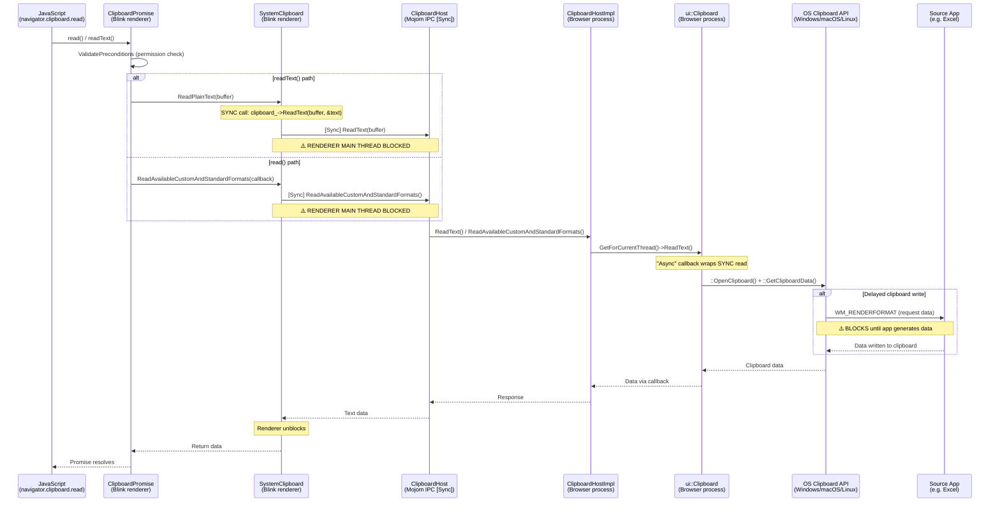

# Fix Assessment: 474131935

## Executive Summary
The Async Clipboard API (`navigator.clipboard.read()` / `readText()`) blocks the renderer's main thread because the mojom IPC calls to the browser process are marked `[Sync]` in `clipboard.mojom`, and the browser-side `ui::Clipboard` read methods perform blocking OS clipboard access on the UI thread. When the source application (e.g., Excel) uses delayed clipboard writes, the OS call blocks until the source app finishes generating data, freezing the entire browser UI. The recommended fix is to convert the `[Sync]` mojom read methods used by the Async Clipboard API to async (non-`[Sync]`) calls, while keeping sync versions available for legacy synchronous callers (DataTransfer/paste events).

## Bug Analysis

### Problem Statement
The Async Clipboard API in Chromium reads clipboard data via synchronous mojom IPC, which blocks the renderer main thread. On the browser side, the `ui::Clipboard` read operations make blocking OS clipboard calls (e.g., `::GetClipboardData()` on Windows). When a source application uses delayed clipboard writes (a standard Windows clipboard feature used by Excel, LibreOffice, etc.), the OS call blocks until the source app generates and writes the requested format. This chain of synchronous calls causes the browser to freeze for seconds.

### Expected Behavior
`navigator.clipboard.read()` and `navigator.clipboard.readText()` should return a Promise that resolves asynchronously without blocking the renderer main thread or the browser UI thread. The browser should remain responsive while clipboard data is being prepared by external applications.

### Actual Behavior
The renderer main thread blocks during the sync mojom IPC call to `ClipboardHost`. The browser UI thread blocks on the OS clipboard API call (e.g., `::GetClipboardData()` / `::OpenClipboard()` on Windows). The user observes the browser as completely frozen/unresponsive until the source application finishes writing clipboard data.

### Triggering Conditions
1. A source application uses delayed clipboard writes (e.g., Microsoft Excel, LibreOffice)
2. The user copies data from that application (e.g., Ctrl+C a range of cells)
3. A web app calls `navigator.clipboard.read()` or `navigator.clipboard.readText()`
4. The OS clipboard requests the data from the source app, which starts generating it
5. The blocking chain: renderer → sync mojom IPC → browser UI thread → blocking OS clipboard call → waits for source app

## Root Cause Analysis

### Code Investigation
Traced the full call chain from JavaScript API to OS clipboard access across three layers:

1. **JavaScript API → Blink Renderer (ClipboardPromise/SystemClipboard)**
2. **Renderer → Browser IPC (clipboard.mojom with `[Sync]`)**
3. **Browser → OS Clipboard (ui::Clipboard blocking reads)**

### Key Files Identified
- [/third_party/blink/public/mojom/clipboard/clipboard.mojom#L109-L162](/third_party/blink/public/mojom/clipboard/clipboard.mojom#L109-L162) - `[Sync]` annotations on ClipboardHost read methods
- [/third_party/blink/renderer/core/clipboard/system_clipboard.cc#L112-L127](/third_party/blink/renderer/core/clipboard/system_clipboard.cc#L112-L127) - `SystemClipboard::ReadPlainText()` makes sync mojom call
- [/third_party/blink/renderer/core/clipboard/system_clipboard.cc#L154-L192](/third_party/blink/renderer/core/clipboard/system_clipboard.cc#L154-L192) - `SystemClipboard::ReadHTML()` makes sync mojom call
- [/third_party/blink/renderer/core/clipboard/system_clipboard.cc#L249-L265](/third_party/blink/renderer/core/clipboard/system_clipboard.cc#L249-L265) - `SystemClipboard::ReadPng()` makes sync mojom call
- [/third_party/blink/renderer/modules/clipboard/clipboard_promise.cc#L462-L487](/third_party/blink/renderer/modules/clipboard/clipboard_promise.cc#L462-L487) - `HandleReadTextWithPermission()` calls sync `ReadPlainText()`
- [/third_party/blink/renderer/modules/clipboard/clipboard_reader.cc#L45-L55](/third_party/blink/renderer/modules/clipboard/clipboard_reader.cc#L45-L55) - `ClipboardPngReader::Read()` calls sync `ReadPng()`
- [/content/browser/renderer_host/clipboard_host_impl.cc#L212-L223](/content/browser/renderer_host/clipboard_host_impl.cc#L212-L223) - Browser-side `ReadText()` calls `ui::Clipboard`
- [/content/browser/renderer_host/clipboard_host_impl.cc#L246-L258](/content/browser/renderer_host/clipboard_host_impl.cc#L246-L258) - Browser-side `ReadHtml()` calls `ui::Clipboard`
- [/content/browser/renderer_host/clipboard_host_impl.cc#L654-L667](/content/browser/renderer_host/clipboard_host_impl.cc#L654-L667) - `ReadAvailableCustomAndStandardFormats()` sync call
- [/ui/base/clipboard/clipboard.cc#L409-L415](/ui/base/clipboard/clipboard.cc#L409-L415) - `Clipboard::ReadText(callback)` wraps sync version, NOT truly async
- [/ui/base/clipboard/clipboard_win.cc#L423-L445](/ui/base/clipboard/clipboard_win.cc#L423-L445) - Windows `ReadText()` calls `::GetClipboardData()` which blocks on delayed writes
- [/ui/base/clipboard/clipboard_win.cc#L114-L122](/ui/base/clipboard/clipboard_win.cc#L114-L122) - `ScopedClipboard::Acquire()` retries `::OpenClipboard()` with blocking sleeps

### Root Cause
**Location**: [/third_party/blink/public/mojom/clipboard/clipboard.mojom#L109-L162](/third_party/blink/public/mojom/clipboard/clipboard.mojom#L109-L162)
**Interface**: `ClipboardHost` (mojom IPC between renderer and browser)
**Issue**: All clipboard read methods (`ReadText`, `ReadHtml`, `ReadPng`, `ReadRtf`, `ReadFiles`, `ReadAvailableTypes`, `ReadAvailableCustomAndStandardFormats`, `ReadDataTransferCustomData`) are annotated with `[Sync]` in the mojom definition. This means when the renderer calls any of these methods, **the renderer main thread blocks waiting for the browser process response**.

The blocking chain has **two layers**:

**Layer 1 – Sync Mojom IPC (renderer → browser)**:
In `SystemClipboard::ReadPlainText()` (line 121 of system_clipboard.cc):
```cpp
clipboard_->ReadText(buffer, &text);  // Sync mojom call - blocks renderer main thread
```
The `&text` out-parameter syntax is the sync mojom calling convention. The renderer thread is suspended until the browser responds.

**Layer 2 – Blocking OS Clipboard (browser UI thread)**:
The browser-side `ClipboardHostImpl::ReadText()` calls `ui::Clipboard::ReadText()`, which calls `ui::Clipboard::ReadText(callback)`, which is just a **synchronous wrapper** that calls `::GetClipboardData()` on Windows. When the source app uses delayed writes, `::GetClipboardData()` sends a `WM_RENDERFORMAT` message to the source app and blocks until it responds. This can take seconds for complex data.

**Key observation**: Some methods already have async overloads in `SystemClipboard` (e.g., `ReadPlainText(buffer, callback)`, `ReadHTML(callback)`), and some ClipboardReader subclasses use them (ClipboardTextReader, ClipboardHtmlReader, ClipboardSvgReader). However, the mojom interface itself is still `[Sync]`, so even the "async" overloads in SystemClipboard still trigger sync IPC at the mojom layer. The `ReadAvailableCustomAndStandardFormats` is marked `[Sync]` in mojom but called via async pattern — **the sync IPC still blocks**.

Additionally, `ClipboardPngReader::Read()` directly calls the **synchronous** `ReadPng()` (no callback overload), making it block even within the reader pattern.

### Code Flow Diagram



## Fix Options (High-Level Design)

### Option 1: Convert Mojom Read Methods to Async for Async Clipboard API ⭐ RECOMMENDED
- **Description**: Remove `[Sync]` annotation from clipboard read methods in `clipboard.mojom` that are used by the Async Clipboard API path, or add new non-`[Sync]` variants. Update `SystemClipboard` to use async mojom calls (with callbacks) for the Async Clipboard API code path. Keep sync variants available for legacy synchronous callers (DataTransfer `paste` events, `document.execCommand('paste')`). On the browser side, move `ui::Clipboard` read operations to a background/IO thread so the UI thread isn't blocked either.
- **Files to modify**:
  - [/third_party/blink/public/mojom/clipboard/clipboard.mojom](/third_party/blink/public/mojom/clipboard/clipboard.mojom) - Remove `[Sync]` or add async variants for read methods
  - [/third_party/blink/renderer/core/clipboard/system_clipboard.h](/third_party/blink/renderer/core/clipboard/system_clipboard.h) - Ensure async overloads are used by Async API path
  - [/third_party/blink/renderer/core/clipboard/system_clipboard.cc](/third_party/blink/renderer/core/clipboard/system_clipboard.cc) - Route Async API through callback-based mojom calls
  - [/third_party/blink/renderer/modules/clipboard/clipboard_promise.cc](/third_party/blink/renderer/modules/clipboard/clipboard_promise.cc) - Change `HandleReadTextWithPermission()` to use async ReadPlainText
  - [/third_party/blink/renderer/modules/clipboard/clipboard_reader.cc](/third_party/blink/renderer/modules/clipboard/clipboard_reader.cc) - Convert `ClipboardPngReader::Read()` to use async ReadPng
  - [/content/browser/renderer_host/clipboard_host_impl.cc](/content/browser/renderer_host/clipboard_host_impl.cc) - Post clipboard reads to background thread
  - [/ui/base/clipboard/clipboard.cc](/ui/base/clipboard/clipboard.cc) - Potentially add truly async implementations
- **Complexity**: Medium-High
- **Risk**: Medium — requires careful handling of two calling patterns (sync for paste events, async for Async API). Must ensure clipboard locking semantics are preserved.
- **Pros**: Directly addresses root cause at the correct layer. Non-breaking for existing sync callers. Follows the principle of the Async Clipboard API spec.
- **Cons**: Significant number of files to change. Requires maintaining both sync and async code paths. Browser-side thread-hopping adds complexity.

### Option 2: Move OS Clipboard Access to Background Thread in Browser Process
- **Description**: Keep the mojom `[Sync]` annotations but move the actual `ui::Clipboard` read operations in `ClipboardHostImpl` to a background thread (via `base::ThreadPool::PostTask`). The browser UI thread would not block, and the sync mojom IPC would still block the renderer, but the total blocking time would be reduced to just IPC overhead in most cases.
- **Files to modify**:
  - [/content/browser/renderer_host/clipboard_host_impl.cc](/content/browser/renderer_host/clipboard_host_impl.cc) - Post reads to ThreadPool
  - [/ui/base/clipboard/clipboard.h](/ui/base/clipboard/clipboard.h) - May need thread-safe read methods
  - Platform-specific clipboard files (clipboard_win.cc, etc.)
- **Complexity**: Medium
- **Risk**: High — `ui::Clipboard` is designed as a **thread-local** singleton (`GetForCurrentThread()`), so clipboard instances can't be freely used across threads. Windows clipboard APIs require specific thread affinity for `::OpenClipboard()`. This fundamentally conflicts with moving reads to a background thread.
- **Pros**: Simpler change, fewer files modified. Doesn't change IPC contract.
- **Cons**: **Still blocks renderer main thread** on sync IPC. Doesn't fully fix the bug. Thread-affinity issues with OS clipboard APIs make this architecturally difficult. On Windows, `::OpenClipboard()` must be called from the thread that created the clipboard window.

### Option 3: Add Timeout to Sync Mojom IPC Calls
- **Description**: Add a timeout to the sync mojom calls so that if the browser doesn't respond within N seconds, the renderer unblocks and the promise rejects with a timeout error.
- **Files to modify**:
  - [/third_party/blink/renderer/core/clipboard/system_clipboard.cc](/third_party/blink/renderer/core/clipboard/system_clipboard.cc) - Add timeout to sync mojom calls
  - [/third_party/blink/renderer/modules/clipboard/clipboard_promise.cc](/third_party/blink/renderer/modules/clipboard/clipboard_promise.cc) - Handle timeout errors
- **Complexity**: Low
- **Risk**: Medium — doesn't fix the underlying blocking, just limits it. May cause data loss if timeout is too short. Difficult to choose a universally appropriate timeout value.
- **Pros**: Simple change. Prevents indefinite freezes.
- **Cons**: Doesn't fix the root cause. Users still experience freezes up to the timeout. Clipboard data may be lost if the source app is simply slow. Poor UX compared to truly async behavior.

### Option 4: Introduce a New Async Mojom Interface for Clipboard Reads
- **Description**: Create a separate mojom interface (e.g., `AsyncClipboardHost`) that provides non-blocking read methods. The Async Clipboard API would use this new interface, while the existing `ClipboardHost` with `[Sync]` methods would continue to serve legacy callers. The browser-side implementation would use a dedicated worker thread for clipboard access.
- **Files to modify**:
  - New file: `async_clipboard_host.mojom` - New async interface
  - [/content/browser/renderer_host/clipboard_host_impl.h](/content/browser/renderer_host/clipboard_host_impl.h) - Implement new interface
  - [/content/browser/renderer_host/clipboard_host_impl.cc](/content/browser/renderer_host/clipboard_host_impl.cc) - Implement async methods
  - [/third_party/blink/renderer/core/clipboard/system_clipboard.h](/third_party/blink/renderer/core/clipboard/system_clipboard.h) - Add new remote for async interface
  - [/third_party/blink/renderer/core/clipboard/system_clipboard.cc](/third_party/blink/renderer/core/clipboard/system_clipboard.cc) - Use async interface for Async API
  - [/third_party/blink/renderer/modules/clipboard/clipboard_promise.cc](/third_party/blink/renderer/modules/clipboard/clipboard_promise.cc) - Use new async interface
- **Complexity**: High
- **Risk**: Low — clean separation, no risk of breaking existing sync callers.
- **Pros**: Clean separation of concerns. No risk to existing code. Can be designed with proper async semantics from the start.
- **Cons**: Significant code duplication between the two interfaces. More maintenance burden. Over-engineered for this specific problem.

### Option 5: Use Mojo Associated Interface with `[NoInterrupt]` and Async Pattern
- **Description**: Instead of `[Sync]`, use async mojom methods throughout, but leverage `base::RunLoop::QuitClosure` or the existing `WaitForMessage()` pattern to provide synchronous-looking behavior for legacy callers on the renderer side, while the Async Clipboard API uses the true async path. This is similar to Option 1 but uses a different Mojo pattern.
- **Files to modify**:
  - [/third_party/blink/public/mojom/clipboard/clipboard.mojom](/third_party/blink/public/mojom/clipboard/clipboard.mojom) - Remove `[Sync]` from all read methods
  - [/third_party/blink/renderer/core/clipboard/system_clipboard.cc](/third_party/blink/renderer/core/clipboard/system_clipboard.cc) - Implement sync wrappers using `RunLoop` for legacy callers
  - All other files from Option 1
- **Complexity**: High
- **Risk**: High — using `RunLoop` in the renderer to simulate sync calls can cause reentrancy issues and is generally discouraged in Chromium. Mojo specifically warns against nested RunLoops.
- **Pros**: Single mojom interface, no duplication. Clean async path.
- **Cons**: Nested RunLoops are dangerous in the renderer process. Can cause deadlocks or reentrancy bugs. Chromium's coding guidelines explicitly discourage this pattern.

## Recommended Approach

**Option 1: Convert Mojom Read Methods to Async for Async Clipboard API** is recommended.

### Rationale:
1. **Directly addresses the root cause**: The problem is that `[Sync]` mojom IPC blocks the renderer. Removing `[Sync]` for the Async Clipboard API path is the correct architectural fix.

2. **Incremental and safe**: The approach can be implemented incrementally — the existing `[Sync]` methods can remain for legacy synchronous callers (`DataTransfer` paste events, `document.execCommand('paste')`). New async variants can be added alongside. Some async overloads already exist in `SystemClipboard` (e.g., `ReadPlainText(buffer, callback)`, `ReadHTML(callback)`).

3. **Follows existing patterns**: The codebase already has async patterns for some reads:
   - `ReadSvg()` in `clipboard.mojom` is **already non-`[Sync]`** (line 131)
   - `ReadUnsanitizedCustomFormat()` is also **already non-`[Sync]`** (line 169)
   - `ClipboardTextReader`, `ClipboardHtmlReader`, `ClipboardSvgReader` already use callback-based reads
   - Only `ClipboardPngReader` and `HandleReadTextWithPermission()` use sync reads

4. **Browser-side is partially ready**: `ClipboardHostImpl` already uses callback patterns for methods like `ReadHtml`, `ReadSvg`, `ReadPng`. The `ui::Clipboard` callback methods need to be made truly async (post to background thread instead of wrapping sync calls).

5. **Lower risk than alternatives**: Options 2 and 5 have thread-safety and reentrancy concerns. Option 3 doesn't fix the problem. Option 4 is over-engineered.

### Implementation Plan:
1. **Phase 1 (Mojom)**: Remove `[Sync]` from `ReadText`, `ReadHtml`, `ReadPng`, `ReadRtf`, `ReadFiles`, `ReadAvailableTypes`, `ReadDataTransferCustomData`, `ReadAvailableCustomAndStandardFormats` in `clipboard.mojom`. Add new `[Sync]` variants (e.g., `SyncReadText`) for legacy callers, or keep `[Sync]` on existing and add async variants.
2. **Phase 2 (Renderer)**: Update `SystemClipboard` sync read methods to call `[Sync]` variants. Update async overloads to use non-`[Sync]` variants. Ensure `ClipboardPromise` and all `ClipboardReader` subclasses use async paths.
3. **Phase 3 (Browser)**: Move `ui::Clipboard` read operations in `ClipboardHostImpl` to a background thread using `base::ThreadPool`. Create a clipboard reader helper that handles thread affinity for OS clipboard APIs.
4. **Phase 4 (Cleanup)**: Gradually migrate remaining sync callers to async, working toward removing `[Sync]` entirely.

## Testing Strategy
- **Unit tests needed**: Update `SystemClipboardTest` and `ClipboardHostImplTest` to verify async read paths work correctly with callbacks.
- **Web tests needed**: Add web platform tests that verify `navigator.clipboard.read()` resolves asynchronously and does not block the renderer main thread (measure frame gaps during read).
- **Browser tests**: Add `ClipboardHostImplBrowserTest` cases that simulate delayed clipboard writes and verify the browser remains responsive.
- **Manual verification**:
  1. Open Excel, copy a large range of cells
  2. Open a web app that calls `navigator.clipboard.read()`
  3. Verify the browser UI remains responsive during clipboard read
  4. Verify the clipboard data is eventually returned correctly
  5. Test with the reproduction page at `llm_out/repro.html`

## Related Code References
- **Existing async pattern**: `ReadSvg` in `clipboard.mojom` (line 131) is already non-`[Sync]` — serves as a model
- **Existing async pattern**: `ReadUnsanitizedCustomFormat` in `clipboard.mojom` (line 169) is already non-`[Sync]`
- **Deprecation tracking**: [crbug.com/443355](https://crbug.com/443355) — "Synchronous clipboard reads are deprecated" — confirms the long-term direction
- **Spec reference**: [W3C Clipboard API](https://w3c.github.io/clipboard-apis/#clipboard-interface) — `read()` and `readText()` return Promises, expected to be async
- **Related bug**: [crbug.com/815425](https://crbug.com/815425) — clipboard lock contention with rdpclip.exe, related blocking issue
