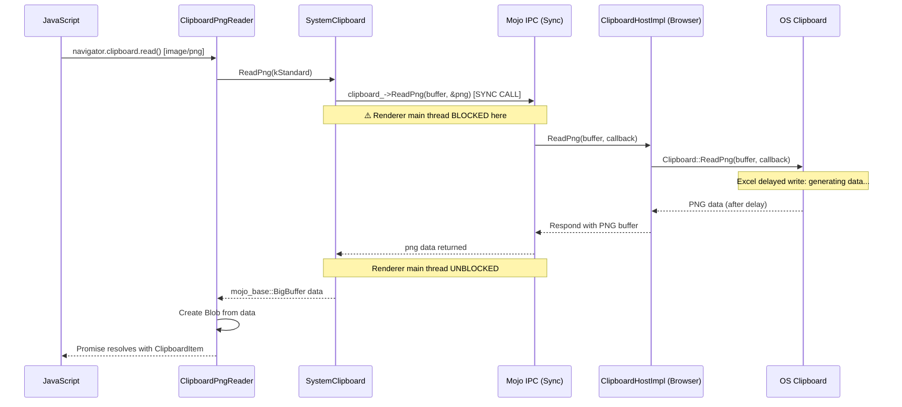
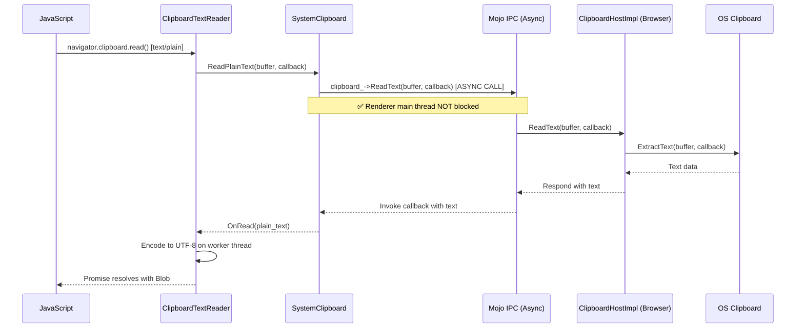

# Fix Assessment: 474131935

## Executive Summary

The Async Clipboard API's `navigator.clipboard.read()` blocks the renderer's main thread when reading PNG images because `ClipboardPngReader::Read()` uses a **synchronous mojo IPC call** to `ReadPng`, while all other clipboard read methods (Text, HTML, SVG, CustomFormats) already use asynchronous callback-based patterns. The fix is to add an async `ReadPng` overload to `SystemClipboard` and use it in `ClipboardPngReader`, mirroring the existing async pattern used by other clipboard readers. **Changing the ClipboardHost mojom from `[Sync]` to async is NOT required.**

## Bug Analysis

### Problem Statement
When a web application calls `navigator.clipboard.read()` to read image content from the clipboard, the browser's renderer thread blocks until the clipboard data is fully available. With applications like Microsoft Excel that use delayed clipboard writes, this can freeze the browser UI for several seconds, defeating the purpose of the "Async" Clipboard API.

### Expected Behavior
`navigator.clipboard.read()` should be fully non-blocking: the JavaScript Promise should resolve asynchronously without freezing the browser UI, regardless of how long the OS clipboard takes to provide data.

### Actual Behavior
When reading PNG/image data via the Async Clipboard API, the renderer's main thread is blocked by a synchronous mojo IPC call to `ClipboardHost::ReadPng`. If the clipboard source application (e.g., Excel with delayed writes) takes time to generate the clipboard data, the browser UI freezes until the data is available.

### Triggering Conditions
1. A source application (e.g., Microsoft Excel) copies data using **delayed clipboard writes** — the actual data is generated only when another app requests it.
2. A web page calls `navigator.clipboard.read()` requesting image/PNG content.
3. The synchronous `ReadPng` mojo IPC blocks the renderer while Excel generates the HTML/image payload.
4. The browser appears frozen until Excel completes writing the data.

## Root Cause Analysis

### Code Investigation

Investigation traced the data flow from the JavaScript `navigator.clipboard.read()` API through Blink's clipboard reader layer to the mojo IPC boundary with the browser process:

1. **JavaScript API entry**: `navigator.clipboard.read()` → `ClipboardPromise` → creates a `ClipboardReader` per MIME type.
2. **Reader dispatch**: `ClipboardReader::Create()` selects `ClipboardPngReader` for `image/png`.
3. **The blocking call**: `ClipboardPngReader::Read()` calls `system_clipboard()->ReadPng()` **synchronously**.
4. **SystemClipboard sync path**: `SystemClipboard::ReadPng()` uses `clipboard_->ReadPng(buffer, &png)` — the **sync mojo IPC variant** that blocks the calling thread until the browser responds.
5. **Browser side** (not the issue): `ClipboardHostImpl::ReadPng()` already uses an async callback pattern and (on Windows with `kNonBlockingOsClipboardReads` enabled by default) posts OS clipboard reads to a worker thread.

The contrast with other read methods is clear:
- **ReadText**: `ClipboardTextReader::Read()` → `system_clipboard()->ReadPlainText(buffer, callback)` → **async** ✅
- **ReadHTML**: `ClipboardHtmlReader::Read()` → `system_clipboard()->ReadHTML(callback)` → **async** ✅
- **ReadSvg**: `ClipboardSvgReader::Read()` → `system_clipboard()->ReadSvg(callback)` → **async** ✅
- **ReadPng**: `ClipboardPngReader::Read()` → `system_clipboard()->ReadPng(buffer)` → **SYNC** ❌

### Key Files Identified
- [/third_party/blink/renderer/modules/clipboard/clipboard_reader.cc#L48](/third_party/blink/renderer/modules/clipboard/clipboard_reader.cc#L48) - `ClipboardPngReader::Read()` makes the **synchronous** `ReadPng` call (ROOT CAUSE)
- [/third_party/blink/renderer/core/clipboard/system_clipboard.cc#L249](/third_party/blink/renderer/core/clipboard/system_clipboard.cc#L249) - `SystemClipboard::ReadPng()` — only has sync variant (uses `clipboard_->ReadPng(buffer, &png)`)
- [/third_party/blink/renderer/core/clipboard/system_clipboard.h#L91](/third_party/blink/renderer/core/clipboard/system_clipboard.h#L91) - `SystemClipboard` header — missing async `ReadPng` overload
- [/third_party/blink/public/mojom/clipboard/clipboard.mojom#L112](/third_party/blink/public/mojom/clipboard/clipboard.mojom#L112) - `ReadPng` marked `[Sync]` in mojom (generates both sync+async C++ code)
- [/content/browser/renderer_host/clipboard_host_impl.cc#L363](/content/browser/renderer_host/clipboard_host_impl.cc#L363) - Browser-side `ReadPng` handler (already async with callback)
- [/ui/base/clipboard/clipboard_win.cc#L725](/ui/base/clipboard/clipboard_win.cc#L725) - Windows clipboard `ReadPng` (async via `ReadAsync()` + worker thread)
- [/ui/base/ui_base_features.cc#L409](/ui/base/ui_base_features.cc#L409) - `kNonBlockingOsClipboardReads` feature flag (ENABLED BY DEFAULT)
- [/third_party/blink/renderer/core/clipboard/data_object_item.cc#L173](/third_party/blink/renderer/core/clipboard/data_object_item.cc#L173) - Another sync `ReadPng` caller (DataTransfer path, not Async Clipboard API)

### Root Cause
**Location**: [/third_party/blink/renderer/modules/clipboard/clipboard_reader.cc#L48](/third_party/blink/renderer/modules/clipboard/clipboard_reader.cc#L48)
**Function**: `ClipboardPngReader::Read()`
**Issue**: Uses synchronous `SystemClipboard::ReadPng()` which calls `clipboard_->ReadPng(buffer, &png)` — the sync mojo IPC variant that blocks the renderer's main thread until the browser process responds. Unlike `ClipboardTextReader`, `ClipboardHtmlReader`, and `ClipboardSvgReader` which all use async callback-based overloads, `ClipboardPngReader` was never updated to use an async pattern.

### Code Flow Diagram


### Comparison with Working Async Pattern (ReadText)


## Sync vs Async Mojom Assessment

### Question: Is it required to change ClipboardHost mojom from `[Sync]` to Async?

**Answer: NO, it is NOT strictly required.**

### Detailed Analysis

#### How `[Sync]` Works in Mojo

Per the [Mojo C++ Bindings documentation](/mojo/public/cpp/bindings/README.md#Synchronous-Calls):

> *"The `[Sync]` annotation does not affect the bindings for the service side and therefore does not guard against re-entrancy."*

The `[Sync]` annotation in the mojom generates **BOTH** sync and async C++ call signatures on the client (renderer) side:

```cpp
// Generated from [Sync] ReadPng(ClipboardBuffer buffer) => (BigBuffer png);

class ClipboardHost {
 public:
  // SYNC variant - blocks calling thread
  virtual bool ReadPng(ClipboardBuffer buffer, ::mojo_base::BigBuffer* out_png);

  // ASYNC variant - non-blocking, uses callback
  using ReadPngCallback = base::OnceCallback<void(::mojo_base::BigBuffer)>;
  virtual void ReadPng(ClipboardBuffer buffer, ReadPngCallback callback) = 0;
};
```

The **renderer can already call the async variant** without any mojom changes. The browser-side implementation is identical regardless — it always receives a callback.

#### Current Call Patterns in Async Clipboard API

| Method | Mojom Annotation | Renderer Calling Pattern | Blocks Renderer? |
|--------|-----------------|-------------------------|-------------------|
| `ReadText` | `[Sync]` | Uses async callback variant | ❌ No |
| `ReadHtml` | `[Sync]` | Uses async callback variant | ❌ No |
| `ReadSvg` | No `[Sync]` | Uses async callback (only option) | ❌ No |
| `ReadPng` | `[Sync]` | **Uses sync variant** | ⚠️ **YES** |
| `ReadAvailableCustomAndStandardFormats` | `[Sync]` | Uses async callback variant | ❌ No |
| `ReadUnsanitizedCustomFormat` | No `[Sync]` | Uses async callback (only option) | ❌ No |

#### Browser-Side OS Clipboard Access

| Platform | How OS Clipboard Is Read | Browser UI Blocked? |
|----------|-------------------------|---------------------|
| **Windows** | `kNonBlockingOsClipboardReads` (ENABLED BY DEFAULT) posts reads to `worker_task_runner_` | ❌ No |
| **Linux/Ozone** | Uses `async_clipboard_ozone_->ReadClipboardDataAsync()` | ❌ No |
| **Mac** | Base `Clipboard::ReadPng` wraps in callbacks | Potentially ⚠️ |

**Key insight**: Even though the browser side is already non-blocking (on Windows/Linux), the **renderer is still blocked** because it uses the **sync mojo IPC calling convention** (`clipboard_->ReadPng(buffer, &png)` with output parameter). The sync mojo call blocks the renderer thread until the browser sends back the response, regardless of how the browser internally processes the request.

#### Why Removing `[Sync]` Is Not Necessary

1. The `[Sync]` annotation merely **enables** sync calling — it doesn't force it. The async variant is always available.
2. Removing `[Sync]` would break other callers that legitimately use the sync variant:
   - `DataObjectItem::GetAsFile()` at [/third_party/blink/renderer/core/clipboard/data_object_item.cc#L173](/third_party/blink/renderer/core/clipboard/data_object_item.cc#L173) (traditional paste via DataTransfer events)
   - `SystemClipboard::ReadImageAsImageMarkup()` at [/third_party/blink/renderer/core/clipboard/system_clipboard.cc#L269](/third_party/blink/renderer/core/clipboard/system_clipboard.cc#L269) (paste command)
3. Removing `[Sync]` would be a much larger change with higher risk, requiring all sync callers to be refactored simultaneously.

## Fix Options

### Option 1: Add Async `ReadPng` to SystemClipboard + Update ClipboardPngReader ⭐ RECOMMENDED

- **Description**: Add an async overload of `SystemClipboard::ReadPng()` that takes a callback (matching the pattern of `ReadPlainText`, `ReadHTML`, `ReadSvg`), then change `ClipboardPngReader::Read()` to use it with a callback instead of the sync variant.
- **Files to modify**:
  - [/third_party/blink/renderer/core/clipboard/system_clipboard.h#L91](/third_party/blink/renderer/core/clipboard/system_clipboard.h#L91) — Add async `ReadPng` overload declaration
  - [/third_party/blink/renderer/core/clipboard/system_clipboard.cc#L249](/third_party/blink/renderer/core/clipboard/system_clipboard.cc#L249) — Add async `ReadPng` implementation
  - [/third_party/blink/renderer/modules/clipboard/clipboard_reader.cc#L36](/third_party/blink/renderer/modules/clipboard/clipboard_reader.cc#L36) — Refactor `ClipboardPngReader::Read()` to use async pattern with callback
- **Complexity**: Low
- **Risk**: Low
- **Pros**:
  - Minimal change — only touches the Async Clipboard API path
  - Follows established patterns (identical to how ReadText/ReadHTML/ReadSvg already work)
  - Does not break existing sync callers (DataObjectItem, clipboard commands)
  - No mojom changes needed
  - No changes to browser-side code
- **Cons**:
  - Leaves the sync `ReadPng` available for future misuse
  - Does not fix potential blocking in DataTransfer/paste command paths (different, less critical issue)

### Option 2: Remove `[Sync]` from ReadPng in Mojom + Refactor All Callers

- **Description**: Remove the `[Sync]` annotation from `ReadPng` in `clipboard.mojom`, forcing all callers to use the async variant. Refactor `SystemClipboard::ReadPng()`, `DataObjectItem`, and `ReadImageAsImageMarkup()` to use callbacks.
- **Files to modify**:
  - [/third_party/blink/public/mojom/clipboard/clipboard.mojom#L112](/third_party/blink/public/mojom/clipboard/clipboard.mojom#L112) — Remove `[Sync]` from ReadPng
  - [/third_party/blink/renderer/core/clipboard/system_clipboard.h](/third_party/blink/renderer/core/clipboard/system_clipboard.h) — Replace sync `ReadPng` with async-only
  - [/third_party/blink/renderer/core/clipboard/system_clipboard.cc](/third_party/blink/renderer/core/clipboard/system_clipboard.cc) — Update implementation + `ReadImageAsImageMarkup`
  - [/third_party/blink/renderer/modules/clipboard/clipboard_reader.cc](/third_party/blink/renderer/modules/clipboard/clipboard_reader.cc) — Update `ClipboardPngReader`
  - [/third_party/blink/renderer/core/clipboard/data_object_item.cc#L173](/third_party/blink/renderer/core/clipboard/data_object_item.cc#L173) — Refactor to async
  - [/third_party/blink/renderer/core/editing/commands/clipboard_commands.cc#L486](/third_party/blink/renderer/core/editing/commands/clipboard_commands.cc#L486) — Refactor paste command
  - [/third_party/blink/renderer/core/clipboard/system_clipboard_test.cc](/third_party/blink/renderer/core/clipboard/system_clipboard_test.cc) — Update tests
  - [/third_party/blink/renderer/core/testing/mock_clipboard_host.cc](/third_party/blink/renderer/core/testing/mock_clipboard_host.cc) — Update mock
- **Complexity**: High
- **Risk**: Medium-High
- **Pros**:
  - Prevents future developers from accidentally using sync ReadPng
  - Fixes blocking for ALL ReadPng callers (not just Async Clipboard API)
  - Cleaner architectural direction
- **Cons**:
  - Much larger change with more files affected
  - Higher risk of introducing regressions in DataTransfer/paste paths
  - Requires refactoring `DataObjectItem::GetAsFile()` and clipboard commands to be async (significant complexity)
  - Snapshot caching for PNG becomes more complex with async flow

### Option 3: Remove `[Sync]` from ALL Read Methods in Mojom

- **Description**: A comprehensive cleanup removing `[Sync]` from all Read methods (`ReadText`, `ReadHtml`, `ReadRtf`, `ReadPng`, `ReadFiles`, `ReadDataTransferCustomData`, etc.) and refactoring all callers.
- **Files to modify**: All files from Option 2, plus all callers of other sync Read methods.
- **Complexity**: Very High
- **Risk**: High
- **Pros**:
  - Complete architectural cleanup
  - Eliminates all sync mojo clipboard IPCs from renderer
  - Future-proof against any blocking clipboard scenario
- **Cons**:
  - Massive change touching dozens of files
  - Very high risk of regressions
  - Many callers (DataObject, ClipboardCommands, etc.) currently rely on sync semantics
  - Should be done as a multi-CL effort, not a single change
  - Far exceeds the scope of this bug fix

### Option 4: Keep Sync Mojom but Add Async SystemClipboard ReadPng (Same as Option 1) + Also Fix DataObjectItem

- **Description**: Same as Option 1, but also add an async path for `DataObjectItem::GetAsFile()` when reading PNG.
- **Files to modify**: Same as Option 1, plus:
  - [/third_party/blink/renderer/core/clipboard/data_object_item.cc#L173](/third_party/blink/renderer/core/clipboard/data_object_item.cc#L173)
- **Complexity**: Medium
- **Risk**: Medium
- **Pros**:
  - Fixes both the Async Clipboard API path and the DataTransfer paste path
  - More complete fix
- **Cons**:
  - `DataObjectItem::GetAsFile()` returns a `File*` synchronously — converting to async requires refactoring the caller chain
  - Higher complexity and risk than Option 1 for marginal gain (DataTransfer paste is less affected by delayed writes)

## Recommended Approach

**Option 1** is recommended because:

1. **Minimal, surgical change**: Only modifies 3 files with ~30 lines of code changes.
2. **Proven pattern**: Identical to how `ReadText`, `ReadHTML`, and `ReadSvg` already work in the same codebase.
3. **Directly addresses the bug**: The Async Clipboard API is the path reported in the bug (`navigator.clipboard.read()`).
4. **Zero risk to existing code**: The sync `ReadPng` path used by DataTransfer/paste commands remains untouched.
5. **No mojom changes**: Avoids any risk of breaking the mojo interface contract or requiring browser-side changes.
6. **No need to change `[Sync]` annotation**: Per mojo documentation, `[Sync]` generates both sync and async C++ bindings — the renderer simply needs to call the async variant that is already generated.

### Implementation Sketch

**system_clipboard.h** — Add async overload:
```cpp
  mojo_base::BigBuffer ReadPng(mojom::blink::ClipboardBuffer);  // existing sync
  void ReadPng(mojom::blink::ClipboardBuffer buffer,
               mojom::blink::ClipboardHost::ReadPngCallback callback);  // NEW async
```

**system_clipboard.cc** — Add async implementation:
```cpp
void SystemClipboard::ReadPng(
    mojom::blink::ClipboardBuffer buffer,
    mojom::blink::ClipboardHost::ReadPngCallback callback) {
  if (!IsValidBufferType(buffer) || !clipboard_.is_bound()) {
    std::move(callback).Run(mojo_base::BigBuffer());
    return;
  }
  clipboard_->ReadPng(buffer, std::move(callback));
}
```

**clipboard_reader.cc** — Update `ClipboardPngReader`:
```cpp
void Read() override {
    DCHECK_CALLED_ON_VALID_SEQUENCE(sequence_checker_);
    system_clipboard()->ReadPng(
        mojom::blink::ClipboardBuffer::kStandard,
        WTF::BindOnce(&ClipboardPngReader::OnRead, WrapPersistent(this)));
}

void OnRead(mojo_base::BigBuffer data) {
    Blob* blob = nullptr;
    if (data.size()) {
      blob = Blob::Create(data, ui::kMimeTypePng);
    }
    promise_->OnRead(blob);
}
```

## Testing Strategy

- **Unit tests needed**:
  - Update `SystemClipboardTest` to test the new async `ReadPng` overload
  - Verify `ClipboardPngReader` correctly reads PNG via async path
  - Test error/empty cases (unbound clipboard, no PNG data)

- **Web tests needed**:
  - Existing web tests under `third_party/blink/web_tests/external/wpt/clipboard-apis/` should still pass
  - Verify `async-clipboard-read-image.https.html` type tests work correctly

- **Manual verification**:
  1. Copy an image to clipboard from any application
  2. Open a web page calling `navigator.clipboard.read()`
  3. Verify the image is read correctly
  4. Verify the browser UI remains responsive during the read operation
  5. (Windows) Copy cells from Excel, then read clipboard — verify no UI freeze

## Related Code References
- Similar async pattern: `ClipboardTextReader::Read()` at [/third_party/blink/renderer/modules/clipboard/clipboard_reader.cc#L72](/third_party/blink/renderer/modules/clipboard/clipboard_reader.cc#L72) and `ClipboardHtmlReader::Read()` at [/third_party/blink/renderer/modules/clipboard/clipboard_reader.cc#L118](/third_party/blink/renderer/modules/clipboard/clipboard_reader.cc#L118)
- Async `ReadPlainText` overload: [/third_party/blink/renderer/core/clipboard/system_clipboard.cc#L116](/third_party/blink/renderer/core/clipboard/system_clipboard.cc#L116)
- Mojo `[Sync]` documentation: [/mojo/public/cpp/bindings/README.md#Synchronous-Calls](/mojo/public/cpp/bindings/README.md#Synchronous-Calls)
- Windows non-blocking clipboard reads: [/ui/base/clipboard/clipboard_win.cc#L272](/ui/base/clipboard/clipboard_win.cc#L272) (`kNonBlockingOsClipboardReads`)
- Spec reference: [W3C Async Clipboard API](https://www.w3.org/TR/clipboard-apis/#async-clipboard-api)
