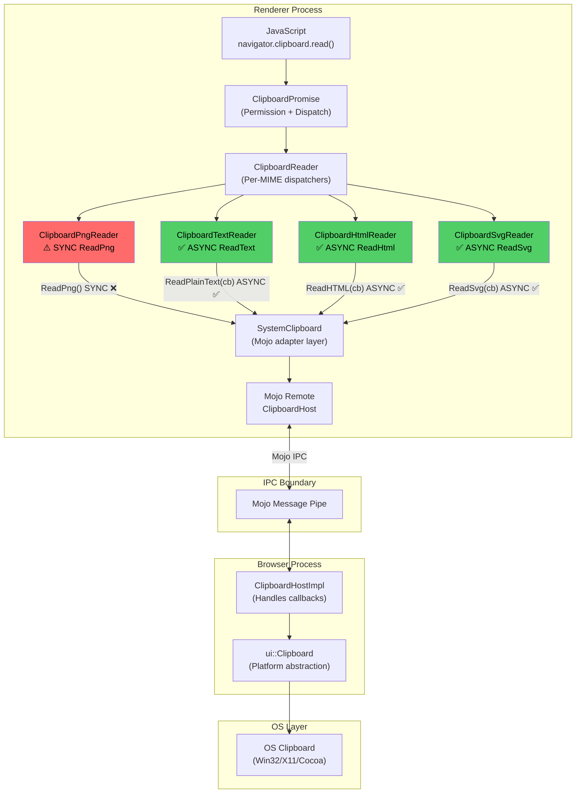
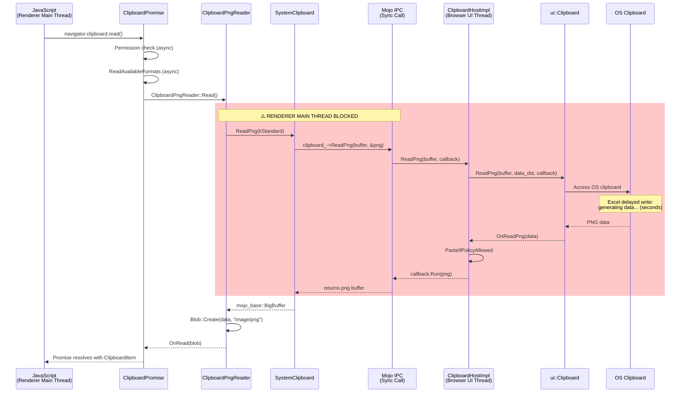
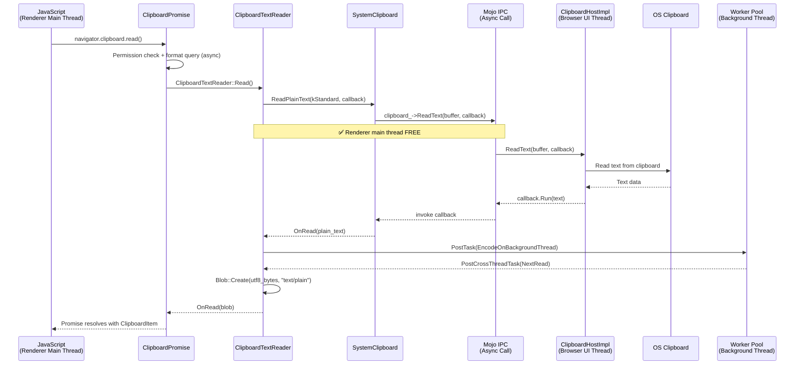

# High-Level Design: 474131935

## 1. Executive Summary

The Async Clipboard API (`navigator.clipboard.read()`) blocks the renderer's main thread when reading PNG images because `ClipboardPngReader::Read()` invokes the **synchronous mojo IPC variant** of `ReadPng`, while all other clipboard format readers (Text, HTML, SVG, Custom Formats) already use asynchronous callback-based patterns. The bug occurs at the IPC boundary between the Renderer and Browser processes — specifically in the Blink `SystemClipboard` layer that bridges Blink's clipboard readers to the browser-side `ClipboardHostImpl` via mojo.

The fix is to add an async `ReadPng` overload to `SystemClipboard` and use it in `ClipboardPngReader`, mirroring the established async pattern. **No changes to the ClipboardHost mojom `[Sync]` annotation are required** — the `[Sync]` annotation already generates both sync and async C++ client bindings; the renderer simply needs to use the async variant.

## 2. System Context

### 2.1 Overview

The Async Clipboard API is a W3C-specified Web Platform API that allows web pages to read and write clipboard data asynchronously. In Chromium, this API spans three major layers:

1. **JavaScript/Blink Layer** (Renderer Process): Handles the web-facing `navigator.clipboard.read()` API, permission checks, MIME type dispatching, and Promise resolution.
2. **Mojo IPC Layer**: Bridges Renderer ↔ Browser process communication via the `ClipboardHost` mojom interface.
3. **Browser/Platform Layer** (Browser Process): `ClipboardHostImpl` receives IPC calls and delegates to platform-specific `ui::Clipboard` implementations (Windows, Linux, Mac) that access the OS clipboard.

The bug sits at **layer 2** — the mojo IPC call convention used by `SystemClipboard::ReadPng()` is synchronous, blocking the renderer's main thread while the browser process reads from the OS clipboard. This is especially problematic when applications like Microsoft Excel use delayed clipboard writes, causing multi-second UI freezes.

### 2.2 Related Specs
- [W3C Async Clipboard API Specification](https://www.w3.org/TR/clipboard-apis/#async-clipboard-api)
- [Mojo C++ Bindings — Synchronous Calls](https://source.chromium.org/chromium/chromium/src/+/main:mojo/public/cpp/bindings/README.md) (section on `[Sync]` annotation)
- [Chromium Clipboard Design](https://chromium.googlesource.com/chromium/src/+/HEAD/docs/design/) (general IPC patterns)

## 3. Component Architecture

### 3.1 Major Components

| Component | Location | Responsibility |
|-----------|----------|----------------|
| `ClipboardPromise` | `/third_party/blink/renderer/modules/clipboard/clipboard_promise.cc` | JavaScript Promise lifecycle, permission validation, dispatches reads to ClipboardReaders |
| `ClipboardReader` (base) | `/third_party/blink/renderer/modules/clipboard/clipboard_reader.cc` | Abstract base; per-MIME-type readers (Png, Text, Html, Svg, Custom) |
| `ClipboardPngReader` | `/third_party/blink/renderer/modules/clipboard/clipboard_reader.cc` | Reads PNG from clipboard — **uses sync IPC (BUG)** |
| `ClipboardTextReader` | `/third_party/blink/renderer/modules/clipboard/clipboard_reader.cc` | Reads plain text from clipboard — uses async IPC ✅ |
| `ClipboardHtmlReader` | `/third_party/blink/renderer/modules/clipboard/clipboard_reader.cc` | Reads HTML from clipboard — uses async IPC ✅ |
| `ClipboardSvgReader` | `/third_party/blink/renderer/modules/clipboard/clipboard_reader.cc` | Reads SVG from clipboard — uses async IPC ✅ |
| `SystemClipboard` | `/third_party/blink/renderer/core/clipboard/system_clipboard.cc` | Blink-side adapter over mojo `ClipboardHost` remote; provides sync and async read/write methods |
| `ClipboardHost` (mojom) | `/third_party/blink/public/mojom/clipboard/clipboard.mojom` | Mojo interface definition; `[Sync]` on `ReadPng` generates both sync and async C++ bindings |
| `ClipboardHostImpl` | `/content/browser/renderer_host/clipboard_host_impl.cc` | Browser-side implementation; handles clipboard reads with async callbacks, applies paste policies |
| `ui::Clipboard` | `/ui/base/clipboard/clipboard.h` | Platform abstraction for OS clipboard access |
| `ClipboardWin` | `/ui/base/clipboard/clipboard_win.cc` | Windows implementation; uses `ReadAsync()` + worker thread when `kNonBlockingOsClipboardReads` enabled |
| `DataObjectItem` | `/third_party/blink/renderer/core/clipboard/data_object_item.cc` | Traditional DataTransfer paste path; also uses sync `ReadPng` (separate from Async Clipboard API) |

### 3.2 Component Diagram



## 4. Process Architecture

### 4.1 Process Boundaries

The clipboard read flow crosses **one process boundary**: Renderer → Browser.

| Process | Thread | Role |
|---------|--------|------|
| **Renderer** | Main thread | Runs JavaScript, Blink DOM, ClipboardReaders, SystemClipboard |
| **Browser** | IO thread | Receives mojo IPC messages |
| **Browser** | UI thread | `ClipboardHostImpl` processes clipboard requests |
| **Browser** | Worker thread (Windows) | OS clipboard access via `ReadAsync()` when `kNonBlockingOsClipboardReads` enabled |

**Critical insight**: The Renderer's main thread is the **bottleneck**. When `SystemClipboard::ReadPng()` uses the sync mojo call `clipboard_->ReadPng(buffer, &png)`, the renderer main thread **blocks** until the browser process responds — freezing all JavaScript execution, DOM updates, and event processing.

### 4.2 IPC Flow — Current (Buggy) PNG Read



### 4.3 IPC Flow — Working Async Text Read (Reference Pattern)



## 5. Data Flow

### 5.1 Normal Flow (Expected — After Fix)

```mermaid
flowchart LR
    A["JS: navigator.clipboard.read()<br/>[image/png]"] --> B["ClipboardPngReader::Read()"]
    B --> C["SystemClipboard::ReadPng(buffer, callback)<br/>✅ ASYNC mojo call"]
    C --> D["Mojo IPC (non-blocking)"]
    D --> E["ClipboardHostImpl::ReadPng()"]
    E --> F["ui::Clipboard::ReadPng()"]
    F --> G["OS Clipboard"]
    G --> H["PNG data returned via callback"]
    H --> I["OnRead callback on main thread"]
    I --> J["Blob::Create → Promise resolves"]

    style C fill:#51cf66,color:#000
    style D fill:#51cf66,color:#000
```



### 5.2 Buggy Flow (Current — Before Fix)

```mermaid
flowchart LR
    A["JS: navigator.clipboard.read()<br/>[image/png]"] --> B["ClipboardPngReader::Read()"]
    B --> C["SystemClipboard::ReadPng(buffer)<br/>❌ SYNC mojo call"]
    C --> D["Mojo IPC (BLOCKS renderer)"]
    D --> E["ClipboardHostImpl::ReadPng()"]
    E --> F["ui::Clipboard::ReadPng()"]
    F --> G["OS Clipboard<br/>(delayed write app)"]
    G -->|"⏳ Seconds of delay"| H["PNG data returned"]
    H --> I["Mojo responds (sync)"]
    I --> J["Renderer unblocked"]
    J --> K["Blob::Create → Promise resolves"]

    style C fill:#ff6b6b,color:#000
    style D fill:#ff6b6b,color:#000
    style G fill:#ffa94d,color:#000
```



## 6. Key Interfaces

### 6.1 Public APIs (Web Platform)

- `navigator.clipboard.read()` — Returns `Promise<ClipboardItem[]>`. Entry point for the Async Clipboard API read operation. Defined in [W3C Clipboard API spec](https://www.w3.org/TR/clipboard-apis/#dom-clipboard-read).

### 6.2 Mojo Interface (IPC Boundary)

- `ClipboardHost::ReadPng(ClipboardBuffer buffer) => (BigBuffer png)` — Mojom method marked `[Sync]`, generating both sync and async C++ client bindings:
  - **Sync**: `bool ReadPng(ClipboardBuffer buffer, mojo_base::BigBuffer* png)` — blocks calling thread
  - **Async**: `void ReadPng(ClipboardBuffer buffer, ReadPngCallback callback)` — non-blocking

### 6.3 Internal Interfaces (Blink Renderer)

- `SystemClipboard::ReadPng(mojom::blink::ClipboardBuffer)` — Current sync-only method; returns `mojo_base::BigBuffer` directly. **Needs async overload.**
- `SystemClipboard::ReadPlainText(buffer, callback)` — Existing async overload pattern to follow.
- `SystemClipboard::ReadHTML(callback)` — Existing async overload pattern to follow.
- `SystemClipboard::ReadSvg(callback)` — Existing async overload pattern to follow.
- `ClipboardReader::Read()` — Virtual method overridden per MIME type; each reader invokes SystemClipboard.
- `ClipboardPromise::OnRead(Blob*)` — Called by readers when data is available; resolves the JS Promise.

### 6.4 Browser-Side Interfaces

- `ClipboardHostImpl::ReadPng(ClipboardBuffer, ReadPngCallback)` — Browser-side handler; already async, uses callback chain for paste policy checks.
- `ui::Clipboard::ReadPng(ClipboardBuffer, DataEndpoint, ReadPngCallback)` — Platform abstraction; implementations are async on Windows (worker thread) and Linux (async X11/Wayland).

## 7. Threading Model

### 7.1 Renderer Process

| Thread | Responsibility | Blocking Concern |
|--------|---------------|------------------|
| **Main thread** | JavaScript execution, DOM, Blink, `ClipboardReader::Read()`, `SystemClipboard` mojo calls | **YES — sync mojo IPC blocks this thread** |
| **Worker pool** (background) | Text/HTML encoding (UTF-8/sanitization) after async read completes | No — non-blocking |

- **Current problem**: `ClipboardPngReader::Read()` calls `SystemClipboard::ReadPng()` synchronously on the main thread. The sync mojo call `clipboard_->ReadPng(buffer, &png)` suspends the main thread's message loop until the browser responds.
- **After fix**: `ClipboardPngReader::Read()` will use the async overload, posting a callback. The main thread returns immediately to process other events.

### 7.2 Browser Process

| Thread | Responsibility |
|--------|---------------|
| **IO thread** | Receives mojo IPC messages, dispatches to UI thread |
| **UI thread** | `ClipboardHostImpl` processes clipboard requests, applies paste policies |
| **Worker thread** (Windows) | OS clipboard access via `ClipboardWin::ReadAsync()` with `kNonBlockingOsClipboardReads` (ENABLED BY DEFAULT) |

- The browser side is already non-blocking on Windows/Linux. The OS clipboard read is dispatched to a worker thread (Windows) or uses async platform APIs (Linux/Ozone).
- Even though the browser handles the request asynchronously, the **renderer sync mojo call** still blocks because it waits for the browser's response before continuing.

### 7.3 Synchronization Points

1. **Permission check** — Async; does not block renderer main thread.
2. **Format availability query** — Uses async mojo callback in the Async Clipboard API path.
3. **Data read (PNG)** — **BLOCKS** renderer main thread via sync mojo IPC. (This is the bug.)
4. **Data read (Text/HTML/SVG)** — Non-blocking; uses async mojo callbacks.

## 8. External Dependencies

### 8.1 Other Chrome Components
- **Permissions system** — `ClipboardPromise` checks clipboard-read permission before reading.
- **Content Security / Paste Policy** — `ClipboardHostImpl::PasteIfPolicyAllowed()` applies enterprise paste restrictions.
- **Mojo IPC** — Message pipe between renderer and browser; `[Sync]` annotation controls client-side code generation.

### 8.2 Platform APIs
- **Windows**: Win32 `OpenClipboard()` / `GetClipboardData()` — can block if source app uses delayed rendering.
- **Linux/X11/Wayland**: Selection protocol — inherently async; `async_clipboard_ozone_->ReadClipboardDataAsync()`.
- **macOS**: `NSPasteboard` — generally fast but can block for large data.

### 8.3 Third-Party Libraries
- **Skia** — Used for image encoding (bitmap → PNG) on some platforms.
- **libpng** — PNG encoding/decoding.

## 9. Sync vs Async Mojom Assessment

### 9.1 Question: Must we change ClipboardHost mojom from `[Sync]` to Async?

**Answer: NO — it is NOT required, and doing so would be counterproductive.**

### 9.2 How `[Sync]` Works in Mojo

Per the [Mojo C++ Bindings documentation](/mojo/public/cpp/bindings/README.md):

> *"The `[Sync]` annotation does not affect the bindings for the service side and therefore does not guard against re-entrancy."*

The `[Sync]` annotation on a mojom method generates **both** client-side signatures:

```cpp
// From clipboard.mojom: [Sync] ReadPng(ClipboardBuffer buffer) => (BigBuffer png);

class ClipboardHost {
 public:
  // SYNC variant — blocks calling thread until response arrives
  virtual bool ReadPng(ClipboardBuffer buffer, mojo_base::BigBuffer* out_png);

  // ASYNC variant — non-blocking, callback invoked when response arrives
  using ReadPngCallback = base::OnceCallback<void(mojo_base::BigBuffer)>;
  virtual void ReadPng(ClipboardBuffer buffer, ReadPngCallback callback) = 0;
};
```

The renderer **can already call the async variant** without any mojom changes. The browser-side implementation (`ClipboardHostImpl::ReadPng`) always receives a callback regardless of which client-side variant is used.

### 9.3 Does Sync Mojo Block the UI?

**Yes, sync mojo IPC blocks the calling thread.** When the renderer calls `clipboard_->ReadPng(buffer, &png)` (the sync variant), the renderer's main thread is suspended until the browser responds. During this time:
- JavaScript execution is paused
- DOM updates are frozen
- User input events are queued
- The browser appears unresponsive from the user's perspective

However, this blocking happens because the **renderer chose to call the sync variant**. The async variant is equally available and does NOT block.

### 9.4 Why Removing `[Sync]` Is Unnecessary and Risky

| Factor | Assessment |
|--------|-----------|
| **Already generates async bindings** | `[Sync]` enables sync calling but does NOT prevent async calling. The async variant is always available. |
| **Would break existing sync callers** | `DataObjectItem::GetAsFile()` and `SystemClipboard::ReadImageAsImageMarkup()` legitimately use the sync `ReadPng` variant for traditional paste (DataTransfer events). |
| **Much larger change scope** | Removing `[Sync]` would require refactoring all sync callers to async, including complex code paths in clipboard commands and DataTransfer. |
| **Higher regression risk** | Traditional paste via `Ctrl+V` / `document.execCommand('paste')` currently relies on sync semantics. Converting these to async is a separate, larger effort. |
| **The fix is on the client side** | The problem is that `ClipboardPngReader` calls the sync variant. Simply switching it to the async variant fixes the bug completely. |

### 9.5 Current Calling Patterns

| Mojom Method | `[Sync]`? | Async Clipboard API Reader | Uses Sync or Async? | Blocks? |
|---|---|---|---|---|
| `ReadText` | Yes | `ClipboardTextReader` | Async callback ✅ | No |
| `ReadHtml` | Yes | `ClipboardHtmlReader` | Async callback ✅ | No |
| `ReadSvg` | No | `ClipboardSvgReader` | Async callback ✅ | No |
| `ReadPng` | Yes | `ClipboardPngReader` | **Sync variant ❌** | **YES** |
| `ReadAvailableCustomAndStandardFormats` | Yes | `ClipboardPromise` | Async callback ✅ | No |
| `ReadUnsanitizedCustomFormat` | No | `ClipboardCustomFormatReader` | Async callback ✅ | No |

**Key insight**: `ReadText` and `ReadHtml` are also `[Sync]` in the mojom, but their readers already use the async variant. The `[Sync]` annotation is not the problem — the problem is that `ClipboardPngReader` chose to call the sync variant.

## 10. Impact of Fix

### 10.1 Components Affected

| Component | Change | Risk |
|-----------|--------|------|
| `SystemClipboard` (`.h` + `.cc`) | Add async `ReadPng` overload (new method alongside existing sync) | Very Low — additive change |
| `ClipboardPngReader` (in `clipboard_reader.cc`) | Switch from sync `ReadPng()` to async `ReadPng(callback)` | Low — follows established pattern |
| `ClipboardHost` mojom | **No change needed** | None |
| `ClipboardHostImpl` (browser) | **No change needed** | None |
| `DataObjectItem` (sync caller) | **Not touched** — continues using sync variant | None |

### 10.2 Risk Assessment

- **Scope**: Narrow — 3 files, ~30 lines of code changes
- **Risk Level**: Low
  - The fix follows the exact same pattern already used by `ClipboardTextReader`, `ClipboardHtmlReader`, and `ClipboardSvgReader`
  - The sync `ReadPng` variant remains available for other callers (`DataObjectItem`)
  - No mojom changes, no browser-side changes, no protocol changes
  - No changes to the mojo interface contract
- **Testing Coverage**:
  - Existing WPT tests under `third_party/blink/web_tests/external/wpt/clipboard-apis/` validate clipboard read behavior
  - `SystemClipboard` unit tests can be extended for the new async overload
  - Manual testing with delayed-write applications (Excel) validates the non-blocking behavior
  - All existing sync callers remain untouched and pass existing tests
