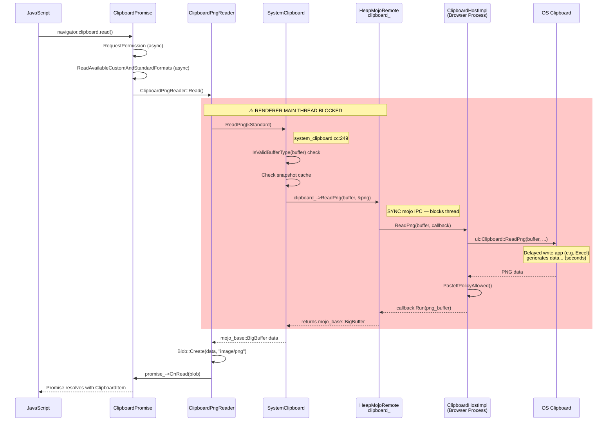
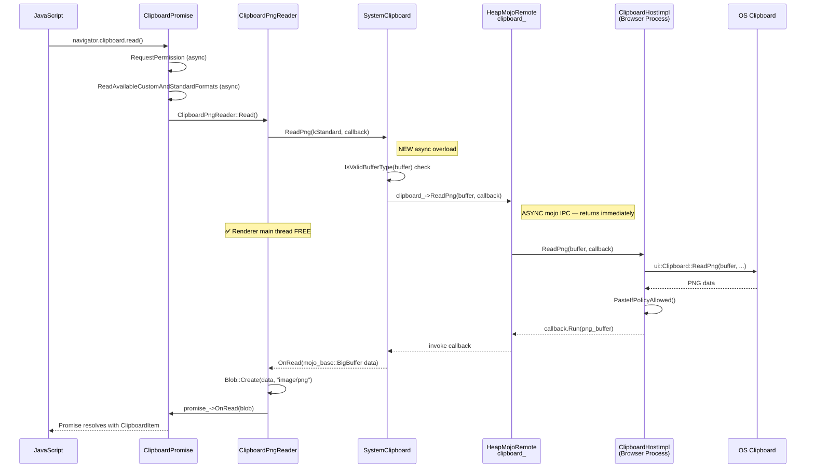
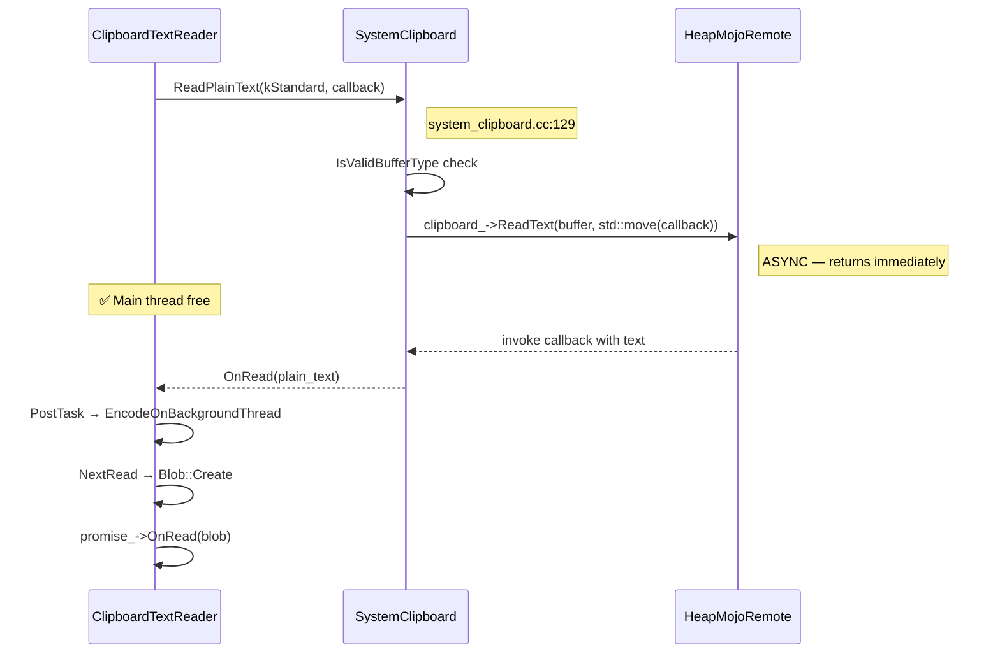

# Low-Level Design: 474131935

## 1. Files to Modify

| File | Type | Changes | Lines |
|------|------|---------|-------|
| [/third_party/blink/renderer/core/clipboard/system_clipboard.h](/third_party/blink/renderer/core/clipboard/system_clipboard.h) | Modify | Add async `ReadPng` overload declaration | ~2 |
| [/third_party/blink/renderer/core/clipboard/system_clipboard.cc](/third_party/blink/renderer/core/clipboard/system_clipboard.cc) | Modify | Add async `ReadPng` implementation | ~10 |
| [/third_party/blink/renderer/modules/clipboard/clipboard_reader.cc](/third_party/blink/renderer/modules/clipboard/clipboard_reader.cc) | Modify | Refactor `ClipboardPngReader::Read()` to use async callback | ~20 |

**Files NOT modified (and why)**:
- `/third_party/blink/public/mojom/clipboard/clipboard.mojom` — `[Sync]` annotation already generates both sync and async C++ bindings. No change needed (see Section 10).
- `/content/browser/renderer_host/clipboard_host_impl.cc` — Browser side already handles `ReadPng` asynchronously via callback. No change needed.
- `/third_party/blink/renderer/core/clipboard/data_object_item.cc` — Uses sync `ReadPng` for traditional DataTransfer paste path (out of scope; different API path).
- `/third_party/blink/renderer/core/editing/commands/clipboard_commands.cc` — Uses `ReadImageAsImageMarkup()` which internally uses sync `ReadPng`; separate from the Async Clipboard API path and intentionally synchronous for paste commands.

## 2. Class Hierarchy

### 2.1 Class Diagram

```mermaid
classDiagram
    class ClipboardReader {
        <<abstract>>
        +Read()* void
        #NextRead(Vector~uint8_t~ utf8_bytes)* void
        #system_clipboard() SystemClipboard*
        #promise_ : Member~ClipboardPromise~
        #clipboard_task_runner_ : scoped_refptr
        #sequence_checker_ : SEQUENCE_CHECKER
    }

    class ClipboardPngReader {
        +Read() void
        -NextRead(Vector~uint8_t~) void
        -OnRead(mojo_base::BigBuffer data) void  ★NEW
    }

    class ClipboardTextReader {
        +Read() void
        -OnRead(const String& plain_text) void
        -EncodeOnBackgroundThread() static void
        -NextRead(Vector~uint8_t~) void
    }

    class ClipboardHtmlReader {
        +Read() void
        -OnRead(String, KURL, unsigned, unsigned) void
        -EncodeOnBackgroundThread() static void
        -NextRead(Vector~uint8_t~) void
    }

    class ClipboardSvgReader {
        +Read() void
        -OnRead(const String& svg_string) void
        -EncodeOnBackgroundThread() static void
        -NextRead(Vector~uint8_t~) void
    }

    class ClipboardCustomFormatReader {
        +Read() void
        -OnCustomFormatRead(mojo_base::BigBuffer data) void
        -NextRead(Vector~uint8_t~) void
    }

    ClipboardReader <|-- ClipboardPngReader : inherits
    ClipboardReader <|-- ClipboardTextReader : inherits
    ClipboardReader <|-- ClipboardHtmlReader : inherits
    ClipboardReader <|-- ClipboardSvgReader : inherits
    ClipboardReader <|-- ClipboardCustomFormatReader : inherits

    class SystemClipboard {
        +ReadPng(ClipboardBuffer) mojo_base::BigBuffer
        +ReadPng(ClipboardBuffer, ReadPngCallback) void  ★NEW
        +ReadPlainText(ClipboardBuffer) String
        +ReadPlainText(ClipboardBuffer, ReadTextCallback) void
        +ReadHTML(KURL&, unsigned&, unsigned&) String
        +ReadHTML(ReadHtmlCallback) void
        +ReadSvg(ReadSvgCallback) void
        +ReadImageAsImageMarkup(ClipboardBuffer) String
        -clipboard_ : HeapMojoRemote~ClipboardHost~
        -snapshot_ : unique_ptr~Snapshot~
    }

    class ClipboardPromise {
        +OnRead(Blob* blob) void
        +GetExecutionContext() ExecutionContext*
        +GetLocalFrame() LocalFrame*
    }

    ClipboardReader --> SystemClipboard : uses (via system_clipboard())
    ClipboardReader --> ClipboardPromise : reports result (via promise_)

    class "mojom::blink::ClipboardHost" as ClipboardHost {
        <<interface>>
        +ReadPng(buffer, &png) bool  [Sync variant]
        +ReadPng(buffer, ReadPngCallback) void  [Async variant]
        +ReadText(buffer, &text) bool  [Sync variant]
        +ReadText(buffer, ReadTextCallback) void  [Async variant]
    }

    SystemClipboard --> ClipboardHost : clipboard_->ReadPng()
```

### 2.2 Class Responsibilities

- **`ClipboardReader`** (abstract base): Defines the interface for per-MIME-type clipboard readers. Provides access to `SystemClipboard` and `ClipboardPromise`. All subclass methods on the main thread must use `DCHECK_CALLED_ON_VALID_SEQUENCE`.
- **`ClipboardPngReader`** (contains the bug): Reads PNG data from the system clipboard. Currently uses sync `SystemClipboard::ReadPng()` which blocks the renderer main thread. Must be changed to use async overload with callback.
- **`ClipboardTextReader`**: Reads text — already uses async `ReadPlainText(buffer, callback)`. Reference pattern for the fix.
- **`ClipboardHtmlReader`**: Reads HTML — already uses async `ReadHTML(callback)`. Reference pattern for the fix.
- **`ClipboardSvgReader`**: Reads SVG — already uses async `ReadSvg(callback)`. Reference pattern for the fix.
- **`ClipboardCustomFormatReader`**: Reads custom formats — uses async `ReadUnsanitizedCustomFormat(type, callback)`. Reference pattern for the fix.
- **`SystemClipboard`**: Blink-side adapter over `mojom::blink::ClipboardHost` mojo remote. Provides both sync and async read methods for various clipboard formats. Currently missing async `ReadPng` overload.
- **`ClipboardPromise`**: Manages the JavaScript Promise lifecycle. `OnRead(Blob*)` resolves the promise with the clipboard data.
- **`mojom::blink::ClipboardHost`**: Mojo interface to the browser process. The `[Sync]` annotation on `ReadPng` generates both sync and async C++ client-side bindings. The browser side always uses a callback.

## 3. Method-Level Analysis

### 3.1 Call Chain (Bug Path)



### 3.2 Call Chain (Fixed — Async)



### 3.3 Reference Pattern: ClipboardTextReader (Working Async)



### 3.4 Affected Methods

#### `ClipboardPngReader::Read()`
**Location**: [/third_party/blink/renderer/modules/clipboard/clipboard_reader.cc#L45](/third_party/blink/renderer/modules/clipboard/clipboard_reader.cc#L45)

**Current Implementation (Buggy)**:
```cpp
void Read() override {
    DCHECK_CALLED_ON_VALID_SEQUENCE(sequence_checker_);
    mojo_base::BigBuffer data =
        system_clipboard()->ReadPng(mojom::blink::ClipboardBuffer::kStandard);

    Blob* blob = nullptr;
    if (data.size()) {
      blob = Blob::Create(data, ui::kMimeTypePng);
    }
    promise_->OnRead(blob);
}
```

**Issues**:
1. Calls `SystemClipboard::ReadPng(buffer)` — the sync overload that blocks the renderer main thread via sync mojo IPC (`clipboard_->ReadPng(buffer, &png)`).
2. All code after the sync call (Blob creation, promise resolution) cannot execute until the browser process responds — even though none of it depends on the main thread being blocked.
3. Inconsistent with all other ClipboardReader subclasses which use async patterns.

#### `SystemClipboard::ReadPng(ClipboardBuffer)`
**Location**: [/third_party/blink/renderer/core/clipboard/system_clipboard.cc#L249](/third_party/blink/renderer/core/clipboard/system_clipboard.cc#L249)

**Current Implementation**:
```cpp
mojo_base::BigBuffer SystemClipboard::ReadPng(
    mojom::blink::ClipboardBuffer buffer) {
  if (!IsValidBufferType(buffer) || !clipboard_.is_bound())
    return mojo_base::BigBuffer();

  if (snapshot_ && snapshot_->HasPng(buffer)) {
    return snapshot_->Png(buffer);
  }

  mojo_base::BigBuffer png;
  clipboard_->ReadPng(buffer, &png);   // ← SYNC mojo IPC
  if (snapshot_) {
    snapshot_->SetPng(buffer, png);
  }

  return png;
}
```

**Issues**:
1. Only provides a sync interface — no async overload exists (unlike `ReadPlainText`, `ReadHTML`, `ReadSvg` which all have async overloads).
2. Line 259: `clipboard_->ReadPng(buffer, &png)` uses the sync mojo calling convention (output parameter, blocks calling thread).

## 4. Fix Design

### 4.1 Changes Required

#### File 1: [/third_party/blink/renderer/core/clipboard/system_clipboard.h](/third_party/blink/renderer/core/clipboard/system_clipboard.h)

**Before** (line 91):
```cpp
  mojo_base::BigBuffer ReadPng(mojom::blink::ClipboardBuffer);
  String ReadImageAsImageMarkup(mojom::blink::ClipboardBuffer);
```

**After**:
```cpp
  mojo_base::BigBuffer ReadPng(mojom::blink::ClipboardBuffer);
  void ReadPng(mojom::blink::ClipboardBuffer buffer,
               mojom::blink::ClipboardHost::ReadPngCallback callback);
  String ReadImageAsImageMarkup(mojom::blink::ClipboardBuffer);
```

**Rationale**: Add an async overload of `ReadPng` that takes a callback, matching the existing pattern used by `ReadPlainText`, `ReadHTML`, and `ReadSvg`. The sync overload is preserved for existing callers (`DataObjectItem::GetAsFile()`, `ReadImageAsImageMarkup()`).

---

#### File 2: [/third_party/blink/renderer/core/clipboard/system_clipboard.cc](/third_party/blink/renderer/core/clipboard/system_clipboard.cc)

**Insert after** existing `ReadPng` method (after line 265):

```cpp
void SystemClipboard::ReadPng(
    mojom::blink::ClipboardBuffer buffer,
    mojom::blink::ClipboardHost::ReadPngCallback callback) {
  if (!IsValidBufferType(buffer) || !clipboard_.is_bound()) {
    std::move(callback).Run(mojo_base::BigBuffer());
    return;
  }
  clipboard_->ReadPng(buffer, std::move(callback));
}
```

**Rationale**: The new async overload:
1. Performs the same validation checks as the sync variant (`IsValidBufferType`, `clipboard_.is_bound()`).
2. On validation failure, invokes the callback with an empty buffer (matching the sync variant's return of `mojo_base::BigBuffer()`).
3. Calls `clipboard_->ReadPng(buffer, std::move(callback))` — the **async** mojo IPC variant that takes a callback instead of output parameter. This is the same function generated by the mojom `[Sync]` annotation, just using the async calling convention.
4. Does **not** interact with the snapshot cache. The snapshot is designed for sync callers within a `ScopedSystemClipboardSnapshot` scope (used by DataTransfer paste). The Async Clipboard API path does not use snapshots.

**Note on snapshot handling**: The existing async overloads for `ReadPlainText`, `ReadHTML`, and `ReadSvg` also do not interact with the snapshot cache — they pass callbacks directly to mojo. This is correct behavior because:
- The Async Clipboard API (the only user of these async overloads) does not use `ScopedSystemClipboardSnapshot`.
- Snapshot caching is for the synchronous DataTransfer/paste command path which needs multiple reads to see a consistent clipboard state.

---

#### File 3: [/third_party/blink/renderer/modules/clipboard/clipboard_reader.cc](/third_party/blink/renderer/modules/clipboard/clipboard_reader.cc)

**Before** (lines 35-59):
```cpp
class ClipboardPngReader final : public ClipboardReader {
 public:
  explicit ClipboardPngReader(SystemClipboard* system_clipboard,
                              ClipboardPromise* promise)
      : ClipboardReader(system_clipboard, promise) {}
  ~ClipboardPngReader() override = default;

  ClipboardPngReader(const ClipboardPngReader&) = delete;
  ClipboardPngReader& operator=(const ClipboardPngReader&) = delete;

  void Read() override {
    DCHECK_CALLED_ON_VALID_SEQUENCE(sequence_checker_);
    mojo_base::BigBuffer data =
        system_clipboard()->ReadPng(mojom::blink::ClipboardBuffer::kStandard);

    Blob* blob = nullptr;
    if (data.size()) {
      blob = Blob::Create(data, ui::kMimeTypePng);
    }
    promise_->OnRead(blob);
  }

 private:
  void NextRead(Vector<uint8_t> utf8_bytes) override { NOTREACHED(); }
};
```

**After**:
```cpp
class ClipboardPngReader final : public ClipboardReader {
 public:
  explicit ClipboardPngReader(SystemClipboard* system_clipboard,
                              ClipboardPromise* promise)
      : ClipboardReader(system_clipboard, promise) {}
  ~ClipboardPngReader() override = default;

  ClipboardPngReader(const ClipboardPngReader&) = delete;
  ClipboardPngReader& operator=(const ClipboardPngReader&) = delete;

  void Read() override {
    DCHECK_CALLED_ON_VALID_SEQUENCE(sequence_checker_);
    system_clipboard()->ReadPng(
        mojom::blink::ClipboardBuffer::kStandard,
        WTF::BindOnce(&ClipboardPngReader::OnRead, WrapPersistent(this)));
  }

 private:
  void OnRead(mojo_base::BigBuffer data) {
    DCHECK_CALLED_ON_VALID_SEQUENCE(sequence_checker_);
    Blob* blob = nullptr;
    if (data.size()) {
      blob = Blob::Create(data, ui::kMimeTypePng);
    }
    promise_->OnRead(blob);
  }

  void NextRead(Vector<uint8_t> utf8_bytes) override { NOTREACHED(); }
};
```

**Rationale**:
1. `Read()` now calls the async `SystemClipboard::ReadPng(buffer, callback)` overload instead of the sync variant, mirroring `ClipboardTextReader::Read()` (line 72-77), `ClipboardHtmlReader::Read()` (line 134-142), and `ClipboardSvgReader::Read()` (line 220-226).
2. The callback `OnRead(mojo_base::BigBuffer data)` is a new private method that contains the Blob creation and promise resolution logic previously inline in `Read()`.
3. Uses `WTF::BindOnce(&ClipboardPngReader::OnRead, WrapPersistent(this))` — the standard Blink pattern for binding a garbage-collected member function as a callback. `WrapPersistent(this)` ensures the `ClipboardPngReader` instance is kept alive by the garbage collector until the callback fires.
4. `DCHECK_CALLED_ON_VALID_SEQUENCE(sequence_checker_)` added to `OnRead()` to verify it runs on the main thread, matching the pattern in `ClipboardHtmlReader::OnRead()` (line 149) and `ClipboardSvgReader::OnRead()` (line 230).
5. No background thread encoding is needed for PNG (data is already in the correct format), so `OnRead` directly creates the Blob and resolves the promise — identical to `ClipboardCustomFormatReader::OnCustomFormatRead()` (lines 306-309).
6. `NextRead()` remains with `NOTREACHED()` as before — PNG readers don't use the background encoding path.

## 5. Memory & Lifetime Considerations

### 5.1 Object Ownership

| Object | Owner | Lifetime |
|--------|-------|----------|
| `ClipboardPngReader` | Blink GC (garbage collected via `MakeGarbageCollected`) | Alive while `ClipboardPromise` holds a reference; additionally prevented from collection during async callback via `WrapPersistent(this)` |
| `ClipboardPromise` | Blink GC | Alive until JavaScript Promise settles |
| `SystemClipboard` | Blink GC, owned by `LocalFrame` | Frame lifetime |
| `mojo_base::BigBuffer` (in callback) | Moved by value through callback chain | Consumed when `Blob::Create` copies its data |
| `Blob` | Blink GC | Alive while referenced by JavaScript `ClipboardItem` |

### 5.2 Pointer/Reference Safety
- [x] No raw pointer issues — `WrapPersistent(this)` ensures GC-traced strong reference to `ClipboardPngReader` across the async gap.
- [x] Weak pointers handled correctly — not used in this path; `WrapPersistent` provides a strong reference.
- [x] Reference lifetime guaranteed — `ClipboardPromise` (via `promise_`) is a `Member<>` (GC-traced), so it remains valid as long as `ClipboardPngReader` is alive.
- [x] `SystemClipboard` (via `system_clipboard_`) is a `Member<>` (GC-traced), valid for the lifetime of the reader.
- [x] Mojo remote `clipboard_` is a `HeapMojoRemote` — if the pipe is disconnected before callback fires, the callback is dropped (standard mojo behavior for dangling callbacks). This is safe because `WrapPersistent` only prevents GC collection; if the callback is never invoked, the reader is eventually collected when no other references exist.

### 5.3 What Happens If Mojo Pipe Disconnects?

If the mojo connection to `ClipboardHostImpl` is broken (e.g., renderer is being destroyed):
- `HeapMojoRemote` drops pending callbacks — the `OnRead` callback is never invoked.
- `WrapPersistent(this)` is eventually released by the destructor of the dropped callback closure.
- The `ClipboardPngReader` becomes eligible for GC.
- The JavaScript Promise remains pending (unresolved) — this matches the behavior of other async readers.

## 6. Threading Considerations

### 6.1 Thread Safety

All code changes execute exclusively on the **renderer main thread**:

| Method | Thread | Synchronization |
|--------|--------|----------------|
| `ClipboardPngReader::Read()` | Renderer main thread | `DCHECK_CALLED_ON_VALID_SEQUENCE` |
| `ClipboardPngReader::OnRead()` | Renderer main thread | `DCHECK_CALLED_ON_VALID_SEQUENCE` |
| `SystemClipboard::ReadPng(buffer, callback)` | Renderer main thread | Called from main thread |
| Mojo callback dispatch | Renderer main thread | Mojo dispatches on the task runner bound to the remote |

No cross-thread access is introduced. The mojo callback is dispatched on `TaskType::kUserInteraction` task runner (bound during `SystemClipboard` construction at line 67-68), which runs on the renderer main thread.

### 6.2 Required Synchronization

**None required.** The fix does not introduce any shared state or cross-thread access. All state (`promise_`, `system_clipboard_`, the callback closure) is accessed only on the main thread.

### 6.3 Key Difference from Sync Path

| Aspect | Before (Sync) | After (Async) |
|--------|--------------|---------------|
| Main thread during IPC | **Blocked** — thread suspended waiting for mojo response | **Free** — returns to event loop immediately |
| Re-entrancy risk | Sync mojo calls can process incoming sync requests while waiting (per mojo docs) | No re-entrancy — standard async callback |
| Event processing | **Paused** — no DOM events, no JS execution, no rendering | **Normal** — all events and rendering continue |

## 7. Error Handling

### 7.1 Current Error Handling

In the current sync `ReadPng` path:
- If `IsValidBufferType` fails or clipboard remote is unbound → returns empty `mojo_base::BigBuffer()`.
- If clipboard returns empty data → `Blob` is not created (`blob = nullptr`).
- `ClipboardPromise::OnRead(nullptr)` handles the null blob case (resolves promise with no data or rejects).

### 7.2 Changes to Error Handling

The async path preserves identical error handling:
- If `IsValidBufferType` fails or clipboard remote is unbound → callback is invoked with empty `mojo_base::BigBuffer()` (line in new `SystemClipboard::ReadPng` async overload).
- Empty data → `data.size()` is 0 → `blob` remains `nullptr` → `promise_->OnRead(nullptr)`.
- Mojo pipe disconnection → callback is dropped → promise remains pending (same as other async readers).

No changes to error handling semantics are needed.

## 8. Validation Points

### 8.1 DCHECKs to Add/Modify

```cpp
// In ClipboardPngReader::OnRead()
DCHECK_CALLED_ON_VALID_SEQUENCE(sequence_checker_);
// Ensures OnRead is called on the main thread, matching the pattern
// used by ClipboardHtmlReader::OnRead (line 149) and
// ClipboardSvgReader::OnRead (line 230).
```

No additional DCHECKs are needed. The existing validation in `SystemClipboard::ReadPng` (buffer type, binding check) is sufficient.

### 8.2 Invariants to Maintain

1. **Promise resolution order**: Each `ClipboardReader::Read()` must eventually call `promise_->OnRead()` exactly once. The async path maintains this — `OnRead` is called exactly once when the callback fires.
2. **Main thread only**: All `SystemClipboard` and `ClipboardReader` methods must run on the main thread. Verified by `DCHECK_CALLED_ON_VALID_SEQUENCE`.
3. **Sync ReadPng unchanged**: The existing sync `SystemClipboard::ReadPng(buffer)` method must continue to work identically for `DataObjectItem::GetAsFile()` and `ReadImageAsImageMarkup()`. The fix is additive — the sync method is not modified.
4. **Snapshot isolation**: The async `ReadPng` overload must NOT interact with the snapshot cache (matching behavior of async `ReadPlainText`, `ReadHTML`, `ReadSvg` overloads). This is correct because the Async Clipboard API path never uses `ScopedSystemClipboardSnapshot`.

## 9. Test Requirements

### 9.1 Unit Tests Needed

| Test Name | Purpose | File |
|-----------|---------|------|
| Existing `SystemClipboardTest.Png` | Verify sync `ReadPng` still works (regression) | [/third_party/blink/renderer/core/clipboard/system_clipboard_test.cc#L256](/third_party/blink/renderer/core/clipboard/system_clipboard_test.cc#L256) |
| Existing `SystemClipboardTest.ReadPngWithUnboundClipboardHost` | Verify sync `ReadPng` error handling (regression) | [/third_party/blink/renderer/core/clipboard/system_clipboard_test.cc#L466](/third_party/blink/renderer/core/clipboard/system_clipboard_test.cc#L466) |
| Existing WPT clipboard-apis tests | Verify Async Clipboard API end-to-end behavior | `/third_party/blink/web_tests/external/wpt/clipboard-apis/` |

### 9.2 Test Scenarios

1. **Normal case — PNG read via Async Clipboard API**: Call `navigator.clipboard.read()` when clipboard contains a PNG image. Verify the promise resolves with a `ClipboardItem` containing an `image/png` Blob with the correct data.
2. **Empty clipboard**: Call `navigator.clipboard.read()` when no image is on the clipboard. Verify the async callback receives an empty `BigBuffer` and `promise_->OnRead(nullptr)` is called.
3. **Unbound clipboard remote**: Verify that when the mojo remote is not bound, the callback is invoked immediately with empty data (no crash).
4. **Sync ReadPng regression**: Verify that `DataObjectItem::GetAsFile()` and `ReadImageAsImageMarkup()` continue to use the sync path and work correctly.
5. **Multiple format reads**: Verify that reading multiple formats (text + PNG) in a single `navigator.clipboard.read()` call works correctly, with PNG now async and text already async.

## 10. Sync vs Async Mojom Assessment

### 10.1 Question: Must we change ClipboardHost mojom from `[Sync]` to Async?

**Answer: NO — it is NOT required.**

### 10.2 Evidence from Mojo Documentation

Per `/mojo/public/cpp/bindings/README.md` (lines 1347-1349):

> *"The `[Sync]` annotation does not affect the bindings for the service side and therefore does not guard against re-entrancy, especially when the client is untrusted (e.g. the renderer process)."*

Per lines 1382-1385 (Generated bindings):

> *"The client side and the service side use different signatures... you can also use the signature with callback at the client side to call the method asynchronously."*

### 10.3 What `[Sync]` Generates

From the generated header at `out/release_x64/gen/third_party/blink/public/mojom/clipboard/clipboard.mojom-blink.h` (lines 302-306):

```cpp
// Sync variant — blocks calling thread
virtual bool ReadPng(ClipboardBuffer buffer, ::mojo_base::BigBuffer* out_png);

// Async variant — non-blocking, callback invoked when response arrives
using ReadPngCallback = base::OnceCallback<void(::mojo_base::BigBuffer)>;
virtual void ReadPng(ClipboardBuffer buffer, ReadPngCallback callback) = 0;
```

**Both variants are already generated.** The renderer simply needs to call the async variant.

### 10.4 Does Sync Mojo Block the Renderer UI?

**Yes, sync mojo IPC blocks the calling thread.** Per mojo docs (lines 1363-1364):

> *"It indicates that when `SomeSyncCall()` is called, the control flow of the calling thread is blocked until the response is received."*

During a sync mojo call on the renderer main thread:
- JavaScript execution is paused
- DOM updates are frozen
- User input events are queued
- The browser appears unresponsive

However, this blocking occurs because the **renderer chose to use the sync calling convention** (`clipboard_->ReadPng(buffer, &png)` with output parameter). The **async calling convention** (`clipboard_->ReadPng(buffer, std::move(callback))`) is equally available and does NOT block.

### 10.5 Why Removing `[Sync]` Would Be Counterproductive

| Factor | Detail |
|--------|--------|
| **Breaks existing callers** | `DataObjectItem::GetAsFile()` (data_object_item.cc:173), `ReadImageAsImageMarkup()` (system_clipboard.cc:269), and `clipboard_commands.cc:486` legitimately use sync `ReadPng` for traditional paste paths |
| **Much larger scope** | Removing `[Sync]` requires refactoring all sync callers to async — touching clipboard commands, DataTransfer, and their test infrastructure |
| **Higher regression risk** | Traditional `Ctrl+V` paste relies on sync clipboard access; converting to async requires complex state machine changes |
| **Unnecessary** | The async variant is already available — the fix only requires the Async Clipboard API path to use it |
| **Precedent** | `ReadText` and `ReadHtml` are also `[Sync]` in mojom, yet their Async Clipboard API readers already use the async variant without issues |

### 10.6 Comparison Table

| Mojom Method | `[Sync]` | Async Clipboard API Reader | Calling Convention | Blocks? |
|---|---|---|---|---|
| `ReadText` | ✅ Yes | `ClipboardTextReader` | Async callback ✅ | No |
| `ReadHtml` | ✅ Yes | `ClipboardHtmlReader` | Async callback ✅ | No |
| `ReadSvg` | ❌ No | `ClipboardSvgReader` | Async callback ✅ | No |
| `ReadPng` | ✅ Yes | `ClipboardPngReader` | **Sync variant** ❌ | **YES** |
| `ReadAvailableCustomAndStandardFormats` | ✅ Yes | `ClipboardPromise` | Async callback ✅ | No |
| `ReadUnsanitizedCustomFormat` | ❌ No | `ClipboardCustomFormatReader` | Async callback ✅ | No |

**Conclusion**: The `[Sync]` annotation is not the root cause. The root cause is that `ClipboardPngReader` calls the sync variant. Switching it to the async variant (which is already generated) completely fixes the bug with zero mojom changes.
