# Fix Assessment: 487158322

## Executive Summary
A null pointer dereference crash occurs in `ClipboardChangeEventController::MaybeDispatchClipboardChangeEvent()` when `GetExecutionContext()` returns null because the `LocalDOMWindow` has been detached during frame destruction. The recommended fix is adding a null check for the execution context at the beginning of `MaybeDispatchClipboardChangeEvent()`, matching the existing pattern already used in `OnClipboardChanged()`.

## Bug Analysis

### Problem Statement
Chrome crashes with a null pointer dereference when the clipboard change event controller tries to dispatch an event during frame detachment. The `ExecutionContext` (which is a `LocalDOMWindow`) retrieved from the `Navigator` supplement can be null if the window has been detached, but the `ClipboardChangeEventController` supplement on the `Navigator` is still alive and receives a `FocusedFrameChanged()` notification.

### Expected Behavior
When `MaybeDispatchClipboardChangeEvent()` is called and the execution context is null (window detached), the method should return early without attempting to access the window or document, preventing any crash.

### Actual Behavior
`MaybeDispatchClipboardChangeEvent()` unconditionally dereferences the return value of `GetExecutionContext()` on line 104 of `clipboard_change_event_controller.cc`:
```cpp
LocalDOMWindow& window = *To<LocalDOMWindow>(context);
```
When `context` is null, this dereferences a null pointer, crashing Chrome.

### Triggering Conditions
The crash is triggered during the frame detachment lifecycle:
1. `Page::WillBeDestroyed()` is called
2. `Frame::Detach()` → `FocusController::FrameDetached()` → `SetFocusedFrame(nullptr)`
3. `SetFocusedFrame` calls `NotifyFocusChangedObservers()`
4. `ClipboardChangeEventController::FocusedFrameChanged()` is invoked
5. If `fire_clipboardchange_on_focus_` is true, `MaybeDispatchClipboardChangeEvent()` is called
6. `GetExecutionContext()` returns null (window already detached)
7. **CRASH**: null dereference on `window.document()`

## Root Cause Analysis

### Code Investigation
The crash stack trace points directly at `clipboard_change_event_controller.cc:107` in `MaybeDispatchClipboardChangeEvent()`. Examining the code shows:

1. **`OnClipboardChanged()` (line 75-85)** already has a null check for `GetExecutionContext()` — this is the correct pattern.
2. **`MaybeDispatchClipboardChangeEvent()` (line 102-135)** does NOT have this null check — this is the bug.
3. **`FocusedFrameChanged()` (line 27-34)** calls `MaybeDispatchClipboardChangeEvent()` without any context validity check.
4. **`GetSystemClipboard()` (line 62-66)** also lacks a null check for `GetExecutionContext()`, creating a secondary crash risk in `DispatchClipboardChangeEvent()`.

The `FocusController::NotifyFocusChangedObservers()` at [/third_party/blink/renderer/core/page/focus_controller.cc#L2244](/third_party/blink/renderer/core/page/focus_controller.cc#L2244) iterates all registered observers. During frame detachment, it notifies the `ClipboardChangeEventController` even though the associated window is already detached.

### Key Files Identified
- [/third_party/blink/renderer/modules/clipboard/clipboard_change_event_controller.cc#L102](/third_party/blink/renderer/modules/clipboard/clipboard_change_event_controller.cc#L102) - `MaybeDispatchClipboardChangeEvent()` — the crashing function (missing null check)
- [/third_party/blink/renderer/modules/clipboard/clipboard_change_event_controller.cc#L27](/third_party/blink/renderer/modules/clipboard/clipboard_change_event_controller.cc#L27) - `FocusedFrameChanged()` — entry point from focus controller notification
- [/third_party/blink/renderer/modules/clipboard/clipboard_change_event_controller.cc#L75](/third_party/blink/renderer/modules/clipboard/clipboard_change_event_controller.cc#L75) - `OnClipboardChanged()` — has the correct null check pattern to follow
- [/third_party/blink/renderer/modules/clipboard/clipboard_change_event_controller.cc#L62](/third_party/blink/renderer/modules/clipboard/clipboard_change_event_controller.cc#L62) - `GetSystemClipboard()` — secondary null-safety concern
- [/third_party/blink/renderer/core/page/focus_controller.cc#L1701](/third_party/blink/renderer/core/page/focus_controller.cc#L1701) - `FocusController::FrameDetached()` — triggers the crash chain
- [/third_party/blink/renderer/modules/clipboard/clipboard_change_event_controller.h](/third_party/blink/renderer/modules/clipboard/clipboard_change_event_controller.h) - Header file
- [/third_party/blink/renderer/modules/clipboard/clipboard_change_event_controller_unittest.cc](/third_party/blink/renderer/modules/clipboard/clipboard_change_event_controller_unittest.cc) - Existing unit tests

### Root Cause
**Location**: [/third_party/blink/renderer/modules/clipboard/clipboard_change_event_controller.cc#L103](/third_party/blink/renderer/modules/clipboard/clipboard_change_event_controller.cc#L103)
**Function**: `ClipboardChangeEventController::MaybeDispatchClipboardChangeEvent()`
**Issue**: The function retrieves `GetExecutionContext()` and immediately dereferences it without a null check. When called during frame detachment (via `FocusedFrameChanged()` → `FocusController::NotifyFocusChangedObservers()`), the execution context is null because the `LocalDOMWindow` has been detached, causing a null pointer dereference crash at `window.document()`.

The sibling method `OnClipboardChanged()` (line 76-79) already handles this case correctly with an early return on null context, but `MaybeDispatchClipboardChangeEvent()` was not given the same treatment.

### Code Flow Diagram

```mermaid
sequenceDiagram
    participant Page as Page::WillBeDestroyed()
    participant Frame as Frame::Detach()
    participant FC as FocusController
    participant CCEC as ClipboardChangeEventController
    participant Window as LocalDOMWindow

    Page->>Frame: Detach(FrameDetachType)
    Frame->>FC: FrameDetached(frame)
    FC->>FC: SetFocusedFrame(nullptr)
    FC->>FC: NotifyFocusChangedObservers()
    FC->>CCEC: FocusedFrameChanged()
    Note over CCEC: fire_clipboardchange_on_focus_ == true
    CCEC->>CCEC: MaybeDispatchClipboardChangeEvent()
    CCEC->>CCEC: GetExecutionContext()
    Note over CCEC: Returns null (window detached)
    CCEC->>Window: *To<LocalDOMWindow>(null)
    Note over Window: 💥 NULL DEREFERENCE CRASH
    CCEC->>Window: window.document()
    Note over Window: 💥 Crash at local_dom_window.cc:1804
```


## Fix Options

### Option 1: Add null check in `MaybeDispatchClipboardChangeEvent()` ⭐ RECOMMENDED
- **Description**: Add an early-return null check for `GetExecutionContext()` at the start of `MaybeDispatchClipboardChangeEvent()`, exactly matching the pattern used in `OnClipboardChanged()`.
- **Files to modify**: 
  - [/third_party/blink/renderer/modules/clipboard/clipboard_change_event_controller.cc#L102](/third_party/blink/renderer/modules/clipboard/clipboard_change_event_controller.cc#L102) — Add null check before line 104
- **Complexity**: Low
- **Risk**: Low
- **Pros**: Minimal change; follows existing pattern in same file; directly fixes the crash; easy to review and understand
- **Cons**: Does not address secondary null-safety issue in `GetSystemClipboard()`

### Option 2: Add null check in `MaybeDispatchClipboardChangeEvent()` AND `GetSystemClipboard()`
- **Description**: Add the null check in `MaybeDispatchClipboardChangeEvent()` (as Option 1), and also add a null check in `GetSystemClipboard()` to prevent a similar crash if that method is called with a null context.
- **Files to modify**: 
  - [/third_party/blink/renderer/modules/clipboard/clipboard_change_event_controller.cc#L102](/third_party/blink/renderer/modules/clipboard/clipboard_change_event_controller.cc#L102) — Add null check in `MaybeDispatchClipboardChangeEvent()`
  - [/third_party/blink/renderer/modules/clipboard/clipboard_change_event_controller.cc#L62](/third_party/blink/renderer/modules/clipboard/clipboard_change_event_controller.cc#L62) — Add null check in `GetSystemClipboard()`
- **Complexity**: Low
- **Risk**: Low
- **Pros**: Fixes the primary crash AND hardens `GetSystemClipboard()` against a similar null context scenario; defensive programming
- **Cons**: Slightly larger change; the `GetSystemClipboard()` null issue may not be reachable in practice since callers already check

### Option 3: Add null check in `FocusedFrameChanged()` before calling `MaybeDispatchClipboardChangeEvent()`
- **Description**: Check `GetExecutionContext()` for null in `FocusedFrameChanged()` before calling `MaybeDispatchClipboardChangeEvent()`.
- **Files to modify**: 
  - [/third_party/blink/renderer/modules/clipboard/clipboard_change_event_controller.cc#L27](/third_party/blink/renderer/modules/clipboard/clipboard_change_event_controller.cc#L27) — Add null check in `FocusedFrameChanged()`
- **Complexity**: Low
- **Risk**: Medium
- **Pros**: Prevents the specific crash path; stops the call chain earlier
- **Cons**: Does not protect `MaybeDispatchClipboardChangeEvent()` if called from other paths (e.g., `OnClipboardChanged()` already has its own check, but future callers might not); incomplete fix

### Option 4: Unregister `FocusChangedObserver` during frame detachment
- **Description**: Override a detachment/cleanup method to unregister the `ClipboardChangeEventController` as a `FocusChangedObserver` before the frame is fully detached, preventing the notification from reaching the controller.
- **Files to modify**: 
  - [/third_party/blink/renderer/modules/clipboard/clipboard_change_event_controller.cc](/third_party/blink/renderer/modules/clipboard/clipboard_change_event_controller.cc) — Add cleanup logic
  - [/third_party/blink/renderer/modules/clipboard/clipboard_change_event_controller.h](/third_party/blink/renderer/modules/clipboard/clipboard_change_event_controller.h) — Potentially add new method override
- **Complexity**: Medium-High
- **Risk**: High
- **Pros**: Addresses the root lifecycle issue rather than adding a null check
- **Cons**: Complex; requires understanding of `FocusChangedObserver` lifecycle; could have unintended side effects; over-engineered for this specific bug

### Option 5: Add null check in `FocusedFrameChanged()` AND `MaybeDispatchClipboardChangeEvent()`
- **Description**: Belt-and-suspenders approach: add null checks in both `FocusedFrameChanged()` and `MaybeDispatchClipboardChangeEvent()`.
- **Files to modify**: 
  - [/third_party/blink/renderer/modules/clipboard/clipboard_change_event_controller.cc#L27](/third_party/blink/renderer/modules/clipboard/clipboard_change_event_controller.cc#L27) — Add null check in `FocusedFrameChanged()`
  - [/third_party/blink/renderer/modules/clipboard/clipboard_change_event_controller.cc#L102](/third_party/blink/renderer/modules/clipboard/clipboard_change_event_controller.cc#L102) — Add null check in `MaybeDispatchClipboardChangeEvent()`
- **Complexity**: Low
- **Risk**: Low
- **Pros**: Maximum protection against null context from multiple call paths
- **Cons**: Redundant if the caller paths are well-understood; slightly more code than strictly necessary

## Recommended Approach
**Option 1** is recommended because it is the minimal, targeted fix that directly addresses the crash. The pattern of checking `GetExecutionContext()` for null and returning early is already established in the same file at `OnClipboardChanged()` (lines 76-79). This makes the fix consistent, easy to review, and low-risk.

The fix is a single 3-line addition:
```cpp
void ClipboardChangeEventController::MaybeDispatchClipboardChangeEvent() {
  ExecutionContext* context = GetExecutionContext();
  if (!context) {
    return;
  }
  LocalDOMWindow& window = *To<LocalDOMWindow>(context);
  // ... rest of method
}
```

Option 2 would also be acceptable if the reviewer prefers defensive hardening of `GetSystemClipboard()`, but the primary crash is solely in `MaybeDispatchClipboardChangeEvent()`.

## Testing Strategy
- **Unit tests needed**: Add a test case to [/third_party/blink/renderer/modules/clipboard/clipboard_change_event_controller_unittest.cc](/third_party/blink/renderer/modules/clipboard/clipboard_change_event_controller_unittest.cc) that simulates calling `MaybeDispatchClipboardChangeEvent()` (via `FocusedFrameChanged()`) after the execution context is destroyed/detached, verifying no crash occurs.
- **Web tests needed**: A web platform test that creates an iframe with a `clipboardchange` listener, triggers a clipboard change, and immediately removes the iframe, verifying no crash.
- **Manual verification**: 
  1. Open a page with an iframe that has a `clipboardchange` listener
  2. Copy content to clipboard
  3. Remove the iframe (via `iframe.remove()` or navigation)
  4. Verify Chrome does not crash
  5. Repeat rapidly to exercise the race condition window

## Related Code References
- Existing null check pattern: [/third_party/blink/renderer/modules/clipboard/clipboard_change_event_controller.cc#L76](/third_party/blink/renderer/modules/clipboard/clipboard_change_event_controller.cc#L76) — `OnClipboardChanged()` already handles null context
- Crash entry point: [/third_party/blink/renderer/core/page/focus_controller.cc#L2244](/third_party/blink/renderer/core/page/focus_controller.cc#L2244) — `NotifyFocusChangedObservers()`
- Frame detachment trigger: [/third_party/blink/renderer/core/page/focus_controller.cc#L1701](/third_party/blink/renderer/core/page/focus_controller.cc#L1701) — `FrameDetached()`
- Bug report: https://issues.chromium.org/issues/487158322
- Similar lifecycle guard in focus controller: [/third_party/blink/renderer/core/page/focus_controller.cc#L1643](/third_party/blink/renderer/core/page/focus_controller.cc#L1643) — `IsAttached()` check after focus event dispatch (crbug.com/570874)
- Existing unit tests: [/third_party/blink/renderer/modules/clipboard/clipboard_change_event_controller_unittest.cc](/third_party/blink/renderer/modules/clipboard/clipboard_change_event_controller_unittest.cc)
