# High-Level Design: 487158322

## 1. Executive Summary
The `ClipboardChangeEventController` in Blink's clipboard module crashes with a null pointer dereference when `MaybeDispatchClipboardChangeEvent()` is invoked during frame detachment. The controller, registered as a `FocusChangedObserver`, receives a `FocusedFrameChanged()` notification after the `LocalDOMWindow` has been detached, causing `GetExecutionContext()` to return null. The subsequent unconditional dereference of this null pointer triggers the crash.

## 2. System Context

### 2.1 Overview
The `clipboardchange` event is a Web Platform API that notifies web pages when the system clipboard content changes. It lives within Blink's **Clipboard module** (`third_party/blink/renderer/modules/clipboard/`), which is part of the **Renderer Process**. The feature integrates three Blink subsystems:

1. **Clipboard monitoring** — via `SystemClipboard` (a `PlatformEventDispatcher` backed by `mojom::ClipboardHost` IPC to the Browser Process).
2. **Focus tracking** — via the `FocusController`/`FocusChangedObserver` pattern in Blink Core.
3. **Permission management** — via `mojom::PermissionService` IPC to the Browser Process.

The bug occurs at the intersection of focus tracking and frame lifecycle management: the `FocusController` notifies observers during frame teardown, but the `ClipboardChangeEventController` does not guard against its execution context already being destroyed.

### 2.2 Related Specs
- [W3C Clipboard API and events](https://www.w3.org/TR/clipboard-apis/) — Standard Clipboard API specification
- [WHATWG HTML — Focus management](https://html.spec.whatwg.org/multipage/interaction.html#focus) — Focus lifecycle in the HTML spec
- Chromium Design: The `clipboardchange` event is a Chromium-specific extension to the Clipboard API (behind a feature flag), not yet part of a finalized W3C spec

## 3. Component Architecture

### 3.1 Major Components

| Component | Location | Responsibility |
|-----------|----------|----------------|
| `ClipboardChangeEventController` | `third_party/blink/renderer/modules/clipboard/` | Manages lifecycle and dispatch of `clipboardchange` events; observes clipboard data changes and focus changes |
| `SystemClipboard` | `third_party/blink/renderer/core/clipboard/` | Platform-neutral clipboard access; communicates with Browser Process via `mojom::ClipboardHost`; dispatches clipboard change notifications |
| `FocusController` | `third_party/blink/renderer/core/page/` | Tracks focused frame within a Page; notifies `FocusChangedObserver` instances on focus changes and frame detachment |
| `FocusChangedObserver` | `third_party/blink/renderer/core/page/` | Abstract observer interface for focus change notifications |
| `PlatformEventController` | `third_party/blink/renderer/core/frame/` | Base class for controllers that register/unregister with platform event dispatchers and react to page visibility |
| `Navigator` | `third_party/blink/renderer/core/frame/` | Web API `navigator` object; hosts supplements like `ClipboardChangeEventController` via the `Supplementable` pattern |
| `LocalDOMWindow` | `third_party/blink/renderer/core/frame/` | Represents the JavaScript execution context (window); serves as the `ExecutionContext` for the controller |
| `LocalFrame` | `third_party/blink/renderer/core/frame/` | Represents a frame in the frame tree; manages frame lifecycle including detachment |
| `Page` | `third_party/blink/renderer/core/page/` | Top-level page object; owns the `FocusController`; initiates teardown via `WillBeDestroyed()` |
| `PermissionService` | `third_party/blink/public/mojom/permissions/` | Mojo interface to Browser Process for permission checks (e.g., `clipboard-read`) |

### 3.2 Component Diagram

## 4. Process Architecture

### 4.1 Process Boundaries
This feature spans two Chrome processes:

- **Browser Process**: Hosts the system clipboard access (`ClipboardHost`) and permission management (`PermissionService`). These are accessed via Mojo IPC from the renderer.
- **Renderer Process**: Contains all Blink logic — the `ClipboardChangeEventController`, `FocusController`, `SystemClipboard`, frame lifecycle management, and JavaScript event dispatch. The crash occurs entirely within the Renderer Process.

The bug is purely a Renderer Process issue: the `FocusController` notifies the `ClipboardChangeEventController` during frame teardown, and the controller fails to handle a null execution context. No IPC boundary is involved in the crash path.

### 4.2 IPC Flow

```mermaid
sequenceDiagram
    participant BP as Browser Process
    participant SC as SystemClipboard<br>(Renderer)
    participant CCEC as ClipboardChangeEventController<br>(Renderer)
    participant FC as FocusController<br>(Renderer)
    participant JS as JavaScript

    Note over BP,JS: Normal clipboard change flow
    BP->>SC: mojom::ClipboardListener::OnClipboardChanged()
    SC->>CCEC: DidUpdateData() → OnClipboardChanged()
    CCEC->>CCEC: MaybeDispatchClipboardChangeEvent()
    alt Document has focus + sticky activation
        CCEC->>JS: DispatchEvent(ClipboardChangeEvent)
    else Document has focus, no activation
        CCEC->>BP: PermissionService::HasPermission()
        BP-->>CCEC: OnPermissionResult(GRANTED)
        CCEC->>JS: DispatchEvent(ClipboardChangeEvent)
    else No focus
        Note over CCEC: Set fire_clipboardchange_on_focus_ = true
    end

    Note over BP,JS: Focus regain flow
    FC->>CCEC: FocusedFrameChanged()
    CCEC->>CCEC: MaybeDispatchClipboardChangeEvent()
    CCEC->>JS: DispatchEvent(ClipboardChangeEvent)
```

## 5. Data Flow

### 5.1 Normal Flow (Expected)

### 5.2 Buggy Flow (Current)

```mermaid
flowchart LR
    A[Page::WillBeDestroyed] --> B[Frame::Detach]
    B --> C[FocusController::FrameDetached]
    C --> D[SetFocusedFrame nullptr]
    D --> E[NotifyFocusChangedObservers]
    E --> F[ClipboardChangeEventController<br>::FocusedFrameChanged]
    F --> G{fire_clipboardchange<br>_on_focus_?}
    G -->|Yes| H[MaybeDispatchClipboardChangeEvent]
    H --> I[GetExecutionContext]
    I --> J[Returns NULL<br>window detached]
    J --> K["*To&lt;LocalDOMWindow&gt;(null)"]
    K --> L["💥 CRASH<br>null dereference"]

    style L fill:#ff4444,color:#fff
    style K fill:#ff8800,color:#fff
```

### 5.3 Fixed Flow (Expected after fix)

## 6. Key Interfaces

### 6.1 Public APIs
- `ClipboardChangeEventController::FocusedFrameChanged()` — `FocusChangedObserver` override; entry point from `FocusController` when the focused frame changes
- `ClipboardChangeEventController::DidUpdateData()` — `PlatformEventController` override; called by `SystemClipboard` when clipboard content changes
- `ClipboardChangeEventController::GetExecutionContext()` — Returns the `ExecutionContext` (`LocalDOMWindow`) from the supplemented `Navigator`; **returns null when window is detached**

### 6.2 Internal Interfaces
- `ClipboardChangeEventController::OnClipboardChanged()` — Internal handler for clipboard data changes; **correctly checks for null context**
- `ClipboardChangeEventController::MaybeDispatchClipboardChangeEvent()` — Core dispatch logic; checks focus, activation, permissions; **missing null context check (the bug)**
- `ClipboardChangeEventController::DispatchClipboardChangeEvent()` — Final event dispatch; creates and fires the `ClipboardChangeEvent`
- `ClipboardChangeEventController::GetSystemClipboard()` — Retrieves `SystemClipboard` from the frame; also lacks null context guard (secondary risk)
- `FocusController::NotifyFocusChangedObservers()` — Iterates all registered `FocusChangedObserver` instances and calls `FocusedFrameChanged()`
- `FocusController::FrameDetached()` — Called during frame teardown; triggers `SetFocusedFrame(nullptr)` which calls `NotifyFocusChangedObservers()`

## 7. Threading Model
All components involved operate on the **main thread** of the Renderer Process:

- **Main Thread**: All Blink DOM operations, frame lifecycle, focus management, event dispatch, and the `ClipboardChangeEventController` logic run on the main (UI) thread of the renderer.
- **No worker threads**: The clipboard change event feature does not involve Web Workers, Service Workers, or any background threads within Blink.
- **Mojo IPC**: Communication with the Browser Process (`ClipboardHost`, `PermissionService`) uses asynchronous Mojo calls, but callbacks are posted back to the main thread.
- **Synchronization**: No explicit synchronization primitives are needed since all operations are single-threaded. The crash is a lifecycle ordering issue (observer notified after context destruction), not a threading race.

## 8. External Dependencies

### Other Chrome Components
- `FocusController` (Blink Core) — Provides focus change notifications
- `SystemClipboard` (Blink Core) — Provides clipboard change notifications
- `PlatformEventController` (Blink Core) — Base class for controller lifecycle
- `Navigator` / `Supplementable` (Blink Core) — Hosts the controller as a supplement
- `LocalDOMWindow` / `LocalFrame` (Blink Core) — Execution context and frame lifecycle
- `Page` (Blink Core) — Top-level page lifecycle; initiates teardown

### Platform APIs (via Mojo IPC)
- `mojom::blink::ClipboardHost` — System clipboard read/write access
- `mojom::blink::PermissionService` — Permission status queries
- `mojom::blink::ClipboardListener` — Clipboard change notifications from Browser to Renderer

### Third-party Libraries
- None directly involved in the crash path

## 9. Impact of Fix

### 9.1 Components Affected
- `ClipboardChangeEventController::MaybeDispatchClipboardChangeEvent()` — Primary fix location: add null check for `GetExecutionContext()` before dereferencing

### 9.2 Risk Assessment
- **Scope**: Narrow — single null check addition in one method, following an established pattern already present in the same file (`OnClipboardChanged()`)
- **Risk Level**: Low — the fix is a defensive guard that prevents execution when the context is unavailable; no behavioral change for the normal (non-detaching) code path
- **Testing Coverage**: 
  - Existing unit tests in `clipboard_change_event_controller_unittest.cc` cover normal dispatch flows
  - A new test case should verify that calling `FocusedFrameChanged()` / `MaybeDispatchClipboardChangeEvent()` after context destruction does not crash
  - The fix pattern is identical to the existing null check in `OnClipboardChanged()` (line 76–79), which has been shipping without issues
