# Low-Level Design: 487158322

## 1. Files to Modify

| File | Type | Changes | Lines |
|------|------|---------|-------|
| [/third_party/blink/renderer/modules/clipboard/clipboard_change_event_controller.cc](/third_party/blink/renderer/modules/clipboard/clipboard_change_event_controller.cc) | Modify | Add null check for `GetExecutionContext()` in `MaybeDispatchClipboardChangeEvent()` and `GetSystemClipboard()` | ~8 |
| [/third_party/blink/renderer/modules/clipboard/clipboard_change_event_controller_unittest.cc](/third_party/blink/renderer/modules/clipboard/clipboard_change_event_controller_unittest.cc) | Modify | Add test for null execution context during `FocusedFrameChanged()` | ~30 |

## 2. Class Hierarchy

### 2.1 Class Diagram


### 2.2 Class Responsibilities
- **`GarbageCollected<ClipboardChangeEventController>`**: Provides garbage collection support for the controller
- **`Supplement<Navigator>`**: Attaches the controller to a `Navigator` instance using the Supplementable pattern; provides `GetSupplementable()` to access the `Navigator` and its `DomWindow()`
- **`PlatformEventController`**: Base class for controllers that register/unregister with platform event dispatchers (e.g., `SystemClipboard`); manages page visibility and provides `DidUpdateData()` callback
- **`FocusChangedObserver`**: Abstract observer interface; registered with `FocusController` to receive `FocusedFrameChanged()` notifications when the focused frame changes
- **`ClipboardChangeEventController`**: **Contains the bug** — manages the lifecycle and dispatch of `clipboardchange` events; observes both clipboard data changes (via `PlatformEventController`) and focus changes (via `FocusChangedObserver`); dispatches events to JavaScript when conditions are met (focus + activation/permission)
- **`FocusController`**: Tracks the focused frame within a `Page`; notifies all registered `FocusChangedObserver` instances when focus changes, **including during frame detachment**
- **`Navigator`**: The Web API `navigator` object; hosts supplements; provides access to the `LocalDOMWindow`
- **`LocalDOMWindow`**: Represents the JavaScript execution context; **returns null from `Navigator::DomWindow()` when the window has been detached**
- **`SystemClipboard`**: Platform-neutral clipboard access; dispatches clipboard change notifications to registered controllers

## 3. Method-Level Analysis

### 3.1 Call Chain (Bug Path)

```mermaid
sequenceDiagram
    participant Page as Page::WillBeDestroyed()
    participant Frame as Frame::Detach()
    participant FC as FocusController
    participant CCEC as ClipboardChangeEventController
    participant UC as UseCounter
    participant LDW as LocalDOMWindow

    Page->>Frame: Detach(FrameDetachType)
    Frame->>FC: FrameDetached(detached_frame)
    Note over FC: detached_frame == focused_frame_
    FC->>FC: SetFocusedFrame(nullptr)
    Note over FC: Dispatches blur/focus events,<br/>then calls:
    FC->>FC: NotifyFocusChangedObservers()
    Note over FC: Iterates copy of<br/>focus_changed_observers_
    FC->>CCEC: FocusedFrameChanged()
    Note over CCEC: fire_clipboardchange_on_focus_ == true
    CCEC->>UC: Count(GetExecutionContext(), ...)
    Note over UC: GetExecutionContext() returns null<br/>Count(UseCounter* = null) is safe ✓
    CCEC->>CCEC: MaybeDispatchClipboardChangeEvent()
    CCEC->>CCEC: GetExecutionContext()
    Note over CCEC: Returns null<br/>(Navigator::DomWindow() == null<br/>because window is detached)
    CCEC->>LDW: *To<LocalDOMWindow>(null)
    Note over LDW: 💥 NULL DEREFERENCE CRASH
    CCEC->>LDW: window.document()
    Note over LDW: 💥 Crash at line 107
```


### 3.2 Affected Methods

#### `ClipboardChangeEventController::MaybeDispatchClipboardChangeEvent()` — PRIMARY BUG
**Location**: [/third_party/blink/renderer/modules/clipboard/clipboard_change_event_controller.cc#L102](/third_party/blink/renderer/modules/clipboard/clipboard_change_event_controller.cc#L102)

**Current Implementation (Buggy)**:
```cpp
void ClipboardChangeEventController::MaybeDispatchClipboardChangeEvent() {
  ExecutionContext* context = GetExecutionContext();
  LocalDOMWindow& window = *To<LocalDOMWindow>(context);  // <- BUG: null dereference when context is null

  // Check if document has focus
  if (!window.document()->hasFocus()) {  // <- Also crashes if window is null ref
    // Schedule a clipboardchange event when the page regains focus
    fire_clipboardchange_on_focus_ = true;
    return;
  }
  // ... rest of method
}
```

**Issues**:
1. `GetExecutionContext()` returns null when the `LocalDOMWindow` has been detached during frame destruction
2. `*To<LocalDOMWindow>(context)` unconditionally dereferences the null pointer, causing a crash
3. The sibling method `OnClipboardChanged()` (line 76-79) correctly handles this case with an early-return null check, but `MaybeDispatchClipboardChangeEvent()` was not given the same treatment

#### `ClipboardChangeEventController::GetSystemClipboard()` — SECONDARY RISK
**Location**: [/third_party/blink/renderer/modules/clipboard/clipboard_change_event_controller.cc#L62](/third_party/blink/renderer/modules/clipboard/clipboard_change_event_controller.cc#L62)

**Current Implementation (Vulnerable)**:
```cpp
SystemClipboard* ClipboardChangeEventController::GetSystemClipboard() const {
  ExecutionContext* context = GetExecutionContext();
  LocalFrame* local_frame = To<LocalDOMWindow>(context)->GetFrame();  // <- Null dereference if context is null
  return local_frame->GetSystemClipboard();
}
```

**Issues**:
1. Same null dereference pattern — `To<LocalDOMWindow>(context)` is called without checking if `context` is null
2. Called from `DispatchClipboardChangeEvent()` (line 138), which is called from `OnPermissionResult()` (line 98) — a Mojo callback that could fire after detachment
3. Although `DispatchClipboardChangeEvent()` uses a null check on the return value of `GetSystemClipboard()`, the crash would occur inside `GetSystemClipboard()` before the null check is reached

#### `ClipboardChangeEventController::FocusedFrameChanged()` — ENTRY POINT (safe)
**Location**: [/third_party/blink/renderer/modules/clipboard/clipboard_change_event_controller.cc#L27](/third_party/blink/renderer/modules/clipboard/clipboard_change_event_controller.cc#L27)

**Current Implementation**:
```cpp
void ClipboardChangeEventController::FocusedFrameChanged() {
  if (fire_clipboardchange_on_focus_) {
    UseCounter::Count(GetExecutionContext(),
                      WebFeature::kClipboardChangeEventFiredAfterFocusGain);
    fire_clipboardchange_on_focus_ = false;
    MaybeDispatchClipboardChangeEvent();
  }
}
```

**Analysis**: The `UseCounter::Count(UseCounter*, ...)` overload handles null safely (checks `if (use_counter)` before calling `CountUse()`). `ExecutionContext` inherits from `UseCounter`, so passing null `ExecutionContext*` is safe here. However, the subsequent call to `MaybeDispatchClipboardChangeEvent()` is NOT safe — that's where the crash occurs.

#### `ClipboardChangeEventController::OnClipboardChanged()` — REFERENCE PATTERN (correct)
**Location**: [/third_party/blink/renderer/modules/clipboard/clipboard_change_event_controller.cc#L75](/third_party/blink/renderer/modules/clipboard/clipboard_change_event_controller.cc#L75)

**Current Implementation (Correct — model to follow)**:
```cpp
void ClipboardChangeEventController::OnClipboardChanged() {
  ExecutionContext* context = GetExecutionContext();
  // TODO(roraja): revisit if this null check is really required
  if (!context) {
    return;
  }
  LocalDOMWindow& window = *To<LocalDOMWindow>(context);
  CHECK(window.IsSecureContext());  // [SecureContext] in IDL

  MaybeDispatchClipboardChangeEvent();
}
```

**Analysis**: This method correctly checks for null `context` before dereferencing. The same pattern must be applied to `MaybeDispatchClipboardChangeEvent()`.

## 4. Fix Design

### 4.1 Changes Required

#### File 1: [/third_party/blink/renderer/modules/clipboard/clipboard_change_event_controller.cc](/third_party/blink/renderer/modules/clipboard/clipboard_change_event_controller.cc)

##### Change 1: Add null check in `MaybeDispatchClipboardChangeEvent()` (lines 102-104)

**Before** (lines 102-104):
```cpp
void ClipboardChangeEventController::MaybeDispatchClipboardChangeEvent() {
  ExecutionContext* context = GetExecutionContext();
  LocalDOMWindow& window = *To<LocalDOMWindow>(context);
```

**After**:
```cpp
void ClipboardChangeEventController::MaybeDispatchClipboardChangeEvent() {
  ExecutionContext* context = GetExecutionContext();
  if (!context) {
    return;
  }
  LocalDOMWindow& window = *To<LocalDOMWindow>(context);
```

**Rationale**: When `GetExecutionContext()` returns null (because the `LocalDOMWindow` has been detached during frame destruction), the method must return early to avoid dereferencing the null pointer. This matches the existing pattern in `OnClipboardChanged()` at line 78. The null check prevents the crash that occurs when `FocusedFrameChanged()` is called during `Page::WillBeDestroyed()` → `Frame::Detach()` → `FocusController::FrameDetached()` → `SetFocusedFrame(nullptr)` → `NotifyFocusChangedObservers()`.

##### Change 2: Add null check in `GetSystemClipboard()` (lines 62-65)

**Before** (lines 62-65):
```cpp
SystemClipboard* ClipboardChangeEventController::GetSystemClipboard() const {
  ExecutionContext* context = GetExecutionContext();
  LocalFrame* local_frame = To<LocalDOMWindow>(context)->GetFrame();
  return local_frame->GetSystemClipboard();
}
```

**After**:
```cpp
SystemClipboard* ClipboardChangeEventController::GetSystemClipboard() const {
  ExecutionContext* context = GetExecutionContext();
  if (!context) {
    return nullptr;
  }
  LocalFrame* local_frame = To<LocalDOMWindow>(context)->GetFrame();
  return local_frame->GetSystemClipboard();
}
```

**Rationale**: Defensive hardening — `GetSystemClipboard()` is called from `DispatchClipboardChangeEvent()`, which is called from `OnPermissionResult()` (a Mojo async callback). Although `WrapWeakPersistent(this)` is used for the callback binding, the object could still be alive while the execution context is detached. The existing null check on `GetSystemClipboard()`'s return value in `DispatchClipboardChangeEvent()` (line 140-142) would handle the `nullptr` return gracefully. This change also makes `RegisterWithDispatcher()` and `UnregisterWithDispatcher()` safe if called after detachment.

#### File 2: [/third_party/blink/renderer/modules/clipboard/clipboard_change_event_controller_unittest.cc](/third_party/blink/renderer/modules/clipboard/clipboard_change_event_controller_unittest.cc)

##### Change 3: Add test for null execution context crash prevention

**Insert after** line 247 (end of `StickyActivationTakesPrecedenceOverPermissionCheck` test, before the closing namespace):

```cpp
TEST_F(ClipboardChangeEventTest,
       NoCrashWhenFocusedFrameChangedAfterDetachment) {
  ExecutionContext* execution_context = GetFrame().DomWindow();
  // Set the yet-unset optional in SystemClipboard as we will be triggering
  // events artificially.
  GetFrame().GetSystemClipboard()->OnClipboardDataChanged({"text/plain"}, 1);

  SetSecureOrigin(execution_context);
  SetPageFocus(true);

  auto* clipboard_change_event_handler =
      MakeGarbageCollected<EventCountingListener>();
  GetDocument().addEventListener(event_type_names::kClipboardchange,
                                 clipboard_change_event_handler, false);
  auto* clipboard_change_event_controller =
      MakeGarbageCollected<ClipboardChangeEventController>(
          *GetFrame().DomWindow()->navigator(), &GetDocument());

  // Simulate a clipboard change while page is not focused, so that
  // fire_clipboardchange_on_focus_ is set to true.
  SetPageFocus(false);
  clipboard_change_event_controller->DidUpdateData();
  test::RunPendingTasks();
  EXPECT_EQ(clipboard_change_event_handler->Count(), 0);

  // Now detach the frame/window, making GetExecutionContext() return null.
  // Then call FocusedFrameChanged() — this should not crash.
  GetFrame().Detach(FrameDetachType::kRemove);

  // This should safely return without crashing, even though the execution
  // context is null.
  clipboard_change_event_controller->FocusedFrameChanged();

  EXPECT_EQ(clipboard_change_event_handler->Count(), 0);
}
```

**Rationale**: This test reproduces the exact crash scenario:
1. A clipboard change occurs while the page is not focused → sets `fire_clipboardchange_on_focus_ = true`
2. The frame is detached → `GetExecutionContext()` will return null
3. `FocusedFrameChanged()` is called → should not crash

The test verifies the fix works by ensuring no crash occurs and no event is dispatched.

### 4.2 State Machine Changes


## 5. Memory & Lifetime Considerations

### 5.1 Object Ownership
- **`ClipboardChangeEventController`** is garbage-collected (`GarbageCollected<ClipboardChangeEventController>`) and attached to a `Navigator` via the `Supplement` pattern. It is trace-visited through `Navigator` → supplement table.
- **`Navigator`** is owned by `LocalDOMWindow` (via `Member<Navigator>` trace). When the window is detached, `Navigator::DomWindow()` returns null, which causes `GetExecutionContext()` to return null.
- **`FocusChangedObserver` registration** stores a `WeakMember<FocusChangedObserver>` in `FocusController::focus_changed_observers_`. The weak reference means the observer can be garbage-collected, but during the detachment sequence, the controller is still alive (the GC hasn't run yet).
- **Key insight**: The controller outlives the `LocalDOMWindow` detachment because:
  1. `FocusController` holds a `WeakMember` to the observer (prevents GC but doesn't prevent access)
  2. The frame detachment sequence calls `NotifyFocusChangedObservers()` synchronously during `SetFocusedFrame(nullptr)`, before any GC opportunity
  3. The `LocalDOMWindow` is already detached by the time the notification arrives

### 5.2 Pointer/Reference Safety
- [x] No raw pointer issues — all pointers are either `Member<>`, `WeakMember<>`, or stack-scoped
- [x] Weak pointers handled correctly — `WrapWeakPersistent(this)` is used for the Mojo permission callback, preventing dangling calls if the controller is GC'd
- [x] Reference lifetime guaranteed — after the fix, `LocalDOMWindow& window` is only created when `context` is confirmed non-null

## 6. Threading Considerations

### 6.1 Thread Safety
All components in the crash path execute on the **main thread** of the Renderer Process:
- `Page::WillBeDestroyed()` → main thread
- `Frame::Detach()` → main thread
- `FocusController::FrameDetached()` → `SetFocusedFrame()` → `NotifyFocusChangedObservers()` → main thread
- `ClipboardChangeEventController::FocusedFrameChanged()` → `MaybeDispatchClipboardChangeEvent()` → main thread

No cross-thread access is involved. The bug is a **lifecycle ordering issue** (observer notified after context destruction), not a threading race.

### 6.2 Required Synchronization
No additional synchronization is required. All operations are single-threaded. The Mojo callback (`OnPermissionResult`) is posted to the main thread's task runner, so it also does not introduce threading concerns.

## 7. Error Handling

### 7.1 Current Error Handling
- **`OnClipboardChanged()`** (line 76-79): Correctly checks `GetExecutionContext()` for null and returns early. This is the existing defensive pattern.
- **`DispatchClipboardChangeEvent()`** (line 140-142): Checks if `GetSystemClipboard()` returns null and returns early. This handles the case where the clipboard is unavailable.
- **`MaybeDispatchClipboardChangeEvent()`** (line 102): **No error handling** for null execution context — this is the bug.
- **`GetSystemClipboard()`** (line 62): **No error handling** for null execution context — secondary vulnerability.

### 7.2 Changes to Error Handling
1. **`MaybeDispatchClipboardChangeEvent()`**: Add early-return on `!context` (matching `OnClipboardChanged()` pattern)
2. **`GetSystemClipboard()`**: Add early-return on `!context`, returning `nullptr` (callers already handle null return values)

## 8. Validation Points

### 8.1 DCHECKs to Add/Modify
No new DCHECKs are needed. The fix is a runtime guard (early return on null), not an invariant assertion. The null execution context is a valid state during frame teardown — it is expected behavior, not a programming error. Using `DCHECK(!context)` would be incorrect since it would fire in valid scenarios.

The existing `CHECK(window.IsSecureContext())` in `OnClipboardChanged()` (line 82) remains valid and is only reached after the null check passes.

### 8.2 Invariants to Maintain
1. **`GetExecutionContext()` may return null** after `LocalDOMWindow` detachment — all callers must handle this
2. **`fire_clipboardchange_on_focus_` flag** must remain consistent — when the execution context is null during `MaybeDispatchClipboardChangeEvent()`, the flag is NOT reset (left as `false` since `FocusedFrameChanged()` already set it to `false` on line 31 before calling the method). This is correct because the controller will be destroyed soon anyway.
3. **`GetSystemClipboard()` may return null** — all callers already check the return value (line 50: `if (clipboard)`, line 57: `if (clipboard)`, line 140: `if (!clipboard)`)
4. **Event dispatch must not occur** when the execution context is null — no JavaScript event should be fired when the window is detached

## 9. Test Requirements

### 9.1 Unit Tests Needed
| Test Name | Purpose | File |
|-----------|---------|------|
| `ClipboardChangeEventTest.NoCrashWhenFocusedFrameChangedAfterDetachment` | Verify no crash when `FocusedFrameChanged()` is called after frame detachment with `fire_clipboardchange_on_focus_ == true` | [/third_party/blink/renderer/modules/clipboard/clipboard_change_event_controller_unittest.cc](/third_party/blink/renderer/modules/clipboard/clipboard_change_event_controller_unittest.cc) |

### 9.2 Test Scenarios
1. **Normal case (existing tests)**: Clipboard changes while focused → event fires immediately (covered by `ClipboardChangeEventFiresWhenFocused`)
2. **Deferred dispatch (existing test)**: Clipboard changes while unfocused → event fires on focus regain (covered by `ClipboardChangeEventNotFiredWhenNotFocused`)
3. **Crash scenario (new test)**: Clipboard changes while unfocused → frame is detached → `FocusedFrameChanged()` is called → **must not crash**, no event dispatched
4. **Edge case — `GetSystemClipboard()` null context**: `DispatchClipboardChangeEvent()` is called after detachment (via `OnPermissionResult` callback) → `GetSystemClipboard()` returns null → early return, no crash. This is implicitly handled by the `GetSystemClipboard()` null guard and the existing null check on its return value in `DispatchClipboardChangeEvent()`.
