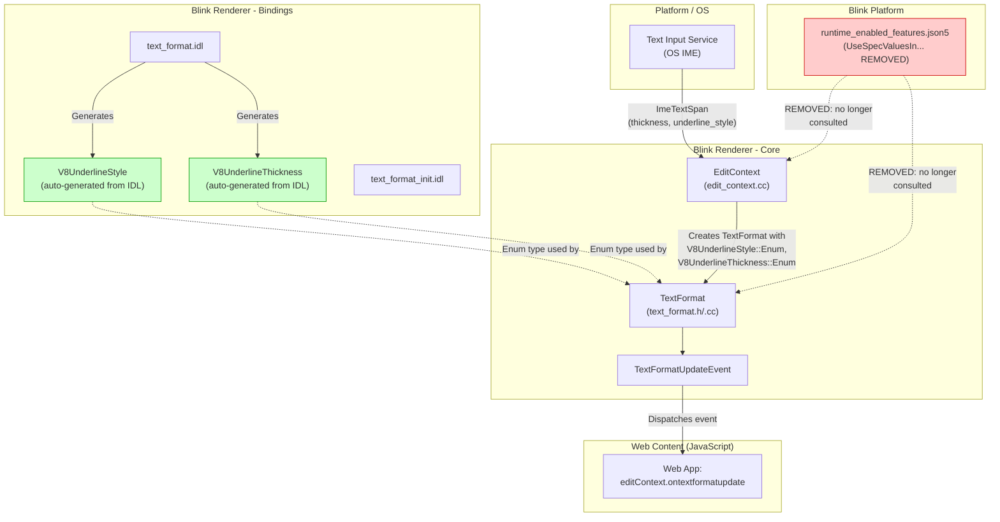
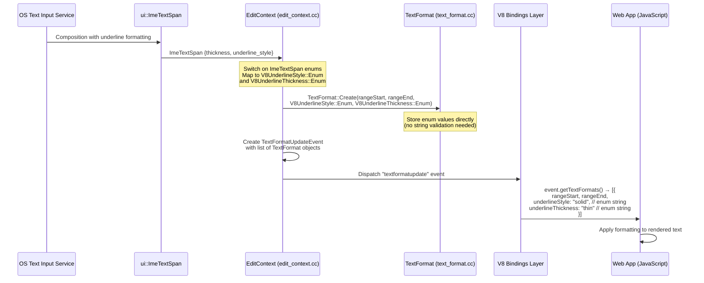
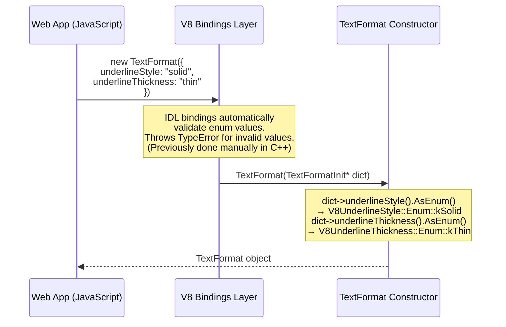

# High-Level Design: CL 6482727 — [EditContext] Update attribute types in TextFormat to follow spec

**CL URL:** https://chromium-review.googlesource.com/c/chromium/src/+/6482727
**Author:** Ashish Kumar (ashishkum@microsoft.com)
**Status:** NEW (Ready for review, Patch Set 6 passed CQ dry run)
**Bug:** [crbug.com/354497121](https://crbug.com/354497121)

---

## 1. Executive Summary

This CL updates the `TextFormat` interface in Chromium's Blink rendering engine to align with the [W3C EditContext specification](https://www.w3.org/TR/edit-context/#textformatupdateevent). Specifically, it changes the `underlineStyle` and `underlineThickness` attributes from `DOMString` types to their spec-defined `UnderlineStyle` and `UnderlineThickness` enum types respectively. Previously, a runtime feature flag (`UseSpecValuesInTextFormatUpdateEventStyles`) was used to gate the transition from old capitalized string values (e.g., `"Solid"`, `"Thin"`) to spec-compliant lowercase values (e.g., `"solid"`, `"thin"`). Since that flag has been at `"stable"` status (i.e., enabled by default), this CL completes the migration by removing the flag entirely, using V8-generated enum types directly, and removing now-unnecessary manual validation and `ExceptionState` plumbing. The net result is a **60-line reduction** in code with improved type safety and full spec conformance, with no intended behavioral change for end users (since the flag was already shipping as stable).

---

## 2. Architecture Overview

### 2.1 Affected Components

This CL touches the **Blink Editing/IME subsystem**, specifically the `TextFormat` class which represents text decoration information communicated from the platform's Input Method Editor (IME) to web content via the EditContext API.

| Layer | Component | Files Changed |
|-------|-----------|---------------|
| **Web IDL** | `TextFormat` interface | `text_format.idl`, `text_format_init.idl` |
| **Blink Core (C++)** | `TextFormat` class | `text_format.h`, `text_format.cc` |
| **Blink Core (C++)** | `EditContext` class | `edit_context.cc` |
| **Platform Config** | Runtime feature flags | `runtime_enabled_features.json5` |

### 2.2 Component Diagram



### 2.3 How It Fits Into Existing Architecture

The EditContext API enables web authors to participate directly in the text input process. When an IME composes text, the OS platform communicates text formatting preferences (underline style, thickness) through `ui::ImeTextSpan`. Blink's `EditContext` translates these into `TextFormat` objects dispatched via `TextFormatUpdateEvent` to JavaScript.

Previously, `TextFormat` stored these values as raw `DOMString`s with manual validation. This CL aligns the implementation with the spec by using IDL-generated enum types (`V8UnderlineStyle`, `V8UnderlineThickness`), which provide automatic validation at the bindings layer.

---

## 3. Design Goals & Non-Goals

### 3.1 Goals

1. **Spec Conformance:** Change `underlineStyle` from `DOMString` → `UnderlineStyle` enum and `underlineThickness` from `DOMString` → `UnderlineThickness` enum per the [W3C EditContext spec §4.2](https://www.w3.org/TR/edit-context/#textformatupdateevent).
2. **Remove Transitional Code:** Eliminate the `UseSpecValuesInTextFormatUpdateEventStyles` runtime feature flag and associated branching logic.
3. **Improve Type Safety:** Use V8 enum types (`V8UnderlineStyle::Enum`, `V8UnderlineThickness::Enum`) internally instead of raw strings.
4. **Simplify Code:** Remove manual enum validation in `TextFormat` constructor (now handled automatically by IDL bindings layer), remove `ExceptionState` from constructors/factory methods, and remove `RaisesException` from the IDL constructor.

### 3.2 Non-Goals

- **Behavioral Changes:** The CL explicitly states no behavior change is intended; the runtime flag was already `"stable"`.
- **New Features:** No new EditContext functionality is added.
- **Test Changes:** No new tests are added; existing WPT and Blink web tests already cover the spec-conformant enum values.
- **Use Counters:** Dan Clark's review [suggested adding use counters](https://chromium-review.googlesource.com/c/chromium/src/+/6482727) to assess risk of breaking existing sites. This CL does not add use counters — this was discussed in earlier patch sets and the approach was updated in subsequent iterations.

---

## 4. System Interactions

### 4.1 Main Data Flow: IME Text Format Delivery



### 4.2 Constructor Flow: JavaScript `new TextFormat()`



### 4.3 IPC/Mojo Interactions

This CL does **not** modify any IPC/Mojo interfaces. The `ui::ImeTextSpan` struct (which carries IME formatting info from the browser process to the renderer) is unchanged. The mapping from `ui::ImeTextSpan` enums to `V8UnderlineStyle::Enum`/`V8UnderlineThickness::Enum` occurs entirely within the renderer process in `edit_context.cc`.

---

## 5. API & Interface Changes

### 5.1 Web IDL Changes (Web-Facing)

#### `TextFormat` Interface (`text_format.idl`)

| Attribute | Before | After | Spec |
|-----------|--------|-------|------|
| `underlineStyle` | `readonly attribute DOMString` | `readonly attribute UnderlineStyle` | ✅ Matches [spec](https://www.w3.org/TR/edit-context/#textformatupdateevent) |
| `underlineThickness` | `readonly attribute DOMString` | `readonly attribute UnderlineThickness` | ✅ Matches [spec](https://www.w3.org/TR/edit-context/#textformatupdateevent) |
| constructor | `[RaisesException] constructor(...)` | `constructor(...)` | ✅ No longer needs manual exception raising |

#### `TextFormatInit` Dictionary (`text_format_init.idl`)

| Member | Before | After | Spec |
|--------|--------|-------|------|
| `underlineStyle` | `DOMString` | `UnderlineStyle` | ✅ Matches spec |
| `underlineThickness` | `DOMString` | `UnderlineThickness` | ✅ Matches spec |

#### Enum Definitions (unchanged, already existed)

Per the spec:
```webidl
enum UnderlineStyle { "none", "solid", "dotted", "dashed", "wavy" };
enum UnderlineThickness { "none", "thin", "thick" };
```

These enums were already defined in Chromium's IDL files. The CL changes `TextFormat` and `TextFormatInit` to *reference* them instead of using `DOMString`.

### 5.2 C++ Internal API Changes

#### `TextFormat` class (`text_format.h`)

| Method/Member | Before | After |
|---------------|--------|-------|
| `Create(dict, exception_state)` | Takes `ExceptionState&` | No longer takes `ExceptionState&` |
| `Create(start, end, style, thickness, exception_state)` | `const String&` params + `ExceptionState&` | `V8UnderlineStyle::Enum` + `V8UnderlineThickness::Enum` params, no `ExceptionState&` |
| `underlineStyle()` return type | `String` | `V8UnderlineStyle` |
| `underlineThickness()` return type | `String` | `V8UnderlineThickness` |
| `underline_style_` member | `String` | `V8UnderlineStyle::Enum` (default: `kNone`) |
| `underline_thickness_` member | `String` | `V8UnderlineThickness::Enum` (default: `kNone`) |

### 5.3 Deprecated/Removed

- **`ExceptionState` parameter** removed from all `TextFormat` constructors and factory methods.
- **`RaisesException` IDL annotation** removed from `TextFormat` constructor.
- **`UseSpecValuesInTextFormatUpdateEventStyles`** runtime feature flag removed from `runtime_enabled_features.json5`.

---

## 6. Dependencies

### 6.1 What This Code Depends On

| Dependency | Description |
|------------|-------------|
| `V8UnderlineStyle` / `V8UnderlineThickness` | Auto-generated V8 binding classes from `underline_style.idl` / `underline_thickness.idl`. These provide `::Enum` types and string ↔ enum conversion. |
| `ui::ImeTextSpan` | Platform-level IME text span representation with `Thickness` and `UnderlineStyle` enums. Unchanged by this CL. |
| `TextFormatInit` | IDL dictionary used by `TextFormat` constructor. Updated to use enum types. |
| Blink IDL code generator | Generates V8 bindings from `.idl` files. The generator must correctly handle enum types in dictionaries and readonly attributes. |

### 6.2 What Depends On This Code

| Dependent | Impact |
|-----------|--------|
| **Web content using EditContext API** | Sites reading `textFormat.underlineStyle` / `textFormat.underlineThickness` will now receive enum-typed values instead of `DOMString`. Since the runtime flag was already stable, the actual string values (`"none"`, `"solid"`, `"thin"`, etc.) are **unchanged** for users who were on the flag-enabled path. |
| **Web content constructing `TextFormat`** | Sites calling `new TextFormat({underlineStyle: "Solid"})` (capitalized old values) will now get a `TypeError` from the bindings layer. This is the intended behavior per spec. |
| `TextFormatUpdateEvent` | Uses `TextFormat` objects — no code change needed, works transparently. |
| WPT tests | `edit-context-textformat.tentative.html` — already tests spec-conformant values. |
| Blink web tests | `editing/input/edit-context.html` — already tests spec-conformant values. |

### 6.3 Compatibility Considerations

- **Web Compatibility Risk:** This is a **web-facing change**. As reviewer Dan Clark [noted](https://chromium-review.googlesource.com/c/chromium/src/+/6482727), sites relying on old capitalized string values (`"Solid"`, `"Thin"`, etc.) could break. However, the `UseSpecValuesInTextFormatUpdateEventStyles` flag was already at `"stable"` status, meaning the lowercase enum values have been shipping. The remaining change is the type system enforcement (enum vs. DOMString), which only affects sites *constructing* `TextFormat` objects with invalid values.
- **Chromium Intent Process:** Dan Clark's earlier review comment suggested that this web-facing change should go through the [Blink Intent to Ship](https://www.chromium.org/blink/launching-features/#launch-process) process. The CL author should ensure this process has been completed or is in progress.

---

## 7. Risks & Mitigations

### 7.1 Risk Matrix

| Risk | Severity | Likelihood | Mitigation |
|------|----------|------------|------------|
| **Web compat breakage for sites using old capitalized values** | Medium | Low (flag was stable) | The runtime flag `UseSpecValuesInTextFormatUpdateEventStyles` was already `"stable"`, so lowercase values have been shipping. Sites should already be using the lowercase values. |
| **Web compat breakage for sites constructing TextFormat with arbitrary strings** | Medium | Low | Previously, when the flag was enabled, invalid values already threw `TypeError`. The only change is that validation now happens in the bindings layer instead of manually. |
| **Removal of runtime flag prevents rollback** | Medium | Low | If issues arise post-landing, a revert of this CL would restore the flag. Alternatively, a new flag could be introduced. |
| **Missing Intent to Ship approval** | High | Unknown | Dan Clark flagged this in review. The CL should not land without proper approval from API Owners if required. |
| **Missing use counters** | Low | N/A | Dan Clark suggested adding use counters to measure risk. This is tracked separately from the type change itself. |

### 7.2 Spec Conformance Verification

The W3C EditContext spec defines:

```webidl
enum UnderlineStyle { "none", "solid", "dotted", "dashed", "wavy" };
enum UnderlineThickness { "none", "thin", "thick" };
```

**Mapping verification (edit_context.cc):**

| `ui::ImeTextSpan` Value | CL Maps To | Spec Enum Value | ✅/❌ |
|--------------------------|-----------|-----------------|-------|
| `Thickness::kNone` | `V8UnderlineThickness::Enum::kNone` | `"none"` | ✅ |
| `Thickness::kThin` | `V8UnderlineThickness::Enum::kThin` | `"thin"` | ✅ |
| `Thickness::kThick` | `V8UnderlineThickness::Enum::kThick` | `"thick"` | ✅ |
| `UnderlineStyle::kNone` | `V8UnderlineStyle::Enum::kNone` | `"none"` | ✅ |
| `UnderlineStyle::kSolid` | `V8UnderlineStyle::Enum::kSolid` | `"solid"` | ✅ |
| `UnderlineStyle::kDot` | `V8UnderlineStyle::Enum::kDotted` | `"dotted"` | ✅ |
| `UnderlineStyle::kDash` | `V8UnderlineStyle::Enum::kDashed` | `"dashed"` | ✅ |
| `UnderlineStyle::kSquiggle` | `V8UnderlineStyle::Enum::kWavy` | `"wavy"` | ✅ |

All mappings are correct and match the spec exactly.

**Default values verification:**

| Attribute | Default in CL | Default in Spec | ✅/❌ |
|-----------|---------------|-----------------|-------|
| `underlineStyle_` | `V8UnderlineStyle::Enum::kNone` | Not explicitly defaulted in spec (constructor takes optional `TextFormatInit`) | ✅ Reasonable default |
| `underlineThickness_` | `V8UnderlineThickness::Enum::kNone` | Not explicitly defaulted in spec | ✅ Reasonable default |

**Note on spec default values:** The spec's `TextFormatInit` dictionary members for `underlineStyle` and `underlineThickness` do **not** have explicit default values. In the CL, when constructing from `TextFormatInit`, the values are only set if `dict->hasUnderlineStyle()` / `dict->hasUnderlineThickness()` returns true, otherwise the member defaults (initialized in `text_format.h` as `kNone`) are used. This aligns with the spec's behavior where omitted dictionary members leave the defaults, and `"none"` is a sensible default.

---

## 8. Testing Strategy

### 8.1 Existing Test Coverage

The commit message references two test suites that already validate the spec-conformant behavior:

1. **Blink Web Test:** [`third_party/blink/web_tests/editing/input/edit-context.html`](https://crsrc.org/c/third_party/blink/web_tests/editing/input/edit-context.html)
   - Tests `TextFormat` attribute values during IME composition.
   - Patch set 1 failed this test; the test was updated in patch set 2 to expect spec-compliant values.

2. **WPT (Web Platform Test):** [`third_party/blink/web_tests/external/wpt/editing/edit-context/edit-context-textformat.tentative.html`](https://crsrc.org/c/third_party/blink/web_tests/external/wpt/editing/edit-context/edit-context-textformat.tentative.html)
   - Tests `TextFormat` construction and attribute access with enum values.

### 8.2 CQ Dry Run Status

Patch set 6 **passed** the Chromium LUCI CQ dry run (as of 2026-02-12), confirming:
- Compilation succeeds across all build configurations (including libfuzzer-asan, which failed on patch set 2).
- All Blink web tests pass (including `edit-context.html`, which failed on patch sets 1 and 3).
- WPT tests pass.

### 8.3 What's Tested

| Aspect | Covered | Test |
|--------|---------|------|
| Enum values returned from `textformatupdate` event | ✅ | `edit-context.html`, WPT |
| `TextFormat` constructor with enum dict values | ✅ | WPT |
| Invalid enum values rejected by constructor | ✅ | IDL bindings layer (automatic) |
| Default values when dict members omitted | ✅ | WPT |
| IME → TextFormat enum mapping correctness | ✅ | `edit-context.html` |

### 8.4 Test Gap Analysis

- **No explicit test for invalid values being rejected** as a `TypeError` from the bindings layer (e.g., `new TextFormat({underlineStyle: "Solid"})`). However, this behavior is guaranteed by the IDL bindings code generator and is covered by WPT infrastructure tests for enum validation.

---

## Appendix A: File-by-File Change Summary

### `text_format.idl` (+3/−9)
- Removed `[RaisesException]` from constructor
- Changed `underlineStyle`: `DOMString` → `UnderlineStyle`
- Changed `underlineThickness`: `DOMString` → `UnderlineThickness`
- Removed TODO and workaround comments

### `text_format_init.idl` (+2/−2)
- Changed dict members: `DOMString` → `UnderlineStyle` / `UnderlineThickness`

### `text_format.h` (+13/−15)
- Added includes for `v8_underline_style.h` and `v8_underline_thickness.h`
- Removed `ExceptionState` forward declaration
- Updated all constructor/factory signatures to use enum types
- Changed member types from `String` to `V8UnderlineStyle::Enum` / `V8UnderlineThickness::Enum` with `kNone` defaults
- Updated getter return types

### `text_format.cc` (+14/−55)
- Removed includes for `exception_state.h`, `runtime_enabled_features.h`, `string_builder.h`
- Simplified constructors: removed `ExceptionState` params, removed manual string validation
- Dict constructor now calls `.AsEnum()` directly on IDL-parsed values
- Getters wrap enum values in V8 wrapper types for return

### `edit_context.cc` (+15/−21)
- Added includes for `v8_underline_style.h` and `v8_underline_thickness.h`
- Removed runtime flag check (`UseSpecValuesInTextFormatUpdateEventStylesEnabled()`)
- Changed switch statement mappings from conditional strings to `V8UnderlineStyle::Enum` / `V8UnderlineThickness::Enum` values
- Simplified `TextFormat::Create` call (no more `ASSERT_NO_EXCEPTION`)

### `runtime_enabled_features.json5` (+0/−5)
- Removed `UseSpecValuesInTextFormatUpdateEventStyles` feature flag entry
