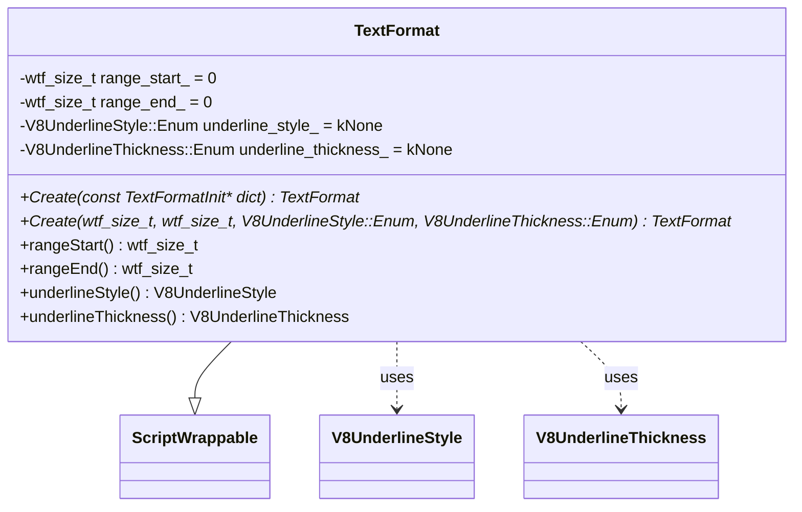
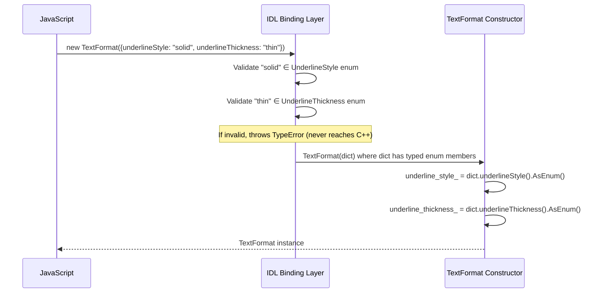
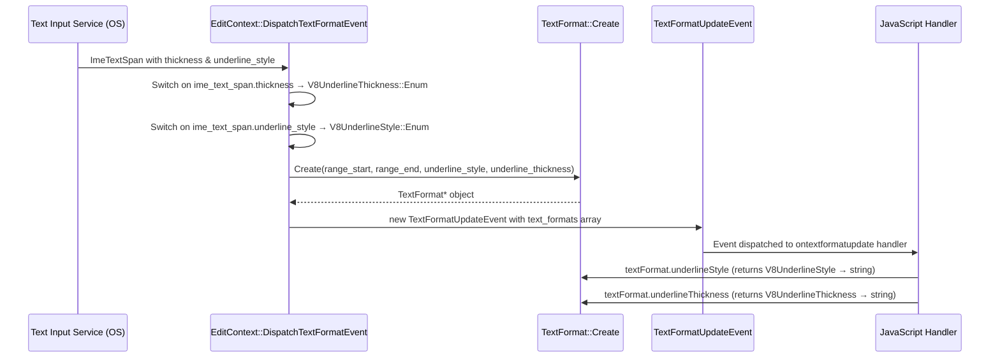
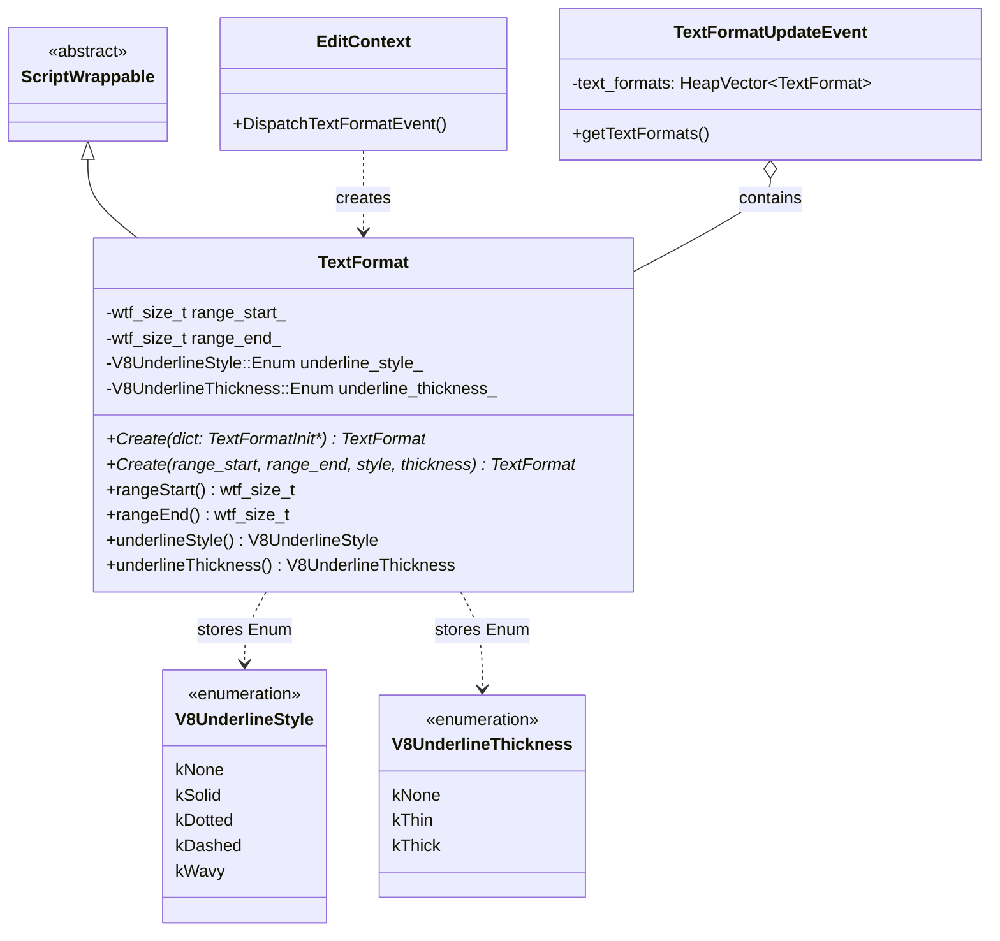
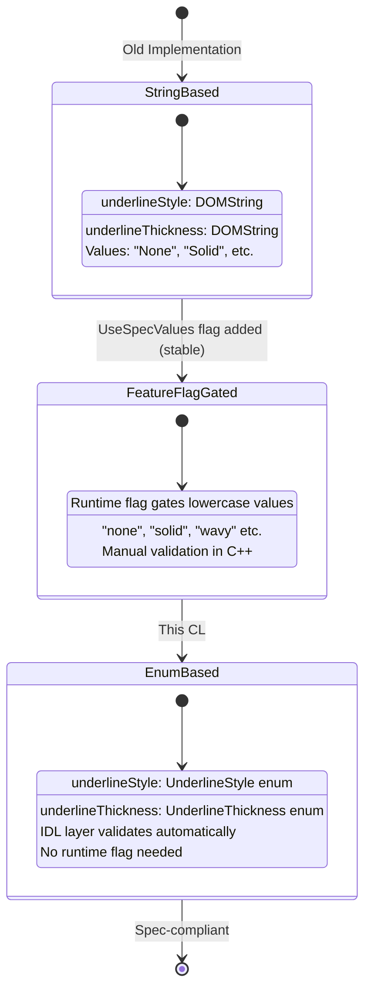

# Low-Level Design Document — CL 6482727

## [EditContext] Update attribute types in TextFormat to follow spec

**CL:** https://chromium-review.googlesource.com/c/chromium/src/+/6482727  
**Author:** Ashish Kumar \<ashishkum@microsoft.com\>  
**Bug:** [crbug.com/354497121](https://crbug.com/354497121)  
**Spec:** [W3C EditContext — TextFormatUpdateEvent](https://www.w3.org/TR/edit-context/#textformatupdateevent)

---

## Summary

This CL changes the `TextFormat` IDL interface to use proper `UnderlineStyle` and `UnderlineThickness` enum types instead of `DOMString`, aligning the Chromium implementation with the W3C EditContext specification. It also removes the `UseSpecValuesInTextFormatUpdateEventStyles` runtime feature flag (which was the transitional mechanism) since the enum types now inherently enforce spec-compliant values.

---

## 1. File-by-File Analysis

### 1.1 `text_format.idl`

**Purpose of changes**: Align the WebIDL interface of `TextFormat` with the W3C spec by replacing `DOMString` attribute types with enum types.

**Key modifications**:
- `underlineStyle` attribute type changed from `DOMString` → `UnderlineStyle`
- `underlineThickness` attribute type changed from `DOMString` → `UnderlineThickness`
- Removed `[RaisesException]` extended attribute from the constructor (no longer needed since IDL binding layer handles enum validation)
- Removed TODO/workaround comments referencing crbug.com/354497121

**Spec compliance check**:

| Attribute | Spec Type | Old Impl Type | New Impl Type | ✅ Match |
|-----------|-----------|---------------|---------------|----------|
| `rangeStart` | `unsigned long` | `unsigned long` | `unsigned long` | ✅ |
| `rangeEnd` | `unsigned long` | `unsigned long` | `unsigned long` | ✅ |
| `underlineStyle` | `UnderlineStyle` | `DOMString` | `UnderlineStyle` | ✅ |
| `underlineThickness` | `UnderlineThickness` | `DOMString` | `UnderlineThickness` | ✅ |

The W3C spec defines:
```webidl
enum UnderlineStyle { "none", "solid", "dotted", "dashed", "wavy" };
enum UnderlineThickness { "none", "thin", "thick" };
```

The constructor signature now matches the spec:
```webidl
constructor(optional TextFormatInit options = {});  // No RaisesException needed
```

---

### 1.2 `text_format_init.idl`

**Purpose of changes**: Update the dictionary used to initialize `TextFormat` objects to use enum types.

**Key modifications**:
- `underlineStyle` type changed from `DOMString` → `UnderlineStyle`
- `underlineThickness` type changed from `DOMString` → `UnderlineThickness`

**Spec compliance check**:

The W3C spec defines:
```webidl
dictionary TextFormatInit {
    unsigned long rangeStart;
    unsigned long rangeEnd;
    UnderlineStyle underlineStyle;
    UnderlineThickness underlineThickness;
};
```

| Field | Spec Type | New Impl Type | ✅ Match |
|-------|-----------|---------------|----------|
| `rangeStart` | `unsigned long` | `unsigned long` | ✅ |
| `rangeEnd` | `unsigned long` | `unsigned long` | ✅ |
| `underlineStyle` | `UnderlineStyle` | `UnderlineStyle` | ✅ |
| `underlineThickness` | `UnderlineThickness` | `UnderlineThickness` | ✅ |

**Implication**: With enum types in the dictionary, the Blink IDL binding layer will automatically validate incoming values and throw a `TypeError` for invalid enum strings. This replaces the manual validation that was previously in `text_format.cc`.

---

### 1.3 `text_format.h`

**Purpose of changes**: Update the C++ header for `TextFormat` to store enum values internally instead of `String`.

**Key modifications**:
- Added includes for `v8_underline_style.h` and `v8_underline_thickness.h`
- Removed forward declaration of `ExceptionState` (no longer needed)
- Changed private member types:
  - `String underline_style_` → `V8UnderlineStyle::Enum underline_style_ = V8UnderlineStyle::Enum::kNone`
  - `String underline_thickness_` → `V8UnderlineThickness::Enum underline_thickness_ = V8UnderlineThickness::Enum::kNone`
- Updated all constructors and `Create()` factory methods to use enum types and remove `ExceptionState&` parameters
- Updated getter return types:
  - `String underlineStyle()` → `V8UnderlineStyle underlineStyle()`
  - `String underlineThickness()` → `V8UnderlineThickness underlineThickness()`

**New/Modified Functions**:

| Function | Purpose | Old Signature | New Signature |
|----------|---------|---------------|---------------|
| `Create(dict)` | Factory from TextFormatInit | `Create(const TextFormatInit*, ExceptionState&)` | `Create(const TextFormatInit*)` |
| `Create(range)` | Factory with explicit params | `Create(wtf_size_t, wtf_size_t, const String&, const String&, ExceptionState&)` | `Create(wtf_size_t, wtf_size_t, V8UnderlineStyle::Enum, V8UnderlineThickness::Enum)` |
| `TextFormat(dict)` | Constructor from dict | `TextFormat(const TextFormatInit*, ExceptionState&)` | `TextFormat(const TextFormatInit*)` |
| `TextFormat(range)` | Constructor with params | `TextFormat(wtf_size_t, wtf_size_t, const String&, const String&, ExceptionState&)` | `TextFormat(wtf_size_t, wtf_size_t, V8UnderlineStyle::Enum, V8UnderlineThickness::Enum)` |
| `underlineStyle()` | Getter | returns `String` | returns `V8UnderlineStyle` |
| `underlineThickness()` | Getter | returns `String` | returns `V8UnderlineThickness` |

**Class Diagram (after changes)**:



**Default value analysis**: Both `underline_style_` and `underline_thickness_` default to `kNone`. The spec defines `"none"` as the first value in both enums (`UnderlineStyle` and `UnderlineThickness`), and per WebIDL rules, when dictionary members of enum type are absent, they are treated as not present (no default). In the old code, when `use_spec_values` was true and the dictionary member was absent, the default was explicitly set to `"none"`. In the new code, the class member initializer defaults to `kNone`, which achieves the same result. **This is correct.**

---

### 1.4 `text_format.cc`

**Purpose of changes**: Update the implementation to use typed enums, remove manual validation logic, and remove runtime feature flag checks.

**Key modifications**:
- Removed includes for `exception_state.h`, `runtime_enabled_features.h`, and `string_builder.h`
- Simplified both constructors and factory methods to remove `ExceptionState&` parameter
- **Removed all manual enum validation logic** (~40 lines) from the `TextFormatInit` dict constructor — the IDL binding layer now handles this automatically
- Removed runtime feature flag branching (`UseSpecValuesInTextFormatUpdateEventStylesEnabled()`)
- Updated getters to wrap the internal `V8UnderlineStyle::Enum` / `V8UnderlineThickness::Enum` in the V8 wrapper types for return

**Detailed logic changes in `TextFormat(const TextFormatInit* dict)` constructor**:

Before (pseudocode):
```
if dict has underlineStyle:
    style = dict.underlineStyle()  // String
    if use_spec_values AND V8UnderlineStyle::Create(style) fails:
        throw TypeError with custom message
        return
    underline_style_ = style
else if use_spec_values:
    underline_style_ = "none"
// same pattern for underlineThickness
```

After:
```
if dict has underlineStyle:
    underline_style_ = dict.underlineStyle().AsEnum()
// same for underlineThickness
// If absent, member initializer (kNone) applies
```

The `.AsEnum()` call is safe because the IDL binding layer already validated the enum string before creating the V8UnderlineStyle/V8UnderlineThickness objects. Invalid values would have caused a TypeError to be thrown before the constructor is even called.

**Data Flow (TextFormat construction from JS)**:



---

### 1.5 `edit_context.cc`

**Purpose of changes**: Update the IME text span → TextFormat conversion logic to use typed enums instead of strings, and remove the runtime feature flag branching.

**Key modifications**:
- Added includes for `v8_underline_style.h` and `v8_underline_thickness.h`
- Changed local variables from `String` to `V8UnderlineThickness::Enum` / `V8UnderlineStyle::Enum`
- Removed the `use_spec_values` boolean and all conditional branching on it
- Updated switch statement mappings to use enum constants directly:

**Enum mapping table (ImeTextSpan → V8 Enum)**:

| `ui::ImeTextSpan::Thickness` | Old (non-spec) | Old (spec) | New `V8UnderlineThickness::Enum` |
|-------------------------------|-----------------|------------|----------------------------------|
| `kNone` | `"None"` | `"none"` | `kNone` |
| `kThin` | `"Thin"` | `"thin"` | `kThin` |
| `kThick` | `"Thick"` | `"thick"` | `kThick` |

| `ui::ImeTextSpan::UnderlineStyle` | Old (non-spec) | Old (spec) | New `V8UnderlineStyle::Enum` |
|------------------------------------|-----------------|------------|------------------------------|
| `kNone` | `"None"` | `"none"` | `kNone` |
| `kSolid` | `"Solid"` | `"solid"` | `kSolid` |
| `kDot` | `"Dotted"` | `"dotted"` | `kDotted` |
| `kDash` | `"Dashed"` | `"dashed"` | `kDashed` |
| `kSquiggle` | `"Squiggle"` | `"wavy"` | `kWavy` |

**Spec compliance check on enum values**:

The spec defines:
- `UnderlineStyle { "none", "solid", "dotted", "dashed", "wavy" }` — **All 5 values are covered** ✅
- `UnderlineThickness { "none", "thin", "thick" }` — **All 3 values are covered** ✅

The mapping `kSquiggle → kWavy` is noteworthy: the platform IME concept "squiggle" is correctly mapped to the spec's `"wavy"` value. ✅

- Changed `TextFormat::Create()` call to drop `ASSERT_NO_EXCEPTION` (no longer takes `ExceptionState&`)

**Data Flow (IME input → TextFormat creation)**:



---

### 1.6 `runtime_enabled_features.json5`

**Purpose of changes**: Remove the transitional runtime feature flag that is no longer needed.

**Key modifications**:
- Removed the `UseSpecValuesInTextFormatUpdateEventStyles` feature entry (was `status: "stable"`)

**Rationale**: This flag was previously used to gate between old (non-spec) string values (e.g., `"None"`, `"Solid"`, `"Squiggle"`) and spec-compliant values (e.g., `"none"`, `"solid"`, `"wavy"`). Now that the types are proper enums, the values are inherently spec-compliant, making the flag unnecessary.

**Risk note**: Since the flag was `status: "stable"`, it was already enabled by default for all users. The behavioral change (lowercase spec values) was already shipped. This CL merely removes the dead code path that would have returned the old capitalized values.

---

## 2. Class Diagram



---

## 3. State Diagram



---

## 4. Implementation Concerns

### 4.1 Memory Management
- **No concerns.** The change replaces `String` member variables (heap-allocated, ref-counted) with `enum` values (trivially copyable, stack-sized). This is a minor memory improvement — each `TextFormat` instance saves two `String` allocations.
- `TextFormat` remains garbage-collected via `MakeGarbageCollected` as before.

### 4.2 Thread Safety
- **No concerns.** `TextFormat` objects are created and consumed on the main thread within the Blink rendering pipeline. No threading changes are introduced.

### 4.3 Performance Implications
- **Minor positive impact.** Replacing `String` comparison/construction with enum assignment/comparison is faster. The switch statements now assign an enum value instead of constructing a `String` (which involves heap allocation, ref counting, and potential copying).
- Removal of the runtime feature flag check (`RuntimeEnabledFeatures::UseSpecValuesInTextFormatUpdateEventStylesEnabled()`) eliminates a function call per text format created.

### 4.4 Web Compatibility / Breaking Change Risk
- **This is a web-facing change.** The `underlineStyle` and `underlineThickness` attributes now return enum string values (lowercase: `"none"`, `"solid"`, etc.) instead of `DOMString` values that could have been anything.
- **Mitigating factor:** The `UseSpecValuesInTextFormatUpdateEventStyles` feature was already `status: "stable"`, meaning the lowercase spec-compliant values were already being returned to all users. Sites that adapted to the old non-spec values (e.g., `"None"`, `"Solid"`, `"Squiggle"`) would have already broken when the feature flag shipped to stable.
- **Dan Clark's review comment** (from PS2) raised concerns about the web-facing nature of this change and suggested use counters. This CL was eventually submitted after the feature flag had been stable for a significant period, suggesting the risk was deemed acceptable.
- **Note:** The `TextFormatInit` dictionary now also requires enum values when constructing `TextFormat` from JS. If any site was passing arbitrary strings like `"Squiggle"` to the constructor, it would now get a `TypeError`. However, since the feature flag was already enforcing spec values, this scenario should already be handled.

### 4.5 Uninitialized Variable Risk
- In `edit_context.cc`, the local variables `underline_thickness` and `underline_style` are of type `V8UnderlineThickness::Enum` / `V8UnderlineStyle::Enum` and are **not initialized before the switch statements**. If the `ui::ImeTextSpan` has a value not covered by the switch cases (which shouldn't happen given the enum definitions), the variables would be uninitialized. The old `String` implementation had the same theoretical risk but strings are default-initialized to empty.
- **Recommendation**: Consider initializing these to `kNone` at declaration to be defensive:
  ```cpp
  V8UnderlineThickness::Enum underline_thickness = V8UnderlineThickness::Enum::kNone;
  V8UnderlineStyle::Enum underline_style = V8UnderlineStyle::Enum::kNone;
  ```
  This would match the default value pattern used in the `text_format.h` member initializers. In practice, the compiler should warn about this (and the switches are exhaustive), but explicit initialization is safer.

### 4.6 Maintainability
- **Positive impact.** The code is significantly simplified:
  - ~60 lines of manual validation and error message construction removed from `text_format.cc`
  - Runtime feature flag branching removed from two files
  - The single source of truth for valid enum values is now the IDL files, auto-generated into V8 binding code
  - TODO comments and workaround comments removed

---

## 5. Suggestions for Improvement

### 5.1 Initialize Local Enum Variables (Minor)
In `edit_context.cc`, the local `underline_thickness` and `underline_style` variables should be initialized at declaration:
```cpp
V8UnderlineThickness::Enum underline_thickness = V8UnderlineThickness::Enum::kNone;
V8UnderlineStyle::Enum underline_style = V8UnderlineStyle::Enum::kNone;
```
This guards against undefined behavior if a new `ImeTextSpan` enum value is added in the future without updating the switch.

### 5.2 Add `default` Case to Switch Statements (Minor)
Consider adding a `default: NOTREACHED();` case to both switch statements in `edit_context.cc` to make it explicit that all enum values should be handled and to catch any future additions at runtime:
```cpp
switch (ime_text_span.thickness) {
    case ui::ImeTextSpan::Thickness::kNone:
        ...
    case ui::ImeTextSpan::Thickness::kThin:
        ...
    case ui::ImeTextSpan::Thickness::kThick:
        ...
    default:
        NOTREACHED();
}
```

### 5.3 Verify Existing Test Coverage
The CL description references two test files:
- `editing/input/edit-context.html`
- `external/wpt/editing/edit-context/edit-context-textformat.tentative.html`

These should be verified to confirm they:
1. Test that `underlineStyle` returns spec-compliant enum values (`"none"`, `"solid"`, `"dotted"`, `"dashed"`, `"wavy"`)
2. Test that `underlineThickness` returns spec-compliant values (`"none"`, `"thin"`, `"thick"`)
3. Test that constructing a `TextFormat` with invalid enum strings throws a `TypeError`
4. Test the default values when `TextFormatInit` is constructed without `underlineStyle`/`underlineThickness`

The patch set 1 had a CI failure in `editing/input/edit-context.html` which was fixed in patch set 2, and patch set 6 (current) passes all tests.

### 5.4 Consider Use Counters (Process Concern)
Dan Clark's earlier review comment suggested adding use counters to assess the risk of this web-facing change. Since the feature flag was already `stable`, the actual string values being returned haven't changed (they were already lowercase). However, the type change from `DOMString` to enum could theoretically affect sites using `typeof` checks or other type-sensitive operations. The use counter suggestion may still be valuable for tracking overall EditContext adoption.

---

## 6. Spec Compliance Summary

| Spec Requirement | Implementation | Status |
|------------------|----------------|--------|
| `UnderlineStyle` enum: `"none"`, `"solid"`, `"dotted"`, `"dashed"`, `"wavy"` | `V8UnderlineStyle::Enum` with matching values | ✅ Compliant |
| `UnderlineThickness` enum: `"none"`, `"thin"`, `"thick"` | `V8UnderlineThickness::Enum` with matching values | ✅ Compliant |
| `TextFormat.underlineStyle` returns `UnderlineStyle` | IDL: `readonly attribute UnderlineStyle underlineStyle` | ✅ Compliant |
| `TextFormat.underlineThickness` returns `UnderlineThickness` | IDL: `readonly attribute UnderlineThickness underlineThickness` | ✅ Compliant |
| `TextFormatInit.underlineStyle` is `UnderlineStyle` | IDL: `UnderlineStyle underlineStyle` | ✅ Compliant |
| `TextFormatInit.underlineThickness` is `UnderlineThickness` | IDL: `UnderlineThickness underlineThickness` | ✅ Compliant |
| Constructor does not raise exceptions for type validation | `[RaisesException]` removed; IDL layer validates | ✅ Compliant |

**Overall Assessment**: The CL correctly aligns the Chromium implementation with the W3C EditContext specification for `TextFormat` attribute types. The changes are well-structured, significantly reduce code complexity, and leverage the IDL binding layer for type safety and validation.
