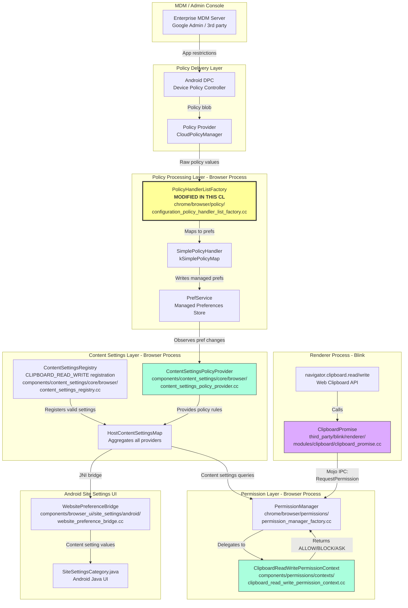
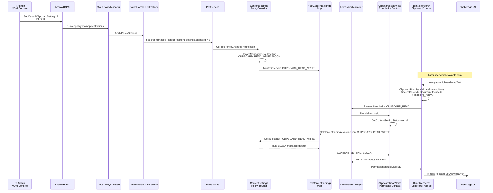
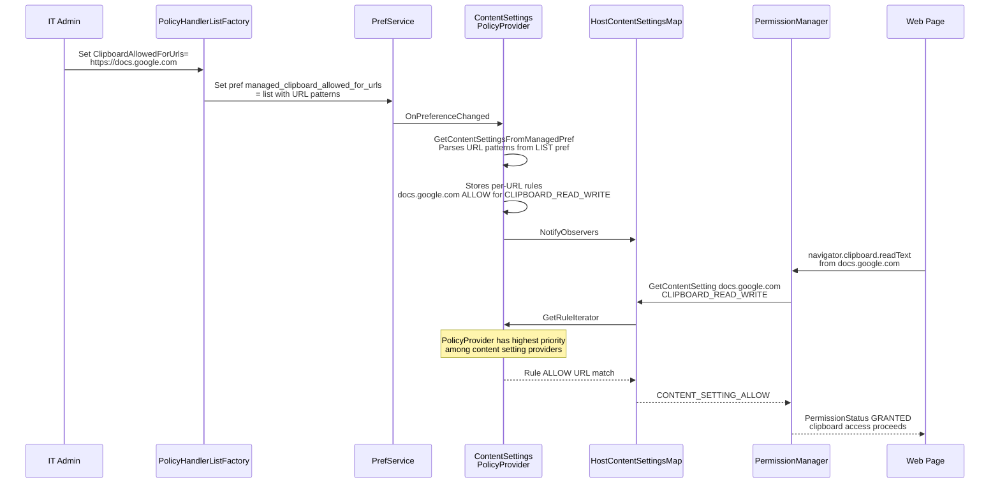
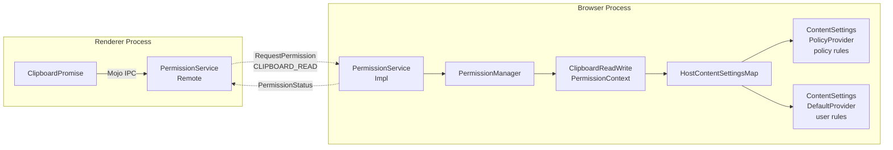

# High-Level Design: Enable Clipboard Enterprise Policies for Android

**CL:** [6918637](https://chromium-review.googlesource.com/c/chromium/src/+/6918637)
**Author:** Joel Hockey (joelhockey@chromium.org)
**Reviewer:** Anqing Zhao (anqing@chromium.org)
**Status:** Merged (Cr-Commit-Position: refs/heads/main@{#1512308})

---

## 1. Executive Summary

This CL extends three existing clipboard enterprise policies — `DefaultClipboardSetting`, `ClipboardAllowedForUrls`, and `ClipboardBlockedForUrls` — to the Android platform (Chrome 142+). Previously, these policies were only available on desktop platforms (Windows, macOS, Linux, ChromeOS, Fuchsia). The change is minimal: it moves the policy-to-preference mappings from a desktop-only section to the "all platforms" section of the policy handler factory, and updates policy YAML definitions and test data to include Android. This enables Mobile Device Management (MDM) administrators to control which websites can access the Web Clipboard API (`navigator.clipboard`) on managed Android devices, achieving feature parity with desktop Chrome.

---

## 2. Architecture Overview

### 2.1 Affected Chromium Components

| Component | Layer | Impact |
|---|---|---|
| **Policy Handler Factory** | `chrome/browser/policy/` | Policy-to-pref mapping moved to all-platform section |
| **Policy Definitions (YAML)** | `components/policy/resources/templates/` | Android platform added to `supported_on` |
| **Pref Mapping Test Data** | `components/policy/test/data/` | Android added to test platform lists |
| **Content Settings Policy Provider** | `components/content_settings/core/browser/` | Already consumes prefs (no change needed) |
| **Content Settings Registry** | `components/content_settings/core/browser/` | Already registers CLIPBOARD_READ_WRITE for Android (no change needed) |
| **Permission Context** | `components/permissions/contexts/` | Already handles clipboard permissions on all platforms (no change needed) |
| **Android Site Settings UI** | `components/browser_ui/site_settings/android/` | Already handles CLIPBOARD_READ_WRITE (no change needed) |
| **Blink Clipboard API** | `third_party/blink/renderer/modules/clipboard/` | Already requests permissions (no change needed) |

### 2.2 How This Fits Into Existing Architecture

The CL does **not** introduce new architecture — it removes a platform gate. The entire policy → content settings → permission check pipeline already existed for desktop and simply needed to be wired up for Android. The key insight is that the content settings infrastructure, permission contexts, and Blink renderer code are already platform-generic. The only thing preventing Android support was that the three policy mappings were inside a platform-restricted section in `configuration_policy_handler_list_factory.cc`.

### 2.3 Component Diagram



---

## 3. Design Goals & Non-Goals

### Goals
- **G1:** Enable `DefaultClipboardSetting`, `ClipboardAllowedForUrls`, and `ClipboardBlockedForUrls` enterprise policies on Android Chrome (v142+)
- **G2:** Allow MDM administrators to control clipboard API access on managed Android devices
- **G3:** Achieve feature parity with desktop platforms for clipboard policy enforcement
- **G4:** Ensure existing policy pref mapping tests pass on Android

### Non-Goals
- **NG1:** No new policy types are introduced
- **NG2:** No changes to the clipboard permission prompt UX on Android
- **NG3:** No changes to the Blink clipboard API behavior
- **NG4:** No changes to how policies are delivered to Android (existing DPC/AppRestrictions mechanism)
- **NG5:** No changes to Android-specific clipboard system behavior (e.g., ClipboardManager)

---

## 4. System Interactions

### 4.1 End-to-End Policy Enforcement Flow



### 4.2 URL-Specific Policy Flow (ClipboardAllowedForUrls)



### 4.3 IPC/Mojo Interactions

The clipboard permission check crosses the renderer-to-browser process boundary via Mojo:



---

## 5. How This Policy Is Consumed: Detailed Code Walkthrough

### 5.1 Layer 1: Policy Ingestion — `configuration_policy_handler_list_factory.cc`

**File:** `chrome/browser/policy/configuration_policy_handler_list_factory.cc`

The `kSimplePolicyMap[]` array maps enterprise policy keys to browser preferences. This CL moves three entries from a platform-restricted section to the "Policies for all platforms" section:

```cpp
// Policies for all platforms - Start
{ key::kClipboardAllowedForUrls,
  prefs::kManagedClipboardAllowedForUrls,
  base::Value::Type::LIST },
{ key::kClipboardBlockedForUrls,
  prefs::kManagedClipboardBlockedForUrls,
  base::Value::Type::LIST },
{ key::kDefaultClipboardSetting,
  prefs::kManagedDefaultClipboardSetting,
  base::Value::Type::INTEGER },
```

**What happens here:** When policy values arrive from the policy provider (MDM, cloud policy, etc.), the `SimplePolicyHandler` iterates `kSimplePolicyMap[]`, and for each matching policy, writes the value into the PrefService as a managed preference. Managed prefs have the highest priority and cannot be overridden by users.

**Android relevance:** 🟢 **This is the key change.** Previously these three entries were in a section that excluded Android. By moving them to "all platforms," Android Chrome now processes these policies.

### 5.2 Layer 2: Preference Definitions — `pref_names.h`

**File:** `components/content_settings/core/common/pref_names.h`

Preferences are declared as inline constants (platform-generic code, **no `#ifdef` guards**):

```cpp
inline constexpr char kManagedDefaultClipboardSetting[] =
    "profile.managed_default_content_settings.clipboard";
inline constexpr char kManagedClipboardAllowedForUrls[] =
    "profile.managed_clipboard_allowed_for_urls";
inline constexpr char kManagedClipboardBlockedForUrls[] =
    "profile.managed_clipboard_blocked_for_urls";
```

**Android relevance:** 🟢 **Generic code** — these constants are available on all platforms, including Android, with no platform-specific guards.

### 5.3 Layer 3: Content Settings Policy Provider — `content_settings_policy_provider.cc`

**File:** `components/content_settings/core/browser/content_settings_policy_provider.cc`

This is the **primary consumer** of the managed preferences. It watches for pref changes and converts them into content setting rules.

#### 5.3.1 URL Pattern Mappings (Allowed/Blocked URL lists)

```cpp
constexpr auto kManagedContentSettingsPatternMappings =
    base::MakeFixedFlatMap<base::cstring_view, ManagedPatternEntry>({
        // ...
        {prefs::kManagedClipboardAllowedForUrls,
         ContentSettingsType::CLIPBOARD_READ_WRITE, CONTENT_SETTING_ALLOW},
        {prefs::kManagedClipboardBlockedForUrls,
         ContentSettingsType::CLIPBOARD_READ_WRITE, CONTENT_SETTING_BLOCK},
        // ...
    });
```

When `kManagedClipboardAllowedForUrls` pref is set (e.g., `["https://docs.google.com"]`), the PolicyProvider parses each URL into a `ContentSettingsPattern` and creates a rule: `{pattern: docs.google.com, type: CLIPBOARD_READ_WRITE, value: ALLOW}`.

#### 5.3.2 Default Setting Mapping

```cpp
const PolicyProvider::PrefsForManagedDefaultMapEntry
    PolicyProvider::kPrefsForManagedDefault[] = {
        // ...
        {ContentSettingsType::CLIPBOARD_READ_WRITE,
         prefs::kManagedDefaultClipboardSetting},
        // ...
    };
```

When `kManagedDefaultClipboardSetting` is set to `2` (BLOCK), the PolicyProvider creates a wildcard rule that blocks clipboard access by default for all sites.

#### 5.3.3 Pref Registration and Observation

```cpp
constexpr const char* kManagedPrefs[] = {
    // ...
    prefs::kManagedClipboardAllowedForUrls,
    prefs::kManagedClipboardBlockedForUrls,
    // ...
};

constexpr const char* kManagedDefaultPrefs[] = {
    // ...
    prefs::kManagedDefaultClipboardSetting,
    // ...
};
```

The provider registers as an observer for these preferences and triggers `UpdateManagedDefaultSetting()` or `GetContentSettingsFromManagedPref()` when they change.

**Android relevance:** 🟢 **Generic code** — `content_settings_policy_provider.cc` has **no platform-specific guards** for clipboard. It runs identically on Android and desktop.

### 5.4 Layer 4: Content Settings Registry — `content_settings_registry.cc`

**File:** `components/content_settings/core/browser/content_settings_registry.cc`

```cpp
Register(ContentSettingsType::CLIPBOARD_READ_WRITE, "clipboard",
         CONTENT_SETTING_ASK, WebsiteSettingsInfo::UNSYNCABLE,
         /*allowlisted_primary_schemes=*/{kChromeUIScheme},
         /*valid_settings=*/
         {CONTENT_SETTING_ALLOW, CONTENT_SETTING_BLOCK, CONTENT_SETTING_ASK},
         WebsiteSettingsInfo::TOP_ORIGIN_ONLY_SCOPE,
         WebsiteSettingsRegistry::DESKTOP |
             WebsiteSettingsRegistry::PLATFORM_ANDROID,   // ← Android already included!
         ContentSettingsInfo::INHERIT_IF_LESS_PERMISSIVE,
         PermissionSettingsInfo::EXCEPTIONS_ON_SECURE_ORIGINS_ONLY);
```

**Key detail:** The `PLATFORM_ANDROID` flag was **already present** in the registry. This means the content settings infrastructure already recognized `CLIPBOARD_READ_WRITE` as a valid content setting type on Android. The only missing piece was that the policies themselves were not being ingested on Android — which this CL fixes.

**Android relevance:** 🟢 **Android was already enabled** in the registry. No change needed.

### 5.5 Layer 5: Permission Context — `clipboard_read_write_permission_context.cc`

**File:** `components/permissions/contexts/clipboard_read_write_permission_context.cc`

```cpp
ClipboardReadWritePermissionContext::ClipboardReadWritePermissionContext(...)
    : ContentSettingPermissionContextBase(
          browser_context,
          ContentSettingsType::CLIPBOARD_READ_WRITE,
          network::mojom::PermissionsPolicyFeature::kClipboardRead),
      delegate_(std::move(delegate)) {}
```

The permission context inherits from `ContentSettingPermissionContextBase`, which queries `HostContentSettingsMap` to determine the current content setting. If the PolicyProvider has a managed rule (from the enterprise policy), it overrides any user-set or default setting.

The `DecidePermission()` method:
1. Checks for extension delegates (extensions only, not Android)
2. Falls through to `PermissionContextBase::DecidePermission()` which queries content settings

**Android relevance:** 🟢 **Generic code** — instantiated on all platforms via `embedder_support::CreateDefaultPermissionContexts()`.

### 5.6 Layer 6: Permission Context Registration — `permission_context_utils.cc`

**File:** `components/embedder_support/permission_context_utils.cc`

```cpp
permission_contexts[ContentSettingsType::CLIPBOARD_READ_WRITE] =
    std::make_unique<permissions::ClipboardReadWritePermissionContext>(
        browser_context,
        std::move(delegates.clipboard_read_write_permission_context_delegate));
```

This is called from `permission_manager_factory.cc` for Chrome. The `ClipboardReadWritePermissionContext` creation here has **no platform guard** — it runs on Android too.

**Android relevance:** 🟢 **Generic code** — runs on all platforms.

### 5.7 Layer 7: Blink Renderer — `clipboard_promise.cc`

**File:** `third_party/blink/renderer/modules/clipboard/clipboard_promise.cc`

When JavaScript calls `navigator.clipboard.read()` or `navigator.clipboard.write()`:

```cpp
void ClipboardPromise::ValidatePreconditions(
    mojom::blink::PermissionName permission,
    bool will_be_sanitized,
    base::OnceCallback<void(mojom::blink::PermissionStatus)> callback) {
  // 1. Check SecureContext (HTTPS required)
  // 2. Check document focus
  // 3. Check Permissions Policy (Feature Policy)
  // 4. Check extension permissions (ContentSettingsClient)
  // 5. Check if executing cut/copy/paste command (auto-grant)
  // 6. Request permission from browser via Mojo IPC:
  permission_service_->RequestPermission(
      std::move(permission_descriptor),
      has_transient_user_activation, std::move(callback));
}
```

The `RequestPermission` Mojo call goes to the browser process's `PermissionManager`, which routes to `ClipboardReadWritePermissionContext`, which queries `HostContentSettingsMap`, which consults the `PolicyProvider` for managed rules.

**Android relevance:** 🟢 **Generic code** — `clipboard_promise.cc` runs identically on Android and desktop (same Blink renderer).

---

## 6. Android-Specific Code That Consumes This Policy

### 6.1 The Critical Finding: There Is Almost No Android-Specific Consumer Code

The beauty of Chromium's architecture is that clipboard policy enforcement is **entirely platform-generic**. The only Android-specific pieces are in the **policy delivery** and **settings UI** layers:

### 6.2 Android-Specific Code #1: `website_preference_bridge.cc` (JNI Bridge)

**File:** `components/browser_ui/site_settings/android/website_preference_bridge.cc` (line ~1039)

```cpp
case ContentSettingsType::CLIPBOARD_READ_WRITE:
    // ...falls through to set value = CONTENT_SETTING_ASK when allowed
```

This JNI bridge connects Android Java site settings UI to the native C++ `HostContentSettingsMap`. When the Android Settings UI displays per-site permissions, this code translates `CLIPBOARD_READ_WRITE` content settings to Java-accessible values.

**How it works with policies:** When a managed policy sets `DefaultClipboardSetting=2` (BLOCK), the `HostContentSettingsMap` returns `CONTENT_SETTING_BLOCK` for clipboard queries. The Java UI in `SingleWebsiteSettings.java` displays this as a blocked/managed setting.

### 6.3 Android-Specific Code #2: `SiteSettingsCategory.java`

**File:** `components/browser_ui/site_settings/android/java/src/org/chromium/components/browser_ui/site_settings/SiteSettingsCategory.java`

This Java file maps `ContentSettingsType` enum values to Android UI categories. `CLIPBOARD_READ_WRITE` is already registered as a category, allowing the clipboard permission to appear in Chrome for Android's Site Settings.

### 6.4 Android-Specific Code #3: `ContentSettingsResources.java`

**File:** `components/browser_ui/site_settings/android/java/src/org/chromium/components/browser_ui/site_settings/ContentSettingsResources.java`

Maps `CLIPBOARD_READ_WRITE` to Android UI resources (icons, strings) for the site settings page.

### 6.5 Android-Specific Code #4: `SingleWebsiteSettings.java`

**File:** `components/browser_ui/site_settings/android/java/src/org/chromium/components/browser_ui/site_settings/SingleWebsiteSettings.java`

Renders per-site clipboard permissions in the Android Settings UI. When a policy manages clipboard access, this UI shows "Managed by your organization" with the toggle disabled.

### 6.6 Android-Specific Code #5: `WebsitePermissionsFetcher.java`

**File:** `components/browser_ui/site_settings/android/java/src/org/chromium/components/browser_ui/site_settings/WebsitePermissionsFetcher.java`

Fetches clipboard permission data from native code (via JNI through `website_preference_bridge.cc`) for display in the Android site settings list.

### 6.7 Android-Specific Code #6: Policy Delivery via App Restrictions

On Android, enterprise policies are delivered through:
1. **Android Device Policy Controller (DPC)** — managed by Google or 3rd-party MDM
2. **App Restrictions** — Android's `RestrictionsManager` API delivers key-value policy bundles to Chrome
3. **`CloudPolicyManager`** processes these into Chromium's policy system

The policy names `DefaultClipboardSetting`, `ClipboardAllowedForUrls`, `ClipboardBlockedForUrls` are the exact keys used in app restrictions.

### 6.8 Summary: Generic vs Android-Specific Code

| Component | Generic or Android-Specific? | File |
|---|---|---|
| Policy handler mapping (**MODIFIED**) | 🟢 Generic (all platforms) | `configuration_policy_handler_list_factory.cc` |
| Pref name constants | 🟢 Generic | `pref_names.h` |
| Content settings policy provider | 🟢 Generic | `content_settings_policy_provider.cc` |
| Content settings registry | 🟢 Generic (already has PLATFORM_ANDROID) | `content_settings_registry.cc` |
| Permission context | 🟢 Generic | `clipboard_read_write_permission_context.cc` |
| Permission context registration | 🟢 Generic | `permission_context_utils.cc` |
| Blink clipboard promise | 🟢 Generic | `clipboard_promise.cc` |
| Policy YAML definitions (**MODIFIED**) | 🟢 Generic (platform list) | `*.yaml` |
| JNI site settings bridge | 🔵 **Android-specific** | `website_preference_bridge.cc` |
| Site settings category | 🔵 **Android-specific** (Java) | `SiteSettingsCategory.java` |
| Content settings resources | 🔵 **Android-specific** (Java) | `ContentSettingsResources.java` |
| Permissions fetcher | 🔵 **Android-specific** (Java) | `WebsitePermissionsFetcher.java` |
| Single website settings | 🔵 **Android-specific** (Java) | `SingleWebsiteSettings.java` |
| Policy delivery (DPC/AppRestrictions) | 🔵 **Android-specific** | Android DPC layer |

**Key takeaway:** All the Android-specific code listed above **already existed** and **already supported** `CLIPBOARD_READ_WRITE`. The only thing missing was that the policy engine wasn't feeding clipboard policies into the preference system on Android — this CL fixes that single gap.

---

## 7. API & Interface Changes

### New Public Interfaces
None. This CL introduces no new interfaces.

### Modified Interfaces
None. No interface signatures changed.

### Deprecated Interfaces
None.

### Behavior Change
- Three policies (`DefaultClipboardSetting`, `ClipboardAllowedForUrls`, `ClipboardBlockedForUrls`) now take effect on Android Chrome 142+
- Previously, these policy values were ignored on Android even if set by MDM

---

## 8. Dependencies

### What This Code Depends On
| Dependency | Description |
|---|---|
| Android DPC / AppRestrictions | Delivers enterprise policies to Chrome on Android |
| `CloudPolicyManager` | Processes raw policy values into Chromium's policy system |
| `PrefService` | Stores managed preferences |
| `ContentSettingsPolicyProvider` | Converts prefs into content setting rules |
| `HostContentSettingsMap` | Aggregates content settings from all providers |
| `PermissionManager` / `ClipboardReadWritePermissionContext` | Evaluates clipboard permissions |

### What Depends On This Code
| Dependent | Description |
|---|---|
| `navigator.clipboard` Web API | Clipboard access is gated by the permission check that consults these policies |
| Android Site Settings UI | Displays managed clipboard permissions to users |
| MDM administrators | Can now enforce clipboard policies on managed Android devices |

### Version/Compatibility
- **Minimum version:** Android Chrome 142+
- **Backward compatibility:** Full. Older Chrome versions simply ignore the policy on Android.
- **Cross-platform:** Behavior is identical to existing desktop implementation.

---

## 9. Risks & Mitigations

### Risk 1: Unexpected Policy Enforcement on Existing Android Deployments
**Risk:** Organizations that already set clipboard policies for desktop might not realize they now apply to Android too.
**Mitigation:** The `supported_on: android:142-` in YAML documentation clearly communicates the new platform support. Admins can scope policies to specific platforms if needed.
**Severity:** Low

### Risk 2: Test Coverage Gaps
**Risk:** No Android-specific browser tests for clipboard policy enforcement.
**Mitigation:** The pref mapping test data includes Android, which validates that the policy-to-pref pipeline works. The content settings and permission infrastructure is heavily tested generically and doesn't need Android-specific tests for correctness.
**Severity:** Low

### Risk 3: Performance Impact
**Risk:** None. Policy values are read once at startup and cached. The permission check path adds no extra overhead.
**Severity:** None

### Backward Compatibility
- Fully backward compatible
- No migration needed
- Old Chrome versions silently ignore the policy on Android

---

## 10. Testing Strategy

### Existing Tests (Updated)
1. **Pref Mapping Tests** (`components/policy/test/data/pref_mapping/`):
   - `ClipboardAllowedForUrls.json` — added `"android"` to platforms list
   - `ClipboardBlockedForUrls.json` — added `"android"` to platforms list
   - `DefaultClipboardSetting.json` — added `"android"` to platforms list
   - These data-driven tests verify that the policy-to-pref mapping works correctly on each listed platform

2. **SimplePolicyPrefMappingTest** — automatically picks up the new platform entries and verifies that setting each policy writes the expected pref value

### Existing Tests (Already Covering, No Changes Needed)
3. **Content settings policy provider tests** — verify that managed prefs produce correct content setting rules
4. **Permission context tests** — verify that content settings influence permission decisions
5. **Clipboard browser tests** — end-to-end tests for `navigator.clipboard` with various permission states

### Recommended Additional Testing
6. **Manual testing** on an Android device with MDM:
   - Set `DefaultClipboardSetting` to `2` (BLOCK) and verify clipboard API is blocked
   - Set `ClipboardAllowedForUrls` to include a URL and verify clipboard works on that URL
   - Set `ClipboardBlockedForUrls` to include a URL and verify clipboard is blocked on that URL
   - Verify Chrome Settings UI shows "Managed by your organization" for clipboard

---

## 11. Appendix: Complete Policy Consumption Chain (Code References)

```
Policy arrives (MDM/AppRestrictions)
  │
  ▼
chrome/browser/policy/configuration_policy_handler_list_factory.cc
  └── kSimplePolicyMap[]: Maps policy key → pref name        ← MODIFIED IN THIS CL
  │
  ▼
components/content_settings/core/common/pref_names.h
  └── kManagedDefaultClipboardSetting (INTEGER pref)
  └── kManagedClipboardAllowedForUrls (LIST pref)
  └── kManagedClipboardBlockedForUrls (LIST pref)
  │
  ▼
components/content_settings/core/browser/content_settings_policy_provider.cc
  └── kManagedContentSettingsPatternMappings: pref → ContentSettingsType + ALLOW/BLOCK
  └── kPrefsForManagedDefault[]: ContentSettingsType → default pref
  └── Observes prefs, creates content setting rules
  │
  ▼
components/content_settings/core/browser/content_settings_registry.cc
  └── Register(CLIPBOARD_READ_WRITE, "clipboard", ASK, ..., DESKTOP | PLATFORM_ANDROID)
  │
  ▼
HostContentSettingsMap (aggregator)
  └── Queries PolicyProvider with highest priority
  │
  ▼
components/permissions/contexts/clipboard_read_write_permission_context.cc
  └── Inherits ContentSettingPermissionContextBase
  └── Queries HostContentSettingsMap for CLIPBOARD_READ_WRITE
  │
  ▼
third_party/blink/renderer/modules/clipboard/clipboard_promise.cc
  └── ValidatePreconditions() → RequestPermission() via Mojo → browser-side permission check
  └── Returns GRANTED/DENIED to JavaScript
```

