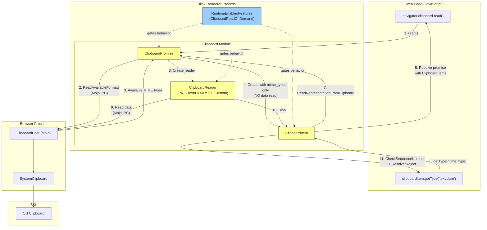
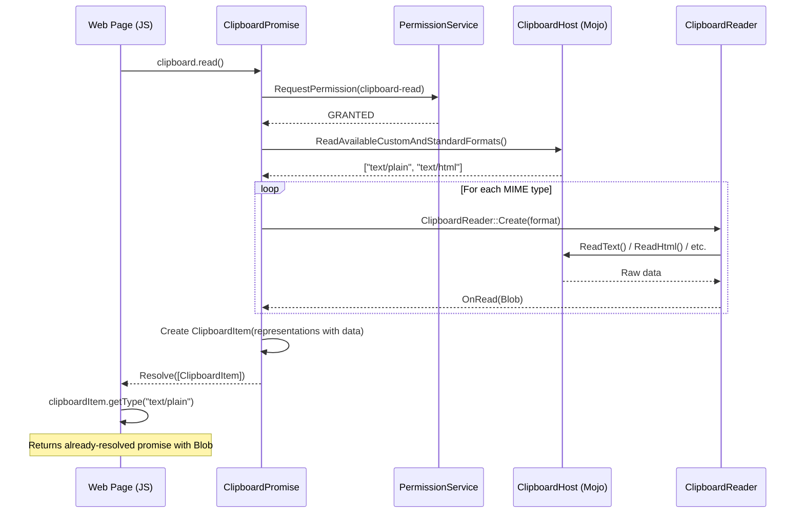
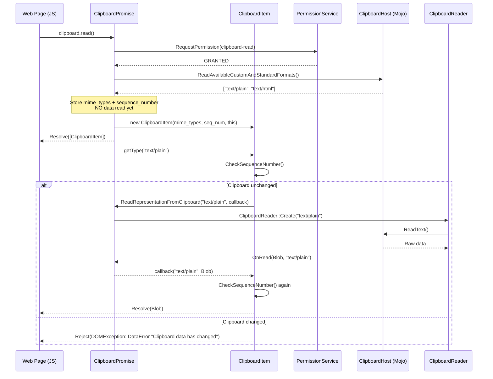

# High-Level Design: [Clipboard] Implementation of Lazy Read

**CL:** [6978530](https://chromium-review.googlesource.com/c/chromium/src/+/6978530)
**Author:** Shweta Bindal (shwetabindal@microsoft.com)
**Bug:** [435051711](https://crbug.com/435051711)
**Status:** NEW (Patch Set 14)

---

## 1. Executive Summary

This CL implements **lazy (on-demand) clipboard reading** in the Blink renderer's Async Clipboard API. Today, when a web page calls `navigator.clipboard.read()`, the browser eagerly reads **all** clipboard data for every supported MIME type from the OS clipboard upfront, even if the web page never actually accesses most of the data. This CL changes the behavior so that `clipboard.read()` only enumerates the available MIME types (via `ReadAvailableCustomAndStandardFormats`), and defers the actual data retrieval to when `ClipboardItem.getType()` is called by the web application. This reduces unnecessary IPC and system clipboard access, improving performance and privacy. The feature is gated behind the `ClipboardReadOnDemand` runtime-enabled feature flag (currently in `"test"` status).

---

## 2. Architecture Overview

### 2.1 Affected Components

| Component | Path | Role |
|-----------|------|------|
| **ClipboardItem** | `third_party/blink/renderer/modules/clipboard/clipboard_item.{h,cc}` | Web-exposed object holding clipboard data; now supports lazy resolution |
| **ClipboardPromise** | `third_party/blink/renderer/modules/clipboard/clipboard_promise.{h,cc}` | Orchestrates clipboard read/write operations and permission checks |
| **ClipboardReader** | `third_party/blink/renderer/modules/clipboard/clipboard_reader.cc` | Per-format readers that decode clipboard data from the OS clipboard |
| **MockClipboardHost** | `third_party/blink/renderer/core/testing/mock_clipboard_host.{h,cc}` | Test mock for the Mojo `ClipboardHost` interface |
| **RuntimeEnabledFeatures** | `third_party/blink/renderer/platform/runtime_enabled_features.json5` | Feature flag registry; new `ClipboardReadOnDemand` flag added |
| **Web Tests** | `third_party/blink/web_tests/clipboard/async-clipboard/` | Integration test for the new lazy read behavior |
| **Unit Tests** | `third_party/blink/renderer/modules/clipboard/clipboard_unittest.cc` | Unit tests verifying lazy loading and `getType()` on-demand reads |

### 2.2 How It Fits in the Existing Architecture

The Async Clipboard API in Blink follows a layered architecture:

1. **JavaScript API** (`Clipboard` IDL) → calls into `ClipboardPromise`
2. **ClipboardPromise** → handles permissions, orchestrates read/write via Mojo IPC to the browser process's `ClipboardHost`
3. **ClipboardReader** → per-format readers that deserialize OS clipboard data into `Blob` objects
4. **ClipboardItem** → web-exposed container for clipboard data, returned to JavaScript

This CL introduces a new execution path where `ClipboardPromise` no longer eagerly invokes `ClipboardReader` for every format during `clipboard.read()`. Instead, `ClipboardItem` is constructed with only MIME type metadata and a back-pointer to `ClipboardPromise`, enabling deferred reads when `getType()` is called.

### 2.3 Component Diagram

---

## 3. Design Goals & Non-Goals

### 3.1 Goals

| # | Goal | Description |
|---|------|-------------|
| G1 | **Lazy data retrieval** | Clipboard data is only read from the OS when `getType()` is called, not during `clipboard.read()` |
| G2 | **Clipboard change detection** | Detect if the clipboard content has changed between `read()` and `getType()` using sequence numbers; reject the promise with `DataError` if it has |
| G3 | **MIME type validation** | Verify that the requested MIME type is present in the OS clipboard before reading data |
| G4 | **Backward compatibility** | Existing behavior is preserved when the `ClipboardReadOnDemand` feature flag is disabled |
| G5 | **Per-format callback isolation** | Avoid race conditions when multiple `getType()` calls are made simultaneously for different MIME types |

### 3.2 Non-Goals

| # | Non-Goal | Rationale |
|---|----------|-----------|
| N1 | **Browser-process changes** | This CL only modifies the renderer-side logic; the Mojo `ClipboardHost` interface is unchanged |
| N2 | **Write-side lazy behavior** | Clipboard write operations are not changed |
| N3 | **Enabling the feature by default** | The flag is `"test"` status — production rollout is a separate effort |
| N4 | **Cross-origin clipboard isolation** | Out of scope for this CL; clipboard sandboxing is handled elsewhere |
| N5 | **Custom format lazy read** | While custom formats are supported via existing `ClipboardReader`, no special lazy logic is added for custom format negotiation |

---

## 4. System Interactions

### 4.1 Sequence Diagram — Eager Read (Existing Behavior, Flag OFF)

### 4.2 Sequence Diagram — Lazy Read (New Behavior, Flag ON)

### 4.3 Mojo/IPC Interactions

The Mojo `ClipboardHost` interface (`mojom::blink::ClipboardHost`) is **not modified** by this CL. The same IPC methods are used:

| IPC Method | When Called (Eager) | When Called (Lazy) |
|------------|--------------------|--------------------|
| `ReadAvailableCustomAndStandardFormats()` | During `clipboard.read()` | During `clipboard.read()` (unchanged) |
| `ReadText()` | During `clipboard.read()` | Deferred to `getType("text/plain")` |
| `ReadHtml()` | During `clipboard.read()` | Deferred to `getType("text/html")` |
| `ReadPng()` | During `clipboard.read()` | Deferred to `getType("image/png")` |
| `ReadSvg()` | During `clipboard.read()` | Deferred to `getType("image/svg+xml")` |
| `ReadCustomData()` | During `clipboard.read()` | Deferred to `getType("web ...")` |
| `GetSequenceNumber()` | For telemetry | Also used at `getType()` time for change detection |

---

## 5. API & Interface Changes

### 5.1 New Public Interfaces

| Class | Method/Member | Signature | Description |
|-------|---------------|-----------|-------------|
| `ClipboardItem` | Constructor | `ClipboardItem(const HeapVector<String>& mime_types, absl::uint128 sequence_number, ClipboardPromise*)` | Constructs a lazy `ClipboardItem` with only MIME type metadata and a back-pointer to the `ClipboardPromise` |
| `ClipboardItem` | `SetClipboardPromise` | `void SetClipboardPromise(ClipboardPromise*, absl::uint128)` | Sets the clipboard promise and sequence number on an existing item |
| `ClipboardPromise` | `OnRead` (overload) | `void OnRead(Blob* blob, const String& mime_type)` | New overload that routes a read result to the correct per-format callback |
| `ClipboardPromise` | `GetSequenceNumberToken` | `absl::uint128 GetSequenceNumberToken()` | Returns the current clipboard sequence number for change detection |
| `ClipboardPromise` | `ReadRepresentationFromClipboard` | `void ReadRepresentationFromClipboard(const String& format, base::OnceCallback<void(const String&, Blob*)>)` | Entry point for on-demand reading triggered by `ClipboardItem::getType()` |

### 5.2 Modified Interfaces

| Class | Method | Change |
|-------|--------|--------|
| `ClipboardItem::types()` | Now branches on `ClipboardReadOnDemand` flag; returns from `mime_types_` (lazy) or `representations_` (eager) |
| `ClipboardItem::getType()` | Now branches: if lazy, creates `ScriptPromiseResolver`, registers callback, and defers read to `ClipboardPromise` |
| `ClipboardPromise::OnReadAvailableFormatNames()` | When lazy, stores `item_mime_types_` and calls `ResolveRead()` immediately instead of `ReadNextRepresentation()` |
| `ClipboardPromise::ResolveRead()` | When lazy, creates `ClipboardItem` with only MIME types instead of pre-resolved data |
| `ClipboardReader` subclasses (all 5) | Each reader's completion callback now branches to call either `OnRead(Blob)` or `OnRead(Blob, mime_type)` |

### 5.3 New Runtime Feature Flag

| Flag | Status | Location |
|------|--------|----------|
| `ClipboardReadOnDemand` | `"test"` | `/workspace/cr3/src/third_party/blink/renderer/platform/runtime_enabled_features.json5` |

This flag gates all new behavior. When disabled, the code follows the existing eager-read path with zero behavioral changes.

### 5.4 No Deprecated Interfaces

No interfaces are removed or deprecated. The existing eager-read path is fully preserved behind the feature flag check.

---

## 6. Dependencies

### 6.1 What This Code Depends On

| Dependency | Type | Notes |
|------------|------|-------|
| `mojom::blink::ClipboardHost` | Mojo IPC | Used to read clipboard data; interface is **not changed** |
| `SystemClipboard::SequenceNumber()` | Internal API | Used for clipboard change detection |
| `ClipboardReader` subclasses | Internal | Reused for on-demand data reading |
| `RuntimeEnabledFeatures` | Platform | Feature flag mechanism |
| `ScriptPromiseResolver<Blob>` | Bindings | Used for deferred promise resolution in `representations_with_resolvers_` |
| `base::OnceCallback` | Base | Per-MIME-type callback storage in `read_callbacks_` |

### 6.2 What Depends on This Code

| Dependent | Impact |
|-----------|--------|
| Web applications using `navigator.clipboard.read()` + `getType()` | Behavioral change: data read is deferred; new `DataError` exception possible if clipboard changes between `read()` and `getType()` |
| WPT tests (`clipboard-apis/`) | Some tests may need updates if they assume eager data availability |
| Future clipboard features | This establishes the lazy-read infrastructure for further optimizations |

### 6.3 Compatibility Considerations

- **Feature flag gated**: All changes are behind `ClipboardReadOnDemand` (`status: "test"`), so production users are unaffected.
- **Spec compliance**: The `DataError` rejection on clipboard change detection is not currently mandated by the [Clipboard API spec](https://w3c.github.io/clipboard-apis/). This is a Chromium-specific enhancement for data integrity.
- **Promise semantics**: `getType()` continues to return a `ScriptPromise<Blob>`, but the resolution is now deferred rather than pre-resolved.

---

## 7. Risks & Mitigations

### 7.1 Risk Matrix

| # | Risk | Severity | Likelihood | Mitigation |
|---|------|----------|------------|------------|
| R1 | **Clipboard changes between `read()` and `getType()`** cause unexpected `DataError` rejections for legitimate use cases | Medium | Medium | Sequence number check is done both before and after the read. Web apps should handle `DataError` gracefully. |
| R2 | **Race conditions** when multiple `getType()` calls happen concurrently for different MIME types | High | Medium | Per-MIME-type callback storage (`read_callbacks_` HashMap) ensures each format's callback is independent. |
| R3 | **Memory leaks** from `ClipboardPromise` back-pointer in `ClipboardItem` preventing GC | Medium | Low | Uses `Member<ClipboardPromise>` (traced via `Trace()`) so Oilpan GC can collect the cycle. |
| R4 | **`representations_with_resolvers_` growing unbounded** if `getType()` is called repeatedly for the same type | Low | Low | On second call for the same MIME type, the existing resolver's promise is returned (no new resolver created). See the `find()` check in `getType()`. |
| R5 | **Sequence number == 0** used as sentinel but could theoretically be a valid sequence number | Low | Very Low | `absl::uint128` makes 0 astronomically unlikely as a real sequence number. The code also gates on `sequence_number_ != 0` to detect the lazy path. |
| R6 | **Execution context destruction** during deferred read | Medium | Low | `ReadRepresentationFromClipboard` checks `GetExecutionContext()` before proceeding; `ContextDestroyed()` rejects pending promises. |
| R7 | **Breaking existing WPT tests** (`clipboard-item.https.html`, `async-navigator-clipboard-write-domstring.https.html`) | High | Medium | Earlier patch sets showed WPT failures. The flag's `"test"` status means it's not enabled in WPT runs by default. |

### 7.2 Backward Compatibility

- **No breaking changes**: All new behavior is gated behind `RuntimeEnabledFeatures::ClipboardReadOnDemandEnabled()`.
- **Gradual rollout**: The `"test"` status means the flag is only enabled in test builds. Moving to `"experimental"` and then `"stable"` would be done in subsequent CLs after validation.

### 7.3 Migration Strategy

No migration is needed for existing code. When the flag is eventually enabled by default:
1. Web applications calling `getType()` may see `DataError` if the clipboard changes — this is a new error that apps must handle.
2. Performance should improve since unused MIME types are never read.
3. No API surface changes — `clipboard.read()` and `getType()` signatures remain the same.

---

## 8. Testing Strategy

### 8.1 Unit Tests

**File:** `/workspace/cr3/src/third_party/blink/renderer/modules/clipboard/clipboard_unittest.cc`

| Test | What It Verifies |
|------|-----------------|
| `ReadOnlyMimeTypesInClipboardRead` | Verifies that `clipboard.read()` with the lazy flag enabled only calls `ReadAvailableCustomAndStandardFormats()` on the mock clipboard host, and does **not** call `ReadText()` or `ReadHtml()`. This proves the lazy loading contract. |
| `ClipboardItemGetTypeTest` | Verifies that calling `getType("text/plain")` on a lazily-constructed `ClipboardItem` triggers the deferred `ReadText()` call on the mock clipboard host and successfully returns data. |

**Test infrastructure additions:**
- `MockClipboardHost` gains call-tracking booleans (`read_text_called_`, `read_html_called_`, `read_available_formats_called_`) and corresponding accessors (`WasReadTextCalled()`, etc.).
- `ClipboardItemGetType` helper class chains promises to test the `getType()` flow.

### 8.2 Web Tests (Integration)

**File:** `/workspace/cr3/src/third_party/blink/web_tests/clipboard/async-clipboard/async-clipboard-lazy-read.html`

| Test | What It Verifies |
|------|-----------------|
| `Clipboard change detection should throw DataError` | Writes initial text, calls `clipboard.read()`, writes different text (changing the clipboard), then verifies `getType('text/plain')` rejects with `DataError`. |

### 8.3 Test Coverage Assessment

| Scenario | Covered? | Test |
|----------|----------|------|
| Lazy `read()` only enumerates types | ✅ | `ReadOnlyMimeTypesInClipboardRead` |
| `getType()` triggers deferred read | ✅ | `ClipboardItemGetTypeTest` |
| Clipboard change detection rejects | ✅ | `async-clipboard-lazy-read.html` |
| Multiple concurrent `getType()` calls | ❌ | Not directly tested |
| `getType()` for unsupported MIME type | ❌ | Not directly tested (throws `NotFoundError`) |
| Context destruction during deferred read | ❌ | Not tested |
| Second `getType()` call for same MIME type returns same promise | ❌ | Not tested |
| Feature flag disabled (eager path unchanged) | ⚠️ | Existing tests cover this implicitly |

### 8.4 Recommended Additional Test Coverage

1. **Concurrent `getType()` calls**: Test calling `getType("text/plain")` and `getType("text/html")` simultaneously to verify `read_callbacks_` per-MIME isolation.
2. **Repeated `getType()` same type**: Verify that calling `getType("text/plain")` twice returns the same promise resolver.
3. **Unsupported MIME type**: Verify `getType("application/unsupported")` throws `NotFoundError`.
4. **Context destruction**: Verify pending promises are rejected when the execution context is destroyed mid-read.

---

## Appendix: Key Code Paths

### A. Lazy Read Entry Point
`/workspace/cr3/src/third_party/blink/renderer/modules/clipboard/clipboard_promise.cc` — `OnReadAvailableFormatNames()`: When the flag is on, stores MIME types in `item_mime_types_` and immediately calls `ResolveRead()` without reading data.

### B. Deferred Data Read
`/workspace/cr3/src/third_party/blink/renderer/modules/clipboard/clipboard_item.cc` — `getType()`: When lazy, checks sequence number, creates a `ScriptPromiseResolver<Blob>`, and calls `clipboard_promise_->ReadRepresentationFromClipboard()`.

### C. Callback Routing
`/workspace/cr3/src/third_party/blink/renderer/modules/clipboard/clipboard_promise.cc` — `OnRead(Blob*, const String&)`: New overload that looks up the per-MIME-type callback in `read_callbacks_` and invokes it, routing the data back to `ClipboardItem::ResolveFormatData()`.

### D. Change Detection
`/workspace/cr3/src/third_party/blink/renderer/modules/clipboard/clipboard_item.cc` — `CheckSequenceNumber()`: Compares the stored sequence number from `read()` time with the current sequence number from `clipboard_promise_->GetSequenceNumberToken()`.
