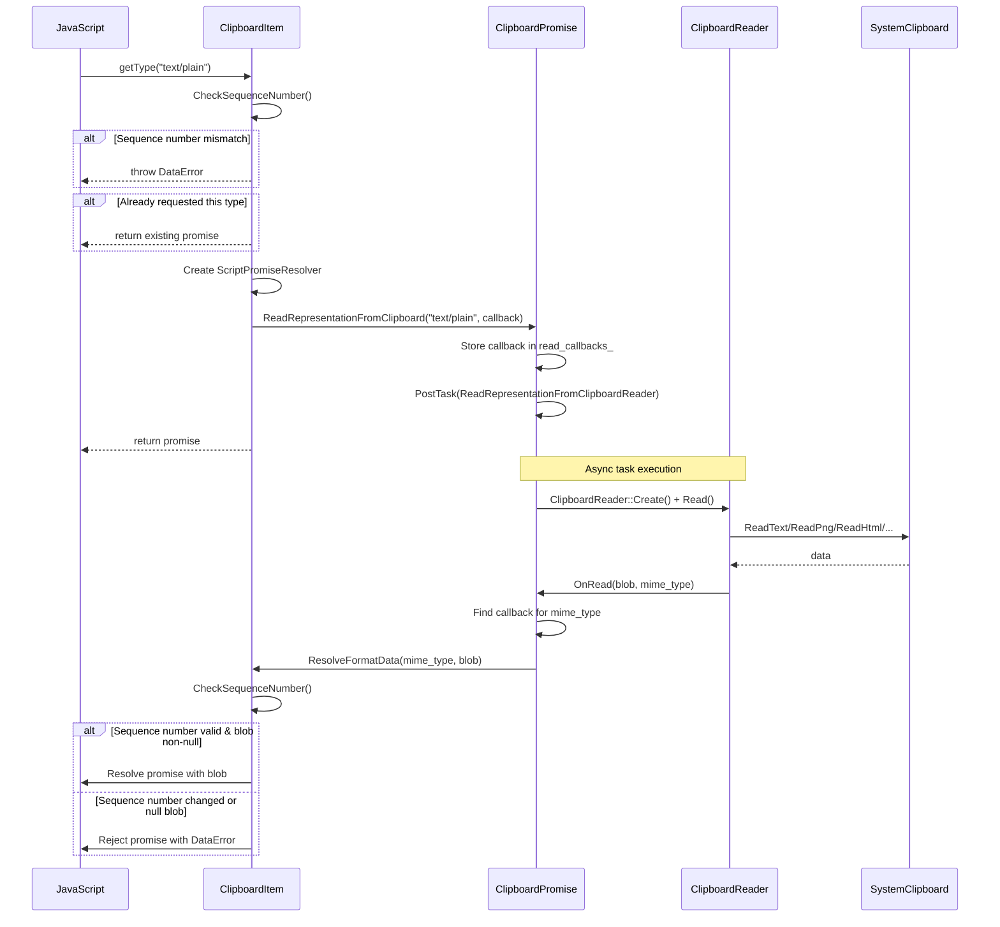
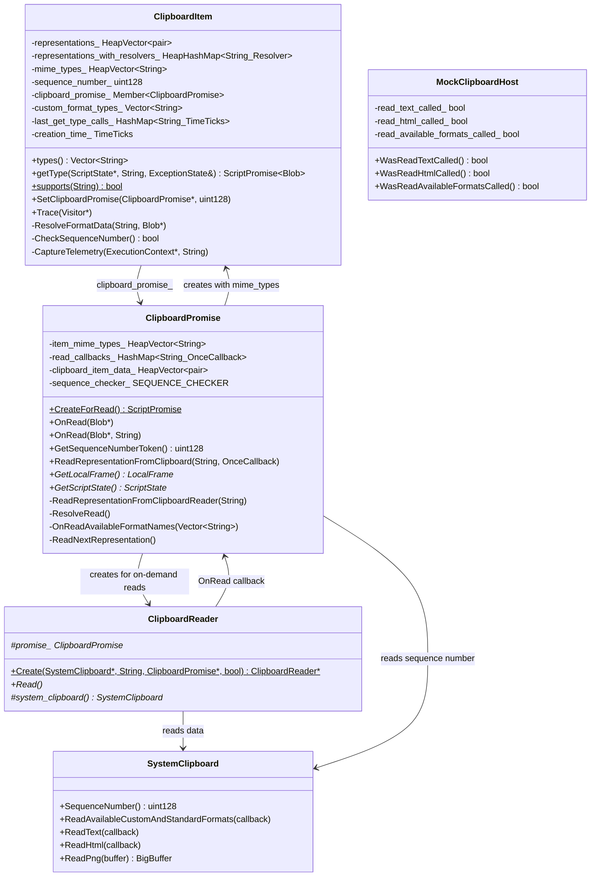
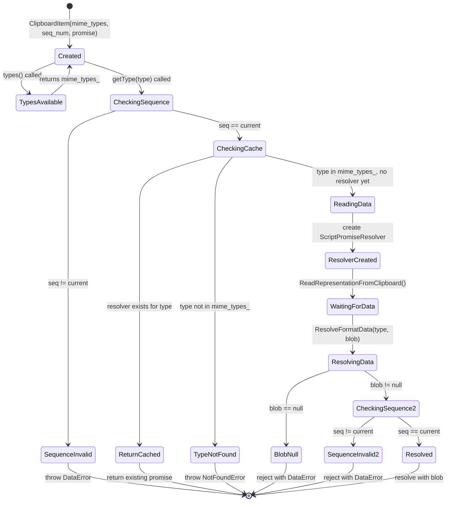
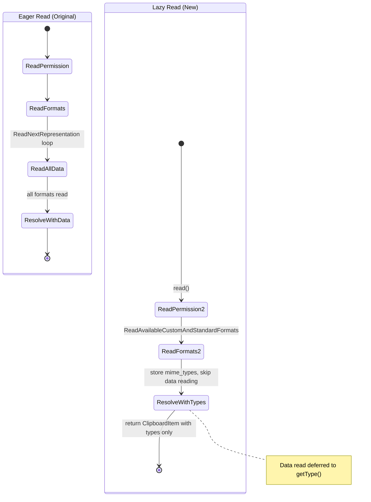

# Low-Level Design Review: CL 6978530 — [Clipboard] Implementation of Lazy Read

**CL URL:** https://chromium-review.googlesource.com/c/chromium/src/+/6978530  
**Author:** Shweta Bindal <shwetabindal@microsoft.com>  
**Status:** NEW (Patch Set 14)  
**Bug:** [435051711](https://crbug.com/435051711)  
**Total Changes:** 10 files, +447/-43 lines

## Overview

This CL implements "lazy read" for the Async Clipboard API in the Blink renderer. Instead of eagerly reading all clipboard data when `navigator.clipboard.read()` is called, data is now read on-demand when `getType()` is invoked on a `ClipboardItem`. The implementation also validates that the clipboard has not changed between the initial `read()` and subsequent `getType()` calls via sequence number checking.

---

## 1. File-by-File Analysis

---

### 1.1 `runtime_enabled_features.json5`

**Purpose of changes**: Adds a new runtime feature flag `ClipboardReadOnDemand` to gate the lazy read behavior.

**Key modifications**:
- Added `ClipboardReadOnDemand` feature with `status: "test"` (only enabled in test configurations)

| Property | Value |
|----------|-------|
| `name` | `ClipboardReadOnDemand` |
| `status` | `"test"` |

**Notes**: The `"test"` status means this feature is only active in testing builds, not in production. This is appropriate for an experimental feature still under development.

---

### 1.2 `clipboard_item.h`

**Purpose of changes**: Extends `ClipboardItem` to support lazy read by holding MIME type metadata and a back-reference to `ClipboardPromise` for on-demand data fetching.

**Key modifications**:
- Added new constructor accepting `HeapVector<String>` (MIME types only, no data)
- Added `static Create()` overload for MIME-type-only construction
- Added `SetClipboardPromise()` public method
- Added private `ResolveFormatData()`, `CheckSequenceNumber()` methods
- Added `representations_with_resolvers_` map for pending getType() promises
- Added `mime_types_` for storing available types without data
- Added `clipboard_promise_` member for back-reference

**New/Modified Data Structures**:

| Member | Type | Purpose |
|--------|------|---------|
| `representations_with_resolvers_` | `HeapHashMap<String, Member<ScriptPromiseResolver<Blob>>>` | Maps MIME type → pending promise resolver for lazy getType() calls |
| `mime_types_` | `HeapVector<String>` | Available MIME types (no data) for lazy-read items |
| `clipboard_promise_` | `Member<ClipboardPromise>` | Back-reference to owning ClipboardPromise for on-demand reads |

**API Changes**:

| Function | Visibility | Purpose |
|----------|-----------|---------|
| `ClipboardItem(HeapVector<String>&, uint128, ClipboardPromise*)` | public | New constructor for lazy-read items |
| `SetClipboardPromise(ClipboardPromise*, uint128)` | public | Declared but **not implemented** in this CL |
| `ResolveFormatData(String&, Blob*)` | private | Callback to resolve/reject a getType() promise |
| `CheckSequenceNumber()` | private | Validates clipboard hasn't changed |

---

### 1.3 `clipboard_item.cc`

**Purpose of changes**: Implements lazy-read logic in `ClipboardItem`. The `getType()` method now defers actual data reading to `ClipboardPromise` and validates clipboard consistency via sequence numbers.

**Key modifications**:
- New constructor stores MIME types and `ClipboardPromise` pointer (no actual data)
- `types()` returns from `mime_types_` when lazy-read is active
- `getType()` branches: eager path (original) vs lazy path (new)
- `ResolveFormatData()` resolves/rejects the deferred promise based on blob validity and sequence number check
- `CheckSequenceNumber()` compares stored vs current sequence number
- `Trace()` updated to trace new GC members

**New/Modified Functions**:

| Function | Purpose | Parameters | Returns |
|----------|---------|------------|---------|
| `ClipboardItem(mime_types, seq_num, promise)` | Construct lazy-read item | MIME types, sequence number, ClipboardPromise* | N/A |
| `types()` | Return available types | none | `Vector<String>` |
| `getType(script_state, type, exception_state)` | Get data for a type; lazy reads on demand | ScriptState*, type string, ExceptionState& | `ScriptPromise<Blob>` |
| `ResolveFormatData(mime_type, blob)` | Resolve/reject pending promise | MIME type, Blob* (nullable) | void |
| `CheckSequenceNumber()` | Verify clipboard unchanged | none | bool |

**Data Flow — `getType()` (lazy-read path)**:



---

### 1.4 `clipboard_promise.h`

**Purpose of changes**: Extends `ClipboardPromise` with on-demand read infrastructure — new public methods for lazy read orchestration and storage for per-MIME-type callbacks.

**Key modifications**:
- Added `OnRead(Blob*, const String&)` overload for MIME-type-specific read completion
- Added `GetSequenceNumberToken()` public method
- Added `ReadRepresentationFromClipboard()` public method (entry point for lazy reads)
- Added private `ReadRepresentationFromClipboardReader()` helper
- Added `item_mime_types_` for MIME type list storage
- Added `read_callbacks_` map for per-format callbacks
- Added `#include "third_party/blink/public/common/tokens/tokens.h"` (unused — see concerns)
- Forward-declared `Blob` and `ClipboardItem`

**New/Modified Data Structures**:

| Member | Type | Purpose |
|--------|------|---------|
| `item_mime_types_` | `HeapVector<String>` | MIME types available on clipboard (populated during read) |
| `read_callbacks_` | `HashMap<String, OnceCallback<void(String&, Blob*)>>` | Per-format callbacks from ClipboardItem for lazy reads |

---

### 1.5 `clipboard_promise.cc`

**Purpose of changes**: Implements the lazy-read orchestration logic. Changes the `read()` flow to resolve immediately with type metadata (no data) when the feature is enabled, and adds infrastructure for on-demand reads triggered by `getType()`.

**Key modifications**:
- `ResolveRead()` creates `ClipboardItem` with MIME types only (no data) when feature enabled
- `OnReadAvailableFormatNames()` stores types in `item_mime_types_` and resolves immediately (no `ReadNextRepresentation()`)
- New `ReadRepresentationFromClipboard()` stores callback and posts task to read from clipboard
- New `ReadRepresentationFromClipboardReader()` creates `ClipboardReader` and reads
- New `OnRead(Blob*, String)` dispatches blob to stored callback
- New `GetSequenceNumberToken()` returns current clipboard sequence number

**New/Modified Functions**:

| Function | Purpose | Parameters | Returns |
|----------|---------|------------|---------|
| `ReadRepresentationFromClipboard(format, callback)` | Entry point for lazy read; stores callback and posts task | format string, OnceCallback | void |
| `ReadRepresentationFromClipboardReader(format)` | Creates ClipboardReader and reads | format string | void |
| `OnRead(blob, mime_type)` | Dispatches blob to per-format callback | Blob*, mime_type string | void |
| `GetSequenceNumberToken()` | Returns current clipboard sequence number | none | `absl::uint128` |
| `ResolveRead()` | Modified to support lazy-read path | none | void |
| `OnReadAvailableFormatNames(format_names)` | Modified to support lazy-read path | format names vector | void |

---

### 1.6 `clipboard_reader.cc`

**Purpose of changes**: Routes read completion callbacks to the appropriate `OnRead()` overload based on the feature flag.

**Key modifications**:
- All 5 reader types (PNG, PlainText, HTML, SVG, CustomFormat) updated to call `OnRead(blob, mime_type)` when `ClipboardReadOnDemandEnabled()`, else call `OnRead(blob)`

**Affected Reader Classes**:
- `ClipboardPngReader` → passes `ui::kMimeTypePng`
- `ClipboardPlainTextReader` → passes `ui::kMimeTypePlainText`
- `ClipboardHtmlReader` → passes `ui::kMimeTypeHtml`
- `ClipboardSvgReader` → passes `ui::kMimeTypeSvg`
- `ClipboardCustomFormatReader` → passes `mime_type_`

---

### 1.7 `mock_clipboard_host.h` / `mock_clipboard_host.cc`

**Purpose of changes**: Adds call-tracking instrumentation to `MockClipboardHost` for testing lazy-read behavior.

**Key modifications**:
- Added `read_text_called_`, `read_html_called_`, `read_available_formats_called_` boolean flags
- Added public accessors `WasReadTextCalled()`, `WasReadHtmlCalled()`, `WasReadAvailableFormatsCalled()`
- Flags set in `ReadText()`, `ReadHtml()`, `ReadAvailableCustomAndStandardFormats()`
- Flags reset in `Reset()`

---

### 1.8 `clipboard_unittest.cc`

**Purpose of changes**: Adds two unit tests verifying lazy-read behavior.

**Key modifications**:
- Added `ClipboardItemGetType` helper class (ThenCallable that chains `getType()` after `read()`)
- Modified `ClipboardTest` constructor to set up `MockClipboardHostProvider`
- Added `mock_clipboard_host()` accessor

**New Tests**:

| Test | Purpose |
|------|---------|
| `ReadOnlyMimeTypesInClipboardRead` | Verifies that `read()` only calls `ReadAvailableCustomAndStandardFormats()`, NOT `ReadText()` or `ReadHtml()` |
| `ClipboardItemGetTypeTest` | Verifies that `getType("text/plain")` after `read()` triggers `ReadText()` and resolves successfully |

---

### 1.9 `async-clipboard-lazy-read.html`

**Purpose of changes**: Web test verifying clipboard change detection throws `DataError`.

**Test flow**:
1. Write "Initial clipboard content"
2. Call `navigator.clipboard.read()` to get `ClipboardItem`
3. Write "Changed clipboard content" (changes clipboard)
4. Call `item.getType('text/plain')` → should throw `DataError`

---

## 2. Class Diagram



---

## 3. State Diagram

### ClipboardItem Lifecycle (Lazy Read)



### Read Flow Comparison



---

## 4. Implementation Concerns

### 4.1 Memory Management Issues

1. **Circular reference risk**: `ClipboardItem` holds a `Member<ClipboardPromise>` and `ClipboardPromise` creates `ClipboardItem`. While both use `Member<>` (GC-traced pointers), the `ClipboardPromise` is not explicitly prevented from holding a reference back to `ClipboardItem` (it does not currently, but the `WrapPersistent(this)` in `ReadRepresentationFromClipboard` callback chain creates an implicit dependency). The `WrapPersistent(this)` in `BindOnce(&ClipboardItem::ResolveFormatData, WrapPersistent(this))` prevents GC of the `ClipboardItem` while a read is pending — this is intentional but could leak if the read never completes.

2. **`read_callbacks_` is not GC-traced**: `HashMap<String, base::OnceCallback<...>>` is stored in `ClipboardPromise` but not traced. Since `OnceCallback` captures `WrapPersistent(ClipboardItem)`, this keeps ClipboardItem alive as long as the callback exists. If `ClipboardPromise` is GC'd before the callback executes, the callback is destroyed, releasing the ClipboardItem — this appears correct.

3. **`SetClipboardPromise()` is declared but never implemented**: The method is declared in `clipboard_item.h` line 84 but has no implementation in `clipboard_item.cc`. This will cause a linker error if called.

### 4.2 Thread Safety Concerns

1. **Task posting in `ReadRepresentationFromClipboard()`**: The method stores a callback in `read_callbacks_` and then posts a task. The `DCHECK_CALLED_ON_VALID_SEQUENCE` check ensures this is called on the correct sequence, and the posted task also runs on the clipboard task runner. This appears safe.

2. **Multiple concurrent `getType()` calls**: The design uses per-MIME-type callbacks in `read_callbacks_`, which correctly handles concurrent calls for different types. However, a second `getType()` for the same type returns the cached resolver without checking if the read is still pending or already resolved/rejected — a resolved/rejected resolver will return its settled promise, which is correct behavior.

### 4.3 Performance Implications

1. **Positive**: The primary goal of this CL — avoiding unnecessary data reads — is achieved. `read()` now only queries available formats, not their data. This is a significant improvement for pages that call `read()` but only access a subset of types.

2. **Negative**: Each `getType()` call now results in a separate IPC to the clipboard host, whereas previously all data was batched in a single read loop. For pages that read all types, this could be slower due to per-type IPC overhead.

3. **Sequence number checking** adds an additional IPC call (`SequenceNumber()`) on each `getType()` and in `ResolveFormatData()`, doubling the clipboard IPC count per type.

### 4.4 Maintainability Concerns

1. **Feature flag branching everywhere**: The code heavily branches on `RuntimeEnabledFeatures::ClipboardReadOnDemandEnabled()` in `clipboard_item.cc`, `clipboard_promise.cc`, and `clipboard_reader.cc`. This makes the code harder to read and maintain. Once the feature ships stable, the old code paths should be removed.

2. **`sequence_number_ == 0` as sentinel**: The condition `sequence_number_ != 0` in `types()` and `sequence_number_ == 0` in `getType()` is used to distinguish lazy-read items from eager-read items. This is fragile — a clipboard sequence number of 0 is technically valid. The code should use a separate boolean flag or `std::optional` to indicate lazy-read mode.

3. **Duplicate error messages**: "Clipboard data has changed" and "The type was not found" error strings are duplicated across multiple locations. These should be constants.

4. **Two code paths for the same functionality**: `ClipboardItem` now has two parallel data structures (`representations_` + `representations_with_resolvers_` + `mime_types_`), two constructors, and branching logic throughout. This increases the surface area for bugs.

---

## 5. Suggestions for Improvement

### 5.1 Code Quality

1. **Remove or implement `SetClipboardPromise()`**: The method is declared in the header (line 84) but never defined. Either remove the declaration or implement it. As-is, any code that calls it will fail to link.

2. **Remove unused include**: `third_party/blink/public/common/tokens/tokens.h` is included in `clipboard_promise.h` but not used. The review comment from Ashish Kumar flagged a similar issue with includes in `clipboard_item.h` which was resolved, but this one remains.

3. **Extract error message constants**:
   ```cpp
   static constexpr const char kClipboardDataChangedError[] = "Clipboard data has changed";
   static constexpr const char kTypeNotFoundError[] = "The type was not found";
   ```

4. **Fix double exception throw in `getType()`**: When `clipboard_promise_` exists and the type is not in `mime_types_`, the method throws `NotFoundError` inside the `if (clipboard_promise_)` block (line 197-198), then falls through to throw `NotFoundError` again (line 202-203). The second throw will hit an already-set `exception_state`. Add `return ScriptPromise<Blob>();` after the first throw, or restructure with early returns.

5. **Use `std::optional` or a boolean for lazy-read mode detection** instead of relying on `sequence_number_ == 0`:
   ```cpp
   bool is_lazy_read_ = false;
   ```

### 5.2 Architecture

1. **Consider lazy-read as a separate ClipboardItem subclass or strategy**: Rather than branching on the feature flag throughout ClipboardItem, consider a `LazyClipboardItem` subclass or a strategy pattern that cleanly separates the two code paths. This would simplify both the current dual-mode code and the eventual cleanup when the feature ships.

2. **Batch sequence number check**: Instead of checking the sequence number in both `getType()` (before read) and `ResolveFormatData()` (after read), consider checking only after the read completes. The pre-read check is redundant if the post-read check catches all mutations. However, the pre-read check provides a fast-fail path, so keeping both is defensible if the documentation makes this clear.

3. **Consider caching blobs**: Once a `getType()` resolves successfully, the blob data could be cached in `representations_with_resolvers_` (via the settled promise). Currently this happens implicitly through the resolved `ScriptPromiseResolver`, which returns its settled value on subsequent access. This is correct behavior.

### 5.3 Testing

1. **Missing test: multiple concurrent `getType()` calls for different types**: The test `ClipboardItemGetTypeTest` only tests a single `getType()` call. A test with concurrent calls for `text/plain` and `text/html` would verify the per-MIME-type callback mechanism works correctly.

2. **Missing test: `getType()` for unsupported type**: Should verify `NotFoundError` is thrown when requesting a type not in the clipboard.

3. **Missing test: repeated `getType()` for the same type**: Should verify the cached resolver is returned and the read is not triggered again.

4. **Missing test: context destruction during pending read**: Should verify that a pending `getType()` promise handles context destruction gracefully (no crash/UAF).

5. **Web test missing newline at EOF**: `async-clipboard-lazy-read.html` is missing a trailing newline (the diff shows `\ No newline at end of file`).

### 5.4 Specific Bug: Double Exception in `getType()`

```cpp
// Line 187-203 in clipboard_item.cc
if (mime_types_.Contains(type)) {
    // ... create resolver and read ...
    return representations_with_resolvers_.at(type)->Promise();
} else {
    exception_state.ThrowDOMException(DOMExceptionCode::kNotFoundError,
                                      "The type was not found");
    // BUG: falls through to line 202 which throws again!
}
// If we get here, the type was not found
exception_state.ThrowDOMException(DOMExceptionCode::kNotFoundError,
                                  "The type was not found");
return ScriptPromise<Blob>();
```

The `else` branch at line 197 throws an exception but does not return. Execution falls through to line 202, which attempts to throw a second exception on the same `ExceptionState`. This is a bug — in Chromium's ExceptionState, throwing when an exception is already pending is a `DCHECK` failure. Fix: add `return ScriptPromise<Blob>();` after line 198.

---

## 6. Summary

| Aspect | Assessment |
|--------|-----------|
| **Correctness** | Mostly correct; double-exception bug in `getType()` needs fixing |
| **Performance** | Improves common case (read without getType); may regress all-types-read case |
| **Security** | Sequence number validation provides clipboard change detection |
| **Maintainability** | Feature flag branching adds complexity; should be cleaned up post-launch |
| **Test Coverage** | Basic happy path covered; needs more edge case tests |
| **API Surface** | `SetClipboardPromise()` declared but unimplemented — linker issue if used |
