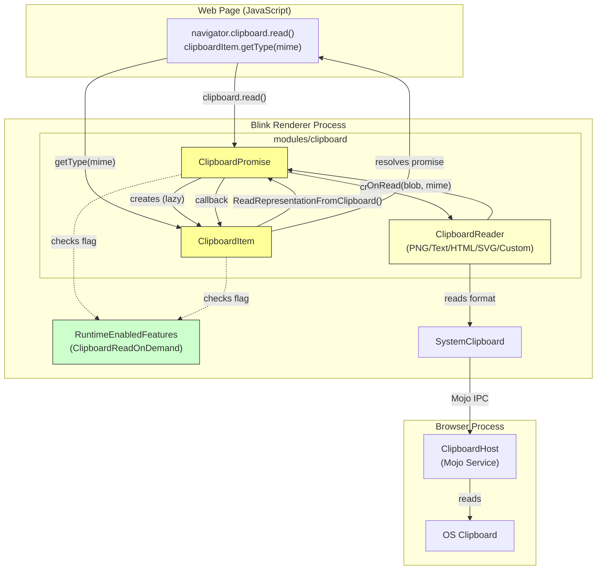
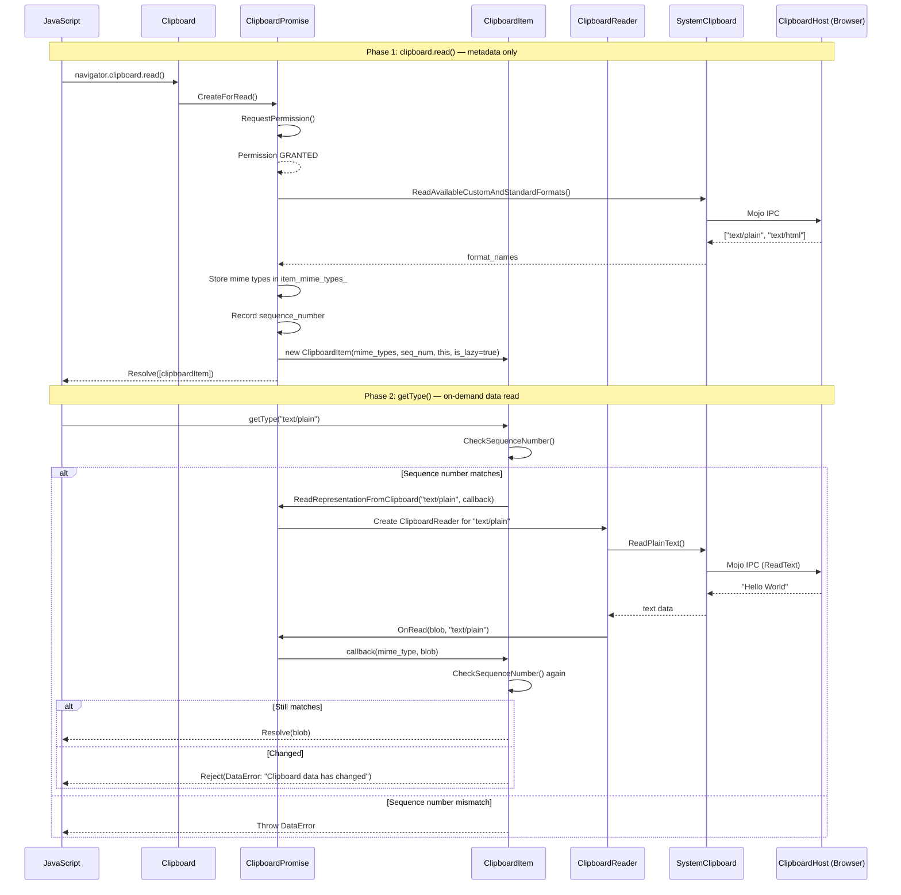
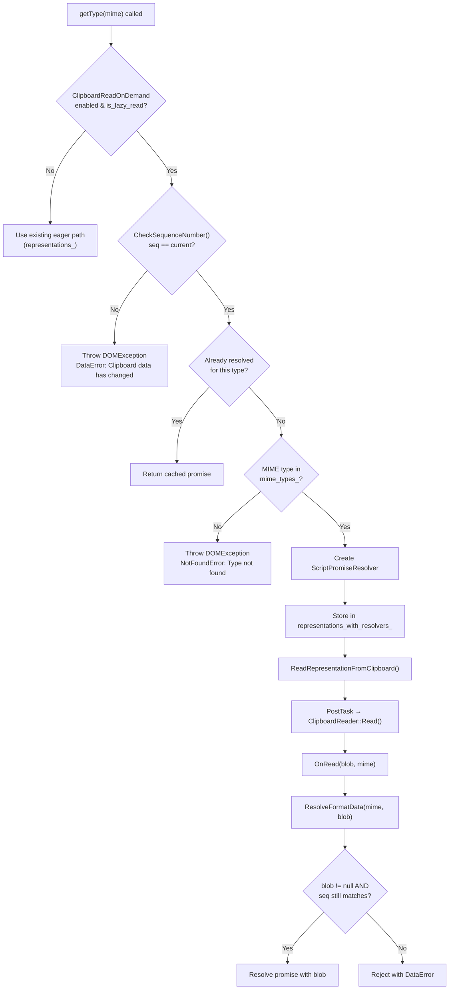

# High-Level Design: [Clipboard] Implementation of Lazy Read

**CL:** [6978530](https://chromium-review.googlesource.com/c/chromium/src/+/6978530)
**Author:** Shweta Bindal (shwetabindal@microsoft.com)
**Bug:** [435051711](https://crbug.com/435051711)
**Status:** NEW (Patch Set 15)

---

## 1. Executive Summary

This CL implements **lazy reading** (on-demand reading) for the Async Clipboard API's `clipboard.read()` method in Blink's renderer process. Currently, when `clipboard.read()` is called, **all** clipboard data for every available MIME type is eagerly deserialized and read from the OS clipboard upfront — even if the web page never calls `getType()` for those formats. This CL changes the behavior so that `clipboard.read()` only retrieves the list of available MIME types (metadata), and defers the actual data read to when `ClipboardItem.getType()` is invoked for a specific format. This improves performance by avoiding unnecessary IPC round-trips and data deserialization for unused formats. The change is gated behind a new runtime feature flag `ClipboardReadOnDemand` (status: `test`), ensuring backward compatibility with the existing eager-read path.

---

## 2. Architecture Overview

### Affected Components

The CL modifies the **Blink renderer-side** clipboard module exclusively. No browser-process changes or Mojo interface changes are required — the existing `mojom::blink::ClipboardHost` IPC interface already supports the per-format read operations needed.

| Component | Role | Impact |
|---|---|---|
| `ClipboardPromise` | Orchestrates async clipboard read/write operations | Major: new lazy-read flow added |
| `ClipboardItem` | Represents a clipboard entry with typed data | Major: new constructor, on-demand `getType()` |
| `ClipboardReader` | Reads specific format data from system clipboard via Mojo | Minor: `OnRead` callback extended with MIME type |
| `MockClipboardHost` | Test mock for `ClipboardHost` Mojo interface | Minor: call-tracking booleans added |
| `RuntimeEnabledFeatures` | Feature flag registry | Minor: new `ClipboardReadOnDemand` flag |

### Component Diagram



### How It Fits Into Existing Architecture

The Async Clipboard API flow in Chromium is:

1. **JavaScript** calls `navigator.clipboard.read()`
2. **`Clipboard`** creates a `ClipboardPromise` via `ClipboardPromise::CreateForRead()`
3. **`ClipboardPromise`** requests permission, then calls `ReadAvailableCustomAndStandardFormats()` via Mojo to get available types
4. **Existing (eager):** For each type, a `ClipboardReader` reads the data immediately, builds `ClipboardItem` with resolved data, resolves the promise
5. **New (lazy):** `ClipboardPromise` builds a `ClipboardItem` with only MIME type names (no data), resolves the read promise immediately. Data is fetched when `getType()` is called.

---

## 3. Design Goals & Non-Goals

### Goals

| # | Goal |
|---|---|
| G1 | **Defer clipboard data reads** until `ClipboardItem.getType()` is called for a specific MIME type |
| G2 | **Detect clipboard changes** between `read()` and `getType()` using sequence numbers, throwing `DataError` if the clipboard was modified |
| G3 | **Validate MIME type availability** — only read types that were present when `read()` was called |
| G4 | **Maintain backward compatibility** — the eager-read path remains fully functional when `ClipboardReadOnDemand` is disabled |
| G5 | **Feature-flag gated** — new behavior is behind `ClipboardReadOnDemand` runtime flag (initially `test` status) |

### Non-Goals

| # | Non-Goal |
|---|---|
| N1 | **Browser-process changes** — this CL is renderer-side only; no Mojo interface changes |
| N2 | **Lazy write** — only the read path is modified; `clipboard.write()` is unchanged |
| N3 | **Caching / retry logic** — if a `getType()` call fails due to clipboard change, no automatic retry is attempted |
| N4 | **Cross-frame clipboard sharing** — not addressed in this CL |
| N5 | **Enabling by default** — the flag is set to `test` status, not `stable` |

---

## 4. System Interactions

### Main Flow: Lazy Read



### Sequence Number Validation Flow



### IPC / Mojo Interactions

This CL does **not** add any new Mojo interfaces. It reuses the existing `mojom::blink::ClipboardHost` methods:

| Mojo Method | When Called | Purpose |
|---|---|---|
| `GetSequenceNumber()` | During `read()` and `getType()` | Detect clipboard changes |
| `ReadAvailableCustomAndStandardFormats()` | During `read()` (both paths) | Get available MIME types |
| `ReadText()` | During `getType("text/plain")` (lazy) or during `read()` (eager) | Read plain text |
| `ReadHtml()` | During `getType("text/html")` (lazy) or during `read()` (eager) | Read HTML |
| `ReadPng()` | During `getType("image/png")` (lazy) or during `read()` (eager) | Read PNG image |
| `ReadSvg()` | During `getType("image/svg+xml")` (lazy) or during `read()` (eager) | Read SVG |
| `ReadUnsanitizedCustomFormat()` | During `getType(custom)` (lazy) or during `read()` (eager) | Read custom formats |

---

## 5. API & Interface Changes

### New Public Interfaces

| Class | Member | Signature | Description |
|---|---|---|---|
| `ClipboardItem` | Constructor | `ClipboardItem(const HeapVector<String>& mime_types, absl::uint128 sequence_number, ClipboardPromise* clipboard_promise, bool is_lazy_read)` | Creates a lazy-read `ClipboardItem` that only holds MIME type names, deferring data read |
| `ClipboardPromise` | Method | `void ReadRepresentationFromClipboard(const String& format, base::OnceCallback<void(const String&, Blob*)> callback)` | Public method for `ClipboardItem` to request on-demand reads |
| `ClipboardPromise` | Method | `absl::uint128 GetSequenceNumberToken()` | Returns the current clipboard sequence number for change detection |
| `ClipboardPromise` | Method | `void OnRead(Blob* blob, const String& mime_type)` | New overload that routes read results by MIME type |

### Modified Interfaces

| Class | Member | Change |
|---|---|---|
| `ClipboardItem::types()` | Method | Now branches: returns `mime_types_` when lazy, `representations_` when eager |
| `ClipboardItem::getType()` | Method | Now branches: lazy path creates a `ScriptPromiseResolver` and triggers on-demand read; eager path unchanged |
| `ClipboardPromise::ResolveRead()` | Method (private) | Now branches: lazy path creates `ClipboardItem` with just MIME types; eager path builds items with resolved data |
| `ClipboardReader` subclasses | `OnRead` callbacks | All five reader types (PNG, Text, HTML, SVG, Custom) now call `OnRead(blob, mime_type)` when lazy flag is enabled |
| `MockClipboardHost` | Test class | Added `WasReadTextCalled()`, `WasReadHtmlCalled()`, `WasReadAvailableFormatsCalled()` for test observability |

### New Runtime Feature Flag

```json5
{
  name: "ClipboardReadOnDemand",
  status: "test",
}
```

Defined in: `/workspace/cr1/src/third_party/blink/renderer/platform/runtime_enabled_features.json5`

### No Deprecated Interfaces

All existing interfaces remain functional. The eager-read path is the default when `ClipboardReadOnDemand` is disabled.

---

## 6. Dependencies

### What This Code Depends On

| Dependency | Type | Notes |
|---|---|---|
| `mojom::blink::ClipboardHost` | Mojo IPC | Existing interface; no changes needed |
| `SystemClipboard` | Platform abstraction | Used for `SequenceNumber()` and clipboard reads |
| `RuntimeEnabledFeatures` | Feature flag system | New `ClipboardReadOnDemand` flag |
| `ClipboardReader` (all subclasses) | Internal | Modified to pass MIME type in callback |
| `ScriptPromiseResolver<Blob>` | Bindings | Used for deferred promise resolution in `getType()` |
| `base::OnceCallback` | Base library | Used for per-MIME-type read callbacks |
| `HeapHashMap` | Oilpan (GC) | For `representations_with_resolvers_` map |

### What Depends On This Code

| Dependent | Impact |
|---|---|
| Web Platform Tests (WPT) for Clipboard API | Tests continue to pass; existing eager behavior unchanged |
| `ClipboardItem` JavaScript API consumers | Transparent — `types()` and `getType()` API surface unchanged |
| Future lazy-read browser-side CLs | This CL is the renderer-side piece; browser-side changes may follow |

### Compatibility

- **Backward compatible**: The `ClipboardReadOnDemand` flag defaults to `test` (not stable), so production behavior is unchanged.
- **Web-facing API**: The `ClipboardItem` interface exposed to JavaScript is unchanged — `types()` and `getType()` have the same signatures and return types.
- **Mojo interface**: No changes to the Mojo interface, so renderer ↔ browser compatibility is maintained.

---

## 7. Risks & Mitigations

### Risk Assessment

| # | Risk | Severity | Likelihood | Mitigation |
|---|---|---|---|---|
| R1 | **Race condition in concurrent `getType()` calls** — Multiple `getType()` calls for different MIME types could interfere with each other since `ClipboardPromise` stores a single `clipboard_reader_` member | High | Medium | Callbacks are stored per MIME type in `read_callbacks_` HashMap, and reads are posted as separate tasks. However, the single `clipboard_reader_` member could be overwritten if two reads overlap — see detailed analysis below |
| R2 | **Clipboard change detection false positives** — Sequence number could change between `getType()` pre-check and actual read completion, causing unnecessary `DataError` rejections | Medium | Low | Double-check: sequence number is validated both before initiating the read and after data is received in `ResolveFormatData()` |
| R3 | **Memory retention** — `ClipboardItem` holds a strong reference (`Member<ClipboardPromise>`) to the `ClipboardPromise` that created it, potentially keeping the promise (and its execution context bindings) alive longer than intended | Medium | Low | The `ClipboardPromise` is GC-traced; Oilpan should collect it when no longer reachable |
| R4 | **Feature flag scope creep** — The `ClipboardReadOnDemand` flag gates many conditional branches spread across multiple files, increasing code complexity | Low | High | Acceptable for an experimental feature; cleanup CL should remove the branches when the flag reaches `stable` |
| R5 | **`ClipboardReader` callback confusion** — The `OnRead` method now has two overloads (with and without `mime_type`), and the reader subclasses choose which to call based on the runtime flag | Low | Low | Each reader subclass has clear `if/else` branching |

### Detailed Analysis: R1 — Concurrent `getType()` Race Condition

The `ClipboardPromise` stores `clipboard_reader_` as a single `Member<ClipboardReader>`:

```
// clipboard_promise.h
Member<ClipboardReader> clipboard_reader_;
```

In `ReadRepresentationFromClipboardReader()`:
```cpp
clipboard_reader_ = clipboard_reader;  // overwrites previous
clipboard_reader->Read();
```

If `getType("text/plain")` and `getType("text/html")` are called in rapid succession, the second call could overwrite `clipboard_reader_` before the first read completes. The callbacks (`read_callbacks_`) are properly keyed by MIME type, but the reader lifetime may be affected. Since reads are posted via `PostTask`, they should execute sequentially on the clipboard task runner, reducing (but not eliminating) this risk.

**Recommendation:** Consider using a map of readers (`HashMap<String, Member<ClipboardReader>>`) instead of a single member, or ensure sequential execution is guaranteed.

---

## 8. Testing Strategy

### Unit Tests Added

| Test | File | Description |
|---|---|---|
| `ReadOnlyMimeTypesInClipboardRead` | `/workspace/cr1/src/third_party/blink/renderer/modules/clipboard/clipboard_unittest.cc` | Verifies that `clipboard.read()` only calls `ReadAvailableCustomAndStandardFormats()` and does **not** call `ReadText()` or `ReadHtml()` — proving lazy loading works |
| `ClipboardItemGetTypeTest` | `/workspace/cr1/src/third_party/blink/renderer/modules/clipboard/clipboard_unittest.cc` | Verifies that `getType("text/plain")` triggers `ReadText()` on the mock clipboard host — proving on-demand reading works |

### Web Platform Test Added

| Test | File | Description |
|---|---|---|
| `async-clipboard-lazy-read` | `/workspace/cr1/src/third_party/blink/web_tests/clipboard/async-clipboard/async-clipboard-lazy-read.html` | End-to-end test: writes text, calls `read()`, writes different text, then verifies `getType()` throws `DataError` — proving clipboard change detection works |

### Test Infrastructure Changes

| Change | File | Purpose |
|---|---|---|
| Call-tracking booleans | `mock_clipboard_host.h/.cc` | Added `read_text_called_`, `read_html_called_`, `read_available_formats_called_` flags with public accessors to verify which Mojo methods were called |
| `ClipboardTest::SetUp()` override | `clipboard_unittest.cc` | Installs a custom `MockClipboardHostProvider` so tests can access the mock clipboard host for call tracking |
| `ClipboardItemGetType` helper | `clipboard_unittest.cc` | `ThenCallable` that chains on the `read()` promise to call `getType()` and verify it succeeds |

### Test Coverage Gaps

| Gap | Risk |
|---|---|
| No test for **concurrent `getType()` calls** for different MIME types | Race conditions (R1) may go undetected |
| No test for `getType()` on a type **not in** `mime_types_` | The `NotFoundError` path is untested |
| No test for **context destruction** during lazy read | The `ContextDestroyed` path with `clipboard_reader_.Clear()` is untested |
| No test for **repeated `getType()` calls** for the same type | The cached-promise path (`representations_with_resolvers_` lookup) is untested |
| No negative test for **permission denied** during lazy read | Permission is always granted in tests |

---

## Appendix: Key File Paths

| File | Lines Changed | Role |
|---|---|---|
| `/workspace/cr1/src/third_party/blink/renderer/modules/clipboard/clipboard_item.cc` | +95/-11 | Core lazy-read logic in `ClipboardItem` |
| `/workspace/cr1/src/third_party/blink/renderer/modules/clipboard/clipboard_item.h` | +19/-2 | New constructor, members, methods |
| `/workspace/cr1/src/third_party/blink/renderer/modules/clipboard/clipboard_promise.cc` | +107/-22 | Lazy-read orchestration in `ClipboardPromise` |
| `/workspace/cr1/src/third_party/blink/renderer/modules/clipboard/clipboard_promise.h` | +23/-1 | New public API for on-demand reads |
| `/workspace/cr1/src/third_party/blink/renderer/modules/clipboard/clipboard_reader.cc` | +25/-5 | Extended `OnRead` callbacks with MIME type |
| `/workspace/cr1/src/third_party/blink/renderer/modules/clipboard/clipboard_unittest.cc` | +148/-9 | New unit tests |
| `/workspace/cr1/src/third_party/blink/renderer/platform/runtime_enabled_features.json5` | +4/-0 | New `ClipboardReadOnDemand` flag |
| `/workspace/cr1/src/third_party/blink/web_tests/clipboard/async-clipboard/async-clipboard-lazy-read.html` | +36/-0 | New web test |
| `/workspace/cr1/src/third_party/blink/renderer/core/testing/mock_clipboard_host.cc` | +8/-0 | Call tracking in mock |
| `/workspace/cr1/src/third_party/blink/renderer/core/testing/mock_clipboard_host.h` | +13/-0 | Call tracking accessors |
