# Lld — Multi-Model Merged Review

> **Models**: claude-opus-4.6-fast, gemini-3-pro-preview, gpt-5.3-codex  
> **Models reporting**: 3/3

---

## 📋 Review by **claude-opus-4.6-fast**

# Low-Level Design Document: CL 6978530 — [Clipboard] Implementation of Lazy Read

**CL URL:** https://chromium-review.googlesource.com/c/chromium/src/+/6978530
**Author:** Shweta Bindal <shwetabindal@microsoft.com>
**Bug:** [435051711](https://crbug.com/435051711)

---

## Summary

This CL implements **lazy reading** for the Async Clipboard API. Instead of eagerly reading all clipboard data formats during `navigator.clipboard.read()`, the implementation defers actual data fetching to when `ClipboardItem.getType()` is called. This is gated behind the `ClipboardReadOnDemand` runtime feature flag (status: `"test"`).

Key behavioral changes:
1. `clipboard.read()` now only retrieves available MIME type names (not the data itself).
2. Actual data is fetched on-demand when `getType()` is called on a `ClipboardItem`.
3. A sequence number check ensures clipboard content hasn't changed between `read()` and `getType()`.

---

## 1. File-by-File Analysis

---

### 1.1 `runtime_enabled_features.json5`

**Purpose of changes:** Registers a new runtime feature flag `ClipboardReadOnDemand` to gate the lazy read behavior.

**Key modifications:**
- Added `ClipboardReadOnDemand` feature with `status: "test"` (enabled only in tests, not shipped to users yet).

| Property | Value |
|----------|-------|
| `name`   | `ClipboardReadOnDemand` |
| `status` | `"test"` |

**Implications:** All new lazy-read code paths are conditioned on `RuntimeEnabledFeatures::ClipboardReadOnDemandEnabled()`. The feature can be gradually rolled out by changing status to `"experimental"` then `"stable"`.

---

### 1.2 `clipboard_item.h`

**Purpose of changes:** Extends `ClipboardItem` to support lazy read mode with deferred data fetching and sequence number validation.

**Key modifications:**
- New constructor accepting `HeapVector<String>` (MIME types only, no data), `ClipboardPromise*`, and `is_lazy_read` flag.
- New private method `ResolveFormatData(mime_type, blob)` to resolve/reject per-type promises.
- New private method `CheckSequenceNumber()` to validate clipboard hasn't changed.
- New member `representations_with_resolvers_` (`HeapHashMap<String, Member<ScriptPromiseResolver<Blob>>>`) for lazy promise tracking.
- New member `mime_types_` (`HeapVector<String>`) storing only type names for lazy mode.
- New member `clipboard_promise_` (`Member<ClipboardPromise>`) back-pointer to the creating promise.
- New member `is_lazy_read_` (bool) distinguishing lazy vs. eager items.

**New/Modified Functions:**

| Function | Purpose | Parameters | Returns |
|----------|---------|------------|---------|
| `ClipboardItem(mime_types, seq, promise, lazy)` | Lazy-mode constructor; stores MIME types without data | `HeapVector<String>&`, `uint128`, `ClipboardPromise*`, `bool` | — |
| `ResolveFormatData(mime_type, blob)` | Resolves or rejects a per-type promise after data is read | `String&`, `Blob*` | `void` |
| `CheckSequenceNumber()` | Validates clipboard sequence number hasn't changed | — | `bool` |
| `types()` | Modified to return from `mime_types_` in lazy mode | — | `Vector<String>` |
| `getType(script_state, type, exception_state)` | Extended to trigger on-demand reads in lazy mode | `ScriptState*`, `String&`, `ExceptionState&` | `ScriptPromise<Blob>` |

**Data Structures:**

```
ClipboardItem (lazy mode):
├── mime_types_: HeapVector<String>            // Available MIME types (no data)
├── representations_with_resolvers_:           // Created on-demand per getType() call
│   HeapHashMap<String, Member<ScriptPromiseResolver<Blob>>>
├── clipboard_promise_: Member<ClipboardPromise>  // Back-pointer for data fetching
├── sequence_number_: absl::uint128            // Captured at read() time
├── is_lazy_read_: bool                        // true for lazy mode
└── creation_time_: base::TimeTicks
```

---

### 1.3 `clipboard_item.cc`

**Purpose of changes:** Implements the lazy read constructor, on-demand data fetching via `getType()`, sequence number validation, and promise resolution.

**Key modifications:**
- New lazy-read constructor stores MIME types and `ClipboardPromise*` pointer.
- `types()` returns from `mime_types_` in lazy mode instead of `representations_`.
- `getType()` has two code paths:
  - **Eager mode** (feature disabled or `!is_lazy_read_`): existing behavior, looks up pre-resolved data.
  - **Lazy mode**: checks sequence number, creates `ScriptPromiseResolver`, calls `clipboard_promise_->ReadRepresentationFromClipboard()`.
- `ResolveFormatData()` performs a second sequence number check before resolving with data.
- `CheckSequenceNumber()` delegates to `clipboard_promise_->GetSequenceNumberToken()`.
- `Trace()` updated to trace new GC-managed members.

**New/Modified Functions:**

| Function | Purpose | Parameters | Returns |
|----------|---------|------------|---------|
| `ClipboardItem(mime_types, ...)` | Lazy constructor; DCHECKs feature enabled | `HeapVector<String>&`, `uint128`, `ClipboardPromise*`, `bool` | — |
| `types()` | Returns MIME types from `mime_types_` in lazy mode | — | `Vector<String>` |
| `getType(...)` | On-demand clipboard read; creates resolver, triggers async read | `ScriptState*`, `String&`, `ExceptionState&` | `ScriptPromise<Blob>` |
| `ResolveFormatData(mime_type, blob)` | Resolves/rejects per-type promise with sequence check | `String&`, `Blob*` | `void` |
| `CheckSequenceNumber()` | Compares stored vs current sequence number | — | `bool` |

**Data Flow — `getType()` in Lazy Mode:**

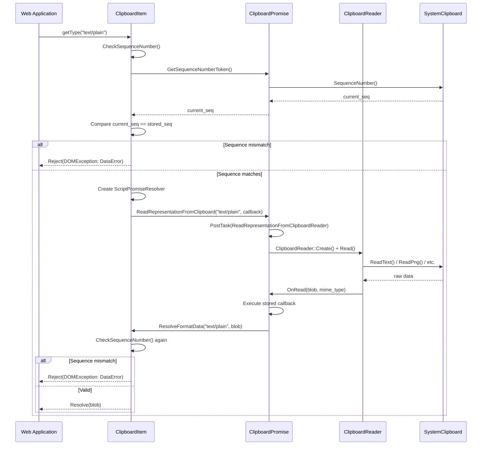
```mermaid
sequenceDiagram
    participant WebApp as Web Application
    participant CI as ClipboardItem
    participant CP as ClipboardPromise
    participant CR as ClipboardReader
    participant SC as SystemClipboard

    WebApp->>CI: getType("text/plain")
    CI->>CI: CheckSequenceNumber()
    CI->>CP: GetSequenceNumberToken()
    CP->>SC: SequenceNumber()
    SC-->>CP: current_seq
    CP-->>CI: current_seq
    CI->>CI: Compare current_seq == stored_seq
    alt Sequence mismatch
        CI-->>WebApp: Reject(DOMException: DataError)
    else Sequence matches
        CI->>CI: Create ScriptPromiseResolver
        CI->>CP: ReadRepresentationFromClipboard("text/plain", callback)
        CP->>CP: PostTask(ReadRepresentationFromClipboardReader)
        CP->>CR: ClipboardReader::Create() + Read()
        CR->>SC: ReadText() / ReadPng() / etc.
        SC-->>CR: raw data
        CR->>CP: OnRead(blob, mime_type)
        CP->>CP: Execute stored callback
        CP->>CI: ResolveFormatData("text/plain", blob)
        CI->>CI: CheckSequenceNumber() again
        alt Sequence mismatch
            CI-->>WebApp: Reject(DOMException: DataError)
        else Valid
            CI-->>WebApp: Resolve(blob)
        end
    end
```

---

### 1.4 `clipboard_promise.h`

**Purpose of changes:** Extends `ClipboardPromise` with new public API for on-demand reading and internal state for lazy mode.

**Key modifications:**
- New public overload `OnRead(Blob*, const String& mime_type)` for per-type callback dispatch.
- New public method `GetSequenceNumberToken()` returning current clipboard sequence number.
- New public method `ReadRepresentationFromClipboard(format, callback)` as the entry point for on-demand reads.
- New private method `ReadRepresentationFromClipboardReader(format)` for creating reader and triggering read.
- New member `clipboard_reader_` (`Member<ClipboardReader>`) to keep the reader alive.
- New member `item_mime_types_` (`HeapVector<String>`) for lazy mode format names.
- New member `read_callbacks_` (`HashMap<String, base::OnceCallback<void(const String&, Blob*)>>`) for per-type callback storage.

**New/Modified Functions:**

| Function | Purpose | Parameters | Returns |
|----------|---------|------------|---------|
| `OnRead(blob, mime_type)` | Dispatches read callback for a specific MIME type | `Blob*`, `const String&` | `void` |
| `GetSequenceNumberToken()` | Gets current clipboard sequence number | — | `absl::uint128` |
| `ReadRepresentationFromClipboard(format, callback)` | Stores callback and posts task to read | `const String&`, `base::OnceCallback` | `void` |
| `ReadRepresentationFromClipboardReader(format)` | Creates ClipboardReader and initiates read | `const String&` | `void` |

---

### 1.5 `clipboard_promise.cc`

**Purpose of changes:** Implements the lazy read flow — deferred data reading, callback dispatch, and modified `ResolveRead` / `OnReadAvailableFormatNames`.

**Key modifications:**

1. **`ReadRepresentationFromClipboard()`**: Stores a per-MIME-type callback in `read_callbacks_` and posts a task to `ReadRepresentationFromClipboardReader()`.

2. **`ReadRepresentationFromClipboardReader()`**: Creates a `ClipboardReader` for the requested format, stores it in `clipboard_reader_`, and calls `Read()`.

3. **`OnRead(Blob*, String)`** (new overload): Looks up the callback by MIME type in `read_callbacks_`, executes it, and erases the entry.

4. **`ResolveRead()`** (modified): In lazy mode, creates a `ClipboardItem` with only MIME types (no data) and passes `this` as the `ClipboardPromise*`.

5. **`OnReadAvailableFormatNames()`** (modified): In lazy mode, only stores format names in `item_mime_types_` and immediately calls `ResolveRead()` instead of `ReadNextRepresentation()`.

6. **`GetSequenceNumberToken()`** (new): Returns `frame->GetSystemClipboard()->SequenceNumber()` with null checks.

7. **`ContextDestroyed()`** (modified): Now also clears `clipboard_reader_`.

8. **`Trace()`** (modified): Traces `clipboard_reader_` and `item_mime_types_`.

9. **`ReadNextRepresentation()`**: Now stores `clipboard_reader` in member `clipboard_reader_` to keep it alive.

**New/Modified Functions:**

| Function | Purpose | Parameters | Returns |
|----------|---------|------------|---------|
| `ReadRepresentationFromClipboard(format, cb)` | Stores callback, posts read task | `String&`, `OnceCallback` | `void` |
| `ReadRepresentationFromClipboardReader(format)` | Creates ClipboardReader, calls Read() | `String&` | `void` |
| `OnRead(blob, mime_type)` | Dispatches per-type callback | `Blob*`, `String&` | `void` |
| `GetSequenceNumberToken()` | Returns clipboard sequence number | — | `uint128` |
| `ResolveRead()` | Modified: creates lazy ClipboardItem in lazy mode | — | `void` |
| `OnReadAvailableFormatNames(names)` | Modified: skips data read in lazy mode | `Vector<String>&` | `void` |

---

### 1.6 `clipboard_reader.cc`

**Purpose of changes:** Routes read completion callbacks to the correct `OnRead` overload based on feature flag.

**Key modifications:**
- All five reader classes (`ClipboardPngReader`, `ClipboardPlainTextReader`, `ClipboardHtmlReader`, `ClipboardSvgReader`, `ClipboardCustomFormatReader`) now branch on `ClipboardReadOnDemandEnabled()`:
  - If enabled: calls `promise_->OnRead(blob, mime_type)` (new overload with MIME type).
  - If disabled: calls `promise_->OnRead(blob)` (original overload).

**Modified Functions:**

| Reader Class | MIME Type Passed |
|-------------|------------------|
| `ClipboardPngReader` | `ui::kMimeTypePng` |
| `ClipboardPlainTextReader` | `ui::kMimeTypePlainText` |
| `ClipboardHtmlReader` | `ui::kMimeTypeHtml` |
| `ClipboardSvgReader` | `ui::kMimeTypeSvg` |
| `ClipboardCustomFormatReader` | `mime_type_` (member) |

---

### 1.7 `mock_clipboard_host.h`

**Purpose of changes:** Adds call-tracking booleans to enable test assertions on which clipboard methods were invoked.

**Key modifications:**
- Three new public accessor methods: `WasReadTextCalled()`, `WasReadHtmlCalled()`, `WasReadAvailableFormatsCalled()`.
- Three new private boolean members: `read_text_called_`, `read_html_called_`, `read_available_formats_called_`.

---

### 1.8 `mock_clipboard_host.cc`

**Purpose of changes:** Sets tracking booleans when clipboard methods are called and resets them in `Reset()`.

**Key modifications:**
- `Reset()`: Resets all three tracking booleans to `false`.
- `ReadText()`: Sets `read_text_called_ = true`.
- `ReadHtml()`: Sets `read_html_called_ = true`.
- `ReadAvailableCustomAndStandardFormats()`: Sets `read_available_formats_called_ = true`.

---

### 1.9 `clipboard_unittest.cc`

**Purpose of changes:** Adds unit tests for lazy read behavior and refactors test setup for better mock access.

**Key modifications:**

1. **New helper class `ClipboardItemGetType`**: A `ThenCallable` that chains onto a `read()` promise to call `getType()` on the first clipboard item.

2. **Refactored `ClipboardTest::SetUp()`**: Creates a `MockClipboardHostProvider` accessible via `mock_clipboard_host()` so tests can inspect call tracking.

3. **Refactored helper methods**: `WritePlainTextToClipboard()` and `WriteHtmlToClipboard()` now use `GetFrame()` instead of taking a `V8TestingScope&`.

4. **New test `ReadOnlyMimeTypesInClipboardRead`**: Verifies that `clipboard.read()` only calls `ReadAvailableCustomAndStandardFormats` and does NOT call `ReadText` or `ReadHtml`.

5. **New test `ClipboardItemGetTypeTest`**: Verifies that `getType("text/plain")` triggers `ReadText` on the mock clipboard host after a lazy `read()`.

**New Tests:**

| Test Name | Purpose |
|-----------|---------|
| `ReadOnlyMimeTypesInClipboardRead` | Verifies lazy loading: `read()` enumerates formats but doesn't read data |
| `ClipboardItemGetTypeTest` | Verifies `getType()` triggers actual data read |

---

### 1.10 `async-clipboard-lazy-read.html`

**Purpose of changes:** Web test verifying clipboard change detection.

**Test scenario:**
1. Write initial text to clipboard.
2. Call `navigator.clipboard.read()` to get `ClipboardItem`.
3. Write different text to clipboard (changing content).
4. Call `getType('text/plain')` on the previously read item.
5. Assert that a `DataError` `DOMException` is thrown.

---

## 2. Class Diagram

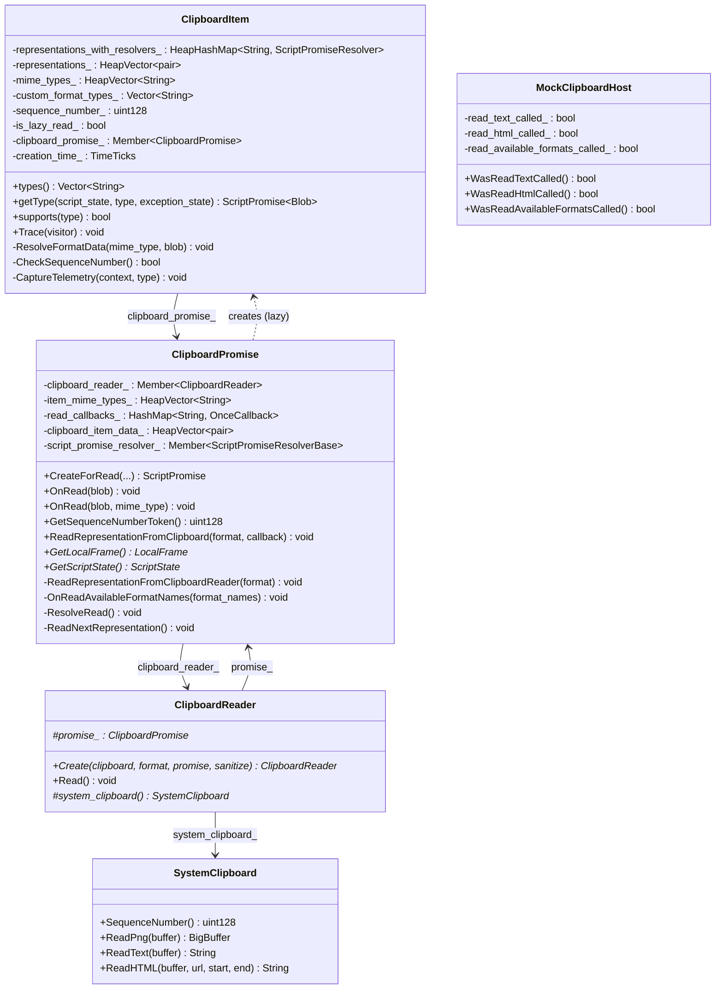
```mermaid
classDiagram
    class ClipboardItem {
        +types() Vector~String~
        +getType(script_state, type, exception_state) ScriptPromise~Blob~
        +supports(type) bool
        +Trace(visitor) void
        -ResolveFormatData(mime_type, blob) void
        -CheckSequenceNumber() bool
        -CaptureTelemetry(context, type) void
        -representations_with_resolvers_ : HeapHashMap~String, ScriptPromiseResolver~
        -representations_ : HeapVector~pair~
        -mime_types_ : HeapVector~String~
        -custom_format_types_ : Vector~String~
        -sequence_number_ : uint128
        -is_lazy_read_ : bool
        -clipboard_promise_ : Member~ClipboardPromise~
        -creation_time_ : TimeTicks
    }

    class ClipboardPromise {
        +CreateForRead(...) ScriptPromise
        +OnRead(blob) void
        +OnRead(blob, mime_type) void
        +GetSequenceNumberToken() uint128
        +ReadRepresentationFromClipboard(format, callback) void
        +GetLocalFrame() LocalFrame*
        +GetScriptState() ScriptState*
        -ReadRepresentationFromClipboardReader(format) void
        -OnReadAvailableFormatNames(format_names) void
        -ResolveRead() void
        -ReadNextRepresentation() void
        -clipboard_reader_ : Member~ClipboardReader~
        -item_mime_types_ : HeapVector~String~
        -read_callbacks_ : HashMap~String, OnceCallback~
        -clipboard_item_data_ : HeapVector~pair~
        -script_promise_resolver_ : Member~ScriptPromiseResolverBase~
    }

    class ClipboardReader {
        +Create(clipboard, format, promise, sanitize) ClipboardReader*
        +Read() void
        #system_clipboard() SystemClipboard*
        #promise_ : ClipboardPromise*
    }

    class SystemClipboard {
        +SequenceNumber() uint128
        +ReadPng(buffer) BigBuffer
        +ReadText(buffer) String
        +ReadHTML(buffer, url, start, end) String
    }

    class MockClipboardHost {
        +WasReadTextCalled() bool
        +WasReadHtmlCalled() bool
        +WasReadAvailableFormatsCalled() bool
        -read_text_called_ : bool
        -read_html_called_ : bool
        -read_available_formats_called_ : bool
    }

    ClipboardItem --> ClipboardPromise : clipboard_promise_
    ClipboardPromise --> ClipboardReader : clipboard_reader_
    ClipboardReader --> SystemClipboard : system_clipboard_
    ClipboardReader --> ClipboardPromise : promise_
    ClipboardPromise ..> ClipboardItem : creates (lazy)
```

---

## 3. State Diagram

### Lazy Read State Machine

```mermaid
stateDiagram-v2
    [*] --> ReadCalled : navigator.clipboard.read()

    ReadCalled --> PermissionCheck : HandleRead()
    PermissionCheck --> FormatEnumeration : Permission GRANTED
    PermissionCheck --> Rejected : Permission DENIED

    FormatEnumeration --> ItemCreated : OnReadAvailableFormatNames()\nStore mime_types, resolve with ClipboardItem

    ItemCreated --> GetTypeCalled : getType(mime_type)

    GetTypeCalled --> SeqCheck1 : CheckSequenceNumber()
    SeqCheck1 --> DataError1 : Sequence mismatch
    SeqCheck1 --> ResolverCreated : Sequence valid

    ResolverCreated --> ReadingData : ReadRepresentationFromClipboard()\nPostTask → ClipboardReader::Read()

    ReadingData --> DataReceived : OnRead(blob, mime_type)\nCallback dispatched

    DataReceived --> SeqCheck2 : ResolveFormatData()\nCheckSequenceNumber()
    SeqCheck2 --> DataError2 : Sequence mismatch
    SeqCheck2 --> Resolved : Sequence valid → Resolve(blob)

    DataError1 --> [*]
    DataError2 --> [*]
    Resolved --> [*]
    Rejected --> [*]
```

### getType() Decision Flow

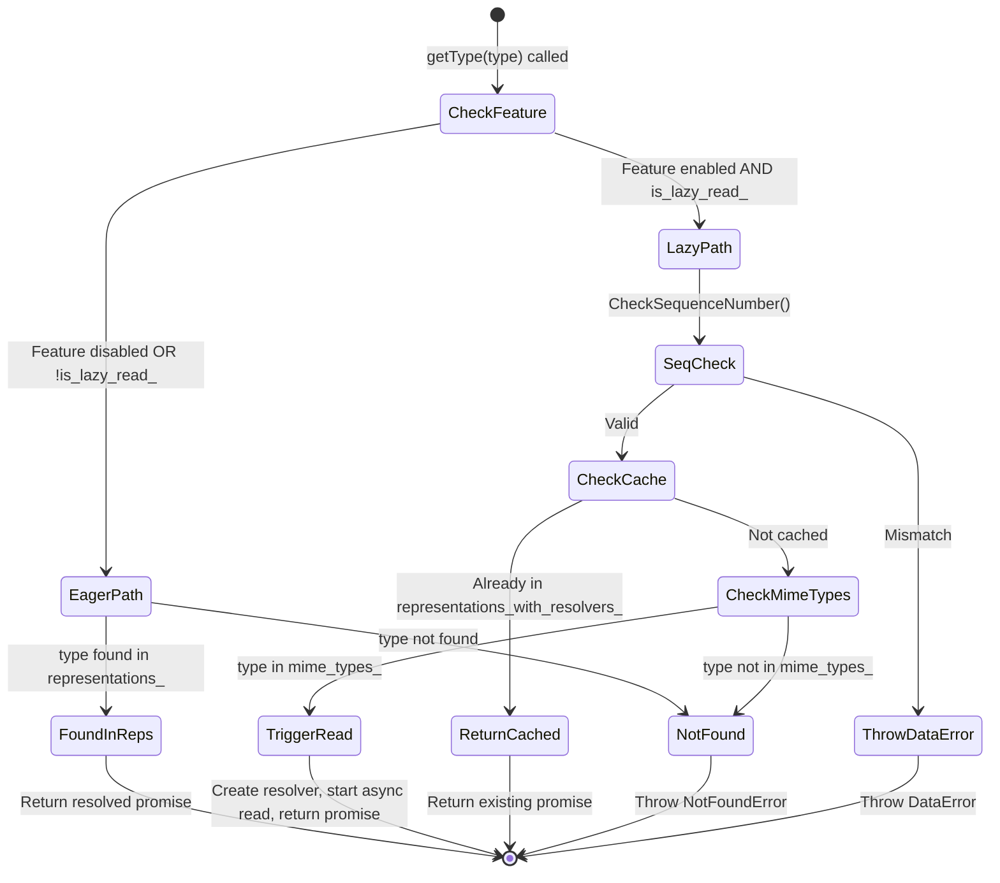
```mermaid
stateDiagram-v2
    [*] --> CheckFeature : getType(type) called

    CheckFeature --> EagerPath : Feature disabled OR !is_lazy_read_
    CheckFeature --> LazyPath : Feature enabled AND is_lazy_read_

    EagerPath --> FoundInReps : type found in representations_
    EagerPath --> NotFound : type not found
    FoundInReps --> [*] : Return resolved promise

    LazyPath --> SeqCheck : CheckSequenceNumber()
    SeqCheck --> ThrowDataError : Mismatch
    SeqCheck --> CheckCache : Valid

    CheckCache --> ReturnCached : Already in representations_with_resolvers_
    CheckCache --> CheckMimeTypes : Not cached

    CheckMimeTypes --> TriggerRead : type in mime_types_
    CheckMimeTypes --> NotFound : type not in mime_types_

    TriggerRead --> [*] : Create resolver, start async read, return promise
    ReturnCached --> [*] : Return existing promise
    NotFound --> [*] : Throw NotFoundError
    ThrowDataError --> [*] : Throw DataError
```

---

## 4. Implementation Concerns

### 4.1 Memory Management

- **ClipboardItem retains ClipboardPromise via `clipboard_promise_`**: This creates a reference cycle risk. `ClipboardItem` (GC-managed) holds a `Member<ClipboardPromise>`, and `ClipboardPromise` creates the `ClipboardItem`. However, since both are garbage-collected via Oilpan and properly traced, the GC can break cycles. ✅ Not a leak risk, but the `ClipboardPromise` will live as long as any `ClipboardItem` referencing it exists.

- **`read_callbacks_` uses `HashMap` (not `HeapHashMap`)**: The callbacks are `base::OnceCallback` which are not GC-traced. This is correct since `OnceCallback` is not a GC type, but it means `ClipboardPromise` must remain alive until all callbacks fire. The `WrapPersistent(this)` in `ReadRepresentationFromClipboard` ensures this.

- **`clipboard_reader_` member**: Now stored as a member, which is good — previously `clipboard_reader` was a local variable in `ReadNextRepresentation()`, but in the lazy path the reader must survive the function scope. However, storing a single `clipboard_reader_` means **only one format can be read at a time** (see concurrency concern below).

### 4.2 Thread Safety

- **Sequence checker assertions**: All critical methods use `DCHECK_CALLED_ON_VALID_SEQUENCE(sequence_checker_)`, but `ReadRepresentationFromClipboardReader()` is missing this check despite being called via `PostTask`. This is likely fine since it's posted to the same clipboard task runner, but the assertion should be added for consistency.

- **Single `clipboard_reader_` for concurrent `getType()` calls**: If a web app calls `getType("text/plain")` and `getType("text/html")` concurrently, the second call will overwrite `clipboard_reader_` before the first completes. The per-MIME-type callback map (`read_callbacks_`) handles dispatch correctly, but the reader reference could be prematurely replaced. **This is a potential bug** — the first reader may be garbage collected while still executing.

### 4.3 Performance Implications

- **Positive**: The primary goal — avoiding unnecessary data reads — is achieved. `clipboard.read()` no longer reads all formats eagerly, which is beneficial when only one format is needed.

- **Negative**: Each `getType()` call now incurs a `PostTask` hop plus a separate clipboard read IPC. For apps reading all formats, this is strictly worse than eager reading (N separate reads vs. one batched read). However, this is mitigated by the feature flag gating.

- **Sequence number check**: `GetSequenceNumberToken()` calls `frame->GetSystemClipboard()->SequenceNumber()` which may be an IPC call. This is called twice per `getType()` (once in `getType()`, once in `ResolveFormatData()`). Consider caching or combining checks.

### 4.4 Maintainability Concerns

- **Extensive feature flag branching**: The code has `RuntimeEnabledFeatures::ClipboardReadOnDemandEnabled()` checks scattered across 4 files (`clipboard_item.cc`, `clipboard_promise.cc`, `clipboard_reader.cc`, and feature registration). When the feature ships to stable, all these branches will need cleanup. Consider extracting strategy patterns or separate classes for eager vs. lazy modes.

- **Dual `OnRead` overloads**: `ClipboardPromise` now has `OnRead(Blob*)` and `OnRead(Blob*, const String&)`. All readers check the feature flag to decide which to call. This is fragile — a new reader could easily call the wrong overload. A single `OnRead` with optional mime_type parameter would be cleaner.

- **`representations_` vs `mime_types_` vs `representations_with_resolvers_`**: Three parallel data structures in `ClipboardItem` for tracking types/data is complex. The eager path uses `representations_`, lazy path uses `mime_types_` + `representations_with_resolvers_`. This could be simplified.

---

## 5. Suggestions for Improvement

### 5.1 Concurrency Safety for `clipboard_reader_`

**Issue:** Single `clipboard_reader_` member can be overwritten by concurrent `getType()` calls.

**Suggestion:** Use a `HeapHashMap<String, Member<ClipboardReader>>` to maintain one reader per in-flight format:
```cpp
HeapHashMap<String, Member<ClipboardReader>> active_readers_;
```

### 5.2 Missing Sequence Checker in `ReadRepresentationFromClipboardReader`

**Issue:** `ReadRepresentationFromClipboardReader()` is called via `PostTask` but lacks a `DCHECK_CALLED_ON_VALID_SEQUENCE`.

**Suggestion:** Add the check for consistency:
```cpp
void ClipboardPromise::ReadRepresentationFromClipboardReader(const String& format) {
  DCHECK_CALLED_ON_VALID_SEQUENCE(sequence_checker_);
  DCHECK(RuntimeEnabledFeatures::ClipboardReadOnDemandEnabled());
  // ...
}
```

### 5.3 Reduce Feature Flag Branching in `clipboard_reader.cc`

**Issue:** Every reader class has an identical `if/else` block checking `ClipboardReadOnDemandEnabled()`.

**Suggestion:** Move the dispatch logic into a helper in the base `ClipboardReader` class:
```cpp
void ClipboardReader::NotifyRead(Blob* blob, const String& mime_type) {
  if (RuntimeEnabledFeatures::ClipboardReadOnDemandEnabled()) {
    promise_->OnRead(blob, mime_type);
  } else {
    promise_->OnRead(blob);
  }
}
```
Then each reader simply calls `NotifyRead(blob, mime_type)`.

### 5.4 Unify `OnRead` Overloads

**Issue:** Two `OnRead` overloads with different behaviors is error-prone.

**Suggestion:** Use a single method signature:
```cpp
void OnRead(Blob* blob, const String& mime_type = String());
```
And dispatch internally based on whether `mime_type` is provided and the feature is enabled.

### 5.5 Double Sequence Number Check

**Issue:** `getType()` checks the sequence number, then `ResolveFormatData()` checks again after the async read. While the double-check is intentional (detect changes during the read), the first check in `getType()` may be redundant if the second always runs.

**Suggestion:** Keep both checks but document clearly why:
```cpp
// First check: fast-fail if clipboard already changed before initiating read.
// Second check: detect changes that occurred during the async read operation.
```
The first check is actually a useful optimization to avoid unnecessary IPC.

### 5.6 Missing Error Handling for Null `ClipboardReader`

**Issue:** In `ReadRepresentationFromClipboardReader()`, if `ClipboardReader::Create()` returns null, `OnRead(nullptr, format)` is called. This will cause `ResolveFormatData(mime_type, nullptr)` which rejects with "Clipboard data has changed". The error message is misleading — the real issue is an unsupported format.

**Suggestion:** Use a more accurate error message for null reader, or pass a distinct error signal:
```cpp
if (!clipboard_reader) {
  // Should reject with a more specific error
  OnRead(nullptr, format);  // Consider different error path
  return;
}
```

### 5.7 Web Test Could Be More Thorough

**Issue:** `async-clipboard-lazy-read.html` only tests the clipboard-change-detection path. It doesn't test the happy path (successful lazy read without clipboard change).

**Suggestion:** Add a second test case:
```javascript
promise_test(async t => {
  await navigator.clipboard.writeText('test content');
  const items = await navigator.clipboard.read();
  const blob = await items[0].getType('text/plain');
  const text = await blob.text();
  assert_equals(text, 'test content');
}, 'Lazy read should return correct data when clipboard has not changed');
```

### 5.8 Test Missing Assertion (Review Comment)

**Issue:** As noted by reviewer Prashant Nevase, `ReadOnlyMimeTypesInClipboardRead` test should also assert `EXPECT_FALSE(mock_clipboard_host()->WasReadHtmlCalled())` explicitly. While currently present, the test should also verify other format reads are not called.

### 5.9 Guard Against Feature-Disabled Code Paths

**Issue:** Reviewers noted concern about whether `ReadRepresentationFromClipboard` and `OnRead(blob, mime_type)` can be called when the feature is disabled. Both have `DCHECK` guards, but a runtime `CHECK` or early return might be safer.

**Suggestion:** For public methods called from other classes, consider runtime guards:
```cpp
void ClipboardPromise::ReadRepresentationFromClipboard(...) {
  CHECK(RuntimeEnabledFeatures::ClipboardReadOnDemandEnabled());
  // ...
}
```

---

## 6. Overall Architecture — Eager vs. Lazy Read Flow

### Eager Read (Feature Disabled)

```
clipboard.read()
  → HandleReadWithPermission()
  → ReadAvailableCustomAndStandardFormats()
  → OnReadAvailableFormatNames()
    → ReadNextRepresentation() [for each format]
      → ClipboardReader::Read() → OnRead(blob)
    → ResolveRead()
      → ClipboardItem(representations with data)
  → getType(type)
    → Look up in representations_ → return pre-resolved promise
```

### Lazy Read (Feature Enabled)

```
clipboard.read()
  → HandleReadWithPermission()
  → ReadAvailableCustomAndStandardFormats()
  → OnReadAvailableFormatNames()
    → Store mime_types only
    → ResolveRead() immediately
      → ClipboardItem(mime_types, NO data, clipboard_promise=this)
  → getType(type)
    → CheckSequenceNumber()
    → Create ScriptPromiseResolver
    → ReadRepresentationFromClipboard(type, callback)
      → PostTask → ClipboardReader::Read() → OnRead(blob, type)
        → callback → ResolveFormatData(type, blob)
          → CheckSequenceNumber() again
          → Resolve promise with blob
```


---

## 📋 Review by **gemini-3-pro-preview**

# Low-Level Design Review

## 1. File-by-File Analysis

#### [third_party/blink/renderer/core/testing/mock_clipboard_host.cc]
**Purpose of changes**: 
Update the mock object to track which clipboard read methods are called. This is essential for verifying that lazy reading actually happens (i.e., data reading methods are NOT called during initial `read()`).

**Key modifications**:
- Added boolean flags (`read_text_called_`, `read_html_called_`, `read_available_formats_called_`).
- initialized flags in constructor/reset.
- Set corresponding flags to `true` in `ReadText`, `ReadHtml`, and `ReadAvailableCustomAndStandardFormats`.

**New/Modified Functions**:
| Function | Purpose | Parameters | Returns |
|----------|---------|------------|---------|
| ReadText | Simulates reading text, now marks `read_text_called_` | clipboard_buffer, callback | void |
| ReadHtml | Simulates reading HTML, now marks `read_html_called_` | clipboard_buffer, callback | void |
| ReadAvailableCustomAndStandardFormats | Simulates reading formats, marks flag | callback | void |

#### [third_party/blink/renderer/core/testing/mock_clipboard_host.h]
**Purpose of changes**: 
Expose the state of the new tracking flags to tests.

**Key modifications**:
- Added getter methods for the tracking flags.
- Added private member variables for the flags.

**New/Modified Functions**:
| Function | Purpose | Parameters | Returns |
|----------|---------|------------|---------|
| WasReadTextCalled | Check if ReadText was called | None | bool |
| WasReadHtmlCalled | Check if ReadHtml was called | None | bool |
| WasReadAvailableFormatsCalled | Check if format enumeration was called | None | bool |

#### [third_party/blink/renderer/modules/clipboard/clipboard_item.cc]
**Purpose of changes**: 
Implement the lazy loading logic within `ClipboardItem`. It now holds a reference to `ClipboardPromise` and triggers data fetching only when `getType()` is called.

**Key modifications**:
- Added a new constructor taking `clipboard_promise` and `is_lazy_read` flag.
- Modified `types()` to return stored `mime_types_` directly when lazy reading is active.
- Modified `getType()` to:
    - Check if the clipboard content has changed (via sequence number).
    - If valid, trigger `clipboard_promise_->ReadRepresentationFromClipboard`.
    - Create and store a `ScriptPromiseResolver` for the pending read.
- Added `ResolveFormatData` to handle the callback from `ClipboardPromise` with the read blob.
- Added `CheckSequenceNumber` to validate clipboard state.

**New/Modified Functions**:
| Function | Purpose | Parameters | Returns |
|----------|---------|------------|---------|
| ClipboardItem (Constructor) | Initialize with promise for lazy read | mime_types, sequence_number, clipboard_promise, is_lazy_read | N/A |
| types | Returns available MIME types | None | Vector<String> |
| getType | Lazily fetches data if not already present | script_state, type, exception_state | ScriptPromise<Blob> |
| ResolveFormatData | Callback for when data is read | mime_type, blob | void |
| CheckSequenceNumber | Verifies clipboard version matches | None | bool |

**Data Flow**:
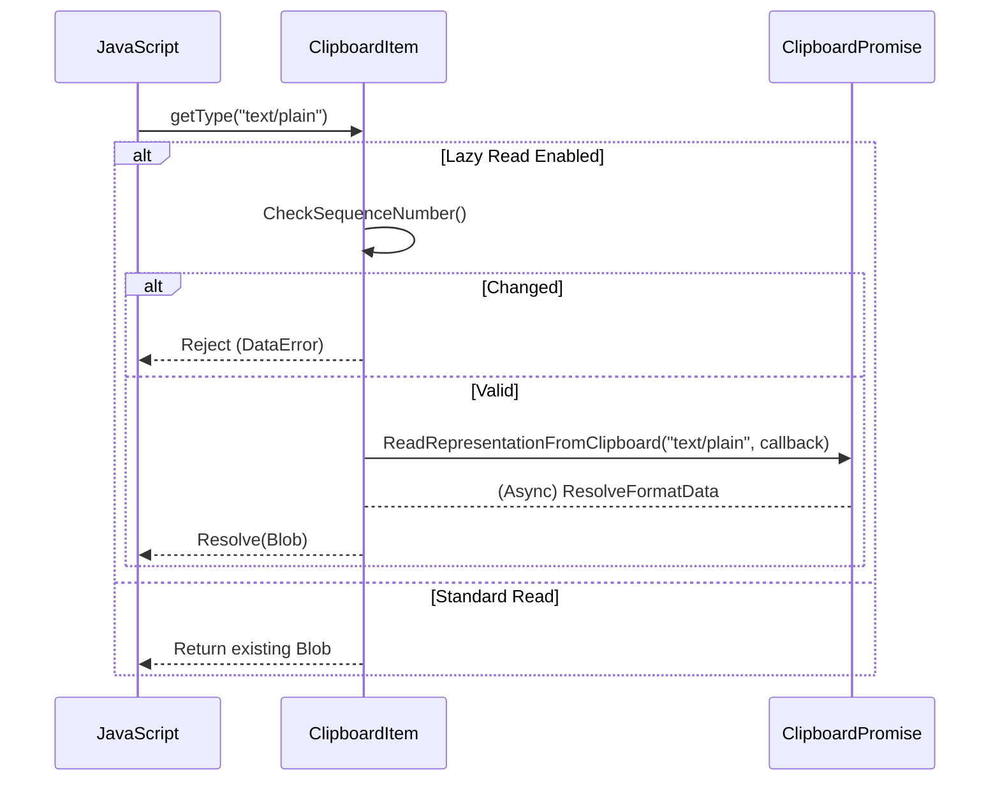
```mermaid
sequenceDiagram
    participant JS as JavaScript
    participant CI as ClipboardItem
    participant CP as ClipboardPromise
    
    JS->>CI: getType("text/plain")
    alt Lazy Read Enabled
        CI->>CI: CheckSequenceNumber()
        alt Changed
            CI-->>JS: Reject (DataError)
        else Valid
            CI->>CP: ReadRepresentationFromClipboard("text/plain", callback)
            CP-->CI: (Async) ResolveFormatData
            CI-->>JS: Resolve(Blob)
        end
    else Standard Read
        CI-->>JS: Return existing Blob
    end
```

#### [third_party/blink/renderer/modules/clipboard/clipboard_item.h]
**Purpose of changes**: 
Update class definition to support lazy reading state and dependencies.

**Key modifications**:
- Added `clipboard_promise_` member to call back for data.
- Added `is_lazy_read_` flag.
- Added `representations_with_resolvers_` to map pending reads to their resolvers.
- Added `mime_types_` to store formats without the data.
- Updated `Trace` method for garbage collection.

#### [third_party/blink/renderer/modules/clipboard/clipboard_promise.cc]
**Purpose of changes**: 
Facilitate on-demand reading of clipboard data. It acts as the bridge between `ClipboardItem` and the system clipboard (via `ClipboardReader`).

**Key modifications**:
- Modified `HandleRead` (via `CreateForRead` flow) to:
    - Only read format names if `ClipboardReadOnDemand` is enabled.
    - Create `ClipboardItem` with just mime types.
- Added `ReadRepresentationFromClipboard` to handle requests from `ClipboardItem`.
- Added `ReadRepresentationFromClipboardReader` to instantiate the correct `ClipboardReader` and execute read.
- Updated `OnRead` to accept `mime_type` and route the blob to the waiting callback.
- Added `GetSequenceNumberToken` to help `ClipboardItem` validate state.

**New/Modified Functions**:
| Function | Purpose | Parameters | Returns |
|----------|---------|------------|---------|
| ReadRepresentationFromClipboard | Initiates a specific format read | format, callback | void |
| ReadRepresentationFromClipboardReader | Creates reader and executes read | format | void |
| OnRead | Handles completed read for a type | blob, mime_type | void |
| GetSequenceNumberToken | Gets current system clipboard version | None | uint128 |

**Data Flow**:
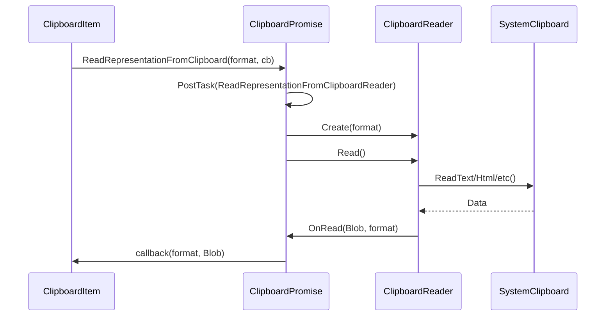
```mermaid
sequenceDiagram
    participant CI as ClipboardItem
    participant CP as ClipboardPromise
    participant CR as ClipboardReader
    participant SC as SystemClipboard
    
    CI->>CP: ReadRepresentationFromClipboard(format, cb)
    CP->>CP: PostTask(ReadRepresentationFromClipboardReader)
    CP->>CR: Create(format)
    CP->>CR: Read()
    CR->>SC: ReadText/Html/etc()
    SC-->>CR: Data
    CR->>CP: OnRead(Blob, format)
    CP->>CI: callback(format, Blob)
```

#### [third_party/blink/renderer/modules/clipboard/clipboard_promise.h]
**Purpose of changes**: 
Header updates for the new methods and members in `ClipboardPromise`.

**Key modifications**:
- Added `read_callbacks_` map to store callbacks for pending reads.
- Added `item_mime_types_` to store formats during initial read.
- Declared new methods `ReadRepresentationFromClipboard`, `GetSequenceNumberToken`, etc.

#### [third_party/blink/renderer/modules/clipboard/clipboard_reader.cc]
**Purpose of changes**: 
Update readers to pass the MIME type back to the promise when reading completes. This allows `ClipboardPromise` to know which specific read request has finished.

**Key modifications**:
- Updated `ClipboardTextReader::OnRead`, `ClipboardHtmlReader::OnRead`, `ClipboardSvgReader::OnRead`, and `ClipboardCustomFormatReader::OnCustomFormatRead`.
- They now call `promise_->OnRead(blob, mime_type)` if the feature is enabled.

#### [third_party/blink/renderer/modules/clipboard/clipboard_unittest.cc]
**Purpose of changes**: 
Add unit tests for the new lazy reading functionality.

**Key modifications**:
- Added `ClipboardItemGetType` helper class for testing `getType`.
- Added `ReadOnlyMimeTypesInClipboardRead` test:
    - Verifies that `navigator.clipboard.read()` DOES NOT call `ReadText` or `ReadHtml`.
    - Verifies it DOES call `ReadAvailableCustomAndStandardFormats`.
- Added `ClipboardItemGetTypeTest`:
    - Verifies that `getType()` triggers the actual read (`ReadText`).

#### [third_party/blink/renderer/platform/runtime_enabled_features.json5]
**Purpose of changes**: 
Define the `ClipboardReadOnDemand` feature flag.

**Key modifications**:
- Added `ClipboardReadOnDemand` with status `test`.

#### [third_party/blink/web_tests/clipboard/async-clipboard/async-clipboard-lazy-read.html]
**Purpose of changes**: 
Integration test to verify the "clipboard change" protection.

**Key modifications**:
- Test case that writes data, calls `read()` (getting the item), writes NEW data, then calls `getType()`.
- Expects `DataError` because the clipboard changed between `read()` and `getType()`.

## 2. Class Diagram

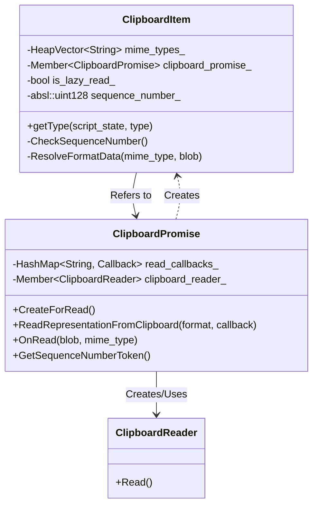
```mermaid
classDiagram
    class ClipboardItem {
        -HeapVector~String~ mime_types_
        -Member~ClipboardPromise~ clipboard_promise_
        -bool is_lazy_read_
        -absl::uint128 sequence_number_
        +getType(script_state, type)
        -CheckSequenceNumber()
        -ResolveFormatData(mime_type, blob)
    }

    class ClipboardPromise {
        -HashMap~String, Callback~ read_callbacks_
        -Member~ClipboardReader~ clipboard_reader_
        +CreateForRead()
        +ReadRepresentationFromClipboard(format, callback)
        +OnRead(blob, mime_type)
        +GetSequenceNumberToken()
    }

    class ClipboardReader {
        +Read()
    }

    ClipboardItem --> ClipboardPromise : Refers to
    ClipboardPromise --> ClipboardReader : Creates/Uses
    ClipboardPromise ..> ClipboardItem : Creates
```

## 3. Implementation Concerns

- **Memory Management**: 
    - `ClipboardItem` holds a reference to `ClipboardPromise`. Since `ClipboardPromise` is an `ExecutionContextLifecycleObserver`, it should be safe, but a cycle might exist if `ClipboardPromise` strongly holds `ClipboardItem` (it seems to hold them in `clipboard_item_data_` temporarily, but hands them off to the resolver).
    - `ClipboardPromise` holding `read_callbacks_` which bind `ClipboardItem::ResolveFormatData` creates a temporary reference loop `ClipboardItem -> ClipboardPromise -> Callback -> ClipboardItem`. This should be broken when the callback is executed.

- **Thread Safety**: 
    - `ClipboardPromise` checks `sequence_checker_`.
    - `ReadRepresentationFromClipboard` posts a task to `TaskType::kClipboard`. This ensures clipboard operations happen on the correct thread.
    - `read_callbacks_` map access seems confined to the main thread (or wherever `ClipboardPromise` lives), but `OnRead` calls come from `ClipboardReader`.

- **Race Conditions**: 
    - Multiple `getType()` calls for the same format? `representations_with_resolvers_` map in `ClipboardItem` handles this by returning the existing promise.
    - `ClipboardPromise` stores `read_callbacks_`. If `ReadRepresentationFromClipboard` is called twice for the same format before the first finishes? The current implementation in `ClipboardItem` prevents this by caching the resolver.

- **Clipboard Change Handling**:
    - The code explicitly checks `sequence_number_`. If the clipboard changes between `read()` and `getType()`, it correctly rejects. This is a crucial correctness feature for lazy loading.

## 4. Suggestions for Improvement

- **Error Handling in Reader Creation**: 
    - In `ReadRepresentationFromClipboardReader`, if `ClipboardReader::Create` returns null, it calls `OnRead(nullptr, format)`. `OnRead` then runs the callback with `nullptr`. `ClipboardItem::ResolveFormatData` checks for `nullptr` and rejects. This flow is correct but relies on `nullptr` checks propagating.

- **Feature Flag Cleanup**:
    - The code is heavily IF-DEF'd with `RuntimeEnabledFeatures::ClipboardReadOnDemandEnabled()`. Once the feature is stable, a significant cleanup will be needed to remove the "eager read" paths.

- **Complexity**:
    - `ClipboardPromise` is becoming quite complex, acting as both a factory for the initial read and a service for subsequent lazy reads. It might be worth separating the "Lazy Reader Service" aspect into a dedicated class if logic grows.

- **Sequence Number Type**:
    - `absl::uint128` is used. Ensure this is consistently supported across all platforms where this code runs.


---

## 📋 Review by **gpt-5.3-codex**

# Low-Level Design Review: CL 6978530 - [Clipboard] Implementation of lazy read

## 1. File-by-File Analysis

#### `third_party/blink/renderer/core/testing/mock_clipboard_host.cc`
**Purpose of changes**: Add call-tracking hooks so tests can verify lazy-read behavior (type enumeration without eager payload reads).

**Key modifications**:
- `Reset()` now clears three tracking flags.
- `ReadText`, `ReadHtml`, and `ReadAvailableCustomAndStandardFormats` now set call flags when invoked.
- No behavior change to returned clipboard data.

**New/Modified Functions**:
| Function | Purpose | Parameters | Returns |
|----------|---------|------------|---------|
| `void Reset()` | Resets clipboard state plus method-call tracking | none | `void` |
| `void ReadText(...)` | Marks text read invocation and returns text | `mojom::ClipboardBuffer`, callback | `void` |
| `void ReadHtml(...)` | Marks HTML read invocation and returns HTML | `mojom::ClipboardBuffer`, callback | `void` |
| `void ReadAvailableCustomAndStandardFormats(...)` | Marks format-enumeration invocation and returns formats | callback | `void` |

**Data Flow**:
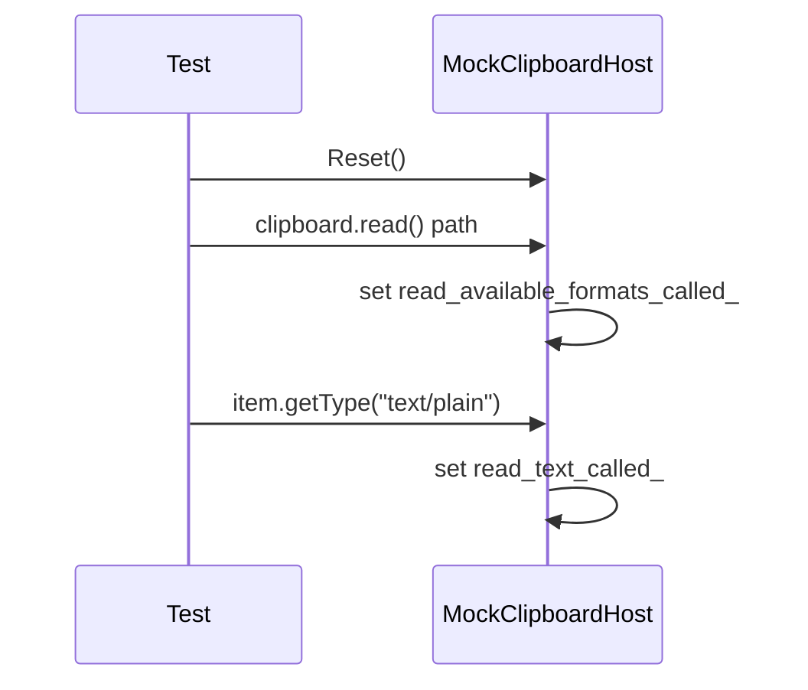
```mermaid
sequenceDiagram
    participant Test
    participant MockClipboardHost
    Test->>MockClipboardHost: Reset()
    Test->>MockClipboardHost: clipboard.read() path
    MockClipboardHost->>MockClipboardHost: set read_available_formats_called_
    Test->>MockClipboardHost: item.getType("text/plain")
    MockClipboardHost->>MockClipboardHost: set read_text_called_
```

**Logic/Data/API/Error/Edge Notes**:
- Data: adds three `bool` flags.
- API: unchanged Mojo interface; test-only inspection behavior changed.
- Error handling: none required.
- Edge: if tests forget `Reset()`, stale flags can cause false positives.

---

#### `third_party/blink/renderer/core/testing/mock_clipboard_host.h`
**Purpose of changes**: Expose call-tracking state for unit assertions.

**Key modifications**:
- Added public getters: `WasReadTextCalled()`, `WasReadHtmlCalled()`, `WasReadAvailableFormatsCalled()`.
- Added private flag fields initialized to `false`.

**New/Modified Functions**:
| Function | Purpose | Parameters | Returns |
|----------|---------|------------|---------|
| `bool WasReadTextCalled() const` | Query text-read invocation | none | `bool` |
| `bool WasReadHtmlCalled() const` | Query html-read invocation | none | `bool` |
| `bool WasReadAvailableFormatsCalled() const` | Query format-read invocation | none | `bool` |

**Data Flow**:
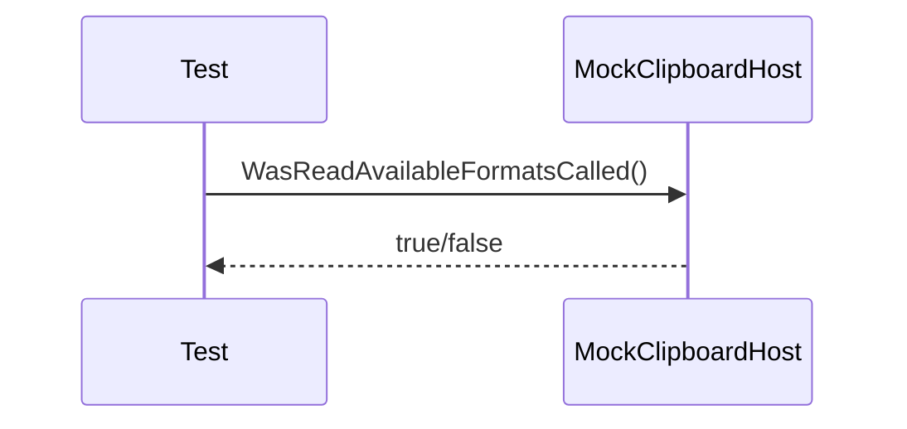
```mermaid
sequenceDiagram
    participant Test
    participant MockClipboardHost
    Test->>MockClipboardHost: WasReadAvailableFormatsCalled()
    MockClipboardHost-->>Test: true/false
```

**Logic/Data/API/Error/Edge Notes**:
- Data: flag state now part of mock observable surface.
- API: new test helper methods (public).
- Edge: not thread-safe by design (acceptable for single-threaded test harness).

---

#### `third_party/blink/renderer/modules/clipboard/clipboard_item.cc`
**Purpose of changes**: Add lazy-read `ClipboardItem` mode where payload blobs are fetched only on `getType()` and validated against clipboard sequence changes.

**Key modifications**:
- Added constructor for lazy items (`mime_types`, `sequence_number`, owning `ClipboardPromise`, `is_lazy_read`).
- `types()` now branches: lazy mode returns stored MIME type list; eager mode keeps old representation-derived behavior.
- Added `ResolveFormatData()` to resolve/reject per-type promise after async read callback.
- `getType()` now supports lazy mode with:
  - pre-read sequence check,
  - per-type resolver caching (`representations_with_resolvers_`),
  - async delegation to `ClipboardPromise::ReadRepresentationFromClipboard()`.
- Added `CheckSequenceNumber()` helper and tracing for new GC-managed members.

**New/Modified Functions**:
| Function | Purpose | Parameters | Returns |
|----------|---------|------------|---------|
| `ClipboardItem(const HeapVector<String>&, absl::uint128, ClipboardPromise*, bool)` | Construct lazy-read item from MIME list | mime types, sequence token, promise ptr, lazy flag | ctor |
| `Vector<String> types() const` | Return item MIME types in eager/lazy mode | none | `Vector<String>` |
| `void ResolveFormatData(const String&, Blob*)` | Complete cached `getType()` promise for a MIME type | mime type, blob/null | `void` |
| `ScriptPromise<Blob> getType(...)` | Return blob promise for requested type (lazy/eager paths) | script state, type, exception state | `ScriptPromise<Blob>` |
| `bool CheckSequenceNumber()` | Verify clipboard token unchanged | none | `bool` |

**Data Flow**:
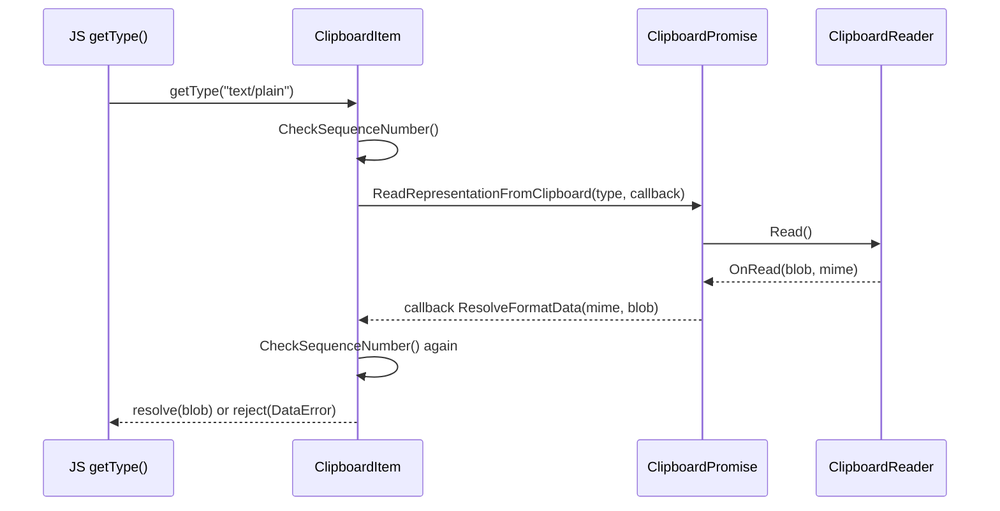
```mermaid
sequenceDiagram
    participant JS as JS getType()
    participant Item as ClipboardItem
    participant Promise as ClipboardPromise
    participant Reader as ClipboardReader
    JS->>Item: getType("text/plain")
    Item->>Item: CheckSequenceNumber()
    Item->>Promise: ReadRepresentationFromClipboard(type, callback)
    Promise->>Reader: Read()
    Reader-->>Promise: OnRead(blob, mime)
    Promise-->>Item: callback ResolveFormatData(mime, blob)
    Item->>Item: CheckSequenceNumber() again
    Item-->>JS: resolve(blob) or reject(DataError)
```

**Logic/Data/API/Error/Edge Notes**:
- Data structures: new `HeapHashMap<String, ScriptPromiseResolver<Blob>>`, `HeapVector<String> mime_types_`, `Member<ClipboardPromise>`.
- API: new constructor overload (used by `ClipboardPromise`).
- Error handling: rejects `DataError` when blob missing or sequence changed; throws `NotFoundError` when MIME absent.
- Edge: resolver map entries are retained for item lifetime; repeated `getType()` returns same promise (good dedupe, but keeps memory until GC).

---

#### `third_party/blink/renderer/modules/clipboard/clipboard_item.h`
**Purpose of changes**: Define lazy-read item state and helper methods.

**Key modifications**:
- Added forward declarations for `ClipboardPromise` and `ScriptPromiseResolver`.
- Added lazy constructor signature.
- Added private helpers `ResolveFormatData()` and `CheckSequenceNumber()`.
- Added new fields for MIME list, resolver map, lazy-mode flag, and source promise pointer.

**New/Modified Functions**:
| Function | Purpose | Parameters | Returns |
|----------|---------|------------|---------|
| `ClipboardItem(const HeapVector<String>&, absl::uint128, ClipboardPromise*, bool)` | Public lazy constructor | see signature | ctor |
| `void ResolveFormatData(const String&, Blob*)` | Resolve/reject deferred MIME read | mime type, blob | `void` |
| `bool CheckSequenceNumber()` | Validate clipboard token | none | `bool` |

**Data Flow**:
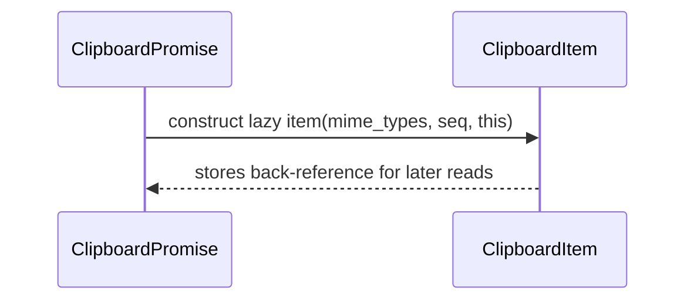
```mermaid
sequenceDiagram
    participant Promise as ClipboardPromise
    participant Item as ClipboardItem
    Promise->>Item: construct lazy item(mime_types, seq, this)
    Item-->>Promise: stores back-reference for later reads
```

**Logic/Data/API/Error/Edge Notes**:
- Data/API changes are structural but central to lazy-read contract.
- Error behavior is implemented in `.cc`; header just wires contracts.
- Edge: tighter coupling (`ClipboardItem` -> `ClipboardPromise`) introduces lifecycle dependency (mitigated by Blink GC tracing).

---

#### `third_party/blink/renderer/modules/clipboard/clipboard_promise.cc`
**Purpose of changes**: Shift read path from eager payload fetch to MIME enumeration + on-demand format reads when feature enabled.

**Key modifications**:
- Added `ReadRepresentationFromClipboardReader(format)` helper to create/read via `ClipboardReader` for one MIME type.
- Added `ReadRepresentationFromClipboard(format, callback)` to queue per-MIME one-shot callbacks in `read_callbacks_`.
- `ResolveRead()` now has dual path:
  - lazy mode: create `ClipboardItem` with MIME list + sequence token + promise back-reference,
  - eager mode: existing full data materialization.
- `HandleReadAvailableFormatNames()` now stores only MIME names in lazy mode and resolves immediately (no eager reads).
- Added `OnRead(Blob*, const String&)` overload to route async reader completion to MIME-specific callback.
- Added `GetSequenceNumberToken()` to expose clipboard sequence for stale-data checks.
- Lifecycle/GC updates: clear and trace `clipboard_reader_`; trace `item_mime_types_`.

**New/Modified Functions**:
| Function | Purpose | Parameters | Returns |
|----------|---------|------------|---------|
| `void ReadRepresentationFromClipboardReader(const String&)` | Build reader for a single MIME type and start read | format | `void` |
| `void ReadRepresentationFromClipboard(const String&, base::OnceCallback<void(const String&, Blob*)>)` | Register callback and post clipboard read task | format, callback | `void` |
| `void ResolveRead()` | Finalize `clipboard.read()` promise with lazy/eager item construction | none | `void` |
| `void HandleReadAvailableFormatNames(const Vector<String>&)` | Filter supported types and initialize lazy/eager storage | format names | `void` |
| `void OnRead(Blob*, const String&)` | Dispatch result to MIME callback map | blob, mime type | `void` |
| `absl::uint128 GetSequenceNumberToken()` | Return current clipboard sequence token | none | `absl::uint128` |
| `void ContextDestroyed()` | Reject and clear resources including reader | none | `void` |

**Data Flow**:
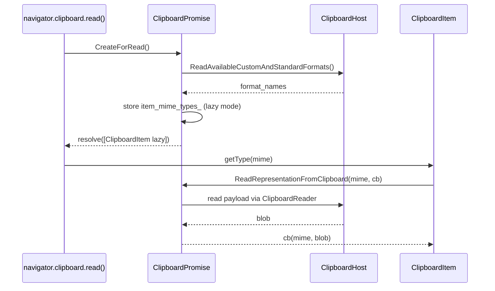
```mermaid
sequenceDiagram
    participant JS as navigator.clipboard.read()
    participant CP as ClipboardPromise
    participant Host as ClipboardHost
    participant Item as ClipboardItem
    JS->>CP: CreateForRead()
    CP->>Host: ReadAvailableCustomAndStandardFormats()
    Host-->>CP: format_names
    CP->>CP: store item_mime_types_ (lazy mode)
    CP-->>JS: resolve([ClipboardItem lazy])
    JS->>Item: getType(mime)
    Item->>CP: ReadRepresentationFromClipboard(mime, cb)
    CP->>Host: read payload via ClipboardReader
    Host-->>CP: blob
    CP-->>Item: cb(mime, blob)
```

**Logic/Data/API/Error/Edge Notes**:
- Data structures: new `item_mime_types_`, `read_callbacks_`, and persistent `clipboard_reader_` member.
- API: exposes `ReadRepresentationFromClipboard()` and `GetSequenceNumberToken()` for `ClipboardItem`.
- Error handling: if no execution context/reader, callback receives `nullptr` blob; downstream rejects `DataError`.
- Edge: multiple concurrent MIME reads rely on callback-map correctness; no callback means silent drop in `OnRead`.

---

#### `third_party/blink/renderer/modules/clipboard/clipboard_promise.h`
**Purpose of changes**: Declare lazy-read support API and state in `ClipboardPromise`.

**Key modifications**:
- Added forward declarations (`Blob`, `ClipboardItem`).
- Added `OnRead(Blob*, const String&)` overload.
- Added `GetSequenceNumberToken()` and `ReadRepresentationFromClipboard(...)` declarations.
- Added private helper declaration `ReadRepresentationFromClipboardReader(...)`.
- Added members: `clipboard_reader_`, `item_mime_types_`, `read_callbacks_`.

**New/Modified Functions**:
| Function | Purpose | Parameters | Returns |
|----------|---------|------------|---------|
| `void OnRead(Blob*, const String&)` | MIME-aware read completion path | blob, mime | `void` |
| `absl::uint128 GetSequenceNumberToken()` | Expose clipboard sequence token | none | `absl::uint128` |
| `void ReadRepresentationFromClipboard(const String&, base::OnceCallback<void(const String&, Blob*)>)` | Entry point for item-triggered deferred reads | format, callback | `void` |
| `void ReadRepresentationFromClipboardReader(const String&)` | Internal reader creation helper | format | `void` |

**Data Flow**:
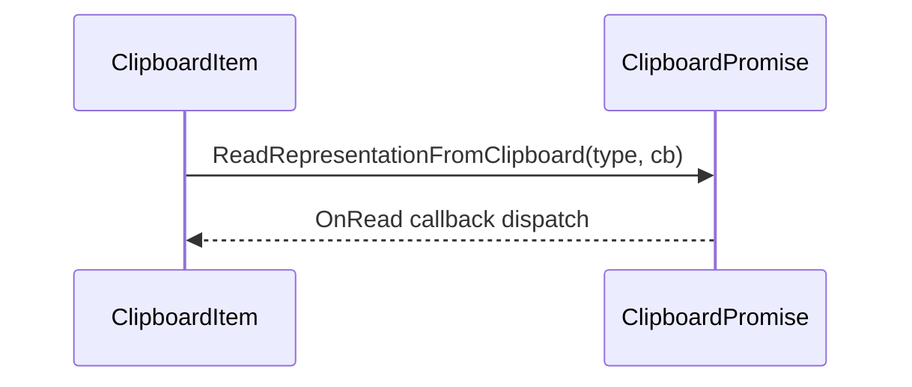
```mermaid
sequenceDiagram
    participant Item as ClipboardItem
    participant Promise as ClipboardPromise
    Item->>Promise: ReadRepresentationFromClipboard(type, cb)
    Promise-->>Item: OnRead callback dispatch
```

**Logic/Data/API/Error/Edge Notes**:
- API surface expanded specifically for `ClipboardItem` integration.
- Edge: callback map keyed by MIME type assumes one in-flight callback per type.

---

#### `third_party/blink/renderer/modules/clipboard/clipboard_reader.cc`
**Purpose of changes**: Route read completion through MIME-aware callback path when lazy-read feature is enabled.

**Key modifications**:
- Updated all reader callbacks (PNG, plain text, HTML, SVG, custom format) to call `promise_->OnRead(blob, mime_type)` under feature flag.
- Preserved old `promise_->OnRead(blob)` path when feature disabled.

**New/Modified Functions**:
| Function | Purpose | Parameters | Returns |
|----------|---------|------------|---------|
| `OnRead*` callback bodies in reader implementations | Choose `OnRead` overload based on runtime feature | blob data/mime context | `void` |

**Data Flow**:
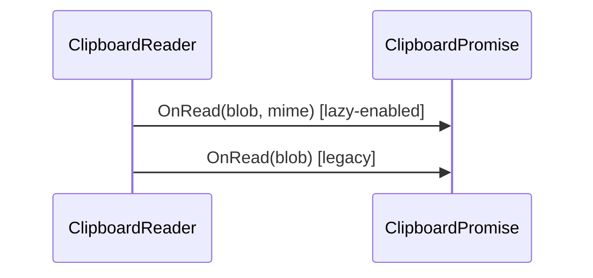
```mermaid
sequenceDiagram
    participant Reader as ClipboardReader
    participant Promise as ClipboardPromise
    Reader->>Promise: OnRead(blob, mime) [lazy-enabled]
    Reader->>Promise: OnRead(blob) [legacy]
```

**Logic/Data/API/Error/Edge Notes**:
- No new data structure; pure dispatch behavior change.
- Error handling still represented as `blob == nullptr` propagation.
- Edge: MIME mismatch bug in reader would now break callback-map lookup, not just ordering.

---

#### `third_party/blink/renderer/modules/clipboard/clipboard_unittest.cc`
**Purpose of changes**: Add unit coverage for lazy-read contract and `getType()`-triggered deferred reads.

**Key modifications**:
- Added include for clipboard Mojo types and helper `ClipboardItemGetType` then-callable.
- `ClipboardTest::SetUp()` now installs custom mock clipboard host provider to access call-tracking mock.
- Simplified write helpers to use `GetFrame()` directly.
- Added `ReadOnlyMimeTypesInClipboardRead` test validating only format enumeration occurs during `clipboard.read()`.
- Added `ClipboardItemGetTypeTest` ensuring deferred `getType("text/plain")` triggers actual read (`WasReadTextCalled()`).

**New/Modified Functions**:
| Function | Purpose | Parameters | Returns |
|----------|---------|------------|---------|
| `void ClipboardTest::SetUp()` | Install accessible `MockClipboardHostProvider` | none | `void` |
| `MockClipboardHost* mock_clipboard_host()` | Access tracking mock | none | pointer |
| `String ClipboardItemGetType::React(...)` | Calls `getType()` on first item and returns success marker | script state, clipboard items | `String` |
| `TEST_F(..., ReadOnlyMimeTypesInClipboardRead)` | Verify lazy read does not eagerly read payload | test setup | n/a |
| `TEST_F(..., ClipboardItemGetTypeTest)` | Verify `getType()` triggers deferred read | test setup | n/a |

**Data Flow**:
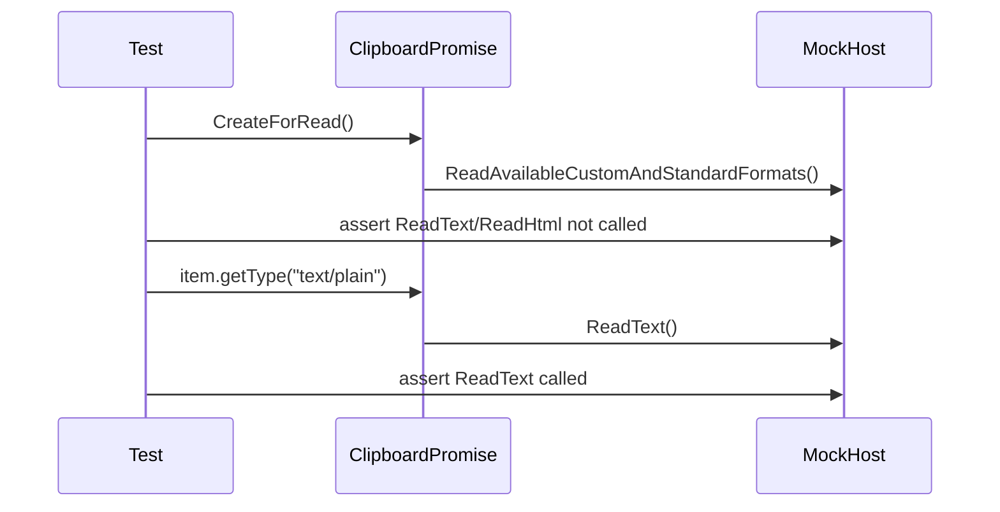
```mermaid
sequenceDiagram
    participant Test
    participant ClipboardPromise
    participant MockHost
    Test->>ClipboardPromise: CreateForRead()
    ClipboardPromise->>MockHost: ReadAvailableCustomAndStandardFormats()
    Test->>MockHost: assert ReadText/ReadHtml not called
    Test->>ClipboardPromise: item.getType("text/plain")
    ClipboardPromise->>MockHost: ReadText()
    Test->>MockHost: assert ReadText called
```

**Logic/Data/API/Error/Edge Notes**:
- Error handling in helper returns empty string when promise empty/exception thrown.
- Edge: current tests focus single-item clipboard and one MIME request; concurrent `getType()` multi-MIME races are not covered.

---

#### `third_party/blink/renderer/platform/runtime_enabled_features.json5`
**Purpose of changes**: Gate new lazy-read behavior behind runtime flag.

**Key modifications**:
- Added feature entry: `ClipboardReadOnDemand` with `status: "test"`.

**New/Modified Functions**:
| Function | Purpose | Parameters | Returns |
|----------|---------|------------|---------|
| n/a | Runtime feature configuration only | n/a | n/a |

**Data Flow**:
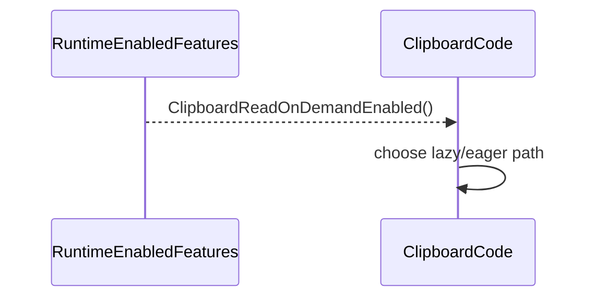
```mermaid
sequenceDiagram
    participant RuntimeFlag as RuntimeEnabledFeatures
    participant ClipboardCode
    RuntimeFlag-->>ClipboardCode: ClipboardReadOnDemandEnabled()
    ClipboardCode->>ClipboardCode: choose lazy/eager path
```

**Logic/Data/API/Error/Edge Notes**:
- API behavior becomes bifurcated by flag.
- Edge: partial rollout can hide issues if tests run without enabling the flag.

---

#### `third_party/blink/web_tests/clipboard/async-clipboard/async-clipboard-lazy-read.html`
**Purpose of changes**: Add web-platform style regression test validating stale clipboard detection for lazy `getType()`.

**Key modifications**:
- New async test grants read/write clipboard permissions.
- Writes initial text, calls `navigator.clipboard.read()`, mutates clipboard, then asserts `item.getType('text/plain')` rejects `DataError`.

**New/Modified Functions**:
| Function | Purpose | Parameters | Returns |
|----------|---------|------------|---------|
| `promise_test(async t => { ... })` | End-to-end stale-data rejection verification | test context `t` | Promise |

**Data Flow**:
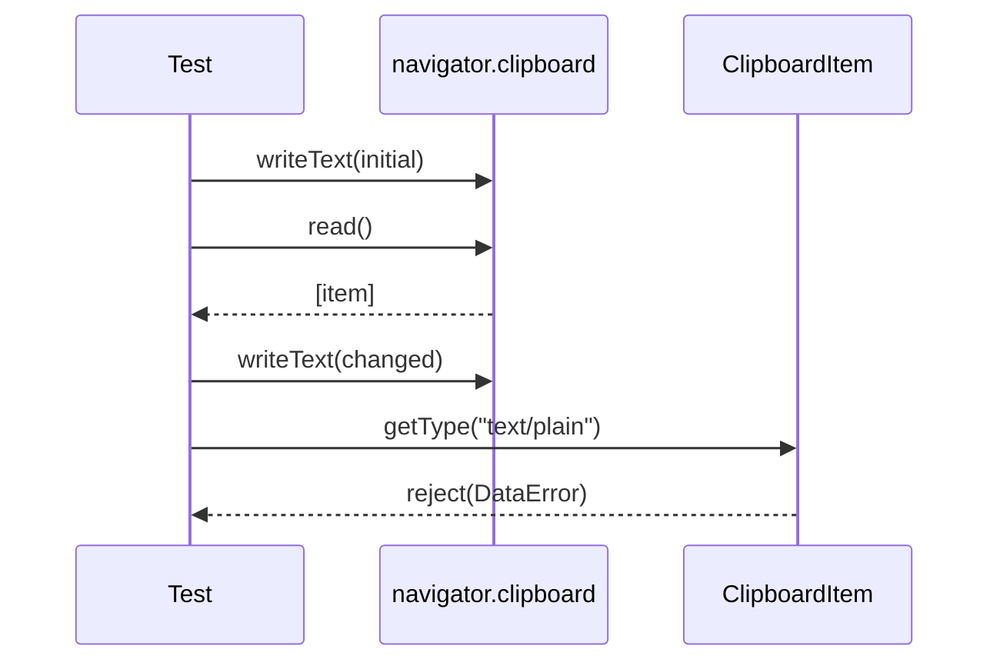
```mermaid
sequenceDiagram
    participant Test
    participant Navigator as navigator.clipboard
    participant Item as ClipboardItem
    Test->>Navigator: writeText(initial)
    Test->>Navigator: read()
    Navigator-->>Test: [item]
    Test->>Navigator: writeText(changed)
    Test->>Item: getType("text/plain")
    Item-->>Test: reject(DataError)
```

**Logic/Data/API/Error/Edge Notes**:
- Error handling expectation is explicit (`promise_rejects_dom(..., 'DataError', ...)`).
- Edge: covers text path only; HTML/custom formats not explicitly validated here.

## 2. Class Diagram

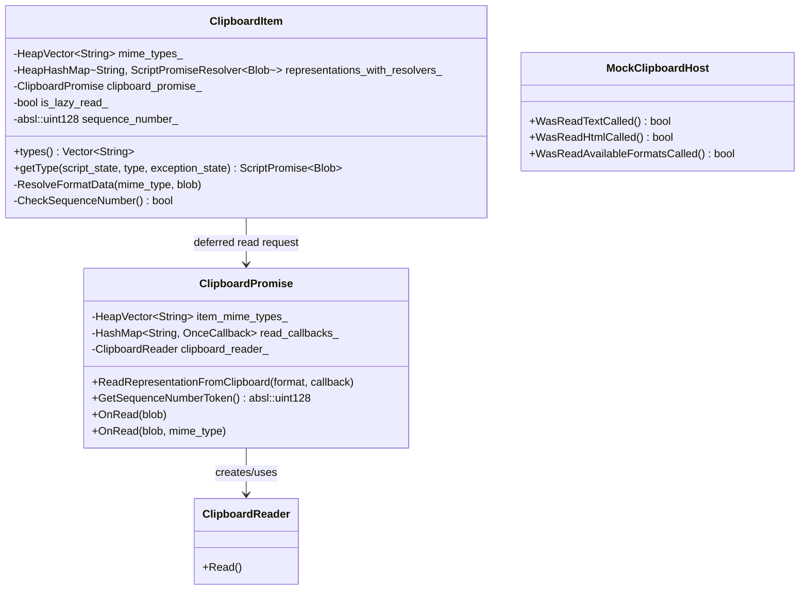
```mermaid
classDiagram
    class ClipboardPromise {
        +ReadRepresentationFromClipboard(format, callback)
        +GetSequenceNumberToken() absl::uint128
        +OnRead(blob)
        +OnRead(blob, mime_type)
        -HeapVector~String~ item_mime_types_
        -HashMap~String, OnceCallback~ read_callbacks_
        -ClipboardReader clipboard_reader_
    }

    class ClipboardItem {
        +types() Vector~String~
        +getType(script_state, type, exception_state) ScriptPromise~Blob~
        -ResolveFormatData(mime_type, blob)
        -CheckSequenceNumber() bool
        -HeapVector~String~ mime_types_
        -HeapHashMap~String, ScriptPromiseResolver~Blob~~ representations_with_resolvers_
        -ClipboardPromise clipboard_promise_
        -bool is_lazy_read_
        -absl::uint128 sequence_number_
    }

    class ClipboardReader {
        +Read()
    }

    class MockClipboardHost {
        +WasReadTextCalled() bool
        +WasReadHtmlCalled() bool
        +WasReadAvailableFormatsCalled() bool
    }

    ClipboardItem --> ClipboardPromise : deferred read request
    ClipboardPromise --> ClipboardReader : creates/uses
```

## 3. State Diagram

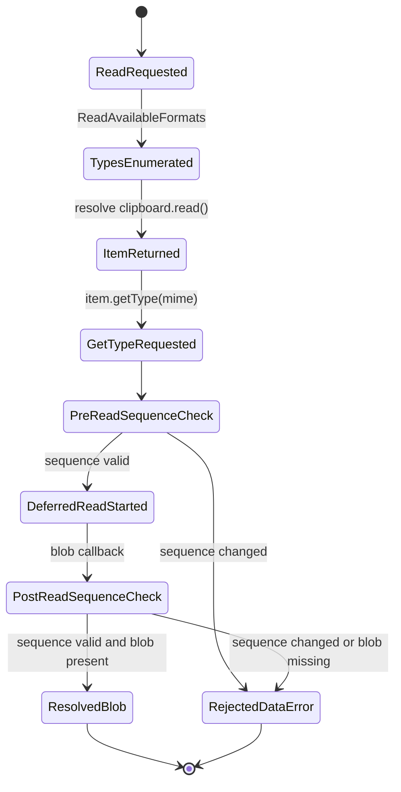
```mermaid
stateDiagram-v2
    [*] --> ReadRequested
    ReadRequested --> TypesEnumerated : ReadAvailableFormats
    TypesEnumerated --> ItemReturned : resolve clipboard.read()
    ItemReturned --> GetTypeRequested : item.getType(mime)
    GetTypeRequested --> PreReadSequenceCheck
    PreReadSequenceCheck --> RejectedDataError : sequence changed
    PreReadSequenceCheck --> DeferredReadStarted : sequence valid
    DeferredReadStarted --> PostReadSequenceCheck : blob callback
    PostReadSequenceCheck --> ResolvedBlob : sequence valid and blob present
    PostReadSequenceCheck --> RejectedDataError : sequence changed or blob missing
    ResolvedBlob --> [*]
    RejectedDataError --> [*]
```

## 4. Implementation Concerns

- **Memory management**: `representations_with_resolvers_` and `read_callbacks_` can accumulate entries until item/promise GC; long-lived pages with many MIME requests may retain extra state.
- **Thread safety/ordering**: callback routing depends on MIME-keyed map and task sequencing; correctness assumes callbacks arrive on expected sequence and with accurate MIME identifiers.
- **Performance**: lazy read reduces upfront clipboard data transfer and parsing, but adds per-`getType()` async overhead and potentially repeated sequence checks.
- **Maintainability**: dual-mode (feature ON/OFF) branching across `ClipboardItem`, `ClipboardPromise`, and `ClipboardReader` increases cognitive load and testing matrix.

## 5. Suggestions for Improvement

- Add dedicated tests for concurrent `getType()` calls across multiple MIME types (including same MIME reentry and mixed success/failure).
- Consider explicit cleanup of fulfilled/rejected resolver entries in `ClipboardItem` to reduce retained heap objects.
- Add targeted test coverage for HTML/SVG/custom-format lazy reads and stale-data rejection, not just `text/plain`.
- Consider consolidating feature-gated dispatch in `ClipboardReader` through a small helper to reduce repetitive branch blocks.


---

## 🔀 Cross-Model Summary

This document merges reviews from **3** models: claude-opus-4.6-fast, gemini-3-pro-preview, gpt-5.3-codex.

### Model Coverage

| Model | Contributed |
|-------|------------|
| claude-opus-4.6-fast | ✅ Yes |
| gemini-3-pro-preview | ✅ Yes |
| gpt-5.3-codex | ✅ Yes |
