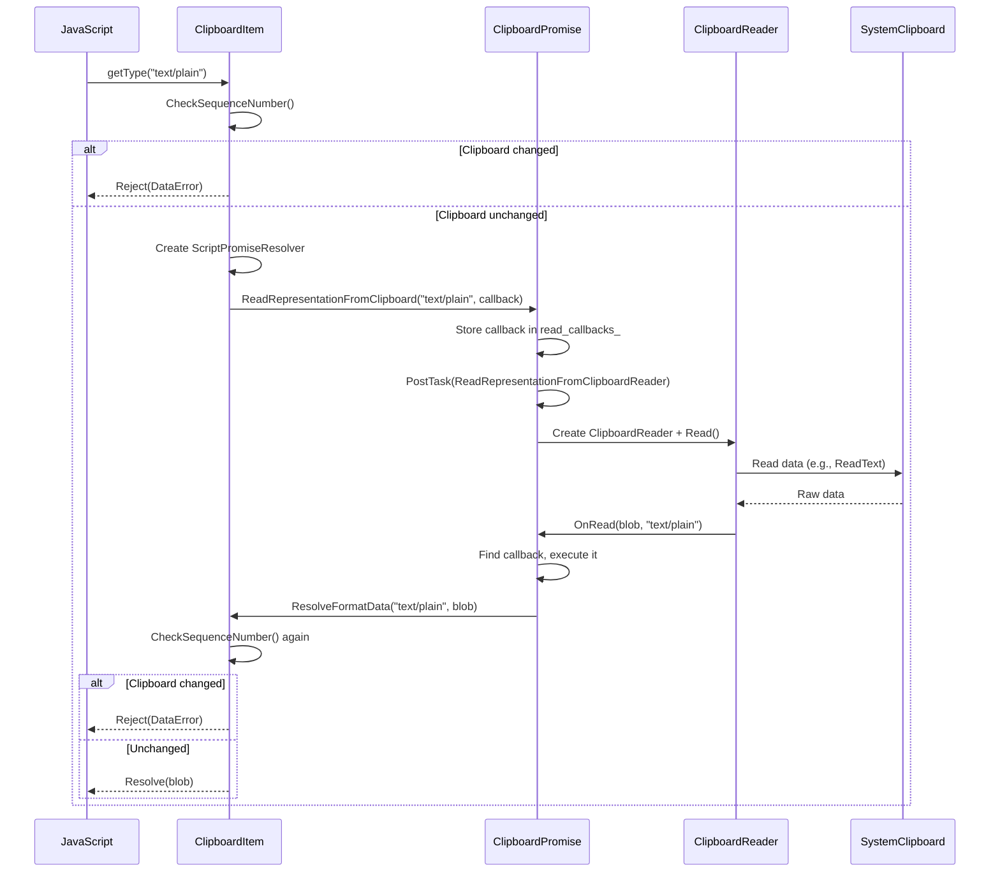
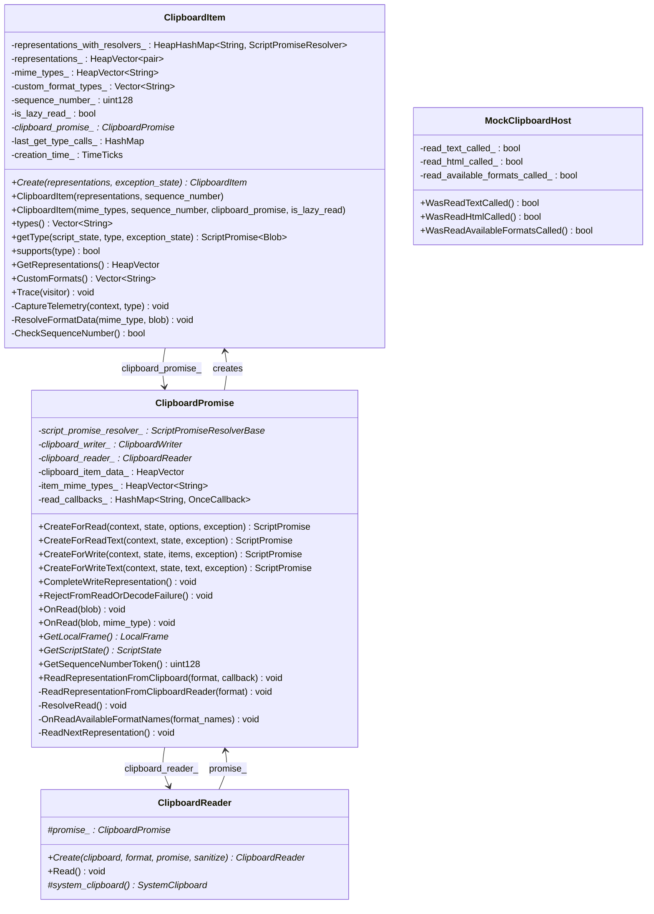
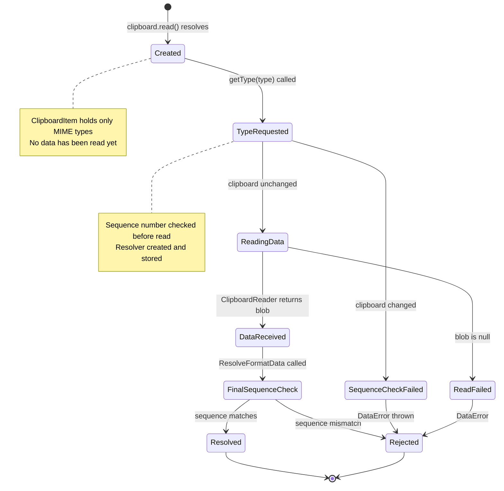
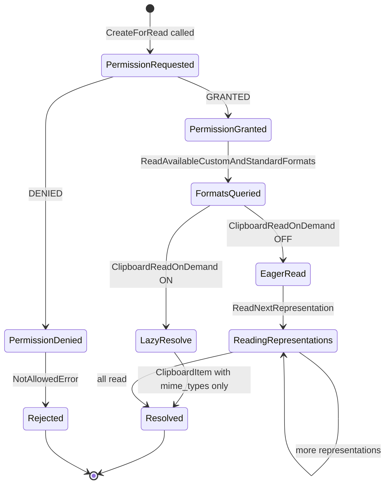

# Low-Level Design: CL 6978530 — [Clipboard] Implementation of Lazy Read

**CL URL:** https://chromium-review.googlesource.com/c/chromium/src/+/6978530  
**Owner:** Shweta Bindal <shwetabindal@microsoft.com>  
**Bug:** 435051711  
**Total:** 10 files, +478/−50 lines  

## Summary

This CL implements **lazy (on-demand) clipboard reading** for the Async Clipboard API. Instead of eagerly reading all clipboard data during `navigator.clipboard.read()`, the new code defers actual data reads until `ClipboardItem.getType()` is called. This is gated behind the `ClipboardReadOnDemand` runtime-enabled feature flag (status: `"test"`).

Key behavioral changes:
1. `clipboard.read()` now only fetches available MIME types from the OS clipboard, not the data itself.
2. `ClipboardItem.getType(type)` triggers on-demand reading of the specific format.
3. A clipboard change detection mechanism (sequence number comparison) rejects `getType()` if the clipboard was modified between `read()` and `getType()`.

---

## 1. File-by-File Analysis

---

### 1.1 `runtime_enabled_features.json5`

**Purpose of changes**: Introduce the `ClipboardReadOnDemand` feature flag.

**Key modifications**:
- Added new feature `"ClipboardReadOnDemand"` with status `"test"` (enabled in test/layout-test mode only).

**Impact**: All new lazy-read code paths are gated behind `RuntimeEnabledFeatures::ClipboardReadOnDemandEnabled()`.

---

### 1.2 `clipboard_item.h`

**Purpose of changes**: Extend `ClipboardItem` to support lazy-read mode where it holds MIME types without pre-resolved data, and reads data on demand via a reference to its parent `ClipboardPromise`.

**Key modifications**:
- Added new constructor accepting `HeapVector<String>& mime_types`, `sequence_number`, `ClipboardPromise*`, and `is_lazy_read` flag.
- Added `HeapHashMap<String, Member<ScriptPromiseResolver<Blob>>> representations_with_resolvers_` — maps MIME types to resolvers for on-demand getType() calls.
- Added `HeapVector<String> mime_types_` — stores MIME type list for lazy-read items.
- Added `bool is_lazy_read_` — distinguishes lazy-read items from eager-read items.
- Added `Member<ClipboardPromise> clipboard_promise_` — back-reference to the creating promise for on-demand reads.
- Added private methods: `ResolveFormatData()`, `CheckSequenceNumber()`.
- Added `#include "heap_hash_map.h"` and forward declarations for `ClipboardPromise`, `ScriptPromiseResolver`.

**New/Modified Functions**:

| Function | Purpose | Parameters | Returns |
|----------|---------|------------|---------|
| `ClipboardItem(mime_types, seq, promise, lazy)` | New constructor for lazy-read items | `HeapVector<String>&`, `uint128`, `ClipboardPromise*`, `bool` | — |
| `ResolveFormatData(mime_type, blob)` | Resolves or rejects the promise for a specific MIME type after data is read | `const String&`, `Blob*` | `void` |
| `CheckSequenceNumber()` | Compares current clipboard sequence number against the stored one | — | `bool` |

**Data Flow for `getType()` in lazy-read mode**:


---

### 1.3 `clipboard_item.cc`

**Purpose of changes**: Implement the lazy-read constructor, on-demand `getType()` logic, sequence number checks, and format data resolution.

**Key modifications**:

1. **New constructor** (`ClipboardItem(mime_types, ...)`) — stores MIME types, sequence number, clipboard promise reference; asserts `ClipboardReadOnDemandEnabled()`.

2. **`types()` method** — branched: if lazy-read, returns `mime_types_`; otherwise returns keys from `representations_`.

3. **`getType()` method** — significantly restructured:
   - Non-lazy path (feature disabled or `!is_lazy_read_`): unchanged behavior using `representations_`.
   - Lazy path: checks sequence number first (throws `DataError` if changed), checks if a resolver already exists for the type (returns existing promise), otherwise creates a new `ScriptPromiseResolver`, stores it in `representations_with_resolvers_`, and calls `clipboard_promise_->ReadRepresentationFromClipboard()`.

4. **`ResolveFormatData(mime_type, blob)`** — callback invoked when data arrives:
   - If `blob == nullptr`, rejects with `DataError`.
   - Re-checks sequence number before resolving (double-check).
   - Resolves the stored `ScriptPromiseResolver` with the blob.

5. **`CheckSequenceNumber()`** — queries `clipboard_promise_->GetSequenceNumberToken()` and compares with stored `sequence_number_`.

6. **`Trace()`** — added tracing for `representations_with_resolvers_`, `clipboard_promise_`, `mime_types_`.

**New/Modified Functions**:

| Function | Purpose | Parameters | Returns |
|----------|---------|------------|---------|
| `ClipboardItem(mime_types, seq, promise, lazy)` | Lazy-read constructor | `HeapVector<String>&`, `uint128`, `ClipboardPromise*`, `bool` | — |
| `types()` | Returns MIME type list | — | `Vector<String>` |
| `getType(script_state, type, exception_state)` | On-demand data read for lazy items | `ScriptState*`, `String&`, `ExceptionState&` | `ScriptPromise<Blob>` |
| `ResolveFormatData(mime_type, blob)` | Resolve/reject after data read | `String&`, `Blob*` | `void` |
| `CheckSequenceNumber()` | Clipboard change detection | — | `bool` |

---

### 1.4 `clipboard_promise.h`

**Purpose of changes**: Add public API and internal state for on-demand clipboard reading.

**Key modifications**:
- Added forward declarations: `Blob`, `ClipboardItem`.
- Added `Member<ClipboardReader> clipboard_reader_` — keeps reader alive during lazy reads.
- Added `HeapVector<String> item_mime_types_` — MIME types for lazy-read resolution.
- Added `HashMap<String, base::OnceCallback<void(const String&, Blob*)>> read_callbacks_` — per-MIME-type callbacks for concurrent getType() calls.
- New public methods: `OnRead(Blob*, const String&)`, `GetSequenceNumberToken()`, `ReadRepresentationFromClipboard()`.
- New private method: `ReadRepresentationFromClipboardReader()`.

**New/Modified Functions**:

| Function | Purpose | Parameters | Returns |
|----------|---------|------------|---------|
| `OnRead(blob, mime_type)` | Overloaded OnRead for lazy path | `Blob*`, `const String&` | `void` |
| `GetSequenceNumberToken()` | Get current clipboard sequence number | — | `absl::uint128` |
| `ReadRepresentationFromClipboard(format, callback)` | Entry point for on-demand reads from ClipboardItem | `const String&`, `OnceCallback<void(const String&, Blob*)>` | `void` |
| `ReadRepresentationFromClipboardReader(format)` | Internal: creates reader and triggers read | `const String&` | `void` |

---

### 1.5 `clipboard_promise.cc`

**Purpose of changes**: Implement the lazy-read flow, on-demand reader creation, callback management, and modify existing paths to branch on the feature flag.

**Key modifications**:

1. **`ReadRepresentationFromClipboardReader(format)`** — creates a `ClipboardReader` for the given format, stores it in `clipboard_reader_`, calls `Read()`. On failure, calls `OnRead(nullptr, format)`.

2. **`ReadRepresentationFromClipboard(format, callback)`** — stores the callback in `read_callbacks_` keyed by format, then posts a task to `ReadRepresentationFromClipboardReader()`.

3. **`ResolveRead()`** — branched:
   - Lazy path: creates a `ClipboardItem` with `item_mime_types_`, sequence number, `this` pointer, and `is_lazy_read=true`. No data blobs are created.
   - Eager path: unchanged (creates items with pre-read blob data).

4. **`OnReadAvailableFormatNames(format_names)`** — branched:
   - Lazy path: populates `item_mime_types_` instead of `clipboard_item_data_`, then calls `ResolveRead()` immediately (no `ReadNextRepresentation()`).
   - Eager path: unchanged.

5. **`ReadNextRepresentation()`** — now stores `clipboard_reader_` reference (was previously discarded).

6. **`OnRead(blob, mime_type)`** — new overload: looks up callback in `read_callbacks_`, executes it, erases from map.

7. **`GetSequenceNumberToken()`** — fetches current sequence number from `SystemClipboard` via `LocalFrame`.

8. **`ContextDestroyed()`** — also clears `clipboard_reader_`.

9. **`Trace()`** — traces `clipboard_reader_` and `item_mime_types_`.

**New/Modified Functions**:

| Function | Purpose | Parameters | Returns |
|----------|---------|------------|---------|
| `ReadRepresentationFromClipboardReader(format)` | Creates reader + reads specific format | `const String&` | `void` |
| `ReadRepresentationFromClipboard(format, callback)` | Stores callback, posts task for reader | `const String&`, `OnceCallback` | `void` |
| `ResolveRead()` | Modified: branches on lazy vs eager | — | `void` |
| `OnReadAvailableFormatNames(format_names)` | Modified: stores types only in lazy mode | `const Vector<String>&` | `void` |
| `OnRead(blob, mime_type)` | Dispatches to stored callback | `Blob*`, `const String&` | `void` |
| `GetSequenceNumberToken()` | Returns clipboard sequence number | — | `absl::uint128` |

---

### 1.6 `clipboard_reader.cc`

**Purpose of changes**: Modify all reader subclasses to call the new `OnRead(blob, mime_type)` overload when lazy-read is enabled.

**Key modifications**:
- In each reader class (`ClipboardPngReader`, `ClipboardTextReader`, `ClipboardHtmlReader`, `ClipboardSvgReader`, `ClipboardCustomFormatReader`), the read completion callback is branched:
  - If `ClipboardReadOnDemandEnabled()`: calls `promise_->OnRead(blob, <mime_type>)`.
  - Else: calls `promise_->OnRead(blob)` (existing behavior).

**Affected readers**:

| Reader Class | MIME Type Constant |
|---|---|
| `ClipboardPngReader` | `ui::kMimeTypePng` |
| `ClipboardTextReader` | `ui::kMimeTypePlainText` |
| `ClipboardHtmlReader` | `ui::kMimeTypeHtml` |
| `ClipboardSvgReader` | `ui::kMimeTypeSvg` |
| `ClipboardCustomFormatReader` | `mime_type_` (dynamic) |

---

### 1.7 `mock_clipboard_host.h`

**Purpose of changes**: Add call-tracking booleans to `MockClipboardHost` to verify lazy-read behavior in tests.

**Key modifications**:
- Added public accessors: `WasReadTextCalled()`, `WasReadHtmlCalled()`, `WasReadAvailableFormatsCalled()`.
- Added private tracking booleans: `read_text_called_`, `read_html_called_`, `read_available_formats_called_`.

---

### 1.8 `mock_clipboard_host.cc`

**Purpose of changes**: Set tracking flags when clipboard read methods are called; reset them in `Reset()`.

**Key modifications**:
- `ReadText()` sets `read_text_called_ = true`.
- `ReadHtml()` sets `read_html_called_ = true`.
- `ReadAvailableCustomAndStandardFormats()` sets `read_available_formats_called_ = true`.
- `Reset()` clears all three flags.

---

### 1.9 `clipboard_unittest.cc`

**Purpose of changes**: Add unit tests for lazy-read behavior and restructure test fixture for mock clipboard access.

**Key modifications**:

1. **`ClipboardItemGetType` helper class** — new `ThenCallable` that chains on a `read()` promise, calls `getType()` on the first clipboard item, returns `"SUCCESS"` or empty string.

2. **`ClipboardTest::SetUp()`** — overridden to install a custom `MockClipboardHostProvider` so tests can access `mock_clipboard_host()` for call tracking.

3. **`WritePlainTextToClipboard` / `WriteHtmlToClipboard`** — changed to use `GetFrame()` instead of `scope.GetFrame()` (compatible with the new `SetUp()` that installs the mock).

4. **New test: `ReadOnlyMimeTypesInClipboardRead`** — verifies that `clipboard.read()` only calls `ReadAvailableCustomAndStandardFormats()` and does NOT call `ReadText()` or `ReadHtml()`.

5. **New test: `ClipboardItemGetTypeTest`** — verifies that calling `getType("text/plain")` on a lazy-read `ClipboardItem` successfully triggers `ReadText()` on the mock clipboard host.

**New/Modified Functions**:

| Function/Test | Purpose |
|---|---|
| `ClipboardItemGetType::React()` | Chains getType() on read() result |
| `ClipboardTest::SetUp()` | Installs mock clipboard host |
| `TEST_F(ReadOnlyMimeTypesInClipboardRead)` | Verifies lazy loading during read() |
| `TEST_F(ClipboardItemGetTypeTest)` | Verifies on-demand read via getType() |

---

### 1.10 `async-clipboard-lazy-read.html`

**Purpose of changes**: Web platform test for clipboard change detection.

**Test flow**:
1. Write `"Initial clipboard content"` via `clipboard.writeText()`.
2. Call `clipboard.read()` to get `ClipboardItem`.
3. Write `"Changed clipboard content"` via `clipboard.writeText()` (changes clipboard).
4. Call `item.getType('text/plain')` — should reject with `DataError` because clipboard changed.

---

## 2. Class Diagram



---

## 3. State Diagram

### Lazy-Read ClipboardItem Lifecycle



### Promise Resolution Flow



---

## 4. Implementation Concerns

### 4.1 Memory Management

- **ClipboardPromise lifetime**: `ClipboardItem` holds a `Member<ClipboardPromise>` back-reference. The `ClipboardPromise` is `GarbageCollected` and also referenced by the resolved promise. Both are properly traced. However, this creates a **bidirectional reference**: `ClipboardPromise` creates `ClipboardItem` which points back to `ClipboardPromise`. This is safe due to GC tracing but creates a longer-lived `ClipboardPromise` than before (it previously could be collected after `read()` resolved).

- **`WrapPersistent(this)` in `BindOnce`** (clipboard_item.cc:200): The `ClipboardItem` uses `WrapPersistent(this)` when creating the callback for `ReadRepresentationFromClipboard`. This prevents GC of the `ClipboardItem` until the callback completes, which is correct. However, if the callback is never executed (e.g., context destroyed before read completes), the persistent handle may cause a minor leak until the persistent handle destructor runs.

- **`read_callbacks_` map** uses `base::OnceCallback` (non-GC type) stored in a `HashMap`. These callbacks are cleaned up after execution in `OnRead(blob, mime_type)` and the map is not traced by GC. If `ContextDestroyed()` fires, the callbacks will be destroyed with the `ClipboardPromise` but won't be explicitly invoked — **pending promises from `getType()` will hang unresolved**.

### 4.2 Thread Safety

- All operations are sequence-checked with `DCHECK_CALLED_ON_VALID_SEQUENCE(sequence_checker_)`.
- `ReadRepresentationFromClipboard()` posts a task to the clipboard task runner to perform the actual read, which is correct.
- **Potential concern**: Multiple concurrent `getType()` calls for different MIME types post separate tasks. The `read_callbacks_` map handles this by keying on format. However, `clipboard_reader_` is a single `Member` field — if two `getType()` calls are in flight simultaneously, the second call's reader will overwrite the first in `clipboard_reader_`. This could cause the first reader to be GC'd prematurely if there are no other references. The `ClipboardReader` uses `WrapPersistent(this)` internally in its own callbacks, so it should stay alive, but the overwritten `clipboard_reader_` reference could lead to issues if `ContextDestroyed()` is called (only the latest reader is cleared).

### 4.3 Performance Implications

- **Positive**: Lazy reading avoids reading clipboard data that may never be requested. This is beneficial when clipboard contains large data (images, HTML) but only text is requested.
- **Negative**: Each `getType()` call incurs an additional IPC round-trip plus task posting overhead. For use cases that always read all types, this adds latency compared to the eager approach.
- **Sequence number check**: `GetSequenceNumberToken()` calls `clipboard->SequenceNumber()` which is likely a synchronous IPC (or cached). Called twice per `getType()` (once at call start, once in `ResolveFormatData`). If this involves IPC, it could be a performance concern.

### 4.4 Maintainability Concerns

- **Feature flag branching**: The code has extensive `RuntimeEnabledFeatures::ClipboardReadOnDemandEnabled()` checks scattered across 4+ files (`clipboard_item.cc`, `clipboard_promise.cc`, `clipboard_reader.cc` × 5 readers). This creates maintenance burden and risk of inconsistency. Ideally, the branching should be at a higher level.

- **Dual `OnRead` overloads**: The two `OnRead` overloads (`OnRead(Blob*)` and `OnRead(Blob*, const String&)`) serve different code paths. This is confusing and error-prone — a reader subclass calling the wrong overload would silently fail.

- **`representations_with_resolvers_` vs `representations_`**: Two parallel data structures for the same concept (type→data mapping) depending on lazy vs eager mode. This increases complexity.

---

## 5. Suggestions for Improvement

### 5.1 Consolidate Reader Branching

Instead of adding `if (ClipboardReadOnDemandEnabled())` in every reader subclass, have the reader always call `OnRead(blob, mime_type)` and handle the dispatch in `ClipboardPromise::OnRead(Blob*, const String&)`. The non-lazy `OnRead(Blob*)` could be called internally, avoiding 5 duplicate branches.

### 5.2 Handle Pending Promises on Context Destruction

When `ContextDestroyed()` fires, any pending `ScriptPromiseResolver`s in `representations_with_resolvers_` should be rejected (e.g., with `NotAllowedError`). Currently, they will hang unresolved if `getType()` was called but the reader hasn't completed yet.

### 5.3 Guard Against Concurrent Reader Overwrites

The single `clipboard_reader_` field can be overwritten by concurrent `getType()` calls. Consider using a map of active readers keyed by MIME type, or ensuring the reader is only stored for lifecycle management (the current `WrapPersistent` in readers may already keep them alive, making the field unnecessary for lazy reads).

### 5.4 Deduplicate Error Rejection Logic

`ResolveFormatData()` has two identical rejection blocks (null blob and sequence check failure) both creating the same `DOMException`. Extract a helper method:

```cpp
void ClipboardItem::RejectResolver(const String& mime_type, const String& message) {
  representations_with_resolvers_.at(mime_type)->Reject(
      MakeGarbageCollected<DOMException>(DOMExceptionCode::kDataError, message));
}
```

### 5.5 Web Test Coverage

The web test (`async-clipboard-lazy-read.html`) only tests the clipboard-changed error case. Consider adding tests for:
- Successful `getType()` read with unchanged clipboard.
- Multiple `getType()` calls for different MIME types.
- `getType()` for an unsupported type returns `NotFoundError`.
- Reading the same type twice returns the same resolved promise.

### 5.6 Unit Test: Verify Actual Data Content

`ClipboardItemGetTypeTest` only verifies that `getType()` returns a non-empty promise (via `"SUCCESS"` string). It doesn't verify the actual blob content matches what was written. Consider awaiting the blob promise and comparing the text content.

### 5.7 Missing Blank Line (Style)

In `clipboard_item.cc` line 218 (after `CheckSequenceNumber()` closing brace), there is a missing blank line before the `// static` comment for `supports()`. This is a minor style issue.

### 5.8 Consider Removing `is_lazy_read_` Flag

The `is_lazy_read_` flag is redundant with checking `clipboard_promise_ != nullptr`. Every lazy-read item has a non-null `clipboard_promise_`, and every non-lazy item has `clipboard_promise_ == nullptr`. Removing `is_lazy_read_` would reduce state and potential inconsistency.
