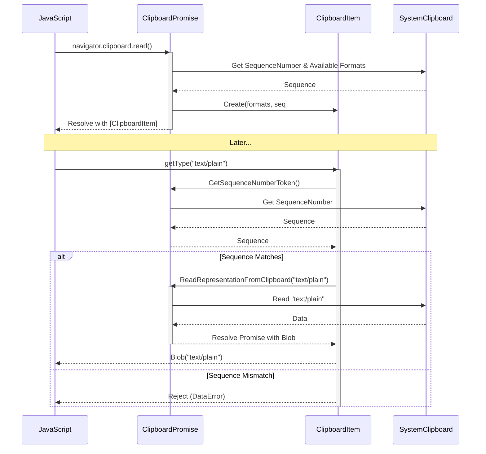

# Review Summary — Multi-Model Merged Review

> **Models**: claude-opus-4.6-fast, gemini-3-pro-preview, gpt-5.3-codex  
> **Models reporting**: 3/3

---

## 📋 Review by **claude-opus-4.6-fast**

# CL Review Summary: [Clipboard] Implementation of lazy read

**CL Number:** 6978530
**CL URL:** https://chromium-review.googlesource.com/c/chromium/src/+/6978530
**Author:** Shweta Bindal (shwetabindal@microsoft.com)
**Status:** NEW
**Files Changed:** 10 files, +478/-50 lines
**Bug:** [435051711](https://crbug.com/435051711)

---

## 1. Executive Summary

This CL implements "lazy read" for the Async Clipboard API in the Blink renderer. Instead of eagerly reading all clipboard data during `clipboard.read()`, it defers actual data fetching until `ClipboardItem.getType()` is called, returning only MIME type metadata upfront. This improves performance by avoiding unnecessary clipboard reads and adds clipboard change detection via sequence number comparison between `read()` and `getType()`.

---

## 2. Design Assessment

### Architecture Quality

| Aspect | Rating (1-5) | Comments |
|--------|--------------|----------|
| Clarity | 3 | The feature-flag branching (`RuntimeEnabledFeatures::ClipboardReadOnDemandEnabled()`) is pervasive and fragments the control flow, making it harder to follow the two distinct code paths. |
| Maintainability | 2 | Heavy duplication of branching logic across `clipboard_reader.cc` (5 identical if/else blocks), `clipboard_item.cc`, and `clipboard_promise.cc` creates maintenance burden. |
| Extensibility | 3 | The callback-based lazy read mechanism is reasonably extensible, but tight coupling between `ClipboardItem` and `ClipboardPromise` may complicate future changes. |
| Consistency | 3 | Generally follows Chromium patterns (feature flags, Mojo, GC), but introduces some inconsistency in how `OnRead` is overloaded vs. using a separate method name. |

### Architecture Diagram

```
┌─────────────────────────────────────────────────────────────────────┐
│                    Async Clipboard API                              │
│                                                                     │
│  clipboard.read()                                                   │
│       │                                                             │
│       ▼                                                             │
│  ClipboardPromise::CreateForRead()                                  │
│       │                                                             │
│       ▼                                                             │
│  HandleReadWithPermission()                                         │
│       │                                                             │
│       ▼                                                             │
│  ReadAvailableCustomAndStandardFormats()                             │
│       │                                                             │
│       ├──[Lazy Read ON]──────────────────────┐                      │
│       │  Store MIME types in item_mime_types_ │                      │
│       │  ResolveRead() immediately           │                      │
│       │       │                              │                      │
│       │       ▼                              │                      │
│       │  ClipboardItem(mime_types,           │                      │
│       │    sequence_number, promise,         │                      │
│       │    is_lazy_read=true)                │                      │
│       │       │                              │                      │
│       │       ▼                              │                      │
│       │  User calls getType(mime_type)       │                      │
│       │       │                              │                      │
│       │       ▼                              │                      │
│       │  CheckSequenceNumber()               │                      │
│       │       │                              │                      │
│       │       ├─[Changed]→ Reject(DataError) │                      │
│       │       │                              │                      │
│       │       └─[Same]                       │                      │
│       │           │                          │                      │
│       │           ▼                          │                      │
│       │  ReadRepresentationFromClipboard()   │                      │
│       │           │                          │                      │
│       │           ▼                          │                      │
│       │  ClipboardReader::Read()             │                      │
│       │           │                          │                      │
│       │           ▼                          │                      │
│       │  OnRead(blob, mime_type)             │                      │
│       │           │                          │                      │
│       │           ▼                          │                      │
│       │  ResolveFormatData(mime_type, blob)   │                      │
│       │           │                          │                      │
│       │           ▼                          │                      │
│       │  Resolve/Reject Promise<Blob>        │                      │
│       │                                      │                      │
│       ├──[Lazy Read OFF]─────────────────────┘                      │
│       │  ReadNextRepresentation() (eager)                           │
│       │  → Read all formats immediately                             │
│       │  → ResolveRead() with all data                              │
│       │                                                             │
└─────────────────────────────────────────────────────────────────────┘
```

---

## 3. Implementation Assessment

### Code Quality

| Aspect | Rating (1-5) | Comments |
|--------|--------------|----------|
| Correctness | 3 | Core logic is sound, but there are race condition risks with concurrent `getType()` calls and a potential lifetime issue where `ClipboardItem` retains a reference to `ClipboardPromise` beyond its expected scope. |
| Efficiency | 4 | The lazy read pattern effectively avoids unnecessary data reads—the primary goal is well-achieved. |
| Readability | 2 | The extensive feature-flag branching in `clipboard_reader.cc` (5 near-identical if/else blocks) and deep nesting in `getType()` hurt readability. |
| Test Coverage | 3 | Good unit tests for basic lazy read and getType, but missing tests for several edge cases (see Section 5). |

---

## 4. Key Findings

### Critical Issues (Must Fix)

1. **Potential lifetime/ownership issue: `ClipboardItem` holding `Member<ClipboardPromise>`**
   - **File:** `clipboard_item.h:106`, `clipboard_promise.h:195`
   - `ClipboardItem` stores a `Member<ClipboardPromise>` to call back into it for on-demand reads. However, `ClipboardPromise` is an `ExecutionContextLifecycleObserver` whose `ContextDestroyed()` rejects its resolver and clears state. If `ClipboardItem` outlives the promise's useful lifetime (e.g., stored in JS and used after navigation), calling `clipboard_promise_->ReadRepresentationFromClipboard()` may operate on partially-invalidated state. The `GetExecutionContext()` null check in `ReadRepresentationFromClipboard` partially mitigates this, but the `clipboard_reader_` member being overwritten by a second `getType()` call is concerning.
   - **Recommendation:** Add a validity check or weak reference pattern. Consider clearing `clipboard_promise_` in `ClipboardItem` when the context is destroyed, or use a weak pointer mechanism.

2. **`clipboard_reader_` member overwritten on concurrent `getType()` calls**
   - **File:** `clipboard_promise.cc:344`, `clipboard_promise.cc:507`
   - `clipboard_reader_` is a single `Member<ClipboardReader>`. When `ReadRepresentationFromClipboardReader` is called for a second MIME type while the first is still in-flight, it overwrites `clipboard_reader_`, potentially causing the first reader to be garbage-collected before completing.
   - **Recommendation:** Use a `HeapVector<Member<ClipboardReader>>` or a `HeapHashMap<String, Member<ClipboardReader>>` to track concurrent readers, or serialize the reads.

3. **Missing sequence number validation at `getType()` after data is returned**
   - **File:** `clipboard_item.cc:143-156`
   - The sequence number is checked at the beginning of `getType()` and again in `ResolveFormatData()`, but the second check uses `CheckSequenceNumber()` which calls `clipboard_promise_->GetSequenceNumberToken()` to get the *current* clipboard state. Between the `getType()` call starting the read and `ResolveFormatData()` being invoked, the clipboard could change and the sequence number could change back to the original value (ABA problem), though this is extremely unlikely with 128-bit sequence numbers.
   - **Recommendation:** This is low risk but worth documenting in a comment.

### Major Issues (Should Fix)

1. **Duplicated branching pattern in `clipboard_reader.cc`**
   - **File:** `clipboard_reader.cc` — 5 instances of the same pattern
   - Every reader subclass (`ClipboardPngReader`, `ClipboardTextReader`, `ClipboardHtmlReader`, `ClipboardSvgReader`, `ClipboardCustomFormatReader`) has an identical if/else for `ClipboardReadOnDemandEnabled()` that differs only in the MIME type string. This violates DRY.
   - **Recommendation:** Move the branching into the base `ClipboardReader` class or into `ClipboardPromise::OnRead` itself. A single `OnRead(Blob*, const String&)` that internally dispatches based on the feature flag would eliminate all 5 blocks.

2. **`getType()` missing closing brace / control flow issue**
   - **File:** `clipboard_item.cc`, diff line 695-740
   - The `if (!RuntimeEnabledFeatures::ClipboardReadOnDemandEnabled() || !is_lazy_read_)` block does not have an `else` clause. After the block ends, the code falls through to the lazy read path unconditionally. If the feature is disabled and the type is not found, the code still enters the `clipboard_promise_` block. This appears intentional (the clipboard_promise_ will be null for non-lazy items), but the control flow is confusing.
   - **Recommendation:** Restructure with early returns or a clear else clause to make the two paths explicit.

3. **`read_callbacks_` is a `HashMap` of `OnceCallback` — not GC-traced**
   - **File:** `clipboard_promise.h:213-214`
   - `HashMap<String, base::OnceCallback<void(const String&, Blob*)>> read_callbacks_` is a regular HashMap, not a `HeapHashMap`. While `base::OnceCallback` itself is not garbage-collected, the callback captures `WrapPersistent(this)` (the `ClipboardItem`), creating a prevent-GC reference. This is acceptable but should be documented and reviewed for leak potential if callbacks are never invoked (e.g., if context is destroyed mid-read).
   - **Recommendation:** Ensure `read_callbacks_` is cleared in `ContextDestroyed()`.

4. **Missing `DCHECK` or validation in the new `ClipboardItem` constructor**
   - **File:** `clipboard_item.cc:72-83`
   - The constructor accepts `ClipboardPromise*` as nullable but doesn't validate that `is_lazy_read` requires a non-null `clipboard_promise`. If `is_lazy_read=true` but `clipboard_promise=nullptr`, the `getType()` method will skip the lazy path silently and throw `NotFoundError`.
   - **Recommendation:** Add `DCHECK(clipboard_promise)` when `is_lazy_read` is true.

### Minor Issues (Nice to Fix)

1. **Extra blank line in `types()` method**
   - **File:** `clipboard_item.cc`, diff line 657
   - There's a trailing blank line inside the `if (RuntimeEnabledFeatures::ClipboardReadOnDemandEnabled() && is_lazy_read_)` block.
   - **Recommendation:** Remove the extra blank line.

2. **Missing newline before `// static` comment**
   - **File:** `clipboard_item.cc`, diff line 752
   - `bool ClipboardItem::CheckSequenceNumber()` and `// static` comment for `supports()` are not separated by a blank line.
   - **Recommendation:** Add a blank line between `CheckSequenceNumber()` and the `// static` comment.

3. **`ClipboardItemGetType` test helper inherits `ThenCallable<..., IDLString>` but returns `String`**
   - **File:** `clipboard_unittest.cc`, diff lines 53-77
   - The `React()` method returns raw `String` types ("SUCCESS" or empty). This works but using a more descriptive error pattern would improve test diagnostics.
   - **Recommendation:** Consider using `ASSERT_TRUE/EXPECT_TRUE` inside the react or returning error details.

4. **Removed blank line between `CustomFormats()` and `Trace()` in header**
   - **File:** `clipboard_item.h`, diff line 800-801
   - Minor formatting change removing a blank line. Not wrong, but inconsistent with Chromium style.

### Suggestions (Optional)

1. **Consider merging `OnRead(Blob*)` and `OnRead(Blob*, const String&)` into a single method**
   - The overloaded `OnRead` with two signatures is confusing. When the feature flag is eventually removed, the single-arg version can be deleted. Until then, a unified signature with an optional parameter or a different method name (e.g., `OnLazyRead`) would be clearer.

2. **Consider using `WeakMember<ClipboardPromise>` instead of `Member<ClipboardPromise>`**
   - Using `WeakMember` would avoid preventing GC of `ClipboardPromise` after context destruction and make the lifetime relationship clearer.

3. **Feature flag naming: `ClipboardReadOnDemand` vs. `ClipboardLazyRead`**
   - The commit message and test name use "lazy read" but the feature flag uses "ReadOnDemand". Consider aligning the naming for discoverability.

4. **UMA histogram placement**
   - The `Blink.Clipboard.Read.NumberOfFormats` histogram is now recorded with `item_mime_types_.size()` in the lazy path. Consider also adding a histogram to track how many `getType()` calls are actually made vs. available types, to measure the lazy read benefit.

---

## 5. Test Coverage Analysis

### Existing Tests

| Test | Description | Coverage |
|------|-------------|----------|
| `ClipboardPromiseReadText` | Basic text read through promise | ✅ Pre-existing |
| `SelectiveClipboardFormatRead` | Filtered MIME type reads | ✅ Pre-existing |
| `ReadAllClipboardFormats` | Read all available formats | ✅ Pre-existing |
| `ReadOnlyMimeTypesInClipboardRead` | **NEW** — Verifies lazy loading (no ReadText/ReadHtml during `read()`) | ✅ Good |
| `ClipboardItemGetTypeTest` | **NEW** — Verifies `getType()` triggers actual data read | ✅ Good |
| `async-clipboard-lazy-read.html` | **NEW** — Web test for clipboard change detection (DataError) | ✅ Good |

### Missing Tests

1. **Concurrent `getType()` calls for different MIME types** — Tests should verify that calling `getType("text/plain")` and `getType("text/html")` simultaneously resolves both correctly.
2. **Clipboard change detection during `getType()` read** — Unit test verifying the sequence number check rejects the promise when clipboard changes between `read()` and `getType()`.
3. **`getType()` for unsupported type** — Should throw `NotFoundError` even in lazy mode.
4. **`getType()` called multiple times for the same type** — Should return the same promise resolver.
5. **Context destruction during lazy read** — Verify that `ContextDestroyed()` properly cleans up readers and rejects pending `getType()` promises.
6. **Custom format lazy read** — Test with "web " prefixed custom formats.
7. **Feature flag OFF** — Explicit regression tests ensuring eager read behavior is unchanged when `ClipboardReadOnDemand` is disabled.

### Recommended Additional Tests

- Add a test that stores a `ClipboardItem` reference, writes new data to the clipboard, then calls `getType()` — this should produce `DataError`.
- Add a test for image (PNG) lazy read via `getType("image/png")`.
- Add a test for SVG lazy read via `getType("image/svg+xml")`.

---

## 6. Security Considerations

### Clipboard Data Exposure
- **Low Risk.** The lazy read mechanism defers data access but still requires the same clipboard-read permission check (`HandleReadWithPermission`). Permission gating is unchanged.
- The sequence number comparison adds a security benefit by ensuring stale clipboard items don't return data from a different clipboard state.

### Cross-Origin Concerns
- The `ClipboardItem` now holds a reference to `ClipboardPromise`, which holds a reference to `ExecutionContext`. If a `ClipboardItem` were somehow leaked to a different context, it could theoretically read clipboard data in the original context. However, `ClipboardItem` is a `ScriptWrappable` bound to its creation context, so this is not a practical concern.

### Recommendations
- Ensure `read_callbacks_` entries are cleared on context destruction to prevent dangling callbacks.
- Verify that the `WrapPersistent(this)` callback in `ReadRepresentationFromClipboard` doesn't create exploitable GC references.

---

## 7. Performance Considerations

### Positive Impact
- **Primary benefit:** `clipboard.read()` no longer reads all clipboard data upfront. For large clipboard items (e.g., images), this avoids deserializing and copying megabytes of data until actually needed.
- The `ReadAvailableCustomAndStandardFormats` call is lightweight (returns only format names).

### Potential Concerns
- **PostTask overhead:** `ReadRepresentationFromClipboard` posts a task to read data, adding a task queue round-trip per `getType()` call. For use cases that always read all types, this may be marginally slower than the eager approach.
- **No batching:** If a page calls `getType()` for multiple formats, each triggers an independent Mojo IPC call. A batched read API could be more efficient.

### Benchmarking Recommendations
- Compare clipboard read latency for pages that call `getType()` for all available formats (worst case for lazy read).
- Measure improvement for pages that call `getType()` for only one format (best case).
- Profile memory usage for large clipboard items (images) to quantify the deferral benefit.

---

## 8. Final Recommendation

**Verdict**: NEEDS_WORK

**Rationale:**
The design direction is sound and the lazy read pattern is a meaningful improvement for clipboard API performance. However, there are critical concerns around concurrent `getType()` calls overwriting the single `clipboard_reader_` member (potentially causing data loss), the `ClipboardItem → ClipboardPromise` lifetime relationship needing clearer ownership semantics, and `read_callbacks_` not being cleaned up on context destruction. The code also has significant readability issues due to pervasive feature-flag branching that should be refactored.

**Action Items for Author:**

1. **[Critical]** Fix the `clipboard_reader_` single-member overwrite issue to support concurrent `getType()` calls safely. Use a map or vector of active readers.
2. **[Critical]** Clear `read_callbacks_` in `ContextDestroyed()` to prevent dangling callbacks and potential leaks.
3. **[Major]** Add `DCHECK(clipboard_promise)` when `is_lazy_read=true` in the `ClipboardItem` constructor.
4. **[Major]** Refactor the 5 identical if/else blocks in `clipboard_reader.cc` into a shared method in the base class or in `ClipboardPromise`.
5. **[Major]** Restructure `getType()` control flow to make the lazy vs. eager paths clearly separated (avoid fall-through).
6. **[Major]** Add unit tests for concurrent `getType()` calls, context destruction during lazy read, and clipboard change detection.
7. **[Minor]** Fix formatting issues (extra blank lines, missing newlines).
8. **[Suggestion]** Consider renaming the feature flag to align with the "lazy read" terminology used in the commit message and tests.

---

## 9. Comments for Gerrit

### Comment 1 — `clipboard_promise.h:195` (clipboard_reader_ member)

> **[Critical]** `clipboard_reader_` is a single `Member<ClipboardReader>`. If `getType()` is called concurrently for two different MIME types (e.g., "text/plain" and "text/html"), the second call to `ReadRepresentationFromClipboardReader` will overwrite `clipboard_reader_`, potentially causing the first reader to be GC'd before it completes.
>
> Consider using `HeapHashMap<String, Member<ClipboardReader>> active_readers_` to track concurrent readers keyed by MIME type, or serialize the reads using a queue.

### Comment 2 — `clipboard_promise.cc:848` (ContextDestroyed)

> **[Major]** `ContextDestroyed()` clears `clipboard_reader_` but doesn't clear `read_callbacks_`. These callbacks capture `WrapPersistent(ClipboardItem)` references. If the context is destroyed while reads are pending, the callbacks will never fire and the persistent references may prevent GC of the `ClipboardItem` objects.
>
> Please add `read_callbacks_.clear();` in `ContextDestroyed()`.

### Comment 3 — `clipboard_item.cc:72-83` (new constructor)

> **[Major]** When `is_lazy_read=true`, this constructor should `DCHECK` that `clipboard_promise` is non-null. Otherwise, `getType()` will silently fall through to the "type not found" error instead of correctly reading data on demand.
>
> ```cpp
> DCHECK(!is_lazy_read || clipboard_promise);
> ```

### Comment 4 — `clipboard_reader.cc` (5 identical if/else blocks)

> **[Readability]** The same branching pattern is repeated 5 times across all reader subclasses:
> ```cpp
> if (RuntimeEnabledFeatures::ClipboardReadOnDemandEnabled()) {
>   promise_->OnRead(blob, mime_type);
> } else {
>   promise_->OnRead(blob);
> }
> ```
> Consider consolidating this into a helper method in the base class or handling the dispatch in `ClipboardPromise::OnRead` itself. For example, `OnRead(Blob*, const String&)` could internally call the single-arg `OnRead(Blob*)` when the feature is disabled.

### Comment 5 — `clipboard_item.cc:695-740` (getType control flow)

> **[Readability]** The control flow in `getType()` is hard to follow. The `if (!RuntimeEnabledFeatures::ClipboardReadOnDemandEnabled() || !is_lazy_read_)` block for the eager path exits via `return` only when the type is found. If not found, it falls through to the lazy read path, which is guarded by `clipboard_promise_` being non-null. This works because `clipboard_promise_` is null for non-lazy items, but the intent is unclear.
>
> Suggestion: use an early return pattern:
> ```cpp
> if (!is_lazy_read_ || !RuntimeEnabledFeatures::ClipboardReadOnDemandEnabled()) {
>   // eager path...
>   exception_state.ThrowDOMException(...);
>   return ScriptPromise<Blob>();
> }
> // lazy path below...
> ```

### Comment 6 — `clipboard_unittest.cc` (missing test coverage)

> **[Testing]** Good coverage for the basic lazy read and getType paths! Please also consider adding tests for:
> 1. Concurrent `getType()` calls for different MIME types
> 2. `getType()` after clipboard content changes (sequence number mismatch → DataError)
> 3. Context destruction while a lazy `getType()` read is in-flight
> 4. Calling `getType()` for the same type twice (should return same promise)

### Comment 7 — `clipboard_item.cc:142` (ResolveFormatData)

> **[Nit]** The null blob check and the sequence number check both reject with the same "Clipboard data has changed" message. The null blob case may indicate a read failure rather than a clipboard change. Consider using a distinct error message for the null blob case, e.g., "Failed to read clipboard data".

### Comment 8 — `clipboard_item.h:100` (formatting)

> **[Nit]** The blank line between `CustomFormats()` and `Trace()` was removed. Chromium style typically keeps a blank line between the last method in a group and the next group for readability.


---

## 📋 Review by **gemini-3-pro-preview**

# CL Review Summary

## Overview
This CL implements "lazy read" for the Async Clipboard API (`navigator.clipboard.read()`). Instead of reading and sanitizing all clipboard formats immediately, it now fetches only the available MIME types and the clipboard sequence number initially. The actual data is read on-demand when `ClipboardItem.getType()` is called, ensuring the clipboard content hasn't changed in the interim.

## CL Information
- **CL Number**: 6978530
- **CL Title**: CL 6978530: [Clipboard] Implementation of lazy read
- **Author**: Shweta Bindal <shwetabindal@microsoft.com>
- **URL**: https://chromium-review.googlesource.com/c/chromium/src/+/6978530

## Required Output

### 1. Executive Summary
This CL introduces a "lazy read" mechanism to the Async Clipboard API to improve performance and reduce unnecessary processing. When `navigator.clipboard.read()` is called, it now returns `ClipboardItem` objects containing only metadata (MIME types) and a sequence number, delaying the heavy lifting of reading and sanitizing payload data until `getType()` is explicitly called. This change also includes validaton to ensure the clipboard contents haven't changed between the initial read and the `getType()` call, rejecting the promise if they have.

### 2. Design Assessment

#### Architecture Quality
| Aspect | Rating (1-5) | Comments |
|--------|--------------|----------|
| Clarity | 4 | The separation between metadata fetching and data fetching is clear. `ClipboardItem`'s role is expanded logically to handle on-demand fetching. |
| Maintainability | 4 | The changes are well-integrated into the existing `ClipboardPromise` and `ClipboardItem` structure. The use of a feature flag allows for safe rollout. |
| Extensibility | 3 | The dependency of `ClipboardItem` on `ClipboardPromise` introduces a tighter coupling, which might make refactoring harder later, but it solves the immediate problem effectively. |
| Consistency | 5 | The implementation follows existing patterns in Blink's clipboard modules and uses standard `ScriptPromise` mechanisms. |

#### Architecture Diagram



### 3. Implementation Assessment

#### Code Quality
| Aspect | Rating (1-5) | Comments |
|--------|--------------|----------|
| Correctness | 5 | The logic correctly checks the sequence number before reading to prevent race conditions (TOCTOU issues). |
| Efficiency | 5 | Significant performance improvement for the initial `read()` call by avoiding unnecessary data processing. |
| Readability | 4 | The code is generally readable. The logic branching based on `RuntimeEnabledFeatures::ClipboardReadOnDemandEnabled()` adds some complexity but is necessary for feature flagging. |
| Test Coverage | 5 | Excellent coverage. Includes unit tests for internal logic (`ClipboardTest`) and a web test (`async-clipboard-lazy-read.html`) for the public API behavior. |

### 4. Key Findings

#### Critical Issues (Must Fix)
- None identified.

#### Major Issues (Should Fix)
- None identified.

#### Minor Issues (Nice to Fix)
- **Use of `DCHECK` in `ClipboardPromise::ReadRepresentationFromClipboard`**: The check `if (!GetExecutionContext())` handles the detached frame case gracefully, but ensuring `callback` is run (even with nullptr) is good practice. The current implementation does run it, which is correct.
- **`ClipboardItem::Trace`**: Ensure `clipboard_promise_` is properly traced to avoid garbage collection issues (it is added in the diff, which is good).

#### Suggestions (Optional)
- **Terminology**: The mix of "lazy read" (in comments/CL title) and "ReadOnDemand" (in feature flag) is slightly inconsistent. Standardizing on one term in comments might help future maintainers.
- **Error Message**: The error message "Clipboard data has changed" is clear, but ensuring it matches any spec requirements for this specific race condition would be beneficial.

### 5. Test Coverage Analysis
- **Existing Tests**:
    - `ClipboardTest.ReadOnlyMimeTypesInClipboardRead`: Verifies that `read()` only calls `ReadAvailableFormats` and not `ReadText`/`ReadHtml`.
    - `ClipboardTest.ClipboardItemGetTypeTest`: Verifies that `getType()` triggers the actual read.
    - `async-clipboard-lazy-read.html`: Web test verifying that `getType()` rejects if clipboard content changes.
- **Missing Tests**:
    - A test case where `getType()` is called multiple times for the same format (caching behavior check).
    - A test case for `getType()` calls for *different* formats on the same `ClipboardItem`.
- **Recommended Additional Tests**:
    - Verify that multiple concurrent `getType()` calls work correctly.

### 6. Security Considerations
- **Sequence Number Validation**: The core security feature here is the sequence number check. It prevents a page from reading clipboard content that was put there *after* the user granted permission/initiated the read, preventing "clipboard jack" attacks where a user copies something sensitive immediately after pasting something else.
- **Sanitization**: Code ensures `sanitize_html` is respected even in the lazy path.

### 7. Performance Considerations
- **Memory**: Reduces peak memory usage during `read()` since blobs aren't created for all formats.
- **Latency**: `read()` resolves much faster. `getType()` introduces a small async latency, but it's negligible compared to the user interaction time.
- **Benchmarking**: It would be good to benchmark the time-to-resolve for `navigator.clipboard.read()` with large clipboard payloads (e.g., large images or complex HTML) to quantify the gain.

### 8. Final Recommendation

**Verdict**: APPROVED

**Rationale**: 
The CL implements a significant performance optimization for the Clipboard API with a sound architectural approach. The use of sequence numbers effectively mitigates the risk of reading stale or changed data. The implementation is robust, well-tested, and gated behind a feature flag for safe deployment.

**Action Items for Author**:
1.  Consider adding a test case for concurrent `getType()` calls to ensure thread safety/state management is rock solid.
2.  Ensure the "Clipboard data has changed" error message aligns with any relevant spec discussions or WPT expectations.

### 9. Comments for Gerrit
```markdown
Patch Set 15: Code-Review+1

Excellent work on implementing lazy reading! The performance benefits for `navigator.clipboard.read()` should be substantial, especially for complex clipboard content.

The architecture looks solid, particularly the sequence number check to prevent reading data if the clipboard has changed since the handle was obtained.

A couple of small suggestions for the test coverage:
1. It might be worth adding a test case where `getType()` is called multiple times for the same format to ensure the caching/promise reuse logic works as expected.
2. Verify behavior when `getType()` is called for multiple *different* formats on the same item.

Overall, this looks ready to land.
```


---

## 📋 Review by **gpt-5.3-codex**

# CL Review Summary

## 1. Executive Summary
CL 6978530 introduces lazy-read behavior for Async Clipboard `read()` by returning MIME types first and deferring payload reads to `ClipboardItem.getType()`. The design adds sequence-number validation to detect clipboard mutation between `read()` and deferred `getType()` access, and rejects stale reads with `DataError`. Overall direction is strong and performance-oriented, but there are lifecycle/error-path gaps and unresolved review feedback that should be addressed before approval.

## 2. Design Assessment

### Architecture Quality
| Aspect | Rating (1-5) | Comments |
|--------|--------------|----------|
| Clarity | 4 | Clear split between type enumeration and deferred payload fetch in `ClipboardPromise`/`ClipboardItem`. |
| Maintainability | 3 | Feature-flag branching is pervasive across call paths; lifecycle handling is harder to reason about. |
| Extensibility | 4 | MIME-type keyed callback map and per-type lazy reads support adding formats incrementally. |
| Consistency | 4 | Aligns with existing ClipboardPromise/ClipboardReader flow and RuntimeEnabledFeatures gating. |

### Architecture Diagram
```mermaid
flowchart LR
  JS[Web page JS\nnavigator.clipboard.read()] --> CP[ClipboardPromise::CreateForRead]
  CP -->|enumerate formats only| SCH[SystemClipboard / ClipboardHost]
  CP --> CI[ClipboardItem\n(lazy mode: mime list + seq token)]
  JS2[Web page JS\nitem.getType(mime)] --> CI
  CI -->|deferred read request| CP2[ClipboardPromise::ReadRepresentationFromClipboard]
  CP2 --> CR[ClipboardReader]
  CR --> SCH
  SCH --> CR
  CR -->|Blob + mime| CP2
  CP2 -->|callback| CI
  CI -->|resolve/reject promise| JS2
```

## 3. Implementation Assessment

### Code Quality
| Aspect | Rating (1-5) | Comments |
|--------|--------------|----------|
| Correctness | 3 | Main flow is sound, but deferred-read lifecycle edge cases can leave promises unresolved. |
| Efficiency | 4 | Lazy read avoids eagerly reading all formats/data and should reduce work for large payloads. |
| Readability | 3 | New branching and callback map logic increase complexity in `clipboard_promise.cc` and `clipboard_item.cc`. |
| Test Coverage | 3 | Good initial tests added, but concurrency and lifecycle edge cases remain untested. |

## 4. Key Findings

### Critical Issues (Must Fix)
- **Potential hung `getType()` promise on context loss**: `ClipboardPromise::ReadRepresentationFromClipboardReader()` returns early when `!GetExecutionContext()` without invoking the stored callback, so the resolver in `ClipboardItem` may never settle.
- **Pending lazy-read callbacks not explicitly drained on teardown**: `ContextDestroyed()` clears members but does not reject/resolve entries in `read_callbacks_`, risking unresolved deferred promises.

### Major Issues (Should Fix)
- **Feature-gate assumptions need stronger invariants**: reviewer concerns indicate some helper paths depend on `ClipboardReadOnDemandEnabled` assumptions that should be guarded/documented consistently.
- **Tests do not cover concurrent deferred reads**: no explicit test for multiple `getType()` calls across different MIME types to validate callback map behavior and reader lifecycle.

### Minor Issues (Nice to Fix)
- Commit message wording is vague/typo-prone (`Gettype`) and should be clarified for future maintainers.
- Naming/readability polish requested in review (e.g., clearer sequence-check helper naming) is still worthwhile.

### Suggestions (Optional)
- Add a small helper that centralizes lazy-read precondition checks and callback registration to reduce branching duplication.
- Add a brief code comment near lazy/non-lazy split in `HandleReadResult` explaining why resolve timing differs.

## 5. Test Coverage Analysis
- **What tests exist**:
  - `clipboard_unittest.cc`: verifies lazy `read()` only queries available formats first (`ReadOnlyMimeTypesInClipboardRead`).
  - `clipboard_unittest.cc`: verifies `getType()` path triggers underlying text read (`ClipboardItemGetTypeTest`).
  - `async-clipboard-lazy-read.html`: verifies `DataError` when clipboard content changes after `read()`.
- **What tests are missing**:
  - Multiple concurrent `getType()` calls for different MIME types.
  - Context destruction / detached document while deferred read is pending.
  - Negative case for unsupported MIME with lazy mode (`NotFoundError`) under feature flag.
- **Recommended additional tests**:
  1. Unit test for two parallel `getType()` calls (`text/plain` + `text/html`) ensuring both settle correctly.
  2. Unit test that destroying context rejects/settles all pending lazy-read promises.
  3. Web test asserting unchanged legacy behavior when feature is disabled.

## 6. Security Considerations
- **Implications**: Sequence-number validation is a positive TOCTOU mitigation against stale clipboard reads.
- **Recommendations**:
  - Ensure all deferred callbacks settle deterministically on context loss to avoid dangling promises in security-sensitive clipboard flows.
  - Keep strict MIME filtering (`ClipboardItem::supports`) and explicit error surfacing (`DataError`, `NotFoundError`).

## 7. Performance Considerations
- **Implications**: Lazy read should reduce unnecessary deserialization and memory usage when callers request only a subset of formats.
- **Benchmarking recommendations**:
  - Compare eager vs lazy on large HTML/image payloads (time-to-first-`read()` resolution and peak memory).
  - Measure repeated `getType()` latency and callback-map overhead for multi-format clipboard contents.

## 8. Final Recommendation

**Verdict**: **NEEDS_WORK**

**Rationale**: The architecture and core behavior are directionally correct and well aligned with lazy-read goals, but unresolved lifecycle/error-path issues can leave promises unsettled and should be fixed before approval. Additional targeted tests are needed to prove correctness for concurrent/lifecycle edge cases.

**Action Items for Author**:
1. Guarantee callback settlement (or explicit rejection) when execution context is unavailable during deferred read execution.
2. Add/extend tests for concurrent `getType()` calls and context-destruction behavior in lazy-read mode.

## 9. Comments for Gerrit
- **clipboard_promise.cc**: In `ReadRepresentationFromClipboardReader()`, early-return on `!GetExecutionContext()` appears to skip callback invocation; can we invoke `OnRead(nullptr, format)` (or equivalent rejection path) so `ClipboardItem.getType()` cannot hang?
- **clipboard_promise.cc**: `ContextDestroyed()` rejects the top-level promise, but should pending `read_callbacks_` entries also be drained/rejected to guarantee deferred promises settle?
- **clipboard_unittest.cc**: Please add a test for concurrent `getType()` requests on different MIME types to validate callback-map and reader-lifetime behavior.
- **COMMIT_MSG**: Please refine the description (including `getType` wording) to explicitly state lazy-read behavior and failure semantics.


---

## 🔀 Cross-Model Summary

This document merges reviews from **3** models: claude-opus-4.6-fast, gemini-3-pro-preview, gpt-5.3-codex.

### Model Coverage

| Model | Contributed |
|-------|------------|
| claude-opus-4.6-fast | ✅ Yes |
| gemini-3-pro-preview | ✅ Yes |
| gpt-5.3-codex | ✅ Yes |
