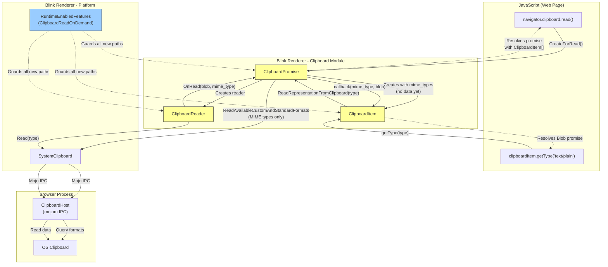
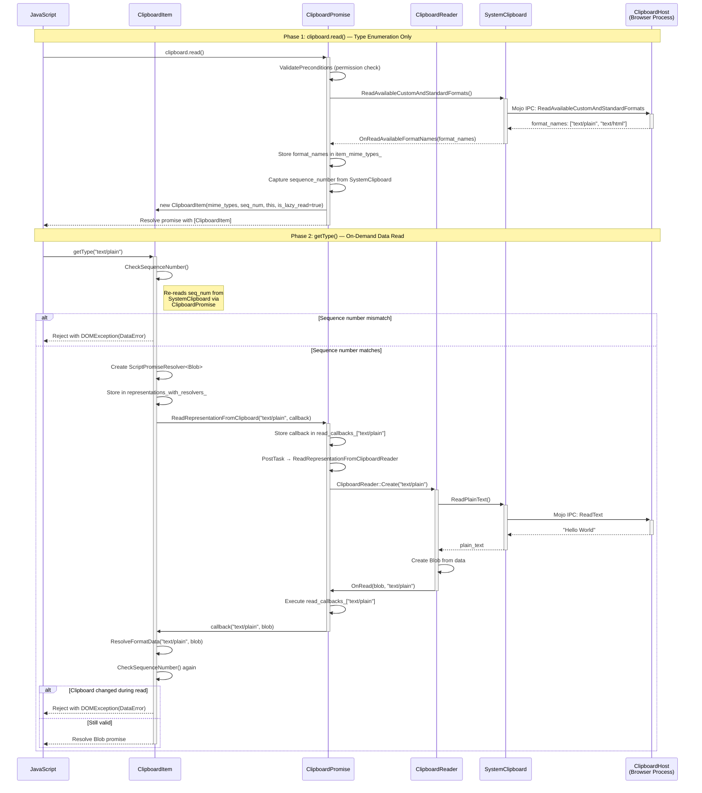
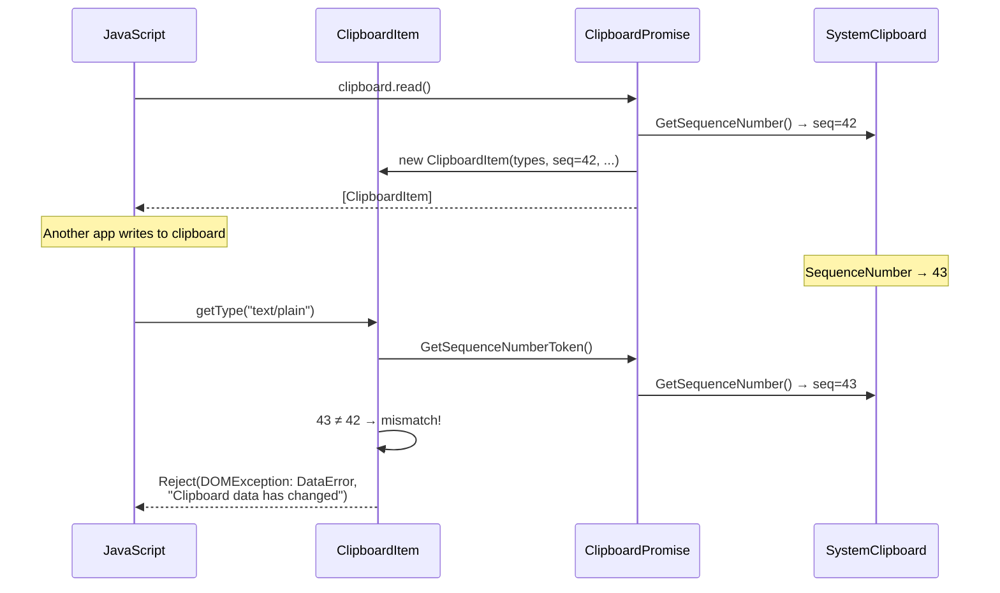

# High-Level Design: [Clipboard] Implementation of Lazy Read

**CL:** [6978530](https://chromium-review.googlesource.com/c/chromium/src/+/6978530)
**Author:** Shweta Bindal (shwetabindal@microsoft.com)
**Bug:** [435051711](https://crbug.com/435051711)
**Status:** NEW (in review, PS15 passes dry run)

---

## 1. Executive Summary

This CL implements **lazy (on-demand) reading** for the Async Clipboard API's `navigator.clipboard.read()` on the renderer side. Today, when `clipboard.read()` is called, Blink eagerly reads **all** clipboard data for every available MIME type from the OS clipboard—even if the web application never calls `getType()` on any of them. This CL changes the behavior so that `clipboard.read()` only fetches the list of available MIME type names (via `ReadAvailableCustomAndStandardFormats`) and defers actual data reading until `ClipboardItem.getType(type)` is explicitly called by JavaScript. This reduces IPC overhead, memory usage, and data exposure, since clipboard data is only read when specifically requested. The change is gated behind a new runtime-enabled feature flag `ClipboardReadOnDemand` (status: `"test"`), ensuring full backward compatibility until the feature is promoted.

---

## 2. Architecture Overview

### 2.1 Affected Chromium Components/Modules

| Component | Path | Role |
|-----------|------|------|
| **ClipboardItem** | `third_party/blink/renderer/modules/clipboard/clipboard_item.{h,cc}` | Web-exposed `ClipboardItem` object; now supports lazy resolution of type data |
| **ClipboardPromise** | `third_party/blink/renderer/modules/clipboard/clipboard_promise.{h,cc}` | Orchestrates clipboard read/write operations; modified to defer data reads |
| **ClipboardReader** | `third_party/blink/renderer/modules/clipboard/clipboard_reader.cc` | Reads specific formats from the system clipboard; new overloaded `OnRead` callback |
| **RuntimeEnabledFeatures** | `third_party/blink/renderer/platform/runtime_enabled_features.json5` | New feature flag `ClipboardReadOnDemand` |
| **MockClipboardHost** | `third_party/blink/renderer/core/testing/mock_clipboard_host.{h,cc}` | Test mock; adds call-tracking for verifying lazy behavior |
| **Unit Tests** | `third_party/blink/renderer/modules/clipboard/clipboard_unittest.cc` | New tests for lazy read behavior |
| **Web Tests** | `third_party/blink/web_tests/clipboard/async-clipboard/async-clipboard-lazy-read.html` | Integration test for clipboard change detection |

### 2.2 Architectural Fit

The Async Clipboard API in Blink follows a layered architecture:

1. **JavaScript API layer** → `Clipboard` (Web IDL bindings)
2. **Promise orchestration** → `ClipboardPromise` (permission checks, sequencing)
3. **Data reading/writing** → `ClipboardReader` / `ClipboardWriter`
4. **System clipboard access** → `SystemClipboard` → Mojo IPC → `ClipboardHost` (browser process)

This CL modifies layers 1–3 to defer step 4 until explicitly needed.

### 2.3 Component Diagram



---

## 3. Design Goals & Non-Goals

### 3.1 Goals

| # | Goal | How Achieved |
|---|------|-------------|
| G1 | **Defer clipboard data reads** until `getType()` is called | `ClipboardPromise` resolves immediately with MIME-type-only `ClipboardItem`; actual IPC read happens in `getType()` |
| G2 | **Detect clipboard changes** between `read()` and `getType()` | Sequence number captured at `read()` time; re-checked at `getType()` time via `CheckSequenceNumber()` |
| G3 | **Verify MIME type availability** before reading | `ClipboardItem` stores `mime_types_` list; `getType()` checks membership before initiating read |
| G4 | **Maintain backward compatibility** | All new code paths gated behind `RuntimeEnabledFeatures::ClipboardReadOnDemandEnabled()` |
| G5 | **Support concurrent `getType()` calls** | Per-MIME-type callback map (`read_callbacks_`) and per-MIME-type promise resolvers (`representations_with_resolvers_`) |

### 3.2 Non-Goals

| # | Non-Goal | Rationale |
|---|----------|-----------|
| N1 | **Browser-process changes** | This CL is renderer-side only; `ClipboardHost` Mojo interface is unchanged |
| N2 | **Shipping to stable** | Feature flag is `"test"` status—not yet enabled for users |
| N3 | **Write-path lazy behavior** | Only `clipboard.read()` is affected; write path is unchanged |
| N4 | **Cross-origin clipboard isolation** | Out of scope; handled by existing permission/security infrastructure |
| N5 | **Lazy read for `readText()`** | Only the `read()` API (which returns `ClipboardItem[]`) is affected |

---

## 4. System Interactions

### 4.1 Existing (Eager) Flow vs. New (Lazy) Flow

**Existing flow:** `clipboard.read()` → permission check → `ReadAvailableFormats` → for each format: `ReadText`/`ReadHtml`/`ReadPng`/etc. → build Blob → resolve `ClipboardItem[]` promise.

**New flow:** `clipboard.read()` → permission check → `ReadAvailableFormats` → resolve `ClipboardItem[]` promise immediately (with type names only). Data read is deferred to `getType()`.

### 4.2 Sequence Diagram — Lazy Read Flow



### 4.3 Sequence Diagram — Clipboard Change Detection



### 4.4 IPC/Mojo Interactions

| Mojo Method | When Called (Eager) | When Called (Lazy) |
|-------------|--------------------|--------------------|
| `ReadAvailableCustomAndStandardFormats` | During `clipboard.read()` | During `clipboard.read()` (unchanged) |
| `ReadText` | During `clipboard.read()` | Only when `getType("text/plain")` is called |
| `ReadHtml` | During `clipboard.read()` | Only when `getType("text/html")` is called |
| `ReadPng` | During `clipboard.read()` | Only when `getType("image/png")` is called |
| `ReadSvg` | During `clipboard.read()` | Only when `getType("image/svg+xml")` is called |
| `ReadCustomData` | During `clipboard.read()` | Only when `getType("web ...")` is called |
| `GetSequenceNumber` | Not used for validation | Called at `getType()` time to validate |

**Key insight:** No new Mojo methods are introduced. The existing `ClipboardHost` interface is reused—calls are simply deferred.

---

## 5. API & Interface Changes

### 5.1 New Public Interfaces

| Class | Method/Member | Description |
|-------|--------------|-------------|
| `ClipboardItem` | `ClipboardItem(HeapVector<String>& mime_types, ...)` | New constructor for lazy-read items (mime types only, no data) |
| `ClipboardPromise` | `ReadRepresentationFromClipboard(format, callback)` | Public method called by `ClipboardItem::getType()` to trigger on-demand reads |
| `ClipboardPromise` | `GetSequenceNumberToken()` | Returns current clipboard sequence number for change detection |
| `ClipboardPromise` | `OnRead(Blob*, const String& mime_type)` | New overload of `OnRead` that routes data to per-MIME-type callbacks |

### 5.2 Modified Interfaces

| Class | Method | Change |
|-------|--------|--------|
| `ClipboardItem::types()` | Returns `mime_types_` instead of `representations_` keys when lazy read is enabled |
| `ClipboardItem::getType()` | When lazy: checks sequence number, creates on-demand resolver, triggers deferred read |
| `ClipboardReader` (all subclasses) | `OnRead` callbacks now dispatch to the new `OnRead(Blob*, String)` overload when feature is enabled |

### 5.3 New Runtime Feature Flag

```json
{
  "name": "ClipboardReadOnDemand",
  "status": "test"
}
```
**Location:** `/workspace/cr4/src/third_party/blink/renderer/platform/runtime_enabled_features.json5`

### 5.4 Web-Facing Behavior Changes

From the web developer's perspective, the API surface (`navigator.clipboard.read()`, `ClipboardItem.getType()`) is **unchanged**. However:

- `getType()` may now throw a `DOMException` with code `DataError` and message `"Clipboard data has changed"` if the clipboard contents were modified between the `read()` and `getType()` calls.
- This is a **new exception path** not present in the eager implementation.

---

## 6. Dependencies

### 6.1 What This Code Depends On

| Dependency | Purpose |
|------------|---------|
| `SystemClipboard::SequenceNumber()` | Clipboard change detection (already exists) |
| `SystemClipboard::ReadAvailableCustomAndStandardFormats()` | MIME type enumeration (already exists) |
| `ClipboardReader::Create()` / `ClipboardReader::Read()` | Format-specific data reading (already exists) |
| `mojom::blink::ClipboardHost` | Mojo interface to browser process clipboard (unchanged) |
| `RuntimeEnabledFeatures` | Feature flag gating mechanism |
| `ScriptPromiseResolver<Blob>` | Per-format promise management |
| `base::OnceCallback` | Callback routing for per-MIME-type reads |

### 6.2 What Depends on This Code

| Dependent | Impact |
|-----------|--------|
| **Async Clipboard API** (JavaScript) | Behavioral change (lazy loading) when flag is enabled |
| **ClipboardReader** subclasses | Must dispatch to correct `OnRead` overload based on feature flag |
| **Web Platform Tests** | `clipboard-item.https.html`, `async-navigator-clipboard-write-domstring.https.html` were initially broken (fixed in later patch sets) |

### 6.3 Version/Compatibility

- **Feature flag status: `"test"`** — Only enabled in test/dev builds, not in stable Chrome.
- All existing behavior is preserved when the flag is off.
- No Mojo interface version changes required.

---

## 7. Risks & Mitigations

### 7.1 Risk Assessment

| # | Risk | Severity | Likelihood | Mitigation |
|---|------|----------|------------|------------|
| R1 | **Clipboard changes between `read()` and `getType()`** cause unexpected errors for web developers | Medium | Medium | Throws explicit `DOMException(DataError)` with clear message; consistent with spec direction |
| R2 | **Race conditions** with concurrent `getType()` calls for different MIME types | High | Medium | Per-MIME-type callback map (`read_callbacks_`) and per-MIME-type promise resolvers (`representations_with_resolvers_`) prevent cross-contamination |
| R3 | **Memory leak** if `ClipboardItem` outlives `ClipboardPromise` | Medium | Low | `ClipboardItem` holds a `Member<ClipboardPromise>` (GC-traced); `ClipboardPromise` is GC-collected properly |
| R4 | **Sequence number check is not atomic** — clipboard could change between the check and the read | Low | Low | Double-check in both `getType()` (before read) and `ResolveFormatData()` (after read) minimizes the window |
| R5 | **Breaking WPT tests** | Medium | Demonstrated | Early patch sets broke `clipboard-item.https.html` and `async-navigator-clipboard-write-domstring.https.html`; resolved by PS13+ |
| R6 | **`ClipboardPromise` lifetime** must survive until all `getType()` calls complete | High | Medium | `ClipboardItem` holds strong `Member<>` reference to `ClipboardPromise`, preventing premature GC |
| R7 | **Feature flag proliferation** — dual code paths increase complexity | Low | Certain | Acceptable for gradual rollout; old paths can be removed once feature ships to stable |

### 7.2 Backward Compatibility

- **Fully backward compatible**: All new logic is gated behind `RuntimeEnabledFeatures::ClipboardReadOnDemandEnabled()`.
- **No breaking changes** when the flag is off (default for stable builds).
- **New DOMException** (`DataError` on clipboard change) is a new observable behavior when the flag is on.

### 7.3 Migration Strategy

1. **Phase 1 (this CL):** Renderer-side implementation behind `"test"` flag.
2. **Phase 2 (future):** Promote flag to `"experimental"` for developer testing.
3. **Phase 3 (future):** Promote to `"stable"` after web compatibility validation.
4. **Phase 4 (future):** Remove feature flag checks and old eager-read code paths.

---

## 8. Testing Strategy

### 8.1 Unit Tests (Added)

| Test | File | What It Verifies |
|------|------|-----------------|
| `ReadOnlyMimeTypesInClipboardRead` | `/workspace/cr4/src/third_party/blink/renderer/modules/clipboard/clipboard_unittest.cc` | During `clipboard.read()`, only `ReadAvailableCustomAndStandardFormats` is called; `ReadText` and `ReadHtml` are **not** called (proves laziness) |
| `ClipboardItemGetTypeTest` | Same file | `getType("text/plain")` triggers `ReadText` via `MockClipboardHost` (proves on-demand read works) |

### 8.2 Web Tests (Added)

| Test | File | What It Verifies |
|------|------|-----------------|
| `Clipboard change detection should throw DataError` | `/workspace/cr4/src/third_party/blink/web_tests/clipboard/async-clipboard/async-clipboard-lazy-read.html` | If clipboard content changes between `read()` and `getType()`, a `DataError` DOMException is thrown |

### 8.3 Test Infrastructure Changes

| Change | File | Purpose |
|--------|------|---------|
| Call-tracking booleans | `mock_clipboard_host.{h,cc}` | `WasReadTextCalled()`, `WasReadHtmlCalled()`, `WasReadAvailableFormatsCalled()` enable asserting which Mojo methods were invoked |
| `ClipboardTest::SetUp()` override | `clipboard_unittest.cc` | Custom mock clipboard host provider for direct host access in tests |

### 8.4 Test Coverage Gaps

| Gap | Severity | Recommendation |
|-----|----------|---------------|
| No test for concurrent `getType()` calls for different MIME types | Medium | Add test calling `getType("text/plain")` and `getType("text/html")` concurrently |
| No test for `getType()` on a type not in the clipboard | Low | Add test verifying `NotFoundError` is thrown for unsupported types |
| No test for `ClipboardItem` GC behavior with lazy read | Low | Add test verifying cleanup when `ClipboardItem` is GC'd before `getType()` |
| No test for `ContextDestroyed` during pending lazy read | Medium | Add test verifying proper rejection when execution context is destroyed mid-read |
| No test verifying sequence number check in `ResolveFormatData` (post-read check) | Medium | Add test where clipboard changes *during* the read operation (after pre-check passes) |

---

## Appendix: Key Code Paths

### A. Lazy Read Entry Point
`ClipboardPromise::OnReadAvailableFormatNames()` at `/workspace/cr4/src/third_party/blink/renderer/modules/clipboard/clipboard_promise.cc` — when `ClipboardReadOnDemand` is enabled, stores MIME types in `item_mime_types_` and calls `ResolveRead()` immediately (skipping `ReadNextRepresentation()`).

### B. On-Demand Read Trigger
`ClipboardItem::getType()` at `/workspace/cr4/src/third_party/blink/renderer/modules/clipboard/clipboard_item.cc` — when lazy, calls `ClipboardPromise::ReadRepresentationFromClipboard()` which posts a task to create a `ClipboardReader` and initiate the actual read.

### C. Data Resolution
`ClipboardItem::ResolveFormatData()` at `/workspace/cr4/src/third_party/blink/renderer/modules/clipboard/clipboard_item.cc` — callback from `ClipboardPromise` after data is read; performs final sequence number validation and resolves or rejects the per-type promise.

### D. Feature Flag
`ClipboardReadOnDemand` at `/workspace/cr4/src/third_party/blink/renderer/platform/runtime_enabled_features.json5` — `status: "test"` means enabled only in test builds and via `--enable-blink-features=ClipboardReadOnDemand`.
