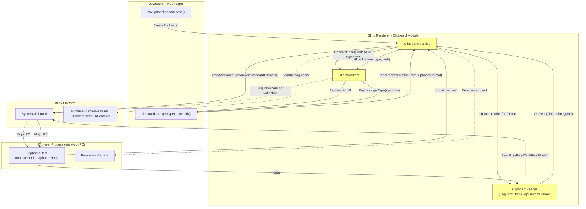
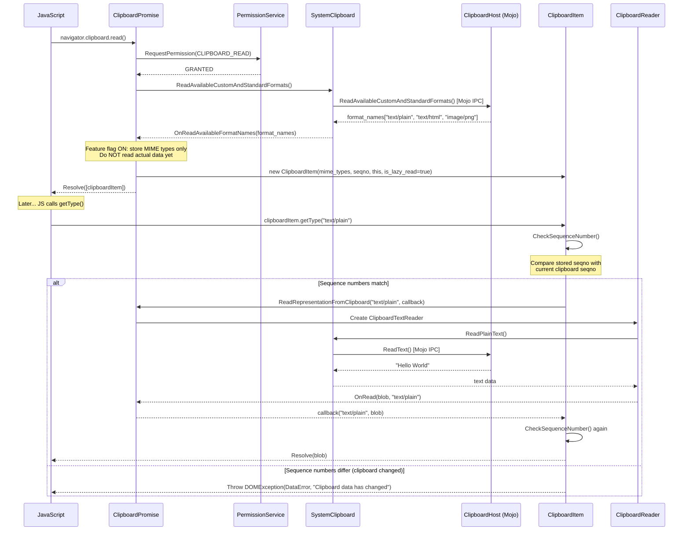
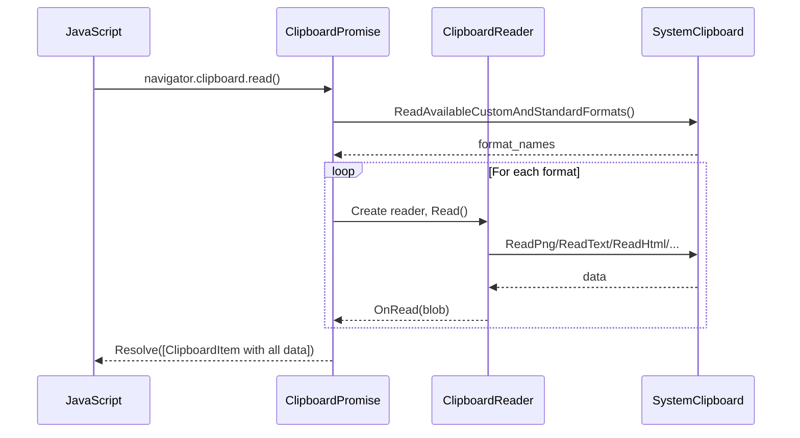
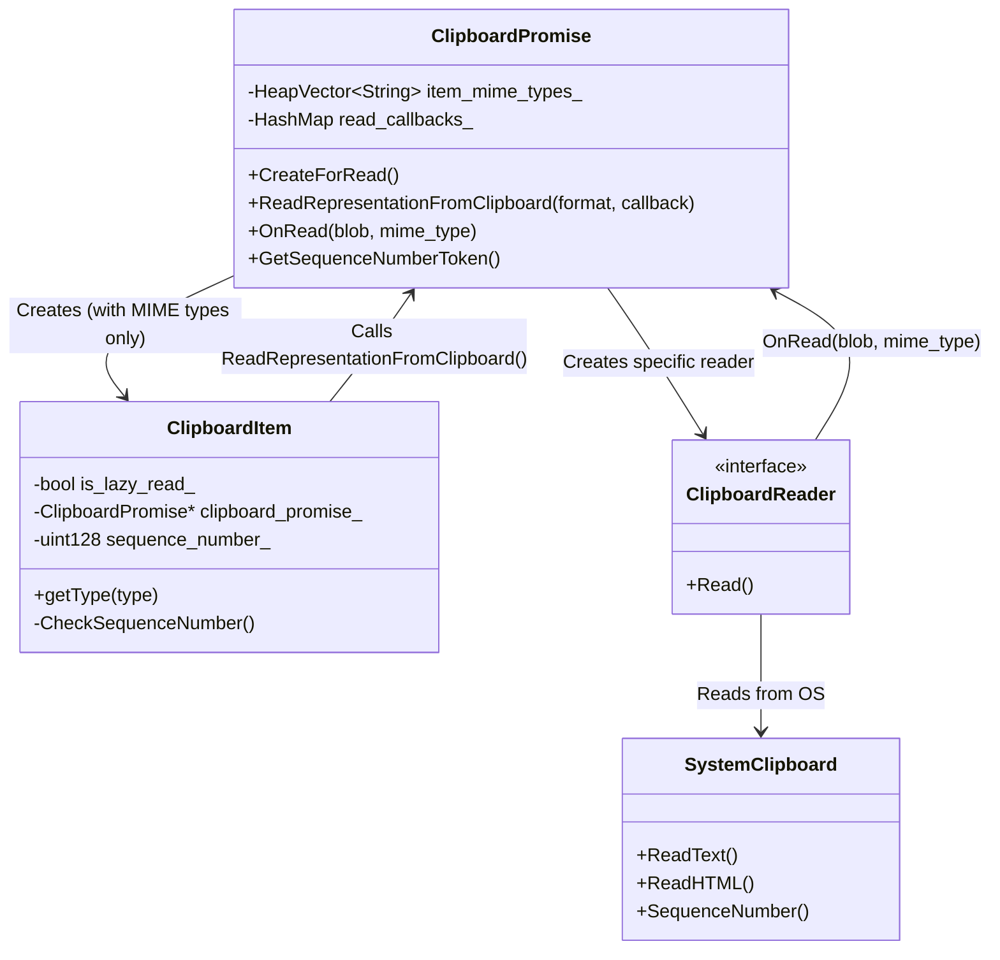
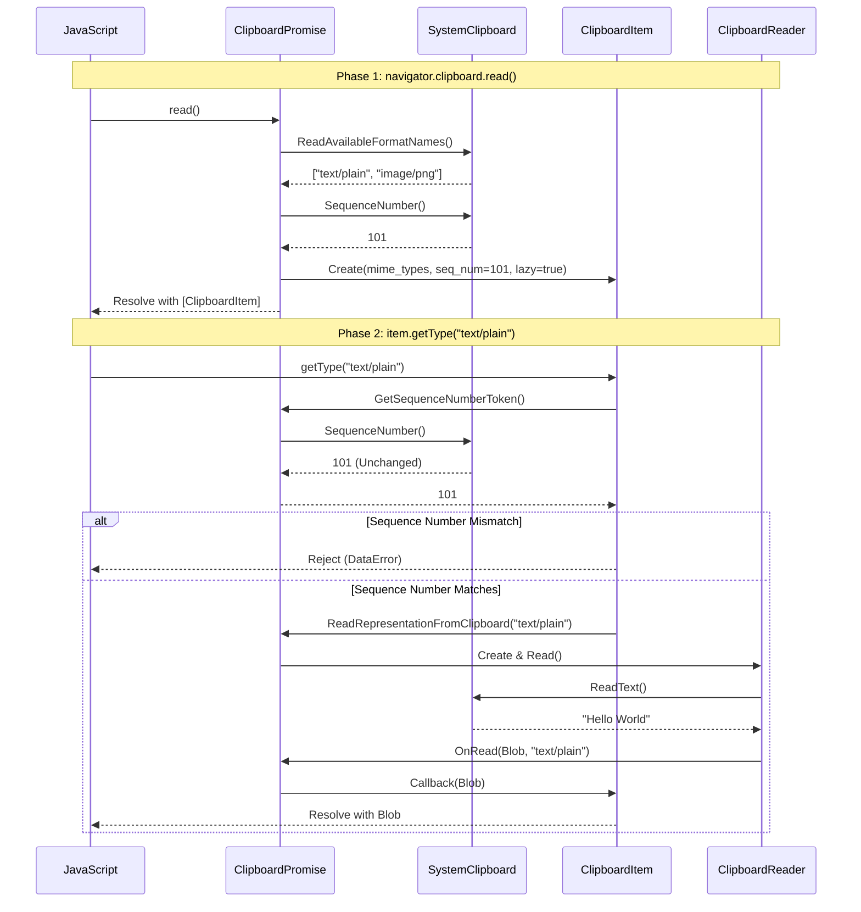
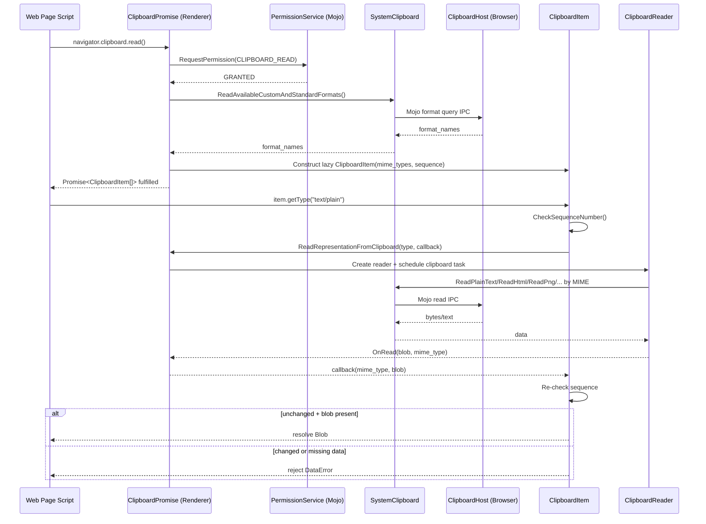

# Hld — Multi-Model Merged Review

> **Models**: claude-opus-4.6-fast, gemini-3-pro-preview, gpt-5.3-codex  
> **Models reporting**: 3/3

---

## 📋 Review by **claude-opus-4.6-fast**

# High-Level Design: [Clipboard] Implementation of Lazy Read

**CL:** [6978530](https://chromium-review.googlesource.com/c/chromium/src/+/6978530)
**Author:** Shweta Bindal (shwetabindal@microsoft.com)
**Bug:** [435051711](https://crbug.com/435051711)
**Status:** NEW (In Review)

---

## 1. Executive Summary

This CL implements **lazy reading** (on-demand data fetching) for the Async Clipboard API in Chromium's Blink renderer. Instead of eagerly reading all clipboard data formats when `navigator.clipboard.read()` is called, the new approach defers actual data retrieval until `ClipboardItem.getType()` is invoked for a specific MIME type. This is gated behind the `ClipboardReadOnDemand` runtime-enabled feature flag (currently `status: "test"`). The change improves performance by avoiding unnecessary clipboard reads for formats the web page never consumes, and adds clipboard-change detection to reject stale reads if the clipboard content changes between `read()` and `getType()`.

---

## 2. Architecture Overview

### Affected Components/Modules

| Component | Role | Impact |
|-----------|------|--------|
| `clipboard_promise.cc/h` | Orchestrates async clipboard read/write operations | **Major**: New lazy read path, sequence number tracking, per-MIME-type callback dispatch |
| `clipboard_item.cc/h` | Represents a `ClipboardItem` exposed to JavaScript | **Major**: New constructor for lazy mode, on-demand `getType()` with sequence number validation |
| `clipboard_reader.cc` | Reads data from system clipboard via Mojo | **Moderate**: Conditional dispatch to new `OnRead(blob, mime_type)` overload |
| `mock_clipboard_host.cc/h` | Mock for testing clipboard Mojo host | **Minor**: Method call tracking (`WasReadTextCalled`, etc.) |
| `clipboard_unittest.cc` | Unit tests | **Minor**: New test cases for lazy read behavior |
| `runtime_enabled_features.json5` | Feature flag definitions | **Minor**: New `ClipboardReadOnDemand` feature flag |
| `async-clipboard-lazy-read.html` | Web platform test | **New**: Tests clipboard change detection with lazy read |

### Component Diagram



### How It Fits Into Existing Architecture

The Async Clipboard API already follows a pipeline: `Clipboard` → `ClipboardPromise` → `ClipboardReader` → `SystemClipboard` → `ClipboardHost` (Mojo). This CL inserts a **deferred read** step between `ClipboardPromise.ResolveRead()` and the actual `ClipboardReader.Read()` call. Previously, all formats were read eagerly in `ReadNextRepresentation()` before resolving. Now, when `ClipboardReadOnDemand` is enabled, the promise resolves immediately with only MIME type metadata, and data is fetched on-demand via `getType()`.

---

## 3. Design Goals & Non-Goals

### Goals

1. **Lazy/On-Demand Reading**: Defer actual clipboard data retrieval until `ClipboardItem.getType()` is called, avoiding unnecessary reads for unused formats.
2. **Clipboard Change Detection**: Detect if clipboard content changes between `read()` and `getType()`, and reject with `DataError` if so (using sequence number comparison).
3. **MIME Type Verification**: Verify that the requested MIME type is still present in the OS clipboard before returning data.
4. **Feature-Flagged Rollout**: Gate the behavior behind `ClipboardReadOnDemand` (status: `"test"`) for safe incremental rollout.
5. **Backward Compatibility**: When the feature flag is disabled, the existing eager-read behavior is fully preserved.

### Non-Goals

- **Browser-process changes**: This CL is renderer-side only; no changes to the Mojo `ClipboardHost` interface or browser-process clipboard implementation.
- **Write-side lazy behavior**: Only the read path is affected; clipboard write operations are unchanged.
- **Cross-origin clipboard isolation**: Not addressed in this CL.
- **ReadText lazy loading**: `navigator.clipboard.readText()` is not affected; it continues to read synchronously.
- **New Mojo APIs**: No new Mojo messages are introduced; existing `ReadAvailableCustomAndStandardFormats`, `ReadPng`, `ReadText`, `ReadHtml`, etc. are reused.

---

## 4. System Interactions

### Main Flow: Lazy Read



### Eager Read Flow (Feature Flag OFF — Existing Behavior)



### IPC/Mojo Interactions

No new Mojo interfaces are introduced. The existing `mojom::blink::ClipboardHost` interface methods are reused:
- `ReadAvailableCustomAndStandardFormats()` — called during `read()` in both modes
- `ReadText()`, `ReadHtml()`, `ReadPng()`, `ReadSvg()`, `ReadUnsanitizedCustomFormat()` — called during `getType()` in lazy mode (previously during `read()`)
- `GetSequenceNumber()` — used for clipboard change detection via `SystemClipboard::SequenceNumber()`

---

## 5. API & Interface Changes

### New Public Interfaces

| Class | Method/Constructor | Description |
|-------|-------------------|-------------|
| `ClipboardItem` | `ClipboardItem(HeapVector<String>& mime_types, uint128 seqno, ClipboardPromise*, bool is_lazy_read)` | New constructor for lazy-read mode; stores only MIME type names without data. `/workspace/cr1/src/third_party/blink/renderer/modules/clipboard/clipboard_item.h#L53` |
| `ClipboardPromise` | `ReadRepresentationFromClipboard(format, callback)` | Public method for `ClipboardItem` to request on-demand data reading. `/workspace/cr1/src/third_party/blink/renderer/modules/clipboard/clipboard_promise.h#L116` |
| `ClipboardPromise` | `GetSequenceNumberToken()` | Returns current clipboard sequence number for change detection. `/workspace/cr1/src/third_party/blink/renderer/modules/clipboard/clipboard_promise.h#L113` |
| `ClipboardPromise` | `OnRead(Blob*, const String& mime_type)` | New overload that dispatches blob to the per-MIME-type callback. `/workspace/cr1/src/third_party/blink/renderer/modules/clipboard/clipboard_promise.h#L104` |

### Modified Interfaces

| Class | Method | Change |
|-------|--------|--------|
| `ClipboardItem::getType()` | Modified | Now supports lazy-read path: creates a `ScriptPromiseResolver`, stores it in `representations_with_resolvers_`, and calls `ReadRepresentationFromClipboard()`. `/workspace/cr1/src/third_party/blink/renderer/modules/clipboard/clipboard_item.cc#L162` |
| `ClipboardItem::types()` | Modified | Returns `mime_types_` (just type names) in lazy mode instead of extracting from `representations_`. `/workspace/cr1/src/third_party/blink/renderer/modules/clipboard/clipboard_item.cc#L124` |
| `ClipboardPromise::ResolveRead()` | Modified | In lazy mode, constructs `ClipboardItem` with only MIME types (no data blobs). `/workspace/cr1/src/third_party/blink/renderer/modules/clipboard/clipboard_promise.cc#L407` |
| `ClipboardPromise::OnReadAvailableFormatNames()` | Modified | In lazy mode, stores format names in `item_mime_types_` and resolves immediately. `/workspace/cr1/src/third_party/blink/renderer/modules/clipboard/clipboard_promise.cc#L449` |

### New Private Members

| Class | Member | Purpose |
|-------|--------|---------|
| `ClipboardItem` | `HeapHashMap<String, Member<ScriptPromiseResolver<Blob>>> representations_with_resolvers_` | Tracks pending `getType()` promises per MIME type |
| `ClipboardItem` | `HeapVector<String> mime_types_` | Stores MIME type names for lazy-read mode |
| `ClipboardItem` | `bool is_lazy_read_` | Indicates whether this item uses lazy reading |
| `ClipboardItem` | `Member<ClipboardPromise> clipboard_promise_` | Back-reference to the promise for on-demand reads |
| `ClipboardPromise` | `HeapVector<String> item_mime_types_` | MIME types from clipboard for lazy-mode resolution |
| `ClipboardPromise` | `HashMap<String, OnceCallback> read_callbacks_` | Per-MIME-type callbacks to avoid race conditions |

### Deprecated Interfaces

None. The existing eager-read path remains fully functional when `ClipboardReadOnDemand` is disabled.

---

## 6. Dependencies

### What This Code Depends On

| Dependency | Type | Details |
|------------|------|---------|
| `RuntimeEnabledFeatures::ClipboardReadOnDemandEnabled()` | Feature flag | Gates all lazy-read behavior; `status: "test"` |
| `SystemClipboard::SequenceNumber()` | Platform API | Used for clipboard change detection |
| `SystemClipboard::ReadAvailableCustomAndStandardFormats()` | Mojo IPC | Retrieves available MIME types without reading data |
| `mojom::blink::ClipboardHost` | Mojo interface | Existing clipboard host in the browser process |
| `ClipboardReader` subclasses | Internal | Existing readers (Png, Text, Html, Svg, CustomFormat) are reused |
| `ScriptPromiseResolver<Blob>` | Blink bindings | Used for deferred promise resolution in `getType()` |

### What Depends On This Code

| Dependent | Impact |
|-----------|--------|
| Web pages using `navigator.clipboard.read()` + `ClipboardItem.getType()` | Behavior changes when feature flag is enabled: data fetched on-demand |
| `ClipboardItemGetTypeCounter` feature | Telemetry for `getType()` timing remains compatible |
| `SelectiveClipboardFormatRead` feature | Compatible; format filtering still applied during `OnReadAvailableFormatNames()` |

### Version/Compatibility Considerations

- The feature is gated behind `ClipboardReadOnDemand` with `status: "test"`, meaning it is **not enabled by default** in production. It can be activated via `--enable-blink-features=ClipboardReadOnDemand` or `chrome://flags`.
- No breaking changes to the Web API surface; the `ClipboardItem` and `getType()` APIs remain spec-compliant.
- The `getType()` method now throws `DOMException(DataError)` if clipboard content changed — this is new observable behavior for web developers when the flag is enabled.

---

## 7. Risks & Mitigations

### Risk Assessment

| Risk | Severity | Likelihood | Mitigation |
|------|----------|------------|------------|
| **Clipboard data changes between `read()` and `getType()`** | Medium | Medium | Sequence number check in `ClipboardItem::CheckSequenceNumber()` detects changes and rejects with `DataError`. Double-checked both before and after reading data. |
| **Race conditions with concurrent `getType()` calls** | Medium | Low | Per-MIME-type callback map (`read_callbacks_`) in `ClipboardPromise` ensures each `getType()` call has its own callback. Separate `ScriptPromiseResolver` per type in `representations_with_resolvers_`. |
| **Memory leaks from unresolved promises** | Low | Low | `ClipboardPromise` is garbage-collected and observes `ExecutionContextLifecycleObserver`. Unresolved resolvers will be collected when the context is destroyed. |
| **Feature flag interaction with `ClipboardItemGetTypeCounter`** | Low | Low | Both features check independently; lazy-read path still calls `CaptureTelemetry()` when counter is enabled. |
| **`ClipboardItem` holding a strong reference to `ClipboardPromise`** | Medium | Low | Uses `Member<ClipboardPromise>` which is GC-traced. However, this creates a reference cycle (`ClipboardPromise` → `ClipboardItem` via resolver, `ClipboardItem` → `ClipboardPromise`). The GC's cycle collector should handle this, but it warrants attention. |
| **`getType()` called after execution context destroyed** | Low | Low | `ReadRepresentationFromClipboard()` checks `GetExecutionContext()` before proceeding. |
| **Stale `ClipboardReader` reference** | Low | Low | `clipboard_reader_` is overwritten on each read; previous reader is cleared. If multiple `getType()` calls are in-flight, only the last reader is tracked. Per-MIME-type callbacks mitigate data routing issues, but the single `clipboard_reader_` member could be a concern for concurrent reads. |

### Backward Compatibility

- **No breaking changes** when feature flag is OFF (default). All existing code paths are preserved.
- When flag is ON, `getType()` may now throw `DataError` for clipboard changes — a new failure mode that web apps must handle.
- The `types()` method returns the same values in both modes, so feature detection by web pages is transparent.

### Migration Strategy

No migration needed. The feature is additive and feature-flagged. When ready for production:
1. Change `status` from `"test"` to `"stable"` in `runtime_enabled_features.json5`
2. Monitor telemetry (`Blink.Clipboard.Read.NumberOfFormats`, UseCounter metrics)
3. Web platform tests validate the new behavior

---

## 8. Testing Strategy

### Unit Tests (`clipboard_unittest.cc`)

| Test | What It Validates |
|------|-------------------|
| `ReadOnlyMimeTypesInClipboardRead` | Verifies lazy loading: `read()` calls `ReadAvailableCustomAndStandardFormats()` but NOT `ReadText()` or `ReadHtml()`. Confirms data is not eagerly fetched. `/workspace/cr1/src/third_party/blink/renderer/modules/clipboard/clipboard_unittest.cc#L264` |
| `ClipboardItemGetTypeTest` | Verifies `getType("text/plain")` triggers actual data read (`WasReadTextCalled()`). Validates end-to-end lazy-read + on-demand fetch. `/workspace/cr1/src/third_party/blink/renderer/modules/clipboard/clipboard_unittest.cc#L302` |
| `SelectiveClipboardFormatRead` | Existing test; validates format filtering still works. `/workspace/cr1/src/third_party/blink/renderer/modules/clipboard/clipboard_unittest.cc#L178` |
| `ReadAllClipboardFormats` | Existing test; validates all formats returned when no filter. `/workspace/cr1/src/third_party/blink/renderer/modules/clipboard/clipboard_unittest.cc#L221` |

### Web Platform Tests

| Test | What It Validates |
|------|-------------------|
| `async-clipboard-lazy-read.html` | End-to-end test: writes text, reads clipboard items, changes clipboard, then verifies `getType()` throws `DataError`. `/workspace/cr1/src/third_party/blink/web_tests/clipboard/async-clipboard/async-clipboard-lazy-read.html` |

### Mock Infrastructure

- `MockClipboardHost` enhanced with call tracking booleans (`read_text_called_`, `read_html_called_`, `read_available_formats_called_`) to verify which clipboard operations were actually invoked.
- `OnClipboardDataChanged()` method added to simulate clipboard content changes for testing sequence number validation.

### Recommended Additional Test Coverage

| Area | Recommended Test |
|------|-----------------|
| Concurrent `getType()` calls | Call `getType("text/plain")` and `getType("text/html")` simultaneously; verify both resolve correctly |
| `getType()` for unsupported type | Verify `NotFoundError` is thrown for types not in `mime_types_` |
| Clipboard change during data read | Simulate clipboard change between `ReadRepresentationFromClipboard` dispatch and `OnRead` callback |
| Context destruction during lazy read | Destroy execution context while `getType()` promise is pending |
| Multiple `getType()` for same MIME type | Call `getType("text/plain")` twice; verify both return the same resolver/promise |
| Feature flag OFF behavior | Verify eager-read path is unchanged when `ClipboardReadOnDemand` is disabled |


---

## 📋 Review by **gemini-3-pro-preview**

# High-Level Design: Clipboard Lazy Read

## 1. Executive Summary

This CL implements a "lazy read" mechanism for the Async Clipboard API (`navigator.clipboard.read()`). Currently, `read()` aggressively reads all available data formats from the system clipboard into memory, which can be inefficient for large payloads or when the user only needs a specific format. The new implementation defers the actual data retrieval until `ClipboardItem.getType()` is called. This change reduces memory usage and improves performance for clipboard read operations. It ensures data consistency by verifying the clipboard sequence number has not changed between the initial metadata read and the subsequent data retrieval.

## 2. Architecture Overview

The change primarily affects the Blink renderer's Clipboard module. It introduces a feedback loop where `ClipboardItem` delegates data fetching back to `ClipboardPromise` on demand.

### Mermaid Component Diagram



## 3. Design Goals & Non-Goals

### Design Goals
*   **Performance**: Avoid reading potentially large data (like images) if the web page doesn't request them.
*   **Consistency**: Ensure that the data read via `getType()` corresponds to the same clipboard state as when `read()` was called. If the clipboard content changes in between, the read should fail.
*   **Backward Compatibility**: The public API surface remains unchanged; the optimization is internal.

### Non-Goals
*   Changing the `navigator.clipboard.write()` behavior.
*   Supporting lazy reading for legacy `document.execCommand('paste')`.

## 4. System Interactions

The flow changes from an eager "read all" to a two-phase "list formats" then "read specific format" approach.

### Mermaid Sequence Diagram



## 5. API & Interface Changes

### New/Modified Internal Interfaces

*   **`ClipboardPromise`**:
    *   `ReadRepresentationFromClipboard(format, callback)`: Triggers an on-demand read.
    *   `OnRead(blob, mime_type)`: New overload to handle specific format responses.
    *   `GetSequenceNumberToken()`: Helper to retrieve the current clipboard sequence number.
*   **`ClipboardItem`**:
    *   Constructor updated to accept `ClipboardPromise*` and `is_lazy_read` flag.
    *   `getType()` logic branched to support lazy loading.

### Public API
*   No changes to the Web IDL. The behavior of `ClipboardItem.types` and `ClipboardItem.getType()` remains compliant with the spec, but `getType()` may now reject with `DataError` if the clipboard has changed since the `ClipboardItem` was created.

## 6. Dependencies

*   **Blink**: `third_party/blink/renderer/modules/clipboard`
*   **Runtime Feature**: Depends on `RuntimeEnabledFeatures::ClipboardReadOnDemandEnabled()`.
*   **System Clipboard**: Relies on the underlying platform's clipboard sequence number implementation (available on Windows, Mac, Linux, CrOS).

## 7. Risks & Mitigations

### Risks
*   **Clipboard Race Conditions**: The user might copy something new between `read()` and `getType()`.
    *   *Mitigation*: The implementation checks the clipboard sequence number. If it has changed, `getType()` rejects. This is the correct behavior for consistency, though it might cause sporadic failures in highly active clipboard environments (unlikely for typical user interaction).
*   **Memory Management**: Keeping `ClipboardPromise` alive via `ClipboardItem` might extend the lifetime of related objects.
    *   *Mitigation*: `ClipboardPromise` is a `garbage_collected` object. Standard Blink GC handles cycles.

### Backward Compatibility
*   The feature is gated behind `ClipboardReadOnDemand`. It can be disabled if issues arise.

## 8. Testing Strategy

### Automated Tests
*   **Unit Tests (`clipboard_unittest.cc`)**:
    *   `ReadOnlyMimeTypesInClipboardRead`: Verifies that `read()` only fetches formats and not data.
    *   `ClipboardItemGetTypeTest`: Verifies that `getType()` triggers the data fetch.
*   **Web Tests**:
    *   `async-clipboard-lazy-read.html`: Verifies behavior when clipboard changes between `read()` and `getType()`.

### Manual Testing
*   Verify behavior with large images (copy image, run code that reads it).
*   Verify behavior when clipboard changes (copy text A, run script that gets item, copy text B, script calls `getType` -> should fail).


---

## 📋 Review by **gpt-5.3-codex**

# High-Level Design Review: CL 6978530 — `[Clipboard] Implementation of lazy read`

CL: https://chromium-review.googlesource.com/c/chromium/src/+/6978530

## 1. Executive Summary

This CL introduces renderer-side lazy clipboard reads for `navigator.clipboard.read()`: instead of eagerly reading all clipboard payload bytes, Blink first reads only available MIME types, returns `ClipboardItem` metadata, and defers data transfer until `ClipboardItem.getType(type)` is called. It is needed to reduce unnecessary clipboard reads, align behavior with on-demand access, and guard correctness under clipboard mutation by validating sequence numbers before and after deferred reads. Expected impact is lower read-time work for multi-format clipboards, clearer `DataError` failure semantics when clipboard content changes, and test-gated rollout via `ClipboardReadOnDemand`.

## 2. Architecture Overview

Affected renderer modules are the Async Clipboard pipeline in Blink: `ClipboardPromise` (read orchestration), `ClipboardItem` (web-exposed item object), and `ClipboardReader` (format-specific blob extraction), plus test infrastructure (`MockClipboardHost`, unit/web tests) and runtime feature plumbing (`ClipboardReadOnDemand`) (`/workspace/cr1/src/third_party/blink/renderer/modules/clipboard/clipboard_promise.cc#L403`, `/workspace/cr1/src/third_party/blink/renderer/modules/clipboard/clipboard_item.cc#L162`, `/workspace/cr1/src/third_party/blink/renderer/modules/clipboard/clipboard_reader.cc#L54`, `/workspace/cr1/src/third_party/blink/renderer/platform/runtime_enabled_features.json5#L1080`).

With the feature enabled, `ClipboardPromise::ResolveRead()` now constructs a lazy `ClipboardItem` with MIME list + clipboard sequence token instead of preloading all `Blob`s (`/workspace/cr1/src/third_party/blink/renderer/modules/clipboard/clipboard_promise.cc#L418`). `ClipboardItem::getType()` then drives targeted reads through `ClipboardPromise::ReadRepresentationFromClipboard()` and resolves/rejects per-MIME promise resolvers (`/workspace/cr1/src/third_party/blink/renderer/modules/clipboard/clipboard_item.cc#L190`, `/workspace/cr1/src/third_party/blink/renderer/modules/clipboard/clipboard_promise.cc#L361`).

```mermaid
flowchart LR
    JS[Web page JS\nnavigator.clipboard.read/getType]
    CP[ClipboardPromise\nrenderer/modules/clipboard]
    CI[ClipboardItem\nlazy metadata + resolver map]
    CR[ClipboardReader\nper-format reader]
    SC[SystemClipboard\ncore/clipboard]
    CH[mojom::ClipboardHost\n(browser process)]
    PS[mojom::PermissionService]
    RF[RuntimeEnabledFeatures\nClipboardReadOnDemand]

    JS --> CP
    CP --> PS
    CP --> SC
    SC <--> CH
    CP --> CI
    JS --> CI
    CI --> CP
    CP --> CR --> SC
    RF -. gates lazy path .-> CP
    RF -. gates lazy path .-> CI
    RF -. gates callback routing .-> CR
```

## 3. Design Goals & Non-Goals

### Goals
- Enable on-demand payload reads for Async Clipboard read flow (enumerate types first, fetch data on `getType`) (`/workspace/cr1/src/third_party/blink/renderer/modules/clipboard/clipboard_promise.cc#L463`).
- Ensure data consistency by rejecting reads when clipboard content changes, using sequence number checks (`/workspace/cr1/src/third_party/blink/renderer/modules/clipboard/clipboard_item.cc#L180`, `/workspace/cr1/src/third_party/blink/renderer/modules/clipboard/clipboard_item.cc#L210`).
- Keep compatibility with existing eager behavior behind a runtime flag fallback path (`/workspace/cr1/src/third_party/blink/renderer/modules/clipboard/clipboard_promise.cc#L425`).
- Prevent callback races for concurrent deferred reads via per-format callback tracking (`/workspace/cr1/src/third_party/blink/renderer/modules/clipboard/clipboard_promise.h#L218`).

### Non-Goals
- No redesign of clipboard write flows (`write()`, `writeText()`) or their permission semantics.
- No browser-process protocol changes to `ClipboardHost`; the CL reuses existing available-format and format-read calls.
- No spec/API surface addition in JavaScript (behavioral change within existing `ClipboardItem.getType`).

## 4. System Interactions

The main interaction chain remains renderer-driven with Mojo-backed clipboard and permissions. `ClipboardPromise` still requests clipboard-read permission and format enumeration first, but with lazy read enabled it resolves the read promise earlier (after MIME discovery), then issues per-format read IPC only when the page requests a type (`/workspace/cr1/src/third_party/blink/renderer/modules/clipboard/clipboard_promise.cc#L403`, `/workspace/cr1/src/third_party/blink/renderer/modules/clipboard/clipboard_promise.cc#L483`).



Key IPC/Mojo touchpoints:
- Permission request: `/workspace/cr1/src/third_party/blink/renderer/modules/clipboard/clipboard_promise.cc#L804`
- Available format enumeration: `/workspace/cr1/src/third_party/blink/renderer/modules/clipboard/clipboard_promise.cc#L403`
- Deferred format reads routed by MIME: `/workspace/cr1/src/third_party/blink/renderer/modules/clipboard/clipboard_reader.cc#L124`, `/workspace/cr1/src/third_party/blink/renderer/modules/clipboard/clipboard_reader.cc#L324`

## 5. API & Interface Changes

### New interfaces / methods (Blink C++ internal)
- `ClipboardItem` lazy-read constructor with MIME list + sequence + back-pointer to `ClipboardPromise`:
  - `/workspace/cr1/src/third_party/blink/renderer/modules/clipboard/clipboard_item.h#L53`
- `ClipboardPromise::ReadRepresentationFromClipboard(...)` for on-demand format reads:
  - `/workspace/cr1/src/third_party/blink/renderer/modules/clipboard/clipboard_promise.h#L116`
- `ClipboardPromise::GetSequenceNumberToken()` for consistency checks:
  - `/workspace/cr1/src/third_party/blink/renderer/modules/clipboard/clipboard_promise.h#L113`
- MIME-aware read callback path `OnRead(blob, mime_type)`:
  - `/workspace/cr1/src/third_party/blink/renderer/modules/clipboard/clipboard_promise.h#L104`

### Modified interfaces / behavior
- `ClipboardItem::types()` now returns pre-enumerated MIME names in lazy mode instead of deriving from eagerly-materialized representations (`/workspace/cr1/src/third_party/blink/renderer/modules/clipboard/clipboard_item.cc#L124`).
- `ClipboardItem::getType()` now:
  - validates sequence number before scheduling read,
  - enforces requested MIME exists in enumerated set,
  - reuses per-type resolver promises,
  - can reject with `DataError` if clipboard changed (`/workspace/cr1/src/third_party/blink/renderer/modules/clipboard/clipboard_item.cc#L179`).
- `ClipboardPromise::ResolveRead()` conditionally returns lazy vs eager items based on runtime flag (`/workspace/cr1/src/third_party/blink/renderer/modules/clipboard/clipboard_promise.cc#L418`).

### Deprecated/removed
- None in this CL.

## 6. Dependencies

### Upstream dependencies this CL relies on
- `RuntimeEnabledFeatures::ClipboardReadOnDemandEnabled` feature gate (`/workspace/cr1/src/third_party/blink/renderer/platform/runtime_enabled_features.json5#L1080`).
- `SystemClipboard` sequence numbers for mutation detection (`/workspace/cr1/src/third_party/blink/renderer/modules/clipboard/clipboard_promise.cc#L832`).
- Existing clipboard read entrypoints and MIME support checks in `ClipboardReader` / `ClipboardItem::supports` (`/workspace/cr1/src/third_party/blink/renderer/modules/clipboard/clipboard_reader.cc#L342`, `/workspace/cr1/src/third_party/blink/renderer/modules/clipboard/clipboard_item.cc#L220`).
- Mojo `PermissionService` and `ClipboardHost` connectivity via browser interface broker.

### Downstream dependents
- Async Clipboard web API behavior in renderer (`navigator.clipboard.read()` + `ClipboardItem.getType()`).
- Blink unit tests and web tests validating lazy behavior (`/workspace/cr1/src/third_party/blink/renderer/modules/clipboard/clipboard_unittest.cc#L264`, `/workspace/cr1/src/third_party/blink/web_tests/clipboard/async-clipboard/async-clipboard-lazy-read.html#L14`).

### Version/compatibility considerations
- Rollout is controlled by a `status: "test"` runtime feature, preserving existing eager semantics when disabled.
- No wire-format or API version bump required because browser IPC methods are reused.

## 7. Risks & Mitigations

- **Risk: stale data race between `read()` and `getType()`**.  
  **Mitigation:** sequence check before read scheduling and again during resolution; reject with `DataError` on mismatch (`/workspace/cr1/src/third_party/blink/renderer/modules/clipboard/clipboard_item.cc#L180`, `#L152`).

- **Risk: duplicate/concurrent `getType()` requests causing resolver races**.  
  **Mitigation:** resolver map in `ClipboardItem` and callback map keyed by MIME in `ClipboardPromise` (`/workspace/cr1/src/third_party/blink/renderer/modules/clipboard/clipboard_item.h#L94`, `/workspace/cr1/src/third_party/blink/renderer/modules/clipboard/clipboard_promise.h#L220`).

- **Risk: lifecycle leaks when context is destroyed with pending reads**.  
  **Mitigation:** execution-context guards and clearing retained reader in `ContextDestroyed()` (`/workspace/cr1/src/third_party/blink/renderer/modules/clipboard/clipboard_promise.cc#L845`).

- **Backward compatibility concern:** behavior changes from eager to lazy could affect timing-sensitive tests/callers.  
  **Mitigation:** feature-flag gating and test-specific validation before broad enablement.

- **Migration strategy:** no API migration for embedders/web developers; enable feature incrementally, monitor regressions (especially WPT and Blink clipboard tests), then graduate flag status.

## 8. Testing Strategy

### Added/updated tests in CL
- **Blink unit test: lazy read does not eagerly fetch payloads** (`ReadOnlyMimeTypesInClipboardRead`) verifies only format enumeration is called (`/workspace/cr1/src/third_party/blink/renderer/modules/clipboard/clipboard_unittest.cc#L264`).
- **Blink unit test: `getType()` triggers deferred read path** (`ClipboardItemGetTypeTest`) verifies deferred `ReadText` call is made (`/workspace/cr1/src/third_party/blink/renderer/modules/clipboard/clipboard_unittest.cc#L302`).
- **Web test: clipboard mutation rejection semantics** ensures `getType()` rejects with `DataError` if clipboard changes after `read()` (`/workspace/cr1/src/third_party/blink/web_tests/clipboard/async-clipboard/async-clipboard-lazy-read.html#L31`).
- **Mock instrumentation** in `MockClipboardHost` tracks whether eager read APIs were invoked (`/workspace/cr1/src/third_party/blink/renderer/core/testing/mock_clipboard_host.h#L47`, `/workspace/cr1/src/third_party/blink/renderer/core/testing/mock_clipboard_host.cc#L120`).

### Recommended coverage focus for CQ/rollout
- Re-run `blink_unittests` clipboard suite and async clipboard web tests with `ClipboardReadOnDemand` enabled.
- Keep selective-format read tests to ensure interaction with `ClipboardReadOptions` remains correct (`/workspace/cr1/src/third_party/blink/renderer/modules/clipboard/clipboard_promise.cc#L456`).
- Track flakiness around timing/order (deferred task posting on `TaskType::kClipboard`) and sequence-change edge cases.


---

## 🔀 Cross-Model Summary

This document merges reviews from **3** models: claude-opus-4.6-fast, gemini-3-pro-preview, gpt-5.3-codex.

### Model Coverage

| Model | Contributed |
|-------|------------|
| claude-opus-4.6-fast | ✅ Yes |
| gemini-3-pro-preview | ✅ Yes |
| gpt-5.3-codex | ✅ Yes |
