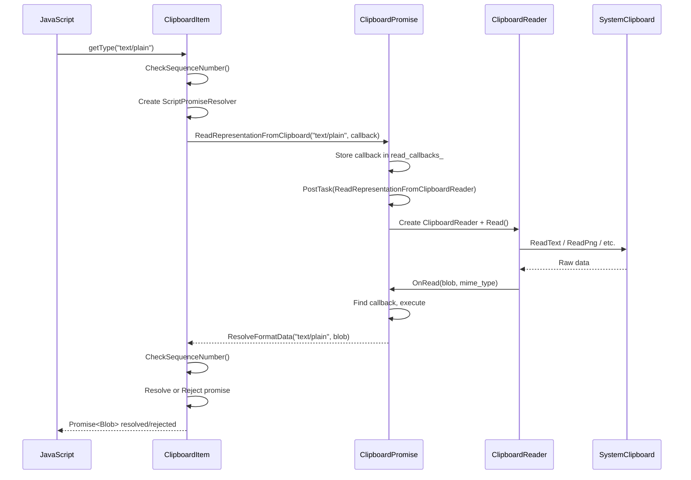
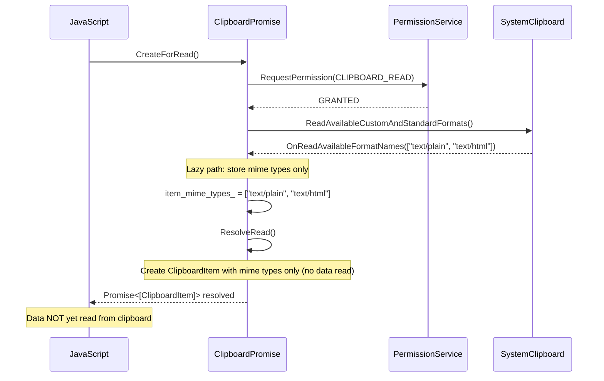
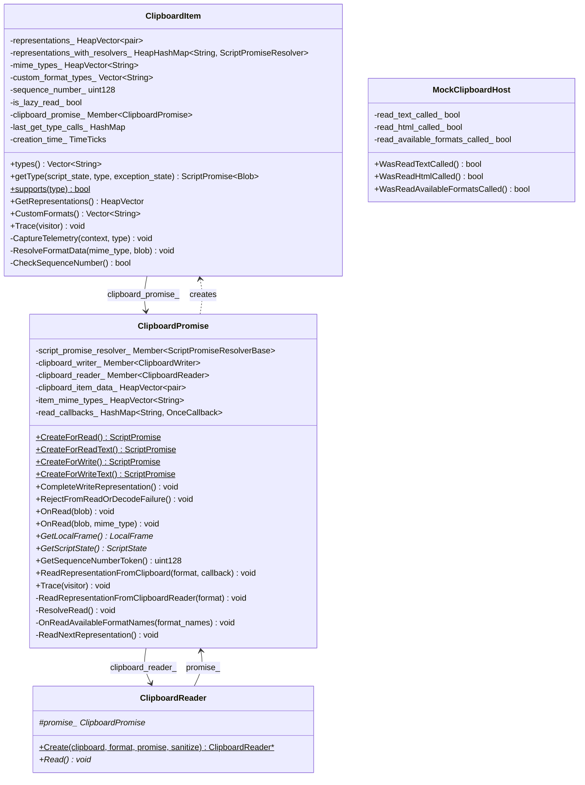
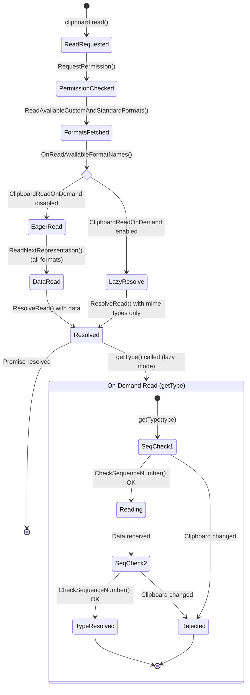

# Low-Level Design Review: CL 6978530 — [Clipboard] Implementation of Lazy Read

**CL URL:** https://chromium-review.googlesource.com/c/chromium/src/+/6978530
**Author:** Shweta Bindal <shwetabindal@microsoft.com>
**Status:** NEW (Patch Set 15)
**Bug:** [435051711](https://crbug.com/435051711)

## Summary

This CL implements "lazy read" for the Async Clipboard API. Instead of eagerly
reading all clipboard data formats when `navigator.clipboard.read()` is called,
data is read on-demand only when `ClipboardItem.getType()` is invoked for a
specific MIME type. This is gated behind the `ClipboardReadOnDemand` runtime
feature flag (status: `"test"`).

---

## 1. File-by-File Analysis

---

### 1.1 `clipboard_item.h`

**Purpose of changes**: Extends `ClipboardItem` to support lazy-read mode where
data is fetched on-demand from the clipboard instead of being pre-populated.

**Key modifications**:
- Added new constructor accepting `HeapVector<String>` of MIME types (no data),
  a `ClipboardPromise*`, and `is_lazy_read` flag.
- Added `HeapHashMap<String, Member<ScriptPromiseResolver<Blob>>>
  representations_with_resolvers_` — stores per-type promise resolvers for
  on-demand reads.
- Added `HeapVector<String> mime_types_` — stores available MIME types without
  associated data.
- Added `Member<ClipboardPromise> clipboard_promise_` — back-reference to the
  owning `ClipboardPromise` for triggering reads.
- Added `bool is_lazy_read_` flag.
- Added private methods: `ResolveFormatData()`, `CheckSequenceNumber()`.
- Forward-declared `ClipboardPromise` and `ScriptPromiseResolver<IDLType>`.
- Added `#include "heap_hash_map.h"`.

**New/Modified Functions**:

| Function | Purpose | Parameters | Returns |
|----------|---------|------------|---------|
| `ClipboardItem(mime_types, seq, promise, lazy)` | Constructor for lazy-read mode | `HeapVector<String>&`, `uint128`, `ClipboardPromise*`, `bool` | — |
| `ResolveFormatData(mime_type, blob)` | Resolves or rejects the promise for a MIME type after data is read | `String&`, `Blob*` | `void` |
| `CheckSequenceNumber()` | Checks if clipboard contents changed since initial read | — | `bool` |

**New/Modified Data Structures**:

| Field | Type | Purpose |
|-------|------|---------|
| `representations_with_resolvers_` | `HeapHashMap<String, Member<ScriptPromiseResolver<Blob>>>` | Maps MIME type → promise resolver for lazy getType() |
| `mime_types_` | `HeapVector<String>` | Available MIME types (lazy mode; no data attached) |
| `is_lazy_read_` | `bool` | Whether this item uses lazy reading |
| `clipboard_promise_` | `Member<ClipboardPromise>` | Back-reference to ClipboardPromise for on-demand reads |

---

### 1.2 `clipboard_item.cc`

**Purpose of changes**: Implements lazy-read logic in `getType()` — defers
actual clipboard data reading until `getType()` is called, then validates
clipboard integrity via sequence numbers.

**Key modifications**:
- New constructor stores MIME types without data and sets up lazy-read state.
- `types()` returns from `mime_types_` in lazy mode, `representations_` otherwise.
- `getType()` now has two code paths:
  1. **Non-lazy (original)**: Looks up type in `representations_` and returns
     resolved promise.
  2. **Lazy (new)**: Checks sequence number, returns cached resolver if
     previously requested, otherwise creates a new `ScriptPromiseResolver`,
     stores it, and calls `clipboard_promise_->ReadRepresentationFromClipboard()`.
- `ResolveFormatData()` is the callback: checks blob validity and sequence
  number, then resolves or rejects the stored resolver.
- `CheckSequenceNumber()` queries `ClipboardPromise::GetSequenceNumberToken()`
  and compares to stored `sequence_number_`.
- `Trace()` updated to trace new GC-managed members.

**Data Flow (getType lazy path)**:



**Edge Cases / Concerns**:

1. **Repeated `getType()` for same type**: If `getType("text/plain")` is called
   twice, the second call returns the already-stored resolver's promise
   (line 185-187). However, if the first call's resolver was already
   resolved/rejected, the second call returns a settled promise — this is
   correct behavior.

2. **Sequence number race**: `CheckSequenceNumber()` is called both at
   `getType()` entry (synchronous check) and in `ResolveFormatData()` (async
   callback). This double-check correctly handles clipboard changes that occur
   between request initiation and data arrival.

3. **`WrapPersistent(this)` in `BindOnce`**: The callback passed to
   `ReadRepresentationFromClipboard` uses `WrapPersistent(this)`, which prevents
   GC of the `ClipboardItem`. This is intentional — the item must survive until
   the async read completes.

---

### 1.3 `clipboard_promise.h`

**Purpose of changes**: Extends `ClipboardPromise` with methods and state needed
to support on-demand clipboard reading triggered by `ClipboardItem::getType()`.

**Key modifications**:
- Added public method `OnRead(Blob*, const String& mime_type)` — overload for
  lazy-read dispatching by MIME type.
- Added public method `GetSequenceNumberToken()` — queries current clipboard
  sequence number.
- Added public method `ReadRepresentationFromClipboard(format, callback)` —
  entry point for on-demand reads.
- Added private method `ReadRepresentationFromClipboardReader(format)` — creates
  a `ClipboardReader` and initiates the read.
- Added `Member<ClipboardReader> clipboard_reader_` — stores the active reader
  (also used in eager path now).
- Added `HeapVector<String> item_mime_types_` — stores available formats for
  lazy path.
- Added `HashMap<String, base::OnceCallback<...>> read_callbacks_` — per-MIME
  type callbacks for on-demand reads.
- Forward-declared `Blob` and `ClipboardItem`.

**New/Modified Functions**:

| Function | Purpose | Parameters | Returns |
|----------|---------|------------|---------|
| `OnRead(blob, mime_type)` | Dispatches read result to per-type callback | `Blob*`, `const String&` | `void` |
| `GetSequenceNumberToken()` | Gets current clipboard sequence number | — | `absl::uint128` |
| `ReadRepresentationFromClipboard(format, callback)` | Stores callback and posts task to read | `String&`, `OnceCallback` | `void` |
| `ReadRepresentationFromClipboardReader(format)` | Creates ClipboardReader and calls Read() | `String&` | `void` |

---

### 1.4 `clipboard_promise.cc`

**Purpose of changes**: Implements the lazy-read flow — when
`ClipboardReadOnDemand` is enabled, `OnReadAvailableFormatNames()` collects MIME
types without reading data, `ResolveRead()` creates a lazy `ClipboardItem`, and
new methods handle on-demand data retrieval.

**Key modifications**:

1. **`ReadRepresentationFromClipboardReader(format)`** (new, lines 344-358):
   Creates a `ClipboardReader` for the given format. If creation fails (e.g.,
   unsupported format), calls `OnRead(nullptr, format)`.

2. **`ReadRepresentationFromClipboard(format, callback)`** (new, lines 361-378):
   Stores the callback per MIME type in `read_callbacks_` and posts a task to
   `ReadRepresentationFromClipboardReader`.

3. **`ResolveRead()`** (modified, lines 407-446):
   - **Lazy path**: Creates a single `ClipboardItem` with `item_mime_types_`,
     the current sequence number, `this` (ClipboardPromise), and
     `is_lazy_read=true`. Resolves immediately without reading data.
   - **Eager path** (original): Creates `ClipboardItem` from pre-read
     `clipboard_item_data_`.

4. **`OnReadAvailableFormatNames()`** (modified, lines 449-488):
   - **Lazy path**: Populates `item_mime_types_` then calls `ResolveRead()`
     directly (skips `ReadNextRepresentation()`).
   - **Eager path**: Populates `clipboard_item_data_` placeholders then calls
     `ReadNextRepresentation()`.

5. **`ReadNextRepresentation()`** (modified, line 507):
   Now stores the `ClipboardReader` in `clipboard_reader_` member (previously
   was a local variable that could be GC'd).

6. **`OnRead(blob, mime_type)`** (new, lines 521-530):
   Looks up the callback for the MIME type in `read_callbacks_`, executes it,
   and removes the entry.

7. **`GetSequenceNumberToken()`** (new, lines 832-842):
   Queries `SystemClipboard::SequenceNumber()` with null checks.

8. **`ContextDestroyed()`** (modified): Also clears `clipboard_reader_`.

9. **`Trace()`** (modified): Traces `clipboard_reader_` and `item_mime_types_`.

**Data Flow (clipboard.read() with lazy read enabled)**:



---

### 1.5 `clipboard_reader.cc`

**Purpose of changes**: Each `ClipboardReader` subclass now dispatches read
results to the appropriate `OnRead()` overload based on the feature flag.

**Key modifications**:
- All 5 reader classes (`ClipboardPngReader`, `ClipboardTextReader`,
  `ClipboardHtmlReader`, `ClipboardSvgReader`, `ClipboardCustomFormatReader`)
  modified identically:
  - When `ClipboardReadOnDemandEnabled()`: calls `promise_->OnRead(blob,
    <mime_type>)` with the MIME type string.
  - Otherwise: calls `promise_->OnRead(blob)` (original behavior).

**Modified Classes**:

| Class | MIME Type Passed |
|-------|-----------------|
| `ClipboardPngReader` | `ui::kMimeTypePng` |
| `ClipboardTextReader` | `ui::kMimeTypePlainText` |
| `ClipboardHtmlReader` | `ui::kMimeTypeHtml` |
| `ClipboardSvgReader` | `ui::kMimeTypeSvg` |
| `ClipboardCustomFormatReader` | `mime_type_` (instance variable) |

---

### 1.6 `mock_clipboard_host.h` / `mock_clipboard_host.cc`

**Purpose of changes**: Adds call-tracking booleans to `MockClipboardHost` so
tests can verify which clipboard read methods were (or were not) called.

**Key modifications**:
- Added `bool read_text_called_`, `read_html_called_`,
  `read_available_formats_called_` — initialized to `false`, reset in `Reset()`.
- Added public accessors: `WasReadTextCalled()`, `WasReadHtmlCalled()`,
  `WasReadAvailableFormatsCalled()`.
- `ReadText()`, `ReadHtml()`, `ReadAvailableCustomAndStandardFormats()` set
  their respective flags to `true`.

---

### 1.7 `clipboard_unittest.cc`

**Purpose of changes**: Adds unit tests verifying lazy-read behavior.

**Key modifications**:
- Added `ClipboardItemGetType` helper class — a `ThenCallable` that chains onto
  the `read()` promise, extracts the first `ClipboardItem`, and calls
  `getType()` on it.
- Modified `ClipboardTest` fixture:
  - Added `SetUp()` override to install a custom `MockClipboardHostProvider` so
    tests can access `mock_clipboard_host()`.
  - Changed `WritePlainTextToClipboard()` / `WriteHtmlToClipboard()` to use
    `GetFrame()` instead of `scope.GetFrame()` (no longer needs `V8TestingScope`
    reference for clipboard writes).
- **`ReadOnlyMimeTypesInClipboardRead` test**: Verifies that `clipboard.read()`
  with lazy-read enabled calls `ReadAvailableCustomAndStandardFormats` but does
  NOT call `ReadText` or `ReadHtml`.
- **`ClipboardItemGetTypeTest` test**: Verifies that after `clipboard.read()`,
  calling `getType("text/plain")` triggers `ReadText` on the mock clipboard
  host.

---

### 1.8 `runtime_enabled_features.json5`

**Purpose of changes**: Registers the `ClipboardReadOnDemand` runtime feature
flag.

**Key modifications**:
- Added entry `{ name: "ClipboardReadOnDemand", status: "test" }`.
- Status `"test"` means it is enabled only in testing/layout test contexts, not
  in production.

---

### 1.9 `async-clipboard-lazy-read.html`

**Purpose of changes**: Web platform test (layout test) verifying that
`getType()` throws `DataError` when clipboard content changes between `read()`
and `getType()`.

**Test flow**:
1. Write initial text to clipboard.
2. Call `navigator.clipboard.read()` → get `ClipboardItem`.
3. Write different text to clipboard (invalidates sequence number).
4. Call `item.getType('text/plain')` → expect `DataError` DOMException.

---

## 2. Class Diagram



---

## 3. State Diagram



---

## 4. Implementation Concerns

### 4.1 Memory Management

- **`WrapPersistent(this)` in `ClipboardItem::getType()`**: The `BindOnce`
  callback to `ResolveFormatData` wraps `this` (ClipboardItem) with
  `WrapPersistent`, which prevents garbage collection until the callback
  executes. If the read never completes (e.g., browser crash, tab close), this
  could leak. However, `ClipboardPromise::ContextDestroyed()` clears
  `clipboard_reader_`, which should break the chain.

- **`read_callbacks_` in `ClipboardPromise`**: Uses `HashMap<String,
  base::OnceCallback>` which is NOT GC-traced (it's a WTF HashMap, not a
  HeapHashMap). The `OnceCallback` captures `WrapPersistent(ClipboardItem)`.
  If `ContextDestroyed()` fires before callbacks execute, the callbacks remain
  in the map and are only cleaned up when `ClipboardPromise` is destroyed.
  **Concern**: The callbacks hold persistent references to `ClipboardItem`
  objects. Consider clearing `read_callbacks_` in `ContextDestroyed()` to
  release these persistent refs promptly.

- **`clipboard_reader_` stored as member**: In the eager path,
  `ReadNextRepresentation()` now assigns to `clipboard_reader_` (line 507).
  This is fine because only one reader is active at a time. In the lazy path,
  `ReadRepresentationFromClipboardReader()` also assigns to
  `clipboard_reader_`. **Concern**: If multiple `getType()` calls for different
  formats are made in quick succession, the second call overwrites
  `clipboard_reader_` before the first read completes. The first reader may
  still complete via its own prevent-GC mechanism (the `Read()` call chains
  via `CrossThreadBindOnce` with `MakeUnwrappingCrossThreadHandle`), but the
  member variable pointing to it is lost. This could cause subtle issues if
  the reader needs to be referenced later.

### 4.2 Thread Safety

- All operations use `DCHECK_CALLED_ON_VALID_SEQUENCE(sequence_checker_)`,
  which is appropriate. The `PostTask` in `ReadRepresentationFromClipboard()`
  ensures the actual clipboard read happens on the clipboard task runner.
- **Concern**: `ReadRepresentationFromClipboard()` checks
  `DCHECK_CALLED_ON_VALID_SEQUENCE` and then posts to the clipboard task runner.
  Since both the caller and the posted task are on the same sequence (clipboard
  task runner), this should be safe. However, the indirection through PostTask
  is needed to avoid re-entrancy issues.

### 4.3 Performance Implications

- **Positive**: Lazy reading avoids reading all clipboard formats upfront. If a
  page only needs one format out of many, this saves IPC round-trips and data
  serialization costs.
- **Negative**: Each `getType()` call now requires a separate IPC round-trip.
  If a page calls `getType()` for multiple formats sequentially, this could be
  slower than the eager approach that batches all reads.
- **PostTask overhead**: Each `getType()` call posts a task, adding latency
  compared to a direct call. This is necessary for re-entrancy safety.

### 4.4 Maintainability Concerns

- **Excessive feature-flag branching**: The code has many
  `if (RuntimeEnabledFeatures::ClipboardReadOnDemandEnabled())` checks spread
  across `clipboard_item.cc`, `clipboard_promise.cc`, and `clipboard_reader.cc`.
  This increases cognitive load. Once the feature ships, the old code paths
  should be removed.

- **Dual `OnRead()` overloads**: Having `OnRead(Blob*)` and
  `OnRead(Blob*, const String&)` is fragile. Every `ClipboardReader` subclass
  must remember to call the correct overload based on the feature flag. A
  refactor to always pass the MIME type (with the eager path ignoring it) would
  be more robust.

- **`representations_with_resolvers_` vs `representations_`**: Two separate maps
  for the same conceptual data (type → data). This duplication is necessary due
  to the different value types (resolved promise vs. resolver) but adds
  complexity.

---

## 5. Suggestions for Improvement

### 5.1 Clear `read_callbacks_` in `ContextDestroyed()`

```cpp
void ClipboardPromise::ContextDestroyed() {
  script_promise_resolver_->Reject(MakeGarbageCollected<DOMException>(
      DOMExceptionCode::kNotAllowedError, "Document detached."));
  clipboard_writer_.Clear();
  clipboard_reader_.Clear();
  read_callbacks_.clear();  // Release persistent refs to ClipboardItems
}
```

### 5.2 Avoid Overwriting `clipboard_reader_` on Concurrent Reads

If multiple `getType()` calls can be in-flight simultaneously, consider storing
readers in a per-MIME-type map:

```cpp
HashMap<String, Member<ClipboardReader>> active_readers_;
```

Or verify that the single `clipboard_reader_` member does not cause issues when
overwritten (the old reader's prevent-GC mechanism via cross-thread handles may
be sufficient).

### 5.3 Deduplicate Error Messages

`ResolveFormatData()` has two identical rejection paths (blob == nullptr and
sequence number mismatch) with the same error message. Consider extracting:

```cpp
void ClipboardItem::ResolveFormatData(const String& mime_type, Blob* blob) {
  DCHECK(RuntimeEnabledFeatures::ClipboardReadOnDemandEnabled());
  auto it = representations_with_resolvers_.find(mime_type);
  DCHECK(it != representations_with_resolvers_.end());

  if (!blob || !CheckSequenceNumber()) {
    it->value->Reject(MakeGarbageCollected<DOMException>(
        DOMExceptionCode::kDataError, "Clipboard data has changed"));
    return;
  }
  it->value->Resolve(blob);
}
```

This also avoids the double `HashMap::at()` lookup.

### 5.4 Unify `OnRead()` Overloads

Instead of feature-flag checks in every reader, always pass the MIME type:

```cpp
// Single signature:
void OnRead(Blob* blob, const String& mime_type = String());
```

Then in `OnRead()`, dispatch based on whether `mime_type` is empty or
`read_callbacks_` has an entry.

### 5.5 Consider `HashMap::find()` Instead of Separate `find()` + `at()`

In `getType()` and `ResolveFormatData()`, the code calls `find()` to check
existence then `at()` to access the value. Use the iterator from `find()`
directly:

```cpp
auto it = representations_with_resolvers_.find(type);
if (it != representations_with_resolvers_.end()) {
  return it->value->Promise();
}
```

This avoids redundant hash lookups.

### 5.6 Reviewer Comments (Unresolved)

Several reviewer comments remain unaddressed in the latest patch set (PS 15):

1. **Prashant**: "Is it guaranteed that `ReadRepresentationFromClipboardReader`
   will not get called when feature is not enabled?" — Add a `DCHECK` or guard.
   ✅ Already has `DCHECK(RuntimeEnabledFeatures::ClipboardReadOnDemandEnabled())`.

2. **Prashant**: "Is it ensured that `OnRead(blob, mime_type)` is called only
   when feature is enabled?" — The `clipboard_reader.cc` changes check the flag,
   but a `DCHECK` in the method body (already present) covers this.

3. **Prashant**: "Add a reason why and expected behavior" in the web test for
   the clipboard-change scenario — The test comment could be more descriptive.

4. **Prashant**: "Add `EXPECT_FALSE(mock_clipboard_host()->WasReadHtmlCalled())`"
   — Already present in `ReadOnlyMimeTypesInClipboardRead` test (line 296 in
   diff).

5. **Prashant**: "`IsSequenceNumberValid()` as method name" — Current name is
   `CheckSequenceNumber()`, which is acceptable but less descriptive than the
   suggested alternative.

6. **Ashish**: "Can you revert unrelated changes first?" (re: refactoring in
   `ResolveRead()`) — The eager-path refactoring is interleaved with lazy-path
   additions, making the diff harder to review.

### 5.7 Test Coverage Gaps

- **No test for `getType()` with unsupported type in lazy mode**: Should verify
  `NotFoundError` is thrown.
- **No test for multiple concurrent `getType()` calls**: Should verify that
  calling `getType("text/plain")` and `getType("text/html")` simultaneously
  both resolve correctly.
- **No test for `getType()` called after context destruction**: Should verify
  graceful handling.
- **No test for repeated `getType()` for same type**: Should verify the cached
  resolver promise is returned.

---

## 6. Overall Assessment

The implementation correctly defers clipboard data reading to the `getType()`
call, reducing unnecessary IPC overhead. The sequence number validation provides
a security mechanism against stale data. Key risks are around concurrent
`getType()` calls potentially overwriting `clipboard_reader_`, and the
`read_callbacks_` map not being cleared on context destruction. The feature flag
gating is appropriate for incremental rollout. The code would benefit from
reducing feature-flag branching and unifying the `OnRead()` overloads.
